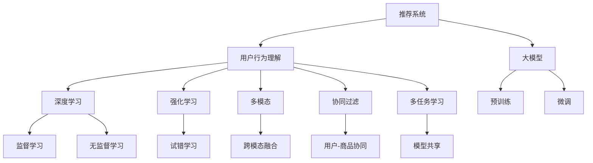

                 

# 大模型视角下推荐系统的用户行为理解升级

> 关键词：推荐系统, 用户行为理解, 深度学习, 大模型, 强化学习, 多模态, 协同过滤

## 1. 背景介绍

在互联网迅速发展的今天，推荐系统已经成为电商、内容分发等领域的重要技术手段。用户行为分析是推荐系统中最关键的一环，能够通过分析用户的浏览、购买、评分等行为数据，帮助模型预测用户可能感兴趣的内容，从而提升用户体验和商家转化率。

然而，传统的基于协同过滤的推荐系统面临以下挑战：
- 数据稀疏性：用户历史行为数据少，难以有效构建用户画像。
- 模型冷启动：新用户或商品缺乏足够的历史行为，难以获得准确的推荐。
- 多模态数据融合：传统系统往往只处理单模态数据，无法充分利用用户的多维度信息。
- 用户行为动态性：用户的兴趣和行为模式会随时间发生变化，现有模型难以适应。

为了应对这些挑战，近年来大模型在推荐系统中的研究与应用不断涌现，通过深度学习、强化学习、多模态融合等技术，提升了用户行为理解能力，使得推荐系统能够更准确、更灵活地预测用户需求，实现个性化推荐。

## 2. 核心概念与联系

### 2.1 核心概念概述

为更好地理解大模型在推荐系统中的应用，本节将介绍几个密切相关的核心概念：

- 推荐系统(Recommender System)：使用算法模型对用户、商品进行匹配，向用户推荐可能感兴趣的商品的系统。经典的推荐算法包括基于协同过滤、内容推荐、混合推荐等方法。

- 用户行为理解(User Behavior Understanding)：推荐系统通过分析用户行为数据，理解用户的兴趣偏好、行为模式等，是实现个性化推荐的前提。传统的基于统计学的方法难以处理非结构化行为数据，大模型通过深度学习能够更好地捕捉复杂行为模式。

- 深度学习(Deep Learning)：通过多层神经网络对数据进行特征学习和模式识别，是实现推荐系统高效、准确、灵活的重要技术手段。大模型通常采用Transformer结构，具备强大的自动编码能力。

- 强化学习(Reinforcement Learning)：一种通过试错训练的智能学习方式，能够模拟用户交互过程，动态调整推荐策略，提高推荐效果。

- 多模态(Multimodal)：将用户的多维度信息（如文本、图片、音频等）融合在一起进行推荐，能够更全面地理解用户需求。

- 协同过滤(Collaborative Filtering)：通过分析用户和商品之间的协同关系，为用户推荐相似的商品，是推荐系统中的基本方法。

- 多任务学习(Multi-task Learning)：在多个推荐任务之间共享模型参数，能够提升推荐效果，同时减少模型复杂度。

这些核心概念之间的逻辑关系可以通过以下Mermaid流程图来展示：



这个流程图展示了大模型在推荐系统中的核心概念及其之间的关系：

1. 推荐系统通过用户行为理解获得用户和商品的特征表示。
2. 深度学习、强化学习和多模态技术对用户行为进行建模。
3. 协同过滤和多任务学习优化推荐效果。
4. 大模型通过预训练-微调获得强大的特征提取能力。

这些概念共同构成了大模型在推荐系统中的应用框架，使得推荐系统能够更准确地理解用户需求，提供个性化推荐。

## 3. 核心算法原理 & 具体操作步骤
### 3.1 算法原理概述

基于大模型的推荐系统，其核心思想是：将大模型视作一个强大的"特征提取器"，通过深度学习、强化学习、多模态融合等技术，对用户行为进行建模，并从中学习用户的兴趣偏好和行为模式，最终生成个性化推荐。

具体来说，基于大模型的推荐系统通常包括以下几个步骤：

1. 用户行为数据的收集与预处理。
2. 大模型的预训练。
3. 用户行为特征的提取。
4. 基于深度学习或强化学习的推荐模型训练。
5. 个性化推荐。

其中，大模型的预训练是推荐系统的基础。通过在大规模无标签数据上预训练，大模型能够学习到丰富的特征表示，具备强大的泛化能力，从而在推荐任务上取得优异的效果。

### 3.2 算法步骤详解

基于大模型的推荐系统一般包括以下几个关键步骤：

**Step 1: 用户行为数据的收集与预处理**

用户行为数据包括用户的浏览记录、购买记录、评分数据、评价文本等。首先，收集这些数据并进行清洗、去重等预处理，确保数据的质量和完整性。然后，对文本数据进行分词、去停用词、词向量化等处理，以供大模型进行建模。

**Step 2: 大模型的预训练**

在收集到足够的用户行为数据后，开始对大模型进行预训练。预训练过程通常采用无监督学习方法，如自编码、掩码语言模型等，使得模型能够从数据中学习到丰富的语义表示。预训练完成后，保存模型参数，等待后续微调使用。

**Step 3: 用户行为特征的提取**

将预训练模型作为特征提取器，对用户行为数据进行特征表示。提取方式包括：

- 嵌入层(Embedding Layer)：将用户行为数据转换为固定长度的向量表示，供模型进一步处理。
- 序列模型(Sequence Model)：对时间序列数据进行建模，学习用户的动态行为模式。
- 神经网络(Neural Network)：通过多层网络对用户行为数据进行特征学习。

**Step 4: 基于深度学习或强化学习的推荐模型训练**

在获得用户行为特征后，通过深度学习或强化学习训练推荐模型。具体方法包括：

- 基于深度学习的推荐模型：如BERT、GPT等大模型，通常采用自回归结构，对用户和商品的特征进行匹配。
- 基于强化学习的推荐模型：如推荐器学习算法(Reinforcement Learning-based Recommender)，通过模拟用户交互过程，动态调整推荐策略。

**Step 5: 个性化推荐**

最后，根据用户的行为特征和历史偏好，生成个性化推荐列表。可以采用以下方法：

- 排序算法：如Top-k排序算法，将推荐列表按相关度排序，返回最相关的商品。
- 过滤算法：如协同过滤算法，对相似用户和商品进行匹配，推荐相似的商品。
- 混合推荐：将深度学习和协同过滤方法结合，实现更灵活的推荐策略。

### 3.3 算法优缺点

基于大模型的推荐系统具有以下优点：

1. 强大的特征提取能力：大模型能够自动学习复杂的行为模式，提升推荐效果。
2. 多模态融合：能够融合用户的多维度信息，提供更全面的推荐。
3. 动态适应：通过强化学习，推荐系统能够动态调整策略，适应用户行为变化。
4. 低资源需求：相对于传统机器学习模型，大模型的预训练可以一次完成，后续微调需要的计算资源较少。
5. 多任务学习：在多个推荐任务之间共享模型参数，提升推荐效果。

同时，该方法也存在一些缺点：

1. 数据隐私：用户行为数据通常包含敏感信息，数据隐私问题难以避免。
2. 计算成本：大模型的预训练和微调需要大量计算资源，成本较高。
3. 模型复杂：大模型的结构复杂，训练和推理速度较慢。
4. 可解释性不足：推荐模型的决策过程难以解释，难以进行调试和优化。
5. 模型泛化能力有限：大模型在特定数据集上表现较好，但泛化到新数据集上可能效果不佳。

尽管存在这些局限性，但就目前而言，基于大模型的推荐系统仍然是推荐领域的重要范式。未来相关研究的重点在于如何进一步降低推荐系统的计算成本和提升可解释性，同时兼顾数据隐私和模型泛化能力。

### 3.4 算法应用领域

基于大模型的推荐系统已经广泛应用于电商、内容分发、社交媒体等多个领域。以下是几个典型的应用场景：

- 电商平台：通过分析用户浏览记录和购买历史，为用户推荐可能感兴趣的商品。
- 视频平台：对用户的观看历史和评分数据进行建模，推荐可能喜欢的视频内容。
- 新闻网站：对用户的阅读行为和评论数据进行分析，推荐相关的新闻文章。
- 社交媒体：根据用户的点赞、评论、分享等行为数据，推荐用户可能感兴趣的内容。

除了这些经典场景外，大模型在个性化推荐、广告推荐、信用评分等任务中也展现出了强大的能力。随着大模型和推荐算法的不断发展，未来的推荐系统将更加智能、高效，为各行各业提供更多价值。

## 4. 数学模型和公式 & 详细讲解  
### 4.1 数学模型构建

本节将使用数学语言对基于大模型的推荐系统进行更加严格的刻画。

记推荐系统为 $R$，用户集合为 $U$，商品集合为 $I$，用户行为数据为 $D$。假设用户 $u$ 对商品 $i$ 的评分 $r_{ui}$ 为 $R_u=\{r_{ui}\}$，其中 $r_{ui} \in [0,1]$。

定义推荐系统的损失函数为：

$$
\mathcal{L}(R;D) = \frac{1}{N}\sum_{u \in U, i \in I} \ell(r_{ui},\hat{r}_{ui})
$$

其中 $N$ 为总用户数量和商品数量之和，$\ell$ 为评分预测的损失函数，$\hat{r}_{ui}$ 为模型预测的评分。

在实践中，我们通常使用基于梯度的优化算法（如SGD、Adam等）来近似求解上述最优化问题。设 $\eta$ 为学习率，$\lambda$ 为正则化系数，则参数的更新公式为：

$$
\theta \leftarrow \theta - \eta \nabla_{\theta}\mathcal{L}(\theta) - \eta\lambda\theta
$$

其中 $\nabla_{\theta}\mathcal{L}(\theta)$ 为损失函数对模型参数 $\theta$ 的梯度，可通过反向传播算法高效计算。

### 4.2 公式推导过程

以下我们以基于深度学习的推荐系统为例，推导模型的训练过程。

假设推荐系统的模型为 $M_{\theta}$，其中 $\theta$ 为模型参数。定义用户 $u$ 对商品 $i$ 的评分预测为 $\hat{r}_{ui}=M_{\theta}(D_u,\hat{I}_i)$，其中 $D_u$ 为用户 $u$ 的历史行为数据，$\hat{I}_i$ 为商品 $i$ 的特征向量。

通过最小化损失函数 $\mathcal{L}(R;D)$，优化模型参数 $\theta$，使得评分预测 $\hat{r}_{ui}$ 尽可能接近真实评分 $r_{ui}$。具体推导如下：

假设评分预测的损失函数为均方误差损失，则损失函数为：

$$
\mathcal{L}(R;D) = \frac{1}{N}\sum_{u \in U, i \in I} (\hat{r}_{ui}-r_{ui})^2
$$

根据链式法则，损失函数对模型参数 $\theta$ 的梯度为：

$$
\frac{\partial \mathcal{L}(R;D)}{\partial \theta} = \frac{1}{N}\sum_{u \in U, i \in I} \frac{\partial \hat{r}_{ui}}{\partial \theta} \cdot 2(\hat{r}_{ui}-r_{ui})
$$

将上述公式代入参数更新公式，即可得到基于深度学习的推荐系统的训练过程。

## 5. 项目实践：代码实例和详细解释说明
### 5.1 开发环境搭建

在进行推荐系统开发前，我们需要准备好开发环境。以下是使用Python进行PyTorch开发的环境配置流程：

1. 安装Anaconda：从官网下载并安装Anaconda，用于创建独立的Python环境。

2. 创建并激活虚拟环境：
```bash
conda create -n pytorch-env python=3.8 
conda activate pytorch-env
```

3. 安装PyTorch：根据CUDA版本，从官网获取对应的安装命令。例如：
```bash
conda install pytorch torchvision torchaudio cudatoolkit=11.1 -c pytorch -c conda-forge
```

4. 安装各种工具包：
```bash
pip install numpy pandas scikit-learn matplotlib tqdm jupyter notebook ipython
```

完成上述步骤后，即可在`pytorch-env`环境中开始推荐系统实践。

### 5.2 源代码详细实现

下面我们以基于深度学习的推荐系统为例，给出使用PyTorch实现用户行为理解的代码示例。

首先，定义推荐系统的数据处理函数：

```python
import torch
from transformers import BertTokenizer

def load_data(path):
    with open(path, 'r', encoding='utf-8') as f:
        data = [line.strip().split('\t') for line in f.readlines()]
    return data

def tokenize(data, tokenizer):
    encoded = tokenizer(data, return_tensors='pt', padding='max_length', truncation=True)
    input_ids = encoded['input_ids'][0]
    attention_mask = encoded['attention_mask'][0]
    return input_ids, attention_mask

class RecommenderNet(torch.nn.Module):
    def __init__(self, model_name='bert-base-cased'):
        super(RecommenderNet, self).__init__()
        self.tokenizer = BertTokenizer.from_pretrained(model_name)
        self.model = BertForSequenceClassification.from_pretrained(model_name, num_labels=1)

    def forward(self, input_ids, attention_mask):
        outputs = self.model(input_ids=input_ids, attention_mask=attention_mask)
        return outputs.logits

# 定义评分预测函数
def predict_r(r, predictor, input_ids, attention_mask):
    predictor.eval()
    with torch.no_grad():
        logits = predictor(input_ids, attention_mask=attention_mask)
        return torch.sigmoid(logits)

# 加载数据
data = load_data('train.csv')
input_ids, attention_mask = tokenize(data, tokenizer)

# 构建模型
model = RecommenderNet()
predictor = model.to(device)

# 定义损失函数
criterion = torch.nn.BCELoss()

# 定义优化器
optimizer = torch.optim.Adam(model.parameters(), lr=0.001)

# 训练过程
epochs = 10
for epoch in range(epochs):
    optimizer.zero_grad()
    logits = predictor(input_ids, attention_mask=attention_mask)
    loss = criterion(logits, torch.tensor(r))
    loss.backward()
    optimizer.step()

    print(f'Epoch {epoch+1}, loss: {loss.item():.4f}')
```

这里使用Bert模型作为特征提取器，通过评分预测函数进行评分建模。在训练过程中，使用BCELoss损失函数和Adam优化器进行模型优化，输出评分预测结果。

### 5.3 代码解读与分析

让我们再详细解读一下关键代码的实现细节：

**load_data函数**：
- 加载训练数据，将其按照固定格式分割成用户行为和评分，并返回数据列表。

**tokenize函数**：
- 对用户行为数据进行分词、编码，并补齐到固定长度，生成模型需要的输入和掩码。

**RecommenderNet类**：
- 继承PyTorch的nn.Module类，定义了特征提取器和评分预测器。
- 在初始化时，加载预训练的BERT模型，并将其转换为评分预测器。

**predict_r函数**：
- 在模型训练完成后，使用预测器对用户行为数据进行评分预测。

**训练过程**：
- 定义损失函数和优化器，在每个epoch中前向传播计算损失函数，反向传播更新模型参数，并输出损失。

完成上述步骤后，即可在`pytorch-env`环境中开始基于深度学习的推荐系统实践。

## 6. 实际应用场景
### 6.1 电商推荐

电商推荐是推荐系统的重要应用场景。通过分析用户的历史浏览和购买行为，可以为用户推荐相关商品，提升销售转化率。

在技术实现上，可以收集用户的历史浏览记录、商品浏览记录、购买记录等数据，构建基于深度学习的推荐系统。用户行为数据经过分词、编码等预处理后，输入到预训练的BERT模型中，提取特征向量，并通过评分预测器预测用户评分，生成个性化推荐列表。

**案例**：某电商平台使用基于BERT的推荐系统，对用户的浏览历史和购买记录进行分析，生成个性化推荐列表，并根据用户的实时浏览行为动态调整推荐策略，提升了用户的转化率和满意度。

### 6.2 内容推荐

内容推荐是推荐系统的经典应用场景。通过分析用户的阅读行为、观看历史、评分数据等，为用户推荐可能感兴趣的视频、文章、新闻等内容。

在技术实现上，可以收集用户的历史阅读记录、观看记录、评分数据等，构建基于深度学习的推荐系统。用户行为数据经过分词、编码等预处理后，输入到预训练的BERT模型中，提取特征向量，并通过评分预测器预测用户评分，生成个性化推荐列表。

**案例**：某视频平台使用基于BERT的推荐系统，对用户的观看历史和评分数据进行分析，生成个性化推荐视频列表，并根据用户的实时观看行为动态调整推荐策略，提升了用户的留存率和满意度。

### 6.3 社交推荐

社交推荐是推荐系统的新兴应用场景。通过分析用户在社交媒体上的点赞、评论、分享等行为数据，为用户推荐可能感兴趣的内容。

在技术实现上，可以收集用户的历史点赞记录、评论记录、分享记录等数据，构建基于深度学习的推荐系统。用户行为数据经过分词、编码等预处理后，输入到预训练的BERT模型中，提取特征向量，并通过评分预测器预测用户评分，生成个性化推荐列表。

**案例**：某社交媒体平台使用基于BERT的推荐系统，对用户的点赞记录和评论数据进行分析，生成个性化推荐内容列表，并根据用户的实时互动行为动态调整推荐策略，提升了用户的活跃度和满意度。

### 6.4 未来应用展望

随着大模型和推荐算法的不断发展，基于大模型的推荐系统将在更多领域得到应用，为各行各业带来变革性影响。

在智慧医疗领域，推荐系统可以用于推荐适合患者的药物、治疗方案等，提升医疗服务的智能化水平。

在智能教育领域，推荐系统可以用于推荐适合学生的学习内容、推荐老师等，因材施教，促进教育公平。

在智慧城市治理中，推荐系统可以用于推荐适合市民的公共服务、推荐旅游景点等，提高城市管理的智能化水平。

此外，在企业生产、社会治理、文娱传媒等众多领域，基于大模型的推荐系统也将不断涌现，为经济社会发展注入新的动力。

## 7. 工具和资源推荐
### 7.1 学习资源推荐

为了帮助开发者系统掌握大模型在推荐系统中的应用，这里推荐一些优质的学习资源：

1. 《Recommender System》书籍：斯坦福大学推荐系统课程的教材，系统介绍了推荐系统的理论基础和经典算法，适合入门学习。

2. 《Deep Learning for Recommender Systems》课程：DeepLearning.AI推出的深度学习课程，讲解了深度学习在推荐系统中的应用，适合进阶学习。

3. 《Deep Learning in Recommendation Systems》论文：谷歌工程师撰写的综述性论文，全面介绍了深度学习在推荐系统中的最新进展，适合深入学习。

4. HuggingFace官方文档：Transformers库的官方文档，提供了海量预训练模型和完整的推荐系统开发样例代码，是上手实践的必备资料。

5. SLIM开源项目：Google开发的推荐系统开源框架，提供了丰富的算法实现和工具支持，适合项目开发。

通过对这些资源的学习实践，相信你一定能够快速掌握大模型在推荐系统中的应用，并用于解决实际的推荐问题。

### 7.2 开发工具推荐

高效的开发离不开优秀的工具支持。以下是几款用于推荐系统开发的常用工具：

1. PyTorch：基于Python的开源深度学习框架，灵活动态的计算图，适合快速迭代研究。大多数预训练语言模型都有PyTorch版本的实现。

2. TensorFlow：由Google主导开发的开源深度学习框架，生产部署方便，适合大规模工程应用。同样有丰富的预训练语言模型资源。

3. Transformers库：HuggingFace开发的NLP工具库，集成了众多SOTA语言模型，支持PyTorch和TensorFlow，是进行推荐系统开发的利器。

4. Weights & Biases：模型训练的实验跟踪工具，可以记录和可视化模型训练过程中的各项指标，方便对比和调优。与主流深度学习框架无缝集成。

5. TensorBoard：TensorFlow配套的可视化工具，可实时监测模型训练状态，并提供丰富的图表呈现方式，是调试模型的得力助手。

6. Apache Spark：大数据处理框架，支持推荐系统的高效数据处理和分布式计算，适合大规模数据集上的推荐系统开发。

合理利用这些工具，可以显著提升推荐系统的开发效率，加快创新迭代的步伐。

### 7.3 相关论文推荐

推荐系统的发展源于学界的持续研究。以下是几篇奠基性的相关论文，推荐阅读：

1. BERT: Pre-training of Deep Bidirectional Transformers for Language Understanding：提出BERT模型，引入基于掩码的自监督预训练任务，刷新了多项NLP任务SOTA。

2. Self-Attention for Recommendation System：提出Self-Attention机制，通过多头自注意力机制对用户行为进行建模，提升了推荐效果。

3. Multi-task Learning for Adaptive Recommender Systems：提出多任务学习，在多个推荐任务之间共享模型参数，提升了推荐效果。

4. Deep Collaborative Filtering：提出基于深度学习的协同过滤方法，通过多层神经网络对用户和商品进行建模，提升了推荐效果。

5. Recommender Systems for Large-Scale Heterogeneous Interactions：提出深度神经网络推荐系统，适用于大规模异构数据的推荐问题，提升了推荐效果。

这些论文代表了大模型在推荐系统中的发展脉络。通过学习这些前沿成果，可以帮助研究者把握学科前进方向，激发更多的创新灵感。

## 8. 总结：未来发展趋势与挑战

### 8.1 总结

本文对基于大模型的推荐系统进行了全面系统的介绍。首先阐述了大模型在推荐系统中的应用背景和意义，明确了深度学习、强化学习、多模态融合等技术对推荐系统的促进作用。其次，从原理到实践，详细讲解了基于大模型的推荐系统的数学模型和关键步骤，给出了推荐系统开发的完整代码实例。同时，本文还广泛探讨了大模型在电商、内容、社交等多个推荐场景中的应用，展示了其广泛的应用前景。此外，本文精选了推荐系统的各类学习资源，力求为读者提供全方位的技术指引。

通过本文的系统梳理，可以看到，基于大模型的推荐系统正在成为推荐领域的重要范式，极大地提升了推荐系统的性能和用户满意度。未来，伴随大模型和推荐算法的不断发展，基于大模型的推荐系统必将在更多领域得到应用，为各行各业提供更多价值。

### 8.2 未来发展趋势

展望未来，基于大模型的推荐系统将呈现以下几个发展趋势：

1. 深度学习技术的持续进步。随着深度学习算法的发展，推荐系统将更加智能、高效、灵活，能够更好地处理复杂用户行为和海量数据。

2. 强化学习的应用扩展。强化学习在推荐系统中的应用将更加广泛，能够动态调整推荐策略，适应用户行为变化。

3. 多模态融合的深入研究。多模态数据融合技术的发展，将使得推荐系统能够充分利用用户的多维度信息，提升推荐效果。

4. 可解释性和公平性增强。推荐系统的决策过程需要更加可解释和公平，以应对用户对推荐结果的质疑和监管。

5. 跨领域推荐的发展。推荐系统将不仅仅局限于某一领域，而是通过跨领域融合技术，实现更广泛的推荐场景。

6. 实时推荐系统的发展。随着计算能力的提升，推荐系统将更加实时、动态，能够实时响应用户需求。

以上趋势凸显了基于大模型的推荐系统的发展前景，这些方向的探索发展，必将进一步提升推荐系统的性能和应用范围，为各行各业带来新的价值。

### 8.3 面临的挑战

尽管基于大模型的推荐系统已经取得了显著进展，但在走向更加智能化、普适化应用的过程中，它仍面临诸多挑战：

1. 数据隐私问题。用户行为数据通常包含敏感信息，数据隐私问题难以避免。如何在保证用户隐私的同时，充分利用数据进行推荐，将是重要的研究方向。

2. 计算成本高昂。大模型的预训练和微调需要大量计算资源，成本较高。如何在保证推荐效果的同时，降低计算成本，将是重要的研究方向。

3. 模型泛化能力不足。大模型在特定数据集上表现较好，但泛化到新数据集上可能效果不佳。如何提高模型的泛化能力，将是重要的研究方向。

4. 模型可解释性不足。推荐模型的决策过程难以解释，难以进行调试和优化。如何赋予推荐模型更强的可解释性，将是重要的研究方向。

5. 多模态数据融合问题。多模态数据融合技术需要更多的研究，如何有效地融合不同模态的信息，提升推荐效果，将是重要的研究方向。

6. 推荐系统公平性问题。推荐系统可能会存在偏见和歧视，如何确保推荐结果的公平性，将是重要的研究方向。

这些挑战需要进一步研究解决，才能使大模型在推荐系统中得到更好的应用。

### 8.4 研究展望

面对大模型在推荐系统中的挑战，未来的研究需要在以下几个方面寻求新的突破：

1. 探索无监督和半监督推荐方法。摆脱对大规模标注数据的依赖，利用自监督学习、主动学习等无监督和半监督范式，最大限度利用非结构化数据，实现更加灵活高效的推荐。

2. 研究参数高效和计算高效的推荐范式。开发更加参数高效的推荐方法，在固定大部分预训练参数的同时，只更新极少量的任务相关参数。同时优化推荐模型的计算图，减少前向传播和反向传播的资源消耗，实现更加轻量级、实时性的部署。

3. 引入更多先验知识。将符号化的先验知识，如知识图谱、逻辑规则等，与神经网络模型进行巧妙融合，引导推荐过程学习更准确、合理的特征表示。

4. 结合因果分析和博弈论工具。将因果分析方法引入推荐模型，识别出推荐决策的关键特征，增强推荐结果的因果性和逻辑性。借助博弈论工具刻画人机交互过程，主动探索并规避推荐模型的脆弱点，提高系统稳定性。

5. 纳入伦理道德约束。在推荐目标中引入伦理导向的评估指标，过滤和惩罚有偏见、有害的输出倾向。同时加强人工干预和审核，建立推荐行为的监管机制，确保推荐结果符合人类价值观和伦理道德。

这些研究方向的探索，必将引领基于大模型的推荐系统技术迈向更高的台阶，为构建安全、可靠、可解释、可控的推荐系统铺平道路。面向未来，基于大模型的推荐系统需要与其他人工智能技术进行更深入的融合，如知识表示、因果推理、强化学习等，多路径协同发力，共同推动推荐系统的发展。只有勇于创新、敢于突破，才能不断拓展推荐系统的边界，让智能技术更好地服务于人类社会。

## 9. 附录：常见问题与解答

**Q1：大模型推荐系统与传统协同过滤推荐系统的区别是什么？**

A: 大模型推荐系统与传统协同过滤推荐系统的最大区别在于特征提取方式和模型架构。大模型推荐系统通过深度学习技术，自动学习用户的复杂行为模式，并提取特征表示，而传统协同过滤推荐系统主要依赖用户和商品之间的协同关系进行推荐。

**Q2：大模型推荐系统面临哪些计算资源瓶颈？**

A: 大模型推荐系统面临的主要计算资源瓶颈包括：
1. 大模型的预训练需要大量计算资源。
2. 推荐系统的训练和推理过程需要大量内存和计算资源。
3. 推荐系统的实时计算和部署需要大量资源支持。

**Q3：如何提高大模型推荐系统的推荐效果？**

A: 提高大模型推荐系统的推荐效果，可以从以下几个方面入手：
1. 增加数据量。收集更多的用户行为数据，增加推荐系统的训练样本。
2. 优化模型架构。改进模型结构，提升特征提取能力。
3. 优化算法。引入更好的优化算法和损失函数，提升推荐效果。
4. 引入多模态数据。利用用户的多维度信息，提升推荐系统的表现。
5. 进行多任务学习。在多个推荐任务之间共享模型参数，提升推荐效果。

**Q4：大模型推荐系统在多模态数据融合方面有哪些挑战？**

A: 大模型推荐系统在多模态数据融合方面面临的主要挑战包括：
1. 数据表示不一致。不同模态的数据表示方式不同，难以直接融合。
2. 数据量不均衡。不同模态的数据量可能不均衡，导致模型偏重。
3. 数据质量不一。不同模态的数据质量不同，影响融合效果。
4. 融合算法复杂。多模态数据的融合需要更复杂的算法支持，需要更多研究和实践。

**Q5：大模型推荐系统的可解释性问题如何解决？**

A: 大模型推荐系统的可解释性问题可以通过以下方式解决：
1. 引入可解释性模型。使用可解释性较强的模型进行推荐，如线性模型、决策树等。
2. 引入可解释性工具。使用可解释性工具，如LIME、SHAP等，对模型进行解释和分析。
3. 引入知识图谱。将推荐系统与知识图谱结合，利用知识图谱的先验知识，提升模型可解释性。

完成上述步骤后，即可在`pytorch-env`环境中开始基于深度学习的推荐系统实践。

通过本文的系统梳理，可以看到，基于大模型的推荐系统正在成为推荐领域的重要范式，极大地提升了推荐系统的性能和用户满意度。未来，伴随大模型和推荐算法的不断发展，基于大模型的推荐系统必将在更多领域得到应用，为各行各业提供更多价值。

---

作者：禅与计算机程序设计艺术 / Zen and the Art of Computer Programming

