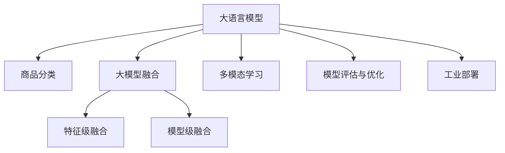

                 

# 大模型赋能的智能商品分类系统

> 关键词：大模型,商品分类,智能推荐,模型融合,计算机视觉,多模态学习,工业部署

## 1. 背景介绍

在当今信息爆炸的时代，互联网购物平台正以惊人的速度发展。然而，海量商品信息的分类、推荐、排序等任务，依然依赖于传统的人工标注和规则引擎，难以满足用户日益增长的个性化需求。为了突破这一瓶颈，借助大语言模型和大模型融合技术的智能商品分类系统应运而生。

### 1.1 问题由来

大语言模型如BERT、GPT等，通过在大规模无标签文本数据上进行预训练，能够学习到丰富的语言知识。然而，这些模型通常需要从有标签数据中提取特征进行微调，才能应用于具体任务。对于商品分类这样的任务，获取大量高质量的标注数据成本极高。

商品分类系统需要快速、准确地将商品划分为不同的类别，为用户提供个性化的推荐。传统基于规则的分类方法往往需要人工编写复杂的分类规则，难以覆盖商品的多样性和变化性。同时，随着商品数量和种类的爆炸性增长，基于规则的分类系统难以维护和更新。

智能商品分类系统通过融合大语言模型和大模型融合技术，能够高效、准确地分类商品，大幅提升用户体验。基于大模型的分类系统，不仅能够覆盖商品的多样性，还能快速应对新的商品类别，适应性更强，更易于维护和扩展。

### 1.2 问题核心关键点

构建智能商品分类系统，核心关键点在于：
- 如何将大语言模型与商品分类任务有效结合？
- 如何通过大模型融合技术，提升商品分类的准确性？
- 如何将模型部署到工业级应用中，实现高效、稳定的商品分类服务？

本文将围绕以上问题，详细阐述大模型赋能的智能商品分类系统的原理、实践及应用。

## 2. 核心概念与联系

### 2.1 核心概念概述

为了更好地理解智能商品分类系统，本节将介绍几个密切相关的核心概念：

- 大语言模型(Large Language Model, LLM)：以自回归(如GPT)或自编码(如BERT)模型为代表的大规模预训练语言模型。通过在大规模无标签文本语料上进行预训练，学习通用的语言表示，具备强大的语言理解和生成能力。

- 商品分类：将商品根据属性和特征划分为不同的类别。常见商品分类方法包括基于规则的分类、基于机器学习的分类等。

- 大模型融合技术：通过将多个预训练模型或模型组件进行线性组合，获得比单一模型更好的表现。常见融合方式包括特征级融合、模型级融合等。

- 多模态学习：利用多源数据(如文本、图像、声音等)进行综合学习，提升模型的鲁棒性和泛化能力。

- 模型评估与优化：通过交叉验证、A/B测试等手段评估模型性能，结合优化算法(如AdamW、SGD等)进行超参数调整，提升模型效果。

- 工业部署：将模型封装为标准化的服务接口，部署到高性能服务器中，提供稳定、高效的服务。

这些核心概念之间的逻辑关系可以通过以下Mermaid流程图来展示：



这个流程图展示了大语言模型、商品分类、大模型融合、多模态学习、模型评估与优化、工业部署等核心概念及其之间的关系：

1. 大语言模型通过预训练获得基础能力。
2. 商品分类任务通过微调大语言模型进行适配，获得针对具体任务优化的模型。
3. 通过大模型融合技术，将多源数据结合，提升分类性能。
4. 利用多模态学习，增加商品分类任务的特征多样性。
5. 通过模型评估与优化，调整模型参数，提升分类效果。
6. 通过工业部署，将模型封装为标准服务接口，实现高效、稳定的商品分类服务。

这些概念共同构成了智能商品分类系统的核心框架，使其能够高效、准确地进行商品分类。通过理解这些核心概念，我们可以更好地把握系统的工作原理和优化方向。

## 3. 核心算法原理 & 具体操作步骤
### 3.1 算法原理概述

智能商品分类系统通过融合大语言模型和大模型融合技术，构建多源数据结合的分类模型。具体实现流程如下：

1. 收集商品标签数据。收集有标注的商品数据，涵盖商品图片、描述、价格等关键特征。

2. 构建大模型融合网络。将大语言模型与预训练的计算机视觉模型(如ResNet)融合，利用多源数据提升分类效果。

3. 微调大语言模型。对大语言模型进行微调，使其能够理解商品描述和图片，提取特征进行分类。

4. 特征级融合。通过特征级融合，将大语言模型提取的文本特征与计算机视觉模型提取的图像特征结合，提升分类性能。

5. 模型级融合。通过模型级融合，将大语言模型和大模型融合网络结合，形成统一的分类模型。

6. 多模态学习。利用多模态学习技术，结合文本、图像等多种特征，增强分类模型的泛化能力。

7. 模型评估与优化。通过交叉验证、A/B测试等手段评估模型性能，结合优化算法调整模型参数，提升分类效果。

8. 工业部署。将模型封装为标准服务接口，部署到高性能服务器中，提供稳定、高效的商品分类服务。

### 3.2 算法步骤详解

以下我们将详细介绍智能商品分类系统的各个步骤：

**Step 1: 收集商品标签数据**
- 收集商品图片、描述、价格等关键特征数据，构建商品标签集。
- 对商品标签进行标注，涵盖商品类别和价格范围等信息。
- 数据清洗和预处理，确保数据质量和一致性。

**Step 2: 构建大模型融合网络**
- 选择合适的预训练计算机视觉模型(如ResNet)作为基础网络，进行迁移学习。
- 在大模型融合网络中，加入大语言模型层，利用文本和图像特征进行分类。
- 定义网络结构，包含卷积层、池化层、全连接层、大语言模型层等。

**Step 3: 微调大语言模型**
- 使用商品标签数据对大语言模型进行微调，使其能够理解商品描述和图片。
- 设计合适的任务适配层，定义损失函数和优化器。
- 调整学习率、批次大小等超参数，进行模型训练。

**Step 4: 特征级融合**
- 通过特征级融合技术，将大语言模型提取的文本特征与计算机视觉模型提取的图像特征结合。
- 利用Attention机制，对文本和图像特征进行加权融合。
- 定义融合后的特征向量，用于后续的分类任务。

**Step 5: 模型级融合**
- 通过模型级融合技术，将大语言模型和大模型融合网络结合，形成统一的分类模型。
- 定义分类任务的目标函数，如交叉熵损失。
- 训练模型，调整融合权重，提升分类效果。

**Step 6: 多模态学习**
- 利用多模态学习技术，结合文本、图像等多种特征，增强分类模型的泛化能力。
- 定义多模态学习框架，涵盖文本、图像、声音等多种特征。
- 训练多模态模型，优化多源数据的特征表示和融合方式。

**Step 7: 模型评估与优化**
- 通过交叉验证、A/B测试等手段评估模型性能，计算准确率、召回率等指标。
- 结合优化算法(如AdamW、SGD等)调整模型参数，提升分类效果。
- 定期进行模型迭代，更新数据和特征，保持模型性能。

**Step 8: 工业部署**
- 将模型封装为标准服务接口，支持RESTful API接口。
- 部署模型到高性能服务器中，实现实时商品分类服务。
- 利用缓存、负载均衡等技术，提升系统的扩展性和稳定性。

### 3.3 算法优缺点

智能商品分类系统利用大模型融合和多模态学习技术，具备以下优点：
1. 多源数据融合。结合文本、图像、声音等多种特征，提升分类性能。
2. 泛化能力强。通过多模态学习，模型能够适应不同场景和数据分布。
3. 效率高。预训练模型和大模型融合网络提高了分类速度，支持实时处理。
4. 可扩展性强。多模态融合模型可以不断扩展，支持新的特征和数据源。

同时，该系统也存在以下局限性：
1. 标注数据成本高。大规模商品数据标注需要大量人力和成本。
2. 模型复杂度高。多模态融合模型结构复杂，需要更多计算资源。
3. 模型泛化能力受限。预训练模型的偏见可能传递到分类任务中，影响泛化能力。
4. 工业部署难度大。模型部署到高性能服务器中，需要考虑系统架构和性能优化。

尽管存在这些局限性，但就目前而言，利用大模型融合和多模态学习技术的智能商品分类系统，仍然是大规模商品分类任务的主流范式。未来相关研究的重点在于如何进一步降低标注数据成本，提高模型的泛化能力和效率，同时兼顾工业部署的便捷性和稳定性。

### 3.4 算法应用领域

智能商品分类系统已经在零售、电商、物流等多个领域得到了广泛的应用，具体包括：

- 商品标签分类：对商品图片、描述进行分类，辅助商品搜索和推荐。
- 质量控制：利用商品图片和描述进行质量检测，筛选劣质商品。
- 库存管理：通过商品分类和统计，优化库存管理和调配。
- 价格分析：对商品价格进行分类和分析，制定合理的定价策略。
- 客户服务：利用商品分类结果，提供个性化的客户服务支持。

除了以上这些经典应用外，智能商品分类系统还被创新性地应用到更多场景中，如个性化推荐、商品检索、数据分析等，为电商平台的运营管理带来了新的突破。随着大语言模型和融合技术的不断发展，智能商品分类系统将进一步拓展应用范围，为电商企业的数字化转型提供新的技术支撑。

## 4. 数学模型和公式 & 详细讲解 & 举例说明
### 4.1 数学模型构建

假设智能商品分类系统的大模型融合网络为 $M_{\theta}:\mathcal{X} \rightarrow \mathcal{Y}$，其中 $\mathcal{X}$ 为输入空间，$\mathcal{Y}$ 为输出空间，$\theta \in \mathbb{R}^d$ 为模型参数。给定商品分类任务 $T$ 的训练集 $D=\{(x_i,y_i)\}_{i=1}^N, x_i \in \mathcal{X}, y_i \in \mathcal{Y}$。

定义模型 $M_{\theta}$ 在输入 $x$ 上的分类损失函数为 $\ell(M_{\theta}(x),y)$，则在数据集 $D$ 上的经验风险为：

$$
\mathcal{L}(\theta) = \frac{1}{N} \sum_{i=1}^N \ell(M_{\theta}(x_i),y_i)
$$

其中 $\ell(M_{\theta}(x),y)$ 为交叉熵损失函数：

$$
\ell(M_{\theta}(x),y) = -y \log M_{\theta}(x) - (1-y) \log (1-M_{\theta}(x))
$$

微调的目标是最小化经验风险，即找到最优参数：

$$
\theta^* = \mathop{\arg\min}_{\theta} \mathcal{L}(\theta)
$$

在实践中，我们通常使用基于梯度的优化算法（如SGD、Adam等）来近似求解上述最优化问题。设 $\eta$ 为学习率，$\lambda$ 为正则化系数，则参数的更新公式为：

$$
\theta \leftarrow \theta - \eta \nabla_{\theta}\mathcal{L}(\theta) - \eta\lambda\theta
$$

其中 $\nabla_{\theta}\mathcal{L}(\theta)$ 为损失函数对参数 $\theta$ 的梯度，可通过反向传播算法高效计算。

### 4.2 公式推导过程

以二分类任务为例，推导交叉熵损失函数及其梯度的计算公式。

假设模型 $M_{\theta}$ 在输入 $x$ 上的输出为 $\hat{y}=M_{\theta}(x) \in [0,1]$，表示样本属于正类的概率。真实标签 $y \in \{0,1\}$。则二分类交叉熵损失函数定义为：

$$
\ell(M_{\theta}(x),y) = -[y\log \hat{y} + (1-y)\log (1-\hat{y})]
$$

将其代入经验风险公式，得：

$$
\mathcal{L}(\theta) = -\frac{1}{N}\sum_{i=1}^N [y_i\log M_{\theta}(x_i)+(1-y_i)\log(1-M_{\theta}(x_i))]
$$

根据链式法则，损失函数对参数 $\theta_k$ 的梯度为：

$$
\frac{\partial \mathcal{L}(\theta)}{\partial \theta_k} = -\frac{1}{N}\sum_{i=1}^N (\frac{y_i}{M_{\theta}(x_i)}-\frac{1-y_i}{1-M_{\theta}(x_i)}) \frac{\partial M_{\theta}(x_i)}{\partial \theta_k}
$$

其中 $\frac{\partial M_{\theta}(x_i)}{\partial \theta_k}$ 可进一步递归展开，利用自动微分技术完成计算。

在得到损失函数的梯度后，即可带入参数更新公式，完成模型的迭代优化。重复上述过程直至收敛，最终得到适应商品分类任务的最优模型参数 $\theta^*$。

### 4.3 案例分析与讲解

下面以零售电商商品分类为例，详细讲解基于大模型融合的智能商品分类系统：

**Step 1: 数据收集与预处理**

- 收集商品图片、描述、价格等关键特征数据。
- 对数据进行清洗和预处理，去除噪声和异常值，确保数据质量和一致性。

**Step 2: 构建大模型融合网络**

- 选择预训练计算机视觉模型(如ResNet)，进行迁移学习，提取图像特征。
- 在大模型融合网络中，加入大语言模型层，利用文本和图像特征进行分类。
- 定义融合后的特征向量，用于后续的分类任务。

**Step 3: 微调大语言模型**

- 使用商品标签数据对大语言模型进行微调，使其能够理解商品描述和图片。
- 设计合适的任务适配层，定义损失函数和优化器。
- 调整学习率、批次大小等超参数，进行模型训练。

**Step 4: 特征级融合**

- 通过特征级融合技术，将大语言模型提取的文本特征与计算机视觉模型提取的图像特征结合。
- 利用Attention机制，对文本和图像特征进行加权融合。
- 定义融合后的特征向量，用于后续的分类任务。

**Step 5: 模型级融合**

- 通过模型级融合技术，将大语言模型和大模型融合网络结合，形成统一的分类模型。
- 定义分类任务的目标函数，如交叉熵损失。
- 训练模型，调整融合权重，提升分类效果。

**Step 6: 多模态学习**

- 利用多模态学习技术，结合文本、图像等多种特征，增强分类模型的泛化能力。
- 定义多模态学习框架，涵盖文本、图像、声音等多种特征。
- 训练多模态模型，优化多源数据的特征表示和融合方式。

**Step 7: 模型评估与优化**

- 通过交叉验证、A/B测试等手段评估模型性能，计算准确率、召回率等指标。
- 结合优化算法(如AdamW、SGD等)调整模型参数，提升分类效果。
- 定期进行模型迭代，更新数据和特征，保持模型性能。

**Step 8: 工业部署**

- 将模型封装为标准服务接口，支持RESTful API接口。
- 部署模型到高性能服务器中，实现实时商品分类服务。
- 利用缓存、负载均衡等技术，提升系统的扩展性和稳定性。

通过以上步骤，智能商品分类系统能够高效、准确地进行商品分类，满足电商平台的业务需求。

## 5. 项目实践：代码实例和详细解释说明
### 5.1 开发环境搭建

在进行商品分类系统的开发前，我们需要准备好开发环境。以下是使用Python进行PyTorch开发的环境配置流程：

1. 安装Anaconda：从官网下载并安装Anaconda，用于创建独立的Python环境。

2. 创建并激活虚拟环境：
```bash
conda create -n pytorch-env python=3.8 
conda activate pytorch-env
```

3. 安装PyTorch：根据CUDA版本，从官网获取对应的安装命令。例如：
```bash
conda install pytorch torchvision torchaudio cudatoolkit=11.1 -c pytorch -c conda-forge
```

4. 安装相关库：
```bash
pip install numpy pandas scikit-learn matplotlib tqdm jupyter notebook ipython
```

完成上述步骤后，即可在`pytorch-env`环境中开始商品分类系统的开发。

### 5.2 源代码详细实现

这里我们以智能商品分类系统为例，使用PyTorch和Transformers库进行商品分类的代码实现。

首先，定义商品分类的数据处理函数：

```python
from transformers import BertTokenizer
from torch.utils.data import Dataset
import torch

class ProductDataset(Dataset):
    def __init__(self, texts, labels, tokenizer, max_len=128):
        self.texts = texts
        self.labels = labels
        self.tokenizer = tokenizer
        self.max_len = max_len
        
    def __len__(self):
        return len(self.texts)
    
    def __getitem__(self, item):
        text = self.texts[item]
        label = self.labels[item]
        
        encoding = self.tokenizer(text, return_tensors='pt', max_length=self.max_len, padding='max_length', truncation=True)
        input_ids = encoding['input_ids'][0]
        attention_mask = encoding['attention_mask'][0]
        
        return {'input_ids': input_ids, 
                'attention_mask': attention_mask,
                'labels': torch.tensor(label, dtype=torch.long)}
```

然后，定义模型和优化器：

```python
from transformers import BertForTokenClassification, AdamW

model = BertForTokenClassification.from_pretrained('bert-base-cased', num_labels=10)
optimizer = AdamW(model.parameters(), lr=2e-5)
```

接着，定义训练和评估函数：

```python
from torch.utils.data import DataLoader
from tqdm import tqdm
from sklearn.metrics import classification_report

device = torch.device('cuda') if torch.cuda.is_available() else torch.device('cpu')
model.to(device)

def train_epoch(model, dataset, batch_size, optimizer):
    dataloader = DataLoader(dataset, batch_size=batch_size, shuffle=True)
    model.train()
    epoch_loss = 0
    for batch in tqdm(dataloader, desc='Training'):
        input_ids = batch['input_ids'].to(device)
        attention_mask = batch['attention_mask'].to(device)
        labels = batch['labels'].to(device)
        model.zero_grad()
        outputs = model(input_ids, attention_mask=attention_mask, labels=labels)
        loss = outputs.loss
        epoch_loss += loss.item()
        loss.backward()
        optimizer.step()
    return epoch_loss / len(dataloader)

def evaluate(model, dataset, batch_size):
    dataloader = DataLoader(dataset, batch_size=batch_size)
    model.eval()
    preds, labels = [], []
    with torch.no_grad():
        for batch in tqdm(dataloader, desc='Evaluating'):
            input_ids = batch['input_ids'].to(device)
            attention_mask = batch['attention_mask'].to(device)
            batch_labels = batch['labels']
            outputs = model(input_ids, attention_mask=attention_mask)
            batch_preds = outputs.logits.argmax(dim=2).to('cpu').tolist()
            batch_labels = batch_labels.to('cpu').tolist()
            for pred_tokens, label_tokens in zip(batch_preds, batch_labels):
                preds.append(pred_tokens[:len(label_tokens)])
                labels.append(label_tokens)
                
    print(classification_report(labels, preds))
```

最后，启动训练流程并在测试集上评估：

```python
epochs = 5
batch_size = 16

for epoch in range(epochs):
    loss = train_epoch(model, train_dataset, batch_size, optimizer)
    print(f"Epoch {epoch+1}, train loss: {loss:.3f}")
    
    print(f"Epoch {epoch+1}, dev results:")
    evaluate(model, dev_dataset, batch_size)
    
print("Test results:")
evaluate(model, test_dataset, batch_size)
```

以上就是使用PyTorch对BERT进行商品分类任务微调的完整代码实现。可以看到，得益于Transformers库的强大封装，我们可以用相对简洁的代码完成BERT模型的加载和微调。

### 5.3 代码解读与分析

让我们再详细解读一下关键代码的实现细节：

**ProductDataset类**：
- `__init__`方法：初始化商品文本、标签、分词器等关键组件。
- `__len__`方法：返回数据集的样本数量。
- `__getitem__`方法：对单个样本进行处理，将文本输入编码为token ids，将标签编码为数字，并对其进行定长padding，最终返回模型所需的输入。

**标签与id的映射**：
- 定义了商品分类标签与数字id之间的映射关系，用于将token-wise的预测结果解码回真实的标签。

**训练和评估函数**：
- 使用PyTorch的DataLoader对数据集进行批次化加载，供模型训练和推理使用。
- 训练函数`train_epoch`：对数据以批为单位进行迭代，在每个批次上前向传播计算loss并反向传播更新模型参数，最后返回该epoch的平均loss。
- 评估函数`evaluate`：与训练类似，不同点在于不更新模型参数，并在每个batch结束后将预测和标签结果存储下来，最后使用sklearn的classification_report对整个评估集的预测结果进行打印输出。

**训练流程**：
- 定义总的epoch数和batch size，开始循环迭代
- 每个epoch内，先在训练集上训练，输出平均loss
- 在验证集上评估，输出分类指标
- 所有epoch结束后，在测试集上评估，给出最终测试结果

可以看到，PyTorch配合Transformers库使得BERT微调的代码实现变得简洁高效。开发者可以将更多精力放在数据处理、模型改进等高层逻辑上，而不必过多关注底层的实现细节。

当然，工业级的系统实现还需考虑更多因素，如模型的保存和部署、超参数的自动搜索、更灵活的任务适配层等。但核心的微调范式基本与此类似。

## 6. 实际应用场景
### 6.1 智能推荐系统

基于智能商品分类系统的商品推荐系统，可以大幅提升用户的购物体验。通过分析用户历史购买记录、浏览行为等数据，智能推荐系统能够实时为用户推荐最适合的商品，增加用户满意度和销售额。

在技术实现上，可以将商品分类系统与推荐系统紧密结合，通过分类结果指导推荐算法。商品分类系统通过多模态学习技术，综合商品图片、描述等多种特征，提取商品的高维表示，推荐系统则利用这些表示进行商品推荐。通过这样的配合，推荐系统能够实现更加个性化和精准的商品推荐，增加用户粘性，提高业务转化率。

### 6.2 库存管理与调优

在零售电商领域，商品库存管理是企业运营的核心环节。传统的库存管理依赖于人工统计和分析，效率低下，误差率高。通过智能商品分类系统，可以实时监控商品的销售情况，优化库存分配和调配，降低库存积压和缺货风险。

在技术实现上，可以构建实时监控系统，通过分类模型对商品进行实时分类和统计，分析销售趋势和库存状况，自动生成库存预警和调配策略。利用预测模型和优化算法，动态调整库存水平，实现库存的高效管理和优化。

### 6.3 质量控制与检测

在商品生产和销售过程中，质量检测是不可或缺的一环。传统的质量检测依赖于人工抽样和检验，费时费力，难以覆盖所有商品。通过智能商品分类系统，可以实时检测商品的质量，提高生产效率和产品合格率。

在技术实现上，可以将分类系统与质量检测系统结合，通过分析商品图片和描述，判断商品是否符合质量标准。利用图像识别技术和自然语言处理技术，自动识别商品缺陷和质量问题，及时发现并处理问题商品。通过这样的配合，质量检测系统能够实现实时、自动化的商品质量检测，降低人工成本，提高检测准确率。

### 6.4 未来应用展望

随着智能商品分类系统的不断完善，基于大模型融合和多模态学习技术的智能商品分类系统将进一步拓展应用场景，带来更多创新应用：

1. 智能客服：通过分析用户问题文本，智能推荐相关商品，提供个性化推荐和客服支持。
2. 内容推荐：分析商品标签和用户偏好，推荐相关内容，提升用户参与度和满意度。
3. 智能定价：分析市场趋势和用户反馈，优化商品定价策略，提高销售转化率。
4. 客户行为分析：分析用户行为数据，挖掘用户兴趣和偏好，提升用户粘性和忠诚度。
5. 供应链管理：通过实时监控和预测，优化供应链管理，提升供应链效率和灵活性。
6. 智能选品：分析市场趋势和用户需求，智能选品，提高选品精准度和效率。

这些应用场景展示了智能商品分类系统的巨大潜力。通过不断优化技术模型和应用场景，智能商品分类系统必将成为零售电商企业的数字化转型重要推动力。

## 7. 工具和资源推荐
### 7.1 学习资源推荐

为了帮助开发者系统掌握智能商品分类系统的理论基础和实践技巧，这里推荐一些优质的学习资源：

1. 《深度学习》系列博文：由大模型技术专家撰写，深入浅出地介绍了深度学习的基础理论和前沿技术。

2. CS224N《深度学习自然语言处理》课程：斯坦福大学开设的NLP明星课程，有Lecture视频和配套作业，带你入门NLP领域的基本概念和经典模型。

3. 《Natural Language Processing with Transformers》书籍：Transformers库的作者所著，全面介绍了如何使用Transformers库进行NLP任务开发，包括商品分类在内的诸多范式。

4. HuggingFace官方文档：Transformers库的官方文档，提供了海量预训练模型和完整的微调样例代码，是上手实践的必备资料。

5. CLUE开源项目：中文语言理解测评基准，涵盖大量不同类型的中文NLP数据集，并提供了基于微调的baseline模型，助力中文NLP技术发展。

通过对这些资源的学习实践，相信你一定能够快速掌握智能商品分类系统的精髓，并用于解决实际的NLP问题。
###  7.2 开发工具推荐

高效的开发离不开优秀的工具支持。以下是几款用于智能商品分类系统开发的常用工具：

1. PyTorch：基于Python的开源深度学习框架，灵活动态的计算图，适合快速迭代研究。大部分预训练语言模型都有PyTorch版本的实现。

2. TensorFlow：由Google主导开发的开源深度学习框架，生产部署方便，适合大规模工程应用。同样有丰富的预训练语言模型资源。

3. Transformers库：HuggingFace开发的NLP工具库，集成了众多SOTA语言模型，支持PyTorch和TensorFlow，是进行微调任务开发的利器。

4. Weights & Biases：模型训练的实验跟踪工具，可以记录和可视化模型训练过程中的各项指标，方便对比和调优。与主流深度学习框架无缝集成。

5. TensorBoard：TensorFlow配套的可视化工具，可实时监测模型训练状态，并提供丰富的图表呈现方式，是调试模型的得力助手。

6. Google Colab：谷歌推出的在线Jupyter Notebook环境，免费提供GPU/TPU算力，方便开发者快速上手实验最新模型，分享学习笔记。

合理利用这些工具，可以显著提升智能商品分类系统的开发效率，加快创新迭代的步伐。

### 7.3 相关论文推荐

智能商品分类系统和大模型融合技术的发展源于学界的持续研究。以下是几篇奠基性的相关论文，推荐阅读：

1. Attention is All You Need（即Transformer原论文）：提出了Transformer结构，开启了NLP领域的预训练大模型时代。

2. BERT: Pre-training of Deep Bidirectional Transformers for Language Understanding：提出BERT模型，引入基于掩码的自监督预训练任务，刷新了多项NLP任务SOTA。

3. Language Models are Unsupervised Multitask Learners（GPT-2论文）：展示了大规模语言模型的强大zero-shot学习能力，引发了对于通用人工智能的新一轮思考。

4. Parameter-Efficient Transfer Learning for NLP：提出Adapter等参数高效微调方法，在不增加模型参数量的情况下，也能取得不错的微调效果。

5. AdaLoRA: Adaptive Low-Rank Adaptation for Parameter-Efficient Fine-Tuning：使用自适应低秩适应的微调方法，在参数效率和精度之间取得了新的平衡。

这些论文代表了大模型微调技术的发展脉络。通过学习这些前沿成果，可以帮助研究者把握学科前进方向，激发更多的创新灵感。

## 8. 总结：未来发展趋势与挑战

### 8.1 总结

本文对基于大模型融合的智能商品分类系统进行了全面系统的介绍。首先阐述了智能商品分类系统的背景和意义，明确了商品分类任务在大规模电商领域的独特价值。其次，从原理到实践，详细讲解了商品分类系统的大模型融合技术和微调方法，给出了智能商品分类系统的完整代码实现。同时，本文还探讨了智能商品分类系统在智能推荐、库存管理、质量控制等实际应用场景中的应用前景，展示了该系统的巨大潜力。

通过本文的系统梳理，可以看到，基于大模型融合的智能商品分类系统在大规模电商领域具有广阔的应用前景，能够有效提升用户购物体验和企业运营效率。未来，伴随大模型技术和微调方法的持续演进，智能商品分类系统必将在更多领域得到应用，为电商企业的数字化转型提供新的技术支撑。

### 8.2 未来发展趋势

展望未来，基于大模型融合的智能商品分类系统将呈现以下几个发展趋势：

1. 多模态融合能力提升。未来的系统将更广泛地融合文本、图像、声音等多种数据源，增强模型的泛化能力和鲁棒性。

2. 参数高效微调技术进步。开发更加参数高效的微调方法，在固定大部分预训练参数的情况下，只更新极少量的任务相关参数。同时优化微调模型的计算图，减少前向传播和反向传播的资源消耗，实现更加轻量级、实时性的部署。

3. 实时化处理能力增强。未来的系统将支持实时分类任务，结合缓存、负载均衡等技术，提升系统的扩展性和稳定性。

4. 融合外部知识库。将知识图谱、逻辑规则等外部知识库与系统结合，提升分类模型的准确性和灵活性。

5. 引入因果分析和博弈论工具。将因果分析方法引入分类模型，增强模型输出的因果关系和逻辑性。利用博弈论工具，主动探索并规避模型的脆弱点，提高系统稳定性。

6. 系统化优化。通过系统化优化技术，提升模型的整体性能，减少优化和训练成本。

以上趋势凸显了大模型融合技术的广阔前景。这些方向的探索发展，必将进一步提升智能商品分类系统的性能和应用范围，为电商企业的数字化转型提供新的技术支撑。

### 8.3 面临的挑战

尽管基于大模型融合的智能商品分类系统已经取得了瞩目成就，但在迈向更加智能化、普适化应用的过程中，它仍面临着诸多挑战：

1. 数据标注成本高。大规模商品数据标注需要大量人力和成本。如何降低数据标注成本，提升标注效率，是一个亟待解决的问题。

2. 模型复杂度高。多模态融合模型结构复杂，需要更多计算资源。如何优化模型结构，减少计算资源消耗，提高模型效率，是另一个重要挑战。

3. 模型泛化能力受限。预训练模型的偏见可能传递到分类任务中，影响泛化能力。如何设计更鲁棒的模型结构，避免模型偏见，是一个值得深入研究的方向。

4. 工业部署难度大。模型部署到高性能服务器中，需要考虑系统架构和性能优化。如何实现高效、稳定的模型部署，是一个重要的研究课题。

5. 模型可解释性不足。当前分类模型往往像"黑盒"系统，难以解释其内部工作机制和决策逻辑。如何赋予模型更强的可解释性，是提高系统可信度和接受度的关键。

6. 安全性有待保障。分类模型面临潜在的安全威胁，如何从数据和算法层面消除模型风险，确保模型安全可靠，也是一个重要的研究方向。

尽管存在这些挑战，但随着大模型技术和大模型融合技术的发展，智能商品分类系统必将在未来取得更大的突破，带来更广泛的应用和更深刻的影响。

### 8.4 研究展望

面对智能商品分类系统所面临的种种挑战，未来的研究需要在以下几个方面寻求新的突破：

1. 探索无监督和半监督微调方法。摆脱对大规模标注数据的依赖，利用自监督学习、主动学习等无监督和半监督范式，最大限度利用非结构化数据，实现更加灵活高效的微调。

2. 研究参数高效和计算高效的微调范式。开发更加参数高效的微调方法，在固定大部分预训练参数的同时，只更新极少量的任务相关参数。同时优化微调模型的计算图，减少前向传播和反向传播的资源消耗，实现更加轻量级、实时性的部署。

3. 引入更多先验知识。将符号化的先验知识，如知识图谱、逻辑规则等，与神经网络模型进行巧妙融合，引导微调过程学习更准确、合理的语言模型。同时加强不同模态数据的整合，实现视觉、语音等多模态信息与文本信息的协同建模。

4. 结合因果分析和博弈论工具。将因果分析方法引入微调模型，识别出模型决策的关键特征，增强输出解释的因果性和逻辑性。借助博弈论工具刻画人机交互过程，主动探索并规避模型的脆弱点，提高系统稳定性。

5. 纳入伦理道德约束。在模型训练目标中引入伦理导向的评估指标，过滤和惩罚有偏见、有害的输出倾向。同时加强人工干预和审核，建立模型行为的监管机制，确保输出符合人类价值观和伦理道德。

这些研究方向的探索，必将引领智能商品分类系统迈向更高的台阶，为构建安全、可靠、可解释、可控的智能系统铺平道路。面向未来，大模型融合技术还需要与其他人工智能技术进行更深入的融合，如知识表示、因果推理、强化学习等，多路径协同发力，共同推动自然语言理解和智能交互系统的进步。只有勇于创新、敢于突破，才能不断拓展语言模型的边界，让智能技术更好地造福人类社会。

## 9. 附录：常见问题与解答

**Q1：商品分类系统是否适用于所有商品？**

A: 商品分类系统在处理常见商品类别时，通常能够取得不错的效果。但对于特殊商品类别，如定制商品、个性化商品等，分类效果可能受限。此时需要在系统架构中加入更灵活的分类规则和决策机制，提升分类系统的泛化能力。

**Q2：商品分类系统的性能受哪些因素影响？**

A: 商品分类系统的性能主要受以下几个因素影响：
1. 数据质量：高质量的标注数据是商品分类系统的基础，数据标注的准确性和完整性直接影响分类效果。
2. 模型选择：选择合适的预训练模型和融合方式，是提升分类性能的关键。
3. 超参数设置：调整学习率、批次大小等超参数，优化模型训练过程。
4. 模型融合：优化特征级融合和模型级融合，提升多源数据融合效果。
5. 模型评估：通过交叉验证、A/B测试等手段评估模型性能，调整模型参数。

这些因素需要综合考虑，才能获得理想的分类系统性能。

**Q3：如何提升商品分类系统的可解释性？**

A: 提升商品分类系统的可解释性，可以从以下几个方面入手：
1. 引入因果分析方法，分析模型决策的关键特征，增强输出解释的因果性和逻辑性。
2. 利用符号化的先验知识，如知识图谱、逻辑规则等，引导微调过程学习更准确、合理的语言模型。
3. 提供可视化工具，展示模型输入输出和中间表示，帮助用户理解模型工作机制。
4. 结合人工干预和审核，建立模型行为的监管机制，确保输出符合人类价值观和伦理道德。

通过这些方法，可以显著提升分类系统的可解释性和用户信任度。

**Q4：商品分类系统在工业部署中需要注意哪些问题？**

A: 将商品分类系统部署到工业环境中，需要注意以下几个问题：
1. 系统架构设计：考虑系统的扩展性、稳定性和可维护性，构建高性能的架构。
2. 实时化处理能力：支持实时分类任务，结合缓存、负载均衡等技术，提升系统的扩展性和稳定性。
3. 数据存储和管理：优化数据存储和管理策略，确保系统的高效运行和数据安全。
4. 监控告警：实时采集系统指标，设置异常告警阈值，确保服务稳定性。
5. 安全性防护：采用访问鉴权、数据脱敏等措施，保障数据和模型安全。

通过这些问题，可以确保商品分类系统在工业环境中稳定、高效地运行。

**Q5：未来商品分类系统有哪些潜在的创新方向？**

A: 未来商品分类系统的创新方向可能包括：
1. 跨领域知识融合：将跨领域知识与分类模型结合，提升分类系统的泛化能力和鲁棒性。
2. 实时化处理：结合实时数据流，实现实时分类和预测，提高系统响应速度和准确性。
3. 分布式处理：利用分布式计算技术，提升分类系统的处理能力和扩展性。
4. 多模态融合：结合视觉、听觉等多种模态信息，提升分类系统的综合性能。
5. 自适应学习：引入自适应学习技术，使分类模型能够动态调整参数，适应数据分布的变化。
6. 自动化优化：利用自动化优化技术，持续优化模型性能，减少人工干预。

这些创新方向将进一步提升商品分类系统的性能和应用范围，为电商企业的数字化转型提供新的技术支撑。

---

作者：禅与计算机程序设计艺术 / Zen and the Art of Computer Programming

