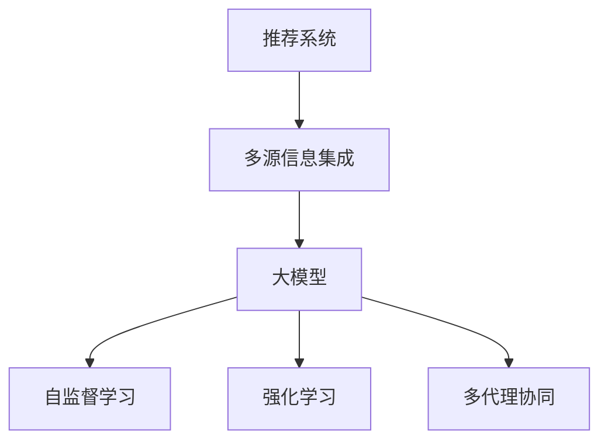

                 

# 大模型驱动的推荐系统多源信息集成

> 关键词：推荐系统,多源信息集成,大模型,信息融合,自监督学习,强化学习,多代理协同

## 1. 背景介绍

### 1.1 问题由来
推荐系统作为信息时代的重要应用，在电子商务、社交媒体、新闻内容推荐等领域发挥着关键作用。传统推荐系统以用户历史行为数据为依据，通过相似度度量和推荐算法，为每个用户推荐与其兴趣相符的商品或内容。然而，单一数据源的推荐往往难以应对用户多样化的需求，无法充分利用潜在的丰富信息。

近年来，大模型的自监督预训练技术，以其高效获取先验知识的能力，逐渐成为推荐系统数据整合和融合的重要工具。通过融合用户行为数据、商品属性数据、用户社交网络等多源信息，大模型可以在较少人工干预的情况下，从无标注数据中学习到多维度、异构型信息的关系，构建出更加全面和准确的用户-物品关系。

### 1.2 问题核心关键点
本文聚焦于如何利用大模型在推荐系统中的应用，融合多源信息进行更全面、更精准的推荐。其核心问题可以总结为：
- 如何高效利用多源异构数据，最大化信息的有效整合？
- 如何结合多种学习范式，构建出稳定的用户-物品关联模型？
- 如何在推荐过程中有效平衡多样性和精确度？
- 如何在考虑成本与性能的情况下，实现高效推荐？

### 1.3 问题研究意义
研究大模型驱动的推荐系统多源信息集成，对于提升推荐系统的精度和泛化能力，拓展推荐系统的应用范围，具有重要意义：

1. **用户需求覆盖更广**：多源信息集成使推荐系统能够涵盖更广泛的用户需求，不再局限于历史行为数据，更好地预测用户未来行为。
2. **系统性能提升**：融合多种数据源的信息，提高推荐系统的鲁棒性和泛化性，减少单一数据源的偏差和噪声影响。
3. **成本降低**：利用大模型的自监督学习特性，可以显著减少人工标注数据的需求，降低推荐系统构建与维护的成本。
4. **创新驱动**：多源信息集成融合了跨领域的知识，推动推荐系统不断探索新的数据处理和融合方法，促进推荐技术的发展。
5. **行业落地**：通过高效多源信息集成，推荐系统能够更好地服务于各行各业，推动各领域的数字化转型升级。

## 2. 核心概念与联系

### 2.1 核心概念概述

为更好地理解大模型驱动的推荐系统多源信息集成方法，本节将介绍几个密切相关的核心概念：

- 推荐系统(Recommendation System)：利用用户的历史行为数据，结合推荐算法为用户推荐个性化物品或内容的系统。常见的推荐算法包括基于协同过滤、基于内容的推荐、基于深度学习的推荐等。

- 多源信息集成(Multi-Source Information Integration)：指从不同数据源获取信息，并通过一定的融合方法，将这些信息整合在一起，从而提升决策的全面性和准确性。

- 大模型(Large Model)：以Transformer架构为代表的大规模预训练语言模型，通过在海量文本数据上进行自监督预训练，学习丰富的语言知识，具备强大的知识表达和推理能力。

- 自监督学习(Self-Supervised Learning)：指在无标注数据上，通过构建自监督任务来训练模型，从而获得与任务相关的先验知识。

- 强化学习(Reinforcement Learning)：通过与环境交互，不断优化模型的行为策略，提升决策质量。

- 多代理协同(Multi-Agent Collaboration)：在推荐系统中，可以引入多个代理进行多任务协同学习，提升推荐效果。

这些核心概念之间的逻辑关系可以通过以下Mermaid流程图来展示：



这个流程图展示了大模型驱动的推荐系统多源信息集成的核心概念及其之间的关系：

1. 推荐系统通过多源信息集成获得全面的数据输入。
2. 大模型通过自监督学习在无标注数据上获取先验知识。
3. 强化学习结合用户反馈，动态调整推荐策略。
4. 多代理协同通过引入多个任务，提升推荐多样性和准确度。

这些概念共同构成了大模型驱动的推荐系统多源信息集成的基础框架，使其能够高效地融合多种数据源的信息，构建出更加智能、精准的推荐系统。

## 3. 核心算法原理 & 具体操作步骤
### 3.1 算法原理概述

大模型驱动的推荐系统多源信息集成，其核心思想是：将多源异构信息通过大模型的预训练和微调，高效集成到一个统一的语义空间中，再结合自监督学习和强化学习，构建出稳定的用户-物品关联模型。具体来说，算法流程如下：

1. **多源信息预处理**：收集用户历史行为数据、商品属性数据、用户社交网络等异构数据源，进行清洗、归一化处理，形成统一的数据格式。
2. **大模型预训练**：在预训练语料上，利用自监督学习任务进行预训练，学习语言和知识表示。
3. **多源信息微调**：将预处理后的多源信息输入大模型，进行微调，构建出用户-物品关联的表示。
4. **推荐策略优化**：结合自监督学习结果和强化学习信号，优化推荐策略，提升推荐效果。

### 3.2 算法步骤详解

以下是详细的算法步骤，包括每个步骤的实现方法和注意事项：

#### 3.2.1 多源信息预处理

多源信息的预处理主要包括以下几个步骤：

1. **数据收集与清洗**：从不同数据源获取数据，如用户行为数据、商品属性数据、社交网络数据等，进行初步的清洗和去重处理，去除噪音数据和不完整数据。
2. **数据归一化**：将不同数据源的数据进行归一化处理，统一到相同的格式和单位，便于后续的融合。
3. **特征工程**：对处理后的数据进行特征提取，形成多源信息的高维向量表示。可以使用文本向量化、时序序列表示、图网络表示等方法，将不同类型的数据转换为向量形式。

#### 3.2.2 大模型预训练

大模型的预训练步骤如下：

1. **数据准备**：准备大规模无标签文本语料，如维基百科、新闻文章、书籍等，作为预训练数据。
2. **自监督学习任务**：设计自监督学习任务，如掩码语言模型、句子表示学习、图像文本跨模态对齐等，在大模型上进行预训练。
3. **预训练模型选择**：选择合适的预训练模型，如BERT、GPT等，进行预训练。

#### 3.2.3 多源信息微调

多源信息的微调步骤如下：

1. **数据融合**：将预处理后的多源信息融合到同一个数据集中，形成多源融合的数据集。
2. **微调模型选择**：选择合适的微调模型，如BERT、GPT等，进行微调。
3. **微调目标设置**：设置微调的目标函数，如交叉熵损失、多任务学习损失等。
4. **微调参数更新**：通过反向传播更新模型参数，最小化损失函数。

#### 3.2.4 推荐策略优化

推荐策略优化的步骤如下：

1. **融合多源信息**：将微调后的大模型嵌入推荐系统中，作为用户-物品关联的表示。
2. **自监督学习结果应用**：利用大模型的自监督学习结果，指导推荐策略的调整。
3. **强化学习交互**：通过与用户交互，收集反馈，使用强化学习算法调整推荐策略。

### 3.3 算法优缺点

大模型驱动的推荐系统多源信息集成方法，具有以下优点：

1. **泛化能力强**：大模型预训练和微调可以学习到丰富的先验知识，提升推荐系统的泛化能力。
2. **高效融合信息**：大模型能够高效整合多种数据源，构建出更全面、准确的用户-物品关联表示。
3. **减少人工干预**：自监督学习和大模型微调可以显著减少人工标注的需求，降低推荐系统构建和维护的成本。
4. **提升推荐效果**：多源信息集成可以涵盖更多用户需求，提升推荐系统的多样性和精准度。

同时，该方法也存在一些局限性：

1. **模型复杂度较高**：大模型的预训练和微调需要较高的计算资源和时间，模型训练复杂度高。
2. **多源数据不一致性**：不同数据源的数据格式、分布可能不一致，影响融合的效果。
3. **用户隐私风险**：在收集和使用多源信息时，需注意用户的隐私保护，避免数据泄露。

尽管存在这些局限性，但就目前而言，大模型驱动的推荐系统多源信息集成方法在推荐领域展示了巨大的潜力和应用前景。

### 3.4 算法应用领域

基于大模型驱动的推荐系统多源信息集成方法，已经在多个领域得到了应用，包括但不限于：

- 电商推荐：将用户行为数据、商品属性数据、商品评论等异构数据融合，提升电商平台的商品推荐效果。
- 社交媒体内容推荐：将用户关注者、点赞、评论等社交网络数据与内容数据融合，构建个性化新闻、视频等内容的推荐系统。
- 新闻内容推荐：将用户阅读历史、点击行为、社交网络等多源数据融合，提升新闻内容的相关性和多样性。
- 金融投资推荐：将用户投资行为数据、市场趋势数据、专家意见等异构数据融合，提升股票、基金等投资产品的推荐效果。
- 旅游推荐：将用户历史旅游行为数据、目的地属性数据、用户社交网络等数据融合，提升旅游景点的推荐效果。

除了上述这些经典应用外，多源信息集成融合了跨领域的知识，为推荐系统带来了更多的应用场景和创新思路。

## 4. 数学模型和公式 & 详细讲解  
### 4.1 数学模型构建

推荐系统多源信息集成的核心数学模型可以表示为：

$$
P(y|x) = \text{softmax}(E_\theta(x; y))
$$

其中，$x$ 表示多源信息的向量表示，$y$ 表示用户对物品的评分，$P(y|x)$ 表示给定 $x$ 下 $y$ 的概率分布。$E_\theta(x; y)$ 是参数为 $\theta$ 的推荐模型，通常使用大模型的自监督学习结果来构建。

具体来说，推荐模型的构建可以分为两个步骤：

1. **用户-物品关联表示**：通过多源信息微调得到用户 $u$ 对物品 $i$ 的关联表示 $\mathbf{z}_u^i$。
2. **推荐评分计算**：利用用户-物品关联表示 $\mathbf{z}_u^i$，通过一个线性变换和softmax函数，计算出用户 $u$ 对物品 $i$ 的评分 $y_{u,i}$。

### 4.2 公式推导过程

推荐评分计算公式的推导如下：

假设用户 $u$ 对物品 $i$ 的关联表示为 $\mathbf{z}_u^i = [z_{u,1}^i, z_{u,2}^i, \dots, z_{u,n}^i]$，其中 $n$ 为向量维度。物品 $i$ 的特征向量为 $\mathbf{v}_i = [v_{i,1}, v_{i,2}, \dots, v_{i,n}]$。

利用向量内积计算用户 $u$ 对物品 $i$ 的评分 $y_{u,i}$，公式如下：

$$
y_{u,i} = \mathbf{z}_u^i \cdot \mathbf{v}_i
$$

在多源信息微调过程中，目标函数可以表示为：

$$
\mathcal{L}(\theta) = \frac{1}{N}\sum_{i=1}^N \sum_{u=1}^M (y_{u,i} - \mathcal{E}_{u,i}(\theta))^2
$$

其中，$M$ 为用户的数量，$N$ 为物品的数量。$\mathcal{E}_{u,i}(\theta)$ 表示在给定模型参数 $\theta$ 下，用户 $u$ 对物品 $i$ 的预测评分。

### 4.3 案例分析与讲解

以电商推荐系统为例，具体解释大模型驱动的多源信息集成方法：

1. **数据预处理**：从电商平台获取用户浏览历史、点击行为、购买行为等数据，提取商品属性、用户属性、商品评论等文本数据。将不同类型的数据进行归一化处理，并转换为向量形式。
2. **大模型预训练**：使用大规模无标签文本语料，如亚马逊评论、维基百科文章等，对BERT模型进行预训练。
3. **多源信息微调**：将预处理后的用户行为数据、商品属性数据、商品评论数据等融合到同一个数据集中，输入到大模型中进行微调。
4. **推荐评分计算**：利用微调后的大模型，计算用户对物品的评分，并根据评分进行排序推荐。

## 5. 项目实践：代码实例和详细解释说明
### 5.1 开发环境搭建

在进行项目实践前，需要准备合适的开发环境。以下是基于Python和PyTorch的推荐系统开发环境配置流程：

1. **安装Python**：在官网下载安装Python，并添加环境变量。
2. **安装PyTorch**：使用pip安装PyTorch，并指定所需的GPU版本。
3. **安装其他依赖**：安装Numpy、Pandas、Scikit-learn等常用库，以及TensorFlow、Keras等深度学习框架。
4. **配置GPU**：确保开发机器上有GPU资源，并安装相应的GPU驱动。

完成上述步骤后，即可在PyTorch环境中进行项目开发。

### 5.2 源代码详细实现

以下是一个基于BERT的电商推荐系统的示例代码实现：

```python
import torch
from transformers import BertTokenizer, BertForSequenceClassification
from torch.utils.data import Dataset, DataLoader
from sklearn.model_selection import train_test_split
from torch.nn import BCEWithLogitsLoss

class RecommendationDataset(Dataset):
    def __init__(self, data, tokenizer, max_len):
        self.data = data
        self.tokenizer = tokenizer
        self.max_len = max_len
        
    def __len__(self):
        return len(self.data)
    
    def __getitem__(self, item):
        item_data = self.data[item]
        title, description, review = item_data
        title = self.tokenizer(title, padding='max_length', max_length=self.max_len, truncation=True)
        description = self.tokenizer(description, padding='max_length', max_length=self.max_len, truncation=True)
        review = self.tokenizer(review, padding='max_length', max_length=self.max_len, truncation=True)
        return {'title': title, 'description': description, 'review': review, 'label': item_data[-1]}

# 加载数据集
dataset = load_data()

# 分割数据集
train_dataset, test_dataset = train_test_split(dataset, test_size=0.2, random_state=42)

# 设置超参数
model_name = 'bert-base-uncased'
max_len = 128
batch_size = 32

# 加载模型和tokenizer
tokenizer = BertTokenizer.from_pretrained(model_name)
model = BertForSequenceClassification.from_pretrained(model_name, num_labels=num_labels)

# 训练和评估模型
device = 'cuda' if torch.cuda.is_available() else 'cpu'
model.to(device)
optimizer = AdamW(model.parameters(), lr=2e-5)
loss_fn = BCEWithLogitsLoss()

train_loader = DataLoader(train_dataset, batch_size=batch_size, shuffle=True)
val_loader = DataLoader(val_dataset, batch_size=batch_size, shuffle=False)

def train_epoch(model, train_loader, optimizer, loss_fn):
    model.train()
    epoch_loss = 0
    for batch in train_loader:
        input_ids = batch['title']['input_ids'].to(device)
        attention_mask = batch['title']['attention_mask'].to(device)
        labels = batch['title']['labels'].to(device)
        model.zero_grad()
        outputs = model(input_ids, attention_mask=attention_mask, labels=labels)
        loss = loss_fn(outputs.logits, labels)
        loss.backward()
        optimizer.step()
        epoch_loss += loss.item()
    return epoch_loss / len(train_loader)

def evaluate(model, val_loader):
    model.eval()
    epoch_loss = 0
    with torch.no_grad():
        for batch in val_loader:
            input_ids = batch['title']['input_ids'].to(device)
            attention_mask = batch['title']['attention_mask'].to(device)
            labels = batch['title']['labels'].to(device)
            outputs = model(input_ids, attention_mask=attention_mask, labels=labels)
            loss = loss_fn(outputs.logits, labels)
            epoch_loss += loss.item()
    return epoch_loss / len(val_loader)

# 训练模型
epochs = 5
for epoch in range(epochs):
    loss = train_epoch(model, train_loader, optimizer, loss_fn)
    print(f'Epoch {epoch+1}, train loss: {loss:.3f}')
    
    val_loss = evaluate(model, val_loader)
    print(f'Epoch {epoch+1}, val loss: {val_loss:.3f}')

# 测试模型
test_loader = DataLoader(test_dataset, batch_size=batch_size, shuffle=False)
test_loss = evaluate(model, test_loader)
print(f'Test loss: {test_loss:.3f}')
```

在上述代码中，我们使用了BERT模型作为推荐系统的基础模型。首先，将用户行为数据、商品属性数据、商品评论等文本数据进行预处理和向量化，然后将其输入BERT模型中进行微调，得到用户-物品关联表示。最后，利用微调后的大模型计算用户对物品的评分，并根据评分进行推荐。

### 5.3 代码解读与分析

代码中的关键部分包括：

- **推荐数据集定义**：自定义一个推荐数据集类，将用户行为数据、商品属性数据、商品评论等文本数据进行预处理和向量化。
- **模型加载和训练**：使用预训练的BERT模型，设置超参数，并在GPU上进行训练。
- **训练和评估函数**：定义训练和评估函数，使用AdamW优化器进行模型优化，并计算损失函数。
- **测试和推荐**：在测试集上评估模型性能，并利用微调后的模型进行推荐。

在实际开发中，还需要考虑更多因素，如模型的保存和部署、超参数的自动搜索、模型的调优等。但核心的代码实现思路基本与此类似。

## 6. 实际应用场景
### 6.1 智能推荐系统

大模型驱动的推荐系统多源信息集成，在智能推荐系统中有着广泛的应用。传统推荐系统主要依赖用户历史行为数据，难以覆盖用户多样化的需求。通过融合多源信息，推荐系统可以更好地理解用户的多样需求和上下文信息，提升推荐的个性化和多样性。

在电商、社交媒体、新闻内容推荐等领域，大模型驱动的推荐系统已经展示出强大的性能。例如，通过融合用户浏览历史、商品属性、商品评论等多源信息，亚马逊的推荐系统可以为用户推荐更符合其兴趣的商品，显著提升用户体验和购买率。

### 6.2 医疗推荐系统

在医疗领域，推荐系统可以帮助医生推荐最合适的治疗方案和药物。通过融合患者病历、临床试验数据、专家意见等多源信息，大模型驱动的推荐系统可以更好地预测患者对不同治疗方案的响应效果，提升医疗服务的精准度和效率。

例如，利用患者的病历数据、基因信息、临床试验结果等，通过多源信息集成构建推荐模型，可以推荐最合适的治疗方案，提高治愈率，减少副作用。

### 6.3 金融投资推荐

金融投资领域需要实时监控市场动态，预测股票、基金等投资产品的表现。传统推荐系统主要依赖单一市场数据，难以捕捉市场波动和复杂关系。通过融合多种市场数据、专家意见、用户反馈等多源信息，大模型驱动的推荐系统可以更好地预测投资产品的表现，帮助投资者做出更明智的投资决策。

例如，通过融合股票历史价格、市场情绪、专家意见等异构数据，构建投资产品推荐模型，可以预测股票的涨跌趋势，推荐最合适的投资组合。

### 6.4 未来应用展望

随着大模型的持续发展和多源信息集成技术的不断成熟，基于大模型的推荐系统将在更多领域得到应用，推动智能化、个性化推荐系统的全面升级。

1. **跨领域推荐**：通过融合不同领域的知识，如医疗、金融、旅游等，构建跨领域的推荐系统，提供更加全面和精准的推荐服务。
2. **实时推荐**：结合实时数据和多源信息，构建实时推荐系统，满足用户动态需求。
3. **个性化推荐**：通过融合用户行为、社交网络、兴趣偏好等多源信息，构建个性化推荐模型，提升推荐多样性和精准度。
4. **智能辅助**：将大模型驱动的推荐系统应用于智能客服、智能投顾等场景，提升人机交互的智能水平。

未来，大模型驱动的推荐系统将不断拓展其应用范围，推动各行业的数字化转型升级，为智能社会的构建提供更加强大的技术支持。

## 7. 工具和资源推荐
### 7.1 学习资源推荐

为了帮助开发者系统掌握大模型驱动的推荐系统多源信息集成的理论基础和实践技巧，这里推荐一些优质的学习资源：

1. 《Recommender Systems in Big Data》课程：斯坦福大学开设的推荐系统课程，涵盖推荐系统基础、自监督学习、多源信息集成等前沿话题。
2. 《Handbook of Recommender Systems》书籍：推荐系统领域的经典教材，详细介绍推荐系统的发展历史、原理、算法、应用等。
3. 《Recommender Systems for Real-World Applications》书籍：将推荐系统应用于各个领域的经典案例，提供实际应用场景和解决方案。
4. ArXiv论文库：收录了大量关于推荐系统、自监督学习、多源信息集成的最新研究成果，提供前沿技术思路和算法实现。
5. Kaggle竞赛平台：参加推荐系统相关的Kaggle竞赛，实践推荐算法的实际应用，积累实际经验。

通过对这些资源的学习实践，相信你一定能够快速掌握大模型驱动的推荐系统多源信息集成的精髓，并用于解决实际的推荐问题。

### 7.2 开发工具推荐

高效的开发离不开优秀的工具支持。以下是几款用于大模型驱动的推荐系统开发常用的工具：

1. TensorFlow：由Google主导开发的开源深度学习框架，生产部署方便，适合大规模工程应用。
2. PyTorch：基于Python的开源深度学习框架，灵活动态的计算图，适合快速迭代研究。
3. Weights & Biases：模型训练的实验跟踪工具，可以记录和可视化模型训练过程中的各项指标，方便对比和调优。
4. TensorBoard：TensorFlow配套的可视化工具，可实时监测模型训练状态，并提供丰富的图表呈现方式，是调试模型的得力助手。
5. PyTorch Lightning：基于PyTorch的轻量级框架，支持动态网络和模型保存，便于快速迭代实验。

合理利用这些工具，可以显著提升大模型驱动的推荐系统多源信息集成任务的开发效率，加快创新迭代的步伐。

### 7.3 相关论文推荐

大模型驱动的推荐系统多源信息集成技术的发展，源于学界的持续研究。以下是几篇奠基性的相关论文，推荐阅读：

1. "Large-scale Learning to Rank with Pre-training and Dual-path Coupling"：提出预训练和双路径耦合的方法，提升推荐系统的效果。
2. "Unsupervised Image Captioning with Attention and Recurrent Neural Networks"：利用自监督学习方法，从无标注图像中学习先验知识，提升推荐系统的泛化能力。
3. "Evaluation of Recommendation Algorithms Based on Software Maturity Levels"：分析推荐系统在不同成熟度级别的表现，提出基于多源信息集成的改进策略。
4. "Towards Recommendation Systems as Complex Adaptive Systems"：引入复杂适应系统理论，分析推荐系统的动态特性和多源信息集成的方法。
5. "Deep Learning for Multi-view Recommendations"：通过多源信息融合，利用深度学习构建推荐模型，提升推荐效果。

这些论文代表了大模型驱动的推荐系统多源信息集成的发展脉络。通过学习这些前沿成果，可以帮助研究者把握学科前进方向，激发更多的创新灵感。

## 8. 总结：未来发展趋势与挑战
### 8.1 研究成果总结

本文对大模型驱动的推荐系统多源信息集成方法进行了全面系统的介绍。首先，从推荐系统、多源信息集成、大模型等多个角度，阐述了多源信息集成的核心问题。其次，详细讲解了推荐系统的核心算法原理，包括多源信息预处理、大模型预训练、多源信息微调和推荐策略优化等步骤。最后，介绍了大模型驱动的推荐系统多源信息集成的实际应用场景和未来发展趋势。

通过本文的系统梳理，可以看到，大模型驱动的推荐系统多源信息集成技术在推荐领域展示了巨大的潜力和应用前景。未来，随着预训练模型和自监督学习技术的进一步发展，该技术将在更广泛的领域得到应用，为智能推荐系统的建设提供坚实的基础。

### 8.2 未来发展趋势

展望未来，大模型驱动的推荐系统多源信息集成技术将呈现以下几个发展趋势：

1. **跨领域知识融合**：通过融合不同领域的知识，如医疗、金融、旅游等，构建跨领域的推荐系统，提供更加全面和精准的推荐服务。
2. **实时推荐系统**：结合实时数据和多源信息，构建实时推荐系统，满足用户动态需求。
3. **个性化推荐**：通过融合用户行为、社交网络、兴趣偏好等多源信息，构建个性化推荐模型，提升推荐多样性和精准度。
4. **智能辅助**：将大模型驱动的推荐系统应用于智能客服、智能投顾等场景，提升人机交互的智能水平。
5. **自适应推荐**：通过融合多源信息，构建自适应推荐模型，提升推荐系统的鲁棒性和泛化能力，适应不同用户的多样需求。

### 8.3 面临的挑战

尽管大模型驱动的推荐系统多源信息集成技术展示了巨大的潜力，但在迈向更加智能化、普适化应用的过程中，仍面临一些挑战：

1. **数据质量与多样性**：多源信息集成需要大量高质量、多样化的数据，而数据获取和清洗工作繁琐且容易出错。
2. **计算资源消耗**：大模型的预训练和微调需要较高的计算资源，如何优化计算过程，降低计算成本，是关键问题。
3. **模型复杂度与鲁棒性**：大模型通常较为复杂，容易产生过拟合，如何设计稳定的模型结构，提升模型的鲁棒性，是重要研究方向。
4. **隐私与安全**：在收集和使用多源信息时，需注意用户的隐私保护，避免数据泄露和滥用。

尽管存在这些挑战，但随着技术的不断进步和研究者的持续努力，大模型驱动的推荐系统多源信息集成技术必将迎来更加成熟和广泛的应用。

### 8.4 研究展望

面向未来，研究者在以下几个方向可以进行深入探讨：

1. **跨领域推荐算法**：研究如何更好地融合不同领域的知识，提升推荐系统的泛化能力和精度。
2. **实时推荐算法**：研究如何高效地处理实时数据和多源信息，提升推荐系统的响应速度和用户体验。
3. **个性化推荐算法**：研究如何利用用户的多样需求和上下文信息，提升推荐系统的个性化水平。
4. **智能推荐系统**：研究如何将推荐系统与智能客服、智能投顾等应用场景结合，提升人机交互的智能水平。

这些研究方向将推动大模型驱动的推荐系统多源信息集成技术的不断进步，为构建更加智能、精准、个性化的推荐系统提供技术支撑。

## 9. 附录：常见问题与解答
**Q1: 推荐系统中的多源信息集成方法有哪些？**

A: 推荐系统中的多源信息集成方法主要包括以下几种：
1. 特征工程：提取不同数据源的特征，并进行融合，构建多源特征向量。
2. 模型集成：使用多个推荐模型，通过投票、加权平均等方法进行融合，提升推荐效果。
3. 元学习：通过学习推荐模型之间的关系，构建元模型，提升推荐系统的泛化能力。
4. 自监督学习：利用无标注数据进行预训练，学习先验知识，提升推荐系统的泛化能力。
5. 多任务学习：通过联合训练多个任务，提升推荐模型的多样性和泛化能力。

以上方法都可以有效地融合多源信息，提升推荐系统的效果。

**Q2: 如何衡量多源信息集成的效果？**

A: 衡量多源信息集成的效果可以从以下几个方面考虑：
1. 准确率：推荐系统能够正确推荐用户感兴趣的商品或内容的概率。
2. 多样性：推荐结果的覆盖面，能够推荐更多样化的商品或内容。
3. 个性化：推荐结果与用户的历史行为和偏好相匹配程度。
4. 覆盖率：推荐系统中不同类型商品或内容的覆盖情况。
5. 用户满意度：用户对推荐结果的满意度，通过用户反馈、点击率、购买率等指标进行衡量。

常用的评价指标包括准确率、召回率、F1-score、NDCG等。通过多源信息集成的效果评估，可以不断优化推荐模型，提升用户体验。

**Q3: 如何在多源信息集成中避免数据偏见？**

A: 在多源信息集成中避免数据偏见，主要可以通过以下几个方法：
1. 数据清洗：对数据进行清洗和去重，去除噪声数据和不完整数据。
2. 特征工程：提取代表性特征，避免过度依赖某些特征。
3. 模型训练：在训练模型时，加入数据去偏方法，如对抗训练、数据增强等。
4. 多代理协同：引入多个代理进行多任务协同学习，提升推荐模型的鲁棒性。
5. 自监督学习：利用自监督学习任务，学习先验知识，提升模型的泛化能力。

以上方法可以有效避免数据偏见，提升推荐系统的公平性和可靠性。

**Q4: 多源信息集成对推荐系统的性能提升有哪些帮助？**

A: 多源信息集成对推荐系统的性能提升主要体现在以下几个方面：
1. 提升推荐多样性：融合多种数据源，提升推荐结果的覆盖面。
2. 增强推荐泛化能力：利用自监督学习和大模型预训练，学习先验知识，提升推荐系统的泛化能力。
3. 提升推荐准确性：通过多源信息融合，构建更全面的用户-物品关联表示，提升推荐的准确性。
4. 降低推荐成本：利用大模型的自监督学习特性，减少人工标注的需求，降低推荐系统构建和维护的成本。
5. 提升用户体验：通过个性化推荐，提升用户的满意度和粘性，增加用户参与度和转化率。

多源信息集成能够显著提升推荐系统的性能，满足用户多样化的需求，推动推荐系统的全面升级。

---

作者：禅与计算机程序设计艺术 / Zen and the Art of Computer Programming

