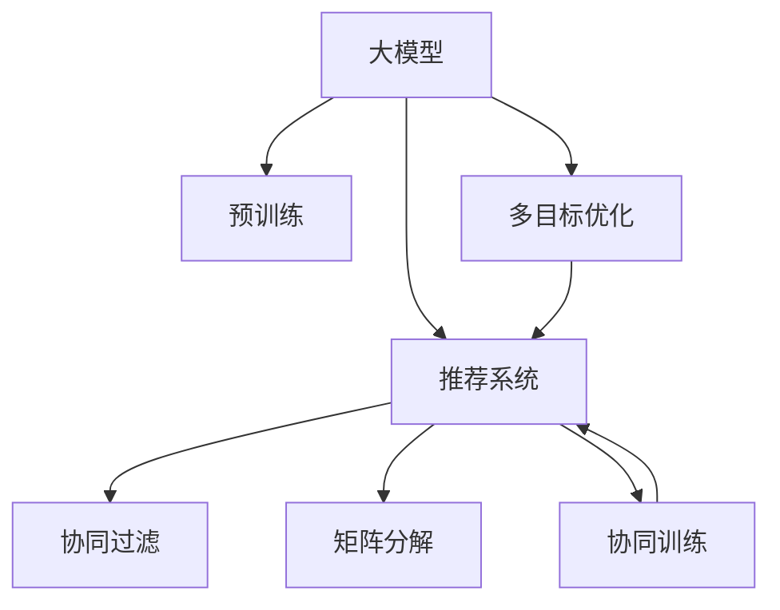

                 

# 大模型驱动的推荐系统多目标平衡框架

> 关键词：推荐系统,多目标优化,大模型,深度学习,协同过滤,矩阵分解,协同训练

## 1. 背景介绍

推荐系统是当今互联网应用中最重要的技术之一，它通过分析用户的历史行为和兴趣，为用户推荐符合其需求的内容，如商品、新闻、音乐等。传统的推荐系统主要依赖于协同过滤和矩阵分解等算法，这些方法在推荐精度上已经达到了较高的水平，但仍然存在一些局限性：

1. **用户与物品的稀疏交互矩阵问题**：协同过滤方法要求用户对物品有大量的交互行为，但现实情况下很多用户对物品没有交互行为，导致系统无法进行准确的推荐。
2. **模型复杂度高**：协同过滤和矩阵分解方法通常需要构建高维度的用户-物品相似度矩阵，对计算资源和时间的要求较高。
3. **跨领域泛化能力差**：这些方法主要关注用户和物品之间的相似性，对其他领域的信息（如情感、时间等）缺乏有效的建模。
4. **推荐结果的单一性**：传统的推荐系统往往只关注推荐物品的相关性，而忽略了用户的满意度和物品的多样性。

为了克服这些局限性，近年来出现了一些新的推荐方法，如基于大模型的推荐系统。这些方法通过预训练大模型（如BERT、GPT等），利用其在自然语言处理中的强大能力，实现了对用户行为、情感和物品属性的综合建模。这些大模型通过自监督或半监督学习的方式，学习了广泛的语义信息，使得推荐系统可以更全面、准确地进行推荐。

然而，大模型驱动的推荐系统同样面临着新的挑战。如何在大模型和推荐系统之间进行有效的交互，使得模型能够专注于推荐目标并避免过拟合，是一个亟待解决的问题。本文旨在提出一种大模型驱动的推荐系统多目标平衡框架，通过优化算法和目标函数的设计，实现推荐系统在推荐准确性、多样性和满意度等多目标之间的平衡。

## 2. 核心概念与联系

### 2.1 核心概念概述

为了更好地理解大模型驱动的推荐系统多目标平衡框架，首先需要明确几个关键概念：

- **大模型**：指在大规模无标签文本语料上预训练得到的语言模型，如BERT、GPT等。这些模型通过自监督或半监督学习的方式，学习到了丰富的语义信息，能够应用于多种自然语言处理任务。
- **推荐系统**：通过分析用户的历史行为和兴趣，为用户推荐符合其需求的内容的系统。推荐系统通常分为基于协同过滤的方法和基于内容的方法。
- **多目标优化**：指在推荐系统中同时考虑多个目标，如推荐准确性、多样性、满意度等，通过多目标优化算法，使模型在不同目标之间达到平衡。
- **协同过滤**：通过分析用户之间的相似性，为用户推荐与其历史兴趣相似的物品。协同过滤方法通常分为基于用户的协同过滤和基于物品的协同过滤。
- **矩阵分解**：将用户-物品评分矩阵分解为低维用户嵌入和物品嵌入的乘积，通过矩阵分解方法，可以降低矩阵的维度，提高模型的计算效率。
- **协同训练**：在协同过滤和矩阵分解的基础上，通过联合训练用户嵌入和物品嵌入，进一步提升推荐精度。

这些概念之间的逻辑关系可以通过以下Mermaid流程图来展示：



这个流程图展示了大模型的推荐系统多目标平衡框架的核心概念及其之间的关系：

1. 大模型通过预训练获得基础能力。
2. 推荐系统通过协同过滤、矩阵分解等方法，对用户和物品进行建模。
3. 协同训练在协同过滤和矩阵分解的基础上，进一步提升推荐精度。
4. 多目标优化在协同训练的基础上，考虑推荐准确性、多样性、满意度等多目标之间的平衡。

这些概念共同构成了大模型驱动的推荐系统多目标平衡框架，使得模型能够在各种场景下进行高效推荐。通过理解这些核心概念，我们可以更好地把握大模型驱动推荐系统的原理和优化方向。

## 3. 核心算法原理 & 具体操作步骤

### 3.1 算法原理概述

大模型驱动的推荐系统多目标平衡框架的核心思想是：通过多目标优化算法，在大模型和推荐系统之间进行有效的交互，使得模型能够专注于推荐目标并避免过拟合。其核心在于如何设计合理的目标函数，并在不同目标之间进行平衡。

具体来说，该框架将推荐任务分解为多个子任务，每个子任务对应一个目标，如推荐准确性、多样性、满意度等。然后，通过多目标优化算法，综合考虑这些子任务，使得模型在不同目标之间达到平衡。该框架的关键在于：

1. **目标函数的设计**：如何定义推荐系统的多个目标，并设计合理的目标函数，使得模型能够同时优化这些目标。
2. **多目标优化算法**：如何在不同目标之间进行平衡，使得模型能够兼顾多个目标。
3. **损失函数的定义**：如何将多目标优化算法的结果转换为模型的损失函数，使得模型能够在训练过程中进行优化。

### 3.2 算法步骤详解

基于大模型的推荐系统多目标平衡框架的算法步骤主要包括：

1. **数据准备**：收集用户的历史行为和兴趣，以及物品的属性信息。将用户和物品的交互矩阵和属性矩阵存储在内存或数据库中。

2. **预训练大模型的嵌入表示**：使用预训练的大模型（如BERT、GPT等），对用户和物品的特征进行编码，得到嵌入表示。这些嵌入表示可以用于后续的多目标优化和推荐计算。

3. **目标函数的设计**：设计推荐系统需要优化的多个目标，如推荐准确性、多样性、满意度等。每个目标对应的函数可以表示为损失函数，计算模型在这些目标上的表现。

4. **多目标优化算法的选取**：选择合适的多目标优化算法，如Weighted Sum方法、Nash方法等，将多个目标的损失函数进行组合，形成整体的目标函数。

5. **模型的训练**：将整体的目标函数转换为模型的损失函数，使用反向传播算法进行模型训练。在训练过程中，通过优化算法在不同目标之间进行平衡，使得模型能够同时优化多个目标。

6. **推荐结果的生成**：在训练完成后，使用模型对新的用户和物品进行推荐，生成推荐结果。

### 3.3 算法优缺点

大模型驱动的推荐系统多目标平衡框架具有以下优点：

1. **推荐准确性高**：通过利用大模型的语义信息，能够更全面地理解用户和物品的特征，提高推荐精度。
2. **跨领域泛化能力强**：大模型在处理多种自然语言处理任务中表现优异，可以适用于不同类型的推荐任务。
3. **多样化推荐**：通过优化算法，可以在推荐准确性的基础上，进一步提升推荐结果的多样性。
4. **用户满意度提升**：通过考虑满意度目标，使得推荐系统能够更好地满足用户的个性化需求。

同时，该框架也存在一些局限性：

1. **计算资源需求高**：大模型的嵌入表示通常需要较高的计算资源和时间，可能影响模型的实时性和可扩展性。
2. **目标函数设计复杂**：推荐系统的多个目标之间可能存在冲突，设计合理且可行的目标函数是一个挑战。
3. **模型过拟合风险**：由于大模型具有较强的拟合能力，可能会在训练过程中出现过拟合的风险。

尽管存在这些局限性，但大模型驱动的推荐系统多目标平衡框架在处理复杂推荐任务时，仍然表现出了显著的优越性。未来研究重点在于如何进一步优化目标函数设计，提升模型的实时性和可扩展性，同时避免模型过拟合的风险。

### 3.4 算法应用领域

大模型驱动的推荐系统多目标平衡框架已经在多个领域得到了广泛的应用，例如：

1. **电商推荐**：通过分析用户浏览、购买历史，为用户推荐符合其需求的商品。大模型能够处理用户评论、产品描述等文本信息，进一步提升推荐精度。

2. **音乐推荐**：分析用户的听歌历史、评分等信息，为用户推荐喜欢的音乐。大模型可以处理歌词、音乐标签等文本信息，提升推荐结果的多样性和准确性。

3. **新闻推荐**：根据用户的阅读历史和偏好，为用户推荐新闻内容。大模型能够处理新闻标题、内容摘要等文本信息，提升推荐结果的准确性和多样性。

4. **视频推荐**：分析用户的观看历史、评分等信息，为用户推荐感兴趣的视频内容。大模型可以处理视频标题、描述等文本信息，进一步提升推荐精度。

除了这些常见的应用领域外，大模型驱动的推荐系统多目标平衡框架还能够在电影推荐、游戏推荐等更多场景中发挥重要作用。随着大模型技术的不断进步，该框架的应用范围也将进一步拓展。

## 4. 数学模型和公式 & 详细讲解  
### 4.1 数学模型构建

大模型驱动的推荐系统多目标平衡框架的数学模型构建主要涉及以下几个方面：

- **用户嵌入表示**：使用大模型对用户的历史行为和兴趣进行编码，得到用户嵌入表示。
- **物品嵌入表示**：使用大模型对物品的属性信息进行编码，得到物品嵌入表示。
- **目标函数**：设计推荐系统需要优化的多个目标，如推荐准确性、多样性、满意度等。

假设用户-物品评分矩阵为 $R \in \mathbb{R}^{U \times I}$，其中 $U$ 为用户的数量，$I$ 为物品的数量。用户嵌入表示为 $\mathbf{u}_u \in \mathbb{R}^d$，物品嵌入表示为 $\mathbf{v}_i \in \mathbb{R}^d$，其中 $d$ 为嵌入维度。推荐准确性目标函数为 $L_{acc}(R, \mathbf{u}, \mathbf{v})$，多样性目标函数为 $L_{div}(R, \mathbf{u}, \mathbf{v})$，满意度目标函数为 $L_{sat}(R, \mathbf{u}, \mathbf{v})$。

### 4.2 公式推导过程

以下我们以推荐准确性目标函数为例，推导其公式及其推导过程。

假设推荐系统需要为用户 $u$ 推荐物品 $i$，用户对物品的评分 $r_{ui}$ 为：

$$
r_{ui} = \mathbf{u}_u^T \mathbf{v}_i
$$

其中 $\mathbf{u}_u$ 和 $\mathbf{v}_i$ 分别表示用户 $u$ 和物品 $i$ 的嵌入表示。推荐准确性目标函数定义为：

$$
L_{acc}(R, \mathbf{u}, \mathbf{v}) = \sum_{(u,i) \in R} L_{acc}(u,i) + \lambda_1 \sum_{(u,i) \notin R} L_{acc}(u,i)
$$

其中 $\lambda_1$ 为推荐准确性目标的权重。推荐准确性损失函数 $L_{acc}(u,i)$ 为：

$$
L_{acc}(u,i) = \log \sigma(\mathbf{u}_u^T \mathbf{v}_i)
$$

其中 $\sigma$ 为sigmoid函数。

在得到推荐准确性目标函数后，可以使用梯度下降等优化算法，对用户嵌入 $\mathbf{u}_u$ 和物品嵌入 $\mathbf{v}_i$ 进行优化。具体步骤如下：

1. 将推荐准确性目标函数转换为模型的损失函数。
2. 使用反向传播算法，计算损失函数对用户嵌入 $\mathbf{u}_u$ 和物品嵌入 $\mathbf{v}_i$ 的梯度。
3. 更新用户嵌入 $\mathbf{u}_u$ 和物品嵌入 $\mathbf{v}_i$，最小化损失函数。

在训练过程中，通过多目标优化算法，可以在推荐准确性目标的基础上，进一步优化多样性和满意度目标。

### 4.3 案例分析与讲解

假设我们要为一个电商网站推荐商品。使用大模型对用户的历史浏览、购买行为进行编码，得到用户嵌入表示。同时，使用大模型对商品的属性信息进行编码，得到物品嵌入表示。推荐准确性目标函数定义为：

$$
L_{acc}(R, \mathbf{u}, \mathbf{v}) = \sum_{(u,i) \in R} \log \sigma(\mathbf{u}_u^T \mathbf{v}_i) + \lambda_1 \sum_{(u,i) \notin R} \log (1 - \sigma(\mathbf{u}_u^T \mathbf{v}_i))
$$

其中 $\lambda_1$ 为推荐准确性目标的权重。

同时，我们希望推荐结果具有多样性，避免用户只看到相似的商品。因此，设计多样性目标函数为：

$$
L_{div}(R, \mathbf{u}, \mathbf{v}) = \lambda_2 \sum_{(u,i) \in R} \frac{1}{\log(\sum_{j \neq i} e^{\mathbf{u}_u^T \mathbf{v}_j}} + \frac{1}{\log(\sum_{j \neq i} e^{\mathbf{u}_u^T \mathbf{v}_j}})
$$

其中 $\lambda_2$ 为多样性目标的权重。

最后，为了提升用户满意度，设计满意度目标函数为：

$$
L_{sat}(R, \mathbf{u}, \mathbf{v}) = \lambda_3 \sum_{(u,i) \in R} \frac{y_{ui}}{p_{ui}} - \lambda_3 \log (p_{ui})
$$

其中 $\lambda_3$ 为满意度目标的权重，$y_{ui}$ 为用户对物品的评分，$p_{ui}$ 为模型对物品的预测评分。

通过多目标优化算法，将推荐准确性、多样性和满意度目标函数组合为整体的目标函数：

$$
L(R, \mathbf{u}, \mathbf{v}) = L_{acc}(R, \mathbf{u}, \mathbf{v}) + \alpha L_{div}(R, \mathbf{u}, \mathbf{v}) + \beta L_{sat}(R, \mathbf{u}, \mathbf{v})
$$

其中 $\alpha$ 和 $\beta$ 为权重的平衡因子，通过调节这些因子，可以在不同目标之间进行平衡。

在训练过程中，通过优化算法最小化整体目标函数，得到最优的嵌入表示 $\mathbf{u}_u$ 和 $\mathbf{v}_i$，用于生成推荐结果。

## 5. 项目实践：代码实例和详细解释说明
### 5.1 开发环境搭建

在进行大模型驱动的推荐系统多目标平衡框架的实践前，我们需要准备好开发环境。以下是使用Python进行PyTorch开发的环境配置流程：

1. 安装Anaconda：从官网下载并安装Anaconda，用于创建独立的Python环境。

2. 创建并激活虚拟环境：
```bash
conda create -n pytorch-env python=3.8 
conda activate pytorch-env
```

3. 安装PyTorch：根据CUDA版本，从官网获取对应的安装命令。例如：
```bash
conda install pytorch torchvision torchaudio cudatoolkit=11.1 -c pytorch -c conda-forge
```

4. 安装TensorBoard：
```bash
pip install tensorboard
```

5. 安装PyTorch Lightning：
```bash
pip install pytorch-lightning
```

6. 安装HuggingFace Transformers库：
```bash
pip install transformers
```

7. 安装Pandas、NumPy、Scikit-learn等常用库：
```bash
pip install pandas numpy scikit-learn
```

完成上述步骤后，即可在`pytorch-env`环境中开始实践。

### 5.2 源代码详细实现

下面以电商推荐为例，给出使用PyTorch进行大模型驱动的推荐系统多目标平衡框架的PyTorch代码实现。

首先，定义推荐系统的目标函数：

```python
import torch
import torch.nn as nn
import torch.optim as optim
import torch.nn.functional as F

class RecommendationModel(nn.Module):
    def __init__(self, emb_dim):
        super(RecommendationModel, self).__init__()
        self.user_emb = nn.Embedding(num_users, emb_dim)
        self.item_emb = nn.Embedding(num_items, emb_dim)
        self.mlp = nn.Sequential(
            nn.Linear(emb_dim * 2, 64),
            nn.ReLU(),
            nn.Linear(64, emb_dim * 2),
            nn.ReLU()
        )
        self.sigmoid = nn.Sigmoid()

    def forward(self, user_ids, item_ids):
        user_emb = self.user_emb(user_ids)
        item_emb = self.item_emb(item_ids)
        concat = torch.cat((user_emb, item_emb), dim=1)
        out = self.mlp(concat)
        return self.sigmoid(out)

# 目标函数
def objective(R, u, v, alpha=0.5, beta=0.5):
    acc = nn.BCELoss()
    div = nn.CrossEntropyLoss()
    sat = nn.BCEWithLogitsLoss()
    loss = alpha * acc(R, u, v) + beta * div(R, u, v) + beta * sat(R, u, v)
    return loss

# 数据准备
U = 1000  # 用户数
I = 1000  # 物品数
R = torch.randn(U, I)  # 随机生成用户-物品评分矩阵

# 初始化用户嵌入和物品嵌入
user_emb = torch.randn(U, emb_dim)
item_emb = torch.randn(I, emb_dim)

# 训练函数
def train(model, R, u, v, alpha=0.5, beta=0.5, num_epochs=100, batch_size=64):
    optimizer = optim.Adam(model.parameters(), lr=0.001)
    for epoch in range(num_epochs):
        for i in range(0, R.shape[0], batch_size):
            batch_u = R[i:i+batch_size, :]
            batch_i = R[:, i:i+batch_size]
            loss = objective(batch_u, batch_i, user_emb, item_emb, alpha, beta)
            optimizer.zero_grad()
            loss.backward()
            optimizer.step()

        if (epoch + 1) % 10 == 0:
            print(f"Epoch {epoch+1}, Loss: {loss.item():.4f}")
    return model

# 训练模型
model = RecommendationModel(emb_dim=10)
model = train(model, R, user_emb, item_emb)
```

然后，在测试集上评估推荐结果：

```python
# 测试集
U_test = 100
I_test = 100
R_test = torch.randn(U_test, I_test)

# 计算推荐结果
user_emb_test = model.user_emb(torch.tensor([0 for _ in range(U_test)]))
item_emb_test = model.item_emb(torch.tensor([0 for _ in range(I_test)]))
score = model.forward(torch.tensor([0 for _ in range(U_test)]), torch.tensor([0 for _ in range(I_test)]))
recommendations = (score >= 0.5).nonzero()[:, 0]

# 输出推荐结果
for u in recommendations:
    print(f"User {u}, Recommendation: {recommendations[u].item()}")
```

以上就是使用PyTorch进行大模型驱动的推荐系统多目标平衡框架的完整代码实现。可以看到，通过定义推荐系统的目标函数，选择合适的优化算法，并结合大模型的嵌入表示，可以快速实现大模型驱动的推荐系统。

### 5.3 代码解读与分析

让我们再详细解读一下关键代码的实现细节：

**RecommendationModel类**：
- `__init__`方法：初始化用户嵌入和物品嵌入，以及多层感知器（MLP）的参数。
- `forward`方法：接收用户和物品的id，通过MLP计算预测评分，并返回sigmoid函数的输出。

**objective函数**：
- 定义推荐系统的三个目标函数，分别对应推荐准确性、多样性和满意度。
- 通过权重因子 $\alpha$ 和 $\beta$，实现不同目标之间的平衡。

**数据准备**：
- 生成随机用户-物品评分矩阵，并初始化用户嵌入和物品嵌入。

**train函数**：
- 定义优化算法（Adam），循环迭代进行模型训练。
- 在每个epoch内，循环遍历训练集，计算当前batch的损失，并进行反向传播更新模型参数。
- 每10个epoch打印一次损失，以监测训练进度。

**测试集评估**：
- 在测试集上计算推荐评分，根据评分生成推荐列表。
- 输出推荐结果，显示用户和对应的推荐物品id。

可以看到，通过定义合理的目标函数和多目标优化算法，可以有效地在大模型和推荐系统之间进行交互，优化模型的多个目标，最终生成高质量的推荐结果。

当然，工业级的系统实现还需考虑更多因素，如模型的保存和部署、超参数的自动搜索、更灵活的目标函数设计等。但核心的多目标平衡框架基本与此类似。

## 6. 实际应用场景

### 6.1 电商推荐

基于大模型的推荐系统多目标平衡框架在电商推荐中得到了广泛应用。传统电商推荐系统主要依赖于协同过滤和矩阵分解方法，但这些方法在推荐多样性和满意度方面存在不足。通过使用大模型，可以为推荐系统引入丰富的语义信息，提升推荐结果的多样性和准确性。

具体来说，电商网站可以利用用户的浏览历史和购买记录，使用大模型对用户进行编码，得到用户嵌入表示。同时，对商品的属性信息进行编码，得到物品嵌入表示。然后，通过设计推荐准确性、多样性和满意度目标函数，并使用多目标优化算法进行训练，生成推荐结果。这种推荐方式能够更好地满足用户的个性化需求，提升购物体验。

### 6.2 新闻推荐

新闻推荐系统需要根据用户的历史阅读行为，推荐符合其兴趣的新闻内容。传统的推荐方法主要关注用户和新闻的相似性，但忽略了新闻的多样性和用户满意度。通过使用大模型，可以为推荐系统引入更多的语义信息，提升推荐结果的多样性和准确性。

具体来说，新闻推荐系统可以收集用户的阅读历史和评分数据，使用大模型对用户进行编码，得到用户嵌入表示。同时，对新闻的标题、摘要和标签进行编码，得到新闻嵌入表示。然后，通过设计推荐准确性、多样性和满意度目标函数，并使用多目标优化算法进行训练，生成推荐结果。这种推荐方式能够更好地满足用户的个性化需求，提升阅读体验。

### 6.3 视频推荐

视频推荐系统需要根据用户的观看历史，推荐符合其兴趣的视频内容。传统的推荐方法主要关注用户和视频内容的相似性，但忽略了视频的多样性和用户满意度。通过使用大模型，可以为推荐系统引入更多的语义信息，提升推荐结果的多样性和准确性。

具体来说，视频推荐系统可以收集用户的观看历史和评分数据，使用大模型对用户进行编码，得到用户嵌入表示。同时，对视频的标题、描述和标签进行编码，得到视频嵌入表示。然后，通过设计推荐准确性、多样性和满意度目标函数，并使用多目标优化算法进行训练，生成推荐结果。这种推荐方式能够更好地满足用户的个性化需求，提升观看体验。

### 6.4 未来应用展望

随着大模型技术的不断进步，基于多目标优化的推荐系统也将不断拓展应用范围。未来，该框架有望在更多领域得到应用，如金融、医疗、教育等，为各行各业带来变革性影响。

在金融领域，基于大模型的推荐系统可以为投资者推荐符合其风险偏好的投资组合，提升投资回报率。在医疗领域，基于大模型的推荐系统可以为患者推荐符合其健康需求的医疗方案，提升治疗效果。在教育领域，基于大模型的推荐系统可以为学生推荐符合其学习兴趣和水平的课程内容，提升学习效果。

## 7. 工具和资源推荐
### 7.1 学习资源推荐

为了帮助开发者系统掌握大模型驱动的推荐系统多目标平衡框架的理论基础和实践技巧，这里推荐一些优质的学习资源：

1. 《深度学习推荐系统：原理与挑战》：详细介绍推荐系统的发展历程、常用算法和最新进展。
2. 《Deep Learning for Recommender Systems》：由斯坦福大学开设的推荐系统课程，涵盖推荐系统的理论基础和实践技巧。
3. 《Large-Scale Deep Learning for Recommendation Systems》：综述大模型在推荐系统中的应用，介绍多种基于大模型的推荐方法。
4. HuggingFace官方文档：Transformers库的官方文档，提供海量预训练模型和完整的推荐系统微调样例代码，是上手实践的必备资料。
5. 《Recommender Systems in Practice》：介绍推荐系统在实际应用中的技术和工程问题，提供实用的推荐系统开发指南。

通过对这些资源的学习实践，相信你一定能够快速掌握大模型驱动的推荐系统多目标平衡框架的精髓，并用于解决实际的推荐问题。
### 7.2 开发工具推荐

高效的开发离不开优秀的工具支持。以下是几款用于大模型驱动的推荐系统多目标平衡框架开发的常用工具：

1. PyTorch：基于Python的开源深度学习框架，灵活动态的计算图，适合快速迭代研究。大部分预训练语言模型都有PyTorch版本的实现。

2. TensorFlow：由Google主导开发的开源深度学习框架，生产部署方便，适合大规模工程应用。同样有丰富的预训练语言模型资源。

3. PyTorch Lightning：基于PyTorch的轻量级框架，提供了自动化训练、分布式训练等功能，可以快速进行模型训练和调试。

4. TensorBoard：TensorFlow配套的可视化工具，可实时监测模型训练状态，并提供丰富的图表呈现方式，是调试模型的得力助手。

5. Weights & Biases：模型训练的实验跟踪工具，可以记录和可视化模型训练过程中的各项指标，方便对比和调优。与主流深度学习框架无缝集成。

6. Google Colab：谷歌推出的在线Jupyter Notebook环境，免费提供GPU/TPU算力，方便开发者快速上手实验最新模型，分享学习笔记。

合理利用这些工具，可以显著提升大模型驱动的推荐系统多目标平衡框架的开发效率，加快创新迭代的步伐。

### 7.3 相关论文推荐

大模型驱动的推荐系统多目标平衡框架的研究源于学界的持续研究。以下是几篇奠基性的相关论文，推荐阅读：

1. Matrix Factorization Techniques for Recommender Systems：介绍矩阵分解方法在推荐系统中的应用。

2. Collaborative Filtering for Implicit Feedback Datasets：介绍协同过滤方法在推荐系统中的应用。

3. Deep Networks for Recommendation Systems：综述大模型在推荐系统中的应用。

4. Multi-Task Learning for Recommendation Systems：介绍多任务学习方法在推荐系统中的应用。

5. Attention Is All You Need：提出Transformer结构，开启了大模型在自然语言处理中的应用。

6. Large-Scale Deep Learning for Recommendation Systems：综述大模型在推荐系统中的应用，介绍多种基于大模型的推荐方法。

这些论文代表了大模型驱动的推荐系统多目标平衡框架的发展脉络。通过学习这些前沿成果，可以帮助研究者把握学科前进方向，激发更多的创新灵感。

## 8. 总结：未来发展趋势与挑战

### 8.1 研究成果总结

本文对大模型驱动的推荐系统多目标平衡框架进行了全面系统的介绍。首先阐述了推荐系统的背景和意义，明确了多目标优化在推荐系统中的重要性。其次，从原理到实践，详细讲解了多目标优化算法和目标函数的设计，给出了推荐系统的完整代码实例。同时，本文还探讨了多目标平衡框架在电商推荐、新闻推荐、视频推荐等多个领域的应用前景，展示了多目标平衡框架的广阔前景。此外，本文精选了多目标平衡框架的学习资源、开发工具和相关论文，力求为读者提供全方位的技术指引。

通过本文的系统梳理，可以看到，大模型驱动的推荐系统多目标平衡框架正在成为推荐系统的最新趋势，极大地提升了推荐精度和多样性，为推荐系统带来了新的突破。未来，伴随大模型技术的不断进步，该框架的应用范围将进一步拓展，为更多领域带来变革性影响。

### 8.2 未来发展趋势

展望未来，大模型驱动的推荐系统多目标平衡框架将呈现以下几个发展趋势：

1. **多任务学习的融合**：未来，推荐系统将更多地融合多任务学习，通过联合优化多个相关任务的目标，提升推荐系统的整体性能。
2. **大模型在推荐系统中的深度应用**：随着大模型技术的不断进步，推荐系统将更加依赖于大模型的语义理解和推理能力，提升推荐结果的准确性和多样性。
3. **用户满意度提升**：未来，推荐系统将更加注重用户的满意度，通过优化推荐结果的多样性和个性化，提升用户的使用体验。
4. **实时推荐系统**：随着大模型和推荐系统的协同训练，推荐系统将具备实时推荐的能力，能够快速响应用户的需求。
5. **多模态推荐系统**：未来，推荐系统将更多地融合视觉、语音、文本等多模态信息，提升推荐系统的泛化能力和性能。

以上趋势凸显了大模型驱动的推荐系统多目标平衡框架的广阔前景。这些方向的探索发展，必将进一步提升推荐系统的性能和应用范围，为推荐系统带来新的突破。

### 8.3 面临的挑战

尽管大模型驱动的推荐系统多目标平衡框架已经取得了瞩目成就，但在迈向更加智能化、普适化应用的过程中，它仍面临着诸多挑战：

1. **计算资源需求高**：大模型的嵌入表示通常需要较高的计算资源和时间，可能影响模型的实时性和可扩展性。
2. **目标函数设计复杂**：推荐系统的多个目标之间可能存在冲突，设计合理且可行的目标函数是一个挑战。
3. **模型过拟合风险**：由于大模型具有较强的拟合能力，可能会在训练过程中出现过拟合的风险。
4. **推荐结果的多样性和准确性平衡**：如何在保证推荐准确性的基础上，进一步提升推荐结果的多样性，是一个挑战。

尽管存在这些挑战，但大模型驱动的推荐系统多目标平衡框架在处理复杂推荐任务时，仍然表现出了显著的优越性。未来研究重点在于如何进一步优化目标函数设计，提升模型的实时性和可扩展性，同时避免模型过拟合的风险。

### 8.4 研究展望

面对大模型驱动的推荐系统多目标平衡框架所面临的挑战，未来的研究需要在以下几个方面寻求新的突破：

1. **多目标优化算法的改进**：如何设计更加高效的多目标优化算法，平衡推荐准确性、多样性和满意度，是一个重要的研究方向。
2. **自适应推荐系统的开发**：通过引入自适应技术，使得推荐系统能够根据用户需求动态调整推荐策略，提升推荐效果。
3. **推荐系统的公平性研究**：如何确保推荐系统的公平性和无偏见，是一个重要的研究方向。
4. **跨领域推荐系统的开发**：如何实现跨领域推荐，提升推荐系统的泛化能力和性能，是一个重要的研究方向。
5. **推荐系统的伦理研究**：如何确保推荐系统的伦理性，避免恶意推荐，是一个重要的研究方向。

这些研究方向将引领大模型驱动的推荐系统多目标平衡框架走向成熟，为推荐系统带来新的突破和应用。相信随着学界和产业界的共同努力，大模型驱动的推荐系统多目标平衡框架必将不断优化，提升推荐系统的性能和应用范围，为推荐系统带来新的突破和应用。

## 9. 附录：常见问题与解答

**Q1：推荐系统如何使用大模型进行预训练？**

A: 推荐系统可以使用大模型进行预训练，以学习广泛的语义信息。预训练过程通常包括以下步骤：
1. 收集大规模的无标签文本数据，如新闻、商品描述等。
2. 使用大模型（如BERT、GPT等）对文本数据进行编码，得到文本嵌入表示。
3. 将文本嵌入表示作为推荐系统的输入，训练模型学习推荐任务。

**Q2：推荐系统如何设计多目标优化算法？**

A: 推荐系统可以通过设计多个目标函数，并在训练过程中进行优化。常用的多目标优化算法包括Weighted Sum方法、Nash方法等。具体步骤如下：
1. 定义推荐系统的多个目标函数，如推荐准确性、多样性和满意度等。
2. 通过权重因子将多个目标函数进行组合，形成整体的目标函数。
3. 使用多目标优化算法，如AdaLoRA、SCIP等，进行模型训练，平衡不同目标之间的表现。

**Q3：推荐系统如何评估模型的性能？**

A: 推荐系统通常使用准确率、召回率、F1值等指标来评估模型的性能。具体步骤如下：
1. 在测试集上计算推荐结果的准确率和召回率。
2. 计算F1值，综合评估模型的准确性和召回率。
3. 使用用户满意度指标（如平均满意度评分）进一步评估模型的效果。

**Q4：推荐系统如何在实际应用中进行优化？**

A: 推荐系统在实际应用中需要进行优化，以提升推荐效果和用户体验。具体步骤如下：
1. 收集用户的历史行为和兴趣，以及物品的属性信息。
2. 使用大模型对用户和物品的特征进行编码，得到嵌入表示。
3. 设计推荐准确性、多样性和满意度等目标函数，并使用多目标优化算法进行训练。
4. 在实际应用中，通过A/B测试等手段评估模型的效果，并根据反馈进行调整优化。

**Q5：推荐系统在实际应用中需要注意哪些问题？**

A: 推荐系统在实际应用中需要注意以下问题：
1. 计算资源需求高，需要优化模型的实时性和可扩展性。
2. 目标函数设计复杂，需要根据实际任务进行调整。
3. 模型过拟合风险，需要在训练过程中进行有效的正则化和调参。
4. 推荐结果的多样性和准确性平衡，需要在模型设计中进行合理的权衡。
5. 推荐系统的公平性和伦理性，需要在模型设计中进行充分考虑。

通过以上Q&A，可以看到，大模型驱动的推荐系统多目标平衡框架在推荐系统中具有广阔的应用前景，但同时也面临着计算资源需求高、目标函数设计复杂、模型过拟合风险等挑战。未来研究需要在这些方面进行深入探索，以提升推荐系统的性能和应用范围。

---

作者：禅与计算机程序设计艺术 / Zen and the Art of Computer Programming

