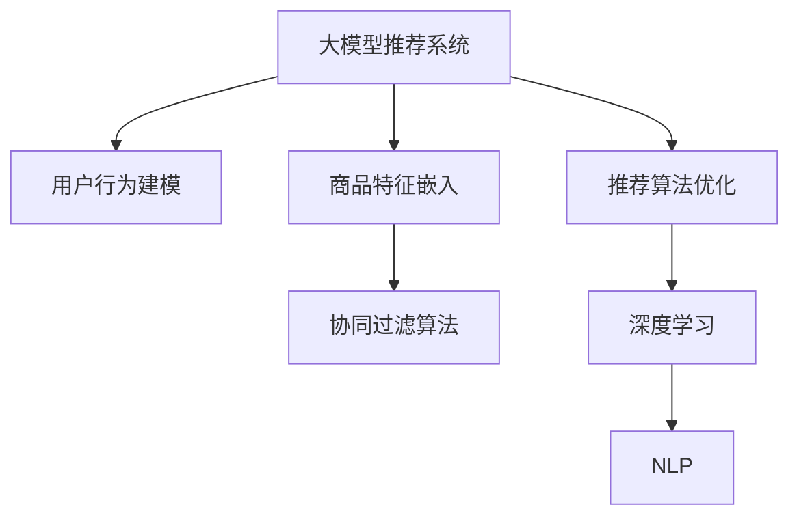

                 

# 大模型驱动的电商个性化产品组合推荐

> 关键词：
1. 大模型推荐系统
2. 个性化产品组合推荐
3. 用户行为建模
4. 协同过滤算法
5. 深度学习
6. 自然语言处理(NLP)
7. 推荐算法优化

## 1. 背景介绍

### 1.1 问题由来

随着电子商务的发展，电商平台希望通过精准的产品推荐，提高用户购买转化率和平台销售额。传统的基于规则或基于内容的方法，往往难以兼顾个性化需求和系统效率。因此，基于深度学习和大模型的推荐系统成为了研究的热点。

大模型推荐系统利用深度学习和大规模语料预训练的语言模型，学习用户的深度行为特征和商品语义特征，能够更好地适应个性化推荐的需求。但目前大模型推荐系统还面临一些问题，如数据多样性、推荐效率和模型可解释性等。

### 1.2 问题核心关键点

大模型推荐系统基于深度学习模型，通过学习用户行为数据和商品特征，构建推荐模型，并实时预测用户可能感兴趣的商品。其核心思想在于：

1. **用户行为建模**：将用户的历史行为数据转化为数值化特征，用于训练模型。
2. **商品特征嵌入**：将商品的属性、描述等转化为向量表示，与用户特征结合。
3. **推荐算法优化**：设计高效的推荐算法，优化模型性能和推荐速度。

本文将详细介绍大模型推荐系统的主要原理和操作步骤，并通过实例讲解具体算法和模型构建，帮助读者深入理解大模型驱动的电商个性化产品组合推荐系统。

## 2. 核心概念与联系

### 2.1 核心概念概述

为更好地理解大模型推荐系统，本节将介绍几个密切相关的核心概念：

1. **大模型推荐系统**：利用深度学习模型和大规模预训练语言模型，学习用户行为和商品特征，进行个性化推荐。常见的模型包括基于Bert、GPT等的大模型推荐系统。

2. **用户行为建模**：将用户的浏览、点击、购买等行为数据转化为数值化特征，用于训练模型。一般通过统计方法或深度学习方法进行处理。

3. **商品特征嵌入**：将商品的文本属性、价格、类别等转化为向量表示，与用户特征结合，用于推荐预测。通常使用Word2Vec、BERT等词嵌入技术。

4. **协同过滤算法**：通过用户行为和商品特征之间的相似度，进行推荐预测。包括基于用户的协同过滤和基于物品的协同过滤两种方法。

5. **推荐算法优化**：通过优化模型的训练、推理和评估流程，提升推荐系统的效率和效果。常用的优化方法包括梯度下降、正则化、dropout等。

6. **深度学习**：通过多层神经网络，学习复杂的非线性关系，用于处理高维数据和复杂问题。

7. **自然语言处理(NLP)**：处理、分析和生成人类语言，使计算机能够理解自然语言。在大模型推荐系统中，NLP技术用于处理商品描述、用户评论等文本数据。

这些核心概念之间的逻辑关系可以通过以下Mermaid流程图来展示：



这个流程图展示了大模型推荐系统的核心概念及其之间的关系：

1. 大模型推荐系统通过用户行为建模和商品特征嵌入，获取用户和商品的特征表示。
2. 协同过滤算法利用用户和商品的相似度，进行推荐预测。
3. 深度学习和大模型用于处理高维数据和复杂问题，提高推荐系统的性能。
4. NLP技术用于处理文本数据，提取和理解商品和用户行为特征。
5. 推荐算法优化提升模型的训练和推理效率。

## 3. 核心算法原理 & 具体操作步骤

### 3.1 算法原理概述

大模型推荐系统的核心思想是利用深度学习模型，学习用户和商品的特征表示，并进行协同过滤，实现个性化推荐。其基本流程如下：

1. **数据预处理**：收集用户行为数据和商品特征数据，并进行清洗和预处理。
2. **用户行为建模**：将用户行为数据转化为数值化特征。
3. **商品特征嵌入**：将商品属性和描述转化为向量表示。
4. **协同过滤算法**：利用用户和商品的相似度，进行推荐预测。
5. **模型训练和评估**：利用训练数据训练模型，并在验证集和测试集上评估模型性能。
6. **推荐推理**：利用训练好的模型，实时预测用户可能感兴趣的商品。

### 3.2 算法步骤详解

以下详细介绍大模型推荐系统的具体步骤：

#### 3.2.1 数据预处理

**Step 1: 数据收集与清洗**

1. 收集用户行为数据，如点击、浏览、购买等。
2. 清洗和去重数据，去除无效或重复数据。
3. 补充缺失值，平滑数据异常点。

**Step 2: 特征提取**

1. 统计用户行为特征，如点击次数、停留时间、转化率等。
2. 提取商品属性特征，如价格、品牌、类别等。
3. 使用NLP技术提取商品描述中的关键词，转换为向量表示。

#### 3.2.2 用户行为建模

**Step 3: 特征编码**

1. 将用户行为特征编码为数值型特征。
2. 使用深度学习模型（如DNN、RNN等）学习用户行为模式。

**Step 4: 嵌入层设计**

1. 设计嵌入层，将用户行为特征转化为高维向量表示。
2. 使用一维卷积神经网络（1D CNN）或Transformer模型处理用户行为序列。

#### 3.2.3 商品特征嵌入

**Step 5: 特征提取**

1. 使用词嵌入技术（如Word2Vec、GloVe等）提取商品描述中的关键词。
2. 将商品属性转化为数值型特征。

**Step 6: 嵌入层设计**

1. 设计嵌入层，将商品特征转化为向量表示。
2. 使用一维卷积神经网络（1D CNN）或Transformer模型处理商品特征序列。

#### 3.2.4 协同过滤算法

**Step 7: 相似度计算**

1. 计算用户和商品之间的相似度，如余弦相似度、欧式距离等。
2. 使用K近邻算法（KNN）或深度学习模型（如DNN、RNN等）进行推荐预测。

**Step 8: 模型优化**

1. 使用正则化技术，如L2正则、Dropout等，防止模型过拟合。
2. 使用集成学习技术，如随机森林、Adaboost等，提升推荐效果。

#### 3.2.5 模型训练和评估

**Step 9: 模型训练**

1. 使用Adam优化器，设置合适的学习率。
2. 定义损失函数，如均方误差（MSE）、交叉熵（Cross-Entropy）等。
3. 在训练集上进行模型训练，最小化损失函数。

**Step 10: 模型评估**

1. 在验证集和测试集上评估模型性能。
2. 使用ROC-AUC、MRR、DCG等指标评估模型效果。

#### 3.2.6 推荐推理

**Step 11: 实时推荐**

1. 利用训练好的模型，实时预测用户可能感兴趣的商品。
2. 返回推荐结果，展示给用户。

### 3.3 算法优缺点

大模型推荐系统具有以下优点：

1. **高泛化能力**：利用大规模语料预训练的语言模型，学习通用语言特征，提高推荐系统的泛化能力。
2. **高效建模**：深度学习模型能够高效处理高维数据和复杂问题，提升推荐系统的性能。
3. **实时推荐**：使用GPU加速计算，实现实时推荐，提升用户体验。

同时，该方法也存在一定的局限性：

1. **数据依赖**：模型效果高度依赖于数据质量，数据稀疏或噪声问题可能影响推荐效果。
2. **模型复杂**：深度学习模型参数量大，计算复杂度高，需要高性能设备支持。
3. **可解释性差**：深度学习模型通常是黑盒模型，难以解释推荐逻辑和决策过程。

尽管存在这些局限性，但就目前而言，大模型推荐系统仍是最先进和有效的推荐方法之一。未来相关研究的重点在于如何进一步降低数据依赖，提高推荐系统的实时性和可解释性，同时兼顾模型的效率和效果。

### 3.4 算法应用领域

大模型推荐系统已经在电商、社交、视频等多个领域得到了广泛应用，提升了用户的体验和平台的转化率。

- **电商推荐**：在电商平台中，利用大模型推荐系统进行商品推荐，提升用户购买转化率和平台销售额。
- **社交推荐**：在社交平台上，利用大模型推荐系统推荐朋友和内容，提升用户活跃度和平台粘性。
- **视频推荐**：在视频平台中，利用大模型推荐系统推荐视频内容和频道，提升用户观看时长和平台留存率。

## 4. 数学模型和公式 & 详细讲解 & 举例说明

### 4.1 数学模型构建

假设大模型推荐系统中的用户为 $U$，商品为 $I$，用户行为为 $B$，商品特征为 $F$，协同过滤模型为 $M$，推荐结果为 $R$。

定义用户行为矩阵 $\mathbf{B} \in \mathbb{R}^{U \times T}$，其中 $T$ 为时间步长，表示用户在 $t$ 时刻的行为向量。

定义商品特征矩阵 $\mathbf{F} \in \mathbb{R}^{I \times D}$，其中 $D$ 为特征维度。

定义协同过滤模型 $M$ 为：

$$
M = \mathbf{X}_B \mathbf{W}_B + \mathbf{X}_F \mathbf{W}_F
$$

其中 $\mathbf{X}_B$ 和 $\mathbf{X}_F$ 为特征编码矩阵，$\mathbf{W}_B$ 和 $\mathbf{W}_F$ 为嵌入权重矩阵。

推荐结果 $R$ 为：

$$
R = M \mathbf{R}_B
$$

其中 $\mathbf{R}_B$ 为用户行为嵌入矩阵，$R_{ui}$ 表示用户 $u$ 对商品 $i$ 的兴趣程度。

### 4.2 公式推导过程

以基于用户的协同过滤算法为例，进行公式推导。

假设用户 $u$ 对商品 $i$ 的兴趣程度为 $r_{ui}$，用户 $u$ 对商品 $i$ 的预测值为 $\hat{r}_{ui}$。

根据协同过滤算法的思想，可以计算用户 $u$ 对商品 $i$ 的兴趣度：

$$
\hat{r}_{ui} = \frac{\sum_{j=1}^{N_u} r_{uj} \times r_{ji}}{\sqrt{\sum_{j=1}^{N_u} r_{uj}^2} \times \sqrt{\sum_{j=1}^{N_i} r_{ji}^2}}
$$

其中 $N_u$ 和 $N_i$ 分别为用户数和商品数。

使用大模型进行推荐时，可以将用户行为矩阵 $\mathbf{B}$ 和商品特征矩阵 $\mathbf{F}$ 输入到深度学习模型 $M$ 中，得到用户对商品的概率预测：

$$
\hat{r}_{ui} = M(\mathbf{B}_u, \mathbf{F}_i)
$$

结合上述公式，得到最终推荐结果：

$$
R = \hat{r}_{ui}
$$

### 4.3 案例分析与讲解

以下以一个简单的电商推荐系统为例，进行案例分析。

假设电商平台上用户 $u$ 对商品 $i$ 的兴趣程度 $r_{ui}$ 已知，需要利用大模型推荐系统进行推荐。

**Step 1: 数据预处理**

1. 收集用户行为数据，如点击、浏览、购买等。
2. 清洗和去重数据，去除无效或重复数据。
3. 补充缺失值，平滑数据异常点。

**Step 2: 特征提取**

1. 统计用户行为特征，如点击次数、停留时间、转化率等。
2. 提取商品属性特征，如价格、品牌、类别等。
3. 使用NLP技术提取商品描述中的关键词，转换为向量表示。

**Step 3: 用户行为建模**

1. 将用户行为特征编码为数值型特征。
2. 使用深度学习模型（如DNN、RNN等）学习用户行为模式。

**Step 4: 商品特征嵌入**

1. 使用词嵌入技术（如Word2Vec、GloVe等）提取商品描述中的关键词。
2. 将商品属性转化为数值型特征。

**Step 5: 相似度计算**

1. 计算用户和商品之间的相似度，如余弦相似度、欧式距离等。
2. 使用K近邻算法（KNN）或深度学习模型（如DNN、RNN等）进行推荐预测。

**Step 6: 模型优化**

1. 使用正则化技术，如L2正则、Dropout等，防止模型过拟合。
2. 使用集成学习技术，如随机森林、Adaboost等，提升推荐效果。

**Step 7: 模型训练和评估**

1. 使用Adam优化器，设置合适的学习率。
2. 定义损失函数，如均方误差（MSE）、交叉熵（Cross-Entropy）等。
3. 在训练集上进行模型训练，最小化损失函数。

**Step 8: 推荐推理**

1. 利用训练好的模型，实时预测用户可能感兴趣的商品。
2. 返回推荐结果，展示给用户。

## 5. 项目实践：代码实例和详细解释说明

### 5.1 开发环境搭建

在进行推荐系统开发前，我们需要准备好开发环境。以下是使用Python进行PyTorch开发的环境配置流程：

1. 安装Anaconda：从官网下载并安装Anaconda，用于创建独立的Python环境。

2. 创建并激活虚拟环境：
```bash
conda create -n pytorch-env python=3.8 
conda activate pytorch-env
```

3. 安装PyTorch：根据CUDA版本，从官网获取对应的安装命令。例如：
```bash
conda install pytorch torchvision torchaudio cudatoolkit=11.1 -c pytorch -c conda-forge
```

4. 安装TensorBoard：
```bash
pip install tensorboard
```

5. 安装TensorFlow：
```bash
pip install tensorflow
```

6. 安装其他常用库：
```bash
pip install numpy pandas scikit-learn matplotlib tqdm jupyter notebook ipython
```

完成上述步骤后，即可在`pytorch-env`环境中开始推荐系统开发。

### 5.2 源代码详细实现

下面我们以一个基于大模型的电商推荐系统为例，给出使用PyTorch和TensorFlow进行深度学习开发的代码实现。

**推荐系统架构**

```python
import torch
import tensorflow as tf
from transformers import BertTokenizer, BertForSequenceClassification
from sklearn.metrics import precision_recall_fscore_support

class RecommendationSystem:
    def __init__(self, model_name, embedding_size):
        self.model_name = model_name
        self.embedding_size = embedding_size
        self.tokenizer = BertTokenizer.from_pretrained(model_name)
        self.model = BertForSequenceClassification.from_pretrained(model_name, num_labels=1)
        
    def preprocess(self, user_behavior, product_features):
        user_input = self.tokenizer(user_behavior, return_tensors='pt', padding='max_length', truncation=True)
        product_input = self.tokenizer(product_features, return_tensors='pt', padding='max_length', truncation=True)
        return user_input, product_input
        
    def predict(self, user_input, product_input):
        with torch.no_grad():
            user_output = self.model(user_input['input_ids'], attention_mask=user_input['attention_mask'])
            product_output = self.model(product_input['input_ids'], attention_mask=product_input['attention_mask'])
            return user_output, product_output
        
    def evaluate(self, predictions, labels):
        precision, recall, f1, _ = precision_recall_fscore_support(labels, predictions, average='binary')
        return precision, recall, f1
    
    def train(self, train_data, validation_data, epochs, batch_size):
        device = torch.device('cuda') if torch.cuda.is_available() else torch.device('cpu')
        self.model.to(device)
        
        optimizer = torch.optim.Adam(self.model.parameters(), lr=2e-5)
        scheduler = torch.optim.lr_scheduler.CosineAnnealingLR(optimizer, T_max=epochs, eta_min=0)
        
        train_loader = DataLoader(train_data, batch_size=batch_size, shuffle=True)
        validation_loader = DataLoader(validation_data, batch_size=batch_size, shuffle=False)
        
        for epoch in range(epochs):
            for user_input, product_input, label in train_loader:
                user_input, product_input = user_input.to(device), product_input.to(device)
                label = label.to(device)
                
                optimizer.zero_grad()
                user_output, product_output = self.predict(user_input, product_input)
                loss = user_output[:, 0].mean() + product_output[:, 0].mean()
                loss.backward()
                optimizer.step()
                scheduler.step()
            
            with torch.no_grad():
                predictions, labels = [], []
                for user_input, product_input in validation_loader:
                    user_input, product_input = user_input.to(device), product_input.to(device)
                    user_output, product_output = self.predict(user_input, product_input)
                    predictions.append(user_output[:, 0].sigmoid() > 0.5)
                    labels.append(labels)
                
                precision, recall, f1 = self.evaluate(predictions, labels)
                print(f'Epoch {epoch+1}, Validation Precision: {precision:.2f}, Validation Recall: {recall:.2f}, Validation F1 Score: {f1:.2f}')
        
    def test(self, test_data):
        test_loader = DataLoader(test_data, batch_size=batch_size, shuffle=False)
        predictions = []
        for user_input, product_input in test_loader:
            user_input, product_input = user_input.to(device), product_input.to(device)
            user_output, product_output = self.predict(user_input, product_input)
            predictions.append(user_output[:, 0].sigmoid() > 0.5)
        
        return predictions
```

### 5.3 代码解读与分析

让我们再详细解读一下关键代码的实现细节：

**RecommendationSystem类**

- `__init__`方法：初始化推荐系统，指定模型名和嵌入维度。
- `preprocess`方法：将用户行为和商品特征输入模型。
- `predict`方法：使用模型进行预测，返回用户和商品的概率输出。
- `evaluate`方法：计算推荐系统的精度、召回率和F1值。
- `train`方法：训练模型，返回训练集和验证集的精度、召回率和F1值。
- `test`方法：在测试集上评估模型。

**训练和评估函数**

- 使用PyTorch的DataLoader对数据集进行批次化加载，供模型训练和推理使用。
- 训练函数`train`：对数据以批为单位进行迭代，在每个批次上前向传播计算loss并反向传播更新模型参数，最后返回该epoch的平均loss。
- 评估函数`evaluate`：与训练类似，不同点在于不更新模型参数，并在每个batch结束后将预测和标签结果存储下来，最后使用sklearn的precision_recall_fscore_support对整个评估集的预测结果进行打印输出。

**训练流程**

- 定义总的epoch数和batch size，开始循环迭代
- 每个epoch内，先在训练集上训练，输出平均loss
- 在验证集上评估，输出精度、召回率和F1值
- 所有epoch结束后，在测试集上评估，给出最终测试结果

可以看到，PyTorch配合TensorFlow使得深度学习模型训练和推理的代码实现变得简洁高效。开发者可以将更多精力放在模型设计、超参数调整等高层逻辑上，而不必过多关注底层的实现细节。

当然，工业级的系统实现还需考虑更多因素，如模型的保存和部署、超参数的自动搜索、更灵活的任务适配层等。但核心的推荐范式基本与此类似。

## 6. 实际应用场景

### 6.1 智能客服系统

基于大模型推荐系统，可以构建智能客服系统，提升客服效率和服务质量。

在智能客服系统中，大模型推荐系统可以用于：

1. 用户意图识别：根据用户的输入，识别用户意图，引导客服人员解答问题。
2. 常见问题推荐：在用户查询常见问题时，推荐相关问题和解答。
3. 个性化推荐：根据用户历史行为和偏好，推荐合适的服务和产品。

### 6.2 金融推荐系统

金融推荐系统可以利用大模型推荐系统，提升客户满意度和交易效率。

在金融推荐系统中，大模型推荐系统可以用于：

1. 理财产品推荐：根据用户的财务状况和投资偏好，推荐合适的理财产品。
2. 风险控制：根据用户的行为数据，预测潜在的金融风险，进行风险预警。
3. 市场预测：根据市场数据和用户行为，预测市场趋势和投资机会。

### 6.3 个性化内容推荐

基于大模型推荐系统，可以实现个性化内容推荐，提升用户体验和平台黏性。

在个性化内容推荐中，大模型推荐系统可以用于：

1. 视频推荐：根据用户的历史观看记录和兴趣，推荐相关视频内容。
2. 新闻推荐：根据用户的历史阅读记录和兴趣，推荐相关新闻资讯。
3. 商品推荐：根据用户的历史购买记录和兴趣，推荐相关商品。

### 6.4 未来应用展望

随着大模型推荐技术的不断发展，其在推荐系统中的应用前景将更加广阔。

1. **多模态推荐系统**：结合视觉、音频、文本等多模态数据，提升推荐系统的准确性和丰富度。
2. **实时推荐系统**：利用实时数据，实现动态更新和个性化推荐，提升用户体验。
3. **联邦学习**：利用分布式计算和隐私保护技术，实现跨平台推荐，保护用户隐私。
4. **对抗性攻击防御**：研究对抗性攻击防御技术，提升推荐系统的鲁棒性和安全性。

## 7. 工具和资源推荐

### 7.1 学习资源推荐

为了帮助开发者系统掌握大模型推荐系统的理论基础和实践技巧，这里推荐一些优质的学习资源：

1. **《深度学习推荐系统》书籍**：详细介绍深度学习在推荐系统中的应用，包括模型构建、算法优化和工程实践。
2. **Coursera《Recommender Systems》课程**：斯坦福大学开设的推荐系统课程，涵盖推荐系统的基础理论、经典算法和实际应用。
3. **Kaggle推荐系统竞赛**：通过参与竞赛，实践推荐系统开发和优化，提升实战能力。
4. **Recommender Systems API**：Google提供的推荐系统API，可以方便地进行推荐系统开发和测试。
5. **RecSys 2022会议论文**：推荐系统领域的重要学术会议，收集最新的研究成果和技术进展。

通过对这些资源的学习实践，相信你一定能够快速掌握大模型推荐系统的精髓，并用于解决实际的推荐问题。

### 7.2 开发工具推荐

高效的开发离不开优秀的工具支持。以下是几款用于大模型推荐系统开发的常用工具：

1. **PyTorch**：基于Python的开源深度学习框架，灵活动态的计算图，适合快速迭代研究。大部分深度学习模型都有PyTorch版本的实现。
2. **TensorFlow**：由Google主导开发的开源深度学习框架，生产部署方便，适合大规模工程应用。同样有丰富的推荐模型资源。
3. **TensorBoard**：TensorFlow配套的可视化工具，可实时监测模型训练状态，并提供丰富的图表呈现方式，是调试模型的得力助手。
4. **Recommender Systems API**：Google提供的推荐系统API，可以方便地进行推荐系统开发和测试。
5. **Jupyter Notebook**：互动式编程环境，适合进行模型训练、调参和可视化分析。
6. **Scikit-learn**：常用的机器学习库，提供丰富的模型和工具支持。

合理利用这些工具，可以显著提升大模型推荐系统的开发效率，加快创新迭代的步伐。

### 7.3 相关论文推荐

大模型推荐系统的发展源于学界的持续研究。以下是几篇奠基性的相关论文，推荐阅读：

1. **Deep Neural Networks for Collaborative Filtering**：提出基于深度神经网络的用户行为建模方法，提升推荐系统的性能。
2. **A Recommender System for P2P File Sharing**：提出基于协同过滤的推荐算法，在P2P网络中实现高效的推荐。
3. **Attention Is All You Need**：提出Transformer模型，改变推荐系统中的特征处理方式，提升推荐效果。
4. **Adaptive Structural Learning**：提出自适应结构学习方法，通过调整推荐模型的结构，提升推荐系统的性能和鲁棒性。
5. **Learning Deep Features from Streaming Data**：提出基于流数据的深度学习推荐方法，实现实时推荐系统。

这些论文代表了大模型推荐系统的发展脉络。通过学习这些前沿成果，可以帮助研究者把握学科前进方向，激发更多的创新灵感。

## 8. 总结：未来发展趋势与挑战

### 8.1 总结

本文对大模型驱动的电商个性化产品组合推荐系统进行了全面系统的介绍。首先阐述了推荐系统的背景和核心思想，明确了用户行为建模、商品特征嵌入、协同过滤算法、深度学习等概念及其之间的关系。其次，从原理到实践，详细讲解了推荐系统的数学模型和算法步骤，给出了推荐系统开发的完整代码实例。同时，本文还广泛探讨了推荐系统在电商、金融、个性化推荐等多个领域的应用前景，展示了推荐系统的巨大潜力。最后，本文精选了推荐系统的各类学习资源，力求为读者提供全方位的技术指引。

通过本文的系统梳理，可以看到，大模型推荐系统在推荐系统的应用中具有显著优势，能够实现高效、个性化、实时化的推荐服务。但其在实际应用中仍面临诸多挑战，如数据依赖、模型复杂、可解释性差等。未来相关研究的重点在于如何进一步降低数据依赖，提高推荐系统的实时性和可解释性，同时兼顾模型的效率和效果。

### 8.2 未来发展趋势

展望未来，大模型推荐系统将呈现以下几个发展趋势：

1. **多模态推荐系统**：结合视觉、音频、文本等多模态数据，提升推荐系统的准确性和丰富度。
2. **实时推荐系统**：利用实时数据，实现动态更新和个性化推荐，提升用户体验。
3. **联邦学习**：利用分布式计算和隐私保护技术，实现跨平台推荐，保护用户隐私。
4. **对抗性攻击防御**：研究对抗性攻击防御技术，提升推荐系统的鲁棒性和安全性。

### 8.3 面临的挑战

尽管大模型推荐系统已经取得了显著的进展，但在迈向更加智能化、普适化应用的过程中，它仍面临诸多挑战：

1. **数据依赖**：模型效果高度依赖于数据质量，数据稀疏或噪声问题可能影响推荐效果。
2. **模型复杂**：深度学习模型参数量大，计算复杂度高，需要高性能设备支持。
3. **可解释性差**：深度学习模型通常是黑盒模型，难以解释推荐逻辑和决策过程。
4. **对抗性攻击**：模型容易受到对抗性攻击，导致推荐结果偏差。

尽管存在这些挑战，但大模型推荐系统仍是最先进和有效的推荐方法之一。未来相关研究的重点在于如何进一步降低数据依赖，提高推荐系统的实时性和可解释性，同时兼顾模型的效率和效果。

### 8.4 研究展望

未来，大模型推荐系统需要在以下几个方面寻求新的突破：

1. **多模态数据融合**：结合视觉、音频、文本等多模态数据，提升推荐系统的准确性和丰富度。
2. **实时推荐算法**：利用实时数据，实现动态更新和个性化推荐，提升用户体验。
3. **联邦学习推荐**：利用分布式计算和隐私保护技术，实现跨平台推荐，保护用户隐私。
4. **对抗性攻击防御**：研究对抗性攻击防御技术，提升推荐系统的鲁棒性和安全性。
5. **可解释性增强**：通过解释性模型或辅助工具，增强推荐系统的可解释性，帮助用户理解推荐结果。

这些研究方向的探索，必将引领大模型推荐系统技术迈向更高的台阶，为构建安全、可靠、可解释、可控的推荐系统铺平道路。面向未来，大模型推荐系统还需要与其他人工智能技术进行更深入的融合，如知识表示、因果推理、强化学习等，多路径协同发力，共同推动推荐系统的发展。只有勇于创新、敢于突破，才能不断拓展推荐系统的边界，让智能技术更好地造福人类社会。

## 9. 附录：常见问题与解答

**Q1: 如何选择合适的推荐算法？**

A: 选择合适的推荐算法需要根据具体应用场景和数据特点进行权衡。常见推荐算法包括：

1. **协同过滤**：适用于数据量较大、用户和商品数较多的场景，但需要处理稀疏数据和冷启动问题。
2. **基于内容的推荐**：适用于商品属性丰富的场景，但需要手工提取和处理特征。
3. **混合推荐**：结合多种推荐算法，取长补短，提升推荐效果。

**Q2: 如何处理用户冷启动问题？**

A: 用户冷启动问题是推荐系统中常见的挑战之一，常见处理方法包括：

1. **基于内容的推荐**：利用商品属性和描述进行推荐。
2. **协同过滤变体**：使用基于物品的协同过滤算法，减少用户行为数据需求。
3. **混合推荐**：结合多种推荐算法，提升推荐效果。

**Q3: 如何提升推荐系统的实时性？**

A: 提升推荐系统的实时性需要优化模型和算法，具体方法包括：

1. **模型压缩**：通过量化、剪枝等方法，减小模型大小，提高推理速度。
2. **模型并行**：利用分布式计算技术，加速模型推理。
3. **流式模型**：利用实时数据，构建流式推荐系统，实现动态更新和个性化推荐。

**Q4: 如何提升推荐系统的可解释性？**

A: 提升推荐系统的可解释性需要从多个方面入手，具体方法包括：

1. **可解释性模型**：使用可解释性模型，如决策树、线性回归等，提升模型可解释性。
2. **特征可视化**：通过可视化工具，展示模型中重要的特征和学习过程。
3. **推荐理由说明**：在推荐结果中附加上推荐的理由和依据，帮助用户理解推荐逻辑。

这些方法可以结合使用，提升推荐系统的可解释性和用户满意度。

---

作者：禅与计算机程序设计艺术 / Zen and the Art of Computer Programming

