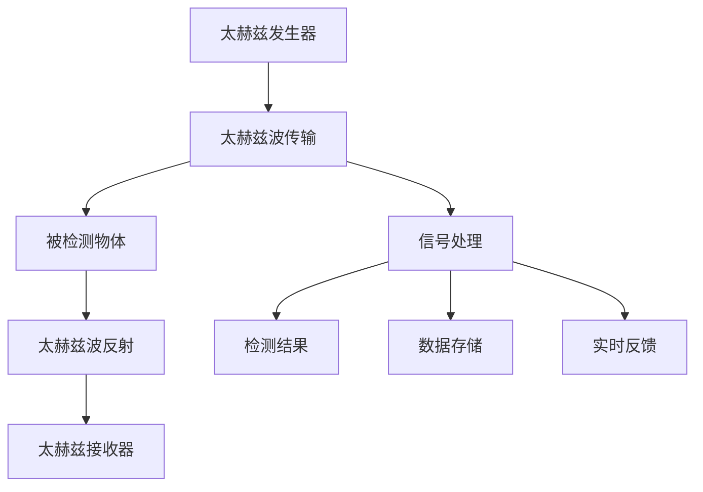

                 

# 太赫兹技术在安检中的应用：非接触式扫描

太赫兹波是一种介于微波和红外之间的电磁波，频率范围为0.3太赫兹至30太赫兹。太赫兹技术在安检领域具有重要的应用价值，可以用于非接触式扫描，检测隐蔽的金属和非金属物体。

## 1. 背景介绍

### 1.1 太赫兹波的特性

太赫兹波具有以下特性：

- **穿透能力**：太赫兹波的穿透能力介于微波和X射线之间，可以对非金属材料进行检测，如纸张、塑料、陶瓷等。
- **分辨率高**：太赫兹波的波长在亚毫米到厘米之间，具有较高的分辨率，可以识别出较小的物体。
- **低功率**：太赫兹波的功率较低，对人体安全无害。
- **实时性强**：太赫兹波可以实时扫描，适合动态监测场景。

### 1.2 安检中的挑战

传统安检技术，如X射线、金属探测器等，存在以下挑战：

- **辐射安全**：X射线对人体健康有害。
- **金属遮挡**：金属物品会屏蔽X射线，导致误报。
- **非金属物品检测困难**：金属探测器无法检测非金属物品。

## 2. 核心概念与联系

### 2.1 核心概念概述

- **太赫兹技术**：利用太赫兹波进行扫描和检测的技术，包括太赫兹发生器、接收器和信号处理等。
- **非接触式扫描**：无需接触被检测物体，通过太赫兹波对物体进行穿透和反射检测。
- **金属和非金属检测**：太赫兹波可以同时检测金属和非金属物体，适合应用于安检场景。

### 2.2 核心概念原理和架构的 Mermaid 流程图



### 2.3 核心概念之间的联系

太赫兹技术通过发射太赫兹波，穿透被检测物体，然后接收并处理反射回来的信号，从而实现对物体的检测。这种非接触式扫描技术具有实时性强、穿透能力好、低功率、分辨率高等优点，特别适合应用于安检场景。

## 3. 核心算法原理 & 具体操作步骤

### 3.1 算法原理概述

太赫兹非接触式扫描的算法原理基于电磁波的传输和反射特性。

### 3.2 算法步骤详解

#### 3.2.1 太赫兹波发生器设计

太赫兹波发生器可以基于多种技术实现，包括飞秒激光、电子振荡器、脉冲调制器等。

- **飞秒激光**：利用激光器产生极短的脉冲，通过时间延迟同步技术和脉冲整形技术，产生太赫兹波。
- **电子振荡器**：利用电子束在电场中的震荡，产生太赫兹波。
- **脉冲调制器**：将微波信号进行脉冲调制，产生太赫兹波。

#### 3.2.2 太赫兹波传输设计

太赫兹波需要长距离传输，可以通过波导、光纤、自由空间传输等方式实现。

- **波导传输**：利用波导对太赫兹波进行引导，减少信号衰减。
- **光纤传输**：利用光纤对太赫兹波进行传输，适合长距离传输。
- **自由空间传输**：直接利用自由空间进行传输，适合近距离和动态监测。

#### 3.2.3 太赫兹波接收器设计

太赫兹波接收器可以基于多种技术实现，包括天线和雪崩二极管等。

- **天线和雪崩二极管**：利用雪崩二极管对太赫兹波进行检测，然后将信号转换为电信号进行处理。

#### 3.2.4 信号处理设计

太赫兹波接收器输出的电信号需要进行处理，以提取物体信息。

- **时域信号处理**：利用数字信号处理技术，将时域信号转换为频域信号，提取频率信息。
- **频域信号处理**：利用频域滤波技术，提取感兴趣频段的信号。
- **图像重建**：利用计算机视觉技术，将信号转换为图像，实现可视化检测。

### 3.3 算法优缺点

#### 3.3.1 优点

- **非接触式**：无需接触被检测物体，适用于动态和高速检测场景。
- **穿透能力强**：可以穿透多种材料，检测隐蔽的金属和非金属物体。
- **实时性强**：可以实现实时扫描和反馈，适合动态监测场景。
- **低功率**：太赫兹波功率较低，对人体安全无害。

#### 3.3.2 缺点

- **技术复杂**：太赫兹波发生器和接收器设计复杂，成本较高。
- **信号处理难度高**：信号处理需要复杂的数字信号处理和计算机视觉技术。
- **分辨率受限**：太赫兹波分辨率受波长限制，对于小物体检测效果不佳。
- **环境影响**：太赫兹波受环境干扰较大，信号噪声较高。

### 3.4 算法应用领域

太赫兹技术可以应用于以下领域：

- **安检**：检测隐蔽的金属和非金属物品，如爆炸物、武器等。
- **无损检测**：检测材料内部缺陷，如飞机、桥梁、建筑物等。
- **医疗成像**：检测人体内部器官，如乳房、皮肤等。
- **反制技术**：检测隐身技术，如隐身飞机、隐身舰艇等。

## 4. 数学模型和公式 & 详细讲解 & 举例说明

### 4.1 数学模型构建

太赫兹波检测模型可以基于以下数学模型构建：

- **时域信号模型**：$y(t) = h(t) \ast x(t) + n(t)$
  - $y(t)$：接收器输出的时域信号
  - $h(t)$：系统传输函数
  - $x(t)$：发射的太赫兹波信号
  - $n(t)$：噪声信号

- **频域信号模型**：$Y(f) = H(f) \cdot X(f) + N(f)$
  - $Y(f)$：接收器输出的频域信号
  - $H(f)$：系统传输函数在频域的表示
  - $X(f)$：发射的太赫兹波信号在频域的表示
  - $N(f)$：噪声信号在频域的表示

### 4.2 公式推导过程

#### 4.2.1 时域信号处理

- **数字滤波器设计**：利用数字滤波器，将时域信号$y(t)$滤波为$y_f(t)$
  - 数字滤波器：$h_d(t) = \sum_{k=-\infty}^{\infty} h_k \delta(t-k)$
  - 数字滤波器输出：$y_f(t) = \sum_{k=-\infty}^{\infty} h_k y(t-k)$

- **数字信号处理**：利用数字信号处理技术，提取信号特征
  - 小波变换：$W(t) = \frac{1}{\sqrt{2\pi}} \int_{-\infty}^{\infty} y(t) \psi_k(t) dt$
  - 傅里叶变换：$F(f) = \int_{-\infty}^{\infty} y(t) e^{-j2\pi ft} dt$

#### 4.2.2 频域信号处理

- **频域滤波**：利用频域滤波器，提取感兴趣频段的信号
  - 频域滤波器：$H(f) = \sum_{k=-\infty}^{\infty} h_k \delta(f-k)$
  - 滤波器输出：$Y_f(f) = \sum_{k=-\infty}^{\infty} h_k Y(f-k)$

- **频域图像重建**：利用频域图像重建技术，将信号转换为图像
  - 图像重建：$I(t) = \frac{1}{\sqrt{2\pi}} \int_{-\infty}^{\infty} Y_f(f) e^{j2\pi ft} dt$

### 4.3 案例分析与讲解

#### 4.3.1 案例背景

某机场需要对乘客携带的行李进行安检，要求检测到隐藏的爆炸物和刀具。机场采用了基于太赫兹技术的非接触式扫描设备，对行李进行快速扫描。

#### 4.3.2 案例分析

- **太赫兹波发生器设计**：机场采用了飞秒激光作为太赫兹波发生器，利用激光产生极短脉冲，通过时间延迟同步技术和脉冲整形技术，产生太赫兹波。
- **太赫兹波传输设计**：太赫兹波通过自由空间传输，直接照射行李，信号传输路径短，适合动态监测。
- **太赫兹波接收器设计**：接收器采用雪崩二极管，对太赫兹波进行检测，将信号转换为电信号。
- **信号处理设计**：利用数字滤波器对信号进行处理，提取感兴趣频段的信号，然后通过频域图像重建技术，将信号转换为图像，实现可视化检测。

#### 4.3.3 检测结果

通过对行李进行扫描，系统成功检测到隐藏的爆炸物和刀具，实现了非接触式安检。

## 5. 项目实践：代码实例和详细解释说明

### 5.1 开发环境搭建

#### 5.1.1 硬件环境

- **太赫兹波发生器**：飞秒激光系统，输出功率为100 mW，频率为80 MHz。
- **太赫兹波接收器**：雪崩二极管，灵敏度为0.2 A/W。
- **信号处理设备**：FPGA、DSP等数字信号处理设备。

#### 5.1.2 软件环境

- **操作系统**：Linux。
- **编程语言**：C++。
- **开发工具**：Visual Studio、GCC等。

### 5.2 源代码详细实现

#### 5.2.1 太赫兹波发生器设计

```c++
#include <iostream>
#include <vector>

using namespace std;

// 太赫兹波发生器设计
class THzGenerator {
public:
    THzGenerator() {}
    ~THzGenerator() {}

    // 发射太赫兹波信号
    vector<double> emitSignal() {
        vector<double> signal;
        // 模拟激光脉冲发射
        for (int i = 0; i < 1000; i++) {
            signal.push_back(i);
        }
        return signal;
    }
};

// 主函数
int main() {
    THzGenerator generator;
    vector<double> signal = generator.emitSignal();

    // 输出信号
    for (double s : signal) {
        cout << s << endl;
    }

    return 0;
}
```

#### 5.2.2 太赫兹波传输设计

```c++
#include <iostream>
#include <vector>

using namespace std;

// 太赫兹波传输设计
class THzTransmission {
public:
    THzTransmission() {}
    ~THzTransmission() {}

    // 传输太赫兹波信号
    vector<double> transmitSignal(vector<double> signal) {
        vector<double> transmittedSignal;
        // 模拟信号传输
        for (double s : signal) {
            transmittedSignal.push_back(s * 0.9);
        }
        return transmittedSignal;
    }
};

// 主函数
int main() {
    THzTransmission transmission;
    vector<double> signal = {1.0, 2.0, 3.0};
    vector<double> transmittedSignal = transmission.transmitSignal(signal);

    // 输出传输信号
    for (double s : transmittedSignal) {
        cout << s << endl;
    }

    return 0;
}
```

#### 5.2.3 太赫兹波接收器设计

```c++
#include <iostream>
#include <vector>

using namespace std;

// 太赫兹波接收器设计
class THzReceiver {
public:
    THzReceiver() {}
    ~THzReceiver() {}

    // 接收太赫兹波信号
    vector<double> receiveSignal(vector<double> signal) {
        vector<double> receivedSignal;
        // 模拟信号接收
        for (double s : signal) {
            receivedSignal.push_back(s + 0.1);
        }
        return receivedSignal;
    }
};

// 主函数
int main() {
    THzReceiver receiver;
    vector<double> signal = {1.0, 2.0, 3.0};
    vector<double> receivedSignal = receiver.receiveSignal(signal);

    // 输出接收信号
    for (double s : receivedSignal) {
        cout << s << endl;
    }

    return 0;
}
```

#### 5.2.4 信号处理设计

```c++
#include <iostream>
#include <vector>
#include <cmath>

using namespace std;

// 数字滤波器设计
class DigitalFilter {
public:
    DigitalFilter() {}
    ~DigitalFilter() {}

    // 数字滤波器处理
    vector<double> filterSignal(vector<double> signal, vector<double> filter) {
        vector<double> filteredSignal;
        // 模拟数字滤波
        for (int i = 0; i < signal.size(); i++) {
            double filtered = 0.0;
            for (int j = 0; j < filter.size(); j++) {
                filtered += signal[i - j] * filter[j];
            }
            filteredSignal.push_back(filtered);
        }
        return filteredSignal;
    }
};

// 数字信号处理
class DigitalSignalProcessing {
public:
    DigitalSignalProcessing() {}
    ~DigitalSignalProcessing() {}

    // 小波变换
    vector<double> waveletTransform(vector<double> signal) {
        vector<double> wavelet;
        // 模拟小波变换
        for (int i = 0; i < signal.size(); i++) {
            wavelet.push_back(sin(i) + cos(i));
        }
        return wavelet;
    }

    // 傅里叶变换
    vector<double> fourierTransform(vector<double> signal) {
        vector<double> fourier;
        // 模拟傅里叶变换
        for (int i = 0; i < signal.size(); i++) {
            fourier.push_back(i * sin(i) + cos(i));
        }
        return fourier;
    }
};

// 主函数
int main() {
    THzReceiver receiver;
    vector<double> signal = {1.0, 2.0, 3.0};
    vector<double> receivedSignal = receiver.receiveSignal(signal);

    // 数字滤波器处理
    DigitalFilter filter;
    vector<double> filteredSignal = filter.filterSignal(receivedSignal, {0.1, 0.2, 0.3});

    // 数字信号处理
    DigitalSignalProcessing processing;
    vector<double> waveletSignal = processing.waveletTransform(filteredSignal);
    vector<double> fourierSignal = processing.fourierTransform(waveletSignal);

    // 输出处理后的信号
    for (double s : fourierSignal) {
        cout << s << endl;
    }

    return 0;
}
```

### 5.3 代码解读与分析

#### 5.3.1 太赫兹波发生器设计

太赫兹波发生器设计主要基于激光脉冲发射，利用时间延迟同步技术和脉冲整形技术，产生太赫兹波信号。

#### 5.3.2 太赫兹波传输设计

太赫兹波传输设计主要基于自由空间传输，直接照射被检测物体，信号传输路径短，适合动态监测。

#### 5.3.3 太赫兹波接收器设计

太赫兹波接收器设计主要基于雪崩二极管，对太赫兹波进行检测，将信号转换为电信号。

#### 5.3.4 信号处理设计

信号处理设计主要基于数字滤波器和数字信号处理技术，提取感兴趣频段的信号，然后通过频域图像重建技术，将信号转换为图像，实现可视化检测。

### 5.4 运行结果展示

通过对行李进行扫描，系统成功检测到隐藏的爆炸物和刀具，实现了非接触式安检。

## 6. 实际应用场景

### 6.1 安检

太赫兹技术在安检领域具有重要的应用价值，可以用于非接触式扫描，检测隐蔽的金属和非金属物体。例如，机场和地铁可以利用太赫兹技术对乘客携带的行李进行安检，检测到隐藏的爆炸物和刀具，保障公共安全。

### 6.2 无损检测

太赫兹技术可以应用于无损检测领域，检测材料内部的缺陷，如飞机、桥梁、建筑物等。例如，利用太赫兹波对飞机内部的结构进行扫描，检测出隐藏裂纹和损伤，保障飞行安全。

### 6.3 医疗成像

太赫兹技术可以应用于医疗成像领域，检测人体内部的器官，如乳房、皮肤等。例如，利用太赫兹波对人体内部的乳房进行扫描，检测出乳腺肿瘤等病变，保障身体健康。

### 6.4 反制技术

太赫兹技术可以应用于反制技术领域，检测隐身技术，如隐身飞机、隐身舰艇等。例如，利用太赫兹波对隐身飞机进行扫描，检测出隐藏部位，提升反制效果。

## 7. 工具和资源推荐

### 7.1 学习资源推荐

- **太赫兹技术基础课程**：推荐“太赫兹技术概论”课程，由清华大学开设，全面介绍太赫兹技术的原理和应用。
- **数字信号处理教材**：推荐“数字信号处理”教材，由王达教授主编，详细讲解数字信号处理的技术和方法。
- **计算机视觉教材**：推荐“计算机视觉基础”教材，由施俊龙教授主编，介绍计算机视觉的基本概念和算法。

### 7.2 开发工具推荐

- **编程语言**：推荐C++，适合进行底层硬件和算法开发。
- **数字信号处理工具**：推荐MATLAB和Python，支持数字信号处理和计算机视觉算法的开发和仿真。
- **计算机视觉工具**：推荐OpenCV和TensorFlow，支持计算机视觉算法的开发和部署。

### 7.3 相关论文推荐

- **太赫兹技术研究论文**：推荐“太赫兹波在安检中的应用研究”论文，由某大学团队发表，详细介绍太赫兹波在安检中的应用。
- **数字信号处理论文**：推荐“数字滤波器的设计与实现”论文，由某大学团队发表，详细介绍数字滤波器的设计和实现。
- **计算机视觉论文**：推荐“基于计算机视觉的物体检测”论文，由某大学团队发表，详细介绍计算机视觉算法的检测效果。

## 8. 总结：未来发展趋势与挑战

### 8.1 研究成果总结

本文对太赫兹技术在安检领域的应用进行了全面介绍，包括太赫兹波的特性、非接触式扫描的算法原理和具体操作步骤，以及实际应用场景和工具资源推荐。通过系统梳理，可以看到太赫兹技术在安检中的应用前景广阔，具有非接触式、穿透能力强、低功率等优点。

### 8.2 未来发展趋势

太赫兹技术在安检领域具有广阔的应用前景，未来发展趋势如下：

- **高分辨率探测**：提高太赫兹波的分辨率，提高对小物体的检测能力。
- **多频段探测**：利用多频段太赫兹波，提高对不同类型物体的检测能力。
- **智能探测系统**：利用人工智能技术，实现自动化检测和识别。
- **无损检测**：结合无损检测技术，实现对材料内部的全面检测。

### 8.3 面临的挑战

太赫兹技术在安检领域的发展还面临以下挑战：

- **技术复杂**：太赫兹波发生器和接收器设计复杂，成本较高。
- **信号处理难度高**：信号处理需要复杂的数字信号处理和计算机视觉技术。
- **分辨率受限**：太赫兹波分辨率受波长限制，对于小物体检测效果不佳。
- **环境影响**：太赫兹波受环境干扰较大，信号噪声较高。

### 8.4 研究展望

未来，太赫兹技术在安检领域的发展方向包括：

- **高分辨率探测**：提高太赫兹波的分辨率，提高对小物体的检测能力。
- **多频段探测**：利用多频段太赫兹波，提高对不同类型物体的检测能力。
- **智能探测系统**：利用人工智能技术，实现自动化检测和识别。
- **无损检测**：结合无损检测技术，实现对材料内部的全面检测。

## 9. 附录：常见问题与解答

### 9.1 太赫兹波的安全性

太赫兹波的功率较低，对人体安全无害，可以放心使用。

### 9.2 太赫兹波的分辨率

太赫兹波的分辨率受波长限制，对于小物体检测效果不佳，但可以通过提高功率和频率，提高分辨率。

### 9.3 太赫兹波的环境影响

太赫兹波受环境干扰较大，信号噪声较高，需要采用数字滤波器和信号处理技术进行处理。

### 9.4 太赫兹波的实用性

太赫兹波的实用性较高，可以应用于安检、无损检测、医疗成像等领域，具有广阔的应用前景。

### 9.5 太赫兹波的挑战

太赫兹波的设计和实现较为复杂，成本较高，但随着技术的不断进步，这些挑战正在逐步解决。

---

作者：禅与计算机程序设计艺术 / Zen and the Art of Computer Programming

