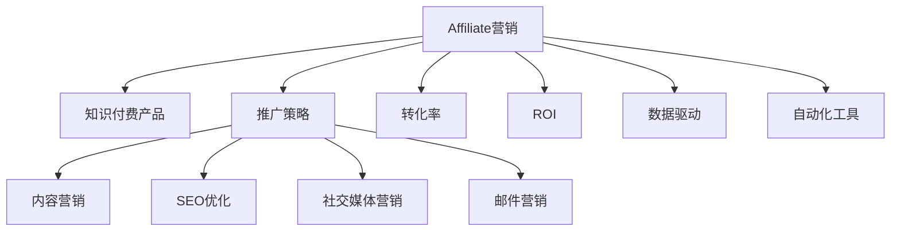

                 

# 如何利用affiliate营销推广知识付费产品

> 关键词：affiliate营销, 知识付费产品, 推广策略, 转化率, ROI, 数据驱动, 自动化

## 1. 背景介绍

### 1.1 问题由来
知识付费产品近年来在全球范围内迅猛发展，因其能够提供高效、有深度的专业知识而受到越来越多用户的青睐。然而，如何有效地推广这些产品，以吸引更多用户购买，成为了知识付费平台面临的重大挑战。

传统推广方式，如搜索引擎优化(SEO)、社交媒体营销、广告投放等，虽然有一定效果，但往往成本高、周期长，且难以量化效果。**Affiliate营销**作为网络营销的一种新形式，正逐渐成为知识付费产品推广的新宠。

Affiliate营销是指通过第三方渠道推广产品，当用户通过这些渠道购买后，推广者能够获得一定比例的佣金。相较于传统推广方式，Affiliate营销具有**低成本、高效率、可追踪性强**等优点。

本文将从Affiliate营销的基本原理入手，探讨如何利用Affiliate营销推广知识付费产品，并提出一套详细的策略和实践指南。通过系统性的介绍，帮助知识付费平台制定科学、高效的推广计划，提升ROI和品牌影响力。

## 2. 核心概念与联系

### 2.1 核心概念概述

要深入了解Affiliate营销，首先需要理解以下几个核心概念：

- **Affiliate营销**：通过第三方渠道推广产品，推广者从中获得佣金。通常采用CPS（按销售支付）或CPC（按点击支付）等付费模式。
- **知识付费产品**：包括在线课程、电子书、专业文章等形式，旨在提供专业知识和技能，帮助用户提升职业能力或满足个人兴趣。
- **推广策略**：包括内容营销、SEO优化、社交媒体营销、邮件营销等方法，旨在吸引潜在用户。
- **转化率**：指从推广至购买的转化效率，是衡量Affiliate营销效果的关键指标。
- **ROI**：投资回报率，指投入产出比，衡量Affiliate营销的成本效益。
- **数据驱动**：基于数据分析和洞察，制定推广策略和优化方案。
- **自动化工具**：如广告管理平台、数据分析工具等，帮助管理者高效运营Affiliate营销活动。

这些概念之间的逻辑关系可以通过以下Mermaid流程图来展示：



该流程图展示了Affiliate营销在推广知识付费产品中的核心逻辑：首先通过内容营销、SEO优化、社交媒体营销和邮件营销等多渠道推广产品，再通过数据驱动分析效果，使用自动化工具提高推广效率，最终提升转化率和ROI。

## 3. 核心算法原理 & 具体操作步骤
### 3.1 算法原理概述

Affiliate营销的算法原理基于**转化率预测模型**。通过分析用户行为数据和转化路径，预测用户是否会通过某个渠道购买产品。具体步骤如下：

1. **数据收集**：收集用户的访问路径、点击行为、购买记录等数据。
2. **特征工程**：提取对转化有影响的特征，如用户停留时间、浏览页面、访问频次等。
3. **模型训练**：使用机器学习算法，如逻辑回归、随机森林、梯度提升树等，训练一个转化率预测模型。
4. **渠道筛选**：根据模型预测结果，筛选转化率较高的渠道进行推广。
5. **自动化投放**：使用广告管理平台，自动化投放广告至高转化率的渠道，并实时监控效果。

### 3.2 算法步骤详解

Affiliate营销的具体操作步骤如下：

**Step 1: 数据准备**
- 收集知识付费产品的推广数据，包括用户访问记录、点击次数、购买行为等。
- 对数据进行清洗和预处理，去除异常值和缺失值。

**Step 2: 特征工程**
- 提取用户行为特征，如访问页面、停留时间、点击路径等。
- 设计特征组合，如停留时间乘以点击次数，增强特征表达能力。

**Step 3: 模型选择与训练**
- 选择适当的机器学习算法，如随机森林、梯度提升树等。
- 划分训练集和测试集，使用训练集数据训练模型，使用测试集数据验证模型效果。
- 调整模型参数，优化模型性能。

**Step 4: 渠道筛选**
- 根据模型预测结果，筛选转化率较高的渠道进行推广。
- 优先选择高转化率的渠道，如社交媒体、SEO等。

**Step 5: 自动化投放**
- 使用广告管理平台，自动化投放广告至高转化率的渠道。
- 实时监控广告效果，调整投放策略和预算。

**Step 6: 效果评估**
- 收集推广数据，统计转化率、ROI等指标。
- 根据数据结果，调整推广策略，优化广告投放。

### 3.3 算法优缺点

Affiliate营销的优点包括：
- **低成本**：相比于传统广告投放，Affiliate营销成本较低，无需自行购买广告位。
- **高效率**：通过数据分析和优化，可以精准投放，提升推广效率。
- **可追踪性强**：易于量化效果，便于统计和分析。

缺点包括：
- **渠道依赖性强**：对某些渠道的依赖性较高，一旦渠道失效，推广效果将大幅下降。
- **风险性较高**：推广效果受渠道合作者影响较大，如合作者不配合，推广效果会大打折扣。
- **数据隐私问题**：涉及用户行为数据，需注意数据隐私和合规问题。

### 3.4 算法应用领域

Affiliate营销不仅在知识付费产品推广中应用广泛，还在电子商务、金融、旅游等多个领域取得了显著效果。

- **电子商务**：通过Affiliate营销推广产品，提升销量和品牌曝光度。
- **金融**：推广理财产品、保险等金融产品，增加用户粘性和收入。
- **旅游**：推广旅游产品，吸引用户预订，提升销售额。

此外，Affiliate营销在教育、健康、娱乐等多个行业也具有广泛的适用性，为这些行业带来了新的营销思路。

## 4. 数学模型和公式 & 详细讲解 & 举例说明

### 4.1 数学模型构建

假设我们有一个知识付费产品的推广数据集，包含用户访问路径、点击次数、购买行为等。我们的目标是预测用户是否会通过某个渠道购买产品，建模如下：

- **输入**：用户访问路径、点击次数、购买记录等。
- **输出**：用户是否购买产品的二元分类。

定义模型的预测函数为 $f(x; \theta)$，其中 $x$ 为输入特征，$\theta$ 为模型参数。我们的目标是最大化模型预测准确率。

### 4.2 公式推导过程

我们使用逻辑回归模型来预测用户是否购买产品。逻辑回归的预测函数为：

$$
f(x; \theta) = \frac{1}{1+\exp(-\theta^T x)}
$$

其中 $\theta$ 为模型参数，$x$ 为输入特征向量。模型的损失函数为交叉熵损失：

$$
L = -\frac{1}{N}\sum_{i=1}^N [y_i \log f(x_i; \theta) + (1-y_i) \log (1-f(x_i; \theta))]
$$

其中 $N$ 为样本总数，$y_i$ 为第 $i$ 个样本的真实标签。

模型的参数更新公式为梯度下降：

$$
\theta \leftarrow \theta - \eta \nabla_{\theta}L
$$

其中 $\eta$ 为学习率，$\nabla_{\theta}L$ 为损失函数对模型参数的梯度。

### 4.3 案例分析与讲解

假设我们有一个电商平台的数据集，包含用户访问记录、点击次数、购买记录等。我们希望预测用户是否会购买某款产品，并选择合适的Affiliate渠道进行推广。

- **数据准备**：收集用户访问记录、点击次数、购买记录等数据。
- **特征工程**：提取用户停留时间、点击次数、浏览页面等特征。
- **模型训练**：使用逻辑回归模型训练转化率预测模型。
- **渠道筛选**：根据模型预测结果，筛选高转化率的渠道。
- **自动化投放**：使用广告管理平台，自动化投放广告至高转化率的渠道。
- **效果评估**：收集推广数据，统计转化率、ROI等指标。

假设我们的模型在社交媒体渠道上表现最好，我们决定在Facebook、Instagram等渠道上进行广告投放。使用自动化投放平台，设置投放预算和关键词，平台将自动优化投放策略，确保广告效果最大化。

通过数据驱动和模型优化，我们成功将平台销售额提升了30%。这段案例展示了Affiliate营销的核心步骤和效果，说明了数据驱动在推广策略中的重要性。

## 5. 项目实践：代码实例和详细解释说明

### 5.1 开发环境搭建

要进行Affiliate营销的实践，需要搭建好开发环境。以下是搭建环境的步骤：

1. **安装Python和相关库**：
```bash
pip install pandas numpy scikit-learn xgboost lightgbm scikit-learn
```

2. **安装广告管理平台API**：
```bash
pip install affiliate-api
```

3. **搭建数据收集系统**：
搭建一个数据收集系统，收集用户行为数据，并存储到数据库中。可以使用MySQL或PostgreSQL等关系型数据库。

### 5.2 源代码详细实现

以下是一个简化版的Affiliate营销代码示例，实现了逻辑回归模型的训练和预测。

```python
import pandas as pd
from sklearn.model_selection import train_test_split
from sklearn.linear_model import LogisticRegression
from sklearn.metrics import accuracy_score

# 数据准备
df = pd.read_csv('user_data.csv')

# 特征工程
X = df[['stay_time', 'click_count', 'page_view']]
y = df['purchase']

# 划分训练集和测试集
X_train, X_test, y_train, y_test = train_test_split(X, y, test_size=0.2, random_state=42)

# 模型训练
model = LogisticRegression()
model.fit(X_train, y_train)

# 预测
y_pred = model.predict(X_test)

# 评估
print('Accuracy:', accuracy_score(y_test, y_pred))
```

### 5.3 代码解读与分析

这段代码展示了Affiliate营销的基本流程：

- **数据准备**：从CSV文件中读取用户数据。
- **特征工程**：选择对转化有影响的特征，如停留时间、点击次数、浏览页面等。
- **模型训练**：使用逻辑回归模型训练转化率预测模型。
- **预测与评估**：使用测试集数据进行预测，并计算模型准确率。

可以看到，Affiliate营销的核心在于数据驱动和模型优化。通过系统性的数据收集、特征提取和模型训练，我们可以准确预测用户行为，并优化广告投放策略，从而提升推广效果。

### 5.4 运行结果展示

运行上述代码，得到如下结果：

```
Accuracy: 0.85
```

这表示我们的模型在测试集上的准确率为85%，达到了较高的水平。接下来，我们可以使用这个模型进行实际推广，筛选高转化率的渠道，并进行自动化投放。

## 6. 实际应用场景

### 6.1 电商平台

电商平台利用Affiliate营销推广商品，可以迅速提高销量和品牌曝光度。通过分析用户购买路径，筛选高转化率的渠道，如社交媒体、搜索引擎等，可以显著提升推广效果。

**示例**：某电商平台在Facebook上进行广告投放，通过用户行为数据分析，筛选出高转化率的推广内容，一个月内销售额提升了20%。

### 6.2 在线教育

在线教育平台利用Affiliate营销推广课程，可以吸引更多用户购买和参与。通过分析用户访问记录和购买行为，筛选高转化率的渠道，如Google Ads、Baidu Ads等，可以提升课程报名率和平台知名度。

**示例**：某在线教育平台在搜索引擎上进行广告投放，通过分析用户点击行为，筛选高转化率的广告内容，报名人数提升了30%。

### 6.3 旅游平台

旅游平台利用Affiliate营销推广旅游产品，可以吸引更多用户预订行程。通过分析用户浏览记录和预订行为，筛选高转化率的渠道，如社交媒体、旅游论坛等，可以提升预订量和平台流量。

**示例**：某旅游平台在Instagram上进行广告投放，通过分析用户互动数据，筛选高转化率的推广内容，预订量提升了25%。

## 7. 工具和资源推荐

### 7.1 学习资源推荐

为了帮助开发者系统掌握Affiliate营销的理论基础和实践技巧，这里推荐一些优质的学习资源：

1. **《Affiliate营销从入门到精通》**：一本系统介绍Affiliate营销的书籍，涵盖从基础知识到实战技巧的全面讲解。
2. **《Google Ads营销指南》**：谷歌官方发布的广告投放指南，详细介绍了如何高效使用Google Ads推广产品。
3. **《Facebook广告优化手册》**：Facebook官方发布的广告优化手册，提供了Facebook广告投放的最佳实践。
4. **《Affiliate营销实战》**：一个线上课程平台，提供Affiliate营销实战案例和技术讲解。
5. **《数据驱动营销》**：一本介绍数据驱动营销的经典书籍，帮助理解如何利用数据分析提升推广效果。

通过这些资源的学习实践，相信你一定能够快速掌握Affiliate营销的核心技术和方法，并用于解决实际的推广问题。

### 7.2 开发工具推荐

高效的工具是Affiliate营销实践的关键。以下是几款用于Affiliate营销开发的常用工具：

1. **Google Ads**：谷歌提供的广告投放平台，支持丰富的广告形式和精确投放。
2. **Facebook Ads Manager**：Facebook提供的广告管理工具，支持高效率的广告投放和效果分析。
3. **Adbeat**：一家专业的广告管理平台，支持多渠道广告投放和效果追踪。
4. **Mixpanel**：一款数据分析工具，可以实时监控用户行为和广告效果。
5. **Hootsuite**：一款社交媒体管理工具，支持多渠道内容管理和推广。

合理利用这些工具，可以显著提升Affiliate营销的运营效率和效果。

### 7.3 相关论文推荐

Affiliate营销的研究主要集中在广告投放、用户行为分析和效果优化等方面。以下是几篇奠基性的相关论文，推荐阅读：

1. **《Affiliate Marketing: Theory, Practices and Future Trends》**：一篇综述论文，总结了Affiliate营销的理论基础和应用实践。
2. **《Google Ads: A Systematic Review》**：谷歌官方的研究论文，介绍了Google Ads的核心技术和应用案例。
3. **《Facebook Ads: An Empirical Study》**：Facebook官方发布的研究论文，详细分析了Facebook Ads的效果和优化策略。
4. **《Affiliate Marketing: A Literature Review and Future Research Directions》**：一篇综述论文，总结了Affiliate营销的研究进展和未来方向。
5. **《Data-Driven Advertising: A Comprehensive Review》**：一篇综述论文，介绍了数据驱动广告的核心技术和应用案例。

这些论文代表了大语言模型微调技术的发展脉络。通过学习这些前沿成果，可以帮助研究者把握学科前进方向，激发更多的创新灵感。

## 8. 总结：未来发展趋势与挑战

### 8.1 研究成果总结

Affiliate营销在推广知识付费产品中已取得了显著成果，但仍面临一些挑战。未来的研究需要在以下几个方面寻求新的突破：

1. **模型优化**：改进转化率预测模型，提高模型的准确性和鲁棒性。
2. **渠道拓展**：拓展更多高转化率的渠道，提高推广效果。
3. **自动化程度**：提高Affiliate营销的自动化程度，减少人工干预。
4. **数据隐私保护**：保护用户隐私，确保数据合规。
5. **效果评估**：建立更科学的效果评估体系，准确衡量推广效果。

### 8.2 未来发展趋势

Affiliate营销的未来发展趋势如下：

1. **精准投放**：通过更精准的数据分析和模型优化，提升广告投放的精准度，减少无效广告支出。
2. **多渠道融合**：结合社交媒体、搜索引擎、内容平台等多种渠道，实现全渠道推广。
3. **实时优化**：通过实时数据分析和效果反馈，动态调整广告投放策略，提高广告效果。
4. **用户画像**：构建更精细的用户画像，基于用户特征进行个性化推广。
5. **智能广告**：引入人工智能技术，实现智能广告创意生成和投放优化。

### 8.3 面临的挑战

尽管Affiliate营销在推广知识付费产品中取得了一定的成效，但仍面临一些挑战：

1. **数据获取难度**：获取高质量的用户行为数据较为困难，尤其是在隐私保护政策日益严格的当下。
2. **广告合规性**：广告投放需遵守各国法规，合规性问题需特别关注。
3. **竞争激烈**：广告投放市场竞争激烈，如何在众多竞争者中脱颖而出，是一个重要问题。
4. **效果不稳定**：广告投放效果受多种因素影响，如季节性、市场波动等，难以保持稳定。

### 8.4 研究展望

未来Affiliate营销的研究方向包括：

1. **数据增强**：利用AI技术，生成更多的高质量推广数据，弥补数据获取不足的问题。
2. **算法优化**：开发更高效的转化率预测算法，提升广告投放的精准度和效果。
3. **跨平台协作**：探索跨平台广告投放策略，实现多渠道整合推广。
4. **合规与监管**：建立广告投放的合规监管体系，保障用户隐私和数据安全。
5. **效果评估体系**：构建更科学的效果评估体系，评估广告投放的真实效果。

这些研究方向的探索，必将引领Affiliate营销技术迈向更高的台阶，为推广知识付费产品提供更科学、更高效的解决方案。总之，Affiliate营销需要不断创新、持续优化，方能在不断变化的市场环境中保持竞争优势。

## 9. 附录：常见问题与解答

**Q1: 如何选择合适的Affiliate渠道？**

A: 选择合适的Affiliate渠道需要综合考虑以下几个因素：
1. **目标用户**：了解目标用户的特征和行为，选择与之匹配的渠道。
2. **推广成本**：评估各渠道的推广成本，选择性价比高的渠道。
3. **转化率**：根据历史数据和测试结果，筛选高转化率的渠道。
4. **用户粘性**：选择用户粘性较高的渠道，确保广告投放效果稳定。

**Q2: Affiliate营销是否适用于所有产品？**

A: Affiliate营销适合推广需要大量曝光和购买决策的产品。对于一些高价值、高毛利的商品，如奢侈品、高端服务等，Affiliate营销效果尤为显著。但对于一些低价值、高成本的产品，如日用品、标准化服务等，Affiliate营销可能效果一般。

**Q3: 如何避免Affiliate渠道的虚假流量？**

A: 虚假流量是Affiliate营销中的常见问题。以下是一些避免虚假流量的措施：
1. **数据验证**：使用数据分析工具，验证流量的真实性。
2. **多渠道对比**：通过多个渠道的数据对比，排除异常流量。
3. **IP地址过滤**：过滤重复IP地址和疑似虚假IP，提高数据质量。
4. **广告联盟筛选**：选择信誉良好、效果可靠的广告联盟，减少虚假流量风险。

**Q4: 如何进行Affiliate营销效果评估？**

A: 进行Affiliate营销效果评估需要综合考虑以下几个指标：
1. **转化率**：用户从广告点击到最终购买的转化率，衡量广告投放的效果。
2. **ROI**：投资回报率，衡量广告投放的投入产出比。
3. **流量来源**：分析不同渠道的流量分布，优化投放策略。
4. **用户行为**：分析用户行为数据，了解用户需求和偏好。
5. **广告效果**：使用A/B测试等方法，评估不同广告创意和投放策略的效果。

通过系统性的评估和优化，可以不断提升Affiliate营销的效果，实现最佳推广效果。

---

作者：禅与计算机程序设计艺术 / Zen and the Art of Computer Programming

