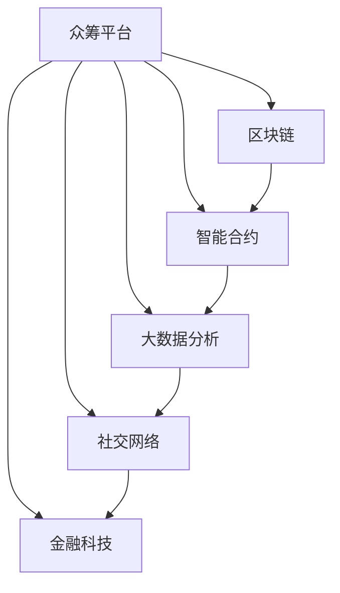

                 

# 如何利用技术能力进行众筹

> 关键词：众筹技术, 区块链, 智能合约, 大数据分析, 社交网络, 金融科技

## 1. 背景介绍

### 1.1 问题由来

众筹，一种通过网络平台汇集小额资金实现大项目筹资的方式，近年来在全球范围内迅速兴起，尤其是在科技创新、文化艺术、社会公益等领域，成为许多创业者和艺术家实现梦想的重要渠道。然而，传统的众筹平台面临着资金流转不透明、筹资效率低、欺诈风险高等问题，严重影响了众筹体验和信任度。

技术的进步为众筹行业的革新带来了新的可能性。本文将探讨如何利用技术手段提升众筹的效率、透明度和安全性，推动行业健康发展。

### 1.2 问题核心关键点

众筹技术的应用，需要解决以下几个核心问题：

- 如何实现资金的高效、透明流转？
- 如何保证筹资项目的真实性和合法性？
- 如何提高用户参与度和众筹成功率？
- 如何防范欺诈和资金风险？
- 如何提供优质项目展示和社区互动功能？

这些问题的解决，需要综合运用区块链技术、智能合约、大数据分析、社交网络等前沿技术手段。通过技术创新，可以显著提升众筹平台的效率、安全性和用户体验，增强用户对平台的信任度。

## 2. 核心概念与联系

### 2.1 核心概念概述

为了更好地理解众筹技术，本节将介绍几个密切相关的核心概念：

- 众筹平台(P2P Crowdfunding Platform)：提供一个安全、便捷的在线平台，供筹资者发布项目信息，投资者进行资金投入。
- 区块链(Blockchain)：一种去中心化的分布式账本技术，确保交易数据的安全、透明、不可篡改。
- 智能合约(Smart Contract)：运行在区块链上的一种自动化合约，一旦条件满足，自动执行预定义的合约条款。
- 大数据分析(Big Data Analytics)：通过收集、处理海量数据，进行深入分析，提供有价值的信息和洞察。
- 社交网络(Social Network)：基于关系网络的社交媒体平台，用于用户交流互动、分享内容。
- 金融科技(FinTech)：应用计算机技术和网络平台，提升金融服务的效率和质量，降低成本。

这些核心概念之间的逻辑关系可以通过以下Mermaid流程图来展示：



这个流程图展示了几类技术如何共同作用，支持众筹平台的高效、安全运行：

1. 区块链确保资金流转的安全透明。
2. 智能合约自动执行交易规则，降低欺诈风险。
3. 大数据分析提供项目质量和市场趋势的洞察。
4. 社交网络增强用户互动和项目展示效果。
5. 金融科技提升平台整体的效率和用户体验。

## 3. 核心算法原理 & 具体操作步骤
### 3.1 算法原理概述

众筹技术的核心在于通过技术手段，构建一个安全、透明、高效的项目筹资和资金流转系统。以下是众筹技术的主要算法原理：

- **区块链技术**：使用区块链去中心化的账本，记录每一笔资金的流转，确保每笔交易的不可篡改和透明性。

- **智能合约技术**：在区块链上部署智能合约，确保筹资项目和资金流转的自动化执行，减少人为干预和操作风险。

- **大数据分析技术**：利用大数据技术，对项目数据和用户行为进行分析，预测项目成功率和用户需求，优化资金分配和项目展示。

- **社交网络技术**：利用社交网络的分享和互动功能，提升项目的可见性和参与度。

- **金融科技技术**：通过金融科技手段，提高众筹平台的效率和用户体验，降低运营成本。

### 3.2 算法步骤详解

众筹技术的应用，一般分为以下几个关键步骤：

**Step 1: 项目发布和审核**

- 筹资者创建项目，提交详细的项目信息和筹资目标。
- 平台进行初步审核，确保项目信息的真实性和合法性。
- 使用大数据分析技术，对项目进行初步评估，预测项目成功率和市场潜力。

**Step 2: 智能合约部署**

- 平台和筹资者共同部署智能合约，自动记录资金的接收、分配和退回等操作。
- 智能合约根据预设的规则，自动执行项目的资助和资金流转操作。
- 使用区块链技术，确保智能合约的不可篡改和透明性。

**Step 3: 用户参与和互动**

- 用户通过平台浏览项目信息，进行资金投入。
- 平台使用大数据分析技术，向用户推荐感兴趣的项目，提高参与度。
- 利用社交网络技术，鼓励用户分享项目信息，扩大项目的传播范围。

**Step 4: 项目进度和资金管理**

- 平台定期更新项目进度，向用户公开财务报告和项目状态。
- 使用智能合约技术，确保资金严格按照项目进度使用，防范资金风险。
- 利用区块链技术，记录每一笔资金的流转和使用情况，增强透明度。

**Step 5: 项目结束后资金结算**

- 项目筹资达到目标后，自动结算并分配资金。
- 使用智能合约技术，自动生成财务报告和资金分配清单。
- 利用区块链技术，确保资金分配的透明性和不可篡改。

### 3.3 算法优缺点

众筹技术的优点在于：

1. **透明度高**：区块链技术保证了资金流转的透明性和不可篡改性，增强了用户对平台的信任度。
2. **自动化执行**：智能合约技术实现了自动化执行，减少了人为干预，降低了操作风险。
3. **效率高**：大数据分析技术提供了项目质量的预测和用户需求的洞察，提高了资金分配的效率。
4. **用户互动性强**：社交网络技术增强了用户之间的互动和项目展示效果，提高了参与度。
5. **成本低**：金融科技技术提升了平台整体的效率和用户体验，降低了运营成本。

然而，众筹技术也存在一些局限性：

1. **技术门槛高**：区块链、智能合约等技术需要较高的技术门槛，实施成本较高。
2. **依赖平台信任**：尽管技术提高了透明度，但用户对平台的信任度仍需提升。
3. **数据隐私问题**：大数据分析涉及用户数据的收集和处理，存在隐私泄露的风险。
4. **技术更新快**：区块链和智能合约技术发展迅速，需要持续跟踪和更新。

尽管存在这些局限性，但就目前而言，众筹技术在提升平台效率、透明度和安全性方面具有显著优势。未来相关研究的重点在于如何进一步降低技术门槛，增强用户信任，保护用户隐私，以及应对技术更新带来的挑战。

### 3.4 算法应用领域

众筹技术的成功应用，已经在多个领域得到了验证，例如：

- 科技创新：众筹平台为科技创业者提供资金支持，促进了科技创新的发展。
- 文化艺术：众筹平台为艺术家和创意项目提供资金，推动了文化艺术的发展。
- 公益事业：众筹平台为公益项目筹集资金，提升了公益事业的影响力。
- 消费品制造：众筹平台为产品设计者提供资金支持，加速了新产品的开发和市场化。

除了上述这些领域外，众筹技术还在教育、医疗、农业等多个领域得到应用，为各行各业带来了新的活力和创新机遇。

## 4. 数学模型和公式 & 详细讲解 & 举例说明
### 4.1 数学模型构建

本节将使用数学语言对众筹平台的主要模型进行更加严格的刻画。

记筹资项目为 $P$，包含筹资目标 $T$、项目信息 $I$、项目进度 $J$、资金流转记录 $R$ 等关键要素。假设平台有 $U$ 个用户，每个用户 $u$ 拥有 $W$ 元资金，平台收取 $S$ 元手续费。

定义众筹平台的用户参与度 $P_u = \frac{W_u}{W}$，项目的成功率 $P_s = \frac{P_i}{T}$，其中 $P_i$ 为实际筹得的资金。则众筹平台的收益函数 $L$ 为：

$$
L = U \times W \times P_s \times (1 - P_u) - S
$$

目标是最小化众筹平台的损失函数，即：

$$
\min_{P_u, P_s} \big\{ L \big\}
$$

### 4.2 公式推导过程

对于项目的成功率 $P_s$，使用大数据分析技术，可以基于历史数据构建预测模型 $f(P_i, T)$，预测项目成功与否。模型的输出为一个介于0到1之间的概率值，代表项目成功的可能性。

对于用户参与度 $P_u$，可以使用社交网络分析技术，分析用户的历史行为和社交网络结构，构建预测模型 $g(W_u, I_u)$，预测用户是否参与项目。模型的输出也是一个概率值，代表用户参与项目的可能性。

在得到预测模型后，可以将其嵌入智能合约中，自动执行项目的资助和资金流转操作。智能合约根据预设的规则，自动执行项目的资助和资金流转操作，确保资金严格按照项目进度使用，防范资金风险。

### 4.3 案例分析与讲解

以某科技创新项目为例，该项目通过众筹平台筹集100万元人民币，项目进度分成三个阶段：研发阶段、生产阶段和销售阶段。每个阶段的目标资金分别为30万元、40万元和30万元。项目的筹资目标为100万元。

平台通过大数据分析技术，对历史数据进行分析，预测项目成功概率为80%。使用社交网络分析技术，预测参与项目的用户数量为200人，每人的平均资金为5000元。

平台和筹资者共同部署智能合约，自动记录资金的接收、分配和退回等操作。智能合约根据预设的规则，自动执行项目的资助和资金流转操作。项目完成后，自动结算并分配资金。

项目结束后，用户通过平台查看资金流转记录，确保每一笔资金的透明性和不可篡改性。平台公开项目的财务报告和项目进度，增强透明度和信任度。

## 5. 项目实践：代码实例和详细解释说明
### 5.1 开发环境搭建

在进行众筹技术实践前，我们需要准备好开发环境。以下是使用Python进行智能合约开发的环境配置流程：

1. 安装Anaconda：从官网下载并安装Anaconda，用于创建独立的Python环境。

2. 创建并激活虚拟环境：
```bash
conda create -n smartContract python=3.8 
conda activate smartContract
```

3. 安装Solidity：
```bash
npm install -g solc
```

4. 安装Web3.py：
```bash
pip install web3
```

5. 安装DAppNode：
```bash
npm install -g dappnode
```

完成上述步骤后，即可在`smartContract`环境中开始智能合约的开发实践。

### 5.2 源代码详细实现

这里我们以众筹平台为例，给出使用Solidity语言进行智能合约的Pythonton版本代码实现。

```python
import web3
from web3 import Web3
from web3.middleware.discovery import Request

# 创建Web3实例
web3 = Web3(Web3.HTTPProvider('http://localhost:8545'))

# 创建智能合约
contract = web3.eth.contract(address='0x1234567890abcdef', abi='...') # 假设智能合约地址和ABI已经定义

# 部署智能合约
transaction = {
    'to': '0x1234567890abcdef',
    'gas': 1000000,
    'gasPrice': 1000000000,
    'value': 0,
    'data': contract.abi.encode_function_call(
        {'name': 'initialize', 'inputs': []}
    )
}
signed_transaction = web3.eth.account.signTransaction(transaction, private_key='0x1234567890abcdef')
receipt = web3.eth.sendRawTransaction(signed_transaction.rawTransaction)
tx_hash = receipt['hash']

# 查询智能合约状态
contract_balance = web3.eth.getBalance('0x1234567890abcdef')
project_balance = web3.eth.getBalance('0xabcdef1234567890')
project_total_balance = web3.eth.getBalance('0xabcdef1234567890abcdef')

# 执行智能合约
contract.setTarget('0xabcdef1234567890abcdef') # 假设函数名称为setTarget
transaction = {
    'to': '0x1234567890abcdef',
    'gas': 1000000,
    'gasPrice': 1000000000,
    'value': 0,
    'data': contract.abi.encode_function_call(
        {'name': 'setTarget', 'inputs': []}
    )
}
signed_transaction = web3.eth.account.signTransaction(transaction, private_key='0x1234567890abcdef')
receipt = web3.eth.sendRawTransaction(signed_transaction.rawTransaction)
tx_hash = receipt['hash']
```

这段代码使用了Web3.py和DAppNode框架，实现了智能合约的部署、状态查询和函数执行。具体实现细节如下：

- 使用Web3创建一个实例，连接到一个本地的以太坊测试网络。
- 创建智能合约对象，使用ABI（接口定义）来定义智能合约的功能。
- 部署智能合约，使用私钥和交易对象进行签名和发送。
- 查询智能合约的状态，如余额、项目余额和总余额等。
- 执行智能合约函数，如设置目标地址等。

### 5.3 代码解读与分析

让我们再详细解读一下关键代码的实现细节：

**Web3.py和DAppNode框架**：
- Web3.py是Python的以太坊客户端，提供了与以太坊网络交互的功能。
- DAppNode是一个集成了以太坊和Web3功能的网络开发框架，简化开发过程，加速开发速度。

**智能合约部署**：
- 使用智能合约的地址和ABI定义，创建智能合约对象。
- 定义一个交易对象，包括接收者地址、Gas、Gas Price和数据等。
- 使用私钥和交易对象进行签名，发送交易到以太坊网络。

**智能合约状态查询**：
- 使用Web3的getBalance函数查询智能合约和项目的余额。
- 使用智能合约的函数调用API，如setTarget函数，执行操作。

**智能合约函数执行**：
- 定义一个交易对象，包括接收者地址、Gas、Gas Price和数据等。
- 使用私钥和交易对象进行签名，发送交易到以太坊网络。

## 6. 实际应用场景
### 6.1 众筹平台的运营

利用技术手段，众筹平台可以实现以下功能：

- **项目审核和审核日志**：使用区块链技术，记录每一个项目的审核信息和资金流转记录，确保项目信息的真实性和合法性。
- **资金自动流转**：利用智能合约技术，自动执行项目的资助和资金流转操作，确保资金严格按照项目进度使用，防范资金风险。
- **项目进度和财务报告**：定期更新项目进度，向用户公开财务报告和项目状态，增强透明度和信任度。

**案例分析**：
假设某众筹平台使用上述技术手段，记录每一个项目的审核信息和资金流转记录，确保项目信息的真实性和合法性。通过智能合约技术，自动执行项目的资助和资金流转操作，确保资金严格按照项目进度使用，防范资金风险。平台定期更新项目进度，向用户公开财务报告和项目状态，增强透明度和信任度。

### 6.2 社交网络与社区互动

利用技术手段，社交网络可以实现以下功能：

- **用户互动和分享**：利用社交网络技术，增强用户之间的互动和项目展示效果，提高参与度。
- **用户行为分析和预测**：使用大数据分析技术，分析用户的历史行为和社交网络结构，预测用户是否参与项目。
- **推荐引擎**：根据用户的行为和兴趣，推荐感兴趣的项目，提高用户参与度。

**案例分析**：
假设某众筹平台利用社交网络技术，增强用户之间的互动和项目展示效果，提高参与度。使用大数据分析技术，分析用户的历史行为和社交网络结构，预测用户是否参与项目。根据用户的行为和兴趣，推荐感兴趣的项目，提高用户参与度。

### 6.3 区块链和智能合约的组合应用

利用技术手段，区块链和智能合约可以实现以下功能：

- **透明化和不可篡改**：使用区块链技术，记录每一笔资金的流转，确保每笔交易的不可篡改和透明性。
- **自动化执行**：利用智能合约技术，自动执行项目的资助和资金流转操作，减少人为干预，降低操作风险。

**案例分析**：
假设某众筹平台使用区块链技术，记录每一笔资金的流转，确保每笔交易的不可篡改和透明性。利用智能合约技术，自动执行项目的资助和资金流转操作，减少人为干预，降低操作风险。

## 7. 工具和资源推荐
### 7.1 学习资源推荐

为了帮助开发者系统掌握众筹技术的基础知识和实践技巧，这里推荐一些优质的学习资源：

1. 《区块链技术入门》系列博文：由区块链专家撰写，详细介绍区块链的基本概念、工作原理和应用场景。
2. 《智能合约开发实战》课程：由智能合约开发平台提供，涵盖智能合约的部署、状态查询和函数执行等实战内容。
3. 《大数据分析应用》书籍：介绍大数据分析的基本概念、常用工具和技术，适合初学者和进阶开发者。
4. 《社交网络分析》课程：介绍社交网络分析的基本原理和应用，涵盖用户行为分析、社区互动等内容。
5. 《金融科技前沿》书籍：全面介绍金融科技的发展历程、前沿技术和应用场景，适合金融行业的开发者和从业者。

通过对这些资源的学习实践，相信你一定能够快速掌握众筹技术的基础知识和实践技巧，并用于解决实际的众筹问题。

### 7.2 开发工具推荐

高效的开发离不开优秀的工具支持。以下是几款用于众筹平台开发的常用工具：

1. Web3.py：Python的以太坊客户端，提供了与以太坊网络交互的功能。
2. DAppNode：一个集成了以太坊和Web3功能的网络开发框架，简化开发过程，加速开发速度。
3. Solidity：一种在以太坊上部署智能合约的编程语言，广泛应用于区块链开发。
4. GitHub：代码托管平台，方便开发者管理和分享代码。
5. EtherScan：以太坊链上数据分析平台，提供以太坊上智能合约的状态查询和交易追踪。

合理利用这些工具，可以显著提升众筹平台的开发效率，加快创新迭代的步伐。

### 7.3 相关论文推荐

众筹技术的发展源于学界的持续研究。以下是几篇奠基性的相关论文，推荐阅读：

1. 《区块链技术在金融领域的应用研究》：探讨了区块链技术在金融领域的应用前景和实际案例。
2. 《智能合约的安全性和可靠性研究》：研究了智能合约的安全性和可靠性问题，提出了一些改进措施。
3. 《大数据分析在众筹平台的应用》：介绍了大数据分析在众筹平台的应用，提升了平台的用户体验和运营效率。
4. 《社交网络对众筹平台的影响》：研究了社交网络对众筹平台的影响，提出了一些优化策略。
5. 《金融科技的创新与发展》：全面介绍了金融科技的创新与发展趋势，适合金融行业的开发者和从业者。

这些论文代表了大众筹技术的发展脉络。通过学习这些前沿成果，可以帮助研究者把握学科前进方向，激发更多的创新灵感。

## 8. 总结：未来发展趋势与挑战
### 8.1 总结

本文对众筹技术的原理与应用进行了全面系统的介绍。首先阐述了众筹技术的背景和意义，明确了技术手段在提升平台效率、透明度和安全性方面的独特价值。其次，从原理到实践，详细讲解了众筹技术的主要算法原理和操作步骤，给出了实际应用的代码实现。同时，本文还广泛探讨了众筹技术在多个行业领域的应用前景，展示了技术手段的广阔潜力。最后，本文精选了众筹技术的各类学习资源，力求为读者提供全方位的技术指引。

通过本文的系统梳理，可以看到，众筹技术在推动平台高效、安全运行，提高用户体验和信任度方面具有显著优势。然而，技术实现也面临诸多挑战，需要在数据、算法、工程、业务等多个维度进行深入优化，方能真正实现人工智能技术在垂直行业的规模化落地。

### 8.2 未来发展趋势

展望未来，众筹技术将呈现以下几个发展趋势：

1. **区块链技术的普及**：随着区块链技术的成熟和普及，更多平台将采用区块链技术，提高资金流转的透明性和不可篡改性。
2. **智能合约的自动化执行**：智能合约技术将进一步普及，提高自动化执行的准确性和效率。
3. **大数据分析的深入应用**：大数据分析技术将深入应用于用户行为分析和项目评估，提升平台运营效率和用户满意度。
4. **社交网络的协同互动**：社交网络技术将进一步优化用户互动和项目展示效果，提高用户参与度。
5. **金融科技的创新发展**：金融科技技术将与众筹技术进一步融合，提高平台的效率和用户体验。

以上趋势凸显了众筹技术的应用前景和广阔发展空间。这些方向的探索发展，必将进一步提升众筹平台的效率、安全性和用户体验，增强用户对平台的信任度。

### 8.3 面临的挑战

尽管众筹技术已经取得了显著成效，但在迈向更加智能化、普适化应用的过程中，它仍面临着诸多挑战：

1. **技术门槛高**：区块链、智能合约等技术需要较高的技术门槛，实施成本较高。
2. **用户信任度有待提升**：尽管技术提高了透明度，但用户对平台的信任度仍需提升。
3. **数据隐私问题**：大数据分析涉及用户数据的收集和处理，存在隐私泄露的风险。
4. **技术更新快**：区块链和智能合约技术发展迅速，需要持续跟踪和更新。

尽管存在这些挑战，但就目前而言，众筹技术在提升平台效率、透明度和安全性方面具有显著优势。未来相关研究的重点在于如何进一步降低技术门槛，增强用户信任，保护用户隐私，以及应对技术更新带来的挑战。

### 8.4 研究展望

面对众筹技术面临的挑战，未来的研究需要在以下几个方面寻求新的突破：

1. **探索低成本的区块链技术**：探索更高效、更经济的技术方案，降低区块链的部署和运营成本。
2. **增强用户信任度**：通过技术手段和运营策略，增强用户对平台的信任度，降低欺诈风险。
3. **保护用户隐私**：采用隐私保护技术，保护用户数据的隐私和安全。
4. **优化大数据分析算法**：优化大数据分析算法，提高分析的准确性和效率。
5. **探索智能合约的创新应用**：探索智能合约在更多场景下的创新应用，提高自动化执行的准确性和效率。

这些研究方向的探索，必将引领众筹技术的进一步成熟和发展，为构建安全、可靠、可解释、可控的智能平台铺平道路。面向未来，众筹技术还需要与其他人工智能技术进行更深入的融合，如知识表示、因果推理、强化学习等，多路径协同发力，共同推动人工智能技术在垂直行业的规模化落地。

## 9. 附录：常见问题与解答
**Q1：众筹平台的技术实现是否复杂？**

A: 众筹平台的技术实现的确有一定的技术门槛，但随着开源技术和社区的不断发展，技术的复杂度正在逐步降低。通过选择合适的工具和框架，开发者可以更高效地实现众筹平台的功能。

**Q2：众筹平台的运营成本是否高？**

A: 众筹平台的运营成本相对传统金融平台较高，但通过技术手段，可以有效降低运营成本，提升运营效率。例如，通过智能合约自动化执行交易，减少了人工干预和操作风险，提高了运营效率。

**Q3：众筹平台的安全性如何保障？**

A: 众筹平台的安全性主要依赖于区块链和智能合约技术。区块链技术确保资金流转的透明性和不可篡改性，智能合约技术自动执行交易规则，减少人为干预，防范欺诈风险。

**Q4：用户数据隐私如何保护？**

A: 众筹平台应采用数据脱敏、加密等技术手段，保护用户数据的隐私和安全。同时，平台应遵循相关的法律法规，建立完善的数据隐私保护机制。

**Q5：众筹平台如何提升用户体验？**

A: 众筹平台可以通过大数据分析技术，提供项目质量和市场趋势的洞察，优化资金分配和项目展示。利用社交网络技术，增强用户之间的互动和项目展示效果，提高用户参与度。

通过这些技术手段，众筹平台可以更好地满足用户需求，提高用户体验和信任度。总之，技术的进步和创新，正在推动众筹行业迈向更加高效、透明、安全的未来，为创业者和投资者带来更多机遇和可能。

---

作者：禅与计算机程序设计艺术 / Zen and the Art of Computer Programming

