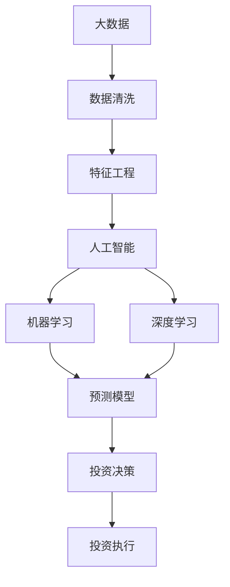

                 

# 如何利用技术能力进行房地产投资

> 关键词：房地产投资, 大数据, 人工智能, 机器学习, 深度学习, 自然语言处理, 预测模型

## 1. 背景介绍

在数字化快速发展的时代，房地产投资不再仅仅依赖于直觉和传统分析方法，技术手段的引入正在重新定义这一领域。借助大数据、人工智能、机器学习和深度学习等前沿技术，房地产投资者能够从海量数据中挖掘出宝贵的信息，进行更加精准的决策。本篇文章将深入探讨如何利用技术能力进行房地产投资，涵盖从数据处理、模型构建到实际应用的全流程。

## 2. 核心概念与联系

### 2.1 核心概念概述

在进行房地产投资时，需要理解以下核心概念及其关联：

- **房地产投资**：指投资者购买物业进行出租、开发或销售以获取收益的行为。
- **大数据**：指规模巨大、高速增长、多样化的数据集，可以用于实时决策和预测。
- **人工智能(AI)**：指模拟人类智能行为的计算机系统，包括机器学习、深度学习等技术。
- **机器学习(ML)**：指让计算机通过数据分析学习任务的过程，如回归、分类等。
- **深度学习(Deep Learning)**：指利用多层神经网络进行特征提取和模式识别。
- **自然语言处理(NLP)**：指使计算机理解和生成人类语言的技术，用于从文本数据中提取信息。
- **预测模型**：指通过历史数据训练出的模型，用于预测未来房价、市场需求等。

这些概念通过以下Mermaid流程图展示其联系：



### 2.2 核心概念原理和架构的 Mermaid 流程图

在房地产投资中，数据处理是第一步，主要涉及以下步骤：


- **数据清洗**：剔除缺失值、异常值，提高数据质量。
- **特征工程**：通过选择和构造特征，提高模型预测准确性。
- **特征选择**：从原始数据中选择最具预测能力的特征。
- **预测模型**：使用历史数据训练模型，预测未来房价、租金等。
- **投资决策**：根据模型预测结果进行投资决策。

## 3. 核心算法原理 & 具体操作步骤

### 3.1 算法原理概述

基于机器学习的房地产投资决策流程主要包括数据准备、模型训练、预测和决策四个步骤。

1. **数据准备**：收集包括房价、租金、地理位置、经济指标等数据。
2. **模型训练**：使用历史数据训练预测模型，如线性回归、随机森林、神经网络等。
3. **预测**：输入新的数据，使用训练好的模型进行预测。
4. **决策**：根据预测结果进行投资决策，如购买、出售或租赁物业。

### 3.2 算法步骤详解

#### 3.2.1 数据收集和预处理

- **数据来源**：房价、租金、交易记录、人口普查数据、经济指标等。
- **数据清洗**：去除重复、缺失值，处理异常值，转换数据格式（如日期、地理坐标）。

#### 3.2.2 特征工程和选择

- **特征提取**：从原始数据中提取有用的特征，如房屋面积、地理位置、交通便利性等。
- **特征构建**：基于已有特征构造新的特征，如根据房产位置计算的交通便利性指数。
- **特征选择**：通过特征重要性排序选择最具预测能力的特征，如LASSO回归。

#### 3.2.3 模型选择和训练

- **模型选择**：选择合适的模型，如线性回归、随机森林、神经网络等。
- **模型训练**：使用历史数据训练模型，调整超参数，避免过拟合。

#### 3.2.4 模型评估和优化

- **模型评估**：使用交叉验证、均方误差等评估模型性能。
- **模型优化**：通过正则化、集成学习等方法优化模型性能。

#### 3.2.5 投资决策

- **预测结果**：根据模型预测结果，生成投资建议。
- **决策框架**：建立决策规则，如置信度阈值、收益期望等。

### 3.3 算法优缺点

#### 3.3.1 优点

- **精度高**：利用机器学习模型，能从大量历史数据中提取复杂关系，提高预测精度。
- **自动化**：数据处理、模型训练和预测等环节自动化，减少人工干预。
- **实时性**：可以实时处理和更新数据，快速适应市场变化。

#### 3.3.2 缺点

- **数据依赖**：依赖高质量、完整的数据集，数据获取和处理成本高。
- **模型复杂**：复杂的模型需要更多计算资源和时间。
- **可解释性差**：黑盒模型难以解释预测结果，可能影响决策可信度。

### 3.4 算法应用领域

基于机器学习的房地产投资方法，可以应用于多种场景：

- **投资分析**：评估不同区域的投资价值，制定投资策略。
- **风险控制**：预测市场波动，控制投资风险。
- **资产管理**：优化资产组合，提升回报率。
- **贷款评估**：评估借款人信用风险，控制贷款质量。

## 4. 数学模型和公式 & 详细讲解 & 举例说明

### 4.1 数学模型构建

构建预测模型通常包括以下步骤：

- **数据准备**：准备训练数据集 $D = \{(x_i, y_i)\}_{i=1}^N$，其中 $x_i$ 为输入特征，$y_i$ 为输出标签。
- **模型选择**：选择合适的模型，如线性回归 $y = \theta_0 + \theta_1x_1 + \theta_2x_2 + ... + \theta_px_p$。
- **模型训练**：使用优化算法（如梯度下降）最小化损失函数 $L(y, \hat{y})$，其中 $\hat{y} = f(x; \theta)$ 为模型预测值。

### 4.2 公式推导过程

以线性回归模型为例，推导损失函数及其梯度：

- **损失函数**：均方误差 $L = \frac{1}{N}\sum_{i=1}^N(y_i - \hat{y}_i)^2$。
- **梯度公式**：$\frac{\partial L}{\partial \theta_j} = \frac{2}{N}\sum_{i=1}^N(x_{ij} - \bar{x}_j)(y_i - \hat{y}_i)$。

其中，$x_{ij}$ 为第 $i$ 个样本的第 $j$ 个特征，$\bar{x}_j$ 为第 $j$ 个特征的均值。

### 4.3 案例分析与讲解

假设某城市的历史房价数据集包含房屋面积、地理位置、交通便利性等特征，目标是预测未来的房价。

- **数据准备**：收集包括房价、面积、地理位置、交通便利性等数据。
- **特征工程**：选择和构建特征，如将地理位置转换为经纬度特征，计算交通便利性指数。
- **模型训练**：使用线性回归模型训练预测房价。
- **模型评估**：使用均方误差评估模型性能。

## 5. 项目实践：代码实例和详细解释说明

### 5.1 开发环境搭建

1. **安装Python和相关库**：安装Python 3.x，使用pip安装numpy、pandas、scikit-learn、matplotlib等库。
2. **准备数据集**：收集历史房价数据，包括房屋面积、地理位置、交通便利性等特征，以及对应的房价。

### 5.2 源代码详细实现

以下是一个使用Scikit-learn进行房价预测的示例代码：

```python
import pandas as pd
from sklearn.model_selection import train_test_split
from sklearn.linear_model import LinearRegression
from sklearn.metrics import mean_squared_error

# 准备数据
data = pd.read_csv('house_prices.csv')
X = data[['area', 'location', 'transportation']]
y = data['price']

# 数据预处理
X_train, X_test, y_train, y_test = train_test_split(X, y, test_size=0.2, random_state=42)

# 模型训练
model = LinearRegression()
model.fit(X_train, y_train)

# 模型评估
y_pred = model.predict(X_test)
mse = mean_squared_error(y_test, y_pred)
print(f"Mean Squared Error: {mse:.2f}")
```

### 5.3 代码解读与分析

**数据准备**：使用pandas读取CSV文件，选择需要的特征和目标变量。

**数据预处理**：使用train_test_split将数据集划分为训练集和测试集。

**模型训练**：使用LinearRegression模型进行训练，调整超参数。

**模型评估**：使用均方误差评估模型性能，判断模型的预测准确性。

### 5.4 运行结果展示

运行上述代码，输出模型评估结果，如均方误差。

## 6. 实际应用场景

### 6.1 投资分析

通过机器学习模型，可以评估不同区域的投资价值。例如，利用历史房价数据训练模型，预测未来房价走势，选择投资潜力大的区域。

### 6.2 风险控制

通过分析历史市场数据，可以预测市场波动，控制投资风险。例如，利用随机森林模型预测市场走势，及时调整投资策略。

### 6.3 资产管理

利用模型优化资产组合，提升投资回报率。例如，根据房价预测结果，选择增值潜力大的物业，进行多元化投资。

### 6.4 贷款评估

评估借款人信用风险，控制贷款质量。例如，使用分类模型预测借款人还款能力，降低坏账率。

## 7. 工具和资源推荐

### 7.1 学习资源推荐

- **Coursera**：提供机器学习和深度学习的在线课程，涵盖房地产投资等领域。
- **Kaggle**：提供大量房地产投资相关的数据集和竞赛，促进学习和实践。
- **DataCamp**：提供Python和R语言的实战课程，提升数据处理和分析技能。

### 7.2 开发工具推荐

- **Jupyter Notebook**：用于编写和执行代码，支持可视化展示。
- **PyCharm**：提供全面的Python开发环境，支持代码调试和版本控制。
- **RStudio**：提供R语言的开发环境，支持数据可视化和统计分析。

### 7.3 相关论文推荐

- **《房地产市场预测的机器学习技术》**：探讨了利用机器学习预测房地产市场的技术。
- **《基于深度学习的房地产投资决策模型》**：研究了利用深度学习进行房地产投资决策的方法。
- **《房地产投资组合优化问题》**：探讨了利用优化算法进行房地产投资组合优化的技术。

## 8. 总结：未来发展趋势与挑战

### 8.1 研究成果总结

基于机器学习的房地产投资方法已经取得了一定的进展，但仍有许多问题需要解决，如数据获取、模型复杂性、可解释性等。

### 8.2 未来发展趋势

- **自动化和智能化**：未来将更多地采用自动化和智能化技术，减少人工干预，提高效率。
- **多模态数据融合**：将房产数据与地理位置、经济指标等多模态数据融合，提升预测精度。
- **实时决策系统**：构建实时决策系统，快速响应市场变化，提高投资收益。

### 8.3 面临的挑战

- **数据获取和处理**：数据获取和处理成本高，数据质量难以保证。
- **模型复杂和可解释性**：复杂模型难以解释，影响决策可信度。
- **市场波动和不确定性**：市场波动和不确定性因素难以预测，影响投资决策。

### 8.4 研究展望

未来需重点关注以下几个方面：

- **数据治理**：建立数据治理体系，提升数据质量和可获取性。
- **模型解释**：研究模型解释方法，提升决策透明度和可信度。
- **实时系统**：构建实时决策系统，提高投资响应速度。

## 9. 附录：常见问题与解答

**Q1：机器学习模型能否替代传统的房地产投资分析方法？**

A: 机器学习模型可以提供更准确、更全面的投资分析，但无法完全替代传统的房地产投资分析方法。传统方法仍然需要结合市场经验和人情智慧，进行综合判断。

**Q2：如何选择适合的机器学习模型？**

A: 根据数据类型和预测目标选择适合的模型。例如，线性回归适用于连续性目标预测，分类模型适用于分类目标预测。

**Q3：如何提高模型性能？**

A: 通过数据预处理、特征工程、模型调参等手段提升模型性能。例如，选择更重要的特征，调整超参数，使用集成学习等方法。

**Q4：如何处理不平衡数据集？**

A: 使用SMOTE等方法处理不平衡数据集，或调整评估指标，如F1-score、ROC-AUC等。

**Q5：如何解释机器学习模型的预测结果？**

A: 使用LIME、SHAP等方法解释模型预测结果，提升决策透明度和可信度。

通过以上分析，可以看出利用技术能力进行房地产投资，不仅能提升决策的科学性和效率，还能带来新的机遇和挑战。未来需不断探索和创新，实现技术与投资的深度融合，推动房地产行业的智能化发展。

---

作者：禅与计算机程序设计艺术 / Zen and the Art of Computer Programming

