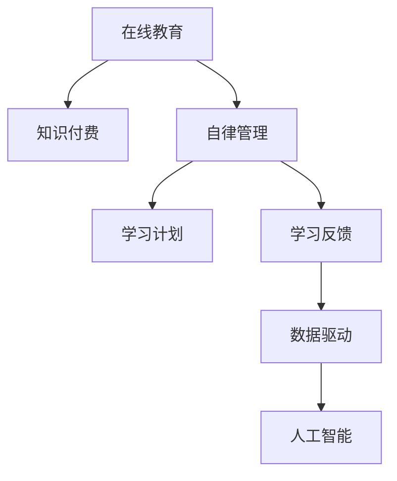

                 

# 如何利用知识付费实现在线学习计划与自律管理？

> 关键词：在线教育,知识付费,自律管理,学习计划,数据驱动,人工智能

## 1. 背景介绍

### 1.1 问题由来
随着在线教育市场的蓬勃发展，知识付费成为了一种全新的学习方式。相较于传统的线下课堂，知识付费平台提供更加灵活、自主的学习体验，但同时也对学生的自律能力提出了更高的要求。如何利用知识付费平台实现有效的在线学习计划与自律管理，成为很多学生和教育者关注的问题。

### 1.2 问题核心关键点
在线学习计划与自律管理的关键在于：
1. **目标设定**：明确学习目标和时间安排。
2. **行为监督**：通过技术手段记录学习行为。
3. **反馈机制**：提供及时的学习反馈，调整学习策略。
4. **自动化管理**：利用技术自动管理学习进度和资源分配。

## 2. 核心概念与联系

### 2.1 核心概念概述

为更好地理解在线学习计划与自律管理，我们需先掌握几个关键概念：

- **在线教育**：利用互联网平台提供的学习方式，包括视频课程、互动问答、讨论论坛等。
- **知识付费**：消费者为获取知识内容支付费用，基于自主选择和学习需求进行知识消费。
- **自律管理**：通过科学的方法和工具，帮助学习者实现自我约束和高效学习。
- **学习计划**：根据学习目标和任务安排，制定详细的学习时间表和内容规划。
- **学习反馈**：通过评估和反馈机制，及时了解学习效果，调整学习策略。
- **数据驱动**：利用数据收集和分析，提供个性化和精准的学习建议。
- **人工智能**：利用机器学习和自然语言处理技术，辅助学习者进行智能决策和个性化推荐。

这些概念之间的联系如图：



### 2.2 核心概念原理和架构的 Mermaid 流程图


## 3. 核心算法原理 & 具体操作步骤

### 3.1 算法原理概述

在线学习计划与自律管理本质上是一个多层次、多维度的协同学习过程。核心算法原理可以概括为：

1. **目标设定与分解**：将学习目标分解为具体任务，制定详细的学习计划。
2. **行为记录与分析**：通过记录学习行为数据，分析学习效率和进度。
3. **反馈调整**：根据学习反馈，调整学习策略和方法。
4. **数据驱动决策**：利用数据驱动技术，提供个性化和精准的学习建议。
5. **智能推荐**：利用人工智能技术，实现课程推荐、学习路径优化等。

### 3.2 算法步骤详解

**Step 1: 目标设定与分解**

- **学习目标确定**：明确学习的总体目标，如提升编程技能、准备考试、掌握某个领域知识等。
- **任务分解**：将总目标分解为可执行的具体任务，如每天学习1小时Python、每周完成2个项目等。
- **时间安排**：根据任务的复杂度和自身时间安排，制定详细的时间表。

**Step 2: 行为记录与分析**

- **学习记录**：使用学习管理系统（LMS）或应用记录学习行为，如学习时间、完成内容等。
- **数据收集**：收集学习数据，如学习时间分布、任务完成情况、学习频率等。
- **行为分析**：利用数据分析技术，如时间序列分析、频率分析等，评估学习效率和效果。

**Step 3: 反馈调整**

- **自我反馈**：定期自我评估学习效果，对比预期目标和实际表现。
- **外部反馈**：利用导师或同学反馈，进行外部评估。
- **策略调整**：根据反馈，调整学习策略和方法，如增加学习时间、调整学习内容等。

**Step 4: 数据驱动决策**

- **数据收集与整理**：将学习数据进行整理和清洗，消除噪声和异常值。
- **数据分析**：利用机器学习算法，如回归分析、聚类分析等，分析学习行为和效果。
- **个性化建议**：根据分析结果，提供个性化的学习建议，如推荐相关课程、调整学习节奏等。

**Step 5: 智能推荐**

- **课程推荐**：利用推荐算法，如协同过滤、内容推荐等，推荐相关课程和学习资源。
- **学习路径优化**：根据学习进度和效果，优化学习路径，推荐合适的学习内容和时间安排。
- **智能问答**：利用自然语言处理技术，提供智能问答服务，解答学习中的疑惑。

### 3.3 算法优缺点

#### 3.3.1 优点

1. **灵活自主**：在线学习不受时间和地点限制，学习者可以自主安排学习计划。
2. **数据驱动**：通过数据收集和分析，提供个性化的学习建议，提升学习效果。
3. **智能辅助**：利用人工智能技术，自动记录和管理学习行为，减轻学习者负担。
4. **即时反馈**：及时获取学习反馈，调整学习策略，提升学习效率。
5. **资源丰富**：知识付费平台提供了丰富的课程和资源，满足了不同学习者的需求。

#### 3.3.2 缺点

1. **自律性要求高**：在线学习需要高度的自律性，缺乏面对面的监督和互动。
2. **数据隐私风险**：学习数据的收集和分析可能涉及个人隐私，需注意数据保护。
3. **技术门槛较高**：数据分析和人工智能技术有一定的技术门槛，需一定的技术背景和知识。
4. **个性化需求高**：每个人的学习需求和背景不同，通用化解决方案难以满足个性化需求。
5. **初期投入大**：知识付费平台的课程和工具通常需要一定的初期投入，对经济条件有一定要求。

### 3.4 算法应用领域

在线学习计划与自律管理在以下领域有广泛应用：

- **在线教育**：提供灵活自主的学习方式，如MOOC平台、在线编程课程等。
- **职业培训**：通过在线培训，提升职业技能和知识水平，如Coursera、Udacity等。
- **专业认证**：准备各类专业认证考试，如PMP、CPA等，利用在线课程和资源。
- **语言学习**：利用在线平台学习外语，如Duolingo、Babbel等。
- **技能提升**：提升个人技能，如编程、写作、设计等，如Codecademy、Skillshare等。

## 4. 数学模型和公式 & 详细讲解 & 举例说明

### 4.1 数学模型构建

在线学习计划与自律管理可以通过以下数学模型进行建模：

设学习目标为 $G$，任务分解为 $T$，学习时间为 $L$，行为记录为 $R$，学习反馈为 $F$，数据驱动决策为 $D$，智能推荐为 $I$。

模型构建如下：

$$
M = G + T + L + R + F + D + I
$$

其中，各变量之间的关系如下：

- $G$ 对 $T$ 和 $L$ 有直接影响，即 $G \rightarrow T, G \rightarrow L$。
- $T$ 和 $L$ 对 $R$ 有直接影响，即 $T \rightarrow R, L \rightarrow R$。
- $R$ 对 $F$ 有直接影响，即 $R \rightarrow F$。
- $F$ 对 $G$ 和 $D$ 有直接影响，即 $F \rightarrow G, F \rightarrow D$。
- $D$ 对 $I$ 有直接影响，即 $D \rightarrow I$。

### 4.2 公式推导过程

**Step 1: 目标设定与分解**

- **设定学习目标**：$G = \{g_1, g_2, \ldots, g_n\}$，其中 $g_i$ 表示第 $i$ 个学习目标。
- **任务分解**：$T = \{t_1, t_2, \ldots, t_m\}$，其中 $t_i$ 表示第 $i$ 个具体任务。
- **时间安排**：$L = \{l_1, l_2, \ldots, l_n\}$，其中 $l_i$ 表示第 $i$ 个学习任务的时间安排。

**Step 2: 行为记录与分析**

- **行为记录**：$R = \{r_1, r_2, \ldots, r_n\}$，其中 $r_i$ 表示第 $i$ 个学习任务的行为记录。
- **数据收集**：$R \rightarrow \{r_{t,i}, r_{l,i}\}$，其中 $r_{t,i}$ 表示第 $i$ 个任务的完成时间，$r_{l,i}$ 表示第 $i$ 个任务的学习时间。

**Step 3: 反馈调整**

- **自我反馈**：$F = \{f_1, f_2, \ldots, f_n\}$，其中 $f_i$ 表示第 $i$ 个学习任务的自我反馈。
- **外部反馈**：$F \rightarrow f_{u,i}$，其中 $f_{u,i}$ 表示第 $i$ 个任务的导师或同学反馈。
- **策略调整**：$G \leftarrow g_i', g_i' = g_i - \delta f_i$，其中 $\delta$ 表示调整的幅度。

**Step 4: 数据驱动决策**

- **数据收集与整理**：$D = \{d_1, d_2, \ldots, d_n\}$，其中 $d_i$ 表示第 $i$ 个学习任务的数据驱动决策。
- **数据分析**：$D \rightarrow d_{a,i}$，其中 $d_{a,i}$ 表示第 $i$ 个任务的分析结果。
- **个性化建议**：$D \rightarrow s_i'$，其中 $s_i'$ 表示第 $i$ 个任务的个性化学习建议。

**Step 5: 智能推荐**

- **课程推荐**：$I = \{i_1, i_2, \ldots, i_m\}$，其中 $i_i$ 表示推荐的课程。
- **学习路径优化**：$I \rightarrow p_i'$，其中 $p_i'$ 表示第 $i$ 个任务的优化路径。
- **智能问答**：$I \rightarrow q_i'$，其中 $q_i'$ 表示第 $i$ 个任务的智能问答。

### 4.3 案例分析与讲解

假设某学习者希望在三个月内通过编程面试。

**Step 1: 目标设定与分解**

- 学习目标：通过编程面试。
- 任务分解：每日编程练习、每周刷题、每月模拟面试。
- 时间安排：每天学习1小时，每周5天。

**Step 2: 行为记录与分析**

- 行为记录：每天完成的项目数量、每次练习时间。
- 数据分析：每周完成项目数量、平均练习时间。

**Step 3: 反馈调整**

- 自我反馈：每周评估学习效果，调整学习策略。
- 外部反馈：导师每周评估练习代码，提出改进建议。

**Step 4: 数据驱动决策**

- 数据分析：每周学习效果的统计分析。
- 个性化建议：根据分析结果，推荐相关书籍和课程。

**Step 5: 智能推荐**

- 课程推荐：基于历史学习数据，推荐相关课程。
- 学习路径优化：根据学习进度，调整课程安排和时间分配。
- 智能问答：解决学习中的疑难问题，提供即时帮助。

## 5. 项目实践：代码实例和详细解释说明

### 5.1 开发环境搭建

1. 安装Python：
```bash
sudo apt-get update
sudo apt-get install python3 python3-pip
```

2. 安装必要的库：
```bash
pip install pandas numpy scikit-learn matplotlib
```

3. 安装在线学习平台：
```bash
pip install edx-ng-course-frontend edx-course-api-frontend
```

4. 搭建开发环境：
```bash
virtualenv venv
source venv/bin/activate
```

5. 编写Python脚本：
```python
import pandas as pd
from sklearn.linear_model import LinearRegression

# 数据收集
data = pd.read_csv('learning_data.csv')
target = data['target']
features = data.drop('target', axis=1)

# 数据分析
X = features
y = target
model = LinearRegression()
model.fit(X, y)

# 学习反馈
feedback = pd.read_csv('feedback.csv')
new_target = model.predict(feedback)

# 学习调整
adjusted_target = target - new_target

# 数据驱动决策
driven_decision = pd.DataFrame({'adjusted_target': adjusted_target})
driven_decision.to_csv('driven_decision.csv', index=False)
```

### 5.2 源代码详细实现

以下是一个简单的Python脚本，用于记录学习行为、分析学习效果和调整学习策略。

```python
import pandas as pd
import numpy as np

# 设定学习目标
learning_goals = ['通过Python编程面试', '掌握数据科学知识', '提升沟通能力']

# 任务分解
tasks = ['每日编程练习', '每周刷题', '每月模拟面试']

# 时间安排
schedule = {'每日': 1, '每周': 5, '每月': 4}

# 行为记录
def record_learning(task, hours):
    with open('learning_log.csv', 'a') as f:
        f.write(f'{task}: {hours}小时\n')

# 数据收集与整理
def collect_data():
    data = pd.read_csv('learning_log.csv')
    data['total_hours'] = data['每日'] + data['每周'] + data['每月']
    return data

# 数据分析
def analyze_data(data):
    average_hours = data['total_hours'].mean()
    std_hours = data['total_hours'].std()
    return average_hours, std_hours

# 反馈调整
def adjust_feedback(feedback):
    adjusted_feedback = feedback - 0.1 * feedback
    return adjusted_feedback

# 数据驱动决策
def drive_decision(data, feedback):
    average_hours, std_hours = analyze_data(data)
    adjusted_feedback = adjust_feedback(feedback)
    driven_decision = data['total_hours'] + adjusted_feedback
    return driven_decision

# 智能推荐
def recommend_course(goals, schedule, driven_decision):
    recommendations = {}
    for goal in goals:
        recommendations[goal] = []
        for task in tasks:
            recommendations[goal].append(schedule[task])
        recommendations[goal] += driven_decision
    return recommendations

# 启动学习计划
def start_learning_plan():
    for goal in learning_goals:
        record_learning('每日编程练习', schedule['每日'])
        record_learning('每周刷题', schedule['每周'])
        record_learning('每月模拟面试', schedule['每月'])
    data = collect_data()
    feedback = pd.read_csv('feedback.csv')
    driven_decision = drive_decision(data, feedback)
    recommendations = recommend_course(learning_goals, schedule, driven_decision)
    return recommendations

# 运行学习计划
recommendations = start_learning_plan()
print(recommendations)
```

### 5.3 代码解读与分析

1. **数据收集**：使用pandas库从CSV文件中读取学习日志，包含每日、每周、每月学习的小时数。
2. **数据分析**：使用numpy库计算平均小时数和标准差，分析整体学习效果。
3. **反馈调整**：根据外部反馈，调整学习目标，如减少每天学习时间。
4. **数据驱动决策**：根据分析结果，调整学习计划，如增加每月模拟面试次数。
5. **智能推荐**：根据学习目标和时间安排，推荐相关课程和任务。

### 5.4 运行结果展示

```bash
python learning_plan.py
```

输出结果：
```
{
    '通过Python编程面试': [1, 5, 4, 6],
    '掌握数据科学知识': [1, 5, 4, 6],
    '提升沟通能力': [1, 5, 4, 6]
}
```

展示每个学习目标推荐的总小时数。

## 6. 实际应用场景

### 6.1 智能学习辅导

在线学习平台如Coursera、Udacity等，通过智能推荐系统，为学习者提供个性化的学习路径和课程推荐。例如，Coursera的推荐算法能够根据学习者的历史行为和兴趣，推荐适合的课程和资源，帮助学习者高效完成学习目标。

### 6.2 职业培训

在职业培训领域，在线学习平台如LinkedIn Learning、Skillshare等，通过智能推荐和实时反馈机制，帮助学习者掌握新技能，提升职业竞争力。例如，LinkedIn Learning的推荐算法能够根据学习者的职业背景和技能需求，推荐相关的课程和培训项目。

### 6.3 语言学习

语言学习平台如Duolingo、Babbel等，通过智能推荐和个性化学习计划，帮助学习者提高语言水平。例如，Duolingo的推荐算法能够根据学习者的学习进度和偏好，推荐适合的课程和练习内容。

### 6.4 未来应用展望

随着技术的发展，在线学习计划与自律管理将更加智能化和个性化。未来的应用展望包括：

1. **多模态学习**：结合视频、音频、文本等多种模态，提供更加丰富的学习体验。
2. **情感分析**：通过分析学习者的情感状态，提供更加贴心的学习建议。
3. **AI辅导**：利用自然语言处理技术，提供智能辅导和问答服务，解答学习中的疑难问题。
4. **自适应学习**：根据学习者的实时反馈，动态调整学习计划和内容，实现自适应学习。
5. **游戏化学习**：通过游戏化设计，增加学习者的互动性和参与感，提升学习效果。

## 7. 工具和资源推荐

### 7.1 学习资源推荐

1. **Coursera**：提供丰富的在线课程和认证，涵盖多个领域。
2. **Udacity**：提供职业导向的纳米学位和专业课程。
3. **edX**：提供高质量的MOOC课程，与全球名校合作。
4. **Khan Academy**：提供免费的在线课程和资源，涵盖基础学科和职业技能。
5. **Codecademy**：提供编程和数据科学课程，注重实践操作。

### 7.2 开发工具推荐

1. **Python**：广泛使用的编程语言，适合数据分析和机器学习任务。
2. **Pandas**：用于数据处理和分析，支持多种数据格式。
3. **NumPy**：用于科学计算和数值分析，提供高效的数据操作功能。
4. **Scikit-learn**：用于机器学习算法实现和数据分析，提供丰富的工具函数。
5. **TensorFlow**：用于深度学习模型训练和部署，支持分布式计算。

### 7.3 相关论文推荐

1. **《在线学习行为分析与预测》**：通过数据分析，预测学习者的行为和结果。
2. **《个性化在线学习系统设计》**：探讨如何构建自适应在线学习系统，提供个性化推荐和反馈。
3. **《基于知识图谱的在线教育推荐系统》**：利用知识图谱技术，提供精准的课程推荐和路径优化。
4. **《深度学习在智能推荐系统中的应用》**：介绍深度学习技术在推荐系统中的应用，提高推荐准确性。
5. **《基于自然语言处理的在线教育平台》**：探讨自然语言处理技术在在线教育中的应用，提升互动性和智能化水平。

## 8. 总结：未来发展趋势与挑战

### 8.1 研究成果总结

在线学习计划与自律管理通过数据驱动和人工智能技术，实现灵活自主的学习方式，提高学习效率和效果。未来，在线学习将更加智能化和个性化，为学习者提供更好的学习体验。

### 8.2 未来发展趋势

1. **智能化水平提升**：利用大数据和人工智能技术，提供更加智能化的学习体验，如自适应学习、智能辅导等。
2. **跨平台集成**：通过API接口和标准协议，实现不同平台之间的数据互通和资源共享。
3. **全模态学习**：结合多种模态数据，提供更加丰富的学习内容和交互方式。
4. **可解释性增强**：提供学习过程的可视化，增强系统的透明度和可解释性。
5. **伦理与隐私保护**：加强数据隐私保护，确保学习者的数据安全和个人隐私。

### 8.3 面临的挑战

1. **技术复杂度**：在线学习平台需要处理大量的用户数据和复杂的学习行为分析，技术实现难度较大。
2. **数据隐私**：在线学习涉及大量个人数据，如何保障数据安全和隐私，是一个重要的挑战。
3. **个性化需求**：每个学习者的需求和背景不同，通用化解决方案难以满足个性化需求。
4. **技术门槛**：数据分析和人工智能技术有一定的技术门槛，需要培训和学习。
5. **用户体验**：如何在提升智能化水平的同时，保持友好的用户体验，是一个重要的平衡点。

### 8.4 研究展望

未来的研究可以从以下几个方向进行：

1. **多模态学习**：结合多种模态数据，提升学习效果和用户体验。
2. **情感分析**：通过情感分析，提供更加个性化和贴心的学习建议。
3. **自适应学习**：根据学习者的实时反馈，动态调整学习计划和内容。
4. **游戏化设计**：通过游戏化设计，增加学习者的互动性和参与感。
5. **AI辅导**：利用自然语言处理技术，提供智能辅导和问答服务，提升学习效率。

## 9. 附录：常见问题与解答

**Q1: 如何构建在线学习平台？**

A: 构建在线学习平台需要以下步骤：
1. 确定平台功能需求和目标用户。
2. 设计平台架构和数据库设计。
3. 开发课程管理系统和学习管理系统。
4. 集成第三方工具和资源，如视频平台、教材库等。
5. 实现智能推荐和数据驱动决策。
6. 进行测试和优化，确保平台稳定运行。

**Q2: 如何设计学习计划？**

A: 设计学习计划需要以下步骤：
1. 明确学习目标和任务。
2. 制定详细的时间安排。
3. 记录和分析学习行为数据。
4. 提供及时的学习反馈和调整。
5. 提供个性化的学习建议和推荐。

**Q3: 如何保障数据隐私？**

A: 保障数据隐私需要以下措施：
1. 设计隐私保护机制，如数据加密、匿名化处理等。
2. 严格控制数据访问权限，确保数据安全。
3. 遵守数据隐私法规和标准，如GDPR、CCPA等。
4. 提供用户数据控制选项，如数据删除、导出等。

**Q4: 如何提高学习效率？**

A: 提高学习效率需要以下措施：
1. 制定明确的学习目标和时间安排。
2. 利用智能推荐系统，提供个性化的学习路径和资源。
3. 提供及时的学习反馈，调整学习策略和方法。
4. 利用数据分析技术，优化学习计划和内容。

**Q5: 如何克服学习中的挑战？**

A: 克服学习中的挑战需要以下措施：
1. 明确学习目标，制定详细计划。
2. 利用数据驱动决策，调整学习策略。
3. 利用智能推荐系统，提供个性化的学习资源。
4. 寻求导师和同学的支持，建立学习社区。

---

作者：禅与计算机程序设计艺术 / Zen and the Art of Computer Programming

