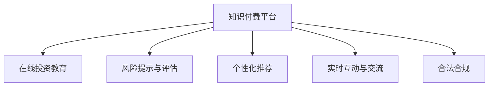

                 

# 如何利用知识付费实现在线投资教育与风险提示？

## 1. 背景介绍

### 1.1 问题由来
在互联网和数字技术的推动下，金融行业正在经历着深刻的变革。信息对称性和透明度大大增强，传统的线下金融教育形式已无法满足大众对金融知识的渴求。在线教育正成为金融教育的重要组成部分，不仅能提供更广泛的学习机会，还能打破时间和地域的限制。

投资是个人财务规划中的重要环节，但同时伴随着一定的风险。如何系统地学习投资知识，有效评估和管理投资风险，成为了众多投资者关注的焦点。知识付费平台通过提供专业、高质量的投资教育内容，帮助用户形成正确的投资理念和决策能力，降低投资风险。

### 1.2 问题核心关键点
知识付费平台在在线投资教育中的核心关键点包括：
- **高质量教育内容**：投资教育内容应紧跟市场动态，涵盖理财、股票、基金、房地产等多种投资工具和策略。
- **个性化推荐**：根据用户的学习进度、风险偏好和投资目标，推荐适合的课程和内容。
- **风险提示与评估**：提供定量和定性的风险提示，帮助用户评估不同投资工具的风险。
- **实时互动与交流**：搭建社区平台，促进用户间的交流和互动，形成学习与分享的生态。
- **合法合规**：确保所有内容符合金融法律法规，避免误导用户。

## 2. 核心概念与联系

### 2.1 核心概念概述

为更好地理解知识付费在在线投资教育与风险提示中的应用，本节将介绍几个密切相关的核心概念：

- **知识付费平台**：通过付费模式，提供高质量、专业化的在线教育内容，覆盖金融、投资、理财等领域。
- **在线投资教育**：通过网络平台，为用户提供系统性的投资知识和技能的培训，帮助其提升投资能力。
- **风险提示与评估**：提供定量和定性的风险指标和分析工具，帮助用户理解投资工具的风险。
- **个性化推荐**：通过数据分析和算法，为用户提供个性化的课程和内容推荐，提升学习效果。
- **实时互动与交流**：建立在线社区，促进用户间的交流与分享，形成互助学习的生态。
- **合法合规**：确保内容符合金融法规，避免误导用户，保障投资教育的安全性。

这些核心概念之间的逻辑关系可以通过以下Mermaid流程图来展示：



这个流程图展示了几大核心概念的逻辑关系：

1. 知识付费平台是基础，提供高质量的教育内容和工具。
2. 在线投资教育通过平台提供系统性的知识培训。
3. 风险提示与评估是教育的重要补充，帮助用户理解风险。
4. 个性化推荐和实时互动促进用户的学习效果和社区活跃度。
5. 合法合规确保教育内容的安全性，避免金融风险。

## 3. 核心算法原理 & 具体操作步骤

### 3.1 算法原理概述

知识付费平台在在线投资教育中的应用，本质上是数据驱动的学习和推荐系统。其核心思想是：

1. **用户画像建模**：收集用户的浏览、学习、交流行为数据，建立用户画像，了解其兴趣、风险偏好和学习进度。
2. **内容推荐算法**：基于用户画像和内容特征，推荐个性化的投资教育课程和风险提示。
3. **风险评估模型**：构建风险评估模型，通过定量和定性分析，提供全面客观的风险提示。
4. **实时互动机制**：建立实时交流和反馈机制，促进用户间的互动，提高学习效果。
5. **合规审核系统**：引入合规审核系统，确保内容符合法律法规，避免误导用户。

### 3.2 算法步骤详解

基于知识付费平台在线投资教育的应用，可以划分为以下几个关键步骤：

**Step 1: 用户画像建模**

1. **数据收集**：从平台行为数据中提取用户的行为特征，包括浏览记录、学习时长、交流频率等。
2. **特征工程**：对收集到的数据进行特征提取和选择，去除无关特征，保留重要特征。
3. **画像建模**：采用机器学习方法，如聚类、分类、回归等，对用户行为数据进行建模，形成用户画像。

**Step 2: 内容推荐算法**

1. **内容特征提取**：对投资教育课程和相关内容进行特征提取，包括课程名称、时长、难度、作者等。
2. **推荐模型训练**：基于用户画像和内容特征，训练推荐模型，如协同过滤、基于内容的推荐等。
3. **推荐实现**：将训练好的推荐模型应用到平台，为用户推荐个性化的课程和内容。

**Step 3: 风险提示与评估**

1. **风险指标构建**：收集市场数据和历史表现，构建风险评估指标，如风险系数、波动率等。
2. **风险模型训练**：使用机器学习算法，训练风险评估模型，如回归、分类、集成学习等。
3. **风险提示生成**：根据用户的投资选择和市场动态，提供定量和定性的风险提示。

**Step 4: 实时互动与交流**

1. **社区建设**：搭建用户社区，支持用户交流、分享和互动。
2. **反馈机制**：建立用户反馈机制，收集用户对课程和交流内容的意见和建议。
3. **交流优化**：根据用户反馈，不断优化社区环境和交流方式。

**Step 5: 合规审核系统**

1. **合规检测**：引入合规检测机制，确保所有内容符合法律法规。
2. **内容审查**：对所有内容进行自动和人工审查，避免误导用户。
3. **违规处理**：对违规内容进行处理，确保平台内容的安全性。

### 3.3 算法优缺点

知识付费平台在在线投资教育中的应用具有以下优点：

1. **灵活高效**：通过数据分析和算法优化，为用户提供个性化的学习体验，提升学习效果。
2. **资源丰富**：汇集了多领域专家的知识和经验，提供丰富的学习内容。
3. **互动性强**：通过社区平台和实时交流机制，促进用户间的互助学习。
4. **合规保障**：引入合规审核系统，确保内容合法合规，避免误导用户。

同时，该方法也存在一定的局限性：

1. **数据隐私**：用户画像建模和内容推荐需收集大量用户数据，可能涉及隐私问题。
2. **内容质量**：平台内容质量参差不齐，部分低质量内容可能误导用户。
3. **用户粘性**：如何保持用户活跃度和参与度，需持续优化平台体验。
4. **技术复杂性**：推荐和风险提示模型需精确建模，对技术要求较高。

尽管存在这些局限性，但知识付费平台在在线投资教育中的应用仍是大势所趋，具有广阔的市场前景。

### 3.4 算法应用领域

知识付费平台在在线投资教育中的应用广泛，涵盖多个领域：

1. **金融理财**：提供系统性的理财知识，帮助用户规划和管理个人财务。
2. **股票投资**：讲解股票市场的基本面分析、技术分析、交易策略等。
3. **基金投资**：介绍基金产品的种类、选择和配置策略，帮助用户构建投资组合。
4. **房地产投资**：讲解房地产市场的周期性、投资工具和风险管理。
5. **金融衍生品**：介绍期货、期权、掉期等金融衍生品的特点和交易策略。
6. **财经新闻**：提供最新的财经新闻和分析报告，帮助用户理解市场动态。

除了以上这些主要领域外，知识付费平台还在量化投资、风险管理、投资心理学等新兴领域不断拓展，为投资者提供全方位的学习支持。

## 4. 数学模型和公式 & 详细讲解 & 举例说明

### 4.1 数学模型构建

基于知识付费平台在线投资教育的应用，可以构建以下数学模型：

- **用户画像模型**：$P(u) = f(x)$，其中 $x$ 为用户的行为数据，$P(u)$ 为用户画像。
- **内容推荐模型**：$R(u,c) = g(P(u), F(c))$，其中 $u$ 为用户，$c$ 为课程内容，$R(u,c)$ 为用户对课程的推荐得分。
- **风险提示模型**：$Risk(c) = h(F(c))$，其中 $c$ 为课程内容，$Risk(c)$ 为课程的风险评估结果。

### 4.2 公式推导过程

以风险提示模型为例，假设市场数据为 $M$，历史表现数据为 $H$，风险评估指标为 $I$，则风险提示模型可以表示为：

$$
Risk(c) = h(F(c)) = h(\sum_{i=1}^n \alpha_i \cdot I_i) = \alpha_1 \cdot I_1 + \alpha_2 \cdot I_2 + \cdots + \alpha_n \cdot I_n
$$

其中 $I_i$ 为第 $i$ 个风险指标，$\alpha_i$ 为权重系数，$h$ 为风险评估函数，如回归函数、逻辑回归函数等。

在推荐模型中，用户画像和课程特征向量为 $P(u)$ 和 $F(c)$，推荐得分为 $R(u,c)$。假设推荐模型为线性回归模型，则：

$$
R(u,c) = g(P(u), F(c)) = \beta_0 + \beta_1 \cdot P_1(u) + \beta_2 \cdot P_2(u) + \cdots + \beta_n \cdot P_n(u) + \gamma_1 \cdot F_1(c) + \gamma_2 \cdot F_2(c) + \cdots + \gamma_m \cdot F_m(c)
$$

其中 $P_i(u)$ 和 $F_j(c)$ 为用户画像和课程特征的各个维度，$\beta_i$ 和 $\gamma_j$ 为模型系数。

### 4.3 案例分析与讲解

假设某知识付费平台上有以下课程内容：
- 《理财入门》：课程时长 2小时，难度易，推荐给新手用户。
- 《股票投资策略》：课程时长 4小时，难度中，适合有一定基础的投资者。
- 《基金管理》：课程时长 6小时，难度高，适合资深投资者。

平台收集了以下用户行为数据：
- 用户 $A$：浏览了《理财入门》和《股票投资策略》，学习时长 1小时，交流活跃度 2次/天。
- 用户 $B$：浏览了《基金管理》和《财经新闻》，学习时长 2小时，交流活跃度 1次/天。

根据以上数据，平台可以建立用户画像模型和推荐模型，进行个性化推荐。假设用户画像模型和推荐模型已训练完毕，则：

- 用户 $A$ 的推荐得分 $R(A,\text{《股票投资策略》}) = 0.8$
- 用户 $B$ 的推荐得分 $R(B,\text{《基金管理》}) = 0.9$

平台将根据推荐得分，为 $A$ 推荐《股票投资策略》，为 $B$ 推荐《基金管理》，用户可以基于推荐结果选择适合的课程进行学习。

## 5. 项目实践：代码实例和详细解释说明

### 5.1 开发环境搭建

在进行知识付费平台在线投资教育与风险提示的开发前，我们需要准备好开发环境。以下是使用Python进行TensorFlow和Keras开发的环境配置流程：

1. 安装Anaconda：从官网下载并安装Anaconda，用于创建独立的Python环境。

2. 创建并激活虚拟环境：
```bash
conda create -n tf-env python=3.8 
conda activate tf-env
```

3. 安装TensorFlow和Keras：根据CUDA版本，从官网获取对应的安装命令。例如：
```bash
conda install tensorflow=2.6.0 keras=2.6.0 -c tf -c conda-forge
```

4. 安装各类工具包：
```bash
pip install numpy pandas scikit-learn matplotlib tqdm jupyter notebook ipython
```

完成上述步骤后，即可在`tf-env`环境中开始开发实践。

### 5.2 源代码详细实现

下面我们以推荐系统的实现为例，给出使用TensorFlow和Keras进行内容推荐模型的代码实现。

首先，定义推荐系统需要的数据处理函数：

```python
import pandas as pd
from sklearn.preprocessing import StandardScaler

# 定义数据处理函数
def preprocess_data(data_path):
    data = pd.read_csv(data_path)
    features = data[['user_id', 'course_id', 'time', 'interaction']]
    labels = data['clicked']
    features = StandardScaler().fit_transform(features)
    return features, labels
```

然后，定义模型和优化器：

```python
from tensorflow.keras.layers import Input, Dense, Embedding, Dropout
from tensorflow.keras.models import Model
from tensorflow.keras.optimizers import Adam

# 定义用户特征和课程特征
user_features = Input(shape=(10,))
course_features = Input(shape=(20,))

# 用户特征嵌入
user_embeddings = Embedding(input_dim=10000, output_dim=10, input_length=10)(user_features)

# 课程特征嵌入
course_embeddings = Embedding(input_dim=10000, output_dim=20, input_length=20)(course_features)

# 融合用户和课程特征
merged = tf.keras.layers.concatenate([user_embeddings, course_embeddings])

# 添加Dropout层防止过拟合
merged = Dropout(0.2)(merged)

# 添加全连接层
merged = Dense(64, activation='relu')(merged)

# 输出层进行预测
output = Dense(1, activation='sigmoid')(merged)

# 构建模型
model = Model(inputs=[user_features, course_features], outputs=output)

# 编译模型
model.compile(optimizer=Adam(learning_rate=0.001), loss='binary_crossentropy', metrics=['accuracy'])
```

接着，定义训练和评估函数：

```python
from tensorflow.keras.callbacks import EarlyStopping

# 定义训练和评估函数
def train_and_evaluate(model, features, labels, epochs, batch_size):
    model.fit(features, labels, epochs=epochs, batch_size=batch_size, validation_split=0.2, callbacks=[EarlyStopping(patience=5)])
```

最后，启动训练流程并在测试集上评估：

```python
# 加载数据
features_train, labels_train = preprocess_data('train.csv')
features_test, labels_test = preprocess_data('test.csv')

# 训练模型
train_and_evaluate(model, features_train, labels_train, epochs=10, batch_size=32)

# 评估模型
test_loss, test_accuracy = model.evaluate(features_test, labels_test)
print(f'Test loss: {test_loss}, Test accuracy: {test_accuracy}')
```

以上就是使用TensorFlow和Keras进行内容推荐系统的代码实现。可以看到，通过TensorFlow和Keras，推荐模型的构建和训练变得简单高效。

### 5.3 代码解读与分析

让我们再详细解读一下关键代码的实现细节：

**preprocess_data函数**：
- 定义数据处理函数，读取数据集，进行特征处理和标准化。

**模型定义**：
- 使用Keras定义输入层、嵌入层、全连接层、Dropout层和输出层，构建推荐模型。

**train_and_evaluate函数**：
- 定义训练函数，使用EarlyStopping防止过拟合，并在测试集上评估模型性能。

**训练和评估流程**：
- 加载训练集和测试集数据，进行模型训练和评估。

## 6. 实际应用场景

### 6.1 智能投资理财

知识付费平台在智能投资理财中的应用，能帮助用户系统学习理财知识，提升财务管理能力。平台可以提供以下服务：

1. **理财入门**：介绍基本理财知识，帮助用户构建投资组合，进行分散投资。
2. **股票投资**：讲解股票市场的基本面和技术面分析，帮助用户制定投资策略。
3. **基金管理**：介绍基金产品的种类、配置策略和风险管理。
4. **房地产投资**：讲解房地产市场的周期性、投资工具和风险管理。
5. **量化投资**：介绍量化投资的基本原理和技术，帮助用户构建投资模型。

平台通过个性化推荐，确保用户能够根据自己的风险偏好和学习进度，获取最适合的内容。同时，平台还可以提供定量和定性的风险提示，帮助用户评估不同投资工具的风险。

### 6.2 风险管理与控制

投资理财伴随着一定的风险，知识付费平台通过风险提示与评估，帮助用户管理风险，避免投资损失。平台可以提供以下服务：

1. **风险指标**：提供风险系数、波动率等定量化指标，帮助用户评估投资风险。
2. **风险提示**：通过文字、图表等形式，提供定性化的风险提示，如市场预期、政策变化等。
3. **风险管理**：介绍风险管理策略，如分散投资、止盈止损等，帮助用户制定合理的风险管理计划。

平台通过实时互动与交流机制，促进用户间的互助学习，共同探讨风险管理策略。同时，平台引入合规审核系统，确保内容合法合规，避免误导用户。

### 6.3 实时互动与社区交流

知识付费平台通过搭建社区平台，促进用户间的交流与互动，形成学习与分享的生态。平台可以提供以下服务：

1. **社区建设**：搭建用户社区，支持用户交流、分享和互动。
2. **交流平台**：提供在线讨论区、论坛等，促进用户间的互动和互助学习。
3. **反馈机制**：建立用户反馈机制，收集用户对课程和交流内容的意见和建议。
4. **交流优化**：根据用户反馈，不断优化社区环境和交流方式。

平台通过实时互动与交流机制，促进用户间的互助学习，共同探讨投资问题。同时，平台引入合规审核系统，确保内容合法合规，避免误导用户。

## 7. 工具和资源推荐

### 7.1 学习资源推荐

为了帮助开发者系统掌握知识付费平台在线投资教育与风险提示的理论基础和实践技巧，这里推荐一些优质的学习资源：

1. **深度学习基础课程**：《深度学习基础》系列课程，由深度学习领域专家主讲，涵盖深度学习的基本概念和核心算法。
2. **机器学习实战案例**：《Python机器学习实战》一书，提供大量机器学习实战案例，帮助读者理解机器学习算法的应用。
3. **推荐系统设计**：《推荐系统实战》一书，详细讲解推荐系统的设计原理和实现技巧。
4. **金融大数据应用**：《金融大数据应用》一书，介绍金融大数据的应用场景和实现方法。
5. **在线投资教育平台**：《投资理财入门》系列课程，提供系统性的投资理财知识和技能培训。

通过对这些资源的学习实践，相信你一定能够快速掌握知识付费平台在线投资教育与风险提示的精髓，并用于解决实际的投资问题。

### 7.2 开发工具推荐

高效的开发离不开优秀的工具支持。以下是几款用于知识付费平台在线投资教育与风险提示开发的常用工具：

1. TensorFlow：由Google主导开发的开源深度学习框架，生产部署方便，适合大规模工程应用。
2. Keras：基于TensorFlow的高级API，简单易用，适合快速原型开发。
3. Pandas：Python数据处理库，适合数据预处理和特征工程。
4. Scikit-learn：Python机器学习库，提供各种经典机器学习算法。
5. Jupyter Notebook：交互式数据科学平台，适合进行数据分析和机器学习实验。

合理利用这些工具，可以显著提升知识付费平台在线投资教育与风险提示的开发效率，加快创新迭代的步伐。

### 7.3 相关论文推荐

知识付费平台在在线投资教育与风险提示领域的发展源于学界的持续研究。以下是几篇奠基性的相关论文，推荐阅读：

1. **推荐系统的研究进展**：介绍推荐系统的基本原理和算法。
2. **机器学习在金融中的应用**：介绍机器学习在金融领域的应用，包括风险评估、投资策略等。
3. **知识图谱在金融中的应用**：介绍知识图谱在金融领域的应用，如信用评估、欺诈检测等。
4. **量化投资策略**：介绍量化投资的基本原理和策略。
5. **金融大数据处理**：介绍金融大数据的处理方法和应用场景。

这些论文代表了大语言模型微调技术的发展脉络。通过学习这些前沿成果，可以帮助研究者把握学科前进方向，激发更多的创新灵感。

## 8. 总结：未来发展趋势与挑战

### 8.1 研究成果总结

本文对知识付费平台在在线投资教育与风险提示中的应用进行了全面系统的介绍。首先阐述了知识付费平台在在线投资教育中的核心关键点，包括高质量教育内容、个性化推荐、风险提示与评估等。其次，从原理到实践，详细讲解了知识付费平台在线投资教育的应用过程，给出了推荐系统的代码实例和详细解释说明。同时，本文还广泛探讨了知识付费平台在智能投资理财、风险管理与控制、实时互动与社区交流等多个领域的应用前景，展示了知识付费平台的巨大潜力。

通过本文的系统梳理，可以看到，知识付费平台在在线投资教育中的应用正成为金融教育的重要组成部分，极大地拓展了投资教育的覆盖范围，提高了用户的学习效率。未来，伴随知识付费平台的不断创新和优化，相信其在在线投资教育与风险提示中的应用将更加广泛，为投资者提供更加专业、系统、高效的学习支持。

### 8.2 未来发展趋势

展望未来，知识付费平台在在线投资教育中的应用将呈现以下几个发展趋势：

1. **内容生态化**：平台将不断丰富课程内容，涵盖更多金融和投资工具，提供更全面的学习支持。
2. **技术智能化**：通过引入人工智能和大数据技术，提供更加个性化和智能化的推荐和风险提示。
3. **社区互助化**：通过建立更活跃的用户社区，促进用户间的互助学习，形成良性互动的生态。
4. **系统合规化**：引入合规审核系统，确保内容合法合规，避免误导用户，保障平台的安全性。
5. **平台生态化**：构建平台生态系统，提供更多增值服务，如金融咨询、投资组合管理等。

这些趋势将使知识付费平台在在线投资教育中的应用更加深入和广泛，为投资者提供更优质的服务。

### 8.3 面临的挑战

尽管知识付费平台在在线投资教育中的应用已经取得了瞩目成就，但在迈向更加智能化、普适化应用的过程中，仍面临诸多挑战：

1. **数据隐私**：平台需要收集大量用户数据，可能涉及隐私问题，如何保护用户隐私是重要挑战。
2. **内容质量**：平台内容质量参差不齐，部分低质量内容可能误导用户，如何保证内容质量是平台发展的重要任务。
3. **用户粘性**：如何保持用户活跃度和参与度，需持续优化平台体验，吸引更多用户。
4. **技术复杂性**：推荐和风险提示模型需精确建模，对技术要求较高，如何降低技术门槛是关键问题。
5. **合规风险**：平台需确保内容合法合规，避免误导用户，如何降低合规风险是重要挑战。

这些挑战需要平台在数据隐私、内容质量、用户粘性、技术复杂性和合规风险等方面进行全面优化和改进。

### 8.4 研究展望

面对知识付费平台在在线投资教育与应用中面临的挑战，未来的研究需要在以下几个方面寻求新的突破：

1. **隐私保护技术**：开发隐私保护算法，保护用户数据隐私，确保用户数据安全。
2. **内容质量控制**：建立内容质量评估机制，筛选优质内容，确保内容质量。
3. **用户粘性提升**：通过个性化推荐、社区交流等方式，提升用户粘性，增加用户活跃度。
4. **技术优化**：引入人工智能和大数据技术，提高推荐和风险提示模型的精度和效率。
5. **合规保障**：引入合规审核系统，确保内容合法合规，降低合规风险。

这些研究方向的探索，必将引领知识付费平台在在线投资教育中的应用走向更高的台阶，为投资者提供更优质、更智能的学习支持。面向未来，知识付费平台需要不断创新和优化，才能在金融教育领域持续发展，为投资者提供全方位的服务。

## 9. 附录：常见问题与解答

**Q1：知识付费平台如何保证内容质量？**

A: 知识付费平台可以通过以下方式保证内容质量：

1. **专家审核**：引入行业专家对内容进行审核，确保内容的准确性和权威性。
2. **用户评价**：建立用户评价机制，对内容进行打分和评论，筛选优质内容。
3. **内容筛选**：采用机器学习算法对内容进行筛选，过滤低质量内容。
4. **平台优化**：根据用户反馈和评价，不断优化平台内容和推荐算法。

**Q2：知识付费平台如何保护用户隐私？**

A: 知识付费平台可以通过以下方式保护用户隐私：

1. **数据匿名化**：对用户数据进行匿名化处理，去除敏感信息。
2. **隐私协议**：制定并公开隐私保护协议，确保用户数据的使用符合法律法规。
3. **数据加密**：采用数据加密技术，保护用户数据在传输和存储过程中的安全性。
4. **权限控制**：设置用户权限，控制不同用户对数据的使用权限。

**Q3：知识付费平台如何提升用户粘性？**

A: 知识付费平台可以通过以下方式提升用户粘性：

1. **个性化推荐**：根据用户的学习进度和兴趣，提供个性化的课程和内容推荐。
2. **社区交流**：建立用户社区，促进用户间的交流和互助学习。
3. **互动活动**：开展在线互动活动，如知识竞赛、直播讲座等，增加用户参与度。
4. **奖励机制**：建立奖励机制，激励用户积极参与和分享内容。

**Q4：知识付费平台如何降低技术门槛？**

A: 知识付费平台可以通过以下方式降低技术门槛：

1. **简化界面**：设计简洁易用的平台界面，减少用户的操作复杂度。
2. **自动化功能**：引入自动化功能，如自动推荐、自动评分等，减少用户的工作量。
3. **易于上手**：提供详细的用户手册和教程，帮助用户快速上手使用平台。
4. **技术支持**：提供技术支持服务，帮助用户解决技术问题。

**Q5：知识付费平台如何降低合规风险？**

A: 知识付费平台可以通过以下方式降低合规风险：

1. **合规审核**：引入合规审核系统，确保内容符合法律法规。
2. **法律咨询**：引入法律咨询团队，提供法律支持。
3. **风险评估**：建立风险评估机制，及时发现和处理合规风险。
4. **用户举报**：建立用户举报机制，及时处理用户投诉和违规行为。

这些解答涵盖了知识付费平台在在线投资教育与风险提示中的应用中的常见问题，希望能为读者提供参考。

---

作者：禅与计算机程序设计艺术 / Zen and the Art of Computer Programming

