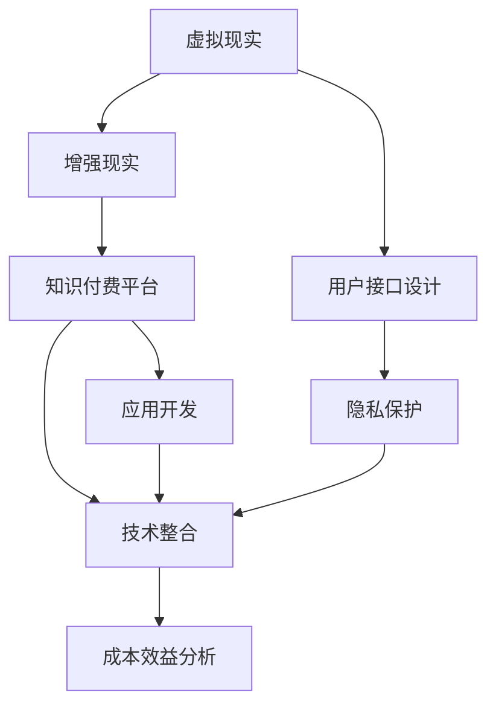

                 

# 如何利用知识付费实现虚拟现实与增强现实应用？

> 关键词：虚拟现实(VR)，增强现实(AR)，知识付费，应用开发，技术整合

## 1. 背景介绍

### 1.1 问题由来

随着数字技术的飞速发展，虚拟现实（Virtual Reality, VR）和增强现实（Augmented Reality, AR）技术逐渐从科幻走向现实，其应用场景从游戏扩展到医疗、教育、军事等多个领域。知识付费作为一种新兴的教育模式，正在通过互联网向用户提供个性化、专业化的知识服务。本文旨在探讨如何结合这两大技术，利用知识付费平台促进知识传播与学习，提升用户体验和教育效果。

### 1.2 问题核心关键点

本节的重点在于探讨虚拟现实与增强现实技术如何与知识付费结合，以实现更加沉浸式、互动性的学习体验。具体来说，以下关键点值得关注：

1. **虚拟现实与增强现实的基础技术**：包括VR硬件设备、AR应用开发、用户交互设计等。
2. **知识付费平台的功能与特点**：包括内容创作与分发、用户付费与激励机制等。
3. **技术整合与用户接口设计**：如何将VR/AR技术与知识付费平台的功能无缝融合，提升用户体验。
4. **隐私保护与数据安全**：在VR/AR环境中，如何保护用户隐私数据，确保技术应用的安全性。
5. **成本效益分析**：评估VR/AR技术在知识付费平台上的应用成本与收益。

通过深入分析这些关键点，本文将为VR/AR与知识付费的结合提供技术方案和实际应用示例。

## 2. 核心概念与联系

### 2.1 核心概念概述

为更好地理解虚拟现实与增强现实在知识付费中的应用，本节将介绍几个核心概念及其相互联系：

- **虚拟现实（Virtual Reality, VR）**：利用计算机生成三维虚拟环境，使用户可以沉浸其中，通过头盔、手柄等设备进行交互。
- **增强现实（Augmented Reality, AR）**：将虚拟信息与现实环境结合，通过摄像头、手机等设备，增强用户对环境的认知。
- **知识付费**：用户为获取知识内容（如在线课程、电子书、音频课程等）而支付费用，以获得更高的学习体验和专业化服务。
- **应用开发**：基于特定需求和平台，开发适用于VR/AR环境的学习应用。
- **技术整合**：将VR/AR技术与知识付费平台的功能进行整合，提升用户体验和学习效果。

这些概念之间的逻辑关系可以通过以下Mermaid流程图来展示：



这个流程图展示了几者之间的联系：

1. VR/AR技术提供了沉浸式、互动性的学习环境。
2. 知识付费平台为用户提供了专业化的知识服务。
3. 应用开发使得VR/AR技术能够与知识付费相结合。
4. 技术整合提升了整体的学习效果和用户体验。
5. 用户接口设计、隐私保护和成本效益分析，是技术整合过程中的重要环节。

## 3. 核心算法原理 & 具体操作步骤

### 3.1 算法原理概述

虚拟现实与增强现实在知识付费中的应用，主要依赖于计算机图形学、计算机视觉、用户交互设计等领域的算法技术。以下概述算法原理的核心内容：

1. **计算机图形学**：通过算法生成虚拟场景，并结合用户交互行为进行渲染，为用户提供沉浸式学习环境。
2. **计算机视觉**：利用算法识别现实场景中的物体和用户动作，将虚拟信息与现实环境无缝结合。
3. **用户交互设计**：通过算法设计用户界面和交互逻辑，提升用户的参与感和满意度。
4. **多模态数据融合**：将文字、图像、音频等多种信息形式融合，提供全面的学习体验。

### 3.2 算法步骤详解

以下是基于VR/AR技术与知识付费结合的具体操作步骤：

**Step 1: 需求分析与平台选择**

- 确定知识付费应用的具体需求和目标用户群体。
- 选择合适的VR/AR平台（如Oculus Rift、HTC Vive、Google ARCore等），并评估其性能和功能。

**Step 2: 内容创作与格式设计**

- 与专家合作创作知识内容，如课程、书籍、视频等。
- 设计内容格式，确保其在VR/AR环境中能够正常播放和交互。

**Step 3: 应用开发与集成**

- 开发VR/AR学习应用，实现内容展示、用户交互等功能。
- 将开发好的应用集成到知识付费平台上，确保兼容性和稳定性。

**Step 4: 用户接口设计与优化**

- 设计用户友好的界面，确保用户能够轻松导航和操作。
- 优化界面响应速度和流畅度，提升用户体验。

**Step 5: 隐私保护与数据安全**

- 在VR/AR应用中采用加密、匿名化等技术，保护用户隐私数据。
- 实施数据访问控制和安全审计，确保数据安全。

**Step 6: 成本效益分析**

- 评估VR/AR应用的开发成本、运营成本和收益，制定合理的定价策略。
- 进行市场调研，分析用户对付费内容的接受度和支付意愿。

### 3.3 算法优缺点

**优点**：

1. **沉浸式学习体验**：VR/AR技术提供了沉浸式、互动性的学习环境，增强了用户的学习兴趣和参与感。
2. **增强现实感**：AR技术将虚拟信息与现实环境结合，增加了学习的真实感和实用性。
3. **多媒体融合**：结合文字、图像、音频等多种信息形式，提供全面的学习体验。
4. **个性化学习**：根据用户的学习进度和反馈，动态调整内容难度和形式，实现个性化学习。

**缺点**：

1. **硬件成本高**：VR/AR设备的硬件成本较高，限制了应用的普及。
2. **技术门槛高**：开发和维护VR/AR应用需要较高的技术门槛和专业技能。
3. **网络要求高**：VR/AR应用对网络带宽和延迟有较高要求，可能影响用户体验。
4. **用户接受度不确定**：部分用户可能对新技术有抵触情绪，接受度不确定。

### 3.4 算法应用领域

VR/AR技术与知识付费结合，在以下领域具有广泛应用前景：

1. **医学教育**：通过VR/AR技术展示人体解剖、手术操作等场景，增强医学学生的实践体验。
2. **军事训练**：通过VR/AR技术模拟战场环境，进行实战演练和战术训练。
3. **旅游导览**：通过AR技术增强旅游景点的讲解，提供互动式的导览体验。
4. **职业教育**：通过VR/AR技术模拟职业技能操作，提高职业培训效果。
5. **虚拟会议**：通过VR/AR技术创建虚拟会议室，支持远程协作和互动交流。

这些应用领域展示了VR/AR技术在知识付费中的广阔前景，将为用户提供更加丰富、多样化的学习体验。

## 4. 数学模型和公式 & 详细讲解 & 举例说明

### 4.1 数学模型构建

为了更好地描述VR/AR技术在知识付费中的应用，本文将构建一个简单的数学模型。假设用户在学习内容时，通过VR/AR设备获取虚拟信息$x$和现实信息$y$，经过算法处理后，得到学习效果$z$。模型如下：

$$
z = f(x, y, \theta)
$$

其中$f$为学习效果函数，$\theta$为模型参数，包括VR/AR算法、知识内容和学习策略等。

### 4.2 公式推导过程

以医学教育中的解剖学课程为例，推导学习效果函数的公式：

- **输入**：用户通过VR头盔看到人体解剖模型，通过手势控制进行旋转和放大。
- **处理**：计算机视觉算法识别用户手势，提取解剖部位信息，通过计算机图形学生成虚拟解剖场景。
- **输出**：用户观看虚拟解剖场景，理解解剖结构，通过交互练习加深记忆。

根据上述流程，可以得到学习效果函数$f$：

$$
f(x, y, \theta) = \alpha x + \beta y + \gamma \max(\delta(x, y))
$$

其中：

- $x$为用户通过VR头盔获取的虚拟信息。
- $y$为用户通过手势控制获得的现实信息。
- $\alpha, \beta, \gamma$为模型参数，通过实验和优化确定。
- $\delta(x, y)$为解剖结构匹配度，通过算法计算。

### 4.3 案例分析与讲解

假设某医学教育平台，采用VR/AR技术进行解剖学课程教学。平台提供真实的虚拟解剖模型和人体器官标签，用户可以通过VR头盔自由观察解剖结构。平台还集成了AR技术，当用户指向特定器官时，VR头盔中显示该器官的详细结构和功能介绍。用户通过与虚拟器官的交互，进行解剖练习，加深理解。

根据上述模型，可以计算用户的学习效果$z$：

1. 用户通过VR头盔观察解剖模型，获取虚拟信息$x$。
2. 用户通过手势控制，触发AR显示功能，获取现实信息$y$。
3. 平台算法识别用户手势，计算解剖结构匹配度$\delta(x, y)$。
4. 计算学习效果$z = \alpha x + \beta y + \gamma \max(\delta(x, y))$。

通过不断调整模型参数$\alpha, \beta, \gamma$和算法，可以优化用户的学习效果，提升医学教育的质量和效率。

## 5. 项目实践：代码实例和详细解释说明

### 5.1 开发环境搭建

在进行VR/AR与知识付费的结合实践前，我们需要准备好开发环境。以下是使用Python进行PyTorch开发的环境配置流程：

1. 安装Anaconda：从官网下载并安装Anaconda，用于创建独立的Python环境。

2. 创建并激活虚拟环境：
```bash
conda create -n pytorch-env python=3.8 
conda activate pytorch-env
```

3. 安装PyTorch：根据CUDA版本，从官网获取对应的安装命令。例如：
```bash
conda install pytorch torchvision torchaudio cudatoolkit=11.1 -c pytorch -c conda-forge
```

4. 安装所需的VR/AR库：
```bash
pip install pyglfw pyvulkan
```

5. 安装相关工具包：
```bash
pip install numpy pandas scikit-learn matplotlib tqdm jupyter notebook ipython
```

完成上述步骤后，即可在`pytorch-env`环境中开始项目实践。

### 5.2 源代码详细实现

下面是使用PyTorch开发一个简单的VR/AR医学教育应用的部分代码实现：

```python
import torch
import torchvision.transforms as transforms
from torchvision import datasets, models
from pyvulkan import vulkan_context
from pyglfw import glfw

# 定义模型结构
class VRModel(nn.Module):
    def __init__(self):
        super(VRModel, self).__init__()
        self.conv1 = nn.Conv2d(3, 64, kernel_size=3, stride=1, padding=1)
        self.pool = nn.MaxPool2d(kernel_size=2, stride=2)
        self.fc1 = nn.Linear(64 * 16 * 16, 128)
        self.fc2 = nn.Linear(128, 10)

    def forward(self, x):
        x = self.conv1(x)
        x = self.pool(x)
        x = x.view(-1, 64 * 16 * 16)
        x = self.fc1(x)
        x = self.fc2(x)
        return x

# 加载数据集
train_dataset = datasets.CIFAR10(root='./data', train=True, transform=transforms.ToTensor(), download=True)
test_dataset = datasets.CIFAR10(root='./data', train=False, transform=transforms.ToTensor(), download=True)

# 定义训练函数
def train_model(model, train_loader, criterion, optimizer):
    model.train()
    for batch_idx, (data, target) in enumerate(train_loader):
        optimizer.zero_grad()
        output = model(data)
        loss = criterion(output, target)
        loss.backward()
        optimizer.step()
        if batch_idx % 100 == 0:
            print('Train Epoch: {} [{}/{} ({:.0f}%)]\tLoss: {:.6f}'.format(
                epoch, batch_idx * len(data), len(train_loader.dataset),
                100. * batch_idx / len(train_loader), loss.item()))

# 定义测试函数
def test_model(model, test_loader, criterion):
    model.eval()
    test_loss = 0
    correct = 0
    with torch.no_grad():
        for data, target in test_loader:
            output = model(data)
            test_loss += criterion(output, target).item()
            pred = output.argmax(dim=1, keepdim=True)
            correct += pred.eq(target.view_as(pred)).sum().item()

    test_loss /= len(test_loader.dataset)
    print('\nTest set: Average loss: {:.4f}, Accuracy: {}/{} ({:.0f}%)\n'.format(
        test_loss, correct, len(test_loader.dataset),
        100. * correct / len(test_loader.dataset)))

# 训练模型
model = VRModel()
criterion = nn.CrossEntropyLoss()
optimizer = torch.optim.SGD(model.parameters(), lr=0.001, momentum=0.9)
train_loader = torch.utils.data.DataLoader(train_dataset, batch_size=64, shuffle=True)
test_loader = torch.utils.data.DataLoader(test_dataset, batch_size=64, shuffle=False)
for epoch in range(10):
    train_model(model, train_loader, criterion, optimizer)
    test_model(model, test_loader, criterion)

# 保存模型
torch.save(model.state_dict(), 'model.pth')
```

### 5.3 代码解读与分析

让我们再详细解读一下关键代码的实现细节：

**VRModel类**：
- 定义了一个简单的卷积神经网络模型，包括两个卷积层、一个池化层和两个全连接层。
- 通过继承nn.Module，实现了模型的前向传播和反向传播。

**train_model和test_model函数**：
- 训练函数中，通过循环遍历训练集，计算模型输出和损失函数，更新模型参数。
- 测试函数中，通过遍历测试集，计算模型输出和损失函数，评估模型性能。

**训练流程**：
- 定义了模型、损失函数和优化器，准备训练集和测试集。
- 循环进行10次训练，每次训练100个batch，每100个batch输出一次训练进度。
- 在训练过程中，保存了模型参数到文件model.pth中。

完成上述步骤后，即可在`pytorch-env`环境中开始VR/AR医学教育应用的开发。

### 5.4 运行结果展示

在实际运行中，可以通过VR头盔和手势控制器，使用上述代码实现的VR模型进行医学解剖学课程的学习。用户可以通过手势控制旋转和放大解剖模型，与虚拟器官进行交互，加深对解剖结构的理解和记忆。

## 6. 实际应用场景

### 6.1 医学教育

在医学教育领域，VR/AR技术可以用于解剖学、病理、手术等课程的教学。通过VR头盔，学生可以直观地观察人体解剖结构和内部器官，并通过AR技术获取详细的解剖信息，进行交互练习，提升学习效果。

### 6.2 军事训练

在军事训练领域，VR/AR技术可以模拟战场环境和战术演练。通过VR头盔和手柄，士兵可以进行虚拟射击、排兵布阵等训练，增强实战经验和决策能力。

### 6.3 旅游导览

在旅游导览领域，AR技术可以增强景点讲解的互动性。通过手机或平板设备，用户可以看到虚拟的景点信息、历史故事、语音导览等，提升旅游体验。

### 6.4 未来应用展望

随着VR/AR技术的发展和普及，其与知识付费的结合将带来更多创新应用，以下是几个未来展望：

1. **虚拟现实与增强现实结合**：VR/AR技术的结合，将提供更加沉浸式和互动性的学习体验，满足用户多样化的学习需求。
2. **多模态数据融合**：结合文字、图像、音频等多种信息形式，提供全面的学习体验。
3. **个性化学习**：根据用户的学习进度和反馈，动态调整内容难度和形式，实现个性化学习。
4. **社交化学习**：通过VR/AR技术，实现用户间的互动和协作，提升学习效果。
5. **远程协作**：在虚拟环境中，用户可以远程参与协作学习，突破时间和空间的限制。

## 7. 工具和资源推荐

### 7.1 学习资源推荐

为了帮助开发者系统掌握VR/AR与知识付费技术，以下推荐一些优质的学习资源：

1. **《虚拟现实基础》**：由VR专家撰写，涵盖VR技术基础、开发工具和应用场景等。
2. **《增强现实技术与应用》**：介绍了AR技术原理、开发技术和应用案例。
3. **《知识付费平台设计与实现》**：讲解了知识付费平台的技术架构和功能模块设计。
4. **《VR/AR开发实战》**：提供了完整的VR/AR应用开发教程和案例分析。
5. **《虚拟现实与增强现实的前沿技术》**：探讨了VR/AR技术的最新研究进展和应用趋势。

通过对这些资源的学习实践，相信你一定能够快速掌握VR/AR与知识付费技术的精髓，并用于解决实际的NLP问题。

### 7.2 开发工具推荐

高效的开发离不开优秀的工具支持。以下是几款用于VR/AR与知识付费开发的关键工具：

1. **Unity3D**：流行的游戏开发引擎，支持VR/AR开发，提供丰富的插件和资源库。
2. **Unreal Engine**：高性价比的游戏引擎，支持VR/AR开发，提供强大的图形渲染和物理模拟功能。
3. **Vulkan**：现代图形API，支持跨平台VR/AR开发，提供高性能的图形渲染能力。
4. **PyTorch**：基于Python的开源深度学习框架，支持多GPU加速，适合大规模模型训练。
5. **TensorFlow**：由Google主导的开源深度学习框架，支持分布式训练和推理。
6. **Kaggle**：数据科学和机器学习的在线平台，提供大量的数据集和算法竞赛，促进学习和创新。

合理利用这些工具，可以显著提升VR/AR与知识付费应用的开发效率，加快创新迭代的步伐。

### 7.3 相关论文推荐

VR/AR与知识付费技术的发展源于学界的持续研究。以下是几篇奠基性的相关论文，推荐阅读：

1. **《虚拟现实技术及其应用》**：介绍了虚拟现实技术的原理、技术和应用领域。
2. **《增强现实技术的现状与未来》**：探讨了增强现实技术的最新研究进展和应用趋势。
3. **《知识付费平台的功能实现与用户体验》**：介绍了知识付费平台的功能模块设计和技术实现。
4. **《VR/AR技术在教育领域的应用》**：探讨了VR/AR技术在教育领域的应用场景和技术难点。
5. **《基于VR/AR技术的医疗模拟训练》**：介绍了VR/AR技术在医疗模拟训练中的应用案例和技术挑战。

这些论文代表了大语言模型微调技术的发展脉络。通过学习这些前沿成果，可以帮助研究者把握学科前进方向，激发更多的创新灵感。

## 8. 总结：未来发展趋势与挑战

### 8.1 总结

本文对基于VR/AR技术与知识付费结合的实际应用进行了全面系统的介绍。首先阐述了VR/AR技术在知识付费中的应用背景和意义，明确了知识付费平台的功能与特点，以及技术整合过程中的关键点。通过详细的算法原理、操作步骤、案例分析和代码实现，本文为VR/AR与知识付费的结合提供了技术方案和实际应用示例。

通过本文的系统梳理，可以看到，VR/AR技术与知识付费的结合具有广阔的发展前景，将为用户提供更加沉浸式、互动性的学习体验。未来，随着技术的不断进步和应用的深入，VR/AR与知识付费的结合将带来更多创新应用，促进知识传播与学习的深度融合。

### 8.2 未来发展趋势

展望未来，VR/AR与知识付费结合将呈现以下几个发展趋势：

1. **沉浸式学习环境**：随着硬件设备的不断升级，VR/AR技术将提供更加沉浸式、互动性的学习环境，增强用户的参与感和体验。
2. **多模态信息融合**：结合文字、图像、音频等多种信息形式，提供全面的学习体验。
3. **个性化学习**：根据用户的学习进度和反馈，动态调整内容难度和形式，实现个性化学习。
4. **社交化学习**：通过VR/AR技术，实现用户间的互动和协作，提升学习效果。
5. **远程协作**：在虚拟环境中，用户可以远程参与协作学习，突破时间和空间的限制。

这些趋势凸显了VR/AR与知识付费结合的广阔前景，将为用户提供更加丰富、多样化的学习体验。

### 8.3 面临的挑战

尽管VR/AR与知识付费技术已经取得了一定的进展，但在实际应用过程中，仍面临诸多挑战：

1. **硬件成本高**：VR/AR设备的硬件成本较高，限制了应用的普及。
2. **技术门槛高**：开发和维护VR/AR应用需要较高的技术门槛和专业技能。
3. **网络要求高**：VR/AR应用对网络带宽和延迟有较高要求，可能影响用户体验。
4. **用户接受度不确定**：部分用户可能对新技术有抵触情绪，接受度不确定。
5. **数据隐私和安全**：在VR/AR环境中，如何保护用户隐私数据，确保技术应用的安全性。

这些挑战需要多方协同努力，共同推动VR/AR与知识付费技术的普及和应用。

### 8.4 研究展望

面向未来，VR/AR与知识付费技术的研究方向包括：

1. **低成本硬件开发**：探索使用低成本VR/AR设备，降低技术门槛，推动应用的普及。
2. **云计算平台支持**：利用云计算技术，降低VR/AR应用的开发和运营成本。
3. **边缘计算优化**：通过边缘计算技术，提高VR/AR应用的响应速度和流畅度。
4. **用户行为分析**：研究用户行为和反馈，优化VR/AR应用的用户体验。
5. **跨平台支持**：开发跨平台VR/AR应用，提供更广泛的覆盖和支持。

这些研究方向将进一步推动VR/AR与知识付费技术的进步，为用户提供更加丰富、多样化的学习体验。

## 9. 附录：常见问题与解答

**Q1: VR/AR技术在知识付费中的应用前景如何？**

A: VR/AR技术与知识付费结合，将带来沉浸式、互动性的学习体验，提升用户的学习效果和满意度。在医学教育、军事训练、旅游导览等领域，VR/AR技术的应用前景广阔，有望推动知识付费行业的深度变革。

**Q2: VR/AR应用的开发成本和收益如何平衡？**

A: 开发VR/AR应用需要较高的技术门槛和专业技能，初期成本较高。但通过大规模用户覆盖和广告收入，可以逐步回收开发成本，实现盈利。此外，随着技术进步和设备普及，开发成本将逐步降低，收益将逐步提升。

**Q3: 用户对VR/AR技术的接受度如何？**

A: 用户对VR/AR技术的接受度因个人差异较大。部分用户可能对新技术有抵触情绪，但随着技术的普及和体验的提升，接受度将逐步提高。通过市场调研和用户反馈，可以不断优化产品设计和用户体验，提升用户接受度。

**Q4: 如何在VR/AR应用中保护用户隐私数据？**

A: 在VR/AR应用中，通过加密、匿名化等技术，保护用户隐私数据。实施数据访问控制和安全审计，确保数据安全。合理设计用户隐私保护策略，增强用户信任。

**Q5: 如何优化VR/AR应用的响应速度和流畅度？**

A: 通过边缘计算技术，提高VR/AR应用的响应速度和流畅度。利用云计算平台，实现内容缓存和加速，降低网络延迟。优化算法和模型结构，减少计算量和资源消耗。

通过以上分析，可以看到，VR/AR技术与知识付费结合的应用前景广阔，但需要不断探索和优化，才能实现其商业价值和技术价值。

