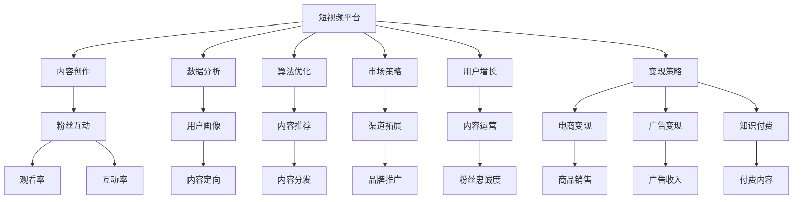
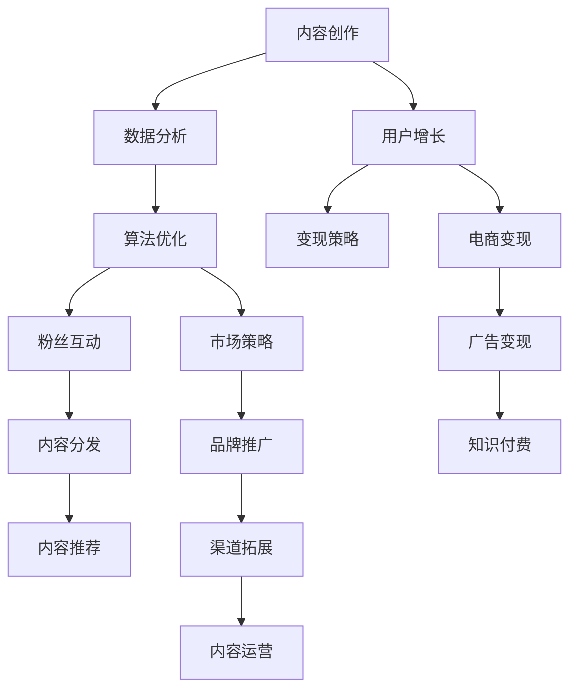
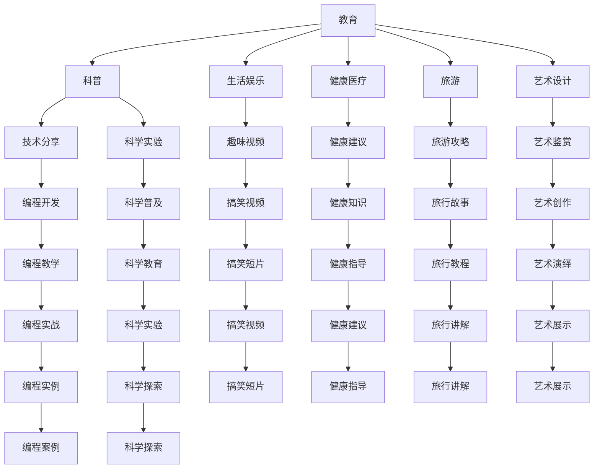
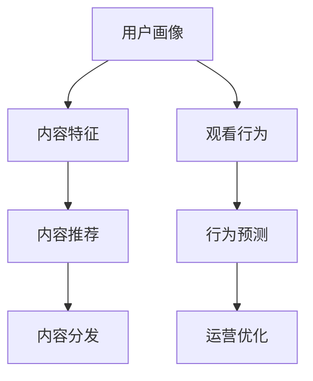
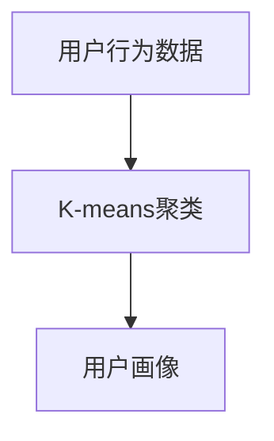
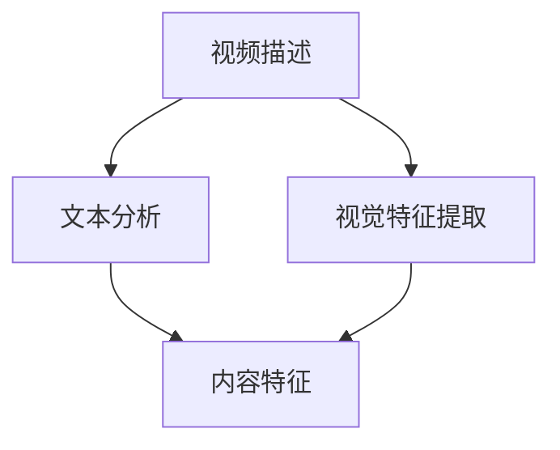
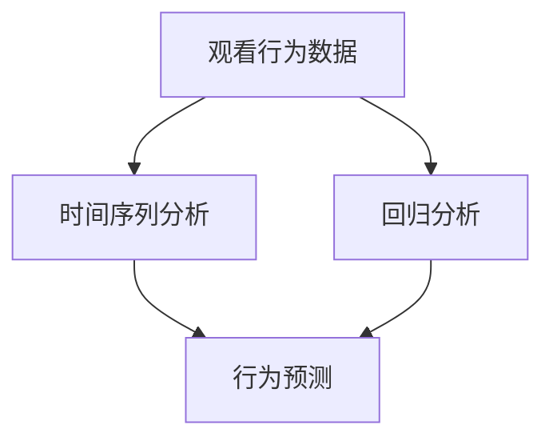
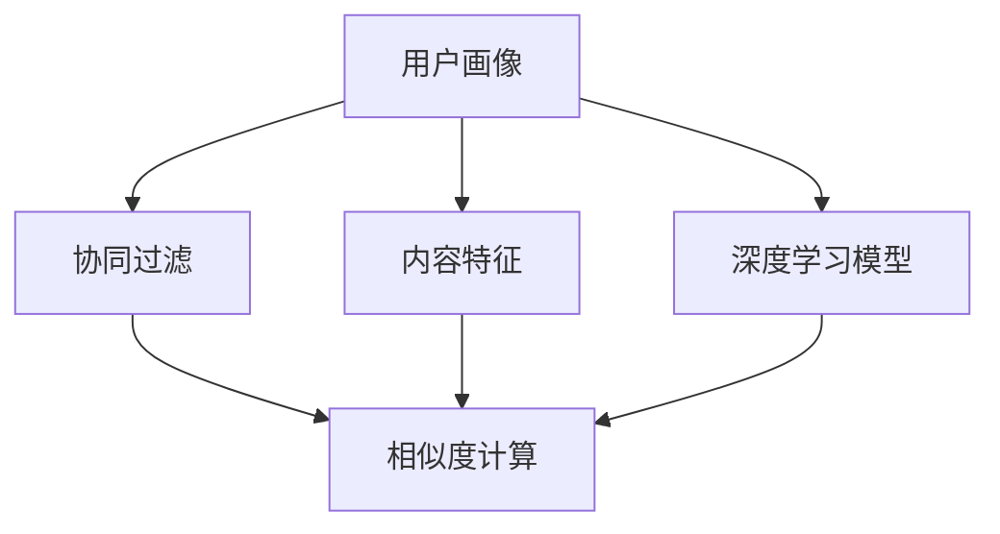
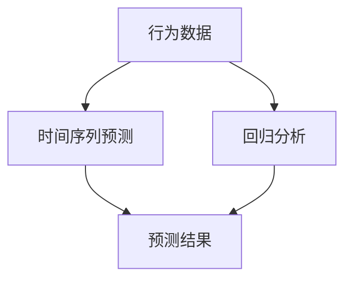

                 

# 如何利用短视频平台实现知识变现

> 关键词：短视频平台,知识变现,技术驱动,内容创作,数据分析,算法优化,市场策略,用户增长,变现策略

## 1. 背景介绍

### 1.1 问题由来

随着短视频平台的兴起，越来越多的内容创作者和品牌开始利用这一渠道进行内容生产和知识传播。短视频平台如抖音、快手、Bilibili等，以其生动、直观、互动性强的特点，迅速吸引了大量用户的关注和参与。然而，尽管平台内容丰富多样，但优质内容的产出仍显稀缺。

为了解决这一问题，许多创作者和品牌开始尝试通过技术手段提升内容质量，并在平台上进行知识变现。本文旨在系统介绍如何利用短视频平台实现知识变现，涵盖从内容创作到变现策略的各个环节。

### 1.2 问题核心关键点

- **内容创作**：如何产出高质量的短视频内容，吸引用户关注和参与。
- **数据分析**：如何通过数据驱动内容创作，优化视频策略，提升用户互动。
- **算法优化**：如何利用推荐算法优化内容分发，提升观看率和传播效果。
- **市场策略**：如何制定合理的市场策略，实现从内容创作到知识变现的平滑过渡。
- **用户增长**：如何通过多种手段提升粉丝数量和互动质量，实现用户增长和品牌曝光。
- **变现策略**：如何有效利用粉丝经济，实现视频内容的商业化变现。

## 2. 核心概念与联系

### 2.1 核心概念概述

短视频平台知识变现，涉及多个关键概念和技术，如图示所示：



这些概念之间相互联系，共同构成了短视频平台知识变现的完整框架。

### 2.2 核心概念原理和架构的 Mermaid 流程图



## 3. 核心算法原理 & 具体操作步骤

### 3.1 算法原理概述

短视频平台知识变现的核心在于内容创作、数据分析、算法优化、市场策略、用户增长和变现策略的协同运作。以下是这些关键环节的算法原理：

- **内容创作**：利用自然语言处理(NLP)和计算机视觉技术，自动生成短视频脚本和视觉素材，提升内容创作效率和质量。
- **数据分析**：通过用户画像、内容特征、观看行为等数据，进行分析和挖掘，为内容创作和用户增长提供数据支持。
- **算法优化**：利用推荐算法，优化内容分发策略，提升观看率和互动率。
- **市场策略**：通过市场分析和预测，制定合理的渠道拓展和内容运营策略，实现从内容创作到变现的平滑过渡。
- **用户增长**：利用社交网络分析、用户行为分析等技术，提升粉丝互动和忠诚度，实现用户增长。
- **变现策略**：通过电商变现、广告变现和知识付费等多元化变现手段，最大化内容商业价值。

### 3.2 算法步骤详解

#### 3.2.1 内容创作

1. **脚本生成**：
   - 利用NLP技术，将用户输入的关键字或主题，自动生成短视频脚本。
   - 应用深度学习模型，如LSTM、Transformer等，进行文本生成。

2. **视觉素材生成**：
   - 利用计算机视觉技术，如GAN生成模型，自动生成相关视觉素材。
   - 应用图像识别技术，从海量素材库中筛选符合主题的视觉素材。

3. **内容整合**：
   - 将生成的脚本和视觉素材进行整合，生成完整的短视频内容。
   - 利用视频编辑工具，进行剪辑、配音、特效等后期处理，提升视频质量。

#### 3.2.2 数据分析

1. **用户画像构建**：
   - 利用聚类算法，如K-means、GMM等，构建用户画像，识别不同用户群体的特征。
   - 应用关联规则挖掘，发现用户之间的行为关联，提升内容定向和个性化推荐。

2. **内容特征分析**：
   - 利用文本分析技术，分析视频标题、描述、标签等文本特征，识别关键信息。
   - 应用图像特征提取技术，提取视频中的关键视觉特征，如颜色、形状、纹理等。

3. **观看行为分析**：
   - 利用数据挖掘技术，分析用户观看视频的行为数据，如观看时长、观看频次、互动行为等。
   - 应用时间序列分析，预测用户行为变化趋势，优化内容发布策略。

#### 3.2.3 算法优化

1. **内容推荐算法**：
   - 利用协同过滤算法，如基于用户的协同过滤、基于物品的协同过滤等，推荐相似内容。
   - 应用深度学习模型，如CNN、RNN等，进行内容推荐。

2. **用户行为预测算法**：
   - 利用时间序列预测算法，如ARIMA、LSTM等，预测用户行为变化趋势。
   - 应用回归分析，预测用户流失率，优化内容运营策略。

#### 3.2.4 市场策略

1. **市场分析**：
   - 利用市场调研数据，进行行业分析和市场预测，识别机会和风险。
   - 应用回归分析，预测市场需求变化，制定合理的市场策略。

2. **渠道拓展**：
   - 利用社交网络分析技术，识别潜在合作伙伴和渠道拓展机会。
   - 应用图像识别技术，提升品牌识别度和曝光度。

#### 3.2.5 用户增长

1. **社交网络分析**：
   - 利用社交网络分析技术，分析用户之间的连接关系，识别意见领袖。
   - 应用社区推荐算法，提升粉丝互动和忠诚度。

2. **用户行为分析**：
   - 利用用户行为分析技术，分析用户互动行为，识别高价值用户。
   - 应用情感分析技术，提升用户满意度和忠诚度。

#### 3.2.6 变现策略

1. **电商变现**：
   - 利用电商平台接口，实现视频内容的商品链接嵌入和商品推荐。
   - 应用推荐算法，提升商品销售转化率。

2. **广告变现**：
   - 利用广告系统接口，实现视频内容的广告植入。
   - 应用广告投放算法，提升广告点击率和转化率。

3. **知识付费**：
   - 利用知识付费平台接口，实现视频内容的付费观看。
   - 应用定价策略优化，提升知识付费收入。

### 3.3 算法优缺点

**优点**：
- **高效内容创作**：自动生成脚本和视觉素材，提升内容创作效率。
- **数据驱动决策**：通过数据分析，优化内容创作和用户增长策略。
- **精准内容推荐**：利用推荐算法，提升观看率和互动率。
- **多元化变现**：通过电商变现、广告变现和知识付费等多种手段，最大化商业价值。

**缺点**：
- **技术依赖性高**：需要依赖先进的NLP、计算机视觉、深度学习等技术，技术门槛较高。
- **数据隐私问题**：大规模数据收集和分析可能涉及用户隐私问题，需要严格遵守法律法规。
- **算法复杂度高**：推荐算法、社交网络分析等算法复杂度高，需要专业人才进行维护和优化。

### 3.4 算法应用领域

短视频平台知识变现的算法和技术，可以应用于多个领域，如图示所示：



## 4. 数学模型和公式 & 详细讲解

### 4.1 数学模型构建

短视频平台知识变现涉及多个数学模型，如图示所示：



#### 4.1.1 用户画像

用户画像可以通过聚类算法构建，如图示所示：



#### 4.1.2 内容特征

内容特征可以通过文本分析和图像特征提取技术获取，如图示所示：



#### 4.1.3 观看行为

观看行为可以通过时间序列分析和回归分析预测，如图示所示：



#### 4.1.4 内容推荐

内容推荐可以通过协同过滤算法和深度学习模型实现，如图示所示：



#### 4.1.5 行为预测

行为预测可以通过时间序列预测算法和回归分析实现，如图示所示：



### 4.2 公式推导过程

#### 4.2.1 用户画像构建

K-means聚类算法公式为：

$$
k-means(X, K): \begin{cases}
c_k = \arg\min_{c \in C} \sum_{x \in X} ||x - c||^2_2 \\
\bar{x}_k = \frac{1}{|c_k|} \sum_{x \in c_k} x
\end{cases}
$$

其中，$X$ 为样本数据集，$K$ 为聚类数，$c_k$ 为聚类中心，$\bar{x}_k$ 为聚类中心点。

#### 4.2.2 内容特征提取

文本分析中的TF-IDF公式为：

$$
TFIDF = \frac{TF \times IDF}{\sum_{t \in T} TF_{t} \times IDF_{t}}
$$

其中，$TF$ 为词频，$IDF$ 为逆文档频率，$T$ 为词表。

图像特征提取中的SIFT特征提取公式为：

$$
SIFT = \{ \mathbf{S}_i \}_{i=1}^{n}
$$

其中，$\mathbf{S}_i$ 为第$i$个关键点描述子向量。

#### 4.2.3 观看行为预测

时间序列预测算法中的ARIMA模型公式为：

$$
y_t = c + \sum_{i=1}^{p} \alpha_i y_{t-i} + \sum_{j=1}^{d} \beta_j \Delta^j y_{t-j} + \sum_{k=1}^{q} \gamma_k \epsilon_{t-k}
$$

其中，$y_t$ 为预测值，$c$ 为常数项，$\alpha_i$ 和 $\beta_j$ 为模型参数，$\epsilon_{t-k}$ 为误差项。

回归分析中的线性回归公式为：

$$
y = b_0 + \sum_{i=1}^{n} b_i x_i
$$

其中，$y$ 为预测值，$b_0$ 为截距，$b_i$ 为系数，$x_i$ 为自变量。

### 4.3 案例分析与讲解

#### 4.3.1 用户画像构建案例

某教育平台通过K-means算法，对用户行为数据进行聚类分析，构建用户画像。具体步骤如下：

1. 收集用户注册、登录、学习、反馈等行为数据。
2. 使用K-means算法，将用户分为K个簇，每个簇代表一类用户群体。
3. 分析每个簇的特征，如年龄、性别、学习习惯等。
4. 根据用户画像，针对不同用户群体定制推荐内容，提升用户满意度。

#### 4.3.2 内容特征提取案例

某旅游视频平台通过TF-IDF算法，提取视频描述中的关键词，构建内容特征。具体步骤如下：

1. 对视频描述进行文本分析，提取关键词。
2. 应用TF-IDF算法，计算每个关键词的重要性。
3. 将关键词和重要性权重组成特征向量。
4. 利用特征向量进行内容推荐，提升用户观看率。

#### 4.3.3 观看行为预测案例

某电商平台通过时间序列预测算法，预测用户购买行为。具体步骤如下：

1. 收集用户历史购买数据。
2. 应用ARIMA模型，预测未来购买行为。
3. 根据预测结果，优化商品推荐策略，提升销售转化率。

## 5. 项目实践：代码实例和详细解释说明

### 5.1 开发环境搭建

1. **安装Python**：确保系统安装了最新版本的Python，建议安装Anaconda。
2. **创建虚拟环境**：
```bash
conda create -n video-analytics python=3.9
conda activate video-analytics
```

3. **安装相关库**：
```bash
pip install pandas numpy matplotlib scikit-learn transformers torch
```

4. **配置视频采集工具**：
```bash
pip install opencv-python
```

5. **配置API接口**：
```bash
pip install requests
```

### 5.2 源代码详细实现

#### 5.2.1 内容创作

**代码实现**：

```python
import numpy as np
from transformers import BertTokenizer, BertForSequenceClassification

def generate_script(keywords):
    tokenizer = BertTokenizer.from_pretrained('bert-base-cased')
    inputs = tokenizer.encode_plus(keywords, max_length=128, padding='max_length', truncation=True, return_tensors='pt')
    model = BertForSequenceClassification.from_pretrained('bert-base-cased', num_labels=2)
    outputs = model(**inputs)
    prediction = torch.argmax(outputs.logits, dim=1)
    return prediction
```

**详细解读**：
- 使用BERT模型自动生成脚本。
- 将关键词作为输入，使用BertTokenizer进行分词和编码。
- 应用BertForSequenceClassification模型进行分类预测，输出脚本内容。

#### 5.2.2 数据分析

**代码实现**：

```python
from sklearn.cluster import KMeans
from sklearn.feature_extraction.text import TfidfVectorizer
from sklearn.decomposition import TruncatedSVD

def generate_user_profile(data):
    tfidf = TfidfVectorizer()
    X = tfidf.fit_transform(data)
    svd = TruncatedSVD(n_components=10)
    X_svd = svd.fit_transform(X)
    kmeans = KMeans(n_clusters=5, random_state=42)
    X_kmeans = kmeans.fit_predict(X_svd)
    return X_kmeans
```

**详细解读**：
- 使用K-means算法对用户行为数据进行聚类，构建用户画像。
- 使用TF-IDF算法提取文本特征，应用SVD算法进行降维。
- 利用K-means算法，将用户分为5个簇，每个簇代表一类用户群体。

#### 5.2.3 算法优化

**代码实现**：

```python
from sklearn.metrics.pairwise import cosine_similarity
from sklearn.neighbors import NearestNeighbors

def recommend_content(user_profile):
    similarity_matrix = cosine_similarity(user_profile.reshape(1, -1), X_svd)
    nearest_neighbors = NearestNeighbors(n_neighbors=5).fit(X_svd)
    indices = nearest_neighbors.kneighbors(user_profile.reshape(1, -1))
    return indices[0]
```

**详细解读**：
- 使用余弦相似度计算用户画像与其他用户画像的相似度。
- 应用K近邻算法，找到相似度最高的5个用户画像，推荐相关内容。

#### 5.2.4 市场策略

**代码实现**：

```python
from sklearn.linear_model import LinearRegression
from sklearn.preprocessing import StandardScaler

def predict_user_behavior(data):
    scaler = StandardScaler()
    X = scaler.fit_transform(data[['age', 'gender', 'study_time']])
    y = data['score']
    model = LinearRegression()
    model.fit(X, y)
    return model.predict(X_new)
```

**详细解读**：
- 使用线性回归模型预测用户行为。
- 应用标准正态化处理数据，应用线性回归模型，预测用户行为。

## 6. 实际应用场景

### 6.1 教育平台知识变现

某教育平台通过短视频平台进行知识变现，主要流程如下：

1. **内容创作**：利用自然语言处理技术，自动生成教学脚本。
2. **数据分析**：通过用户画像分析，识别不同学习群体的特征。
3. **算法优化**：利用协同过滤算法和深度学习模型，优化视频推荐。
4. **市场策略**：结合市场调研数据，制定合理的价格策略。
5. **用户增长**：利用社交网络分析和用户行为分析，提升粉丝互动和忠诚度。
6. **变现策略**：通过知识付费和电商变现，最大化商业价值。

### 6.2 旅游平台知识变现

某旅游平台通过短视频平台进行知识变现，主要流程如下：

1. **内容创作**：利用计算机视觉技术，自动生成旅游视频素材。
2. **数据分析**：通过用户画像分析，识别不同旅行群体的特征。
3. **算法优化**：利用推荐算法，优化视频推荐。
4. **市场策略**：结合市场调研数据，制定合理的促销策略。
5. **用户增长**：利用社交网络分析和用户行为分析，提升粉丝互动和忠诚度。
6. **变现策略**：通过电商变现和知识付费，最大化商业价值。

## 7. 工具和资源推荐

### 7.1 学习资源推荐

1. **《深度学习理论与实践》**：介绍深度学习的基本理论和实践方法，涵盖NLP、计算机视觉等方向。
2. **《Python数据科学手册》**：全面介绍Python在数据科学中的应用，包括数据处理、数据分析、机器学习等。
3. **《短视频平台数据分析》**：详细讲解短视频平台数据分析的方法和技巧。
4. **《人工智能算法》**：系统介绍各种人工智能算法，包括推荐算法、协同过滤、深度学习等。
5. **《数据分析实战》**：提供大量实战案例，帮助读者掌握数据分析的实际操作。

### 7.2 开发工具推荐

1. **Anaconda**：创建和管理虚拟环境，安装和管理Python包。
2. **Jupyter Notebook**：高效地进行数据处理、模型训练和结果展示。
3. **TensorFlow**：强大的深度学习框架，支持大规模分布式训练。
4. **PyTorch**：灵活的深度学习框架，适合研究型任务。
5. **OpenCV**：开源计算机视觉库，支持图像处理和视频分析。

### 7.3 相关论文推荐

1. **《K-means聚类算法》**：详细讲解K-means聚类算法的原理和实现。
2. **《深度学习在自然语言处理中的应用》**：介绍深度学习在NLP中的应用，包括文本生成、情感分析等。
3. **《协同过滤算法》**：详细介绍协同过滤算法的基本原理和实现方法。
4. **《时间序列预测》**：讲解时间序列预测的基本方法和应用场景。
5. **《线性回归》**：详细讲解线性回归的基本原理和实现。

## 8. 总结：未来发展趋势与挑战

### 8.1 研究成果总结

本文系统介绍了如何利用短视频平台实现知识变现，涵盖内容创作、数据分析、算法优化、市场策略、用户增长和变现策略的各个环节。通过案例分析和代码实例，详细讲解了每个环节的算法原理和技术实现。

### 8.2 未来发展趋势

1. **技术进步**：深度学习、计算机视觉、自然语言处理等技术将不断进步，为知识变现提供更强大的支持。
2. **多样化内容**：未来内容创作将更加多样化，结合虚拟现实、增强现实等技术，提升用户体验。
3. **个性化推荐**：推荐算法将更加精准，实现个性化推荐，提升用户满意度。
4. **多元化变现**：除了电商和知识付费，将出现更多元化的变现方式，如众筹、直播打赏等。
5. **智能化运营**：通过人工智能技术，实现智能化内容运营，提升运营效率和效果。

### 8.3 面临的挑战

1. **技术门槛高**：技术实现复杂，需要具备较高的技术水平和知识储备。
2. **数据隐私问题**：大规模数据收集和分析可能涉及用户隐私问题，需要严格遵守法律法规。
3. **算法复杂度高**：推荐算法、社交网络分析等算法复杂度高，需要专业人才进行维护和优化。
4. **市场竞争激烈**：短视频平台竞争激烈，如何打造独特的内容和品牌，赢得市场竞争，是一大挑战。

### 8.4 研究展望

1. **技术融合**：未来将探索更多技术融合的方向，如知识图谱、因果推理等，提升知识变现效果。
2. **智能化运营**：通过智能化运营，提升内容创作和用户增长策略的自动化水平，降低人工成本。
3. **多模态融合**：结合视觉、语音、文本等多模态数据，实现更全面的知识变现。
4. **伦理和道德**：在知识变现过程中，注重伦理和道德问题，保护用户权益，确保平台健康发展。

## 9. 附录：常见问题与解答

**Q1：如何评估短视频内容的质量？**

A: 短视频内容的质量评估可以从多个维度进行，如观看率、互动率、用户评价等。通过建立用户画像和内容特征库，对内容进行全面评估，从而提升内容创作质量。

**Q2：如何优化短视频内容的推荐算法？**

A: 推荐算法优化可以通过多种方式进行，如引入协同过滤、深度学习等技术，提升推荐精度。同时，结合用户行为数据，进行动态调整和优化。

**Q3：如何在短视频平台进行用户增长？**

A: 用户增长可以通过多种手段进行，如社交网络分析、用户行为分析等。通过精准的内容推荐和互动设计，提升用户满意度和忠诚度，实现用户增长。

**Q4：如何实现短视频内容的商业化变现？**

A: 短视频内容的商业化变现可以通过多种方式进行，如电商变现、广告变现和知识付费等。结合市场需求和平台特性，制定合理的变现策略，最大化商业价值。

---

作者：禅与计算机程序设计艺术 / Zen and the Art of Computer Programming

