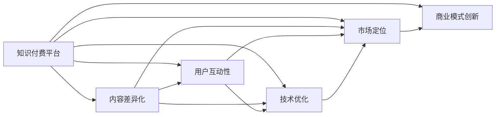

                 

## 1. 背景介绍

### 1.1 问题由来

在知识付费领域，随着内容形式的日趋多样化与用户需求的日益个性化，市场竞争已进入白热化阶段。传统知识付费平台如得到、喜马拉雅等，面临着内容同质化、用户增长瓶颈、内容质量下降等诸多挑战。新入局者亦在不断涌入，通过吸引内容创作者和消费者，试图在激烈的市场竞争中占有一席之地。在这种竞争态势下，如何有效突围，成为知识付费平台及内容创作者普遍关心的问题。

### 1.2 问题核心关键点

为了回答如何在知识付费市场突围，本文将重点探讨以下核心问题：

- **内容差异化**：如何在海量信息中，提供与众不同的高质量内容？
- **用户互动性**：如何增强用户参与感和粘性，促成良性循环？
- **技术优化**：如何利用最新的技术手段，提升用户体验和服务效率？
- **市场定位**：如何精准定位目标用户群体，抓住细分市场机会？
- **商业模式创新**：如何建立多维度的盈利模式，提升平台的长期盈利能力？

### 1.3 问题研究意义

在知识付费市场突围，对于知识付费平台和内容创作者而言，既是对自身能力的考验，也是对技术创新的探索。其研究意义在于：

- 帮助知识付费平台在竞争中脱颖而出，赢得更多用户关注和支持。
- 指导内容创作者提升创作水平，生产更符合用户需求和兴趣的优质内容。
- 借助先进的技术手段，提升平台的运营效率和用户体验，增强平台竞争力。

## 2. 核心概念与联系

### 2.1 核心概念概述

为更好地理解如何在知识付费市场突围，我们将介绍以下相关概念：

- **知识付费平台**：提供各种付费知识内容的平台，如得到、喜马拉雅、知乎等。
- **内容差异化**：在内容同质化严重的情况下，通过独特的内容形式或内容类型，吸引特定用户群体的注意。
- **用户互动性**：通过在线讨论、社区建设等方式，增强用户与内容创作者之间的互动，提升用户体验。
- **技术优化**：利用人工智能、大数据、区块链等先进技术，提升平台的运营效率和用户体验。
- **市场定位**：根据用户需求、竞争态势、自身优势等因素，确定平台的目标用户群体和市场定位。
- **商业模式创新**：采用多元化收入来源，如订阅、广告、增值服务等，构建可持续发展的盈利模式。

这些核心概念之间存在着紧密的联系：内容差异化是吸引用户的基础，用户互动性是增强用户粘性的关键，技术优化是提升用户体验的保障，市场定位是明确目标用户的指南，而商业模式创新则是平台可持续发展的基石。

### 2.2 核心概念原理和架构的 Mermaid 流程图



## 3. 核心算法原理 & 具体操作步骤

### 3.1 算法原理概述

在知识付费市场中突围，可以借助以下几个核心算法原理：

- **个性化推荐算法**：通过分析用户行为数据，为用户推荐个性化的内容，提升用户满意度。
- **情感分析算法**：分析用户反馈和评论，理解用户情绪，优化内容创作和平台体验。
- **预测模型**：利用历史数据和机器学习模型，预测用户行为和市场需求，优化内容生产和平台策略。
- **多模态交互**：结合文字、音频、视频等多种形式，提升用户互动体验，增强粘性。
- **内容生成算法**：利用生成对抗网络（GAN）、Transformer等技术，自动化生成内容，减少人力成本。

### 3.2 算法步骤详解

具体步骤如下：

1. **数据收集与预处理**：
   - 收集用户行为数据，如浏览、点击、评论等。
   - 清洗和预处理数据，去除噪音，标准化格式。

2. **模型训练与优化**：
   - 利用历史数据训练个性化推荐模型、情感分析模型等，优化模型参数。
   - 应用梯度下降、正则化等技术，提高模型性能。

3. **内容生成与适配**：
   - 利用生成算法生成丰富多样的内容形式。
   - 根据用户偏好和市场趋势，调整内容适配策略。

4. **互动与反馈循环**：
   - 构建互动社区，促进用户与创作者之间的交流。
   - 分析用户反馈，不断优化内容和推荐算法。

5. **商业模式探索**：
   - 探索多元化的盈利模式，如订阅、广告、众筹等。
   - 利用区块链技术保障交易安全，提升平台信任度。

### 3.3 算法优缺点

个性化推荐算法、情感分析算法等在提升用户体验、优化内容创作方面具有显著优势，但也存在一些缺点：

优点：
- 个性化推荐：提高用户满意度和粘性，促成良性循环。
- 情感分析：及时了解用户情绪，优化平台体验。
- 预测模型：准确预测用户行为和市场需求，优化决策。

缺点：
- 算法依赖：需要大量高质量标注数据，数据获取成本高。
- 模型过拟合：在数据不充分的情况下，容易过拟合，影响性能。
- 算法透明性：推荐算法和情感分析算法的决策过程复杂，缺乏透明性。

### 3.4 算法应用领域

这些算法广泛应用于知识付费平台的各个环节：

- **内容推荐**：通过个性化推荐算法，为不同用户推荐最感兴趣的内容。
- **互动体验**：利用情感分析算法，理解用户情绪，优化平台互动功能。
- **用户留存**：应用预测模型，预判用户流失风险，采取措施提升留存率。
- **内容创作**：利用内容生成算法，自动化生成多样化的内容形式。
- **盈利模式**：探索多元化的盈利模式，提升平台的长期盈利能力。

## 4. 数学模型和公式 & 详细讲解 & 举例说明

### 4.1 数学模型构建

本节我们将使用数学语言详细阐述知识付费平台中的核心算法模型。

假设用户数为 $N$，每个用户 $i$ 的评分向量为 $x_i \in \mathbb{R}^d$，推荐系统推荐的内容向量为 $y \in \mathbb{R}^d$。则个性化推荐模型的目标是最小化均方误差损失：

$$
\min_{\theta} \frac{1}{N} \sum_{i=1}^N \|y - x_i\theta\|^2
$$

其中 $\theta$ 为模型参数，$\|\cdot\|$ 为范数。

### 4.2 公式推导过程

对于个性化推荐模型的优化，可以利用梯度下降算法进行求解：

$$
\theta = \theta - \alpha \nabla_{\theta} \frac{1}{N} \sum_{i=1}^N \|y - x_i\theta\|^2
$$

其中 $\alpha$ 为学习率，$\nabla_{\theta}$ 为梯度算子。

### 4.3 案例分析与讲解

以协同过滤推荐算法为例，其核心思想是通过分析用户行为数据，找出与用户 $i$ 兴趣相似的用户集合 $I$，进而推荐相似用户喜欢的内容 $y$。假设用户集合为 $U$，内容集合为 $I$，用户 $i$ 对内容 $j$ 的评分矩阵为 $R \in \mathbb{R}^{N \times M}$，则协同过滤算法的基本形式为：

$$
y = \sum_{i' \in I} \alpha_i' x_i'
$$

其中 $\alpha_i'$ 为权重，$x_i'$ 为相似用户 $i'$ 的评分向量。

协同过滤算法能够有效利用用户行为数据，推荐内容高度相关的信息，但也存在稀疏性和冷启动问题。

## 5. 项目实践：代码实例和详细解释说明

### 5.1 开发环境搭建

在知识付费平台的开发环境中，建议使用 Python 3.8 或更高版本，并使用 Anaconda 创建虚拟环境。

### 5.2 源代码详细实现

以下是一个简单的 Python 代码示例，实现协同过滤推荐算法：

```python
from sklearn.metrics.pairwise import cosine_similarity
import numpy as np

# 构建评分矩阵
R = np.array([[5, 4, 0, 0],
              [1, 3, 0, 0],
              [0, 0, 4, 3],
              [0, 0, 0, 5]])

# 计算用户间的相似度
similarity = cosine_similarity(R)

# 设定用户i
i = 2

# 计算与用户i兴趣相似的用户集合
I = np.where(similarity[i, :])[0]

# 根据相似用户集合推荐内容
y = np.mean(similarity[:, I], axis=1) * R[i, :]

# 输出推荐内容
print(y)
```

### 5.3 代码解读与分析

上述代码中，我们首先构建了一个简单的评分矩阵 $R$，其中 $R_{ij}$ 表示用户 $i$ 对内容 $j$ 的评分。

接着，利用 `cosine_similarity` 函数计算用户间的相似度矩阵，其中 $similarity_{ij}$ 表示用户 $i$ 和用户 $j$ 的相似度。

然后，设定用户 $i=2$，根据相似度矩阵找到与用户 $i$ 兴趣相似的用户集合 $I$。

最后，根据相似用户集合推荐内容 $y$，其中 $y_i$ 表示用户 $i$ 的推荐内容评分。

## 6. 实际应用场景

### 6.1 智能客服系统

在智能客服系统中，知识付费平台可以与智能客服系统进行深度整合，为用户提供即时的知识解答服务。例如，知识付费平台可以构建一个智能客服聊天机器人，用户输入问题后，机器人根据问题语义匹配最相关的知识内容进行解答。

### 6.2 在线教育平台

在线教育平台可以利用知识付费平台的内容资源，提供更加专业化和个性化的学习服务。平台可以根据用户的学习进度、偏好，推荐相应的学习资料和课程，提升学习效率。

### 6.3 企业培训系统

企业培训系统可以利用知识付费平台的内容资源，为员工提供系统化的培训服务。平台可以根据员工的工作领域、职位级别，推荐最相关的培训课程和资料，提升员工技能。

### 6.4 未来应用展望

未来，知识付费平台可以借助以下技术手段，进一步提升平台的竞争力：

- **智能聊天机器人**：结合自然语言处理和机器学习技术，为用户提供即时的知识解答服务。
- **个性化推荐系统**：利用深度学习模型，为用户推荐个性化的学习资料和课程，提升学习效率。
- **知识图谱**：构建知识图谱，将知识内容进行结构化，提升内容的可检索性和可理解性。
- **区块链技术**：利用区块链技术，保障交易安全，提升平台信任度。
- **增强现实技术**：结合增强现实技术，提供更加沉浸式的学习体验，提升学习效果。

## 7. 工具和资源推荐

### 7.1 学习资源推荐

- **《推荐系统实战》**：介绍推荐系统原理和算法实现，适合初学者和进阶者。
- **《深度学习》**：李沐的深度学习课程，涵盖深度学习基础和应用。
- **Kaggle**：数据科学竞赛平台，提供丰富的数据集和算法实现案例。

### 7.2 开发工具推荐

- **Python**：简单易学，广泛应用的数据科学语言。
- **Jupyter Notebook**：交互式编程环境，方便调试和实验。
- **TensorFlow**：深度学习框架，支持分布式计算和模型优化。

### 7.3 相关论文推荐

- **《个性化推荐系统研究》**：综述性论文，介绍推荐系统的发展和应用。
- **《深度学习与推荐系统》**：介绍深度学习在推荐系统中的应用。
- **《基于协同过滤的推荐系统》**：介绍协同过滤推荐算法的原理和实现。

## 8. 总结：未来发展趋势与挑战

### 8.1 总结

本文从知识付费市场的竞争现状出发，探讨了内容差异化、用户互动性、技术优化、市场定位和商业模式创新等核心问题。通过详细阐述相关算法原理和技术实现，为知识付费平台和内容创作者提供了有益的指导和参考。

### 8.2 未来发展趋势

展望未来，知识付费市场的竞争将更加激烈。技术创新和内容差异化将是平台突围的重要手段。以下趋势值得关注：

- **AI技术应用**：人工智能和机器学习技术将进一步深入应用，提升平台的技术水平和服务质量。
- **内容创新**：多样化的内容形式和内容类型将吸引更多用户，如短视频、直播等。
- **用户互动**：通过社区建设、在线讨论等方式，增强用户参与感和粘性，提升平台活力。
- **市场细分**：通过精准定位，抓住细分市场机会，提升平台的竞争力和盈利能力。
- **多元盈利**：利用广告、订阅、众筹等多元化的盈利模式，实现平台的可持续发展和盈利。

### 8.3 面临的挑战

在知识付费市场的竞争中，知识付费平台和内容创作者仍面临诸多挑战：

- **内容同质化**：海量信息中如何提供与众不同的高质量内容，是平台突围的关键。
- **用户流失**：如何保持用户粘性，防止用户流失，是平台运营的重要问题。
- **内容质量**：如何提升内容质量，吸引更多用户，是内容创作者面临的挑战。
- **市场环境**：如何适应市场变化，抓住新的市场机会，是平台的战略问题。
- **技术瓶颈**：如何突破技术瓶颈，提升平台的运营效率和服务质量，是平台技术的难点。

### 8.4 研究展望

为了应对这些挑战，知识付费平台和内容创作者需要在以下几个方面进行持续研究：

- **内容差异化**：开发更多独特的优质内容形式和内容类型，吸引用户关注。
- **用户互动**：构建互动社区，增强用户参与感和粘性，提升平台活力。
- **技术优化**：利用最新技术手段，提升平台的运营效率和服务质量。
- **市场定位**：精准定位目标用户群体，抓住细分市场机会。
- **盈利模式**：探索多元化的盈利模式，实现平台的可持续发展和盈利。

## 9. 附录：常见问题与解答

**Q1：知识付费平台如何应对内容同质化问题？**

A: 平台可以通过以下几个方面应对内容同质化问题：
- 引入内容创作者：邀请更多专业的内容创作者入驻平台，丰富内容形式和内容类型。
- 构建内容生态：鼓励内容创作者之间合作，产生更多高质量的联合内容。
- 定制化内容：根据用户需求和兴趣，定制化推荐内容，满足用户个性化需求。

**Q2：知识付费平台如何提高用户粘性？**

A: 提高用户粘性是知识付费平台的核心问题，以下是一些可行方法：
- 提供优质内容：不断引入高质量的内容，吸引更多用户。
- 增强互动体验：构建互动社区，增加用户参与感和粘性。
- 个性化推荐：根据用户行为和偏好，推荐个性化的内容，提升用户体验。
- 用户激励：设立积分、优惠券等激励机制，促进用户活跃度。

**Q3：知识付费平台如何提升内容质量？**

A: 提升内容质量需要多方面的努力：
- 引入高水平创作者：平台应邀请更多高水平的内容创作者入驻，提升内容水平。
- 引入严格的审核机制：建立内容审核机制，保障内容质量。
- 提供创作工具：提供专业的创作工具和平台，降低内容创作门槛。
- 建立反馈机制：建立用户反馈机制，及时了解用户需求，改进内容质量。

**Q4：知识付费平台如何适应市场环境变化？**

A: 平台需要密切关注市场环境变化，灵活应对：
- 市场调研：进行市场调研，了解市场需求和竞争态势。
- 战略调整：根据市场变化，及时调整平台战略，抓住新机会。
- 内容创新：不断创新内容形式和内容类型，保持平台竞争力。
- 技术升级：利用最新技术手段，提升平台运营效率和服务质量。

**Q5：知识付费平台如何突破技术瓶颈？**

A: 平台需要不断优化技术，突破瓶颈：
- 引入新技术：引入最新的人工智能、大数据等技术，提升平台技术水平。
- 优化算法：优化推荐算法和情感分析算法，提升推荐效果。
- 技术合作：与技术公司进行合作，获取技术支持和资源。
- 技术培训：对员工进行技术培训，提升技术水平。

**Q6：知识付费平台如何提升服务效率？**

A: 提升服务效率是平台运营的重要目标，以下是一些可行方法：
- 自动化流程：引入自动化流程，减少人工干预，提高效率。
- 技术升级：利用最新技术手段，提升平台运营效率。
- 服务优化：优化用户体验，提升服务质量。
- 数据驱动：利用数据驱动决策，优化平台运营策略。

通过深入理解这些核心问题和解决方法，知识付费平台和内容创作者能够更好地应对市场竞争，提升平台竞争力，实现可持续发展。

