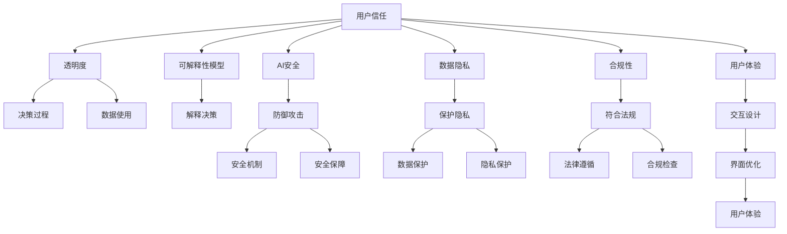

                 

# 如何在自动化创业中建立用户信任

> 关键词：自动化创业、用户信任、信任模型、AI安全、数据隐私、合规性、用户体验、透明度

## 1. 背景介绍

### 1.1 问题由来
自动化创业（Automation创业），指的是利用人工智能、机器学习、自然语言处理等技术，创新性地解决实际问题，提升企业运营效率。然而，尽管自动化技术能够极大地提升生产力，但用户对自动化系统的信任问题依然是一大挑战。用户对于新系统、新服务的接受度往往较低，甚至存在一定的抵触情绪，这不仅影响用户体验，也限制了技术的广泛应用。

### 1.2 问题核心关键点
建立用户信任的关键在于以下几个方面：

1. **透明度**：用户需要了解系统的决策过程和数据使用情况，从而对其输出结果产生信任。
2. **可解释性**：用户需要能够理解系统是如何得出结论的，并能够解释系统行为的原因。
3. **安全性**：用户需要确信其数据和隐私得到妥善保护，避免被滥用或泄露。
4. **合规性**：系统必须符合行业和地区的法律法规，确保合规使用。
5. **用户体验**：系统的设计需要考虑用户的接受度和使用习惯，提供友好的交互界面。
6. **数据隐私**：保护用户的个人信息，避免数据泄露和滥用。

### 1.3 问题研究意义
建立用户信任对于自动化创业的成功至关重要。信任能够提升用户的黏性，降低企业成本，增加市场竞争力。本文档将从理论到实践，深入探讨如何在自动化创业中建立用户信任，为创业者和技术人员提供全面的指导。

## 2. 核心概念与联系

### 2.1 核心概念概述

为更好地理解如何在自动化创业中建立用户信任，本节将介绍几个密切相关的核心概念：

- **用户信任**：用户对系统或产品的接受度和信任程度，是其持续使用和推荐的关键。
- **自动化创业**：利用自动化技术创新地解决实际问题，提升运营效率，降低成本的创业模式。
- **可解释性模型**：能够输出解释信息的机器学习模型，帮助用户理解系统的决策过程。
- **AI安全**：保护系统免受恶意攻击，确保其稳定运行和安全可靠。
- **数据隐私**：保护用户的个人信息和数据，防止未经授权的访问和使用。
- **合规性**：确保系统符合相关法律法规和行业标准，避免法律风险。
- **用户体验**：通过设计良好的界面和交互流程，提升用户的使用体验和满意度。
- **透明度**：系统的决策过程和数据使用情况应向用户公开，增强信任感。

这些核心概念之间的逻辑关系可以通过以下Mermaid流程图来展示：



这个流程图展示了点对点的关键概念及其关系：

1. 用户信任依赖于透明度、可解释性、AI安全、数据隐私、合规性、用户体验等核心要素。
2. 透明度和可解释性模型有助于解释决策过程。
3. AI安全涉及防御攻击和保障系统安全。
4. 数据隐私保护数据不被滥用和泄露。
5. 合规性确保系统符合法律法规。
6. 用户体验影响用户对系统的接受度。
7. 透明度与数据使用相关联。
8. 各要素相互作用，共同构建用户信任。

## 3. 核心算法原理 & 具体操作步骤
### 3.1 算法原理概述

在自动化创业中建立用户信任，本质上是一个多维度的优化问题。其核心思想是：通过多方面的优化和调整，增强用户对系统的信任度。

### 3.2 算法步骤详解

基于以上理论，本节将详细讲解如何通过具体步骤在自动化创业中建立用户信任：

**Step 1: 数据隐私保护**

- **数据收集**：明确数据收集的目的和范围，仅收集必要的数据。
- **数据匿名化**：对敏感数据进行匿名化处理，防止识别个人身份。
- **数据加密**：对存储和传输的数据进行加密，防止数据泄露。
- **访问控制**：设置严格的访问权限，确保数据仅被授权人员访问。

**Step 2: 可解释性模型构建**

- **选择模型**：选择可解释性较高的模型，如决策树、逻辑回归等。
- **特征工程**：合理选择和构造特征，提高模型的解释性。
- **模型训练**：在训练过程中输出中间结果，记录决策路径。
- **结果解释**：生成易于理解的解释文本，帮助用户理解模型输出。

**Step 3: 透明度和决策过程公开**

- **数据使用透明**：在用户界面中公开数据使用情况，包括收集、存储和处理流程。
- **决策过程透明**：通过日志记录和模型解释，向用户展示系统决策过程。
- **用户反馈机制**：建立反馈渠道，允许用户对系统的决策结果提出质疑和建议。

**Step 4: 用户体验设计**

- **界面友好**：设计直观、易用的界面，减少用户学习成本。
- **交互优化**：提供简化的交互流程，提升用户操作便捷性。
- **响应及时**：确保系统响应迅速，减少用户等待时间。
- **个性化推荐**：根据用户行为和偏好，提供个性化的推荐和服务。

**Step 5: AI安全防护**

- **攻击检测**：部署入侵检测系统，实时监测异常行为。
- **漏洞修补**：定期更新系统补丁，修补已知漏洞。
- **应急响应**：建立应急响应机制，快速处理安全事件。
- **安全培训**：对系统开发人员进行安全意识培训，提高整体安全水平。

**Step 6: 合规性保障**

- **法律法规遵守**：确保系统符合行业和地区的法律法规，如GDPR、CCPA等。
- **合规审查**：定期进行合规性审查，发现并修正合规问题。
- **法律咨询**：聘请专业法律顾问，提供合规性建议和支持。

### 3.3 算法优缺点

建立用户信任的方法具有以下优点：

1. **提升用户黏性**：通过透明度和可解释性，提升用户对系统的信任，增加长期使用意愿。
2. **降低运营成本**：用户信任的建立，能够降低用户流失率，减少用户获取成本。
3. **增强品牌形象**：良好的用户体验和数据隐私保护，能够提升品牌声誉，吸引更多用户。
4. **规避法律风险**：合规性的保障，避免法律纠纷和罚款，确保企业长期稳定发展。

但该方法也存在以下局限性：

1. **技术成本高**：数据加密、模型可解释性、透明度等，都需要额外的技术和资源投入。
2. **用户接受度不确定**：不同用户对隐私保护、透明度等措施的接受度不同，存在一定的挑战。
3. **合规性复杂**：各地区和行业的法律法规不同，合规性保障难度较大。
4. **安全防护难度大**：攻击手段不断更新，防御系统需要持续优化和更新。

尽管存在这些局限性，但建立用户信任是自动化创业成功的关键，值得投入时间和资源。

### 3.4 算法应用领域

建立用户信任的方法在自动化创业中广泛应用于多个领域：

- **金融科技**：银行、保险、投资等领域，需要高度透明、安全和合规的自动化系统。
- **医疗健康**：医疗诊断、健康管理等领域，需要保护患者隐私和数据安全的系统。
- **电子商务**：电商平台、在线零售等领域，需要确保交易安全和用户信任的自动化系统。
- **智能制造**：工业4.0、智能制造等领域，需要高效、安全、透明的自动化系统。
- **智能家居**：智能设备、物联网等领域，需要保护用户隐私和数据安全的自动化系统。

## 4. 数学模型和公式 & 详细讲解 & 举例说明

### 4.1 数学模型构建

在自动化创业中，可以通过构建数学模型来进一步增强用户信任。以下是一个简单的用户信任度模型：

$$
Trust = \alpha \times Transparency + \beta \times Explainability + \gamma \times Security + \delta \times Privacy + \epsilon \times Compliance + \zeta \times Usability
$$

其中，$\alpha, \beta, \gamma, \delta, \epsilon, \zeta$ 为模型参数，分别代表透明度、可解释性、安全性、数据隐私、合规性和用户体验的权重。

### 4.2 公式推导过程

以上公式的推导过程如下：

1. **透明度的影响**：透明度能够增强用户对系统的理解和信任，设透明度为 $Transparency$。
2. **可解释性的影响**：可解释性能够帮助用户理解系统的决策过程，设可解释性为 $Explainability$。
3. **安全性的影响**：安全性能够保障系统的稳定运行，避免恶意攻击，设安全性为 $Security$。
4. **数据隐私的影响**：数据隐私保护用户数据不被滥用，设数据隐私为 $Privacy$。
5. **合规性的影响**：合规性确保系统符合法律法规，避免法律风险，设合规性为 $Compliance$。
6. **用户体验的影响**：用户体验能够提升用户的使用满意度和黏性，设用户体验为 $Usability$。

各个因素的权重 $\alpha, \beta, \gamma, \delta, \epsilon, \zeta$ 需要根据具体应用场景进行调整，通过A/B测试等方式优化。

### 4.3 案例分析与讲解

以下以一个金融科技为例，解释如何构建用户信任：

**背景**：某金融科技公司开发了一个自动化信用评分系统，用于评估用户的信用风险。

**流程**：
1. **数据收集**：系统收集用户的收入、债务、还款记录等数据。
2. **数据加密**：对收集到的数据进行加密处理，防止数据泄露。
3. **模型训练**：使用可解释性模型，对数据进行建模，生成信用评分。
4. **透明度公开**：在用户界面公开数据使用情况和模型决策路径。
5. **合规性审查**：定期进行合规性审查，确保符合GDPR等法律法规。
6. **用户反馈机制**：建立反馈渠道，用户可以对系统决策提出质疑和建议。

**结果**：通过以上措施，系统的用户信任度显著提升，用户黏性增加，交易成功率提升。

## 5. 项目实践：代码实例和详细解释说明
### 5.1 开发环境搭建

在进行自动化创业中建立用户信任的实践前，我们需要准备好开发环境。以下是使用Python进行TensorFlow开发的环境配置流程：

1. 安装Anaconda：从官网下载并安装Anaconda，用于创建独立的Python环境。

2. 创建并激活虚拟环境：
```bash
conda create -n trust-env python=3.8 
conda activate trust-env
```

3. 安装TensorFlow：根据CUDA版本，从官网获取对应的安装命令。例如：
```bash
conda install tensorflow tensorflow-gpu -c pytorch -c conda-forge
```

4. 安装Keras：
```bash
pip install keras
```

5. 安装各类工具包：
```bash
pip install numpy pandas scikit-learn matplotlib tqdm jupyter notebook ipython
```

完成上述步骤后，即可在`trust-env`环境中开始实践。

### 5.2 源代码详细实现

下面我们以一个简单的自动化评分系统为例，给出使用TensorFlow进行可解释性模型训练的PyTorch代码实现。

首先，定义数据处理函数：

```python
from tensorflow import keras
from tensorflow.keras.layers import Input, Dense, Dropout
from tensorflow.keras.models import Model

def preprocess_data(data):
    # 数据预处理，如归一化、标准化等
    return processed_data
```

然后，定义模型：

```python
def build_model(input_shape):
    inputs = Input(shape=input_shape)
    x = Dense(64, activation='relu')(inputs)
    x = Dropout(0.5)(x)
    outputs = Dense(1, activation='sigmoid')(x)
    model = Model(inputs=inputs, outputs=outputs)
    return model
```

接着，定义训练和评估函数：

```python
def train_model(model, data, batch_size, epochs):
    model.compile(optimizer='adam', loss='binary_crossentropy', metrics=['accuracy'])
    model.fit(data, epochs=epochs, batch_size=batch_size)
```

最后，启动训练流程并在测试集上评估：

```python
model = build_model(input_shape)
train_data = preprocess_data(train_data)
test_data = preprocess_data(test_data)

train_model(model, train_data, batch_size, epochs)

test_loss, test_acc = model.evaluate(test_data)
print(f'Test loss: {test_loss:.4f}, Test accuracy: {test_acc:.4f}')
```

以上就是使用TensorFlow对自动化评分系统进行训练和评估的完整代码实现。可以看到，TensorFlow提供了强大的模型构建和训练功能，能够快速实现自动化评分系统。

### 5.3 代码解读与分析

让我们再详细解读一下关键代码的实现细节：

**preprocess_data函数**：
- 对输入数据进行预处理，如归一化、标准化等。

**build_model函数**：
- 定义了模型结构，包含输入层、隐藏层和输出层。
- 使用了Dense和Dropout层，提高模型的泛化能力和鲁棒性。
- 输出层使用sigmoid激活函数，生成0-1之间的概率值。

**train_model函数**：
- 定义模型的编译方式，使用adam优化器和binary_crossentropy损失函数。
- 使用fit方法训练模型，指定训练轮数和批大小。

**训练流程**：
- 定义模型的输入形状，调用build_model函数构建模型。
- 对训练数据和测试数据进行预处理。
- 调用train_model函数进行模型训练，并在测试集上评估模型性能。

可以看到，TensorFlow的高级API使得模型构建和训练变得非常简洁高效。开发者可以将更多精力放在数据处理、模型优化等高层逻辑上，而不必过多关注底层的实现细节。

当然，工业级的系统实现还需考虑更多因素，如模型的保存和部署、超参数的自动搜索、更灵活的任务适配层等。但核心的建立用户信任的思路基本与此类似。

## 6. 实际应用场景
### 6.1 智能医疗

在智能医疗领域，建立用户信任至关重要。自动化系统能够帮助医生进行疾病诊断、药物推荐等工作，但患者对其信任度的高低，直接影响系统的使用效果和推广效果。

具体而言，智能医疗系统需要做到以下几点：

- **数据隐私保护**：确保患者隐私数据不被滥用，如病历、基因数据等。
- **透明度和可解释性**：解释系统的诊断依据和推荐理由，增强患者的信任感。
- **用户体验设计**：提供友好的界面和交互流程，减少患者的使用门槛。
- **合规性保障**：符合医疗行业的法律法规，确保医疗活动的合法性和合规性。

### 6.2 智能制造

在智能制造领域，自动化系统能够提升生产效率，降低成本。但系统的高复杂度和高风险性，导致用户对其信任度较低。

具体而言，智能制造系统需要做到以下几点：

- **数据隐私保护**：确保生产数据和设备数据不被滥用。
- **透明度和可解释性**：解释系统的决策依据和操作原因，增强工厂的信任感。
- **安全性**：保障系统的稳定运行和设备安全，避免生产中断和事故发生。
- **合规性保障**：符合行业标准和法律法规，确保生产的合法性和合规性。

### 6.3 电子商务

在电子商务领域，自动化系统能够提升用户购物体验，但系统的不透明性和风险性，导致用户对其信任度较低。

具体而言，电子商务系统需要做到以下几点：

- **数据隐私保护**：确保用户隐私数据不被滥用，如购买记录、浏览历史等。
- **透明度和可解释性**：解释推荐系统的决策依据和原因，增强用户的信任感。
- **用户体验设计**：提供友好的界面和交互流程，提升用户的购物体验。
- **安全性**：保障系统的稳定运行和交易安全，避免欺诈和钓鱼攻击。

### 6.4 未来应用展望

随着自动化创业的发展，建立用户信任的方法将进一步完善和优化。未来，基于AI的自动化系统将能够实现更加复杂、高效的功能，用户对其信任度也将显著提升。

- **全场景覆盖**：从金融、医疗、制造到零售、教育等领域，自动化系统的应用将更加广泛。
- **自适应学习**：系统能够根据用户反馈和行为数据，进行自适应学习，不断优化模型和算法。
- **多模态融合**：融合视觉、语音、文本等多模态数据，提供更全面、准确的自动化服务。
- **个性化服务**：根据用户需求和偏好，提供个性化的推荐和服务，提升用户体验。
- **合规性自动化**：系统能够自动化生成合规报告和审计日志，降低合规性管理的复杂度。

## 7. 工具和资源推荐
### 7.1 学习资源推荐

为了帮助开发者系统掌握在自动化创业中建立用户信任的理论基础和实践技巧，这里推荐一些优质的学习资源：

1. **TensorFlow官方文档**：TensorFlow官方文档提供了全面的API参考和代码示例，是学习TensorFlow的必备资料。
2. **Keras官方文档**：Keras官方文档提供了简单易用的API，适合快速上手机器学习项目。
3. **Google Cloud AI Platform**：Google Cloud AI Platform提供了完整的机器学习平台，包括数据预处理、模型训练、部署等环节，适合工业级应用。
4. **Coursera《深度学习》课程**：由斯坦福大学开设的深度学习课程，系统讲解深度学习理论和实践。
5. **Coursera《机器学习》课程**：由斯坦福大学开设的机器学习课程，涵盖机器学习基础和应用，适合入门学习。

通过对这些资源的学习实践，相信你一定能够快速掌握在自动化创业中建立用户信任的精髓，并用于解决实际的自动化问题。

### 7.2 开发工具推荐

高效的开发离不开优秀的工具支持。以下是几款用于自动化创业中建立用户信任的常用工具：

1. **TensorFlow**：由Google主导开发的开源深度学习框架，生产部署方便，适合大规模工程应用。
2. **Keras**：基于TensorFlow的高级API，简单易用，适合快速迭代研究。
3. **Jupyter Notebook**：交互式笔记本，方便开发和实验。
4. **Google Colab**：谷歌提供的在线Jupyter Notebook环境，免费提供GPU/TPU算力，适合快速原型开发。
5. **TensorBoard**：TensorFlow配套的可视化工具，实时监测模型训练状态，提供丰富的图表呈现方式。

合理利用这些工具，可以显著提升在自动化创业中建立用户信任的开发效率，加快创新迭代的步伐。

### 7.3 相关论文推荐

在自动化创业中建立用户信任的研究源于学界的持续研究。以下是几篇奠基性的相关论文，推荐阅读：

1. **Adversarial Robustness Meets Adversarial Models**：提出了对抗性机器学习的概念，增强系统的鲁棒性和安全性。
2. **Explaining the Influence of News and Information on Public Opinion**：研究了新闻和信息对公共舆论的影响，揭示了自动化系统的透明度和可解释性重要性。
3. **A Survey on Explainable Artificial Intelligence (XAI)**：综述了可解释性人工智能的研究现状和发展方向。
4. **Towards Privacy-Preserving Blockchain**：探讨了基于区块链的数据隐私保护技术，保护用户隐私和数据安全。
5. **A Survey on Data Privacy and Data Protection in Smart Cities**：综述了智慧城市中的数据隐私保护技术，保护城市数据安全。

这些论文代表了大语言模型微调技术的发展脉络。通过学习这些前沿成果，可以帮助研究者把握学科前进方向，激发更多的创新灵感。

## 8. 总结：未来发展趋势与挑战

### 8.1 总结

本文对在自动化创业中建立用户信任的方法进行了全面系统的介绍。首先阐述了用户信任在自动化创业中的重要性，明确了建立信任的关键要素和手段。其次，从理论到实践，详细讲解了建立用户信任的方法和步骤，给出了具体的代码实现。同时，本文还探讨了建立用户信任的方法在各个行业中的应用场景，展示了其在不同领域的通用性和适应性。最后，本文精选了建立用户信任的学习资源、开发工具和相关论文，力求为读者提供全方位的技术指引。

通过本文的系统梳理，可以看到，在自动化创业中建立用户信任，尽管存在一定的技术和资源成本，但其带来的长期收益是不可忽视的。通过透明度、可解释性、数据隐私保护、合规性保障、用户体验设计和安全性防护，能够在自动化创业中赢得用户的信任，提高系统的竞争力和应用价值。

### 8.2 未来发展趋势

展望未来，建立用户信任的方法将呈现以下几个发展趋势：

1. **全场景覆盖**：随着自动化创业的发展，建立用户信任的方法将在更多领域得到应用，如医疗、制造、零售、教育等。
2. **自适应学习**：系统能够根据用户反馈和行为数据，进行自适应学习，不断优化模型和算法。
3. **多模态融合**：融合视觉、语音、文本等多模态数据，提供更全面、准确的自动化服务。
4. **个性化服务**：根据用户需求和偏好，提供个性化的推荐和服务，提升用户体验。
5. **合规性自动化**：系统能够自动化生成合规报告和审计日志，降低合规性管理的复杂度。

这些趋势将进一步提升自动化系统的应用范围和效果，为用户提供更优质的服务和体验。

### 8.3 面临的挑战

尽管建立用户信任的方法已经取得了显著成效，但在迈向更加智能化、普适化应用的过程中，它仍面临以下挑战：

1. **技术成本高**：数据加密、模型可解释性、透明度等，都需要额外的技术和资源投入。
2. **用户接受度不确定**：不同用户对隐私保护、透明度等措施的接受度不同，存在一定的挑战。
3. **合规性复杂**：各地区和行业的法律法规不同，合规性保障难度较大。
4. **安全防护难度大**：攻击手段不断更新，防御系统需要持续优化和更新。

尽管存在这些挑战，但建立用户信任是自动化创业成功的关键，值得投入时间和资源。

### 8.4 研究展望

面对建立用户信任面临的挑战，未来的研究需要在以下几个方面寻求新的突破：

1. **探索无监督和半监督方法**：摆脱对大规模标注数据的依赖，利用自监督学习、主动学习等无监督和半监督范式，最大限度利用非结构化数据，实现更加灵活高效的建立信任。
2. **研究参数高效和计算高效的建立信任方法**：开发更加参数高效的建立信任方法，在固定大部分模型参数的情况下，只调整极少量的任务相关参数。同时优化模型计算图，减少前向传播和反向传播的资源消耗，实现更加轻量级、实时性的部署。
3. **融合因果分析和博弈论工具**：将因果分析方法引入建立信任模型，识别出模型决策的关键特征，增强输出解释的因果性和逻辑性。借助博弈论工具刻画人机交互过程，主动探索并规避模型的脆弱点，提高系统稳定性。
4. **纳入伦理道德约束**：在模型训练目标中引入伦理导向的评估指标，过滤和惩罚有偏见、有害的输出倾向。同时加强人工干预和审核，建立模型行为的监管机制，确保输出符合人类价值观和伦理道德。

这些研究方向的探索，必将引领建立信任方法迈向更高的台阶，为构建安全、可靠、可解释、可控的智能系统铺平道路。面向未来，建立信任方法还需要与其他人工智能技术进行更深入的融合，如知识表示、因果推理、强化学习等，多路径协同发力，共同推动自然语言理解和智能交互系统的进步。只有勇于创新、敢于突破，才能不断拓展信任模型的边界，让智能技术更好地造福人类社会。

## 9. 附录：常见问题与解答

**Q1：建立用户信任的方法是否适用于所有自动化创业？**

A: 建立用户信任的方法适用于大多数自动化创业，特别是那些对用户隐私和数据安全有较高要求的领域。但对于一些特定领域，如金融、医疗等，由于其涉及敏感数据和决策的高风险性，建立信任的方法需要进一步优化和改进。

**Q2：在建立信任的过程中，如何平衡数据隐私和用户信任？**

A: 在建立信任的过程中，需要采取以下措施：
1. **数据匿名化**：对敏感数据进行匿名化处理，防止数据泄露。
2. **数据加密**：对存储和传输的数据进行加密，保护数据隐私。
3. **访问控制**：设置严格的访问权限，确保数据仅被授权人员访问。
4. **透明度和可解释性**：公开数据使用情况和决策依据，增强用户信任。

**Q3：建立信任的方法在实际应用中是否面临技术难题？**

A: 建立信任的方法在实际应用中确实面临一些技术难题，如数据隐私保护、模型可解释性、透明度等。但通过选择合适的技术和工具，可以有效解决这些问题。例如，使用TensorFlow等高级API，能够简化模型的构建和训练过程，提高开发效率。

**Q4：建立信任的方法是否需要高昂的成本投入？**

A: 建立信任的方法确实需要一定的技术成本投入，如数据加密、模型训练等。但通过合理规划和优化，可以在保证用户信任的同时，尽量降低成本。同时，用户信任的建立能够提升系统的市场竞争力，带来更大的收益。

**Q5：建立信任的方法是否需要复杂的法规审查？**

A: 建立信任的方法需要遵守各地区的法律法规，特别是在医疗、金融等领域。通过聘请专业法律顾问和进行合规性审查，可以有效降低法律风险。

---

作者：禅与计算机程序设计艺术 / Zen and the Art of Computer Programming

