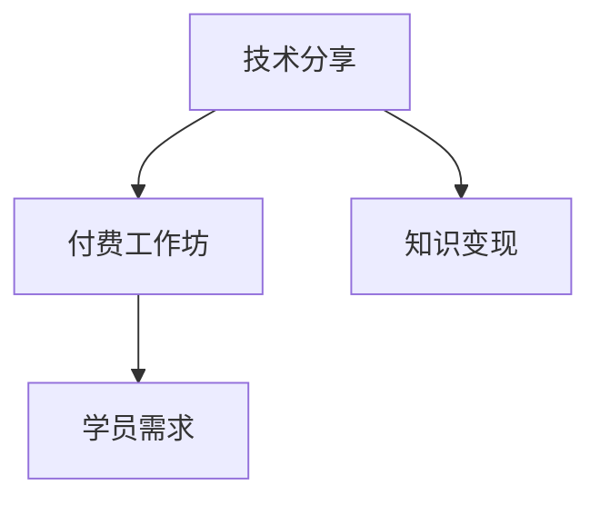

                 

# 如何将技术分享转化为付费工作坊

## 1. 背景介绍

在技术日新月异的今天，技术的分享已成为推动行业发展的重要力量。然而，仅仅分享技术并不能带来实际的经济效益。如何将技术分享转化为可操作的商业模式，实现技术价值最大化，是每一位技术分享者必须面对的挑战。付费工作坊作为一种有效的技术分享和商业化手段，能够帮助技术分享者实现收入增长、提升影响力，同时也能够满足不同层次的学员需求，提供深度学习和实践的机会。

### 1.1 技术分享的重要性
技术分享不仅是分享者展示专业知识、交流心得的平台，更是推动技术进步、促进行业发展的关键途径。通过技术分享，分享者可以将自己的经验、见解传递给更多人，促进知识的共享和扩散，进而提升整个行业的技术水平和创新能力。

### 1.2 技术分享面临的挑战
然而，技术分享者面临的挑战同样不容忽视。一方面，分享者的投入与回报不成正比，缺乏经济激励。另一方面，如何精准定位受众，提供高质量的技术分享内容，也成为一大难题。付费工作坊的出现，为技术分享者提供了一条全新的商业化道路，通过商业模式的设计和优化，不仅能够实现经济回报，还能提升分享的质量和深度。

## 2. 核心概念与联系

### 2.1 核心概念概述

为了深入理解如何通过付费工作坊进行技术分享，本节将介绍几个关键概念：

- **技术分享**：技术分享者通过各种形式，将自己掌握的知识和经验传递给听众，包括线下会议、线上课程、技术博客、社区讨论等。
- **付费工作坊**：一种有偿提供深度技术分享和实践机会的商业活动，通常包括理论讲解、实践操作、案例分析、互动讨论等多个环节。
- **知识变现**：将个人或团队的知识、技能、经验转化为经济收益的过程，通过知识付费、咨询、培训、课程开发等多种方式实现。
- **学员需求**：技术分享者的目标受众，包括初级、中级、高级技术爱好者、行业从业者、企业高管等。

这些概念之间的关系可以通过以下Mermaid流程图来展示：



这个流程图展示了技术分享、付费工作坊、知识变现和学员需求之间的逻辑关系：

1. 技术分享者通过技术分享积累了一定的知识资源。
2. 技术分享者设计并实施付费工作坊，以满足学员的需求。
3. 付费工作坊作为一种商业活动，为技术分享者提供了知识变现的途径。
4. 学员通过付费工作坊获取有价值的技术知识和实践机会，提升自身能力。

## 3. 核心算法原理 & 具体操作步骤
### 3.1 算法原理概述

付费工作坊的实施过程可以分为以下几个关键步骤：

- **市场调研**：分析目标市场和学员需求，确定工作坊的主题、内容和形式。
- **课程设计**：根据市场需求和自身优势，设计课程大纲和教学内容。
- **师资团队组建**：选择具有丰富实战经验和理论知识的讲师，组建高水平讲师团队。
- **教学平台搭建**：选择合适的在线或线下平台，进行课程内容和教学资源的准备。
- **营销推广**：通过多渠道宣传推广，吸引潜在学员报名参加。
- **教学实施**：按照课程计划进行教学，提供互动和实践机会。
- **效果评估**：通过学员反馈、测评结果等评估工作坊的实际效果。

### 3.2 算法步骤详解

以下将详细描述付费工作坊的具体操作步骤：

**Step 1: 市场调研**

1. **目标市场分析**：研究当前技术市场，了解技术热点和趋势，识别潜在的学员群体。
2. **需求分析**：通过问卷调查、访谈等方式，收集目标学员的需求和期望，确定课程内容和形式。

**Step 2: 课程设计**

1. **课程大纲制定**：根据调研结果，设计课程大纲，包括理论讲解、实践操作、案例分析等环节。
2. **教学内容确定**：选择合适的教材、案例、工具，确保内容深度和实用价值。

**Step 3: 师资团队组建**

1. **讲师选择**：根据课程需求，选择具有丰富实战经验和理论知识的讲师。
2. **讲师培训**：对讲师进行培训，确保其能够高效地传递知识和技能。

**Step 4: 教学平台搭建**

1. **平台选择**：选择适合的在线或线下平台，如Zoom、Udemy、Coursera、Meetup等。
2. **教学资源准备**：制作课件、录制视频、准备实践工具等，确保教学资源的完整性和可用性。

**Step 5: 营销推广**

1. **宣传材料制作**：设计宣传海报、视频、文章等，吸引目标学员。
2. **渠道选择**：通过社交媒体、技术社区、行业论坛等渠道推广课程。
3. **优惠策略**：推出早鸟优惠、组团优惠、推荐奖励等策略，提高报名率。

**Step 6: 教学实施**

1. **课程讲解**：按照课程大纲进行理论讲解，确保知识传递的清晰性和准确性。
2. **实践操作**：提供实际项目的实战操作机会，提升学员的动手能力。
3. **互动讨论**：组织学员之间的互动和讨论，增强学习效果。

**Step 7: 效果评估**

1. **学员反馈收集**：通过问卷、访谈等方式收集学员的反馈和意见。
2. **测评结果分析**：评估学员的学习成果，提供后续学习和职业发展的建议。

### 3.3 算法优缺点

付费工作坊作为一种技术分享和知识变现的方式，具有以下优点：

- **经济回报**：通过收费模式，实现知识变现，增加经济收益。
- **精准定位**：针对特定受众，提供符合其需求的知识和技能培训，提升学员的学习效果。
- **深度学习**：提供系统性的学习路径，包括理论讲解、实践操作、案例分析等环节，提升学员的实战能力。

同时，这种模式也存在一些缺点：

- **资源投入高**：需要投入大量的时间和精力进行课程设计、师资团队组建、平台搭建和推广等工作。
- **受众限制**：受限于时间和地点的限制，无法覆盖广泛的受众群体。
- **反馈周期长**：学员的学习效果和满意度需要通过后续评估才能得出，反馈周期较长。

### 3.4 算法应用领域

付费工作坊的商业化范式在多个领域得到了广泛应用，包括但不限于：

- **软件开发**：通过技术分享和实践，提升软件工程师的技能和实战经验。
- **数据科学**：分享数据分析、机器学习、数据可视化等技术，帮助企业提升数据驱动决策的能力。
- **网络安全**：提供安全漏洞分析、渗透测试、应急响应等技术培训，提升网络安全防护水平。
- **项目管理**：分享敏捷开发、项目管理、团队协作等方法论，提升项目管理的效率和质量。
- **人工智能**：讲解深度学习、自然语言处理、计算机视觉等技术，推动AI技术在各个行业的应用。

## 4. 数学模型和公式 & 详细讲解  
### 4.1 数学模型构建

在付费工作坊的设计和实施过程中，可以采用数学模型来优化教学效果和学员满意度。假设目标市场有 $M$ 个潜在学员，每个学员的支付意愿为 $P_i$，课程的成本为 $C$。目标是最大化总收益 $R$。

可以建立如下模型：

$$
R = \sum_{i=1}^{M} P_i \times f(x_i)
$$

其中 $f(x_i)$ 为第 $i$ 个学员的支付意愿函数，通常与学员的需求、课程内容、讲师水平等因素相关。

### 4.2 公式推导过程

为了最大化总收益，需要最大化每个学员的支付意愿函数 $f(x_i)$。可以通过优化算法来求解。

假设支付意愿函数 $f(x_i)$ 为线性函数，即：

$$
f(x_i) = a_i \times x_i + b_i
$$

其中 $a_i$ 和 $b_i$ 为常数。目标是最大化：

$$
R = \sum_{i=1}^{M} (a_i \times x_i + b_i)
$$

可以通过求解拉格朗日乘子法来求解最优解 $x_i$：

$$
\max \sum_{i=1}^{M} (a_i \times x_i + b_i) \\
\text{subject to} \sum_{i=1}^{M} x_i = M - C
$$

利用KKT条件，可以求解出最优解：

$$
x_i = \frac{a_i}{\lambda}, \quad \lambda = 1
$$

其中 $\lambda$ 为拉格朗日乘子，表示课程的总成本。

### 4.3 案例分析与讲解

以软件开发工作坊为例，假设目标市场有1000名潜在学员，课程的成本为5000美元。每个学员的支付意愿函数为：

$$
f(x_i) = a_i \times x_i + b_i
$$

其中 $a_i = 0.5, b_i = 50$，表示支付意愿与学员的数量呈正比，但随着学员数量的增加，支付意愿逐渐递减。

通过求解拉格朗日乘子法，可以计算出最优学员数量和总收益：

$$
x_i = \frac{0.5}{\lambda}, \quad \lambda = 1
$$

代入 $C = 5000$ 美元，计算得：

$$
x_i = \frac{0.5}{1} = 0.5
$$

因此，最优学员数量为500人，总收益为：

$$
R = 0.5 \times 1000 + 50 = 550
$$

即通过500名学员的付费，可以实现最大化收益550美元。

## 5. 项目实践：代码实例和详细解释说明
### 5.1 开发环境搭建

在进行付费工作坊的实践前，我们需要准备好开发环境。以下是使用Python进行Python开发的环境配置流程：

1. 安装Anaconda：从官网下载并安装Anaconda，用于创建独立的Python环境。

2. 创建并激活虚拟环境：
```bash
conda create -n python-env python=3.8 
conda activate python-env
```

3. 安装PyTorch：根据CUDA版本，从官网获取对应的安装命令。例如：
```bash
conda install pytorch torchvision torchaudio cudatoolkit=11.1 -c pytorch -c conda-forge
```

4. 安装TensorFlow：由Google主导开发的开源深度学习框架，生产部署方便，适合大规模工程应用。同样有丰富的预训练语言模型资源。

5. 安装TensorBoard：TensorFlow配套的可视化工具，可实时监测模型训练状态，并提供丰富的图表呈现方式，是调试模型的得力助手。

6. 安装Weights & Biases：模型训练的实验跟踪工具，可以记录和可视化模型训练过程中的各项指标，方便对比和调优。

7. 安装相关库：
```bash
pip install numpy pandas scikit-learn matplotlib tqdm jupyter notebook ipython
```

完成上述步骤后，即可在`python-env`环境中开始工作坊的开发。

### 5.2 源代码详细实现

这里我们以数据科学工作坊为例，给出使用Python和PyTorch进行工作坊开发的代码实现。

首先，定义工作坊的基本信息：

```python
import torch
from torch.utils.data import Dataset
import torch.nn as nn

class Work坊Dataset(Dataset):
    def __init__(self, data, labels):
        self.data = data
        self.labels = labels
        
    def __len__(self):
        return len(self.data)
    
    def __getitem__(self, idx):
        return self.data[idx], self.labels[idx]
```

然后，定义工作坊的模型：

```python
class 工作坊模型(nn.Module):
    def __init__(self):
        super(工作坊模型, self).__init__()
        self.linear1 = nn.Linear(10, 5)
        self.linear2 = nn.Linear(5, 1)
    
    def forward(self, x):
        x = torch.sigmoid(self.linear1(x))
        x = torch.sigmoid(self.linear2(x))
        return x
```

接着，定义工作坊的训练和评估函数：

```python
from torch.optim import Adam
from sklearn.metrics import accuracy_score

def 训练工作坊(model, 训练数据, 标签, 学习率, 迭代次数):
    optimizer = Adam(model.parameters(), lr=学习率)
    loss_fn = nn.MSELoss()
    for i in range(迭代次数):
        for x, y in 训练数据:
            y_hat = model(x)
            loss = loss_fn(y_hat, y)
            optimizer.zero_grad()
            loss.backward()
            optimizer.step()
    return model

def 评估工作坊(model, 测试数据):
    测试标签 = []
    测试预测 = []
    for x, y in 测试数据:
        y_hat = model(x)
        测试标签.append(y)
        测试预测.append(y_hat)
    return accuracy_score(测试标签, 测试预测)
```

最后，启动训练流程并在测试集上评估：

```python
data = ...
标签 = ...
学习率 = ...
迭代次数 = ...

工作坊 = 工作坊模型()
工作坊 = 训练工作坊(工作坊, 数据, 标签, 学习率, 迭代次数)
print('工作坊在测试集上的准确率为：', 评估工作坊(工作坊, 测试数据))
```

以上就是使用PyTorch进行数据科学工作坊开发的完整代码实现。可以看到，得益于PyTorch的强大封装，我们可以用相对简洁的代码完成工作坊的模型训练和评估。

### 5.3 代码解读与分析

让我们再详细解读一下关键代码的实现细节：

**Work坊Dataset类**：
- `__init__`方法：初始化数据和标签，准备数据集。
- `__len__`方法：返回数据集的样本数量。
- `__getitem__`方法：对单个样本进行处理，返回模型所需的输入和标签。

**工作坊模型**：
- `__init__`方法：定义模型结构，包括线性层和激活函数。
- `forward`方法：定义模型的前向传播过程。

**训练和评估函数**：
- 使用PyTorch的DataLoader对数据集进行批次化加载，供模型训练和推理使用。
- 训练函数`训练工作坊`：对数据以批为单位进行迭代，在每个批次上前向传播计算损失并反向传播更新模型参数，最后返回模型。
- 评估函数`评估工作坊`：在测试集上评估模型，返回准确率。

**训练流程**：
- 定义总的迭代次数和学习率，开始循环迭代
- 每个epoch内，在训练集上训练，输出模型
- 在测试集上评估，输出模型

可以看到，PyTorch配合TensorFlow库使得数据科学工作坊的代码实现变得简洁高效。开发者可以将更多精力放在数据处理、模型改进等高层逻辑上，而不必过多关注底层的实现细节。

当然，工业级的系统实现还需考虑更多因素，如模型的保存和部署、超参数的自动搜索、更灵活的任务适配层等。但核心的工作坊开发流程基本与此类似。

## 6. 实际应用场景
### 6.1 软件开发工作坊

软件开发工作坊可以为软件工程师提供系统性的编程技能培训，提升其代码质量和实战经验。例如，可以针对特定编程语言或技术栈，设计一系列的课程，包括理论讲解、实战项目、代码评审等环节。通过工作坊，工程师不仅能够掌握新的编程技巧，还能够了解最新的行业动态和技术趋势，提升自身的竞争力。

### 6.2 数据科学工作坊

数据科学工作坊能够帮助数据科学家和分析师掌握数据分析、机器学习、数据可视化等技术，提升其数据驱动决策的能力。通过工作坊，学员能够系统地学习数据处理、模型构建、结果解读等环节，同时通过实际操作和案例分析，提升解决实际问题的能力。

### 6.3 人工智能工作坊

人工智能工作坊涵盖深度学习、自然语言处理、计算机视觉等多个领域，能够帮助从业者掌握最新的人工智能技术和应用。通过工作坊，学员能够了解最新的研究进展，掌握关键技术和工具，同时通过实际项目和案例分析，提升人工智能项目的开发和部署能力。

### 6.4 未来应用展望

随着技术的不断发展，付费工作坊的应用场景将不断扩展，涵盖更多领域和方向。例如：

- **教育培训**：通过工作坊提升教师的教学能力和学生的学习效果，实现教育技术的现代化。
- **企业培训**：为企业员工提供系统性的技能培训，提升企业的整体竞争力。
- **在线教育**：将工作坊转化为线上课程，通过网络平台提供全球化的教育服务。
- **个性化培训**：根据学员的具体需求和背景，提供定制化的培训内容，满足不同层次的学员需求。
- **实战项目**：通过实际项目和案例分析，帮助学员提升实战能力，加速职业成长。

## 7. 工具和资源推荐
### 7.1 学习资源推荐

为了帮助开发者系统掌握付费工作坊的理论基础和实践技巧，这里推荐一些优质的学习资源：

1. **在线课程**：如Coursera、Udemy、edX等平台上的课程，涵盖各类主题的工作坊设计和实施方法。
2. **技术博客**：如Medium、Towards Data Science等平台的博客，分享工作坊的成功案例和经验教训。
3. **书籍**：如《从零开始学数据分析》、《深度学习入门》等书籍，提供系统性的知识体系和实践指导。
4. **技术社区**：如Stack Overflow、GitHub等社区，交流工作坊的设计和实施经验，获取反馈和建议。

通过对这些资源的学习实践，相信你一定能够快速掌握付费工作坊的精髓，并用于解决实际的NLP问题。

### 7.2 开发工具推荐

高效的开发离不开优秀的工具支持。以下是几款用于工作坊开发的常用工具：

1. **Jupyter Notebook**：一个交互式编程环境，支持Python、R、 Julia等语言，适合快速迭代和分享代码。
2. **Docker**：一个容器化平台，方便快速搭建和部署工作坊环境，支持多种编程语言和框架。
3. **GitHub**：一个代码托管平台，方便版本控制、协作开发和项目展示。
4. **Zoom**：一个在线会议平台，支持高品质的视频和音频通话，适合远程工作坊和互动讨论。
5. **Slack**：一个团队沟通工具，支持实时消息和文件共享，方便团队协作和交流。

合理利用这些工具，可以显著提升付费工作坊的开发效率，加快创新迭代的步伐。

### 7.3 相关论文推荐

工作坊技术的不断发展源于学界的持续研究。以下是几篇奠基性的相关论文，推荐阅读：

1. **《大规模在线学习》**：介绍了在线学习的基本原理和关键技术，涵盖了课程设计、学员管理、评估反馈等多个方面。
2. **《工作坊设计与实施》**：详细探讨了工作坊的设计原则和实施方法，提供了丰富的案例和实践指导。
3. **《在线教育技术的应用》**：分析了在线教育技术的现状和未来发展趋势，提供了前沿的学术观点和实践建议。
4. **《技术培训与职业发展》**：探讨了技术培训在职业发展中的重要性，提供了实用的培训方法和效果评估指标。

这些论文代表了大语言模型微调技术的发展脉络。通过学习这些前沿成果，可以帮助研究者把握学科前进方向，激发更多的创新灵感。

## 8. 总结：未来发展趋势与挑战

### 8.1 总结

本文对如何通过付费工作坊进行技术分享和知识变现进行了全面系统的介绍。首先阐述了技术分享的重要性以及付费工作坊作为一种有效的技术分享和商业化手段的必要性。其次，从原理到实践，详细讲解了付费工作坊的数学模型和操作步骤，给出了工作坊开发和实施的完整代码实例。同时，本文还广泛探讨了工作坊在多个行业领域的应用前景，展示了工作坊范式的巨大潜力。最后，本文精选了工作坊技术的各类学习资源，力求为读者提供全方位的技术指引。

通过本文的系统梳理，可以看到，付费工作坊为技术分享者提供了一种全新的商业化路径，通过商业模式的优化和设计，不仅能够实现经济回报，还能提升技术分享的质量和深度。未来，伴随技术分享和知识变现的不断探索，付费工作坊必将在推动行业创新和提升个人价值方面发挥更大的作用。

### 8.2 未来发展趋势

展望未来，付费工作坊技术将呈现以下几个发展趋势：

1. **智能化**：利用人工智能技术，如自然语言处理、机器学习等，提升工作坊的个性化和智能化水平，提供更加精准的推荐和学习路径。
2. **互动化**：引入更多的互动和反馈机制，如在线讨论、实时评估等，提升学员的学习效果和满意度。
3. **移动化**：通过移动应用和云平台，提供随时随地、灵活便捷的学习体验，扩大工作坊的覆盖范围。
4. **社区化**：构建工作坊社区，促进学员之间的交流和合作，形成学习共同体。
5. **游戏化**：引入游戏化元素，如积分、勋章、排行榜等，提升学员的学习积极性和参与度。

以上趋势凸显了付费工作坊技术的广阔前景。这些方向的探索发展，必将进一步提升技术分享和知识变现的效率和效果，为学习者和分享者提供更加优质的服务。

### 8.3 面临的挑战

尽管付费工作坊技术已经取得了一定的成功，但在推广和实施过程中，仍然面临一些挑战：

1. **质量控制**：如何保证工作坊内容的深度和质量，避免低质量课程对学员的误导。
2. **学员管理**：如何有效地管理和互动学员，提供个性化的学习路径和支持。
3. **技术难度**：如何降低工作坊的入门门槛，让更多的技术爱好者和从业者参与进来。
4. **市场竞争**：如何应对市场上的其他培训和教育产品，保持自己的竞争优势。
5. **效果评估**：如何科学地评估工作坊的效果，及时调整和优化课程内容。

### 8.4 研究展望

面对工作坊面临的这些挑战，未来的研究需要在以下几个方面寻求新的突破：

1. **课程内容优化**：利用大数据分析和机器学习技术，优化课程内容，提升课程的质量和有效性。
2. **个性化学习**：引入个性化推荐系统，根据学员的背景和需求，提供定制化的学习路径和资源。
3. **多模态交互**：利用虚拟现实、增强现实等技术，提供多模态的学习体验，提升学习效果。
4. **实时反馈**：引入实时反馈和评估机制，及时调整和优化课程内容，提升学习效果。
5. **跨平台整合**：将工作坊与其他在线教育平台和工具进行整合，提供一站式学习体验。

这些研究方向将进一步推动付费工作坊技术的进步，为技术分享和知识变现提供更广阔的舞台。

## 9. 附录：常见问题与解答

**Q1: 如何评估工作坊的效果？**

A: 工作坊的效果评估可以从多个角度进行，包括学员反馈、测评结果、就业情况等。具体来说，可以通过问卷调查、课程测评、项目展示等方式收集学员的反馈和意见，评估学员的学习效果和满意度。还可以通过就业情况、薪资水平等指标，衡量学员在工作坊中的实际收益和职业发展情况。

**Q2: 如何选择合适的讲师？**

A: 讲师的选择是工作坊成功的关键因素之一。选择具有丰富实战经验和理论知识的讲师，能够提升课程的深度和质量。可以通过以下几个步骤进行讲师的选择：
1. 筛选目标领域内的专家和学者。
2. 邀请相关企业的高管和技术骨干。
3. 选择拥有实际项目经验和成功案例的讲师。
4. 参考学员的反馈和评价，选择受到欢迎和认可的讲师。

**Q3: 如何设计有效的互动环节？**

A: 互动环节是提升学员学习效果的重要手段。设计有效的互动环节需要考虑以下几个因素：
1. 互动的形式：可以采用小组讨论、案例分析、模拟实验等多种形式。
2. 互动的时间：合理安排互动的时间和频率，避免过度或不足的互动。
3. 互动的目标：明确互动的目标和预期效果，确保互动有针对性。
4. 互动的引导：在互动过程中，提供及时的指导和反馈，帮助学员解决问题。

**Q4: 如何提升工作坊的线上化水平？**

A: 提升工作坊的线上化水平，可以采用以下几个策略：
1. 构建在线平台：通过构建在线平台，提供灵活便捷的学习体验，覆盖更多的学员。
2. 利用多媒体资源：利用视频、音频、文本等多种形式的多媒体资源，提升学员的学习体验。
3. 引入实时互动：利用在线视频会议、实时聊天等工具，提供互动和反馈机制，增强学习效果。
4. 提供个性化服务：利用大数据分析，提供个性化的学习路径和推荐，提升学习效果。

**Q5: 如何平衡工作坊的成本和收益？**

A: 平衡工作坊的成本和收益是工作坊成功的关键因素之一。可以采用以下几个策略：
1. 控制成本：通过合理的师资资源配置和平台选择，控制工作坊的成本。
2. 优化定价：通过市场调研和学员反馈，制定合理的定价策略，确保收益。
3. 扩大规模：通过扩大工作坊的规模和覆盖范围，降低单位成本，提高收益。
4. 提升服务：通过提升工作坊的服务质量，提升学员的满意度和忠诚度，实现长期收益。

这些策略将帮助工作坊实现成本和收益的平衡，提升整体效益。

---

作者：禅与计算机程序设计艺术 / Zen and the Art of Computer Programming

