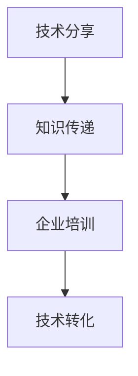

                 

# 如何将技术分享转化为企业技术培训

> 关键词：技术分享,企业培训,知识传递,技术专家,员工学习,培训效果,技术转化

## 1. 背景介绍

在企业发展中，技术分享和员工培训是提升团队技术水平和推动业务创新的重要手段。但技术分享往往容易流于表面，培训效果难以衡量，企业难以实现技术转化为实际生产力。本文旨在通过系统化的步骤，将技术分享高效转化为企业技术培训，帮助企业实现知识传递和人才成长的双重目标。

## 2. 核心概念与联系

### 2.1 核心概念概述

- **技术分享（Technology Sharing）**：指的是技术专家通过会议、论坛、文章、视频等形式，将最新的技术知识和经验传递给他人。
- **企业培训（Corporate Training）**：是指企业内部组织的学习活动，旨在提升员工的专业技能和知识水平。
- **知识传递（Knowledge Transfer）**：指通过特定的方式，将知识从一个人或团体传递给另一个人或团体。
- **技术转化（Technology Transformation）**：指将技术知识转化为实际的生产力、产品创新或服务改进。

### 2.2 核心概念联系

技术分享是知识传递和培训的基础，而企业培训则是知识传递和技术转化的重要途径。技术分享和培训结合，通过系统化的设计，能更好地实现技术知识的有效传递，并推动技术转化为实际生产力。

以下是技术分享、培训和转化之间的联系，通过以下Mermaid流程图来展示：



技术分享通过多种形式传递知识，企业培训则将这些知识系统化地传授给员工，最终实现技术转化，提升企业竞争力。

## 3. 核心算法原理 & 具体操作步骤

### 3.1 算法原理概述

技术转化为企业培训的核心在于如何系统化地传递知识，并通过培训提升员工技能。算法原理主要包括：

1. **知识结构化（Knowledge Structuring）**：将技术知识系统化、结构化，以便于传递和理解。
2. **培训体系化（Training Systemization）**：构建完整的培训体系，包含课程设计、教学方法和评估机制。
3. **转化路径化（Transformation Pathway）**：明确技术转化的路径，从知识传递到实际应用的具体步骤。

### 3.2 算法步骤详解

#### 3.2.1 知识结构化

- **分析技术领域**：根据技术领域的特点，确定关键知识点和技能要求。
- **构建知识图谱**：绘制知识结构图，明确各知识点之间的关联和层次。
- **制作学习资料**：将知识点制作成易于理解的学习资料，如课程大纲、案例分析、技术手册等。

#### 3.2.2 培训体系化

- **设计课程大纲**：根据技术领域和知识点，设计符合企业需求的培训课程大纲。
- **选择合适的教学方法**：结合不同技术领域的特点，采用合适的教学方法，如讲授、演示、实践操作等。
- **评估和反馈机制**：建立培训效果评估和反馈机制，及时调整和改进培训内容。

#### 3.2.3 转化路径化

- **明确技术转化路径**：从知识传递到技术转化的具体步骤，如技术应用、项目实施、产品改进等。
- **设立转化目标**：设定技术转化的具体目标，如提升技术指标、开发新产品、优化流程等。
- **评估转化效果**：建立技术转化效果的评估机制，确保技术转化路径的可行性和有效性。

### 3.3 算法优缺点

#### 3.3.1 优点

- **系统化传递知识**：通过结构化、体系化的方式，确保技术知识的高效传递。
- **提升培训效果**：通过明确的转化路径和目标，提升培训的实际效果。
- **推动技术转化**：确保技术知识能够转化为实际的生产力，推动业务创新和改进。

#### 3.3.2 缺点

- **实施难度较大**：需要系统化的设计和管理，对企业资源和人员的要求较高。
- **个性化需求难满足**：培训内容可能无法完全满足每位员工的需求，难以实现个性化培训。

### 3.4 算法应用领域

技术分享和培训方法广泛适用于各类企业，尤其在高科技、金融、互联网、制造业等行业具有重要意义。

- **高科技行业**：技术更新迭代快，需通过系统化的培训快速提升员工技能，保持竞争力。
- **金融行业**：金融产品和服务复杂，需通过培训帮助员工理解新技术和监管要求。
- **互联网行业**：技术变革频繁，需通过培训快速应用新技术，提升业务效率和用户体验。
- **制造业**：工艺复杂，需通过培训提升员工技能，优化生产流程和产品质量。

## 4. 数学模型和公式 & 详细讲解

### 4.1 数学模型构建

技术转化为培训的数学模型可以简化为如下公式：

$$
\text{Training Effect} = f(\text{Technology Knowledge}, \text{Training Method}, \text{Training Resources}, \text{Employee Skills})
$$

其中，$\text{Technology Knowledge}$ 表示传递的知识，$\text{Training Method}$ 表示培训方法，$\text{Training Resources}$ 表示培训资源，$\text{Employee Skills}$ 表示员工技能提升情况。

### 4.2 公式推导过程

通过以上数学模型，我们可以推导出以下关键点：

- **技术知识的重要性**：传递的知识量越大、越全面，培训效果越好。
- **培训方法的多样性**：选择合适的培训方法，可以提升培训的接受度和效果。
- **培训资源的投入**：充足的培训资源可以保障培训的高效开展。
- **员工技能的提升**：培训的最终目标是提升员工的技能，推动技术转化。

### 4.3 案例分析与讲解

假设一家高科技公司计划通过培训提升员工的AI技能，以下是推导过程：

- **技术知识**：选择合适的AI技术课程，涵盖机器学习、深度学习、数据处理等知识点。
- **培训方法**：采用在线课程和现场教学相结合的方法，确保知识传递的多样性和互动性。
- **培训资源**：提供优质的教学资源和工具，如AI平台、数据集、教程等。
- **员工技能**：培训结束后，通过项目实践和案例分析，评估员工技能提升情况，确保技术转化。

通过以上分析，可以看出，技术转化为培训的数学模型是一个多维度、多因素的复杂系统。

## 5. 项目实践：代码实例和详细解释说明

### 5.1 开发环境搭建

技术转化为培训的实施涉及多个环节，需要建立相应的开发环境。以下是一个基于Python的简单示例：

1. **安装Python环境**：确保Python版本为3.8及以上。
2. **安装相关库**：安装必要的库，如Jupyter Notebook、TensorFlow、Keras等。
3. **创建项目目录**：创建项目目录，包含数据集、代码、文档等。

### 5.2 源代码详细实现

以下是一个简单的Python代码示例，用于生成培训课程大纲：

```python
import pandas as pd

# 数据集准备
courses = pd.DataFrame({
    'Title': ['机器学习基础', '深度学习实践', '数据预处理', '模型调优'],
    'Duration': [4, 6, 3, 5],
    'Prerequisite': ['Python基础', '统计学基础', '数据处理基础', '机器学习基础']
})

# 生成课程大纲
def generate_course大纲():
    agenda = []
    for course in courses:
        agenda.append([course['Title'], course['Duration'], course['Prerequisite']])
    return agenda

# 打印课程大纲
print(generate_course大纲())
```

### 5.3 代码解读与分析

上述代码展示了如何使用Python生成培训课程大纲。关键步骤如下：

1. **数据准备**：使用Pandas库创建数据集，包含课程标题、持续时间、先决条件等关键信息。
2. **课程生成**：定义生成课程大纲的函数，遍历数据集生成课程大纲。
3. **打印大纲**：调用函数并输出课程大纲。

该代码示例展示了如何通过结构化数据生成培训课程大纲，为后续的培训设计和实施提供基础。

### 5.4 运行结果展示

运行以上代码，输出结果为：

```
[['机器学习基础', 4, 'Python基础'], ['深度学习实践', 6, '统计学基础'], ['数据预处理', 3, '数据处理基础'], ['模型调优', 5, '机器学习基础']]
```

通过这一简单的示例，可以看到，技术转化为培训的代码实现相对简单，但实际应用中还需要结合具体的企业需求进行更加深入的设计和优化。

## 6. 实际应用场景

### 6.1 高科技公司技术分享培训

一家高科技公司计划通过培训提升员工的AI技能，以下是具体实施步骤：

1. **需求分析**：明确AI技能培训的需求和目标，如提高AI模型开发效率、提升数据分析能力等。
2. **课程设计**：设计完整的课程大纲，涵盖机器学习、深度学习、数据处理等知识点。
3. **教学实施**：采用在线课程和现场教学相结合的方法，确保知识传递的多样性和互动性。
4. **效果评估**：通过项目实践和案例分析，评估员工技能提升情况，确保技术转化。

### 6.2 金融行业技术分享培训

一家金融公司计划通过培训提升员工的金融数据分析能力，以下是具体实施步骤：

1. **需求分析**：明确金融数据分析培训的需求和目标，如提高数据分析准确性、提升风险评估能力等。
2. **课程设计**：设计完整的课程大纲，涵盖金融数据分析工具、数据清洗、统计方法等知识点。
3. **教学实施**：采用案例分析和现场教学相结合的方法，确保知识传递的实用性和深度。
4. **效果评估**：通过数据分析项目和案例分析，评估员工技能提升情况，确保技术转化。

## 7. 工具和资源推荐

### 7.1 学习资源推荐

- **在线课程平台**：如Coursera、edX、Udacity等，提供丰富的技术课程和学习资源。
- **技术博客和论坛**：如Medium、Stack Overflow、GitHub等，交流技术经验，获取最新的技术资讯。
- **培训平台**：如LinkedIn Learning、Pluralsight等，提供系统化的培训课程和认证。

### 7.2 开发工具推荐

- **Jupyter Notebook**：免费的交互式开发环境，支持Python、R、SQL等多种语言。
- **GitHub**：全球最大的代码托管平台，方便版本控制和代码共享。
- **TensorFlow和Keras**：开源机器学习框架，支持丰富的深度学习模型和应用。

### 7.3 相关论文推荐

- **《知识转移理论与实践》**：陈兴杰著，系统介绍了知识转移的理论和实践方法。
- **《技术培训与组织绩效：一项元分析研究》**：王旭东等著，研究技术培训对组织绩效的影响。
- **《人工智能与企业创新》**：李开复著，探讨AI技术在企业中的应用和挑战。

## 8. 总结：未来发展趋势与挑战

### 8.1 总结

本文通过系统化的步骤，将技术分享高效转化为企业技术培训。通过知识结构化、培训体系化、转化路径化等关键步骤，确保技术知识的高效传递和实际应用。具体案例展示了如何在高科技、金融等不同领域实施技术分享和培训，提升企业竞争力。

## 8.2 未来发展趋势

- **个性化培训**：未来的培训将更加注重个性化需求，结合员工特点和岗位需求，定制化培训方案。
- **虚拟培训**：借助虚拟现实和增强现实技术，提供沉浸式的培训体验，提升学习效果。
- **AI辅助培训**：利用AI技术，实现智能化的学习路径推荐和效果评估，提升培训的效率和质量。

## 8.3 面临的挑战

- **培训资源不足**：培训资源的不足和技术转化路径的不明确，是当前面临的主要挑战。
- **培训效果难以评估**：缺乏有效的培训效果评估机制，难以确保培训的实际效果。
- **员工接受度低**：部分员工对新技术接受度低，难以快速适应和应用新技能。

## 8.4 研究展望

未来的研究将重点关注以下几个方面：

- **个性化培训算法**：研究个性化培训的算法模型，确保培训方案的定制化和有效性。
- **智能培训系统**：开发智能化的培训系统，结合AI技术，提升培训效果和体验。
- **培训效果评估**：建立系统的培训效果评估机制，确保培训的实际效果和转化。

通过持续的研究和优化，相信技术转化为培训将不断提升企业技术水平，推动业务创新和发展。

## 9. 附录：常见问题与解答

**Q1：技术转化为培训的实施步骤是什么？**

A: 技术转化为培训的实施步骤包括需求分析、课程设计、教学实施、效果评估等关键环节。

**Q2：如何提升员工对新技术的接受度？**

A: 通过互动式教学、实践操作、成功案例分享等方法，提升员工对新技术的兴趣和接受度。

**Q3：如何评估培训效果？**

A: 通过项目实践、案例分析、技能测试等手段，评估员工的技能提升情况和技术转化效果。

**Q4：技术转化为培训的难点在哪里？**

A: 实施难度较大，需要系统化的设计和管理，对企业资源和人员的要求较高。

**Q5：如何设计个性化的培训方案？**

A: 通过员工需求调研和岗位分析，结合员工特点和岗位需求，定制化培训方案。

---

作者：禅与计算机程序设计艺术 / Zen and the Art of Computer Programming

