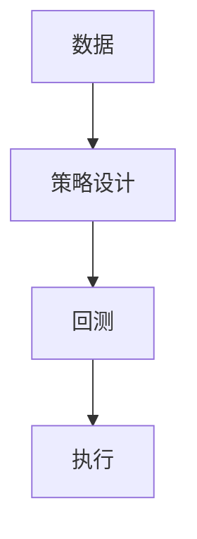

                 

# 如何将编程技能应用于量化交易

## 1. 背景介绍

量化交易（Quantitative Trading），即使用数学模型和算法自动化地进行交易决策的过程。它融合了金融理论、统计学、计算机科学等多领域的知识，是现代金融市场的重要组成部分。随着计算能力和数据获取能力的不断提升，量化交易已逐步从早期的专业金融领域扩展到普通投资者的交易策略中。

量化交易的实践依赖于两方面的技能：一是金融和数学领域的理论知识；二是编程和数据分析技能。本文旨在探讨如何将编程技能应用于量化交易，重点介绍量化交易中的数据处理、模型构建、回测与部署等关键环节，并给出实用的代码实例和分析。

## 2. 核心概念与联系

### 2.1 核心概念概述

量化交易的核心概念包括：

- **策略（Strategy）**：量化交易的核心是设计一个能够稳定盈利的交易策略。策略可以是基于统计模型、机器学习模型、深度学习模型等。
- **数据（Data）**：量化交易策略的训练和验证依赖于大量的历史数据。包括股票价格、成交量、财务指标、经济指标等。
- **回测（Backtesting）**：将策略应用于历史数据进行验证，以评估策略的实际表现。
- **执行（Execution）**：将策略部署到实际交易平台，进行实时交易。

### 2.2 核心概念原理和架构的 Mermaid 流程图



这个图展示了量化交易的基本流程：数据驱动策略设计，策略在回测中验证，最终部署执行。

## 3. 核心算法原理 & 具体操作步骤

### 3.1 算法原理概述

量化交易的算法原理主要围绕两个关键点：数据挖掘和模型构建。

**数据挖掘**：利用统计学和机器学习技术从历史数据中提取有意义的特征，这些特征可以是技术指标（如均值、方差、移动平均线等）、基本面指标（如市盈率、市净率等）、情绪指标（如交易量、新闻情绪等）等。

**模型构建**：构建策略的数学模型，模型可以是线性回归、决策树、随机森林、支持向量机等传统统计模型，也可以是神经网络、深度学习模型等高级模型。

### 3.2 算法步骤详解

量化交易的主要步骤包括：

1. **数据收集**：从股票交易所、新闻网站、社交媒体等渠道收集历史数据和实时数据。
2. **数据清洗**：对数据进行去重、缺失值填补、异常值处理等操作。
3. **特征工程**：设计有意义的特征，如移动平均线、相对强弱指数（RSI）等。
4. **模型构建**：选择合适的模型并构建训练集、验证集、测试集。
5. **回测**：使用历史数据对模型进行回测，评估模型的表现。
6. **优化**：根据回测结果优化模型参数，提升模型性能。
7. **部署**：将优化的模型部署到交易平台进行实时交易。

### 3.3 算法优缺点

量化交易的优势包括：

- **客观性**：模型根据历史数据和规则进行决策，避免了人为情绪的影响。
- **高频交易**：模型可以实时处理大量交易数据，进行高频交易。
- **可量化**：策略的参数和性能可以量化分析，便于优化。

缺点包括：

- **模型过拟合**：模型在历史数据上表现良好，但在新数据上可能表现不佳。
- **市场波动**：市场波动可能会影响模型的表现。
- **数据质量**：数据质量对模型效果有直接影响。

### 3.4 算法应用领域

量化交易的应用领域包括但不限于股票交易、期货交易、外汇交易、加密货币交易等。

## 4. 数学模型和公式 & 详细讲解 & 举例说明

### 4.1 数学模型构建

量化交易的数学模型一般包括：

- **线性回归模型**：用于预测股票价格，公式为 $y = \beta_0 + \beta_1 x_1 + \ldots + \beta_n x_n + \epsilon$，其中 $y$ 为预测值，$x_i$ 为特征，$\beta_i$ 为系数，$\epsilon$ 为误差项。
- **支持向量机（SVM）**：用于分类，公式为 $f(x) = w \cdot x + b$，其中 $x$ 为特征向量，$w$ 为权重向量，$b$ 为偏置项。
- **神经网络**：用于预测和分类，采用反向传播算法进行训练。

### 4.2 公式推导过程

以线性回归模型为例，推导其最小二乘法求解公式。

假设训练集为 $(x_i, y_i)$，其中 $x_i$ 为特征向量，$y_i$ 为标签，模型为 $y = \beta_0 + \beta_1 x_1 + \ldots + \beta_n x_n + \epsilon$。

最小二乘法求解 $\beta_i$ 的过程如下：

$$
\min_{\beta_i} \sum_{i=1}^N (y_i - (\beta_0 + \beta_1 x_{i1} + \ldots + \beta_n x_{in}))^2
$$

对每个系数求偏导数，得：

$$
\frac{\partial}{\partial \beta_i} \sum_{i=1}^N (y_i - (\beta_0 + \beta_1 x_{i1} + \ldots + \beta_n x_{in}))^2 = 0
$$

整理后得：

$$
\beta_i = \frac{\sum_{i=1}^N (x_{i1} x_{i2} \ldots x_{in} y_i)}{\sum_{i=1}^N (x_{i1}^2 x_{i2}^2 \ldots x_{in}^2)}
$$

### 4.3 案例分析与讲解

以预测股票价格为例，构建一个简单的线性回归模型：

```python
from sklearn.linear_model import LinearRegression
from sklearn.metrics import mean_squared_error
from sklearn.datasets import make_regression

# 生成模拟数据
X, y = make_regression(n_samples=1000, n_features=1, n_informative=1, noise=0.1, random_state=42)

# 创建线性回归模型
model = LinearRegression()

# 训练模型
model.fit(X, y)

# 预测并评估模型
y_pred = model.predict(X)
mse = mean_squared_error(y, y_pred)
print(f"Mean Squared Error: {mse}")
```

以上代码展示了如何使用sklearn库中的LinearRegression模型进行线性回归预测。实际应用中，需要根据具体的交易策略和数据特征选择合适的模型。

## 5. 项目实践：代码实例和详细解释说明

### 5.1 开发环境搭建

量化交易的开发环境搭建通常包括：

- **Python环境**：Python是量化交易的主要编程语言，需要使用Anaconda等工具搭建虚拟环境。
- **数据源配置**：配置各种数据源，如Yahoo Finance、Alpha Vantage等。
- **回测平台**：选择合适的回测平台，如Backtrader、Zipline等。
- **交易平台API**：配置交易平台API，如Interactive Brokers、Binance等。

### 5.2 源代码详细实现

以下是一个简单的量化交易策略代码示例，使用线性回归模型预测股票价格：

```python
import yfinance as yf
from sklearn.linear_model import LinearRegression
from sklearn.metrics import mean_squared_error
from sklearn.datasets import make_regression
import pandas as pd

# 获取历史数据
ticker = yf.Ticker('AAPL')
data = ticker.history(period='5d', start='2021-01-01', end='2021-06-30')

# 构建训练集
train_data = data[['Open', 'High', 'Low', 'Close']].shift(periods=-1).dropna()
X_train = train_data.drop('Close', axis=1)
y_train = train_data['Close']

# 构建测试集
test_data = data[['Open', 'High', 'Low', 'Close']]
X_test = test_data.drop('Close', axis=1)
y_test = test_data['Close']

# 构建线性回归模型
model = LinearRegression()

# 训练模型
model.fit(X_train, y_train)

# 预测并评估模型
y_pred = model.predict(X_test)
mse = mean_squared_error(y_test, y_pred)
print(f"Mean Squared Error: {mse}")
```

### 5.3 代码解读与分析

以上代码展示了量化交易的基本流程：

1. **数据获取**：使用yfinance库获取AAPL股票的历史数据。
2. **数据预处理**：构建训练集和测试集，并对数据进行去重、异常值处理等操作。
3. **模型训练**：使用线性回归模型进行训练。
4. **模型评估**：计算模型在测试集上的均方误差。

## 6. 实际应用场景

### 6.1 股票交易

量化交易在股票交易中的应用非常广泛，策略可以包括动量策略、均值回归策略、套利策略等。策略的性能评估可以通过回测来进行。

### 6.2 期货交易

期货交易具有高杠杆、高频交易的特点，适合量化交易策略的快速部署和调整。策略可以包括趋势跟踪、波动率套利等。

### 6.3 外汇交易

外汇市场的流动性大、波动性强，适合量化交易策略的高频交易。策略可以包括动量策略、对冲策略等。

### 6.4 加密货币交易

加密货币市场波动剧烈，量化交易可以应用于套利、趋势跟踪等策略。

## 7. 工具和资源推荐

### 7.1 学习资源推荐

- **《量化交易策略实战》**：一本经典的量化交易书籍，介绍了多种量化交易策略和模型。
- **Coursera**：提供多个量化交易相关的课程，包括金融工程、数据科学等。
- **Kaggle**：数据科学竞赛平台，提供大量量化交易数据集和竞赛。

### 7.2 开发工具推荐

- **Python**：量化交易的主要编程语言，支持丰富的科学计算库和金融库。
- **Jupyter Notebook**：交互式编程环境，方便数据探索和模型调试。
- **Pandas**：数据分析库，支持大规模数据处理。
- **NumPy**：科学计算库，支持高效数组计算。
- **Scikit-Learn**：机器学习库，支持多种统计模型和机器学习模型。

### 7.3 相关论文推荐

- **《从统计套利到算法交易》**：介绍量化交易的统计套利和算法交易方法。
- **《高频金融市场中的交易算法》**：探讨高频交易算法的实现和优化。
- **《基于深度学习的金融时间序列预测》**：讨论深度学习在金融时间序列预测中的应用。

## 8. 总结：未来发展趋势与挑战

### 8.1 未来发展趋势

量化交易的未来发展趋势包括：

- **人工智能和深度学习**：越来越多的量化交易策略采用深度学习模型，提升策略的预测能力和适应性。
- **高频交易和算法执行**：高频交易和算法执行技术的优化，使得量化交易策略能够更快速地部署和调整。
- **多资产和跨市场交易**：量化交易策略的跨市场和多资产优化，提升投资组合的性能和风险管理能力。

### 8.2 面临的挑战

量化交易面临的挑战包括：

- **数据质量**：数据质量对量化交易策略的性能有直接影响，需要确保数据来源可靠、数据处理规范。
- **模型过拟合**：模型在历史数据上表现良好，但在新数据上可能表现不佳，需要采用正则化等技术避免过拟合。
- **市场波动**：市场波动可能会影响模型的表现，需要构建鲁棒性强的模型。

### 8.3 研究展望

未来研究的方向包括：

- **混合模型**：结合统计模型和深度学习模型，提升模型的预测能力和泛化能力。
- **实时数据处理**：实时数据处理技术的优化，提升策略的实时响应能力。
- **多市场和跨市场交易**：多市场和跨市场交易策略的优化，提升投资组合的性能和风险管理能力。

## 9. 附录：常见问题与解答

### 9.1 常见问题解答

**Q1: 量化交易中的策略是如何构建的？**

A: 量化交易策略的构建通常包括以下步骤：

1. **特征选择**：选择有意义的特征，如技术指标、基本面指标等。
2. **模型选择**：选择合适的模型，如线性回归、支持向量机、神经网络等。
3. **模型训练**：使用历史数据训练模型，调整模型参数。
4. **策略验证**：使用回测数据验证策略效果。

**Q2: 量化交易中如何避免过拟合？**

A: 量化交易中避免过拟合的方法包括：

1. **正则化**：使用L1、L2正则化等方法，避免模型过拟合。
2. **交叉验证**：使用交叉验证方法，评估模型在不同数据集上的表现。
3. **模型集成**：使用模型集成方法，如bagging、boosting等，提升模型的泛化能力。

**Q3: 量化交易中如何选择交易策略？**

A: 选择交易策略需要综合考虑以下几点：

1. **策略性能**：评估策略在历史数据上的表现。
2. **风险控制**：评估策略的风险水平和稳定性。
3. **成本收益**：评估策略的成本和收益，确保策略在实际交易中的可行性和有效性。

**Q4: 量化交易中如何进行模型优化？**

A: 量化交易中的模型优化通常包括以下方法：

1. **参数调整**：调整模型的参数，提升模型的性能。
2. **特征工程**：优化特征选择和提取，提升模型的泛化能力。
3. **回测优化**：通过回测数据评估模型的性能，并不断优化模型。

---

作者：禅与计算机程序设计艺术 / Zen and the Art of Computer Programming

