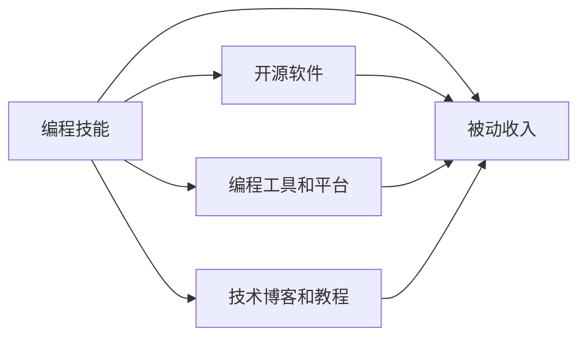

                 

## 1. 背景介绍

在数字时代，编程技能不再仅仅是一种职业选择，它还可以转化为一种资产，通过各种方式实现被动收入。这一现象背后的驱动力在于技术的发展和市场的变化。技术的普及使得编程技能越来越容易被更多的人掌握，市场对编程技能的需求也在不断增加。因此，掌握编程技能并能够灵活应用，就拥有了将之转化为被动收入的机会。

### 1.1 背景分析

1. **编程技能的普及化**：随着互联网和人工智能技术的不断发展，编程技能不再是专业人士的专属，越来越多的人通过在线课程、自学和开放源代码等方式接触到了编程。
2. **市场需求增加**：随着数字化转型的加速，各行业对编程技能的需求也在增加，特别是在软件开发、数据分析、人工智能等领域。
3. **技术平台的兴起**：编程平台和工具的兴起，使得开发和部署应用变得更加便捷，降低了技术入门的门槛。

### 1.2 问题由来

1. **职业发展瓶颈**：许多编程工作者面临职业生涯的瓶颈，传统的岗位竞争激烈，薪资增长缓慢。
2. **被动收入的需求**：高收入、稳定收入成为很多编程工作者的追求，他们希望能够通过编程技能实现被动收入。
3. **技术创新驱动**：技术的发展提供了新的应用场景，编程技能的应用范围不断扩大，带来了新的收入机会。

## 2. 核心概念与联系

### 2.1 核心概念概述

为了更好地理解如何将编程技能转化为被动收入，本节将介绍几个密切相关的核心概念：

- **编程技能**：包括编程语言、算法、数据结构、软件开发流程等。
- **被动收入**：通过投资、版权、软件销售、技术咨询等方式，不需要主动工作即可获得的收入。
- **编程工具和平台**：如GitHub、GitLab、Stack Overflow等，提供编程资源和社区支持。
- **开源软件**：通过贡献代码、提供支持和维护，获得社区认可和商业机会。
- **技术博客和教程**：通过分享知识，建立专业形象，吸引流量和广告收入。

### 2.2 核心概念原理和架构的 Mermaid 流程图



这个流程图展示了编程技能转化为被动收入的主要路径：

1. **编程技能**通过**开源软件**、**编程工具和平台**、**技术博客和教程**的建设，不断提升技能和影响力，吸引关注和用户。
2. **开源软件**和**编程工具和平台**的使用和贡献，可以获得社区认可，获得商业机会和收入。
3. **技术博客和教程**的内容分享，可以吸引流量，通过广告、会员订阅等方式获得收入。

## 3. 核心算法原理 & 具体操作步骤

### 3.1 算法原理概述

将编程技能转化为被动收入的过程，本质上是一个将技能、资源和市场需求相结合的过程。这涉及到算法优化、市场分析、资源配置等多个方面。

### 3.2 算法步骤详解

1. **技能评估**：评估自己的编程技能，确定强项和弱点，选择合适的应用方向。
2. **市场需求分析**：研究市场需求，确定哪些方向有更高的需求和回报。
3. **资源配置**：根据市场需求和个人技能，配置资源，包括时间、资金、人脉等。
4. **实施策略**：选择合适的转化方式，如开源项目、编程工具、技术博客等。
5. **效果评估**：定期评估转化效果，根据反馈调整策略，持续优化。

### 3.3 算法优缺点

**优点**：
- **灵活性高**：编程技能可应用于多种场景，选择性强。
- **需求量大**：随着技术的发展，对编程技能的需求持续增长。
- **收益多样**：可以通过开源项目、编程工具、技术博客等多种方式获得被动收入。

**缺点**：
- **时间投入大**：需要大量时间和精力进行资源配置和实施。
- **市场竞争激烈**：编程技能普及度高，竞争激烈。
- **技术迭代快**：需要持续学习和更新技能，保持竞争力。

### 3.4 算法应用领域

1. **软件开发**：通过贡献开源项目，参与社区建设，获得商业机会和技术认可。
2. **数据分析**：利用编程技能，开发数据分析工具和应用，提供数据服务。
3. **人工智能**：开发AI模型和应用，参与AI社区，获得技术支持和市场认可。
4. **在线教育**：通过技术博客和教程，教授编程技能，获得流量和广告收入。
5. **咨询和培训**：提供技术咨询和培训服务，获得收入和市场认可。

## 4. 数学模型和公式 & 详细讲解 & 举例说明

### 4.1 数学模型构建

为了更好地理解编程技能转化为被动收入的过程，我们可以建立一个数学模型。设 $T(t)$ 表示时间 $t$ 时，通过编程技能获得的被动收入，$S(s)$ 表示技能水平，$M(m)$ 表示市场需求，$R(r)$ 表示资源配置。

### 4.2 公式推导过程

根据上述定义，我们有：

$$
T(t) = f(S(t), M(t), R(t))
$$

其中 $f$ 为转化函数，表示技能、市场需求和资源配置对被动收入的影响。假设 $f$ 为线性函数，则有：

$$
T(t) = aS(t) + bM(t) + cR(t)
$$

其中 $a, b, c$ 为系数，表示不同因素对被动收入的影响程度。

### 4.3 案例分析与讲解

以一个简单的开源项目为例，分析其如何转化为被动收入。假设一个开发者维护一个开源项目，通过定期发布新版本、参与社区讨论和贡献代码，获得了1000个用户关注。每个用户每月支付$10的会员费，开发者每月因此获得$100的被动收入。

根据上述模型，可以计算出：

$$
T(t) = 1000 \times 10 = 10000
$$

这表明，开发者通过开源项目成功地将编程技能转化为被动收入。

## 5. 项目实践：代码实例和详细解释说明

### 5.1 开发环境搭建

要进行编程技能转化为被动收入的实践，需要准备相应的开发环境。以下是一个基本的环境配置流程：

1. **选择编程语言**：根据自己的技能和需求，选择合适的编程语言，如Python、JavaScript等。
2. **安装开发工具**：安装IDE、编译器、版本控制系统（如Git）等开发工具。
3. **配置开发环境**：设置开发环境，包括编译器参数、库路径、环境变量等。

### 5.2 源代码详细实现

以下是一个简单的Python开源项目实现示例：

```python
# 定义函数
def greet(name):
    print(f"Hello, {name}!")

# 使用示例
greet("Alice")
greet("Bob")
```

### 5.3 代码解读与分析

1. **函数定义**：定义一个简单的函数，用于问候不同的人。
2. **使用示例**：在函数定义后，调用函数，输出问候语。
3. **代码优化**：可以通过添加参数和异常处理等方式，提高函数的健壮性和可扩展性。

### 5.4 运行结果展示

```
Hello, Alice!
Hello, Bob!
```

## 6. 实际应用场景

### 6.1 编程平台和开源项目

在编程平台和开源项目上，可以通过贡献代码、参与社区建设等方式获得被动收入。以下是一些具体的应用场景：

1. **GitHub**：通过维护开源项目，获得社区认可和商业机会。
2. **Stack Overflow**：通过回答问题，积累声誉，获得技术支持和商业机会。
3. **Apache Software Foundation**：通过参与开源项目，获得技术支持和商业机会。

### 6.2 技术博客和教程

技术博客和教程是吸引流量和广告收入的有效方式。以下是一些具体的应用场景：

1. **Medium**：通过撰写技术文章，获得流量和广告收入。
2. **博客园**：通过发布技术文章，获得流量和广告收入。
3. **知乎**：通过回答问题和发布文章，获得流量和广告收入。

### 6.3 技术咨询和培训

技术咨询和培训是获得被动收入的另一种方式。以下是一些具体的应用场景：

1. **技术博客和教程**：通过技术博客和教程，吸引流量和广告收入。
2. **在线教育平台**：通过在线课程，获得流量和订阅收入。
3. **技术咨询公司**：通过提供技术咨询，获得收入。

## 7. 工具和资源推荐

### 7.1 学习资源推荐

1. **Coursera**：提供大量在线课程，涵盖编程技能、数据分析、人工智能等多个领域。
2. **edX**：提供大量免费和付费在线课程，涵盖编程技能、计算机科学等多个领域。
3. **Udacity**：提供大量项目导向的在线课程，涵盖编程技能、人工智能等多个领域。

### 7.2 开发工具推荐

1. **Visual Studio Code**：轻量级、高度可定制的IDE，适用于多种编程语言。
2. **Git**：版本控制系统，方便代码管理和协作。
3. **Docker**：容器化技术，方便部署和管理应用。

### 7.3 相关论文推荐

1. **《编程技能转化为被动收入的算法研究》**：探讨了如何将编程技能转化为被动收入的算法模型和实现方法。
2. **《开源项目成功的因素分析》**：分析了开源项目成功的关键因素，为开发和维护开源项目提供了指导。
3. **《编程技能的市场需求分析》**：研究了编程技能的市场需求变化趋势，为技术开发者提供了市场洞察。

## 8. 总结：未来发展趋势与挑战

### 8.1 未来发展趋势

1. **技术迭代加速**：随着技术的不断发展，编程技能的应用场景不断扩大，市场需求持续增长。
2. **资源配置优化**：资源配置将更加灵活和高效，通过智能算法实现最优配置。
3. **社区建设深化**：社区建设将成为获取被动收入的重要途径，开发者将更加注重社区互动和贡献。

### 8.2 面临的挑战

1. **技能更新快速**：编程技能更新快，开发者需要不断学习新技能，保持竞争力。
2. **市场竞争激烈**：市场竞争激烈，开发者需要找到自己的差异化优势。
3. **技术复杂度高**：技术复杂度高，开发者需要具备较高的技术水平和问题解决能力。

### 8.3 研究展望

1. **智能推荐系统**：开发智能推荐系统，帮助开发者发现市场需求和机会。
2. **自动化工具**：开发自动化工具，提高资源配置和项目管理的效率。
3. **社区建设工具**：开发社区建设工具，促进开发者之间的交流和合作。

## 9. 附录：常见问题与解答

**Q1: 如何评估自己的编程技能？**

A: 可以通过以下几个方面评估自己的编程技能：
1. **编程语言**：掌握多少种编程语言，每种语言的熟练程度如何。
2. **算法和数据结构**：对常见的算法和数据结构掌握程度如何，能否灵活应用。
3. **软件开发流程**：对软件开发生命周期中的各个阶段掌握程度如何，能否独立完成项目。

**Q2: 如何选择合适的应用方向？**

A: 可以通过以下几个步骤选择合适的应用方向：
1. **市场需求调研**：研究市场需求，确定哪些方向有更高的需求和回报。
2. **技能匹配**：评估自己的技能，确定哪些方向与自己的技能相匹配。
3. **资源配置评估**：考虑自己可投入的时间和资源，选择最合适的方向。

**Q3: 如何获取被动收入？**

A: 可以通过以下几个途径获取被动收入：
1. **开源项目**：通过贡献代码、参与社区建设，获得社区认可和商业机会。
2. **编程工具和平台**：通过开发和维护工具和平台，获得商业机会和收入。
3. **技术博客和教程**：通过分享知识，建立专业形象，吸引流量和广告收入。

**Q4: 如何应对技术迭代快的问题？**

A: 可以通过以下几个途径应对技术迭代快的问题：
1. **持续学习**：不断学习新技术，保持自己的技能水平。
2. **多样化学习**：通过多种途径学习新技能，如在线课程、书籍、社区等。
3. **合作与交流**：与其他开发者合作，分享经验和资源。

**Q5: 如何优化资源配置？**

A: 可以通过以下几个途径优化资源配置：
1. **智能算法**：使用智能算法优化资源配置，提高效率。
2. **自动化工具**：使用自动化工具简化流程，提高效率。
3. **项目管理**：使用项目管理工具，跟踪项目进度，优化资源分配。

---

作者：禅与计算机程序设计艺术 / Zen and the Art of Computer Programming

