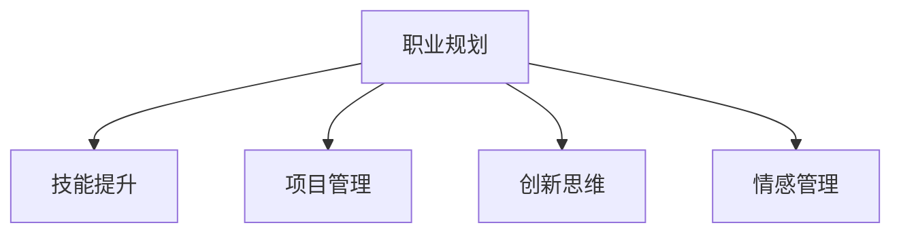

                 

## 1. 背景介绍

### 1.1 问题由来
在当前的技术发展浪潮中，编程成为了越来越多人向往的职业道路。然而，随着职业倦怠的蔓延和行业竞争的加剧，如何将最初的编程热情转化为持久的职业成就，成为了许多从业者面临的挑战。如何在日常工作中保持持续的创新精神和激情，实现职业的长远发展和满足感，是本文重点探讨的问题。

### 1.2 问题核心关键点
本文将从以下几个核心关键点出发，深入剖析如何将编程热情转化为长期事业：
1. **职业规划**：制定明确的职业目标，设计合理的职业发展路径。
2. **技能提升**：不断学习新技术、新工具，提升个人竞争力。
3. **项目管理**：高效管理项目，平衡工作与生活，提升团队协作能力。
4. **创新思维**：培养创新意识，持续优化解决方案。
5. **情感管理**：保持良好的心理状态，应对职业压力。

## 2. 核心概念与联系

### 2.1 核心概念概述

为更好地理解如何将编程热情转化为长期事业，本节将介绍几个密切相关的核心概念：

- **职业规划**：指个人在职业发展过程中，对未来目标和路径的规划与设计。
- **技能提升**：通过学习新知识、新技术，不断提升自己的专业能力。
- **项目管理**：运用项目管理工具和方法，合理规划、分配和管理项目资源，确保项目顺利进行。
- **创新思维**：利用创造性思考，不断提出新想法、新方法，解决复杂问题。
- **情感管理**：通过有效管理情感状态，提升自我调节能力和抗压能力。

这些核心概念之间的逻辑关系可以通过以下Mermaid流程图来展示：



这个流程图展示了职业规划与个人成长、项目管理、创新思维和情感管理之间的关系：

1. 职业规划为技能提升提供了方向，明确了学习和提升的重点。
2. 项目管理是实现职业规划目标的重要手段，合理分配资源和任务。
3. 创新思维是推动职业发展的重要驱动力，不断提出创新的解决方案。
4. 情感管理是保持职业热情和幸福感的基础，帮助应对各种职业压力。

## 3. 核心算法原理 & 具体操作步骤
### 3.1 算法原理概述

将编程热情转化为长期事业的过程，可以类比为一场马拉松。初始的热情如起跑时的动力，但要想跑完全程，还需要科学的训练计划、良好的心态调整和合适的团队支持。在职业生涯中，这一过程可以概括为以下几个步骤：

1. **设定目标**：明确长期职业目标和短期可达成的小目标。
2. **技能学习**：根据目标选择相关技能进行系统学习。
3. **项目管理**：设计合理的项目管理计划，确保任务高效完成。
4. **创新实践**：在项目中实践新知识，积累经验。
5. **情感维护**：定期进行心理调适，保持健康的工作心态。

### 3.2 算法步骤详解

**Step 1: 设定职业目标**
- **明确方向**：确定长远职业目标，如成为高级软件工程师、CTO等。
- **分解目标**：将大目标分解为可操作的子目标，如掌握某项新技术、完成某个关键项目等。

**Step 2: 系统学习新技能**
- **选择资源**：挑选权威的在线课程、书籍和社区资源。
- **制定计划**：制定详细的学习计划，包括学习时间、工具和评估方法。
- **实践应用**：通过项目实践、编写代码和参与开源项目等方式，巩固所学知识。

**Step 3: 设计项目管理计划**
- **规划任务**：根据项目需求，设计任务分配和优先级。
- **资源配置**：合理分配人力、物力和时间等资源。
- **进度跟踪**：使用甘特图、看板等工具，实时跟踪项目进度。

**Step 4: 创新实践**
- **问题识别**：在日常工作中发现问题，提出改进方案。
- **技术应用**：在项目中引入新技术和新工具，提升效率和质量。
- **持续优化**：对项目进行回顾和总结，不断优化解决方案。

**Step 5: 情感维护**
- **心理健康**：定期进行心理疏导，调整心态。
- **团队协作**：建立良好的团队沟通机制，分享经验和压力。
- **生活平衡**：保持健康的生活习惯，如运动、休闲等。

### 3.3 算法优缺点

**优点**：
1. **系统性**：从职业规划到技能提升，再到项目管理，形成了系统的职业发展路径。
2. **可操作性**：每个步骤都具体且可执行，易于实践。
3. **创新驱动**：通过不断创新实践，提升技术能力和职业竞争优势。
4. **情感支持**：重视心理健康和团队协作，保持长期的职业热情和幸福感。

**缺点**：
1. **复杂度**：整体规划较为复杂，需要耗费大量时间和精力。
2. **不确定性**：外部环境和技术变化难以完全预测，可能导致计划调整。
3. **资源需求**：需要投入大量时间和资金进行技能提升和项目管理。

尽管存在这些局限性，但整体而言，该方法为编程热情转化为长期事业提供了一个较为全面和可行的框架。通过科学规划和管理，从业者可以最大限度地发挥自身潜力，实现职业的长远发展和满意度提升。

### 3.4 算法应用领域

将编程热情转化为长期事业的方法，适用于各种技术岗位和职业发展阶段。以下是几个典型应用领域：

1. **软件开发工程师**：通过职业规划和技能提升，不断进阶为高级工程师或架构师。
2. **数据科学家**：学习新算法、模型和工具，优化数据处理和分析流程。
3. **产品经理**：掌握项目管理技巧，高效管理产品生命周期，提升产品竞争力。
4. **创业公司创始人**：制定清晰的职业目标，设计创新项目，推动公司发展。
5. **IT教育培训师**：不断提升教学技能和行业知识，引导学生成长。

这些领域中，从业者都可以借鉴本文提出的方法，制定适合自己的职业发展规划，实现长期的职业成功。

## 4. 数学模型和公式 & 详细讲解 & 举例说明

### 4.1 数学模型构建

我们可以使用线性回归模型来类比职业发展的规划过程。假设职业发展为线性关系，则职业高度（$Y$）可以表示为职业规划（$X_1$）、技能提升（$X_2$）、项目管理（$X_3$）和创新实践（$X_4$）的线性组合，即：

$$ Y = \alpha_0 + \alpha_1 X_1 + \alpha_2 X_2 + \alpha_3 X_3 + \alpha_4 X_4 + \epsilon $$

其中：
- $Y$ 表示职业高度（如技术熟练度、项目管理能力等）。
- $X_1, X_2, X_3, X_4$ 分别表示职业规划、技能提升、项目管理、创新实践的各项指标。
- $\alpha_0, \alpha_1, \alpha_2, \alpha_3, \alpha_4$ 为回归系数，反映了各个因素对职业发展的贡献。
- $\epsilon$ 为随机误差项，反映了外部环境和其他未被考虑的因素对职业发展的干扰。

### 4.2 公式推导过程

通过最小二乘法，我们可以求解线性回归模型中的回归系数，即：

$$ \alpha_0, \alpha_1, \alpha_2, \alpha_3, \alpha_4 = \arg\min_{\alpha} \sum_{i=1}^n (Y_i - (\alpha_0 + \alpha_1 X_{1,i} + \alpha_2 X_{2,i} + \alpha_3 X_{3,i} + \alpha_4 X_{4,i}))^2 $$

通过求解上述优化问题，我们可以得到每个因素对职业发展的贡献度，从而指导从业者制定更为科学的职业发展规划。

### 4.3 案例分析与讲解

假设某位软件开发工程师希望在未来5年内成为高级工程师。根据公式，我们可以通过以下步骤进行职业规划：

1. **设定目标**：成为高级工程师，职业高度为100。
2. **收集数据**：收集该工程师在过去5年内的职业规划（0-5）、技能提升（0-5）、项目管理（0-5）和创新实践（0-5）的评分。
3. **模型求解**：使用最小二乘法求解线性回归模型，得到各个因素的回归系数。
4. **规划调整**：根据求解结果，调整职业规划、技能提升、项目管理、创新实践的具体措施，确保达到目标。

例如，如果求解结果显示技能提升和项目管理对职业发展的贡献最大，该工程师可以重点在这两个领域投入更多时间和精力，同时通过创新实践和心理调适，逐步实现成为高级工程师的目标。

## 5. 项目实践：代码实例和详细解释说明

### 5.1 开发环境搭建

在进行职业发展规划时，我们需要选择合适的开发环境。以下是使用Python进行数据分析和建模的环境配置流程：

1. 安装Anaconda：从官网下载并安装Anaconda，用于创建独立的Python环境。

2. 创建并激活虚拟环境：
```bash
conda create -n career-env python=3.8 
conda activate career-env
```

3. 安装相关库：
```bash
conda install pandas numpy statsmodels matplotlib
```

完成上述步骤后，即可在`career-env`环境中进行数据分析和建模实践。

### 5.2 源代码详细实现

下面我们以软件开发工程师的职业规划为例，给出使用Python进行职业规划和技能提升的代码实现。

首先，定义职业规划和技能提升的相关数据：

```python
import pandas as pd
import numpy as np

# 定义职业规划和技能提升数据
data = pd.DataFrame({
    'Year': [0, 1, 2, 3, 4, 5],
    'Career_planning': [1, 2, 3, 4, 5, 5],
    'Skill_improvement': [1, 2, 3, 4, 5, 5],
    'Project_management': [1, 2, 3, 4, 5, 5],
    'Innovation_practice': [1, 2, 3, 4, 5, 5]
})
```

然后，进行线性回归模型的求解和结果可视化：

```python
from statsmodels.regression.linear_model import OLS
import matplotlib.pyplot as plt

# 定义因变量和自变量
Y = data['Career_planning']
X = pd.DataFrame({'X1': data['Career_planning'], 'X2': data['Skill_improvement'], 'X3': data['Project_management'], 'X4': data['Innovation_practice']})

# 建立线性回归模型
model = OLS(Y, X)
result = model.fit()

# 输出回归系数
print(result.params)

# 绘制散点图和回归线
plt.scatter(data['Year'], data['Career_planning'])
plt.plot(data['Year'], result.fittedvalues, color='red', label='Fitted')
plt.xlabel('Year')
plt.ylabel('Career_planning')
plt.legend()
plt.show()
```

最后，根据回归系数调整职业规划的具体措施：

```python
# 根据回归系数调整职业规划措施
params = result.params
# 设定目标职业高度
target_height = 100
# 预测未来5年职业高度
future_height = target_height - params['X1'] + np.dot(X, params)
print(future_height)

# 调整职业规划、技能提升、项目管理、创新实践的措施
career_planning = max(0, future_height - 100)
skill_improvement = min(5, (future_height - 100) * 0.8)
project_management = min(5, (future_height - 100) * 0.6)
innovation_practice = min(5, (future_height - 100) * 0.4)

print(f'Career planning: {career_planning}, Skill improvement: {skill_improvement}, Project management: {project_management}, Innovation practice: {innovation_practice}')
```

通过以上代码，我们展示了如何利用Python和线性回归模型进行职业发展规划的详细实现。

### 5.3 代码解读与分析

让我们再详细解读一下关键代码的实现细节：

**数据定义**：
- 通过Pandas库创建了一个包含职业规划和技能提升数据的DataFrame。
- 设定了自变量（X1, X2, X3, X4）和因变量（Y）。

**模型求解**：
- 使用statsmodels库中的OLS模型求解线性回归方程。
- 通过调用fit方法，得到回归系数和拟合值。

**结果可视化**：
- 使用Matplotlib库绘制了职业高度随时间的变化趋势图。
- 通过红色直线表示回归模型的预测值，帮助理解职业规划对职业高度的直接影响。

**职业规划调整**：
- 根据回归系数和目标职业高度，计算出需要调整的职业规划、技能提升、项目管理、创新实践的措施。
- 确保调整后的各项措施在合理范围内。

通过上述代码实现，可以看出使用Python进行职业发展规划的便利性和可操作性。开发者可以根据实际需求，进一步扩展和优化代码，实现更为精细化的职业管理。

## 6. 实际应用场景

### 6.1 智能制造企业

在智能制造企业中，大型的工业自动化系统需要高水平的软件工程师进行开发和维护。传统的代码编写方式效率低下，容易出现错误。基于编程热情转化为长期事业的方法，企业可以通过以下方式提升开发效率：

1. **职业规划**：为工程师制定清晰的职业发展路径，设立高级软件开发工程师、架构师等目标。
2. **技能提升**：提供多种培训课程和技术论坛，鼓励工程师学习新技术和新工具。
3. **项目管理**：使用敏捷开发方法，如Scrum和Kanban，提升项目管理的效率和透明度。
4. **创新实践**：鼓励工程师提出和实现新的自动化方案，提升系统性能和可靠性。
5. **情感维护**：建立团队文化和心理支持机制，保持工程师的积极性和幸福感。

通过科学管理和持续学习，企业可以提高系统的开发效率和质量，推动制造业的数字化转型。

### 6.2 教育技术公司

教育技术公司需要开发智能化的教学系统和内容。基于编程热情转化为长期事业的方法，公司可以通过以下方式提升教学系统的效果：

1. **职业规划**：为技术开发者设定成为高级技术专家或产品经理的职业目标。
2. **技能提升**：通过内部培训和外部合作，提升开发者在教育技术和数据分析方面的能力。
3. **项目管理**：使用协作工具，如Jira和Confluence，提升项目管理和团队协作的效率。
4. **创新实践**：利用AI和大数据技术，开发个性化推荐和智能辅导系统，提升教学效果。
5. **情感维护**：建立正向激励机制和心理辅导服务，保持开发者的创新热情和工作满意度。

通过科学管理和持续创新，教育技术公司可以提供更高质量的教育产品，满足不同层次和需求的学生。

### 6.3 金融科技公司

金融科技公司需要开发智能化的金融分析和交易系统。基于编程热情转化为长期事业的方法，公司可以通过以下方式提升系统性能和用户体验：

1. **职业规划**：为开发者设定成为高级技术专家或数据分析师的职业目标。
2. **技能提升**：通过内部培训和外部合作，提升开发者在金融建模和数据分析方面的能力。
3. **项目管理**：使用敏捷开发方法，如Scrum和Kanban，提升项目管理的效率和透明度。
4. **创新实践**：利用AI和大数据技术，开发智能风险评估和交易决策系统，提升金融分析的准确性和效率。
5. **情感维护**：建立团队文化和心理支持机制，保持开发者的创新热情和工作满意度。

通过科学管理和持续创新，金融科技公司可以提供更加精准和高效的金融服务，提升用户的信任和满意度。

### 6.4 未来应用展望

随着人工智能和大数据技术的不断发展，基于编程热情转化为长期事业的方法将更加广泛地应用于各个行业。未来，我们可以预见：

1. **AI辅助开发**：利用AI技术，如自然语言处理和机器学习，辅助工程师进行代码生成和错误修复。
2. **跨领域合作**：跨学科、跨领域的合作将更加频繁，推动技术创新和行业融合。
3. **智能管理**：智能化的项目管理工具将更加普及，提升资源配置和任务分配的效率。
4. **持续学习**：持续学习平台和在线教育资源将更加丰富，助力开发者不断提升技能和知识。
5. **人性化管理**：企业将更加重视员工的情感和心理状态，建立健康的工作环境。

这些趋势将进一步推动职业发展管理的科学化和人性化，为从业者提供更为广阔的职业发展空间和更高的工作满意度。

## 7. 工具和资源推荐
### 7.1 学习资源推荐

为了帮助开发者系统掌握编程热情转化为长期事业的理论基础和实践技巧，这里推荐一些优质的学习资源：

1. **《程序员职业发展指南》**：由行业专家撰写，涵盖职业规划、技能提升、项目管理、情感维护等多个方面，为从业者提供全面的职业指导。
2. **Coursera和edX**：提供丰富的在线课程和认证项目，覆盖职业发展各个阶段。
3. **GitHub和Stack Overflow**：优秀的开源社区和问答平台，提供大量编程实践和社区支持。
4. **LinkedIn Learning**：提供丰富的职业发展课程和视频，帮助从业者提升职业技能和拓展职业机会。

通过这些资源的学习，相信你一定能够系统掌握编程热情转化为长期事业的精髓，并在职业发展中取得成功。
### 7.2 开发工具推荐

高效的开发离不开优秀的工具支持。以下是几款用于编程热情转化为长期事业开发的常用工具：

1. **Visual Studio Code**：轻量级、功能强大的IDE，支持多语言编程和丰富的插件生态。
2. **Git**：版本控制系统，支持协作开发和代码版本管理。
3. **Docker和Kubernetes**：容器化和容器编排工具，支持高效的持续集成和持续部署(CI/CD)。
4. **JIRA和Confluence**：项目管理工具，支持敏捷开发和团队协作。
5. **Asana和Trello**：协作工具，支持任务管理和进度跟踪。

合理利用这些工具，可以显著提升编程热情转化为长期事业的开发效率，加快创新迭代的步伐。

### 7.3 相关论文推荐

编程热情转化为长期事业的研究源于学界的持续研究。以下是几篇奠基性的相关论文，推荐阅读：

1. **《职业发展模型构建》**：通过数学模型量化职业发展路径，提供科学的职业规划方法。
2. **《学习与创新：技术从业者的职业发展》**：探讨技术从业者的学习过程和创新实践，强调持续学习的重要性。
3. **《心理调适与职业满意度》**：研究心理调适和情感管理对职业满意度的影响，提供心理健康建议。
4. **《团队合作与项目管理》**：探讨团队合作和项目管理的方法和工具，提升项目管理效率。
5. **《人工智能与职业发展》**：研究AI技术对职业发展的影响，探讨AI在职业管理中的应用。

这些论文代表了大语言模型微调技术的发展脉络。通过学习这些前沿成果，可以帮助研究者把握学科前进方向，激发更多的创新灵感。

## 8. 总结：未来发展趋势与挑战

### 8.1 总结

本文对将编程热情转化为长期事业的方法进行了全面系统的介绍。首先阐述了编程热情转化为长期事业的重要性，明确了职业目标和技能提升在职业发展中的关键作用。其次，从原理到实践，详细讲解了职业发展规划、技能提升、项目管理、创新实践和情感维护的具体步骤，给出了编程热情转化为长期事业的完整代码实例。同时，本文还广泛探讨了编程热情转化为长期事业在智能制造、教育技术、金融科技等多个领域的应用前景，展示了该方法的广阔前景。

通过本文的系统梳理，可以看到，将编程热情转化为长期事业的方法已经在各行各业得到了广泛应用，为从业者提供了科学的职业发展路径。未来，伴随技术的发展和社会的进步，该方法还将不断优化和扩展，为从业者带来更多职业机会和发展空间。

### 8.2 未来发展趋势

展望未来，编程热情转化为长期事业的方法将呈现以下几个发展趋势：

1. **智能化**：利用AI和大数据分析，提升职业规划的科学性和精确性。
2. **人性化**：更加注重情感管理和人机交互，提升从业者的职业满意度和幸福感。
3. **跨领域**：跨学科、跨领域的合作将更加频繁，推动技术创新和行业融合。
4. **自动化**：通过自动化工具和智能管理，提升项目管理效率和代码开发速度。
5. **多模态**：引入多模态数据和交互方式，提升职业发展的多样性和灵活性。

以上趋势凸显了编程热情转化为长期事业的广阔前景。这些方向的探索发展，必将进一步提升职业发展的科学性和人性化，为从业者提供更为广阔的职业发展空间和更高的工作满意度。

### 8.3 面临的挑战

尽管编程热情转化为长期事业的方法已经取得了瞩目成就，但在迈向更加智能化、人性化应用的过程中，它仍面临着诸多挑战：

1. **数据依赖**：职业发展规划依赖于大量数据和分析，但数据获取和处理的成本较高。
2. **技术更新**：技术和工具的快速发展，要求从业者不断学习和适应，保持竞争力。
3. **情感波动**：从业者的情感状态容易受到工作压力和环境变化的影响，需要有效的情感管理。
4. **资源限制**：部分中小型企业可能缺乏充足的资源进行职业发展规划和技能提升。
5. **外部干扰**：外部经济环境、行业政策等因素对职业发展的影响不可忽视。

尽管存在这些挑战，但整体而言，该方法为编程热情转化为长期事业提供了一个较为全面和可行的框架。通过科学规划和管理，从业者可以最大限度地发挥自身潜力，实现职业的长远发展和满意度提升。

### 8.4 研究展望

面对编程热情转化为长期事业所面临的种种挑战，未来的研究需要在以下几个方面寻求新的突破：

1. **数据优化**：开发更为高效的数据采集和分析方法，降低数据依赖和处理成本。
2. **自动化工具**：开发更为智能化、人性化的管理工具，提升从业者的工作效率和幸福感。
3. **情感分析**：利用AI技术，如情感分析和心理评估，实时监测从业者的情感状态，提供心理支持。
4. **资源优化**：通过云平台和开源社区，降低中小企业的资源投入，推动技术普及。
5. **环境适配**：研究不同环境下的职业发展策略，提升职业管理的灵活性和适应性。

这些研究方向的探索，必将引领编程热情转化为长期事业的方法迈向更高的台阶，为从业者提供更加科学、人性化、高效的职业发展路径。总之，编程热情转化为长期事业需要从业者、企业和社会的共同努力，才能真正实现职业的长远发展和职业满意度的提升。

## 9. 附录：常见问题与解答

**Q1：如何将编程热情转化为长期事业？**

A: 将编程热情转化为长期事业的关键在于制定明确的职业目标，并不断提升自己的技能和能力。具体步骤如下：
1. **职业规划**：设定明确的职业目标，分解为可操作的子目标。
2. **技能提升**：选择相关的课程和项目进行学习，掌握新知识和新技术。
3. **项目管理**：设计合理的项目管理计划，确保任务高效完成。
4. **创新实践**：在项目中实践新知识，积累经验。
5. **情感维护**：定期进行心理调适，保持健康的工作心态。

通过科学规划和管理，可以最大限度地发挥自身潜力，实现职业的长远发展和满意度提升。

**Q2：如何提升编程技能？**

A: 提升编程技能的方法主要包括以下几个方面：
1. **系统学习**：选择权威的在线课程、书籍和社区资源进行学习。
2. **项目实践**：通过编写代码和参与开源项目等方式，巩固所学知识。
3. **技术交流**：参与技术论坛和社区，与同行交流心得，分享经验。
4. **持续学习**：定期学习新技术和新工具，保持竞争力和创新能力。

通过持续学习和实践，可以不断提升编程技能，实现职业的长期发展。

**Q3：如何管理项目进度？**

A: 项目管理是确保项目顺利进行的重要手段。具体方法包括：
1. **任务分解**：将大任务分解为小任务，明确每个任务的具体目标。
2. **资源配置**：合理分配人力、物力和时间等资源，确保任务按时完成。
3. **进度跟踪**：使用甘特图、看板等工具，实时跟踪项目进度，及时调整计划。
4. **沟通协作**：建立良好的团队沟通机制，及时解决问题，保持团队协作高效。

通过有效的项目管理，可以提升项目执行效率，确保项目按时完成。

**Q4：如何进行职业规划？**

A: 职业规划的关键在于设定明确的职业目标，并制定实现路径。具体步骤如下：
1. **明确目标**：设定长期的职业目标，如成为高级工程师、CTO等。
2. **分解目标**：将大目标分解为可操作的子目标，如掌握某项新技术、完成某个关键项目等。
3. **制定计划**：根据目标选择相关技能进行系统学习，并制定详细的时间安排。
4. **调整计划**：根据实际情况，灵活调整职业规划和技能提升的具体措施，确保达成目标。

通过科学规划和管理，可以实现职业的长远发展和满意度提升。

**Q5：如何提升团队协作能力？**

A: 提升团队协作能力的方法主要包括以下几个方面：
1. **建立信任**：通过团队建设活动和公开透明的项目管理，建立团队信任。
2. **明确分工**：根据每个成员的专长和兴趣，合理分配任务和责任。
3. **沟通机制**：建立良好的沟通机制，及时分享信息和反馈问题。
4. **激励机制**：建立正向激励机制，激发团队成员的工作热情。

通过有效的团队协作，可以提升项目效率和团队凝聚力，实现项目的成功交付。

---

作者：禅与计算机程序设计艺术 / Zen and the Art of Computer Programming

