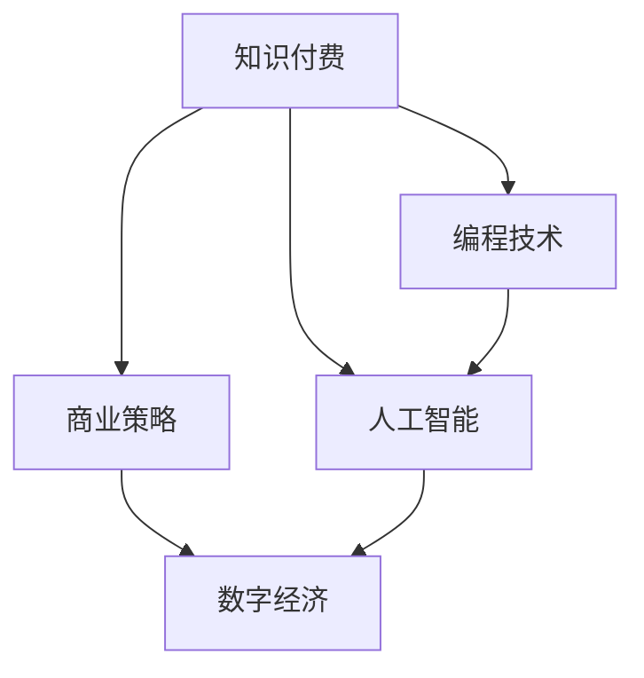

                 

# 如何打造个人知识付费商业帝国

> 关键词：个人知识付费, 知识变现, 人工智能, 编程技术, 商业策略, 数字经济

## 1. 背景介绍

在数字化时代，知识不再是旧时代那种轻而易举的公开资源，而是成为一种稀缺的资产。如何利用这种稀缺性，将个人拥有的知识、技术、经验转化为有价值的商业帝国，是我们这一代人的重要课题。

从表面上看，知识付费是一种商业模式，但其背后的驱动力是知识的稀缺性和技术的进步。随着互联网的普及，知识获取变得更加容易，但也正因为此，高质知识资源变得更加稀缺。人们愿意为获取这些稀缺资源付出代价，这就为知识付费提供了市场。

然而，市场竞争激烈，要想在知识付费领域脱颖而出，并打造出个人商业帝国，不仅需要高质量的知识产品，还需要具备系统的商业策略和高效的技术手段。本文将通过技术层面和商业层面的结合，探讨如何打造个人知识付费商业帝国。

## 2. 核心概念与联系

### 2.1 核心概念概述

- **知识付费**：通过在线课程、电子书、咨询、直播等形式，为消费者提供价值，从而实现变现的过程。
- **人工智能**：利用机器学习、深度学习等技术，为知识付费产品提供智能推荐、内容生成、数据分析等功能。
- **编程技术**：包括网站开发、API调用、数据分析、用户体验优化等技术手段，是实现知识付费商业帝国的关键。
- **商业策略**：如何定价、如何推广、如何制定内容策略等，是知识付费商业模式成功的保障。
- **数字经济**：基于互联网和数据驱动的经济模式，为知识付费提供了广阔的市场和发展空间。

这些核心概念之间的联系可以用以下Mermaid流程图展示：



这个流程图展示了知识付费与人工智能、编程技术、商业策略和数字经济之间的联系。知识付费的实现依赖于人工智能提供的数据驱动推荐，编程技术提供高效的技术支撑，商业策略保障产品盈利，而数字经济则为知识付费提供了市场和用户基础。

## 3. 核心算法原理 & 具体操作步骤

### 3.1 算法原理概述

知识付费的核心在于内容的质量和个性化推荐，而个性化推荐的背后是大量的用户数据和算法模型。本文将介绍几种常用的个性化推荐算法，并分析其原理和操作步骤。

- **协同过滤算法**：基于用户历史行为数据进行推荐，适用于用户间存在相似性的情况。
- **基于内容的推荐算法**：根据物品属性相似性进行推荐，适用于物品间属性稳定的情况。
- **深度学习推荐算法**：利用神经网络模型进行推荐，可以处理非结构化数据，适用于复杂推荐场景。

### 3.2 算法步骤详解

#### 3.2.1 协同过滤算法

**操作步骤**：
1. 收集用户行为数据（如浏览、购买、评分等）。
2. 构建用户-物品共现矩阵。
3. 计算用户间的相似度。
4. 为未评级物品找到最相似用户，根据该用户历史评级结果推荐物品。

**具体步骤**：
1. 将用户和物品分别进行编码，构建共现矩阵。
2. 使用余弦相似度计算用户之间的相似度。
3. 对于未评级物品，找到与之相似用户，根据该用户历史评分结果推荐物品。

**示例**：
```python
from surprise import Dataset, Reader, KNNBasic
from surprise.model_selection import train_test_split

reader = Reader(rating_scale=(1, 5))
data = Dataset.load_from_file('ratings.csv', reader=reader)

trainset, testset = train_test_split(data, test_size=0.25)

algo = KNNBasic(sim_options={'name': 'cosine', 'user_based': False})
algo.fit(trainset)
predictions = algo.test(testset)

# 对预测结果进行评估，比如计算RMSE
```

#### 3.2.2 基于内容的推荐算法

**操作步骤**：
1. 收集物品属性数据。
2. 对物品属性进行编码，构建物品特征向量。
3. 计算物品之间的相似度。
4. 为未评级物品找到最相似物品，根据该物品属性推荐。

**具体步骤**：
1. 使用TF-IDF等方法对物品属性进行编码。
2. 使用余弦相似度计算物品之间的相似度。
3. 对于未评级物品，找到与之相似物品，根据该物品属性推荐。

**示例**：
```python
from sklearn.feature_extraction.text import TfidfVectorizer
from sklearn.metrics.pairwise import cosine_similarity

# 假设有一本书的描述
book_description = 'This is a book about artificial intelligence.'

# 使用TF-IDF对描述进行编码
vectorizer = TfidfVectorizer()
tfidf = vectorizer.fit_transform([book_description])

# 假设另一本书的描述
book2_description = 'This is a book about machine learning.'

# 对另一本书的描述进行编码
tfidf2 = vectorizer.transform([book2_description])

# 计算相似度
cos_sim = cosine_similarity(tfidf, tfidf2)

# 假设还有另一本书的描述
book3_description = 'This is a book about natural language processing.'

# 对另一本书的描述进行编码
tfidf3 = vectorizer.transform([book3_description])

# 计算相似度
cos_sim2 = cosine_similarity(tfidf, tfidf3)
```

#### 3.2.3 深度学习推荐算法

**操作步骤**：
1. 收集用户和物品数据。
2. 构建数据集。
3. 使用神经网络模型进行训练和预测。

**具体步骤**：
1. 将用户和物品编码，构建输入数据。
2. 设计神经网络模型，包含输入层、隐藏层和输出层。
3. 使用反向传播算法进行模型训练。
4. 使用训练好的模型进行预测。

**示例**：
```python
import tensorflow as tf
from tensorflow.keras.layers import Input, Embedding, Flatten, Dense
from tensorflow.keras.models import Model

# 假设用户和物品分别编码为[1, 2, 3, 4]和[5, 6, 7, 8]
user_input = Input(shape=(4,), name='user')
item_input = Input(shape=(4,), name='item')

# 使用嵌入层进行编码
user_embed = Embedding(4, 8)(user_input)
item_embed = Embedding(4, 8)(item_input)

# 将嵌入层结果展平
user_embed = Flatten()(user_embed)
item_embed = Flatten()(item_embed)

# 构建神经网络模型
x = tf.keras.layers.concatenate([user_embed, item_embed])
x = Dense(64, activation='relu')(x)
output = Dense(1, activation='sigmoid')(x)

model = Model(inputs=[user_input, item_input], outputs=output)

# 编译模型
model.compile(optimizer='adam', loss='binary_crossentropy')

# 训练模型
model.fit([train_data], train_labels, epochs=10)

# 预测
predictions = model.predict([test_data])
```

### 3.3 算法优缺点

#### 3.3.1 协同过滤算法

**优点**：
- 简单易懂，实现容易。
- 适用于用户间存在相似性的情况。

**缺点**：
- 对新物品的推荐效果差，需要较长时间积累用户数据。
- 对数据稀疏性的敏感度高。

#### 3.3.2 基于内容的推荐算法

**优点**：
- 物品属性稳定的推荐效果较好。
- 对新物品推荐效果好。

**缺点**：
- 需要对物品属性进行编码，实现较为复杂。
- 物品属性之间存在一定冗余，推荐效果可能受到影响。

#### 3.3.3 深度学习推荐算法

**优点**：
- 可以处理非结构化数据，推荐效果较好。
- 对新物品推荐效果好。

**缺点**：
- 实现复杂，需要大量数据进行训练。
- 对硬件资源要求较高，训练和推理耗时较长。

### 3.4 算法应用领域

知识付费领域应用推荐算法可以实现个性化推荐，提升用户体验，增加用户粘性，从而实现更高的用户转化率和收益。推荐算法可以应用于以下场景：

- 课程推荐：根据用户历史行为和课程特征，推荐用户感兴趣的课程。
- 教材推荐：根据用户需求和学习进度，推荐适合的教材。
- 直播推荐：根据用户历史行为和主播特征，推荐适合的直播课程。
- 学习路径规划：根据用户当前水平和学习目标，推荐学习路径。

## 4. 数学模型和公式 & 详细讲解 & 举例说明

### 4.1 数学模型构建

在知识付费领域，推荐算法主要应用于用户与课程、教材、直播等内容之间的推荐。本文将以课程推荐为例，介绍推荐算法的数学模型。

假设用户为$U$，课程为$I$，用户对课程的评分矩阵为$R_{ui}$，$R_{ui}=1$表示用户$u$对课程$i$评分了，$R_{ui}=0$表示用户$u$没有对课程$i$评分。我们的目标是通过评分矩阵$R$预测用户$u$对课程$i$的评分。

设课程$i$的特征向量为$\mathbf{x}_i$，用户$u$的特征向量为$\mathbf{y}_u$，评分函数为$f$，则预测用户$u$对课程$i$的评分为$f(\mathbf{x}_i, \mathbf{y}_u)$。

我们的目标函数为：
$$
\min_{f} \sum_{i=1}^m \sum_{u=1}^n (R_{ui} - f(\mathbf{x}_i, \mathbf{y}_u))^2
$$

其中$m$和$n$分别为课程数和用户数。

### 4.2 公式推导过程

**协同过滤算法**：
设用户$u$和用户$v$的评分向量分别为$\mathbf{r}_u$和$\mathbf{r}_v$，物品$i$和物品$j$的评分向量分别为$\mathbf{r}_i$和$\mathbf{r}_j$。设$\mathbf{A} \in \mathbb{R}^{n \times m}$为评分矩阵。协同过滤算法的基本思想是找到与用户$u$最相似的用户$v$，计算$v$对物品$j$的评分$\hat{r}_{uj}$，用$\hat{r}_{uj}$预测$u$对$j$的评分。

协同过滤算法常用的相似度度量方式包括余弦相似度、皮尔逊相关系数等。余弦相似度的计算公式为：
$$
\cos(\mathbf{u}, \mathbf{v}) = \frac{\mathbf{u}^T \mathbf{v}}{\|\mathbf{u}\| \|\mathbf{v}\|}
$$

基于协同过滤算法的推荐公式为：
$$
\hat{r}_{uj} = \frac{\sum_{v \in \mathcal{N}(u)} r_{vj} \cos(\mathbf{r}_u, \mathbf{r}_v)}{\sum_{v \in \mathcal{N}(u)} \cos(\mathbf{r}_u, \mathbf{r}_v)}
$$

其中$\mathcal{N}(u)$为用户$u$最相似的用户集合。

**基于内容的推荐算法**：
设课程$i$的特征向量为$\mathbf{x}_i$，用户$u$的特征向量为$\mathbf{y}_u$，用户$u$对课程$i$的评分为$r_{ui}$，预测评分为$\hat{r}_{ui}$，预测模型为$f$，则预测评分的公式为：
$$
\hat{r}_{ui} = f(\mathbf{x}_i, \mathbf{y}_u)
$$

常用的预测模型包括线性回归模型、逻辑回归模型、决策树模型等。以线性回归模型为例，其公式为：
$$
\hat{r}_{ui} = \mathbf{w}^T \mathbf{x}_i + b
$$

其中$\mathbf{w}$为模型参数，$b$为截距。

### 4.3 案例分析与讲解

**示例1**：协同过滤算法

假设用户$u$和用户$v$的评分矩阵为$R_{ui}$和$R_{vi}$，课程$i$和课程$j$的评分矩阵分别为$R_{ij}$和$R_{kj}$，用户$u$和用户$v$的特征向量分别为$\mathbf{y}_u$和$\mathbf{y}_v$。则协同过滤算法的预测评分为：
$$
\hat{r}_{uj} = \frac{\sum_{v \in \mathcal{N}(u)} R_{vj} \cos(\mathbf{r}_u, \mathbf{r}_v)}{\sum_{v \in \mathcal{N}(u)} \cos(\mathbf{r}_u, \mathbf{r}_v)}
$$

**示例2**：基于内容的推荐算法

假设用户$u$的特征向量为$\mathbf{y}_u$，课程$i$的特征向量为$\mathbf{x}_i$，预测评分为$\hat{r}_{ui}$，线性回归模型参数为$\mathbf{w}$和$b$。则预测评分的公式为：
$$
\hat{r}_{ui} = \mathbf{w}^T \mathbf{x}_i + b
$$

## 5. 项目实践：代码实例和详细解释说明

### 5.1 开发环境搭建

在知识付费项目中，开发环境搭建主要包括以下步骤：

1. 安装Python环境：建议使用Anaconda或Miniconda，搭建Python开发环境。
2. 安装TensorFlow或PyTorch：选择适合的知识付费推荐算法框架，进行安装。
3. 安装Flask：用于搭建Web服务，部署推荐算法。
4. 安装Redis：用于缓存推荐结果，提高系统性能。
5. 安装Elasticsearch：用于存储用户行为数据，支持全文搜索和数据可视化。

### 5.2 源代码详细实现

以下是使用TensorFlow实现基于内容的推荐算法的代码示例：

```python
import tensorflow as tf
from tensorflow.keras.layers import Input, Embedding, Flatten, Dense
from tensorflow.keras.models import Model

# 假设用户和课程分别编码为[1, 2, 3, 4]和[5, 6, 7, 8]
user_input = Input(shape=(4,), name='user')
course_input = Input(shape=(4,), name='course')

# 使用嵌入层进行编码
user_embed = Embedding(4, 8)(user_input)
course_embed = Embedding(4, 8)(course_input)

# 将嵌入层结果展平
user_embed = Flatten()(user_embed)
course_embed = Flatten()(course_embed)

# 构建神经网络模型
x = tf.keras.layers.concatenate([user_embed, course_embed])
x = Dense(64, activation='relu')(x)
output = Dense(1, activation='sigmoid')(x)

model = Model(inputs=[user_input, course_input], outputs=output)

# 编译模型
model.compile(optimizer='adam', loss='binary_crossentropy')

# 训练模型
model.fit([train_data], train_labels, epochs=10)

# 预测
predictions = model.predict([test_data])
```

### 5.3 代码解读与分析

**代码解读**：
1. 使用TensorFlow定义输入层，将用户和课程分别编码为[1, 2, 3, 4]和[5, 6, 7, 8]。
2. 使用嵌入层对用户和课程进行编码，得到4维特征向量。
3. 将特征向量展平，并构建神经网络模型，包含输入层、隐藏层和输出层。
4. 编译模型，使用adam优化器和二元交叉熵损失函数。
5. 训练模型，使用训练数据和标签。
6. 预测用户对课程的评分。

**代码分析**：
1. 输入层的编码方式可以根据具体需求进行设计，这里假设为4维编码。
2. 嵌入层的维度可以根据具体需求进行调整，这里以8维为例。
3. 神经网络模型的隐藏层和输出层可以根据具体需求进行调整，这里以64维和1维为例。
4. 模型的编译和训练过程根据具体需求进行调整，这里以10个epoch为例。
5. 预测评分的公式为模型输出层的值。

## 6. 实际应用场景

### 6.1 智能推荐系统

知识付费领域最核心的应用场景就是智能推荐系统。通过智能推荐系统，用户可以更快地找到适合自己的课程、教材和直播，提高学习效率和用户体验。

智能推荐系统可以分为离线推荐和实时推荐。离线推荐通过离线训练模型，生成推荐结果。实时推荐通过实时收集用户行为数据，更新模型并生成推荐结果。

### 6.2 个性化内容定制

除了推荐系统，知识付费还可以根据用户的学习习惯和需求，提供个性化内容定制服务。比如，可以根据用户的学习进度和兴趣点，推荐适合的教材和学习路径。

个性化内容定制需要收集用户行为数据，并根据数据进行分析。分析结果可以用来设计推荐算法，生成个性化内容。

### 6.3 课程广告推荐

知识付费还可以通过课程广告推荐，增加课程曝光和转化率。通过智能推荐算法，向用户推荐适合的课程广告，增加用户点击和购买概率。

课程广告推荐需要收集用户行为数据，并根据数据进行分析。分析结果可以用来设计推荐算法，生成课程广告。

### 6.4 未来应用展望

随着人工智能技术的发展，知识付费领域的应用场景将会更加广泛。未来的发展趋势包括：

1. 多模态推荐：结合文字、图片、视频等多模态信息，提供更加丰富的推荐内容。
2. 个性化内容生成：使用生成对抗网络（GAN）等技术，生成个性化课程和教材。
3. 跨领域推荐：结合不同领域的知识，提供跨领域的推荐服务。
4. 实时学习推荐：根据用户的实时学习情况，动态调整推荐内容。
5. 智能客服：使用自然语言处理技术，提供智能客服支持。

## 7. 工具和资源推荐

### 7.1 学习资源推荐

为了帮助开发者掌握知识付费领域的技术和应用，以下是一些优质的学习资源：

1. Coursera《机器学习》课程：由斯坦福大学Andrew Ng教授讲授，介绍机器学习基础和推荐算法。
2. Udacity《深度学习》课程：由DeepMind公司讲授，介绍深度学习在推荐系统中的应用。
3. Google AI 《推荐系统》课程：由Google讲授，介绍推荐系统的基本原理和实现方法。
4. Amazon《推荐系统》白皮书：详细介绍Amazon的推荐系统实现方法和技术。
5. Amazon S3BDM：Amazon的推荐系统白皮书，介绍了推荐系统的理论和实践。

### 7.2 开发工具推荐

在知识付费项目开发过程中，需要依赖一些常用的工具和框架：

1. TensorFlow：谷歌开源的深度学习框架，支持神经网络模型训练和推理。
2. PyTorch：Facebook开源的深度学习框架，支持神经网络模型训练和推理。
3. Flask：轻量级Web框架，用于搭建推荐系统Web服务。
4. Elasticsearch：分布式搜索和分析引擎，用于存储用户行为数据。
5. Redis：内存数据库，用于缓存推荐结果，提高系统性能。

### 7.3 相关论文推荐

以下是几篇关于推荐系统的经典论文：

1. BPR：Bias-aware Pairwise Collaborative Filtering with Adaptive Bias Correction《系统》：由Bengio等人在2016年发表，提出基于偏置的协同过滤算法。
2. Matrix Factorization Techniques for Recommender Systems：由Cantor等人在2015年发表，介绍矩阵分解推荐算法。
3. Deep Matrix Factorization for Recommender Systems：由Qin等人在2016年发表，介绍深度学习在推荐系统中的应用。
4. Collaborative Filtering for Implicit Feedback Data：由Wang等人在2011年发表，介绍隐式反馈数据下的协同过滤算法。
5. Fast Matrix Factorization Techniques for Large-Scale Recommender Systems：由Wang等人在2011年发表，介绍大规模推荐系统下的矩阵分解算法。

## 8. 总结：未来发展趋势与挑战

### 8.1 研究成果总结

本文从技术层面和商业层面，探讨了如何打造个人知识付费商业帝国。通过介绍协同过滤、基于内容的推荐算法和深度学习推荐算法，展示了推荐系统的基本原理和实现方法。通过分析用户行为数据，设计推荐算法，提供了智能推荐和个性化内容定制等应用场景。

### 8.2 未来发展趋势

1. 技术进步：随着深度学习、自然语言处理等技术的不断发展，推荐系统的性能将不断提升，推荐结果将更加准确和个性化。
2. 数据驱动：越来越多的数据将被收集和分析，用于指导推荐算法的优化和改进。
3. 多模态融合：未来的推荐系统将结合文字、图片、视频等多模态信息，提供更加丰富的推荐内容。
4. 个性化定制：基于用户行为数据和需求，提供更加个性化的推荐和服务。
5. 跨领域应用：结合不同领域的知识，提供跨领域的推荐服务。
6. 实时学习：根据用户的实时学习情况，动态调整推荐内容。

### 8.3 面临的挑战

1. 数据隐私：收集用户行为数据时，需要保护用户隐私，防止数据泄露和滥用。
2. 数据质量：数据质量直接影响推荐结果，需要确保数据的时效性和准确性。
3. 算法复杂度：推荐算法复杂度较高，需要优化算法，提高运行效率。
4. 用户体验：推荐系统需要考虑用户体验，避免过度干扰用户。
5. 技术实现：推荐系统的实现涉及多个技术领域，需要综合考虑各个环节的实现和优化。

### 8.4 研究展望

1. 隐私保护：设计隐私保护算法，保护用户隐私。
2. 数据质量：提高数据质量和时效性，确保推荐结果准确性。
3. 算法优化：优化推荐算法，提高运行效率和推荐效果。
4. 用户体验：提升用户体验，避免过度干扰用户。
5. 技术融合：将推荐系统与自然语言处理、计算机视觉等技术进行融合，提供更加丰富的服务。

## 9. 附录：常见问题与解答

**Q1: 推荐算法如何处理数据稀疏性问题？**

A: 推荐算法可以通过冷启动用户和物品评分，使用隐式反馈数据，或者采用协同过滤算法等方法来处理数据稀疏性问题。冷启动可以通过用户历史行为数据、物品属性数据等来生成初步评分。隐式反馈数据可以利用用户浏览、点击、收藏等行为来生成评分。协同过滤算法可以基于相似用户或相似物品的评分，进行推荐。

**Q2: 推荐算法如何避免过拟合？**

A: 推荐算法可以通过正则化、模型复杂度控制等方法来避免过拟合。正则化可以通过L1正则、L2正则等方法，控制模型复杂度，防止过拟合。模型复杂度控制可以通过限制模型深度、宽度等，防止过拟合。

**Q3: 推荐算法如何提升推荐效果？**

A: 推荐算法可以通过多种方法提升推荐效果，比如增加训练数据、改进模型设计、引入新的推荐策略等。增加训练数据可以提升模型的泛化能力，改进模型设计可以提升模型的推荐效果。引入新的推荐策略，如协同过滤、基于内容的推荐、深度学习推荐等，也可以提升推荐效果。

**Q4: 推荐算法如何实现多模态融合？**

A: 实现多模态融合可以通过将不同模态的数据进行融合，使用深度学习等技术，进行联合建模。比如，可以将文本数据、图片数据、视频数据等进行融合，使用深度学习模型进行联合建模，提升推荐效果。

**Q5: 推荐算法如何实现跨领域推荐？**

A: 实现跨领域推荐可以通过引入不同领域的知识，使用多任务学习等方法，进行联合建模。比如，可以将不同领域的知识进行融合，使用多任务学习模型进行联合建模，提升推荐效果。

总之，打造个人知识付费商业帝国需要多方面的努力，包括技术、商业、用户体验等多个方面。只有在这些方面综合发力，才能构建出具有竞争力的知识付费平台，实现商业成功。

