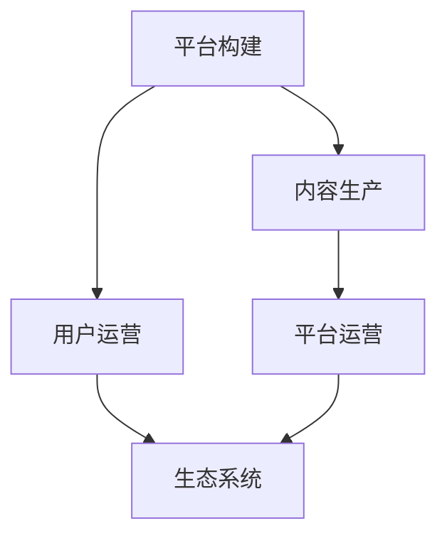

                 

# 如何打造个人知识付费生态系统

> 关键词：知识付费，平台构建，内容生产，用户运营，生态系统

## 1. 背景介绍

### 1.1 问题由来

随着互联网的普及和信息爆炸，知识付费成为了互联网新业态中增长迅猛的一块。过去几年里，知识付费行业迅速发展，不仅诞生了多个知名的知识付费平台，如得到、喜马拉雅、西瓜视频等，还催生了大量内容生产者，如罗振宇、付费课作家、播主等，形成了一个生态链条，涵盖了内容生产、平台运营、内容分发、用户消费等环节。

然而，尽管知识付费市场在快速增长，但其发展依然面临诸多挑战。内容同质化、用户体验不佳、商业变现难等问题，使得平台和内容生产者难以形成良性循环。同时，用户对优质内容的渴望，也亟需一个更具个性、更具价值、更具互动性的知识付费生态系统。

因此，如何打造一个能够持续满足用户需求，吸引优质内容创作者，实现商业变现的个人知识付费生态系统，成为了当前知识付费行业的重要课题。本文将从平台构建、内容生产、用户运营三个维度，详细介绍如何打造一个成功的个人知识付费生态系统。

## 2. 核心概念与联系

### 2.1 核心概念概述

为更好地理解个人知识付费生态系统的构建，本节将介绍几个核心概念：

- 知识付费(Knowledge Pricing)：用户为获取知识、技能、信息等有价值的资讯内容，而支付相应费用的商业模式。知识付费通过付费机制，刺激了优质内容生产，提升了用户体验。

- 内容生产(Content Production)：在知识付费平台中，内容生产者利用自身的专业知识、技能和经验，生产出具有价值的内容产品，并通过平台分发，达到商业变现的目的。

- 平台运营(Platform Operation)：知识付费平台通过技术手段和运营策略，连接内容生产者和用户，构建良好的生态系统。平台运营是知识付费平台成功的关键。

- 用户运营(User Operation)：以用户为核心，通过运营手段提升用户粘性、活跃度和留存率，从而提高平台的商业价值。

- 生态系统(Ecosystem)：由平台、内容生产者、用户、第三方服务等多个要素组成的有机整体，通过相互合作、互动，形成可持续发展的良性循环。

这些概念之间的逻辑关系可以通过以下Mermaid流程图来展示：



这个流程图展示了几大核心概念之间的联系：

1. 平台构建是基础，连接内容生产者和用户，提供必要的技术支持。
2. 内容生产是核心，提供优质内容，吸引用户付费。
3. 用户运营是保障，通过提升用户体验，提高平台粘性和留存率。
4. 生态系统是目标，通过平台、内容生产者和用户之间的互动，形成良性循环。

## 3. 核心算法原理 & 具体操作步骤

### 3.1 算法原理概述

打造个人知识付费生态系统，本质上是一个多目标优化问题。其核心在于通过合理的平台构建、内容生产、用户运营策略，最大化平台的用户活跃度、内容消费量、用户粘性以及商业变现能力。

假设平台总用户数为 $N$，内容生产者数量为 $M$，用户平均消费金额为 $A$，内容平均价格为 $P$，单用户消费频次为 $F$，内容平台日活跃用户数为 $DAU$，则平台目标函数为：

$$
\max_{N, M, A, P, F, DAU} \quad \text{User Acquisition} + \text{User Engagement} + \text{Content Consumption} + \text{Commercial Value}
$$

其中，用户获取、用户互动、内容消费和商业价值的具体衡量方式，需要通过不同的算法和模型来量化。平台构建、内容生产和用户运营三个环节的优化，需要综合考虑以上指标，通过复杂的算法模型来求解。

### 3.2 算法步骤详解

基于上述目标函数，构建个人知识付费生态系统的核心算法步骤可以分为以下几个关键步骤：

**Step 1: 数据采集与分析**

平台需采集大量用户行为数据、内容消费数据、用户反馈数据等，通过数据分析来了解用户需求、内容质量、运营效果等。

- 用户数据：包括用户基本信息、行为轨迹、支付记录等。
- 内容数据：包括内容数量、质量评分、消费情况、用户评价等。
- 运营数据：包括广告效果、市场活动、内容审核等。

**Step 2: 模型建立与优化**

通过机器学习、深度学习等方法，建立各种评估指标的预测模型，如用户活跃度、内容消费量、商业变现能力等。

- 用户获取模型：通过分析用户来源、转化率等指标，优化用户获取策略。
- 用户留存模型：通过分析用户行为、互动频率等指标，提升用户粘性和留存率。
- 内容推荐模型：通过分析用户偏好、内容评分等指标，优化内容推荐算法。
- 商业变现模型：通过分析用户消费频次、金额等指标，优化商业变现策略。

**Step 3: 资源分配与调度**

平台需根据模型评估结果，动态分配资源，优化用户运营和内容生产。

- 用户运营资源：如广告预算、活动策划等，需根据用户活跃度、留存率等指标进行分配。
- 内容生产资源：如资金投入、人力调配等，需根据内容质量、用户评价等指标进行优化。

**Step 4: 反馈循环与迭代**

平台需建立动态反馈机制，根据实时数据和模型结果，不断优化平台运营策略和内容生产策略。

- 实时数据监控：通过实时监控平台各项指标，及时发现问题并调整策略。
- 定期复盘与优化：通过定期复盘平台运营情况，评估策略效果并进行优化。

### 3.3 算法优缺点

打造个人知识付费生态系统的方法具有以下优点：

1. 系统性：通过系统化、数据驱动的方式，全面优化平台运营，提升生态系统的整体性能。
2. 灵活性：可以根据实时数据进行动态调整，提高策略的灵活性和有效性。
3. 可控性：可以通过模型控制用户获取、内容生产、商业变现等关键环节，保障平台稳定运行。

同时，该方法也存在以下局限性：

1. 数据需求高：需要采集大量用户和内容数据，数据获取和处理成本较高。
2. 模型复杂：需要建立多维度的评估模型，模型设计和优化难度较大。
3. 资源投入大：优化策略需要大量的人力、物力资源投入，短期内可能难见效。

尽管存在这些局限性，但就目前而言，数据驱动、系统化的策略依然是打造成功个人知识付费生态系统的核心方法。未来相关研究的重点在于如何进一步降低数据需求和模型复杂度，提高资源利用效率，同时兼顾用户需求和商业价值的平衡。

### 3.4 算法应用领域

个人知识付费生态系统的打造，主要应用于知识付费平台的运营、内容生产者的支持、用户的吸引和留存等多个领域。通过构建一个全面的生态系统，可以更好地满足用户需求，提升内容质量，实现商业变现，具体应用领域包括：

- 用户获取与留存：通过优化广告投放、用户活动等，提高用户获取和留存率。
- 内容推荐与分发：通过内容推荐算法，提升用户内容消费量和满意度。
- 商业变现与增值：通过合理的定价策略和商业变现模式，实现平台盈利。
- 内容生产者支持：通过平台政策、资金支持、流量曝光等，激励内容生产，提升内容质量。
- 数据分析与反馈：通过大数据分析，深入理解用户需求，优化平台运营策略。

## 4. 数学模型和公式 & 详细讲解  
### 4.1 数学模型构建

为更好地理解个人知识付费生态系统的构建过程，本节将通过数学语言对生态系统运营的目标函数进行详细构建。

假设平台总用户数为 $N$，内容生产者数量为 $M$，用户平均消费金额为 $A$，内容平均价格为 $P$，单用户消费频次为 $F$，内容平台日活跃用户数为 $DAU$。定义用户获取率 $\alpha$、用户留存率 $\beta$、内容消费量 $\gamma$、商业变现率 $\delta$，则平台目标函数为：

$$
\max_{\alpha, \beta, \gamma, \delta} \quad \alpha \times N + \beta \times F \times A + \gamma \times P + \delta \times DAU
$$

其中：

- $\alpha$：用户获取率，表示平台通过各种渠道获取新用户的比例。
- $\beta$：用户留存率，表示平台用户留存一段时间的比例。
- $\gamma$：内容消费量，表示用户对内容的需求量和消费量。
- $\delta$：商业变现率，表示平台通过内容消费、广告、增值服务等手段实现的商业变现比例。

### 4.2 公式推导过程

根据上述目标函数，我们对其中的各项指标进行详细推导。

**用户获取率 $\alpha$ 推导：**

用户获取率 $\alpha$ 可以通过以下公式计算：

$$
\alpha = \frac{\text{新增用户数}}{\text{总用户数}} = \frac{N_{\text{new}}}{N}
$$

其中，$N_{\text{new}}$ 表示平台在单位时间内新增的用户数量。

**用户留存率 $\beta$ 推导：**

用户留存率 $\beta$ 可以通过以下公式计算：

$$
\beta = \frac{\text{留存用户数}}{\text{新增用户数}} = \frac{N_{\text{retained}}}{N_{\text{new}}}
$$

其中，$N_{\text{retained}}$ 表示平台在一定时间内留存的用户数量。

**内容消费量 $\gamma$ 推导：**

内容消费量 $\gamma$ 可以通过以下公式计算：

$$
\gamma = \frac{\text{内容消费次数}}{\text{总用户数}} = \frac{C}{N}
$$

其中，$C$ 表示用户在一定时间内对内容进行消费的次数。

**商业变现率 $\delta$ 推导：**

商业变现率 $\delta$ 可以通过以下公式计算：

$$
\delta = \frac{\text{商业变现金额}}{\text{内容消费金额}} = \frac{R}{C \times P}
$$

其中，$R$ 表示平台在一定时间内通过内容消费、广告、增值服务等手段实现的商业变现金额，$P$ 表示内容的平均价格。

**目标函数推导：**

将上述各项指标代入目标函数，得：

$$
\max_{\alpha, \beta, \gamma, \delta} \quad \alpha \times N + \beta \times F \times A + \gamma \times P + \delta \times DAU
$$

该目标函数考虑了用户获取、留存、内容消费和商业变现四个维度，通过优化各项指标，实现平台整体运营效率的最大化。

### 4.3 案例分析与讲解

以得到平台为例，分析其在用户获取、内容生产、用户运营等方面的具体策略。

**用户获取策略：**

得到平台通过多个渠道获取用户，包括线上广告、社交媒体推广、内容推广等。通过用户行为分析，优化广告投放策略，提升用户转化率。例如，通过分析用户在不同渠道上的行为轨迹和消费记录，识别高价值用户群体，进行精准定向广告投放。

**内容生产策略：**

得到平台邀请了大量知名专家和意见领袖作为内容生产者，生产优质内容。通过内容质量评估和推荐算法，提升内容消费量和用户满意度。例如，平台利用大数据分析用户偏好，推荐用户最感兴趣的内容，提高内容消费量。

**用户运营策略：**

得到平台通过多种互动形式，提升用户粘性和留存率。例如，平台定期举办用户活动，鼓励用户参与互动，提高用户活跃度。同时，通过用户反馈系统，及时调整内容和运营策略，提升用户体验。

## 5. 项目实践：代码实例和详细解释说明
### 5.1 开发环境搭建

在进行个人知识付费生态系统的开发实践前，我们需要准备好开发环境。以下是使用Python进行数据科学和机器学习开发的环境配置流程：

1. 安装Anaconda：从官网下载并安装Anaconda，用于创建独立的Python环境。

2. 创建并激活虚拟环境：
```bash
conda create -n myenv python=3.8 
conda activate myenv
```

3. 安装Python科学计算库：
```bash
pip install numpy pandas scikit-learn scipy matplotlib seaborn jupyter notebook ipython
```

4. 安装机器学习框架：
```bash
pip install tensorflow keras tensorflow-addons 
```

5. 安装深度学习框架：
```bash
pip install torch torchvision torchaudio
```

6. 安装相关库：
```bash
pip install transformers lightgbm catboost pandas_profiling
```

完成上述步骤后，即可在`myenv`环境中开始项目开发。

### 5.2 源代码详细实现

这里我们以构建一个简单的用户获取模型为例，展示如何通过Python代码实现。

首先，我们需要准备用户行为数据集，包含用户的ID、行为时间、行为类型等信息。假设数据集文件名为`user_behavior.csv`，包含如下数据：

```
1,2021-01-01,浏览
2,2021-01-02,购买
3,2021-01-03,评价
...
```

接着，使用Pandas库读取数据集：

```python
import pandas as pd

# 读取用户行为数据
user_behavior_data = pd.read_csv('user_behavior.csv')

# 显示数据集的前5行
print(user_behavior_data.head())
```

然后，进行数据预处理和特征工程：

```python
from sklearn.model_selection import train_test_split
from sklearn.preprocessing import LabelEncoder

# 将行为类型编码
label_encoder = LabelEncoder()
user_behavior_data['behavior_type'] = label_encoder.fit_transform(user_behavior_data['behavior_type'])

# 将日期时间转换为时间戳
user_behavior_data['timestamp'] = pd.to_datetime(user_behavior_data['timestamp']).astype(int)

# 将数据集分为训练集和测试集
train_data, test_data = train_test_split(user_behavior_data, test_size=0.2, random_state=42)

# 显示训练集和测试集的前5行
print(train_data.head())
print(test_data.head())
```

接着，训练模型：

```python
from sklearn.linear_model import LogisticRegression
from sklearn.metrics import roc_auc_score

# 定义逻辑回归模型
model = LogisticRegression()

# 训练模型
model.fit(train_data[['timestamp', 'behavior_type']], train_data['is_new_user'])

# 预测测试集
test_preds = model.predict_proba(test_data[['timestamp', 'behavior_type']])[:, 1]

# 计算AUC
auc = roc_auc_score(test_data['is_new_user'], test_preds)
print('AUC:', auc)
```

最后，评估模型并进行优化：

```python
from sklearn.model_selection import GridSearchCV

# 定义参数网格
param_grid = {
    'C': [0.1, 1, 10, 100],
    'penalty': ['l1', 'l2'],
    'solver': ['lbfgs', 'sag', 'saga']
}

# 定义交叉验证和网格搜索
grid_search = GridSearchCV(model, param_grid, cv=5, scoring='roc_auc')

# 训练模型
grid_search.fit(train_data[['timestamp', 'behavior_type']], train_data['is_new_user'])

# 输出最优参数
print('Best parameters:', grid_search.best_params_)
```

以上就是构建一个简单的用户获取模型的Python代码实现。可以看到，通过Python的科学计算库和机器学习框架，可以轻松实现数据预处理、模型训练和评估等环节。

### 5.3 代码解读与分析

让我们再详细解读一下关键代码的实现细节：

**数据读取与预处理**：
- 使用Pandas库读取CSV格式的数据集。
- 对行为类型进行编码，方便模型训练。
- 将日期时间转换为时间戳，方便模型处理。
- 将数据集分为训练集和测试集，进行交叉验证。

**模型训练与评估**：
- 使用逻辑回归模型，对用户是否是新用户进行预测。
- 通过ROC-AUC曲线评估模型性能。
- 使用网格搜索优化模型参数，提升模型效果。

**结果展示**：
- 输出模型的AUC值，评估模型预测能力。
- 输出最优参数组合，指导模型调优。

以上代码展示了数据科学和机器学习在个人知识付费生态系统构建中的应用。通过数据预处理和模型训练，可以有效识别新用户，提升用户获取率。未来，随着模型的进一步优化和数据的积累，可以实现更精准的用户获取和运营策略。

## 6. 实际应用场景
### 6.1 智能客服系统

基于个人知识付费生态系统的理念，可以构建一个智能客服系统，提供更加个性化的服务体验。智能客服系统通过分析用户行为和偏好，推荐最适合的解决方案，提升用户满意度和留存率。

具体而言，智能客服系统可以集成到知识付费平台中，通过分析用户的购买记录、阅读历史等数据，了解用户需求，提供定制化的服务。例如，对于经常购买某类课程的用户，推荐相关课程或活动；对于有学习困惑的用户，提供1对1的咨询服务。

### 6.2 金融数据分析

金融领域需要实时监测市场动向，以便及时做出投资决策。基于个人知识付费生态系统的理念，可以构建一个金融数据分析平台，提供实时、精准的市场分析报告，帮助用户做出更加科学的投资决策。

具体而言，平台可以收集金融市场的数据，包括股票、基金、债券等金融产品的价格变化、成交量等。通过分析数据，提供市场趋势、投资机会等报告，并结合用户的历史交易记录，提供个性化的投资建议。

### 6.3 电商推荐系统

电商领域需要精准推荐商品，提升用户购买转化率。基于个人知识付费生态系统的理念，可以构建一个电商推荐系统，根据用户的行为和偏好，推荐最适合的商品。

具体而言，平台可以收集用户的浏览记录、购买记录等数据，分析用户的偏好和行为，提供个性化的商品推荐。例如，对于喜欢健身的用户，推荐相关健身器材、课程等。

## 7. 工具和资源推荐
### 7.1 学习资源推荐

为了帮助开发者系统掌握个人知识付费生态系统的构建，这里推荐一些优质的学习资源：

1. 《深度学习与数据挖掘实战》系列课程：由知名高校和公司提供的在线课程，系统讲解深度学习和数据挖掘的基本原理和应用场景。

2. 《Python数据科学手册》：详细介绍了Python在数据科学领域的应用，包括数据处理、机器学习、数据可视化等。

3. Kaggle：一个数据科学竞赛平台，提供丰富的数据集和竞赛，可以帮助开发者练习数据科学技能，提升实践能力。

4. Coursera和edX：提供大量高质量的在线课程，涵盖数据科学、机器学习、人工智能等多个领域。

5. Udacity：提供从入门到高级的数据科学和机器学习课程，包括项目实战和实践指导。

通过对这些资源的学习实践，相信你一定能够快速掌握个人知识付费生态系统的构建方法，并用于解决实际的业务问题。

### 7.2 开发工具推荐

高效的开发离不开优秀的工具支持。以下是几款用于个人知识付费生态系统开发的常用工具：

1. Python：作为数据科学和机器学习的主流语言，Python拥有丰富的科学计算库和机器学习框架，支持高效的数据处理和模型训练。

2. Jupyter Notebook：一个交互式的Python开发环境，支持代码编写、数据可视化、模型训练等，是数据科学家的必备工具。

3. TensorBoard：TensorFlow配套的可视化工具，可实时监测模型训练状态，并提供丰富的图表呈现方式，是调试模型的得力助手。

4. Weights & Biases：模型训练的实验跟踪工具，可以记录和可视化模型训练过程中的各项指标，方便对比和调优。

5. CatBoost和LightGBM：高性能的梯度提升树算法，适合处理大规模数据和高维数据，适用于数据科学和机器学习项目。

合理利用这些工具，可以显著提升个人知识付费生态系统的开发效率，加快创新迭代的步伐。

### 7.3 相关论文推荐

个人知识付费生态系统的构建源于学界的持续研究。以下是几篇奠基性的相关论文，推荐阅读：

1. 《深度学习在用户行为分析中的应用》：介绍了深度学习在用户行为预测和推荐系统中的应用，提升用户体验和留存率。

2. 《基于机器学习的用户获取优化》：探讨了机器学习在用户获取和转化中的应用，提升平台的用户获取效率。

3. 《金融数据分析中的深度学习应用》：讨论了深度学习在金融数据分析中的应用，提供实时、精准的市场分析报告。

4. 《电商推荐系统中的用户行为分析》：研究了电商推荐系统中的用户行为分析，提升用户购买转化率。

这些论文代表了大数据、机器学习在个人知识付费生态系统构建中的前沿进展，通过学习这些成果，可以帮助研究者把握学科前进方向，激发更多的创新灵感。

## 8. 总结：未来发展趋势与挑战
### 8.1 研究成果总结

本文对个人知识付费生态系统的构建方法进行了全面系统的介绍。首先阐述了知识付费行业的背景和问题，明确了构建生态系统的目标和意义。其次，从平台构建、内容生产、用户运营三个维度，详细讲解了生态系统的构建方法。最后，分析了生态系统在实际应用中的具体场景，展望了未来的发展趋势和面临的挑战。

通过本文的系统梳理，可以看到，基于个人知识付费生态系统的理念，可以实现更加个性化、更加精准的用户获取和运营，提升内容质量和商业变现能力，满足用户需求，实现平台成功。未来，随着技术进步和业务发展，知识付费生态系统将不断创新，提供更加丰富、更加智能的解决方案。

### 8.2 未来发展趋势

展望未来，个人知识付费生态系统将呈现以下几个发展趋势：

1. 更加智能化：通过人工智能技术，提升内容推荐、用户互动等环节的智能化程度，提升用户体验。

2. 更加个性化：通过个性化推荐、个性化内容生产等，满足不同用户的需求，提升用户粘性。

3. 更加数据驱动：通过大数据分析，深入理解用户需求，优化平台运营策略。

4. 更加多元化：结合视频、音频、直播等多种形式，提供更加多元化的内容形式，满足用户多样化需求。

5. 更加社交化：通过社交网络、社区等形式，增加用户互动，提升用户留存率。

这些趋势将推动个人知识付费生态系统向更加智能化、个性化、数据驱动的方向发展，为用户提供更加优质的服务。

### 8.3 面临的挑战

尽管个人知识付费生态系统发展前景广阔，但在迈向更加智能化、个性化、数据驱动的道路上，仍面临诸多挑战：

1. 数据隐私与安全：用户数据的收集和使用需要遵守相关法律法规，保护用户隐私，防范数据泄露风险。

2. 平台资源限制：高维数据的处理和模型训练需要高性能计算资源，如何高效利用有限的资源，提升模型性能，仍然是一大难题。

3. 模型效果与公平性：深度学习模型的偏见和歧视问题依然存在，如何提升模型的公平性和透明性，是构建公平生态系统的关键。

4. 用户粘性与参与度：如何提高用户粘性、参与度和留存率，减少用户流失，是平台运营的核心问题。

5. 商业模式创新：如何找到新的商业模式，提升平台盈利能力，是一个长期而艰巨的挑战。

### 8.4 研究展望

面对个人知识付费生态系统面临的诸多挑战，未来的研究需要在以下几个方面寻求新的突破：

1. 探索新的深度学习算法：开发更加高效、更加公平的深度学习算法，提升模型的性能和可靠性。

2. 引入用户交互模型：引入用户行为模拟和互动模型，提升用户参与度和粘性。

3. 构建社交化生态系统：通过社交网络、社区等形式，增加用户互动，提升用户留存率。

4. 开发新的商业变现模式：探索新的商业变现模式，如订阅服务、会员制、增值服务等，提升平台盈利能力。

5. 保护用户隐私与安全：通过数据加密、匿名化等技术，保护用户隐私，防范数据泄露风险。

这些研究方向的探索，将引领个人知识付费生态系统向更加智能化、个性化、数据驱动的方向发展，为用户提供更加优质、更加公平、更加安全的知识付费服务。

## 9. 附录：常见问题与解答

**Q1：如何构建一个成功的个人知识付费生态系统？**

A: 构建一个成功的个人知识付费生态系统需要从平台构建、内容生产、用户运营三个维度进行系统化优化。具体来说：

1. 平台构建：通过数据采集、模型训练、资源分配等手段，连接内容生产者和用户，构建良好的生态系统。
2. 内容生产：通过内容质量评估、内容推荐算法等手段，激励内容生产，提升内容质量。
3. 用户运营：通过用户行为分析、用户互动等手段，提升用户粘性、活跃度和留存率。

只有从平台、内容、用户三个方面进行全面优化，才能实现生态系统的可持续发展。

**Q2：如何提升用户获取率？**

A: 提升用户获取率的关键在于精准定位和个性化营销。具体来说：

1. 精准定位：通过分析用户行为和需求，找到高价值用户群体，进行精准定向广告投放。
2. 个性化营销：通过个性化推荐和互动，提升用户体验和满意度，增加用户转化率。
3. 多渠道营销：通过多渠道（如线上广告、社交媒体推广等）获取用户，提高用户获取效率。

合理运用这些策略，可以显著提升用户获取率，增加平台的用户数量和活跃度。

**Q3：如何提高用户粘性和留存率？**

A: 提高用户粘性和留存率需要从多个方面入手，具体包括：

1. 用户行为分析：通过分析用户行为和偏好，提供个性化的内容推荐和互动，提升用户体验。
2. 用户活动策划：通过定期举办用户活动，增加用户互动，提升用户粘性。
3. 用户反馈机制：通过用户反馈系统，及时调整内容和运营策略，提升用户满意度。
4. 多层次互动：通过多层次互动（如评论、点赞、分享等），增加用户参与度，提升用户留存率。

通过以上手段，可以显著提升用户粘性和留存率，实现平台的长期稳定发展。

**Q4：如何优化内容推荐算法？**

A: 优化内容推荐算法需要从多个方面入手，具体包括：

1. 数据预处理：对用户行为数据和内容数据进行清洗、处理和特征提取，提升数据质量。
2. 模型选择：选择合适的推荐算法（如协同过滤、基于内容的推荐等），根据数据特点和推荐效果进行优化。
3. 模型训练：使用优化算法（如梯度下降、随机梯度下降等）进行模型训练，提升模型效果。
4. 效果评估：通过AUC、RMSE等指标评估模型效果，及时调整模型参数和算法策略。

通过以上手段，可以显著提升内容推荐算法的精度和效果，提高用户满意度和留存率。

**Q5：如何构建社交化生态系统？**

A: 构建社交化生态系统需要从以下几个方面进行优化：

1. 社区建设：建立用户社区，通过互动和交流，增加用户粘性和参与度。
2. 社交功能：在平台上加入社交功能，如好友关系、评论、点赞等，增加用户互动。
3. 社交活动：通过定期举办社交活动，增加用户互动，提升用户粘性。
4. 社交推荐：通过社交网络分析，推荐用户感兴趣的内容和用户，增加用户参与度。

通过以上手段，可以显著提升社交化生态系统的互动性和用户粘性，增加平台的用户数量和活跃度。

---

作者：禅与计算机程序设计艺术 / Zen and the Art of Computer Programming

