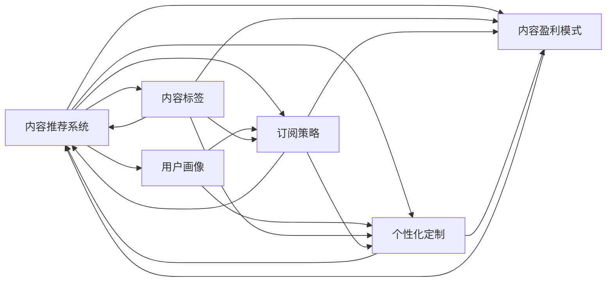

                 

# 如何打造知识付费的付费专栏

> 关键词：知识付费,付费专栏,内容推荐系统,订阅策略,个性化定制,内容盈利模式,用户画像,数据分析,人工智能,自然语言处理

## 1. 背景介绍

### 1.1 问题由来

在信息爆炸的时代，知识付费逐渐成为人们获取高质量信息的重要途径。人们不再满足于简单的文章阅读或视频观看，而是希望获得有深度、有针对性的内容。付费专栏作为知识付费的重要形式之一，以其专业的深度和定制化的服务，受到越来越多用户的青睐。

如何打造高效、有价值的付费专栏，成为当前知识付费领域的重要课题。本文将围绕付费专栏的构建，介绍相关核心概念和技术原理，并给出详细的操作步骤和案例分析。

### 1.2 问题核心关键点

构建付费专栏的核心在于内容推荐系统、订阅策略、个性化定制、内容盈利模式等方面。下面将详细探讨这些关键点：

1. **内容推荐系统**：通过用户画像和内容标签，为用户推荐感兴趣的专栏内容。
2. **订阅策略**：制定合理的价格策略，吸引用户订阅并提升续费率。
3. **个性化定制**：根据用户行为和偏好，提供个性化订阅方案和推荐内容。
4. **内容盈利模式**：探索多种盈利方式，如按需付费、广告分成、内容版权等。

掌握这些关键点，能够帮助内容创作者打造高效、有竞争力的付费专栏，提升用户满意度和收益。

### 1.3 问题研究意义

构建付费专栏的研究具有重要意义：

1. **提升用户满意度**：通过个性化的推荐和订阅策略，提升用户体验，满足用户个性化需求。
2. **提高用户留存率**：合理的订阅策略和内容盈利模式，吸引用户订阅并持续续费。
3. **创造经济效益**：内容创作者能够通过付费专栏获得稳定的收益，从而激励更多优质内容的产出。
4. **推动知识付费行业发展**：优秀的付费专栏为行业树立标杆，带动整个知识付费行业的进步。

## 2. 核心概念与联系

### 2.1 核心概念概述

为更好地理解付费专栏的构建，本文将介绍几个关键概念：

- **内容推荐系统**：利用机器学习算法，对用户行为和内容特征进行分析，为用户推荐感兴趣的专栏内容。
- **订阅策略**：通过价格策略、优惠活动等方式，吸引用户订阅付费专栏，并提升续费率。
- **个性化定制**：根据用户行为和偏好，提供个性化的订阅方案和推荐内容。
- **内容盈利模式**：探索多样化的盈利方式，如按需付费、广告分成、内容版权等。

这些概念之间的联系可以通过以下Mermaid流程图来展示：



这个流程图展示了内容推荐系统与其他概念之间的联系：

1. 用户画像和内容标签是推荐系统的输入。
2. 订阅策略和个性化定制是基于推荐系统的输出。
3. 内容盈利模式与推荐系统、订阅策略、个性化定制相辅相成。

## 3. 核心算法原理 & 具体操作步骤
### 3.1 算法原理概述

构建付费专栏的核心算法包括内容推荐、订阅策略、个性化定制和内容盈利模式。下面将分别介绍这些算法的原理和具体操作步骤。

### 3.2 算法步骤详解

#### 3.2.1 内容推荐系统

内容推荐系统主要包括用户画像和内容标签的构建、推荐算法的选择和优化。

1. **用户画像构建**：收集用户的行为数据（如阅读历史、订阅记录等）和属性数据（如年龄、职业等），使用机器学习算法生成用户画像。常用的算法包括协同过滤、内容过滤、基于深度学习的推荐算法等。

2. **内容标签构建**：对内容进行标签化，如文章分类、关键词提取等，使用TF-IDF、Word2Vec等算法生成内容标签。

3. **推荐算法选择**：根据数据特点和业务需求，选择适合的推荐算法。常用的推荐算法包括协同过滤、基于矩阵分解的推荐算法、基于深度学习的推荐算法等。

4. **算法优化**：对推荐算法进行优化，如增加冷启动策略、引入用户反馈机制等，提升推荐效果。

#### 3.2.2 订阅策略

订阅策略主要包括定价策略、优惠活动和续费策略的制定。

1. **定价策略**：根据内容价值和市场调研，制定合理的订阅价格。常见的定价策略包括单次购买、月度订阅、年度订阅等。

2. **优惠活动**：定期推出优惠活动，吸引用户订阅。例如，新用户首月免费、推荐好友奖励等。

3. **续费策略**：通过个性化推荐和定期推送内容更新，提升用户续费率。例如，根据用户行为推荐相关专栏，发送订阅提醒等。

#### 3.2.3 个性化定制

个性化定制主要包括个性化订阅方案和推荐内容的提供。

1. **个性化订阅方案**：根据用户画像和订阅历史，提供个性化的订阅方案，如推荐相关专栏、提供特别优惠等。

2. **推荐内容提供**：根据用户行为和偏好，提供个性化的推荐内容。例如，根据用户阅读历史推荐相关文章、根据用户订阅记录推荐相关专栏等。

#### 3.2.4 内容盈利模式

内容盈利模式主要包括按需付费、广告分成、内容版权等。

1. **按需付费**：用户按月或按年度订阅付费专栏，获取全文阅读权限。

2. **广告分成**：在付费专栏中插入广告，通过广告分成获得收益。

3. **内容版权**：将付费专栏内容打包成书籍、音频、视频等形式，通过版权销售获得收益。

### 3.3 算法优缺点

内容推荐系统的优点包括：

1. **提升用户体验**：根据用户兴趣推荐个性化内容，提升用户满意度。
2. **降低用户流失率**：通过个性化推荐和定期推送，提升用户续费率。
3. **提高内容曝光率**：利用推荐算法提高优质内容的曝光率，吸引更多用户订阅。

缺点包括：

1. **数据隐私问题**：用户画像和行为数据的收集和使用可能涉及用户隐私问题。
2. **推荐算法复杂性**：复杂的推荐算法需要大量计算资源，可能影响推荐速度。
3. **冷启动问题**：新用户和冷启动内容可能面临推荐效果不佳的问题。

订阅策略的优点包括：

1. **提高用户订阅率**：通过合理的定价和优惠活动，吸引用户订阅。
2. **提升续费率**：通过个性化推荐和定期推送，提升用户续费率。

缺点包括：

1. **定价敏感性**：用户对价格的敏感性较高，定价过高可能导致用户流失。
2. **优惠活动过度依赖**：过度依赖优惠活动可能影响长期收益。

个性化定制的优点包括：

1. **提升用户体验**：根据用户行为和偏好，提供个性化的订阅方案和推荐内容，提升用户满意度。
2. **增加用户粘性**：通过个性化推荐和定期推送，增加用户粘性，降低流失率。

缺点包括：

1. **数据复杂性**：用户画像和行为数据复杂，处理和存储成本较高。
2. **推荐算法局限性**：复杂的推荐算法可能存在推荐效果不佳的问题。

内容盈利模式的优点包括：

1. **多元化收益**：通过多种盈利方式，降低风险，增加收益。
2. **提高内容价值**：通过版权销售和内容包装，提高内容附加值。

缺点包括：

1. **盈利模式单一**：单一盈利模式可能难以满足市场需求。
2. **版权保护问题**：内容侵权和盗版问题可能影响收益。

### 3.4 算法应用领域

内容推荐系统、订阅策略、个性化定制和内容盈利模式，在知识付费、在线教育、智能营销等多个领域都有广泛应用。

1. **知识付费**：在知识付费平台如得到、喜马拉雅等，利用推荐系统为用户推荐感兴趣的内容，通过订阅策略和个性化定制提升用户体验和续费率。

2. **在线教育**：在线教育平台如Coursera、Udacity等，利用推荐系统为用户推荐相关课程，通过订阅策略和个性化定制提升用户参与度和续费率。

3. **智能营销**：电商平台如亚马逊、京东等，利用推荐系统为用户推荐感兴趣的商品，通过订阅策略和个性化定制提升用户粘性和销售额。

## 4. 数学模型和公式 & 详细讲解  
### 4.1 数学模型构建

在本节中，我们将介绍内容推荐系统的数学模型构建和推荐算法的选择。

假设内容推荐系统有 $M$ 个用户和 $N$ 个内容，记用户画像为 $U$，内容标签为 $C$，用户行为矩阵为 $B$。用户 $u$ 对内容 $i$ 的评分 $r_{ui}$ 为：

$$
r_{ui} = f_{\theta}(u, i)
$$

其中 $f_{\theta}$ 为推荐模型，$\theta$ 为模型参数。

### 4.2 公式推导过程

内容推荐系统常用的算法包括协同过滤、基于矩阵分解的推荐算法、基于深度学习的推荐算法等。下面以基于矩阵分解的推荐算法为例，进行公式推导。

假设用户画像和内容标签的矩阵分别为 $U$ 和 $C$，用户对内容的评分矩阵为 $B$。目标是最小化预测评分与真实评分之间的误差，即：

$$
\min_{U, C} \frac{1}{2} \|U \times C - B\|
$$

通过矩阵分解，将 $U$ 和 $C$ 分解为低秩矩阵的形式：

$$
U = P \times Q, C = R \times S
$$

其中 $P$、$Q$、$R$、$S$ 为低秩矩阵，$P$ 和 $R$ 分别为用户和内容的低秩矩阵，$Q$ 和 $S$ 分别为用户和内容的低秩向量。

代入上述公式，得：

$$
\min_{P, Q, R, S} \frac{1}{2} \|P \times Q \times R \times S - B\|
$$

通过对 $P$、$Q$、$R$、$S$ 进行求解，得到推荐模型的参数。

### 4.3 案例分析与讲解

以YouTube推荐系统为例，分析推荐算法的实际应用。

YouTube推荐系统使用基于矩阵分解的推荐算法，对用户行为数据进行分解，生成用户画像和内容标签矩阵。根据用户的行为数据，计算用户和内容之间的相似度，为用户推荐感兴趣的内容。

在实际操作中，YouTube还引入用户反馈机制，根据用户对推荐结果的反馈，不断调整推荐算法，提升推荐效果。

## 5. 项目实践：代码实例和详细解释说明
### 5.1 开发环境搭建

在进行内容推荐系统的开发前，需要准备好开发环境。以下是使用Python进行PyTorch开发的环境配置流程：

1. 安装Anaconda：从官网下载并安装Anaconda，用于创建独立的Python环境。

2. 创建并激活虚拟环境：
```bash
conda create -n pytorch-env python=3.8 
conda activate pytorch-env
```

3. 安装PyTorch：根据CUDA版本，从官网获取对应的安装命令。例如：
```bash
conda install pytorch torchvision torchaudio cudatoolkit=11.1 -c pytorch -c conda-forge
```

4. 安装TensorFlow：
```bash
pip install tensorflow
```

5. 安装各类工具包：
```bash
pip install numpy pandas scikit-learn matplotlib tqdm jupyter notebook ipython
```

完成上述步骤后，即可在`pytorch-env`环境中开始内容推荐系统的开发。

### 5.2 源代码详细实现

下面我们以内容推荐系统为例，给出使用PyTorch进行矩阵分解的代码实现。

首先，定义用户行为矩阵：

```python
import numpy as np

# 定义用户行为矩阵
B = np.array([[5, 3, 0, 0],
              [0, 0, 4, 1],
              [2, 0, 0, 5],
              [0, 0, 0, 0]])
```

然后，定义矩阵分解函数：

```python
import torch

def matrix_factorization(B, num_factors=10, num_epochs=100, learning_rate=0.01):
    num_users, num_contents = B.shape
    P = torch.randn(num_users, num_factors)
    Q = torch.randn(num_factors, num_contents)
    
    for epoch in range(num_epochs):
        R = torch.matmul(P, Q)
        loss = (R - B).pow(2).mean()
        
        grad_P = 2 * (R - B) @ Q.T
        grad_Q = 2 * (R - B) @ P.T
        
        P.data -= learning_rate * grad_P
        Q.data -= learning_rate * grad_Q
        
    return P, Q
```

最后，调用矩阵分解函数，获取推荐模型参数：

```python
P, Q = matrix_factorization(B)
```

### 5.3 代码解读与分析

让我们再详细解读一下关键代码的实现细节：

**用户行为矩阵**：
- 定义了一个简单的用户行为矩阵 $B$，其中 $u_1$ 和 $u_3$ 对内容 $c_2$ 和 $c_3$ 评分较高。

**矩阵分解函数**：
- 函数接收用户行为矩阵 $B$ 和分解的因子数 $num_factors$，训练轮数 $num_epochs$ 和学习率 $learning_rate$ 等参数。
- 通过随机初始化 $P$ 和 $Q$，进行 $num_epochs$ 轮迭代，每次迭代更新 $P$ 和 $Q$，最小化预测评分与真实评分之间的误差。
- 最后返回推荐模型的参数 $P$ 和 $Q$。

**调用矩阵分解函数**：
- 调用矩阵分解函数，得到推荐模型的参数 $P$ 和 $Q$。

可以看到，PyTorch提供了方便的矩阵运算和自动微分功能，使得内容推荐系统的实现变得简洁高效。开发者可以将更多精力放在模型改进和数据处理等高层逻辑上，而不必过多关注底层的实现细节。

## 6. 实际应用场景

### 6.1 知识付费平台

知识付费平台如得到、喜马拉雅等，利用内容推荐系统为用户推荐感兴趣的内容，通过订阅策略和个性化定制提升用户体验和续费率。

在实际操作中，平台可以根据用户的行为数据和属性数据，生成用户画像和内容标签，利用推荐算法为用户推荐相关内容。同时，平台还可以制定合理的订阅价格和优惠活动，吸引用户订阅并提升续费率。

### 6.2 在线教育平台

在线教育平台如Coursera、Udacity等，利用内容推荐系统为用户推荐相关课程，通过订阅策略和个性化定制提升用户参与度和续费率。

在实际操作中，平台可以根据用户的学习行为数据，生成用户画像和课程标签，利用推荐算法为用户推荐相关课程。同时，平台还可以制定合理的订阅价格和优惠活动，吸引用户订阅并提升续费率。

### 6.3 智能营销

电商平台如亚马逊、京东等，利用内容推荐系统为用户推荐感兴趣的商品，通过订阅策略和个性化定制提升用户粘性和销售额。

在实际操作中，平台可以根据用户的购买行为数据，生成用户画像和商品标签，利用推荐算法为用户推荐相关商品。同时，平台还可以制定合理的订阅价格和优惠活动，吸引用户订阅并提升续费率。

### 6.4 未来应用展望

随着内容推荐系统、订阅策略、个性化定制和内容盈利模式的不断演进，付费专栏将在更多领域得到应用，为知识付费、在线教育、智能营销等行业带来变革性影响。

在智慧医疗领域，付费专栏可以用于医学知识的普及和传播，为医生和患者提供专业的医学信息和健康建议。

在智能教育领域，付费专栏可以用于课程推荐和学习路径优化，为学生提供个性化的学习体验。

在智慧城市治理中，付费专栏可以用于公共服务的宣传和推广，为市民提供便捷的政务信息和公共服务。

此外，在企业培训、社会治理、文娱传媒等众多领域，付费专栏也将不断涌现，为知识传播和智能交互系统提供新的可能性。

## 7. 工具和资源推荐

### 7.1 学习资源推荐

为了帮助开发者系统掌握内容推荐系统的理论基础和实践技巧，这里推荐一些优质的学习资源：

1. 《推荐系统》系列博文：由推荐系统专家撰写，深入浅出地介绍了推荐系统的原理和应用。

2. 《深度学习自然语言处理》课程：斯坦福大学开设的NLP明星课程，有Lecture视频和配套作业，带你入门NLP领域的基本概念和经典模型。

3. 《Natural Language Processing with Transformers》书籍：Transformers库的作者所著，全面介绍了如何使用Transformers库进行NLP任务开发，包括内容推荐在内的诸多范式。

4. Kaggle推荐系统竞赛：Kaggle上举办的推荐系统竞赛，提供了丰富的数据集和模型实现，有助于提升推荐系统的实战能力。

通过对这些资源的学习实践，相信你一定能够快速掌握内容推荐系统的精髓，并用于解决实际的推荐问题。

### 7.2 开发工具推荐

高效的开发离不开优秀的工具支持。以下是几款用于内容推荐系统开发的常用工具：

1. PyTorch：基于Python的开源深度学习框架，灵活动态的计算图，适合快速迭代研究。大部分内容推荐算法都有PyTorch版本的实现。

2. TensorFlow：由Google主导开发的开源深度学习框架，生产部署方便，适合大规模工程应用。同样有丰富的推荐算法资源。

3. TensorFlow推荐系统工具包：Google开发的推荐系统工具包，提供了完整的推荐系统实现，包括训练和推理等环节。

4. Weights & Biases：模型训练的实验跟踪工具，可以记录和可视化模型训练过程中的各项指标，方便对比和调优。与主流深度学习框架无缝集成。

5. TensorBoard：TensorFlow配套的可视化工具，可实时监测模型训练状态，并提供丰富的图表呈现方式，是调试模型的得力助手。

合理利用这些工具，可以显著提升内容推荐系统的开发效率，加快创新迭代的步伐。

### 7.3 相关论文推荐

内容推荐系统的发展源于学界的持续研究。以下是几篇奠基性的相关论文，推荐阅读：

1. Collaborative Filtering for Implicit Feedback Datasets（隐式反馈数据集下的协同过滤）：提出了协同过滤算法的基本原理和实现方法，奠定了协同过滤算法的基础。

2. Probabilistic Matrix Factorization Techniques for Recommender Systems（推荐系统中的概率矩阵分解技术）：介绍了概率矩阵分解算法的基本原理和实现方法，适用于推荐系统中的冷启动问题。

3. Matrix Factorization Techniques for Recommender Systems（推荐系统中的矩阵分解技术）：介绍了矩阵分解算法的基本原理和实现方法，适用于推荐系统中的数据稀疏问题。

4. Neural Collaborative Filtering（神经协同过滤）：提出神经协同过滤算法，将深度学习引入推荐系统，提升了推荐系统的准确性和泛化能力。

5. Attention and Transformers for Recommender Systems（推荐系统中的注意力和Transformer）：提出基于注意力机制和Transformer的推荐算法，提升了推荐系统的多样性和鲁棒性。

这些论文代表了大规模推荐系统的发展脉络。通过学习这些前沿成果，可以帮助研究者把握学科前进方向，激发更多的创新灵感。

## 8. 总结：未来发展趋势与挑战

### 8.1 总结

本文对内容推荐系统、订阅策略、个性化定制和内容盈利模式进行了全面系统的介绍。首先阐述了这些核心概念的理论基础和实现原理，明确了内容推荐系统在知识付费领域的独特价值。其次，从原理到实践，详细讲解了推荐算法的数学模型和操作步骤，给出了内容推荐系统的完整代码实例。同时，本文还广泛探讨了内容推荐系统在知识付费、在线教育、智能营销等多个行业领域的应用前景，展示了内容推荐系统的广阔前景。

通过本文的系统梳理，可以看到，内容推荐系统在知识付费领域有着巨大的应用潜力，能够显著提升用户体验和收益。未来，伴随推荐算法和业务模式的不断演进，内容推荐系统必将在更多领域得到应用，为知识付费、在线教育、智能营销等行业带来变革性影响。

### 8.2 未来发展趋势

展望未来，内容推荐系统将呈现以下几个发展趋势：

1. **个性化推荐**：利用深度学习和自然语言处理技术，提升推荐系统的个性化水平，根据用户行为和偏好，提供更精准的推荐。

2. **冷启动问题**：通过用户行为数据、社交网络和知识图谱等，解决推荐系统中的冷启动问题，提升新用户的推荐效果。

3. **跨平台推荐**：通过多平台数据融合，实现跨平台的推荐，提升推荐系统的覆盖范围和效果。

4. **实时推荐**：通过实时数据处理和模型更新，实现实时推荐，提升用户体验和系统效率。

5. **推荐系统的融合**：将推荐系统与其他人工智能技术进行融合，如知识图谱、多模态信息等，提升推荐系统的综合能力。

以上趋势凸显了内容推荐系统的广阔前景。这些方向的探索发展，必将进一步提升推荐系统的性能和应用范围，为知识付费、在线教育、智能营销等行业带来更优质的服务体验。

### 8.3 面临的挑战

尽管内容推荐系统已经取得了显著成果，但在迈向更加智能化、普适化应用的过程中，它仍面临着诸多挑战：

1. **数据隐私问题**：用户行为数据的收集和使用可能涉及用户隐私问题，如何保障用户隐私成为重要课题。

2. **数据稀疏性**：推荐系统面临数据稀疏性问题，如何在数据不足的情况下，仍然能够提供高质量的推荐。

3. **计算资源**：推荐算法需要大量的计算资源，如何优化算法，降低计算成本，提升推荐速度。

4. **推荐效果稳定性**：推荐系统在不同场景和数据分布下，可能存在效果不稳定的问题。

5. **模型可解释性**：推荐系统通常被视为"黑盒"模型，如何提高模型的可解释性，帮助用户理解推荐结果。

6. **推荐系统的鲁棒性**：推荐系统在面对恶意攻击和异常数据时，可能出现鲁棒性不足的问题。

正视内容推荐系统面临的这些挑战，积极应对并寻求突破，将是内容推荐系统迈向成熟的必由之路。相信随着学界和产业界的共同努力，这些挑战终将一一被克服，内容推荐系统必将在构建人机协同的智能时代中扮演越来越重要的角色。

### 8.4 研究展望

面对内容推荐系统面临的种种挑战，未来的研究需要在以下几个方面寻求新的突破：

1. **数据隐私保护**：在推荐系统设计中引入隐私保护技术，如差分隐私、联邦学习等，保护用户隐私。

2. **数据补全**：通过数据补全技术，如多源数据融合、协同过滤等，解决推荐系统中的数据稀疏性问题。

3. **计算优化**：通过模型压缩、量化加速、模型并行等技术，降低推荐系统的计算成本，提升推荐速度。

4. **模型可解释性**：引入可解释性技术，如LIME、SHAP等，提升推荐系统的可解释性，帮助用户理解推荐结果。

5. **推荐系统的鲁棒性**：引入鲁棒性技术，如对抗训练、异常检测等，提升推荐系统的鲁棒性，增强系统稳定性。

这些研究方向的探索，必将引领内容推荐系统技术迈向更高的台阶，为构建智能推荐系统提供新的解决方案。面向未来，内容推荐系统还需要与其他人工智能技术进行更深入的融合，如知识图谱、多模态信息等，协同发力，共同推动智能推荐系统的进步。只有勇于创新、敢于突破，才能不断拓展推荐系统的边界，让智能技术更好地造福人类社会。

## 9. 附录：常见问题与解答

**Q1：内容推荐系统的推荐效果如何提升？**

A: 内容推荐系统的推荐效果可以通过以下方法提升：

1. **数据质量**：提升数据质量，增加用户行为数据和内容标签数据，减少噪声和缺失数据。

2. **算法优化**：选择适合的推荐算法，如协同过滤、基于矩阵分解的推荐算法、基于深度学习的推荐算法等，并对其进行优化，如引入正则化、增加冷启动策略等。

3. **多模态融合**：将多种数据源融合，如用户行为数据、社交网络数据、知识图谱等，提升推荐系统的多样性和鲁棒性。

4. **实时推荐**：利用实时数据处理和模型更新，实现实时推荐，提升用户体验和系统效率。

5. **用户反馈机制**：引入用户反馈机制，根据用户对推荐结果的反馈，不断调整推荐算法，提升推荐效果。

**Q2：如何保障内容推荐系统的数据隐私？**

A: 保障内容推荐系统的数据隐私可以通过以下方法：

1. **差分隐私**：在推荐系统设计中引入差分隐私技术，通过添加噪声，保护用户隐私。

2. **联邦学习**：利用联邦学习技术，在保护用户隐私的前提下，进行模型训练和更新。

3. **匿名化处理**：对用户数据进行匿名化处理，保护用户隐私。

4. **安全计算**：采用安全计算技术，如同态加密、多方安全计算等，保护用户隐私。

**Q3：推荐系统中的冷启动问题如何解决？**

A: 推荐系统中的冷启动问题可以通过以下方法解决：

1. **协同过滤**：利用用户已有的行为数据，进行协同过滤，推荐用户可能感兴趣的内容。

2. **基于矩阵分解的推荐算法**：通过矩阵分解，对用户画像和内容标签进行低秩逼近，提升推荐效果。

3. **多源数据融合**：利用多源数据融合技术，如社交网络数据、知识图谱等，解决推荐系统中的冷启动问题。

4. **用户画像构建**：通过用户属性数据、行为数据、社交网络数据等，构建用户画像，提升推荐效果。

**Q4：推荐系统的计算资源优化方法有哪些？**

A: 推荐系统的计算资源优化方法包括：

1. **模型压缩**：利用模型压缩技术，如剪枝、量化等，降低模型复杂度，减少计算资源消耗。

2. **混合精度训练**：利用混合精度训练技术，降低计算精度，减少计算资源消耗。

3. **模型并行**：利用模型并行技术，如数据并行、模型并行等，提升计算效率。

4. **计算图优化**：利用计算图优化技术，如展开循环、去除死码等，提升计算效率。

**Q5：如何提升推荐系统的推荐效果稳定性？**

A: 提升推荐系统的推荐效果稳定性可以通过以下方法：

1. **模型鲁棒性**：引入鲁棒性技术，如对抗训练、异常检测等，提升推荐系统的鲁棒性。

2. **多模型集成**：利用多模型集成技术，如Bagging、Boosting等，提升推荐系统的稳定性。

3. **数据增强**：利用数据增强技术，如数据扩充、对抗样本生成等，提升推荐系统的鲁棒性。

4. **模型验证**：在模型训练和部署过程中，进行模型验证，保证推荐系统的稳定性和可靠性。

**Q6：如何提高推荐系统的可解释性？**

A: 提高推荐系统的可解释性可以通过以下方法：

1. **可解释性技术**：引入可解释性技术，如LIME、SHAP等，提升推荐系统的可解释性。

2. **模型可视化**：利用模型可视化技术，如特征重要性分析、模型结构可视化等，提升推荐系统的可解释性。

3. **用户反馈机制**：引入用户反馈机制，根据用户对推荐结果的反馈，不断调整推荐算法，提升推荐效果。

**Q7：如何设计合理的订阅策略？**

A: 设计合理的订阅策略可以通过以下方法：

1. **定价策略**：根据内容价值和市场调研，制定合理的订阅价格。常见的定价策略包括单次购买、月度订阅、年度订阅等。

2. **优惠活动**：定期推出优惠活动，吸引用户订阅。例如，新用户首月免费、推荐好友奖励等。

3. **续费策略**：通过个性化推荐和定期推送内容更新，提升用户续费率。例如，根据用户行为推荐相关专栏，发送订阅提醒等。

**Q8：如何提升推荐系统的个性化水平？**

A: 提升推荐系统的个性化水平可以通过以下方法：

1. **深度学习**：利用深度学习技术，提升推荐系统的个性化水平。常用的深度学习算法包括神经协同过滤、基于矩阵分解的推荐算法、基于深度学习的推荐算法等。

2. **自然语言处理**：利用自然语言处理技术，提升推荐系统的个性化水平。常用的自然语言处理算法包括TF-IDF、Word2Vec等。

3. **多模态融合**：将多种数据源融合，如用户行为数据、社交网络数据、知识图谱等，提升推荐系统的多样性和鲁棒性。

4. **实时推荐**：利用实时数据处理和模型更新，实现实时推荐，提升用户体验和系统效率。

5. **用户反馈机制**：引入用户反馈机制，根据用户对推荐结果的反馈，不断调整推荐算法，提升推荐效果。

**Q9：如何设计合理的付费专栏内容盈利模式？**

A: 设计合理的付费专栏内容盈利模式可以通过以下方法：

1. **按需付费**：用户按月或按年度订阅付费专栏，获取全文阅读权限。

2. **广告分成**：在付费专栏中插入广告，通过广告分成获得收益。

3. **内容版权**：将付费专栏内容打包成书籍、音频、视频等形式，通过版权销售获得收益。

**Q10：如何提高付费专栏的用户满意度？**

A: 提高付费专栏的用户满意度可以通过以下方法：

1. **个性化推荐**：根据用户行为和偏好，提供个性化的推荐内容，提升用户体验。

2. **高质量内容**：提供高质量的付费内容，吸引用户订阅。

3. **用户反馈机制**：引入用户反馈机制，根据用户对推荐结果的反馈，不断调整推荐算法，提升推荐效果。

**Q11：如何设计合理的订阅价格？**

A: 设计合理的订阅价格可以通过以下方法：

1. **市场调研**：进行市场调研，了解用户对订阅价格的接受度。

2. **成本分析**：分析内容的生产成本和运营成本，制定合理的订阅价格。

3. **定价策略**：根据市场调研和成本分析，制定合理的定价策略，如单次购买、月度订阅、年度订阅等。

**Q12：如何提高付费专栏的续费率？**

A: 提高付费专栏的续费率可以通过以下方法：

1. **个性化推荐**：根据用户行为和偏好，提供个性化的推荐内容，提升用户体验。

2. **定期推送内容更新**：定期推送内容更新，吸引用户续费。

3. **用户反馈机制**：引入用户反馈机制，根据用户对推荐结果的反馈，不断调整推荐算法，提升推荐效果。

**Q13：如何设计合理的优惠活动？**

A: 设计合理的优惠活动可以通过以下方法：

1. **新用户首月免费**：为新用户提供首月免费试用期，吸引用户订阅。

2. **推荐好友奖励**：为推荐好友订阅的用户提供奖励，如优惠券、免费月度等。

3. **限时折扣**：在特定时间段内提供限时折扣，吸引用户订阅。

通过回答这些问题，相信你能够更好地理解内容推荐系统的核心概念和实际操作，提升付费专栏的构建能力。

---

作者：禅与计算机程序设计艺术 / Zen and the Art of Computer Programming

