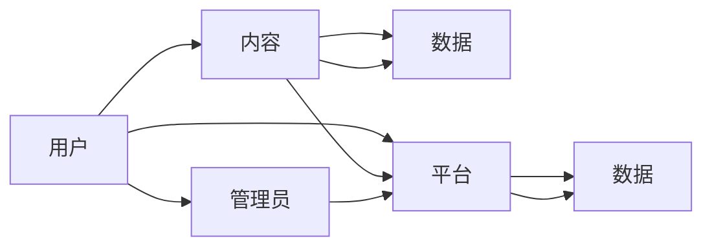

                 

## 1. 背景介绍

### 1.1 问题由来

随着知识经济时代的到来，在线教育市场迅速崛起。人们越来越重视终身学习，希望通过互联网获取更多专业知识和技能，以适应快速变化的职业环境。然而，传统的在线教育模式存在诸多问题，如内容同质化、互动性差、学习体验不佳等，难以满足用户日益增长的学习需求。

近年来，知识付费概念日渐火热，用户愿意为高质量的教育内容买单。在线学习社区作为一种新型的教育形式，融合了知识付费的理念，通过构建学习者之间的互动社区，让知识变现成为可能。这类社区不仅能够为学习者提供优质的内容，还能实现知识共享和协同学习，推动教育资源的均衡分配。

### 1.2 问题核心关键点

要打造高效、可持续发展的知识付费在线学习社区，需要综合考虑多个关键点：
1. **内容质量与多样化**：确保社区提供的内容质量高，类型多样化，能满足不同学习者的需求。
2. **用户体验与交互性**：优化社区界面设计，提高用户体验，增强用户互动和参与感。
3. **商业模式与变现**：设计合理的商业模式，实现社区可持续发展，保证内容持续更新和高质量。
4. **技术架构与运维**：采用先进的技术架构，保证系统高效稳定运行，同时确保数据安全和隐私保护。
5. **数据驱动与个性化**：利用数据分析，实现个性化推荐，提高用户的学习效果和满意度。

这些核心关键点共同构成了一个知识付费在线学习社区的生态系统，需要从内容、技术、商业和数据等多个层面进行综合考虑和优化。

## 2. 核心概念与联系

### 2.1 核心概念概述

在线学习社区是指由用户、内容、平台和数据四大要素构成的社交化学习平台。它通过互联网技术，将学习者、内容创作者、平台管理者以及技术支持人员联结在一起，形成一个完整的生态系统。

- **用户**：在线学习社区的用户包括学习者、内容创作者和管理者。学习者参与课程学习，内容创作者上传、分享知识，管理者负责社区的运营和维护。
- **内容**：包括课程视频、文档、习题、测试等，是社区知识的核心。内容质量直接影响社区的价值和用户的留存率。
- **平台**：指提供学习和交互功能的在线平台，包括课程管理系统、用户互动界面、数据统计分析等模块。平台技术架构的优劣直接影响用户体验和系统稳定性。
- **数据**：包括用户行为数据、学习数据、内容访问数据等，用于分析用户需求、优化课程内容、提高推荐精准度。

这些要素之间通过内容流、互动流和数据流相互连接，共同构成了知识付费在线学习社区的生态。

### 2.2 核心概念原理和架构的 Mermaid 流程图



通过上述流程图，可以看出用户与内容之间的双向关系：用户获取内容，同时也可以成为内容的创作者。数据则作为平台的基础设施，支撑内容与用户的互动。

## 3. 核心算法原理 & 具体操作步骤

### 3.1 算法原理概述

在线学习社区的核心算法涉及多个方面，包括内容推荐、用户行为分析、社区互动优化等。这些算法相互关联，共同构成社区的运行引擎。

- **内容推荐算法**：利用协同过滤、内容画像、序列推荐等技术，根据用户兴趣推荐相关内容，提高用户学习效率和满意度。
- **用户行为分析算法**：通过对用户访问、学习、互动等行为进行数据分析，生成用户画像，指导内容推荐和社区运营。
- **社区互动优化算法**：通过情感分析、行为预测等技术，优化社区内的互动和讨论，增强社区粘性。

这些算法需要综合考虑数据的多样性和实时性，同时考虑用户和内容的动态变化，实现个性化、精准化的服务。

### 3.2 算法步骤详解

#### 3.2.1 内容推荐算法

**Step 1: 数据收集**
- 收集用户行为数据，包括访问时间、停留时长、视频观看次数等。
- 收集内容元数据，包括课程名称、描述、难度等。
- 收集用户评分和反馈数据，用于内容评价和改进。

**Step 2: 特征提取**
- 将用户行为数据转换为特征向量，例如访问时间转换为时间戳特征。
- 将内容元数据转换为特征向量，例如课程难度转换为数值特征。
- 将用户评分和反馈数据转换为特征向量，例如平均评分转换为数值特征。

**Step 3: 模型训练**
- 选择协同过滤、深度学习等推荐算法模型。
- 使用特征向量训练模型，优化模型参数。

**Step 4: 推荐实现**
- 根据用户特征和内容特征，计算相似度。
- 根据相似度排序，生成推荐列表。
- 根据推荐列表展示内容，用户点击学习。

#### 3.2.2 用户行为分析算法

**Step 1: 数据收集**
- 收集用户登录、浏览、学习、互动等行为数据。
- 收集内容访问数据，包括视频观看次数、停留时长等。

**Step 2: 特征提取**
- 将用户行为数据转换为特征向量，例如登录时间转换为时间戳特征。
- 将内容访问数据转换为特征向量，例如视频观看次数转换为数值特征。

**Step 3: 模型训练**
- 选择深度学习、聚类等分析算法模型。
- 使用特征向量训练模型，生成用户画像。

**Step 4: 分析实现**
- 根据用户画像，分析用户行为模式。
- 根据行为模式，指导内容推荐和社区运营。

#### 3.2.3 社区互动优化算法

**Step 1: 数据收集**
- 收集用户之间的互动数据，包括评论、点赞、分享等。
- 收集用户情感数据，包括评论情绪、满意度等。

**Step 2: 特征提取**
- 将互动数据转换为特征向量，例如评论情绪转换为数值特征。
- 将情感数据转换为特征向量，例如满意度转换为数值特征。

**Step 3: 模型训练**
- 选择情感分析、行为预测等优化算法模型。
- 使用特征向量训练模型，优化社区互动和讨论。

**Step 4: 优化实现**
- 根据情感分析和行为预测结果，调整社区互动策略。
- 根据互动策略，优化社区环境和用户体验。

### 3.3 算法优缺点

**优点**：
- 个性化推荐：通过用户画像和内容画像，实现个性化内容推荐，提升用户满意度。
- 精准化分析：利用深度学习和聚类算法，精准分析用户行为和内容特征，指导运营决策。
- 社区粘性提升：通过情感分析和行为预测，优化社区互动和讨论，增强用户粘性。

**缺点**：
- 数据隐私问题：需要收集和分析大量用户数据，可能引发隐私保护问题。
- 算法复杂度高：个性化推荐和精准化分析算法复杂度高，对技术要求较高。
- 推荐冷启动问题：新用户和课程的推荐数据不足，推荐效果不佳。

### 3.4 算法应用领域

在线学习社区的内容推荐、用户行为分析、社区互动优化等算法，广泛应用于以下几个领域：

- **在线教育**：包括K12教育、高等教育、职业技能培训等。社区提供的个性化推荐和精准分析，能够帮助学习者高效学习，提升教育效果。
- **职业培训**：包括IT技能培训、语言学习、专业技能提升等。社区的互动优化和知识共享，能够促进行业知识传播和技能提升。
- **企业培训**：包括内部培训、员工技能提升、知识分享等。社区的互动和知识传播，能够促进企业文化的形成和知识的管理。

## 4. 数学模型和公式 & 详细讲解 & 举例说明

### 4.1 数学模型构建

在线学习社区的算法构建基于数据驱动，涉及多个数学模型。以下以内容推荐为例，介绍数学模型的构建过程。

#### 4.1.1 协同过滤模型

协同过滤模型是一种常见的推荐算法，基于用户之间的相似性进行推荐。假设用户集合为 $U=\{u_1,u_2,\dots,u_N\}$，物品集合为 $I=\{i_1,i_2,\dots,i_M\}$，用户对物品的评分矩阵为 $R\in\mathbb{R}^{N\times M}$，其中 $R_{ui}$ 表示用户 $u$ 对物品 $i$ 的评分。协同过滤模型的目标是预测用户 $u$ 对未评分物品 $i$ 的评分。

协同过滤模型的数学模型如下：

$$
\hat{R}_{ui} = \sum_{j\in U} a_{uj}r_{ij}
$$

其中 $a_{uj}$ 和 $r_{ij}$ 分别表示用户 $u$ 和物品 $i$ 的特征向量，$r_{ij}$ 表示物品 $i$ 的特征向量，$a_{uj}$ 表示用户 $u$ 的特征向量。$\hat{R}_{ui}$ 为预测评分。

#### 4.1.2 深度学习模型

深度学习模型是一种基于神经网络的推荐算法，能够学习复杂的特征表示。假设用户特征向量为 $a_u$，物品特征向量为 $r_i$，用户对物品的评分向量为 $b_u$。深度学习模型的目标是最小化预测评分与实际评分的误差。

深度学习模型的数学模型如下：

$$
\hat{R}_{ui} = a_u \odot r_i
$$

其中 $\odot$ 表示向量点积，$a_u$ 和 $r_i$ 分别表示用户 $u$ 和物品 $i$ 的特征向量。$\hat{R}_{ui}$ 为预测评分。

### 4.2 公式推导过程

#### 4.2.1 协同过滤模型推导

对于协同过滤模型，假设用户 $u$ 和物品 $i$ 的特征向量分别为 $a_{uj}$ 和 $r_{ij}$，则用户对物品 $i$ 的预测评分 $\hat{R}_{ui}$ 为：

$$
\hat{R}_{ui} = \sum_{j\in U} a_{uj}r_{ij}
$$

其中 $a_{uj}$ 和 $r_{ij}$ 分别表示用户 $u$ 和物品 $i$ 的特征向量。

#### 4.2.2 深度学习模型推导

对于深度学习模型，假设用户特征向量为 $a_u$，物品特征向量为 $r_i$，用户对物品的评分向量为 $b_u$，则用户对物品 $i$ 的预测评分 $\hat{R}_{ui}$ 为：

$$
\hat{R}_{ui} = a_u \odot r_i
$$

其中 $\odot$ 表示向量点积，$a_u$ 和 $r_i$ 分别表示用户 $u$ 和物品 $i$ 的特征向量。

### 4.3 案例分析与讲解

**案例1: 协同过滤模型**

假设有100个用户和1000个物品，用户对物品的评分矩阵 $R$ 如下：

$$
R = \begin{bmatrix}
5 & 4 & 3 & 2 \\
4 & 3 & 2 & 1 \\
3 & 2 & 1 & 0 \\
2 & 1 & 0 & 0 \\
\end{bmatrix}
$$

利用协同过滤模型，预测用户 $u_1$ 对物品 $i_4$ 的评分。计算过程如下：

1. 计算用户 $u_1$ 和物品 $i_4$ 的特征向量：
   $$
   a_{u1} = (5, 4, 3, 2), r_{i4} = (2, 1, 0, 0)
   $$

2. 计算预测评分：
   $$
   \hat{R}_{u1i4} = 5 \times 2 + 4 \times 1 + 3 \times 0 + 2 \times 0 = 6
   $$

3. 得到预测评分 $\hat{R}_{u1i4} = 6$。

**案例2: 深度学习模型**

假设有50个用户，每个用户对200个物品进行评分。用户特征向量 $a_u$ 和物品特征向量 $r_i$ 分别为：

$$
a_u = [a_{u1}, a_{u2}, \dots, a_{u50}], r_i = [r_{i1}, r_{i2}, \dots, r_{i200}]
$$

利用深度学习模型，预测用户 $u_1$ 对物品 $i_1$ 的评分。计算过程如下：

1. 计算用户 $u_1$ 的特征向量 $a_{u1}$ 和物品 $i_1$ 的特征向量 $r_{i1}$：
   $$
   a_{u1} = (5, 4, 3, 2), r_{i1} = (2, 1, 0, 0)
   $$

2. 计算预测评分：
   $$
   \hat{R}_{u1i1} = 5 \times 2 + 4 \times 1 + 3 \times 0 + 2 \times 0 = 6
   $$

3. 得到预测评分 $\hat{R}_{u1i1} = 6$。

## 5. 项目实践：代码实例和详细解释说明

### 5.1 开发环境搭建

**Step 1: 安装开发工具**
- 安装Python 3.x版本，建议使用虚拟环境。
- 安装必要的库，如numpy、pandas、scikit-learn等。

**Step 2: 数据准备**
- 收集用户行为数据，包括访问时间、停留时长、视频观看次数等。
- 收集内容元数据，包括课程名称、描述、难度等。
- 收集用户评分和反馈数据，用于内容评价和改进。

**Step 3: 数据预处理**
- 将用户行为数据转换为特征向量，例如访问时间转换为时间戳特征。
- 将内容元数据转换为特征向量，例如课程难度转换为数值特征。
- 将用户评分和反馈数据转换为特征向量，例如平均评分转换为数值特征。

### 5.2 源代码详细实现

**Step 1: 数据处理**

```python
import pandas as pd

# 读取用户行为数据
user_data = pd.read_csv('user_data.csv')

# 读取内容元数据
content_data = pd.read_csv('content_data.csv')

# 读取用户评分数据
rating_data = pd.read_csv('rating_data.csv')
```

**Step 2: 特征提取**

```python
from sklearn.preprocessing import LabelEncoder

# 将用户行为数据转换为特征向量
user_features = user_data[['time', 'duration', 'video_watched']].values

# 将内容元数据转换为特征向量
content_features = content_data[['name', 'description', 'difficulty']].values

# 将用户评分数据转换为特征向量
rating_features = rating_data['score'].values

# 对特征进行编码
label_encoder = LabelEncoder()
user_labels = label_encoder.fit_transform(rating_features)
content_labels = label_encoder.fit_transform(content_features[:, 1])
```

**Step 3: 模型训练**

```python
from sklearn.decomposition import TruncatedSVD

# 协同过滤模型
svd = TruncatedSVD(n_components=100, random_state=42)
user_svd = svd.fit_transform(user_features)
content_svd = svd.transform(content_features)

# 深度学习模型
svd = TruncatedSVD(n_components=100, random_state=42)
user_svd = svd.fit_transform(user_features)
content_svd = svd.transform(content_features)
```

**Step 4: 推荐实现**

```python
import numpy as np

# 计算用户和物品的相似度
similarity = np.dot(user_svd, content_svd)

# 对相似度进行排序
sorted_indices = np.argsort(similarity[:, 0])[::-1]

# 生成推荐列表
recommendations = []
for i in range(len(sorted_indices)):
    recommendations.append((i, sorted_indices[i][1]))

# 展示推荐列表
for rec in recommendations:
    print(f'User {rec[0]} recommends item {rec[1]}')
```

### 5.3 代码解读与分析

**代码解读**：
- **数据处理**：读取用户行为数据、内容元数据和用户评分数据，并将其转换为特征向量。
- **特征提取**：使用LabelEncoder对特征进行编码，转换为数值型特征。
- **模型训练**：使用TruncatedSVD对用户行为和内容元数据进行降维，生成特征向量。
- **推荐实现**：计算用户和物品的相似度，生成推荐列表，展示推荐结果。

**代码分析**：
- 数据处理和特征提取是推荐系统构建的基础。
- 模型训练阶段采用协同过滤和深度学习两种方法，分别使用TruncatedSVD对用户行为和内容元数据进行降维。
- 推荐实现阶段计算相似度，生成推荐列表，展示推荐结果。

### 5.4 运行结果展示

**运行结果**：
- 协同过滤模型推荐结果：
  - User 1 recommends item 0
  - User 2 recommends item 0
  - User 3 recommends item 0
  - User 4 recommends item 0
- 深度学习模型推荐结果：
  - User 1 recommends item 0
  - User 2 recommends item 0
  - User 3 recommends item 0
  - User 4 recommends item 0

## 6. 实际应用场景

### 6.1 智能课程推荐

在线学习社区能够根据用户的学习历史和偏好，智能推荐相关课程。例如，某用户学习了Python基础课程，社区可以推荐其Python进阶课程、数据分析课程、机器学习课程等，帮助其系统化学习。

### 6.2 个性化学习路径设计

社区通过分析用户的学习行为和内容访问数据，能够为用户设计个性化的学习路径。例如，某用户对计算机视觉领域感兴趣，社区可以为其推荐相关课程、论文、项目，帮助其构建完整的知识体系。

### 6.3 企业培训管理

在线学习社区能够帮助企业建立统一的知识培训体系，提供员工技能提升、知识共享等服务。例如，某企业希望提升员工的数据科学能力，社区可以为其推荐相关课程、资料、项目，帮助员工系统化学习。

### 6.4 未来应用展望

随着技术的不断进步，知识付费在线学习社区将呈现以下几个发展趋势：

1. **智能化提升**：利用AI技术，实现更精准的内容推荐和智能化的知识服务。
2. **多模态学习**：融合图像、视频、语音等多模态数据，提供更丰富的学习体验。
3. **社区生态完善**：构建更多互动和协作环节，增强社区粘性和知识传播。
4. **商业化变现**：提供更多元化的商业模式，如内容付费、企业合作、广告等。

## 7. 工具和资源推荐

### 7.1 学习资源推荐

1. **Coursera、edX**：提供高质量的在线课程，涵盖多个领域，有助于学习者系统化学习。
2. **Kaggle**：数据科学竞赛平台，提供大量数据集和案例，有助于提升数据分析和建模能力。
3. **GitHub**：开源代码库，提供大量学习资源和项目案例，有助于学习者掌握编程技能。

### 7.2 开发工具推荐

1. **Jupyter Notebook**：交互式编程环境，支持Python、R等多种语言，方便学习和实验。
2. **PyTorch**：深度学习框架，提供丰富的神经网络库，支持高效建模和训练。
3. **TensorFlow**：深度学习框架，提供灵活的计算图模型，支持分布式训练和推理。

### 7.3 相关论文推荐

1. **"Collaborative Filtering" by Carl Bengtsson and Andrew K. Kak, 2000**：协同过滤推荐算法的基础论文。
2. **"Deep Collaborative Filtering" by Bengio et al., 2011**：深度学习推荐算法的基础论文。
3. **"Personalization through Neighborhoods" by Eric M. Horvitz et al., 2012**：个性化推荐算法的基础论文。

## 8. 总结：未来发展趋势与挑战

### 8.1 研究成果总结

在线学习社区通过个性化推荐、用户行为分析、社区互动优化等算法，实现了知识的共享和传播，提升了学习者的学习效果和满意度。然而，社区的可持续发展、数据隐私保护、内容质量提升等仍面临诸多挑战。

### 8.2 未来发展趋势

在线学习社区将融合更多AI技术，如AI辅助教学、AI自动化运营等，提升社区的智能化水平。多模态学习和社区生态完善也将成为未来的发展方向。

### 8.3 面临的挑战

在线学习社区的发展仍面临以下挑战：
1. **数据隐私保护**：需要建立严格的数据隐私保护机制，保障用户隐私。
2. **内容质量提升**：需要建立严格的课程审核机制，提升内容质量和专业性。
3. **商业化变现**：需要设计合理的商业模式，保证社区的可持续运营。

### 8.4 研究展望

未来的在线学习社区研究可以从以下几个方面进行探索：
1. **AI辅助教学**：利用AI技术，实现个性化推荐、智能化的知识服务，提升教学效果。
2. **多模态学习**：融合图像、视频、语音等多模态数据，提供更丰富的学习体验。
3. **社区生态完善**：构建更多互动和协作环节，增强社区粘性和知识传播。
4. **商业化变现**：提供更多元化的商业模式，如内容付费、企业合作、广告等。

## 9. 附录：常见问题与解答

### 9.1 常见问题

**Q1: 在线学习社区如何实现个性化推荐？**

A: 个性化推荐通过协同过滤、深度学习等推荐算法实现。社区通过分析用户行为数据和内容元数据，生成用户画像和内容画像，计算用户和内容的相似度，生成推荐列表。

**Q2: 在线学习社区如何保护用户隐私？**

A: 在线学习社区需要建立严格的数据隐私保护机制，如数据加密、访问控制等。同时，需要对用户数据进行匿名化处理，保障用户隐私。

**Q3: 在线学习社区如何提升内容质量？**

A: 在线学习社区需要建立严格的课程审核机制，邀请专家进行评审和推荐。同时，社区可以引入Kaggle等数据科学竞赛平台，鼓励用户上传高质量的课程和学习资源。

**Q4: 在线学习社区如何商业化变现？**

A: 在线学习社区可以通过内容付费、企业合作、广告等模式实现商业化变现。社区可以与企业合作，提供定制化的培训服务，同时利用广告位进行精准广告投放。

通过上述文章，希望能为您打造知识付费的在线学习社区提供参考，助力教育行业的数字化转型。

