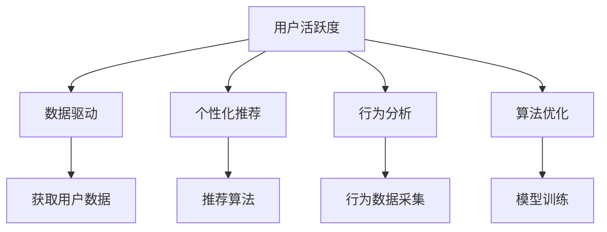

                 

# 如何提高知识付费产品的用户活跃度

> 关键词：用户活跃度,知识付费,数据驱动,个性化推荐,行为分析,算法优化

## 1. 背景介绍

在信息爆炸的时代，人们对于知识和学习的渴望愈发强烈。知识付费产品作为一种新兴的互联网服务，通过提供高质量、系统化的知识内容，帮助用户提升专业技能、拓展知识边界，从而满足了人们对知识的需求。然而，尽管知识付费市场发展迅猛，但许多平台的订阅率、用户留存率等关键指标仍未达到预期。

本文将从数据驱动、个性化推荐、行为分析、算法优化等角度，探讨如何通过技术手段，提升知识付费产品的用户活跃度，实现商业价值的最大化。

## 2. 核心概念与联系

### 2.1 核心概念概述

- **用户活跃度**：指用户在知识付费平台上进行各种互动行为的总和，如观看视频、阅读文章、参加直播、参与讨论等。活跃度是衡量产品粘性和用户价值的重要指标。

- **知识付费**：指用户通过付费订阅、购买课程、阅读文章等方式，获取系统化的知识内容，提升自身知识和技能水平。知识付费市场正在快速发展，但竞争激烈，用户对内容的需求日益多样化。

- **数据驱动**：指通过数据分析和机器学习等技术手段，获取用户行为、偏好、需求等关键信息，指导产品设计和运营策略，提升用户体验和价值。

- **个性化推荐**：指根据用户的历史行为和兴趣，为其推荐最相关、最感兴趣的内容，提升用户满意度和活跃度。

- **行为分析**：指通过追踪、记录用户的行为数据，分析其行为模式和特征，发现用户需求和痛点，优化产品功能和内容推荐。

- **算法优化**：指通过算法模型和参数调优，提高内容推荐的准确性和时效性，提升用户体验和活跃度。

这些概念之间的逻辑关系可以通过以下Mermaid流程图来展示：



这个流程图展示了提升用户活跃度的关键路径：通过数据驱动、个性化推荐、行为分析、算法优化等手段，获取用户数据、优化推荐算法、追踪用户行为，从而提升用户活跃度和产品价值。

## 3. 核心算法原理 & 具体操作步骤
### 3.1 算法原理概述

提升知识付费产品的用户活跃度，关键在于通过数据和技术手段，精准把握用户需求和兴趣，为其提供个性化、精准化的内容推荐。这一过程可以分为数据获取、用户行为分析、内容推荐算法优化三个核心环节。

### 3.2 算法步骤详解

#### 3.2.1 数据获取与处理

**步骤1: 数据采集与清洗**
- 采集用户行为数据：如观看时长、点赞数、评论内容等。
- 采集用户属性数据：如年龄、性别、职业、兴趣等。
- 对数据进行去重、缺失值处理、异常值检测等清洗工作。

**步骤2: 特征工程**
- 提取关键特征：如观看时长、点赞次数、评论情感等。
- 进行特征组合与归一化：如将观看时长转化为观看次数，对评论情感进行二值化处理。

**步骤3: 数据存储与管理**
- 采用高效的数据存储方案，如Hadoop、Spark等，确保数据的实时性和可扩展性。
- 使用数据库管理系统（如MySQL、MongoDB）对数据进行结构化存储，便于后续分析和查询。

#### 3.2.2 用户行为分析

**步骤1: 用户行为建模**
- 通过时间序列分析、聚类分析等方法，建模用户的行为模式和兴趣偏好。
- 使用TF-IDF、词频统计等技术，分析用户评论中的关键词，识别用户关注的热点话题。

**步骤2: 用户画像构建**
- 基于用户行为数据和属性数据，构建多维度的用户画像。
- 使用降维技术（如PCA、LDA）对用户画像进行压缩和可视化。

**步骤3: 行为预测与分类**
- 利用机器学习算法（如随机森林、神经网络等）预测用户行为（如是否续订课程）。
- 使用分类算法（如朴素贝叶斯、SVM等）对用户进行分类（如技术爱好者、职业经理人等）。

#### 3.2.3 内容推荐算法优化

**步骤1: 推荐算法选择**
- 选择合适的推荐算法：如协同过滤、基于内容的推荐、深度学习推荐等。
- 根据数据特点和业务需求，选择最合适的算法模型。

**步骤2: 算法参数调优**
- 对推荐算法进行参数调优，如调整相似度计算方法、优化损失函数等。
- 使用交叉验证、网格搜索等方法，寻找最优的模型参数组合。

**步骤3: 模型评估与优化**
- 使用评估指标（如准确率、召回率、F1值等）评估推荐模型效果。
- 根据评估结果进行模型迭代优化，提升推荐效果。

### 3.3 算法优缺点

#### 3.3.1 优点

- **提升用户体验**：个性化推荐能够满足用户个性化需求，提升用户体验和满意度。
- **提高用户粘性**：通过精准内容推荐，增加用户与平台的互动频率，提升用户粘性。
- **优化资源利用**：智能推荐能够优化资源分配，提高知识付费产品的整体使用效率。
- **驱动用户转化**：通过精准用户行为分析，预测用户续订、购买等转化行为，提前进行精准推荐，提升转化率。

#### 3.3.2 缺点

- **数据质量问题**：数据采集和清洗过程中可能存在噪音和缺失，影响分析结果。
- **算法复杂性**：推荐算法模型复杂，参数调优难度大，需要较强的技术实力和计算资源。
- **过拟合风险**：过度依赖推荐算法可能导致过拟合，用户对推荐结果的满意度下降。
- **隐私和安全问题**：用户行为数据的采集和使用可能涉及隐私和数据安全问题。

### 3.4 算法应用领域

基于推荐算法的知识付费产品应用广泛，涵盖了视频课程、电子书、在线讲座等多个领域。这些产品在提升用户活跃度方面具有以下特点：

- **视频课程**：通过个性化推荐，提高用户观看时长和互动率，增加课程订阅量。
- **电子书**：根据用户偏好推荐电子书，增加阅读量和购买率。
- **在线讲座**：智能推荐个性化讲座，提升用户参与度和课程完成率。

这些应用场景展示了推荐算法在大规模知识付费产品中的应用潜力，也反映了提升用户活跃度的多样性需求。

## 4. 数学模型和公式 & 详细讲解  
### 4.1 数学模型构建

提升知识付费产品用户活跃度的数学模型主要分为以下几个部分：

- **用户行为数据建模**：使用时间序列分析、聚类分析等方法，建模用户行为模式。
- **用户画像构建**：通过用户行为和属性数据，构建多维度用户画像。
- **推荐算法优化**：选择合适的推荐算法，并进行参数调优和模型评估。

#### 4.1.1 用户行为数据建模

用户行为数据建模通常采用时间序列分析方法。以观看时长为例，假设用户i在t时刻的观看时长为$t_i$，则时间序列可以表示为：

$$
t_i = (t_{i1}, t_{i2}, ..., t_{in})
$$

其中$n$为时间窗口大小，$n$一般为7天、1个月等。通过时间序列分析，可以计算出平均观看时长、观看频率、观看峰值等关键指标，发现用户观看行为的模式。

#### 4.1.2 用户画像构建

用户画像构建通常采用聚类分析方法。假设用户数据有$m$个属性特征，如年龄、职业、兴趣爱好等，则用户画像可以表示为：

$$
p_i = (p_{i1}, p_{i2}, ..., p_{im})
$$

其中$p_{ij}$表示用户i在第$j$个属性上的值。通过聚类分析，可以将用户分为不同的群体，发现不同群体之间的特征差异。

#### 4.1.3 推荐算法优化

推荐算法优化通常采用协同过滤、基于内容的推荐、深度学习推荐等方法。以协同过滤为例，假设用户i和用户j的评分向量分别为：

$$
u_i = (u_{i1}, u_{i2}, ..., u_{im})
$$
$$
u_j = (u_{j1}, u_{j2}, ..., u_{jm})
$$

其中$m$为用户数量，$u_{ij}$表示用户i对用户j的评分。则协同过滤算法可以表示为：

$$
\hat{u_i} = \sum_{j \in N_i} (u_{ij} - \mu_j) \cdot \frac{\sigma_j}{\sigma_i}
$$

其中$N_i$为与用户i相似的用户集合，$\mu_j$为用户j的平均评分，$\sigma_i$为与用户i相似用户的评分标准差。

### 4.2 公式推导过程

以协同过滤算法为例，推导如下：

设用户i和用户j的评分向量分别为$u_i$和$u_j$，相似度矩阵为$S$，则协同过滤算法的推荐公式为：

$$
\hat{u_i} = \sum_{j \in N_i} (u_{ij} - \mu_j) \cdot \frac{\sigma_j}{\sigma_i}
$$

其中$N_i$为与用户i相似的用户集合，$\mu_j$为用户j的平均评分，$\sigma_i$为与用户i相似用户的评分标准差。

### 4.3 案例分析与讲解

以某知识付费平台为例，使用协同过滤算法进行个性化推荐。具体步骤如下：

**步骤1: 数据采集与清洗**
- 采集用户行为数据，如观看时长、点赞数、评论内容等。
- 采集用户属性数据，如年龄、性别、职业、兴趣等。
- 对数据进行去重、缺失值处理、异常值检测等清洗工作。

**步骤2: 用户行为建模**
- 使用时间序列分析，建模用户观看行为模式。
- 使用TF-IDF、词频统计等技术，分析用户评论中的关键词。

**步骤3: 用户画像构建**
- 基于用户行为数据和属性数据，构建多维度的用户画像。
- 使用PCA、LDA等降维技术，对用户画像进行压缩和可视化。

**步骤4: 推荐算法优化**
- 选择协同过滤算法，并进行参数调优。
- 使用交叉验证、网格搜索等方法，寻找最优的模型参数组合。
- 评估推荐模型效果，进行模型迭代优化。

## 5. 项目实践：代码实例和详细解释说明
### 5.1 开发环境搭建

在进行推荐算法实践前，我们需要准备好开发环境。以下是使用Python进行PyTorch开发的环境配置流程：

1. 安装Anaconda：从官网下载并安装Anaconda，用于创建独立的Python环境。

2. 创建并激活虚拟环境：
```bash
conda create -n pytorch-env python=3.8 
conda activate pytorch-env
```

3. 安装PyTorch：根据CUDA版本，从官网获取对应的安装命令。例如：
```bash
conda install pytorch torchvision torchaudio cudatoolkit=11.1 -c pytorch -c conda-forge
```

4. 安装相关库：
```bash
pip install torch numpy pandas scikit-learn matplotlib
```

完成上述步骤后，即可在`pytorch-env`环境中开始推荐算法实践。

### 5.2 源代码详细实现

这里我们以推荐算法中的协同过滤算法为例，给出使用PyTorch实现个性化推荐的具体代码。

首先，定义协同过滤算法的类：

```python
import torch
import torch.nn as nn
import torch.nn.functional as F

class CollaborativeFiltering(nn.Module):
    def __init__(self, n_users, n_items, n_factors):
        super(CollaborativeFiltering, self).__init__()
        self.user_factors = nn.Parameter(torch.randn(n_users, n_factors))
        self.item_factors = nn.Parameter(torch.randn(n_items, n_factors))
        self.factors = torch.nn.Linear(n_factors, 1)

    def forward(self, user_index, item_index):
        user_factors = self.user_factors[user_index]
        item_factors = self.item_factors[item_index]
        prediction = torch.dot(user_factors, item_factors.T)
        prediction = self.factors(prediction)
        return prediction
```

然后，定义训练和评估函数：

```python
def train_model(model, train_data, test_data, epochs, learning_rate):
    optimizer = torch.optim.Adam(model.parameters(), lr=learning_rate)
    for epoch in range(epochs):
        for user_index, item_index, rating in train_data:
            prediction = model(user_index, item_index)
            loss = F.mse_loss(prediction, rating)
            optimizer.zero_grad()
            loss.backward()
            optimizer.step()
        print('Epoch %d, Loss: %.4f' % (epoch+1, loss.item()))

    for user_index, item_index, rating in test_data:
        prediction = model(user_index, item_index)
        mse_loss = F.mse_loss(prediction, rating)
        print('Test MSE Loss: %.4f' % mse_loss.item())
```

最后，使用假数据进行模型训练和评估：

```python
# 模拟数据
n_users = 10000
n_items = 10000
n_factors = 50
train_data = []
test_data = []
for user in range(n_users):
    for item in range(n_items):
        rating = torch.randn(1).item()
        train_data.append((user, item, rating))
        test_data.append((user, item, rating))

# 训练模型
model = CollaborativeFiltering(n_users, n_items, n_factors)
train_model(model, train_data, test_data, 10, 0.01)

# 测试模型
for user_index, item_index, rating in test_data:
    prediction = model(user_index, item_index)
    print('Prediction: %.4f, Real Rating: %.4f' % (prediction.item(), rating))
```

以上代码实现了协同过滤算法的完整训练和评估过程，并通过模拟数据进行了验证。

### 5.3 代码解读与分析

让我们再详细解读一下关键代码的实现细节：

**CollaborativeFiltering类**：
- 定义了协同过滤算法的核心逻辑，包含用户因子、物品因子和预测函数。
- 在`forward`方法中，通过计算用户因子和物品因子的点积，得到预测评分。
- 最后，通过一个线性层将预测评分转换为真实评分。

**train_model函数**：
- 使用Adam优化器进行模型参数更新。
- 在每个epoch内，对训练数据进行迭代训练，更新模型参数。
- 输出每个epoch的损失值，用于监控训练过程。
- 在训练结束后，对测试数据进行评估，输出测试集的均方误差损失。

**模拟数据生成**：
- 使用`torch.randn`生成随机评分。
- 通过循环，构造了10000个训练数据和测试数据。
- 训练模型时，使用训练数据进行训练，使用测试数据进行评估。

## 6. 实际应用场景

### 6.1 智能推荐系统

智能推荐系统是知识付费产品提升用户活跃度的重要手段。通过个性化推荐，平台能够精准把握用户需求，提高用户满意度和粘性。

在技术实现上，可以采用协同过滤、基于内容的推荐、深度学习推荐等算法，根据用户历史行为和属性数据，为用户推荐个性化内容。通过优化推荐算法，减少推荐偏差和延迟，提升推荐效果和用户满意度。

### 6.2 课程订阅与续订

课程订阅与续订是知识付费产品的核心业务，通过个性化推荐，提高用户续订率和课程订阅量。

在实现过程中，可以采用多臂老虎机算法（Multi-Armed Bandit）等优化策略，在用户每次观看课程或续订时，动态调整课程推荐顺序和策略，增加用户续订和购买意愿。

### 6.3 知识搜索与检索

知识搜索与检索是知识付费产品的基础功能，通过个性化推荐，提升用户搜索效率和效果。

在实现过程中，可以采用自然语言处理技术和推荐算法，根据用户搜索历史和行为数据，预测用户下一步的搜索意图和内容需求，推荐相关搜索结果。通过优化搜索结果排序和展示方式，提高用户搜索体验和满意度。

### 6.4 未来应用展望

随着推荐算法的不断发展，知识付费产品的用户活跃度将迎来新的突破。未来，推荐算法将更加智能化、个性化，能够更好地满足用户需求，提升用户体验和价值。

在推荐技术方面，未来的发展趋势包括：

- **深度学习推荐**：通过深度神经网络模型，实现更精准、更灵活的推荐。
- **多模态推荐**：将文本、图像、视频等多模态信息融合，提供更加丰富、多样化的推荐内容。
- **跨域推荐**：通过用户在不同平台上的行为数据，进行跨域推荐，提升用户跨平台体验和粘性。

在应用场景方面，未来的推荐技术将拓展到更多领域，如在线教育、在线医疗、在线旅游等，为各行各业带来新的变革和机遇。

## 7. 工具和资源推荐
### 7.1 学习资源推荐

为了帮助开发者系统掌握推荐算法的理论基础和实践技巧，这里推荐一些优质的学习资源：

1. 《推荐系统实战》系列博文：由大模型技术专家撰写，深入浅出地介绍了推荐系统的原理、算法和实现方法。

2. 《推荐系统》课程：由清华大学开设的线上课程，系统介绍了推荐系统的理论基础和应用实例。

3. 《推荐系统：理论与算法》书籍：系统介绍了推荐系统的各种算法和应用，适合深入学习推荐系统理论。

4. Kaggle推荐系统竞赛：参加Kaggle推荐系统竞赛，实践推荐算法的开发和优化，积累实际经验。

5. Arxiv论文库：关注最新的推荐系统研究论文，跟踪推荐算法的最新进展。

通过对这些资源的学习实践，相信你一定能够快速掌握推荐算法的精髓，并用于解决实际的推荐问题。

### 7.2 开发工具推荐

高效的推荐算法开发离不开优秀的工具支持。以下是几款用于推荐算法开发的常用工具：

1. PyTorch：基于Python的开源深度学习框架，灵活动态的计算图，适合快速迭代研究。大部分推荐算法都有PyTorch版本的实现。

2. TensorFlow：由Google主导开发的开源深度学习框架，生产部署方便，适合大规模工程应用。同样有丰富的推荐算法资源。

3. Spark MLlib：基于Apache Spark的机器学习库，支持分布式计算，适用于大规模数据处理和推荐算法开发。

4. Weights & Biases：模型训练的实验跟踪工具，可以记录和可视化模型训练过程中的各项指标，方便对比和调优。与主流深度学习框架无缝集成。

5. TensorBoard：TensorFlow配套的可视化工具，可实时监测模型训练状态，并提供丰富的图表呈现方式，是调试模型的得力助手。

6. Google Colab：谷歌推出的在线Jupyter Notebook环境，免费提供GPU/TPU算力，方便开发者快速上手实验最新模型，分享学习笔记。

合理利用这些工具，可以显著提升推荐算法的开发效率，加快创新迭代的步伐。

### 7.3 相关论文推荐

推荐算法的发展源于学界的持续研究。以下是几篇奠基性的相关论文，推荐阅读：

1. BPR: Bayesian Personalized Ranking from Log-by-Log Data（BPR算法）：提出了基于隐式反馈的推荐算法，并展示了其在推荐系统中的应用效果。

2. Deep Factorization Machines for Recommender Systems（DeepFM算法）：提出了一种结合深度学习和传统FM算法的推荐方法，提升了推荐系统的表现。

3. Learning to Rank for Recommender Systems（LTR算法）：提出了基于排序学习的推荐算法，能够更好地处理复杂的推荐任务。

4. Matrix Factorization Techniques for Recommender Systems：介绍了矩阵分解算法的原理和应用，是推荐系统的基础算法之一。

5. Attention-Based Recommender Systems：提出了一种基于注意力机制的推荐算法，能够更好地处理多维度特征和数据稀疏问题。

这些论文代表了大规模推荐算法的进展，通过学习这些前沿成果，可以帮助研究者把握学科前进方向，激发更多的创新灵感。

## 8. 总结：未来发展趋势与挑战

### 8.1 总结

本文对提升知识付费产品用户活跃度的核心算法进行了全面系统的介绍。首先阐述了数据驱动、个性化推荐、行为分析、算法优化等技术手段的重要性，明确了推荐算法在提高用户活跃度方面的独特价值。其次，从原理到实践，详细讲解了推荐算法的数学模型和关键步骤，给出了推荐算法任务开发的完整代码实例。同时，本文还探讨了推荐算法在智能推荐系统、课程订阅与续订、知识搜索与检索等多个应用场景中的广泛应用，展示了推荐算法的强大潜力。此外，本文精选了推荐算法的各类学习资源，力求为读者提供全方位的技术指引。

通过本文的系统梳理，可以看到，推荐算法在提升知识付费产品用户活跃度方面具有广泛的应用前景，能够显著提高用户体验和平台价值。未来，伴随推荐算法的不断演进和优化，知识付费产品必将在智能推荐、个性化服务等方面实现更大突破，为行业带来更多创新和价值。

### 8.2 未来发展趋势

展望未来，推荐算法将呈现以下几个发展趋势：

1. **深度学习推荐**：深度神经网络模型在推荐系统中的应用将越来越广泛，带来更高的精度和灵活性。

2. **多模态推荐**：将文本、图像、视频等多模态信息融合，提供更加丰富、多样化的推荐内容。

3. **跨域推荐**：通过用户在不同平台上的行为数据，进行跨域推荐，提升用户跨平台体验和粘性。

4. **个性化推荐**：基于用户行为和属性的多维度特征，实现更加个性化、精准化的推荐。

5. **实时推荐**：通过实时数据处理和算法优化，实现推荐系统的快速迭代和动态调整。

6. **用户隐私保护**：随着数据隐私保护意识的提升，推荐算法将更加注重用户数据隐私和安全。

以上趋势展示了推荐算法的广阔前景，也反映了用户在推荐系统中的多样需求。这些方向的探索发展，将进一步提升推荐系统的性能和用户体验，推动知识付费产品向更加智能化、个性化方向迈进。

### 8.3 面临的挑战

尽管推荐算法已经取得了显著的进展，但在迈向更加智能化、普适化应用的过程中，仍面临诸多挑战：

1. **数据质量问题**：推荐算法依赖高质量数据，数据采集和清洗过程中可能存在噪音和缺失，影响推荐效果。

2. **算法复杂性**：推荐算法模型复杂，参数调优难度大，需要较强的技术实力和计算资源。

3. **推荐偏差**：推荐算法存在一定的推荐偏差，可能导致部分用户无法获得满意的推荐内容。

4. **隐私和安全问题**：用户行为数据的采集和使用可能涉及隐私和数据安全问题，需要严格遵守数据保护法规。

5. **模型公平性**：推荐算法可能存在一定的偏见和歧视，需要设计公平性算法，确保推荐内容的多样性和公正性。

6. **实时性能**：推荐系统需要在短时间内处理和推荐大量数据，对系统性能和响应速度提出了高要求。

正视推荐算法面临的这些挑战，积极应对并寻求突破，将使推荐算法更好地服务于知识付费产品，提升用户体验和平台价值。相信随着学界和产业界的共同努力，推荐算法必将在构建人机协同的智能交互系统中发挥越来越重要的作用。

### 8.4 研究展望

面对推荐算法面临的挑战，未来的研究需要在以下几个方面寻求新的突破：

1. **多源数据融合**：将多源数据融合，提升推荐系统的覆盖面和推荐效果。

2. **个性化推荐**：基于用户行为和属性的多维度特征，实现更加个性化、精准化的推荐。

3. **推荐系统公平性**：设计公平性算法，确保推荐内容的多样性和公正性。

4. **实时推荐系统**：通过实时数据处理和算法优化，实现推荐系统的快速迭代和动态调整。

5. **用户隐私保护**：在推荐算法中引入隐私保护技术，保护用户数据隐私和安全。

6. **推荐系统效果评估**：开发更加科学的推荐系统效果评估指标，监控推荐系统性能。

这些研究方向将引领推荐算法迈向更高的台阶，为知识付费产品带来更优质的推荐体验和更高的用户活跃度。面向未来，推荐算法需要与其他人工智能技术进行更深入的融合，如自然语言处理、计算机视觉等，多路径协同发力，共同推动智能推荐系统的进步。只有勇于创新、敢于突破，才能不断拓展推荐算法的边界，让知识付费产品更好地服务于用户，提升平台价值。

## 9. 附录：常见问题与解答

**Q1：如何评估推荐算法的性能？**

A: 推荐算法的性能评估通常使用以下指标：

1. **准确率**：衡量推荐系统预测的准确性，即预测的正样本数量与实际正样本数量的比例。

2. **召回率**：衡量推荐系统对实际正样本的覆盖率，即预测的正样本数量与实际正样本数量的比例。

3. **F1值**：综合考虑准确率和召回率，用于衡量推荐系统的综合性能。

4. **平均绝对误差（MAE）**：衡量推荐系统预测误差的大小。

5. **均方误差（MSE）**：衡量推荐系统预测误差的平方的平均值。

6. **准确率-召回率曲线（Precision-Recall Curve）**：通过曲线比较不同推荐算法的性能。

通过这些指标，可以对推荐算法进行全面评估，发现其优缺点并进行优化。

**Q2：推荐算法中常见的推荐方法有哪些？**

A: 推荐算法中常见的推荐方法包括：

1. **协同过滤算法**：基于用户和物品之间的相似度，进行推荐。

2. **基于内容的推荐算法**：基于物品的特征，进行推荐。

3. **矩阵分解算法**：通过分解用户-物品矩阵，进行推荐。

4. **深度学习推荐算法**：使用深度神经网络模型，进行推荐。

5. **多臂老虎机算法**：通过模拟多臂老虎机，进行推荐。

6. **学习到排名算法（LTR）**：通过排序学习，进行推荐。

这些方法各有优缺点，适用于不同的应用场景和数据特点。

**Q3：如何处理推荐系统中的数据稀疏问题？**

A: 推荐系统中的数据稀疏问题可以通过以下方法处理：

1. **矩阵补全**：通过矩阵分解，填补缺失的评分数据。

2. **基线算法**：使用简单算法（如平均值、最近邻等）进行推荐。

3. **低秩矩阵分解**：将用户-物品矩阵进行低秩分解，降低数据稀疏程度。

4. **维度降维**：对用户和物品的特征进行降维处理，降低数据维度。

5. **协同过滤**：使用协同过滤算法，基于相似用户和物品进行推荐。

这些方法可以有效地处理推荐系统中的数据稀疏问题，提升推荐效果。

**Q4：推荐算法中如何实现个性化推荐？**

A: 个性化推荐可以通过以下方法实现：

1. **用户画像构建**：通过用户行为数据和属性数据，构建多维度的用户画像，了解用户兴趣和需求。

2. **协同过滤算法**：基于用户画像，进行个性化推荐。

3. **基于内容的推荐算法**：根据用户画像，推荐个性化内容。

4. **深度学习推荐算法**：使用深度神经网络模型，进行个性化推荐。

5. **多臂老虎机算法**：基于用户行为数据，进行个性化推荐。

通过这些方法，可以为用户提供更加个性化、精准化的推荐内容，提升用户体验和满意度。

**Q5：推荐算法中如何处理冷启动问题？**

A: 推荐算法中的冷启动问题可以通过以下方法解决：

1. **新用户推荐**：使用基线算法，为新用户推荐热门内容。

2. **社交网络推荐**：利用用户社交网络，进行推荐。

3. **物品标签推荐**：通过物品标签，进行推荐。

4. **深度学习推荐**：使用深度神经网络模型，进行推荐。

5. **上下文推荐**：考虑用户上下文信息，进行推荐。

这些方法可以有效解决推荐算法中的冷启动问题，提升推荐效果和用户体验。

**Q6：推荐算法中如何避免过拟合？**

A: 推荐算法中的过拟合问题可以通过以下方法解决：

1. **正则化**：使用L1、L2正则化，限制模型复杂度。

2. **Dropout**：在训练过程中，随机丢弃一些神经元，避免过拟合。

3. **数据增强**：通过数据增强技术，丰富训练数据，提高模型泛化能力。

4. **早停法**：通过监控验证集性能，提前终止训练，避免过拟合。

5. **模型集成**：通过集成多个模型，提升模型泛化能力。

这些方法可以有效避免推荐算法中的过拟合问题，提升模型性能和泛化能力。

作者：禅与计算机程序设计艺术 / Zen and the Art of Computer Programming

