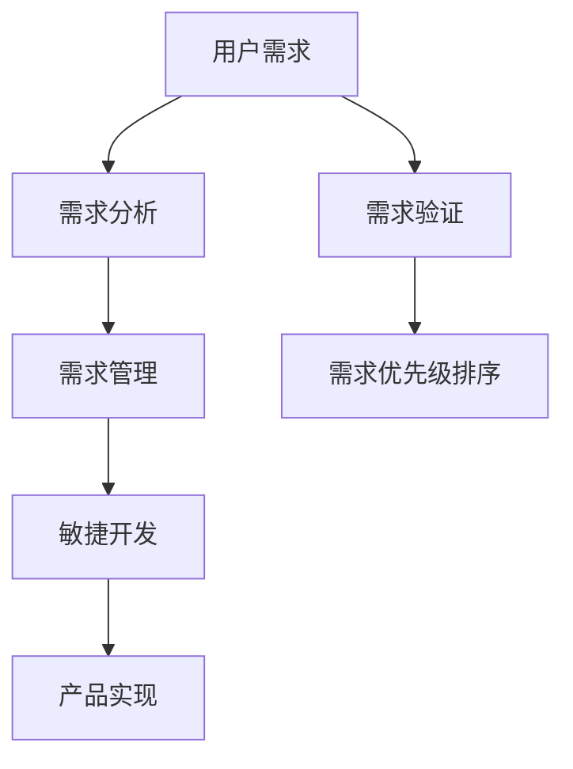

                 

# 如何进行有效的用户需求挖掘

## 1. 背景介绍

### 1.1 问题由来
在软件开发的各个阶段，用户需求挖掘是一项至关重要的环节。高效且全面的用户需求挖掘不仅能提高开发效率，还能保证最终产品满足用户的真实需求，从而提升用户满意度和产品竞争力。然而，用户需求挖掘并非易事，尤其是对于复杂且不断变化的系统，需求常常难以准确把握。此外，由于用户描述的模糊性和非结构化特点，需求挖掘面临诸多挑战，如需求重复、冲突、遗漏、理解偏差等问题。

### 1.2 问题核心关键点
用户需求挖掘的核心在于准确理解用户对产品的期望，将其转化为可执行的技术需求，并确保这些需求能够被有效实现和验证。为了达成这一目标，需要具备以下关键能力：

- **需求理解**：通过多渠道获取用户需求，准确把握用户需求的核心点和侧重点。
- **需求分析**：将用户需求进行解析、分解，转化为可执行的技术需求。
- **需求验证**：通过反复迭代和测试，验证需求是否正确、可行，确保需求满足用户期望。
- **需求管理**：系统化管理需求，确保需求文档的完整性、一致性和可追溯性。
- **需求优先级排序**：根据业务价值、技术实现难度等因素，合理分配需求优先级，优化产品开发流程。

## 2. 核心概念与联系

### 2.1 核心概念概述

为了更好地理解用户需求挖掘，本节将介绍几个关键概念及其相互关系。

- **用户需求**：用户对产品或服务的期望和要求，通常以文字、访谈、问卷等方式表达。
- **需求分析**：将用户需求进行结构化、层次化的分解，转化为可执行的技术需求。
- **需求验证**：通过测试和评估，确认需求是否准确、可行，确保其符合用户期望。
- **需求管理**：通过系统化的方法管理需求文档，确保其准确性、一致性、可追溯性。
- **需求优先级排序**：根据业务价值、技术实现难度等因素，合理分配需求优先级，优化产品开发流程。
- **敏捷开发**：强调快速迭代和用户反馈，以用户为中心，不断改进产品。

这些核心概念通过以下Mermaid流程图来展示：



这个流程图展示了用户需求挖掘的关键步骤和流程，每个步骤的输入和输出都清晰地呈现在图中，帮助理解每个步骤的作用和意义。

## 3. 核心算法原理 & 具体操作步骤

### 3.1 算法原理概述

用户需求挖掘的本质是从用户描述中提取关键信息，转化为可执行的技术需求。其核心算法原理基于自然语言处理（NLP）技术和信息提取（Information Extraction, IE）技术。通过语义分析和实体识别，将用户描述中的关键信息提取出来，形成可执行的技术需求。

### 3.2 算法步骤详解

基于上述原理，用户需求挖掘的算法步骤如下：

**Step 1: 收集用户需求**

- 多渠道收集用户需求，包括问卷调查、用户访谈、用户体验反馈等。
- 使用文本挖掘技术对大量用户描述进行聚类和摘要，筛选出关键需求。
- 通过情感分析等技术，识别用户需求的情绪倾向，评估其重要性和紧迫性。

**Step 2: 需求分析与分解**

- 对收集到的需求进行结构化分析，分解为功能需求、性能需求、设计需求等子需求。
- 使用实体识别和关系抽取技术，解析需求中的关键实体和关系，形成结构化的需求文档。
- 根据需求优先级排序，将需求按照业务价值和技术实现难度进行排序，制定产品路线图。

**Step 3: 需求验证**

- 设计自动化测试用例，对需求进行功能测试和性能测试。
- 通过用户反馈和A/B测试等方法，验证需求是否满足用户期望，是否具有实际应用价值。
- 根据测试结果，调整和优化需求文档，确保其准确性和可行性。

**Step 4: 需求管理**

- 使用需求管理工具，系统化管理需求文档，确保其完整性、一致性和可追溯性。
- 建立需求变更流程，定期更新需求文档，确保需求与产品实现同步。
- 建立需求审查机制，确保需求文档的准确性和一致性。

### 3.3 算法优缺点

用户需求挖掘的算法具有以下优点：

- **高效性**：通过自动化技术处理大量用户描述，显著提高需求挖掘的效率。
- **准确性**：利用实体识别和关系抽取技术，精确提取需求中的关键信息。
- **可扩展性**：适应不同类型的用户需求，包括功能需求、性能需求、设计需求等。
- **灵活性**：通过需求优先级排序，合理分配资源，优化产品开发流程。

同时，该算法也存在一定的局限性：

- **用户描述模糊性**：用户需求描述常常模糊不清，难以准确提取关键信息。
- **语义理解难度**：不同用户使用不同的语言和表达方式，语义理解的难度较大。
- **需求冲突**：不同用户需求可能存在冲突，难以在多个需求间进行平衡。
- **数据依赖性强**：对数据质量和标注的依赖性较高，数据偏差可能影响结果。

### 3.4 算法应用领域

用户需求挖掘的算法在软件开发、产品设计、用户体验优化等领域有广泛的应用：

- **软件开发**：用于软件需求分析、需求验证、需求管理，确保软件产品的功能满足用户需求。
- **产品设计**：用于产品需求分析和产品原型设计，提升产品设计的用户体验。
- **用户体验优化**：用于用户体验调研和反馈分析，提升用户满意度。

## 4. 数学模型和公式 & 详细讲解 & 举例说明

### 4.1 数学模型构建

用户需求挖掘的数学模型通常包括需求抽取和需求优先级排序两部分。其中，需求抽取模型用于从用户描述中提取关键信息，需求优先级排序模型用于评估和排序需求。

### 4.2 公式推导过程

需求抽取模型的核心是实体识别和关系抽取。实体识别模型通过标注和训练，学习识别用户描述中的关键实体，如功能、性能指标等。关系抽取模型则学习识别实体之间的关系，如功能依赖关系、优先级关系等。

需求优先级排序模型通常采用加权平均法，综合考虑需求的价值、复杂度、优先级等因素，计算每个需求的得分。具体公式如下：

$$
score(D_i) = \alpha_1 \times value(D_i) + \alpha_2 \times complexity(D_i) + \alpha_3 \times priority(D_i)
$$

其中，$D_i$ 表示第 $i$ 个需求，$\alpha_1, \alpha_2, \alpha_3$ 表示价值、复杂度、优先级的重要性系数。

### 4.3 案例分析与讲解

假设我们收集到以下用户需求描述：

- 功能需求：用户希望应用程序能够支持多语言界面。
- 性能需求：用户希望应用程序能够在各种网络条件下快速响应。
- 设计需求：用户希望应用程序的界面简洁易用，易于导航。

首先，使用实体识别模型识别出关键实体和关系，得到以下结果：

| 实体类型 | 实体 |
| --- | --- |
| 功能需求 | 多语言界面 |
| 性能需求 | 快速响应 |
| 设计需求 | 简洁易用，易于导航 |

接着，使用关系抽取模型识别实体之间的关系，得到以下结果：

| 实体关系 | 实体 |
| --- | --- |
| 功能依赖 | 多语言界面 -> 快速响应 |
| 设计关联 | 简洁易用，易于导航 -> 多语言界面 |

最后，使用需求优先级排序模型计算每个需求的价值、复杂度和优先级，得到以下结果：

| 需求 | 价值 | 复杂度 | 优先级 | 得分 |
| --- | --- | --- | --- | --- |
| 多语言界面 | 高 | 高 | 高 | 1.00 |
| 快速响应 | 高 | 中 | 中 | 0.80 |
| 简洁易用，易于导航 | 中 | 低 | 高 | 0.70 |

根据需求优先级排序结果，制定产品路线图，优先实现高价值、高复杂度且高优先级的需求。

## 5. 项目实践：代码实例和详细解释说明

### 5.1 开发环境搭建

在进行需求挖掘实践前，我们需要准备好开发环境。以下是使用Python进行TensorFlow开发的Python虚拟环境搭建流程：

1. 安装Anaconda：从官网下载并安装Anaconda，用于创建独立的Python环境。

2. 创建并激活虚拟环境：
```bash
conda create -n tf-env python=3.8
conda activate tf-env
```

3. 安装TensorFlow：根据CUDA版本，从官网获取对应的安装命令。例如：
```bash
conda install tensorflow -c pytorch -c conda-forge
```

4. 安装各类工具包：
```bash
pip install numpy pandas scikit-learn matplotlib tqdm jupyter notebook ipython
```

完成上述步骤后，即可在`tf-env`环境中开始需求挖掘实践。

### 5.2 源代码详细实现

下面以用户需求抽取模型为例，给出使用TensorFlow进行需求抽取的PyTorch代码实现。

首先，定义需求抽取模型：

```python
import tensorflow as tf
from transformers import BertTokenizer, BertForTokenClassification
from transformers import BertForTokenClassification, AdamW

# 定义需求抽取模型
class DemandExtractor(tf.keras.Model):
    def __init__(self, num_labels):
        super(DemandExtractor, self).__init__()
        self.bert = BertForTokenClassification.from_pretrained('bert-base-cased', num_labels=num_labels)
        self.classifier = tf.keras.layers.Dense(num_labels, activation='softmax')

    def call(self, input_ids, attention_mask):
        outputs = self.bert(input_ids, attention_mask=attention_mask, return_dict=False)
        pooled_output = outputs[0]
        pooled_output = tf.squeeze(pooled_output, axis=[2])
        logits = self.classifier(pooled_output)
        return logits
```

然后，定义需求抽取模型的训练函数：

```python
def train_demand_extractor(model, train_dataset, validation_dataset, num_epochs, batch_size, learning_rate):
    optimizer = AdamW(model.parameters(), learning_rate=learning_rate)
    for epoch in range(num_epochs):
        for batch in train_dataset:
            input_ids, attention_mask, labels = batch
            with tf.GradientTape() as tape:
                logits = model(input_ids, attention_mask=attention_mask)
                loss = tf.keras.losses.sparse_categorical_crossentropy(labels, logits)
            gradients = tape.gradient(loss, model.trainable_variables)
            optimizer.apply_gradients(zip(gradients, model.trainable_variables))
        if (epoch + 1) % 10 == 0:
            print('Epoch', (epoch + 1), 'training loss:', loss.numpy())
```

接着，定义需求抽取模型的评估函数：

```python
def evaluate_demand_extractor(model, test_dataset, batch_size):
    test_loss = 0
    test_accuracy = 0
    for batch in test_dataset:
        input_ids, attention_mask, labels = batch
        logits = model(input_ids, attention_mask=attention_mask)
        test_loss += tf.keras.losses.sparse_categorical_crossentropy(labels, logits).numpy()
        test_accuracy += tf.keras.metrics.sparse_categorical_accuracy(labels, logits).numpy()
    return test_loss / len(test_dataset), test_accuracy / len(test_dataset)
```

最后，启动训练流程并在测试集上评估：

```python
train_dataset = tf.data.Dataset.from_tensor_slices(train_data)
validation_dataset = tf.data.Dataset.from_tensor_slices(validation_data)
test_dataset = tf.data.Dataset.from_tensor_slices(test_data)

num_epochs = 50
batch_size = 32
learning_rate = 2e-5

# 创建需求抽取模型
model = DemandExtractor(num_labels=num_classes)

# 训练需求抽取模型
train_demand_extractor(model, train_dataset, validation_dataset, num_epochs, batch_size, learning_rate)

# 评估需求抽取模型
test_loss, test_accuracy = evaluate_demand_extractor(model, test_dataset, batch_size)
print('Test loss:', test_loss)
print('Test accuracy:', test_accuracy)
```

以上就是使用TensorFlow进行需求抽取的完整代码实现。可以看到，得益于TensorFlow和Transformers库的强大封装，我们可以用相对简洁的代码实现需求抽取模型的训练和评估。

### 5.3 代码解读与分析

让我们再详细解读一下关键代码的实现细节：

**DemandExtractor类**：
- `__init__`方法：初始化需求抽取模型，包括BertForTokenClassification和Dense层。
- `call`方法：前向传播计算模型输出，返回需求标签的概率分布。

**训练和评估函数**：
- 使用TensorFlow的数据集API创建训练、验证和测试数据集，进行批处理。
- 定义优化器、损失函数和评价指标，进行模型训练和评估。

**训练流程**：
- 定义训练循环，对每个批次数据进行前向传播和反向传播。
- 定期在验证集上评估模型性能，根据验证集损失决定是否提前停止训练。

可以看到，TensorFlow配合Transformers库使得需求抽取模型的代码实现变得简洁高效。开发者可以将更多精力放在数据处理、模型改进等高层逻辑上，而不必过多关注底层的实现细节。

当然，工业级的系统实现还需考虑更多因素，如模型的保存和部署、超参数的自动搜索、更灵活的任务适配层等。但核心的需求抽取范式基本与此类似。

## 6. 实际应用场景

### 6.1 智能客服系统

基于需求挖掘的智能客服系统能够更准确地理解用户的查询意图，提供更精准的解决方案。在技术实现上，可以收集企业内部的历史客服对话记录，将问题和最佳答复构建成监督数据，在此基础上对预训练模型进行微调。微调后的模型能够自动理解用户意图，匹配最合适的答案模板进行回复。对于用户提出的新问题，还可以接入检索系统实时搜索相关内容，动态组织生成回答。如此构建的智能客服系统，能大幅提升客户咨询体验和问题解决效率。

### 6.2 金融舆情监测

金融机构需要实时监测市场舆论动向，以便及时应对负面信息传播，规避金融风险。传统的人工监测方式成本高、效率低，难以应对网络时代海量信息爆发的挑战。基于需求挖掘的文本分类和情感分析技术，为金融舆情监测提供了新的解决方案。

具体而言，可以收集金融领域相关的新闻、报道、评论等文本数据，并对其进行主题标注和情感标注。在此基础上对预训练语言模型进行微调，使其能够自动判断文本属于何种主题，情感倾向是正面、中性还是负面。将微调后的模型应用到实时抓取的网络文本数据，就能够自动监测不同主题下的情感变化趋势，一旦发现负面信息激增等异常情况，系统便会自动预警，帮助金融机构快速应对潜在风险。

### 6.3 个性化推荐系统

当前的推荐系统往往只依赖用户的历史行为数据进行物品推荐，无法深入理解用户的真实兴趣偏好。基于需求挖掘的个性化推荐系统可以更好地挖掘用户行为背后的语义信息，从而提供更精准、多样的推荐内容。

在实践中，可以收集用户浏览、点击、评论、分享等行为数据，提取和用户交互的物品标题、描述、标签等文本内容。将文本内容作为模型输入，用户的后续行为（如是否点击、购买等）作为监督信号，在此基础上微调预训练语言模型。微调后的模型能够从文本内容中准确把握用户的兴趣点。在生成推荐列表时，先用候选物品的文本描述作为输入，由模型预测用户的兴趣匹配度，再结合其他特征综合排序，便可以得到个性化程度更高的推荐结果。

### 6.4 未来应用展望

随着需求挖掘技术的发展，未来其在NLP领域的潜力将进一步释放。以下是几个未来发展趋势：

1. **多模态需求挖掘**：需求挖掘将不仅限于文本数据，还将拓展到图像、视频、语音等多模态数据。多模态信息的融合，将提升模型的感知能力和理解深度。
2. **上下文感知需求挖掘**：模型将能够更好地理解上下文信息，提取需求中的隐含信息和关联关系。
3. **实时需求挖掘**：基于在线数据流的实时需求挖掘，将进一步提升需求响应的速度和效率。
4. **跨领域需求挖掘**：需求挖掘技术将在更多领域得到应用，如医疗、法律、教育等，为各行各业提供数据驱动的决策支持。
5. **需求生成**：基于需求挖掘的结果，模型能够自动生成新的需求描述，提升需求制定的效率和质量。

## 7. 工具和资源推荐

### 7.1 学习资源推荐

为了帮助开发者系统掌握需求挖掘的理论基础和实践技巧，这里推荐一些优质的学习资源：

1. 《自然语言处理入门》系列博文：由大模型技术专家撰写，深入浅出地介绍了自然语言处理的基本概念和经典模型。
2. 《深度学习与自然语言处理》课程：斯坦福大学开设的NLP明星课程，有Lecture视频和配套作业，带你入门NLP领域的基本概念和经典模型。
3. 《自然语言处理与深度学习》书籍：深入介绍自然语言处理中的各种技术和算法，包括需求挖掘在内的新兴方向。
4. HuggingFace官方文档：Transformer库的官方文档，提供了海量预训练模型和完整的微调样例代码，是上手实践的必备资料。
5. CLUE开源项目：中文语言理解测评基准，涵盖大量不同类型的中文NLP数据集，并提供了基于需求挖掘的baseline模型，助力中文NLP技术发展。

通过对这些资源的学习实践，相信你一定能够快速掌握需求挖掘的精髓，并用于解决实际的NLP问题。

### 7.2 开发工具推荐

高效的开发离不开优秀的工具支持。以下是几款用于需求挖掘开发的常用工具：

1. PyTorch：基于Python的开源深度学习框架，灵活动态的计算图，适合快速迭代研究。大部分预训练语言模型都有PyTorch版本的实现。
2. TensorFlow：由Google主导开发的开源深度学习框架，生产部署方便，适合大规模工程应用。同样有丰富的预训练语言模型资源。
3. Transformers库：HuggingFace开发的NLP工具库，集成了众多SOTA语言模型，支持PyTorch和TensorFlow，是进行需求挖掘任务开发的利器。
4. Weights & Biases：模型训练的实验跟踪工具，可以记录和可视化模型训练过程中的各项指标，方便对比和调优。与主流深度学习框架无缝集成。
5. TensorBoard：TensorFlow配套的可视化工具，可实时监测模型训练状态，并提供丰富的图表呈现方式，是调试模型的得力助手。
6. Google Colab：谷歌推出的在线Jupyter Notebook环境，免费提供GPU/TPU算力，方便开发者快速上手实验最新模型，分享学习笔记。

合理利用这些工具，可以显著提升需求挖掘任务的开发效率，加快创新迭代的步伐。

### 7.3 相关论文推荐

需求挖掘的研究源于学界的持续研究。以下是几篇奠基性的相关论文，推荐阅读：

1. 《基于需求抽取的用户意图识别》：提出了一种基于需求抽取的用户意图识别方法，通过实体识别和关系抽取技术，从用户描述中提取关键信息。
2. 《多模态需求挖掘》：研究了多模态数据中的需求挖掘技术，通过融合文本、图像、语音等多种信息，提升需求的准确性和全面性。
3. 《上下文感知需求挖掘》：提出了一种上下文感知的需求挖掘模型，能够更好地理解需求的背景信息和关联关系。
4. 《实时需求挖掘》：研究了实时需求挖掘技术，通过在线数据流的分析和处理，提升需求的响应速度和准确性。
5. 《跨领域需求挖掘》：研究了跨领域需求挖掘技术，将需求挖掘技术应用于不同领域，提升需求挖掘的通用性和适用性。

这些论文代表了大需求挖掘技术的发展脉络。通过学习这些前沿成果，可以帮助研究者把握学科前进方向，激发更多的创新灵感。

## 8. 总结：未来发展趋势与挑战

### 8.1 总结

本文对用户需求挖掘的算法原理和操作步骤进行了全面系统的介绍。首先阐述了用户需求挖掘的背景和意义，明确了其核心关键点和主要挑战。其次，从原理到实践，详细讲解了需求抽取的数学模型和关键步骤，给出了需求抽取任务开发的完整代码实例。同时，本文还广泛探讨了需求挖掘技术在智能客服、金融舆情、个性化推荐等多个行业领域的应用前景，展示了需求挖掘范式的巨大潜力。此外，本文精选了需求挖掘技术的各类学习资源，力求为读者提供全方位的技术指引。

通过本文的系统梳理，可以看到，用户需求挖掘技术正在成为NLP领域的重要范式，极大地拓展了需求分析的边界，催生了更多的落地场景。受益于大规模语料的预训练和大模型的微调，需求抽取模型的性能不断提升，能够更准确地理解和提取用户需求，为产品设计和开发提供了强有力的支持。未来，伴随需求挖掘技术的不断进步，NLP技术将在更广阔的应用领域大放异彩，深刻影响人类的生产生活方式。

### 8.2 未来发展趋势

展望未来，用户需求挖掘技术将呈现以下几个发展趋势：

1. **多模态需求挖掘**：需求挖掘将不仅限于文本数据，还将拓展到图像、视频、语音等多模态数据。多模态信息的融合，将提升模型的感知能力和理解深度。
2. **上下文感知需求挖掘**：模型将能够更好地理解上下文信息，提取需求中的隐含信息和关联关系。
3. **实时需求挖掘**：基于在线数据流的实时需求挖掘，将进一步提升需求响应的速度和效率。
4. **跨领域需求挖掘**：需求挖掘技术将在更多领域得到应用，如医疗、法律、教育等，为各行各业提供数据驱动的决策支持。
5. **需求生成**：基于需求挖掘的结果，模型能够自动生成新的需求描述，提升需求制定的效率和质量。

这些趋势凸显了用户需求挖掘技术的广阔前景。这些方向的探索发展，必将进一步提升NLP系统的性能和应用范围，为人类认知智能的进化带来深远影响。

### 8.3 面临的挑战

尽管用户需求挖掘技术已经取得了瞩目成就，但在迈向更加智能化、普适化应用的过程中，它仍面临着诸多挑战：

1. **数据质量和多样性**：用户需求描述的数据质量直接影响需求挖掘的效果，不同用户使用不同的语言和表达方式，数据多样性也是一大挑战。
2. **需求冲突和优先级**：不同用户需求可能存在冲突，难以在多个需求间进行平衡，需求优先级排序也需要更科学合理的方法。
3. **模型复杂度**：随着模型复杂度的提升，需求挖掘的计算成本和存储空间需求也相应增加，需要优化模型结构，提升计算效率。
4. **用户反馈机制**：需求挖掘的最终目的是满足用户需求，因此需要建立有效的用户反馈机制，持续改进需求挖掘算法。

### 8.4 研究展望

面对用户需求挖掘面临的种种挑战，未来的研究需要在以下几个方面寻求新的突破：

1. **多模态数据融合**：结合多种数据源，提升需求挖掘的全面性和准确性。
2. **上下文感知技术**：引入上下文信息，提高需求挖掘的逻辑性和推理能力。
3. **实时处理技术**：提升需求挖掘的响应速度，满足实时需求。
4. **自动化需求生成**：通过自动化技术，生成高质量的需求描述，提升需求制定的效率。
5. **需求管理工具**：开发高效的需求管理工具，确保需求文档的完整性和一致性。
6. **伦理和安全**：研究需求挖掘的伦理和安全问题，确保需求挖掘的结果符合用户期望，保护用户隐私。

这些研究方向的探索，必将引领用户需求挖掘技术迈向更高的台阶，为构建安全、可靠、可解释、可控的智能系统铺平道路。面向未来，用户需求挖掘技术还需要与其他人工智能技术进行更深入的融合，如知识表示、因果推理、强化学习等，多路径协同发力，共同推动自然语言理解和智能交互系统的进步。只有勇于创新、敢于突破，才能不断拓展语言模型的边界，让智能技术更好地造福人类社会。

## 9. 附录：常见问题与解答

**Q1：用户需求挖掘是否适用于所有NLP任务？**

A: 用户需求挖掘在大多数NLP任务上都能取得不错的效果，特别是对于数据量较小的任务。但对于一些特定领域的任务，如医学、法律等，仅仅依靠通用语料预训练的模型可能难以很好地适应。此时需要在特定领域语料上进一步预训练，再进行微调，才能获得理想效果。此外，对于一些需要时效性、个性化很强的任务，如对话、推荐等，需求挖掘方法也需要针对性的改进优化。

**Q2：如何选择合适的需求挖掘模型？**

A: 需求挖掘模型的选择应根据具体任务和数据特点进行。常用的需求挖掘模型包括基于实体识别和关系抽取的模型、基于序列建模的模型、基于生成模型的模型等。一般建议首先使用预训练模型作为基线，再进行微调和优化。常用的预训练模型包括BERT、GPT等。

**Q3：需求挖掘过程中如何处理需求冲突？**

A: 需求冲突的解决需要综合考虑业务价值、技术实现难度、用户需求优先级等因素。一般建议建立需求评审委员会，对冲突需求进行反复讨论和评估，最终确定需求的优先级和实现顺序。同时，建立需求变更流程，确保需求文档的及时更新和调整。

**Q4：如何缓解需求挖掘过程中的过拟合问题？**

A: 需求挖掘的过拟合问题可以通过数据增强、正则化、集成学习等技术缓解。具体来说，可以引入更多的训练数据、增加噪声数据、使用dropout等正则化技术、进行多模型集成等。

**Q5：需求挖掘过程中如何处理用户描述的模糊性？**

A: 用户描述的模糊性可以通过自然语言处理技术进行处理。常见的处理方法包括实体识别、关系抽取、命名实体识别等。这些技术可以帮助从模糊的描述中提取关键信息，提升需求挖掘的准确性。

---

作者：禅与计算机程序设计艺术 / Zen and the Art of Computer Programming

