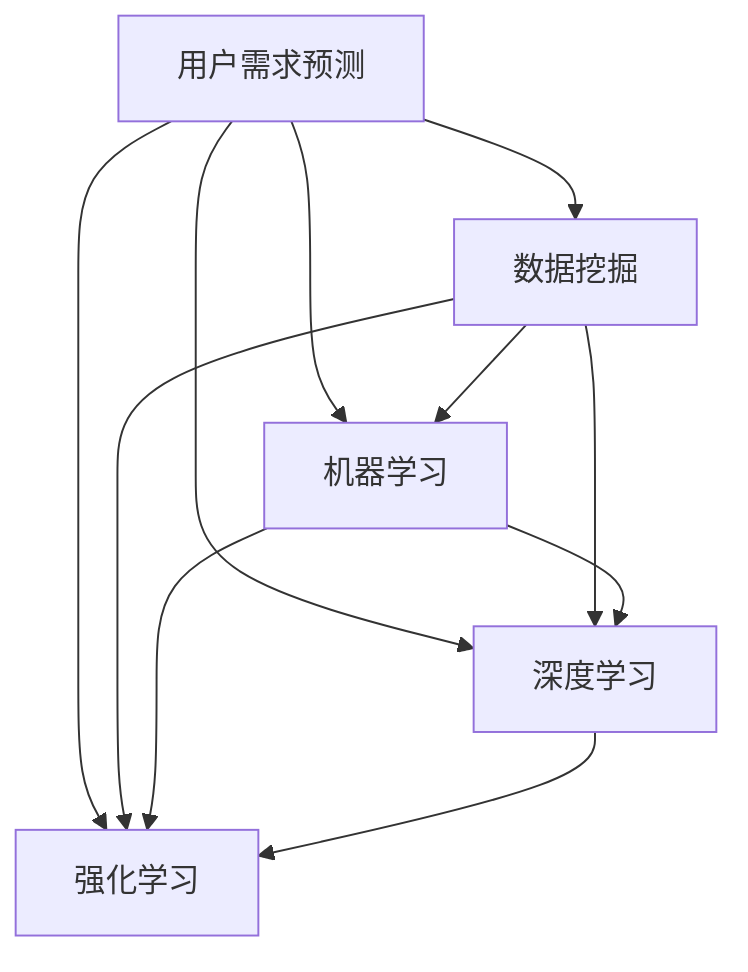

                 

## 1. 背景介绍

### 1.1 问题由来

在当今数字化时代，理解用户需求对于产品的成功至关重要。然而，随着用户行为的复杂性和多变性，传统的用户需求收集和分析方法已无法满足企业快速响应用户变化的需求。

如何自动化、系统化地预测用户需求，提高产品开发的效率和市场竞争力，成为众多企业亟需解决的关键问题。用户需求预测不仅可以指导产品功能设计、改进用户体验，还能优化资源配置、提升营销效果，实现精准市场定位。

### 1.2 问题核心关键点

本文将围绕用户需求预测的核心问题展开探讨，重点关注以下几个关键点：

- **数据获取**：如何从海量数据中高效提取用户行为信息。
- **模型构建**：选择合适算法构建预测模型，并进行参数优化。
- **模型评估**：如何评估模型的预测准确性和鲁棒性。
- **应用场景**：需求预测技术在不同场景下的具体应用。

本文将系统性地介绍用户需求预测的理论框架、常用方法以及实际应用案例，旨在为企业提供一套科学、高效的解决方案。

## 2. 核心概念与联系

### 2.1 核心概念概述

为更好地理解用户需求预测，本节将介绍几个关键概念：

- **用户需求预测**：通过分析用户的历史行为数据，预测其在未来一段时间内的需求。其核心在于识别用户行为模式，并基于此模式预测未来行为。
- **数据挖掘**：从大量数据中提取有价值信息的过程。常见的数据挖掘技术包括聚类、分类、关联规则等。
- **机器学习**：利用统计学和人工智能技术，构建模型以解决预测和分类问题。
- **深度学习**：通过多层次的神经网络结构，学习数据的复杂表示，用于图像、语音、文本等多种类型数据的预测和分析。
- **强化学习**：通过与环境的交互，不断调整策略以最大化预期收益，适用于动态环境下的需求预测。

这些核心概念之间的逻辑关系可以通过以下Mermaid流程图来展示：



这个流程图展示了几大核心概念之间的联系：

1. 用户需求预测依赖于数据挖掘、机器学习和深度学习等技术，从中提取和构建预测模型。
2. 数据挖掘、机器学习和深度学习是用户需求预测的基础技术，强化学习则在此基础上提供动态调整策略的能力。

## 3. 核心算法原理 & 具体操作步骤

### 3.1 算法原理概述

用户需求预测的本质是通过对历史行为数据的分析，构建一个能够准确预测用户未来需求的模型。该模型通常由两部分组成：特征提取和预测算法。

- **特征提取**：从用户的历史数据中提取有意义的特征，用于描述用户的兴趣、偏好、行为等。
- **预测算法**：基于提取的特征，构建预测模型，并通过训练数据学习用户需求的演变规律。

常见的用户需求预测算法包括回归分析、分类算法、神经网络、深度学习等。不同的算法适用于不同的预测场景和数据类型。

### 3.2 算法步骤详解

#### 3.2.1 数据预处理

用户需求预测的第一步是数据预处理，包括以下几个步骤：

1. **数据清洗**：去除噪声、重复数据和不完整记录，确保数据的质量。
2. **数据转换**：将原始数据转化为模型能够处理的格式，如时间序列数据、文本数据、图像数据等。
3. **特征工程**：构建与用户需求相关的特征，如用户属性、历史行为、时间戳等。

#### 3.2.2 模型选择与训练

根据数据类型和预测任务，选择合适的模型进行训练。以下以时间序列预测为例，详细讲解模型构建和训练步骤：

1. **模型选择**：选择合适的时间序列预测模型，如ARIMA、LSTM等。
2. **特征选择**：根据领域知识和初步实验结果，选择影响预测结果的特征。
3. **模型训练**：使用历史数据训练模型，优化模型参数，确保模型的预测能力。

#### 3.2.3 模型评估与优化

评估模型的预测性能，并进行必要的优化：

1. **评估指标**：使用MAE、RMSE、MAPE等指标评估模型的预测精度。
2. **交叉验证**：通过交叉验证等方法，评估模型的鲁棒性和泛化能力。
3. **参数调优**：根据评估结果，调整模型参数，优化预测效果。

#### 3.2.4 模型应用与迭代

将训练好的模型应用于实际预测场景，并进行持续迭代优化：

1. **在线预测**：实时处理新数据，并利用训练好的模型进行预测。
2. **持续学习**：定期更新模型参数，适应用户行为的变化。
3. **反馈循环**：利用预测结果，进行误差分析和用户行为分析，进一步优化模型。

### 3.3 算法优缺点

用户需求预测算法具有以下优点：

- **高效性**：能够快速处理大规模数据，进行实时预测。
- **准确性**：通过统计学和人工智能技术，预测结果具有较高的准确性。
- **可扩展性**：模型结构灵活，适用于多种数据类型和预测任务。

同时，也存在一些局限性：

- **数据依赖性**：模型的预测效果高度依赖于数据质量和特征工程的质量。
- **假设限制**：部分算法（如线性回归）假设数据服从特定分布，可能不适用于复杂数据。
- **复杂性**：深度学习等复杂模型需要大量计算资源和时间进行训练。

### 3.4 算法应用领域

用户需求预测技术可以应用于多个领域，包括但不限于：

- **电商领域**：预测用户购买行为，优化商品推荐和库存管理。
- **金融领域**：预测股票市场趋势，进行风险管理和投资决策。
- **物流领域**：预测货物运输需求，优化运输路线和仓储管理。
- **医疗领域**：预测疾病发病率，辅助医疗资源配置和疾病防控。
- **智能交通**：预测交通流量，优化交通信号控制和路径规划。

## 4. 数学模型和公式 & 详细讲解 & 举例说明

### 4.1 数学模型构建

用户需求预测的数学模型通常基于时间序列预测和分类预测两种类型。以下分别介绍这两种模型的构建方法。

#### 4.1.1 时间序列预测

时间序列预测模型通常用于预测用户未来的行为数据，如订单数量、访问次数等。

**模型构建**：
假设用户历史行为数据为 $X_t = (x_{t-1}, x_{t-2}, ..., x_0)$，其中 $x_t$ 为第 $t$ 天的行为数据。时间序列预测模型的目标是构建一个函数 $f$，使得 $f(X_t)$ 能够准确预测 $x_{t+1}$。

**公式推导**：
常用的时间序列预测模型包括ARIMA和LSTM等。以ARIMA模型为例，其公式推导如下：

$$
x_{t+1} = \sum_{i=0}^{p} \alpha_i x_{t-i} + \sum_{j=1}^{q} \beta_j \varepsilon_{t-j} + \varepsilon_t
$$

其中 $\alpha_i$ 和 $\beta_j$ 为模型参数，$\varepsilon_t$ 为随机误差。通过最小化预测误差，优化模型参数，实现准确预测。

#### 4.1.2 分类预测

分类预测模型通常用于预测用户的分类需求，如产品类别、用户类型等。

**模型构建**：
假设用户历史行为数据为 $X_t = (x_{t-1}, x_{t-2}, ..., x_0)$，其中 $x_t$ 为第 $t$ 天的行为数据。分类预测模型的目标是构建一个函数 $f$，使得 $f(X_t)$ 能够分类 $x_{t+1}$。

**公式推导**：
常用的分类预测模型包括逻辑回归、决策树等。以逻辑回归模型为例，其公式推导如下：

$$
\hat{y}_{t+1} = \frac{1}{1+\exp(-\sum_{i=0}^{n} w_i x_{t+1,i})}
$$

其中 $w_i$ 为模型参数，$\hat{y}_{t+1}$ 为预测标签。通过最小化交叉熵损失，优化模型参数，实现分类预测。

### 4.2 公式推导过程

以逻辑回归模型为例，推导其预测过程和损失函数：

假设模型输入为 $X_t = (x_{t-1}, x_{t-2}, ..., x_0)$，输出为 $\hat{y}_{t+1}$，其中 $x_{t+1,i}$ 为输入的第 $i$ 个特征，$w_i$ 为模型参数。

**预测过程**：
$$
\hat{y}_{t+1} = \frac{1}{1+\exp(-\sum_{i=0}^{n} w_i x_{t+1,i})}
$$

**损失函数**：
$$
L(\theta) = -\frac{1}{N}\sum_{i=1}^{N}[y_i\log \hat{y}_i + (1-y_i)\log (1-\hat{y}_i)]
$$

其中 $y_i$ 为真实标签，$\hat{y}_i$ 为预测标签。

通过梯度下降等优化算法，最小化损失函数，得到模型参数 $\theta$，从而实现分类预测。

### 4.3 案例分析与讲解

#### 案例：电商用户购买预测

假设某电商平台的销售数据集包含用户的浏览行为、购买记录、用户属性等信息。目标是预测用户未来是否会购买某商品。

**数据预处理**：
- 清洗数据，去除异常值和重复记录。
- 构建时间戳、商品ID、用户ID等特征。
- 进行归一化处理，确保数据规模一致。

**模型选择与训练**：
- 选择LSTM模型进行训练，以捕捉时间序列数据的复杂性。
- 使用历史数据进行模型训练，优化模型参数。

**模型评估与优化**：
- 使用MAE、RMSE等指标评估模型预测精度。
- 通过交叉验证方法，评估模型鲁棒性。
- 调整模型参数，提高预测准确性。

**模型应用与迭代**：
- 实时处理新数据，利用训练好的LSTM模型进行预测。
- 定期更新模型参数，适应用户行为变化。
- 分析预测结果误差，进行误差分析和用户行为分析，优化模型。

## 5. 项目实践：代码实例和详细解释说明

### 5.1 开发环境搭建

在进行用户需求预测的实践前，我们需要准备好开发环境。以下是使用Python进行Scikit-learn、TensorFlow等库进行项目开发的环境配置流程：

1. 安装Anaconda：从官网下载并安装Anaconda，用于创建独立的Python环境。

2. 创建并激活虚拟环境：
```bash
conda create -n user-prediction python=3.8 
conda activate user-prediction
```

3. 安装必要的库：
```bash
conda install numpy pandas scikit-learn tensorflow matplotlib tqdm jupyter notebook ipython
```

4. 安装深度学习框架：
```bash
pip install keras tensorflow-gpu
```

5. 安装数据分析库：
```bash
pip install pandas
```

完成上述步骤后，即可在`user-prediction`环境中开始项目实践。

### 5.2 源代码详细实现

这里以电商用户购买预测为例，给出使用TensorFlow进行LSTM模型的完整代码实现。

```python
import tensorflow as tf
from tensorflow.keras.models import Sequential
from tensorflow.keras.layers import Dense, LSTM
from sklearn.model_selection import train_test_split
from sklearn.preprocessing import MinMaxScaler
import pandas as pd
import numpy as np

# 加载数据
data = pd.read_csv('user_purchase_data.csv')
# 定义特征和标签
X = data.drop(['label'], axis=1)
y = data['label']
# 数据归一化
scaler = MinMaxScaler()
X = scaler.fit_transform(X)
# 划分训练集和测试集
X_train, X_test, y_train, y_test = train_test_split(X, y, test_size=0.2)
# 定义模型
model = Sequential()
model.add(LSTM(128, input_shape=(X_train.shape[1], 1)))
model.add(Dense(1, activation='sigmoid'))
model.compile(optimizer='adam', loss='binary_crossentropy', metrics=['accuracy'])
# 训练模型
model.fit(X_train, y_train, epochs=10, batch_size=32, validation_data=(X_test, y_test))
# 模型评估
score = model.evaluate(X_test, y_test)
print('Test loss:', score[0])
print('Test accuracy:', score[1])
```

这段代码实现了从数据加载到模型训练的完整过程，通过LSTM模型进行电商用户购买预测。

### 5.3 代码解读与分析

让我们再详细解读一下关键代码的实现细节：

**数据加载**：
- 使用pandas库读取用户购买数据。
- 数据预处理，包括特征选择和归一化。

**模型构建**：
- 使用Keras的Sequential模型，构建LSTM层和全连接层。
- 设置模型的优化器、损失函数和评估指标。

**模型训练**：
- 使用fit方法训练模型，指定训练轮数和批大小。
- 通过validation_data参数，指定验证集进行模型评估。

**模型评估**：
- 使用evaluate方法评估模型在测试集上的性能，输出损失和准确率。

**代码优化**：
- 通过不断调整模型结构和参数，提高模型预测精度。
- 利用TensorBoard等工具，可视化训练过程中的损失和准确率变化。

## 6. 实际应用场景

### 6.1 智能推荐系统

用户需求预测在智能推荐系统中具有广泛的应用。通过预测用户的未来行为，推荐系统可以更加精准地匹配用户需求，提高用户满意度和系统使用率。

在电商领域，推荐系统可以根据用户的历史购买记录和浏览行为，预测其未来的购买需求，推荐相应的商品。通过优化推荐算法，可以显著提升用户购买转化率，提高企业的销售额。

### 6.2 金融风险管理

金融领域需要实时监控市场动态，预测用户的投资行为，以控制风险。通过预测用户是否会购买某金融产品，金融机构可以优化产品推荐，避免误导性投资，保障金融市场的稳定。

### 6.3 社交媒体分析

社交媒体分析是用户需求预测的另一个重要应用场景。通过预测用户的发布行为，社交平台可以优化内容推荐，提升用户活跃度和留存率。

### 6.4 医疗健康管理

医疗健康领域需要预测用户的行为需求，如药品购买、健康咨询等。通过预测用户对某类疾病的风险，医疗机构可以提供个性化的健康建议，提高疾病的早期预防和治疗效果。

## 7. 工具和资源推荐

### 7.1 学习资源推荐

为了帮助开发者系统掌握用户需求预测的理论基础和实践技巧，这里推荐一些优质的学习资源：

1. 《机器学习实战》系列博文：由大模型技术专家撰写，深入浅出地介绍了机器学习算法和应用实例。

2. Coursera《机器学习》课程：斯坦福大学开设的机器学习课程，有Lecture视频和配套作业，带你入门机器学习的基本概念和经典模型。

3. 《深度学习》书籍：Ian Goodfellow所著，全面介绍了深度学习的基本原理和应用。

4. Kaggle数据集和竞赛：Kaggle平台提供大量公开的数据集和竞赛任务，帮助你实践和提升数据挖掘和预测能力。

5. Weights & Biases：模型训练的实验跟踪工具，可以记录和可视化模型训练过程中的各项指标，方便对比和调优。

### 7.2 开发工具推荐

高效的开发离不开优秀的工具支持。以下是几款用于用户需求预测开发的常用工具：

1. Scikit-learn：基于Python的机器学习库，提供了丰富的算法和数据预处理工具。

2. TensorFlow：由Google主导开发的深度学习框架，生产部署方便，适合大规模工程应用。

3. Keras：用户友好的深度学习框架，适合快速原型开发和模型实验。

4. PyTorch：基于Python的开源深度学习框架，灵活动态的计算图，适合快速迭代研究。

5. H2O.ai：商业化的机器学习平台，提供了丰富的算法和模型，适合快速开发和部署。

### 7.3 相关论文推荐

用户需求预测的研究源于学界的持续探索。以下是几篇奠基性的相关论文，推荐阅读：

1. Prophet: A Forecasting Foundation for Heterogeneous Datasets with Multiple Seasonality：提出的Prophet时间序列预测模型，广泛应用于电商、金融等场景。

2. LSTM Networks for Named Entity Recognition：提出使用LSTM模型进行命名实体识别的思路，拓展了LSTM模型在NLP领域的应用。

3. A Survey on Mining User Intent from Social Media：综述了社交媒体中的用户意图挖掘方法，为需求预测提供了新的数据来源和分析方法。

4. Deep Learning for Social Media Sentiment Analysis：提出使用深度学习模型进行社交媒体情感分析的方法，为需求预测提供了新的数据源和预测工具。

5. A Survey on Predictive Analytics for Healthcare with Data Mining and Statistical Learning：综述了医疗健康领域的数据挖掘和预测方法，为需求预测提供了新的应用场景和方法。

这些论文代表了用户需求预测技术的发展脉络。通过学习这些前沿成果，可以帮助研究者把握学科前进方向，激发更多的创新灵感。

## 8. 总结：未来发展趋势与挑战

### 8.1 研究成果总结

本文对用户需求预测的核心问题进行了全面系统的介绍，主要集中在数据获取、模型构建、模型评估和应用场景等方面。通过系统梳理，帮助读者全面理解用户需求预测的理论框架和技术实现，为实际应用提供了科学、高效的方法。

### 8.2 未来发展趋势

展望未来，用户需求预测技术将呈现以下几个发展趋势：

1. **自动化与智能化**：随着机器学习技术的进步，用户需求预测将逐渐实现自动化和智能化，减少人工干预。
2. **多模态数据融合**：通过融合文本、图像、音频等多模态数据，提升预测模型的准确性和鲁棒性。
3. **实时化与动态调整**：利用流数据处理技术，实现实时预测和动态调整，满足动态环境下的需求预测需求。
4. **个性化与场景化**：结合用户属性、行为数据和场景信息，实现更加个性化的需求预测。
5. **跨领域与融合**：通过与其他技术（如自然语言处理、计算机视觉）的结合，拓展需求预测的应用场景。

### 8.3 面临的挑战

尽管用户需求预测技术已经取得了一定的进展，但在迈向更加智能化、普适化应用的过程中，它仍面临着诸多挑战：

1. **数据质量和多样性**：高质量、多源数据是用户需求预测的前提，但数据获取和处理仍是一个难题。
2. **模型复杂性**：深度学习等复杂模型需要大量计算资源和时间进行训练，如何提高模型效率，降低计算成本，是一个重要的研究方向。
3. **隐私与伦理**：在数据处理和模型训练过程中，如何保障用户隐私和数据安全，避免数据泄露和滥用，是一个亟需解决的问题。
4. **模型鲁棒性**：预测模型容易受到异常数据和噪声的影响，如何提高模型的鲁棒性和泛化能力，是一个重要的研究方向。

### 8.4 研究展望

面对用户需求预测所面临的挑战，未来的研究需要在以下几个方面寻求新的突破：

1. **数据获取与处理**：开发更高效的数据采集和预处理技术，降低数据获取成本，提高数据质量。
2. **模型简化与优化**：开发更加简洁高效的预测模型，提高模型训练和推理效率。
3. **隐私保护与伦理约束**：在模型设计和数据处理过程中，引入隐私保护和伦理约束机制，确保用户隐私和数据安全。
4. **跨领域与融合**：与其他人工智能技术进行更深入的融合，拓展需求预测的应用场景。

这些研究方向将引领用户需求预测技术迈向更高的台阶，为构建智能化的推荐系统、金融风险管理系统、社交媒体分析系统等应用提供新的解决方案。通过不断的技术创新和应用实践，用户需求预测技术将实现更加高效、智能和普适化，为各行各业带来深刻变革。

## 9. 附录：常见问题与解答

**Q1：用户需求预测是否适用于所有场景？**

A: 用户需求预测技术适用于需要预测用户行为和需求的场景，如电商、金融、社交媒体等。但对于一些特定领域，如医疗、法律等，需要结合领域知识进行定制化的预测模型。

**Q2：如何选择合适的时间序列预测模型？**

A: 选择合适的时间序列预测模型需要考虑数据类型、预测任务和数据规模。例如，ARIMA适用于平稳数据，LSTM适用于非平稳数据。可以通过初步实验，选择最适合的模型。

**Q3：模型训练过程中如何避免过拟合？**

A: 避免过拟合可以通过以下方法：
1. 数据增强：通过数据扩充和变换，增加训练数据的多样性。
2. 正则化：使用L2正则、Dropout等方法，限制模型的复杂度。
3. 早停法：在模型性能不再提升时，提前停止训练。

**Q4：用户需求预测技术在不同场景下的应用有哪些？**

A: 用户需求预测技术可以应用于电商推荐、金融风险管理、社交媒体分析、医疗健康管理等多个场景，具体应用如下：
1. 电商推荐：预测用户购买行为，优化商品推荐。
2. 金融风险管理：预测用户投资行为，控制金融风险。
3. 社交媒体分析：预测用户发布行为，优化内容推荐。
4. 医疗健康管理：预测用户疾病风险，提供个性化健康建议。

通过不断探索和实践，用户需求预测技术将在更多领域发挥作用，推动智能化应用的普及和落地。

---

作者：禅与计算机程序设计艺术 / Zen and the Art of Computer Programming

