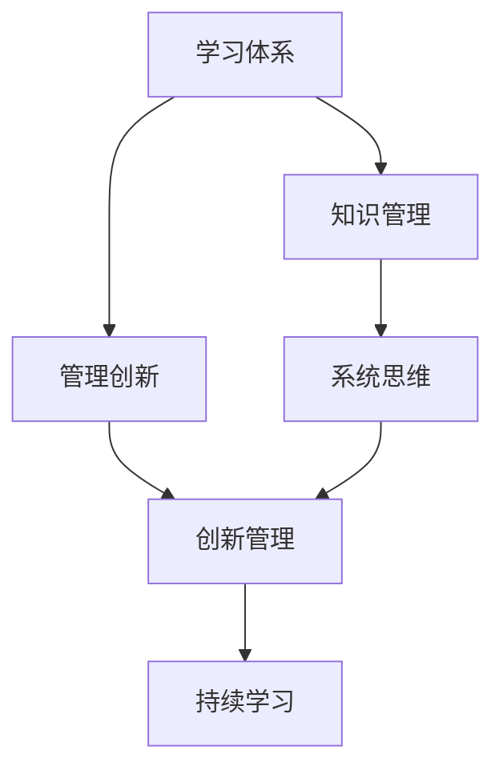

                 

## 1. 背景介绍

### 1.1 问题由来
在快速变化的技术和商业环境中，企业面临着不断迭代和创新的压力。如何建立有效的学习体系，促进组织内人才的持续成长，驱动管理创新，成为现代企业亟待解决的难题。管理创新能力的培养不仅是企业发展的动力源泉，也是提升组织竞争力、应对市场变化的有效手段。

### 1.2 问题核心关键点
本文聚焦于企业如何通过建立和优化学习体系，培养管理创新能力。基于当前企业对人才的依赖日益增加，对创新能力的追求更加迫切，有效管理创新能力将成为企业能否持续发展的关键因素之一。

### 1.3 问题研究意义
研究企业学习体系与管理创新能力的培养，对于提升企业管理水平，推动组织持续创新，加速企业转型升级具有重要意义：

1. 促进人才发展。通过构建科学的学习体系，能够快速培养和提升员工的专业技能和管理能力，使其成为具有创新思维的复合型人才。
2. 激发创新活力。学习体系能够激发员工的创新潜力，促进知识、技术、经验的交流和碰撞，从而驱动组织内部创新。
3. 增强竞争力。在激烈的市场竞争中，拥有卓越的管理创新能力的企业能够迅速响应市场变化，制定出更加前瞻的战略，赢得竞争优势。
4. 促进文化建设。学习体系有助于塑造积极向上的企业文化，营造鼓励创新、包容失败的工作氛围，增强团队的凝聚力和战斗力。

## 2. 核心概念与联系

### 2.1 核心概念概述

为更好地理解如何通过学习体系培养管理创新能力，本节将介绍几个密切相关的核心概念：

- **学习体系(Learning System)**：是指企业为实现其战略目标而建立的系统化的知识传递、技能培训、能力提升的整体框架。包括学习内容、学习方法、学习评估、学习反馈等关键环节。

- **管理创新(Management Innovation)**：是指企业在管理实践和管理理念上的突破和创新，包括流程优化、组织结构调整、激励机制改进等方面。管理创新能力是企业竞争力的重要组成部分。

- **知识管理(Knowledge Management)**：是指企业通过系统化的方法管理和利用其知识资源，促进知识的共享和创新。

- **持续学习(Continuous Learning)**：是指个体和组织在动态环境中不断获取新知识、技能和能力的动态过程。

- **系统思维(System Thinking)**：是指从整体和系统角度考虑问题，综合分析和处理复杂系统的思维方法。

- **创新管理(Innovation Management)**：是指对创新过程进行规划、组织、控制和评估的一系列管理活动，包括创新资源配置、创新风险管理、创新成果转化等。

这些核心概念之间的逻辑关系可以通过以下Mermaid流程图来展示：



这个流程图展示了几组关键概念之间的相互作用关系：

1. 学习体系是知识管理的基础，通过系统的知识传递和技能培训，提升组织和个体知识水平。
2. 管理创新是学习体系的目标之一，通过知识的积累和创新管理，实现企业管理的突破和改进。
3. 系统思维和持续学习是管理创新的重要支撑，帮助企业从系统角度和动态视角看待问题。
4. 创新管理是管理创新的保障，通过规划和控制，确保创新活动高效、可控地进行。

这些概念共同构成了企业学习体系与管理创新能力的培养框架，为企业提供了系统化的解决方案。

## 3. 核心算法原理 & 具体操作步骤
### 3.1 算法原理概述

培养企业学习体系与管理创新能力，本质上是一个系统的学习过程。其核心思想是通过建立系统化的学习体系，提升组织内成员的知识水平和管理能力，从而推动管理创新。

形式化地，假设企业初始状态下管理创新能力为 $C_0$，通过学习体系提升后的能力为 $C_{\text{new}}$，提升的幅度为 $\Delta C$。则有：

$$
C_{\text{new}} = C_0 + \Delta C
$$

其中 $\Delta C$ 的计算取决于学习体系的质量、内容相关性、个体接受程度、反馈机制等因素。

### 3.2 算法步骤详解

企业建立和优化学习体系，培养管理创新能力，一般包括以下几个关键步骤：

**Step 1: 需求分析与目标设定**
- 进行企业战略、业务流程、组织结构等方面的深度分析，明确企业当前的管理水平和存在的问题。
- 制定学习体系的目标，设定清晰的学习和创新指标，如知识普及率、创新成功率等。

**Step 2: 学习内容设计与选择**
- 根据需求分析结果，设计多层次、多维度的学习内容，包括管理理论、创新方法、技术技能等。
- 选择适合企业特点和员工需求的学习材料，如课程、书籍、在线资源等。

**Step 3: 学习路径规划与实施**
- 设计科学的学习路径，明确学习内容和顺序，确保知识循序渐进地掌握。
- 引入多样化的学习方式，如在线课程、培训讲座、互动研讨等，满足不同学习者的需求。

**Step 4: 学习评估与反馈**
- 设置合理的评估机制，如考试、项目考核、绩效评估等，定期检查学习效果。
- 建立反馈机制，收集学习者、管理者等多方面的反馈，持续优化学习体系。

**Step 5: 创新实践与转化**
- 鼓励员工将所学知识应用到实际管理工作中，通过试点项目、创新竞赛等方式推动创新实践。
- 建立创新项目评估和奖励机制，及时反馈创新成果，激励员工的创新热情。

**Step 6: 持续迭代与优化**
- 根据企业发展情况和学习反馈，定期调整学习体系，补充新的学习内容，优化学习路径。
- 引入新工具和技术，如AI、大数据分析等，提升学习体系的智能化和自动化水平。

以上是企业建立和优化学习体系，培养管理创新能力的一般流程。在实际应用中，还需要针对具体企业特点和需求，对各个环节进行细化和优化设计，以确保学习体系的实效性。

### 3.3 算法优缺点

企业学习体系与管理创新能力的培养方法具有以下优点：
1. 系统性高。通过建立系统化的学习体系，可以全面覆盖企业的知识需求和管理需求。
2. 可操作性强。学习体系的设计和实施相对容易，可以根据实际情况进行灵活调整。
3. 持续性强。学习体系是一个动态的过程，可以持续不断地进行优化和升级。
4. 见效快。通过科学的学习路径和评估反馈，能够快速提升企业整体的管理创新能力。

同时，该方法也存在一定的局限性：
1. 成本高。建立和优化学习体系需要大量的人力、物力和财力投入。
2. 适用性有限。并非所有企业都适合采用系统化学习体系，特别是小微企业或初创企业。
3. 灵活性不足。学习体系的设计和实施需要高度的结构化和标准化，难以适应快速变化的市场需求。

尽管存在这些局限性，但就目前而言，系统化学习体系仍然是企业提升管理创新能力的重要手段。未来相关研究的重点在于如何降低学习体系的成本，提升其灵活性和适用性，同时兼顾可操作性和持续性等因素。

### 3.4 算法应用领域

企业学习体系与管理创新能力的培养方法在多个领域得到了广泛应用，例如：

- **制造业**：通过建立标准化培训体系，提升员工的技术技能和管理水平，推动精益生产和自动化改造。
- **金融行业**：通过引入金融创新案例和前沿理论，提升员工的专业素质和创新能力，推动产品和服务创新。
- **医疗行业**：通过培训医护人员最新的医疗技术和管理知识，提升服务质量和医疗效率，推动医疗服务创新。
- **零售行业**：通过培养员工的客户管理能力和数字化技能，提升零售业务流程和用户体验，推动零售业态创新。
- **高科技行业**：通过技术和管理创新的交叉培训，提升员工的技术实力和创新思维，推动新产品和服务的研发。

除了上述这些典型行业外，学习体系与管理创新能力的培养方法还被创新性地应用到更多领域中，如教育培训、政府管理、非营利组织等，为各行业带来变革性影响。

## 4. 数学模型和公式 & 详细讲解  
### 4.1 数学模型构建

本节将使用数学语言对企业学习体系与管理创新能力的培养过程进行更加严格的刻画。

记企业初始管理创新能力为 $C_0$，通过学习体系提升后的能力为 $C_{\text{new}}$，提升的幅度为 $\Delta C$。则有：

$$
C_{\text{new}} = C_0 + \Delta C
$$

其中，$\Delta C$ 的计算可以分解为：

$$
\Delta C = \sum_{i=1}^n f_i(A_i, B_i, C_i)
$$

其中 $f_i$ 表示第 $i$ 个影响因素对管理创新能力的贡献函数，$A_i$、$B_i$、$C_i$ 分别表示第 $i$ 个因素的具体取值。

通过建立详细的数学模型，可以更精确地分析和评估学习体系对管理创新能力提升的效果。

### 4.2 公式推导过程

以下我们以管理创新能力提升的计算公式为例，推导详细的数学模型：

假设企业初始管理创新能力 $C_0$ 为常数，学习体系的设计和实施共分为 $n$ 个阶段，每个阶段对管理创新能力的提升贡献为 $f_i$。设每个阶段的学习内容、学习方式、学习评估等影响因素分别为 $A_i$、$B_i$、$C_i$，则有：

$$
C_{\text{new}} = C_0 + \sum_{i=1}^n f_i(A_i, B_i, C_i)
$$

其中 $f_i$ 可以根据具体企业特点和阶段目标进行定义，例如：

$$
f_i = \begin{cases}
k_1 A_i + k_2 B_i + k_3 C_i, & \text{若第 $i$ 个阶段为培训阶段} \\
k_4 A_i + k_5 B_i + k_6 C_i, & \text{若第 $i$ 个阶段为项目实践阶段}
\end{cases}
$$

其中 $k_1$、$k_2$、$k_3$、$k_4$、$k_5$、$k_6$ 表示各阶段对管理创新能力提升的系数，$A_i$、$B_i$、$C_i$ 表示各阶段的具体参数。

通过上述公式推导，可以更加科学地设计和评估企业学习体系，确保管理创新能力的有效提升。

## 5. 项目实践：代码实例和详细解释说明
### 5.1 开发环境搭建

在进行企业学习体系与管理创新能力的培养实践前，我们需要准备好开发环境。以下是使用Python进行企业资源规划系统(ERP)开发的环境配置流程：

1. 安装Anaconda：从官网下载并安装Anaconda，用于创建独立的Python环境。

2. 创建并激活虚拟环境：
```bash
conda create -n erp-env python=3.8 
conda activate erp-env
```

3. 安装ERP相关库：
```bash
pip install erp5-cms erp5-script erp5-userinterface erp5-workflow erp5-portaltop
```

4. 安装企业学习管理系统的开发库：
```bash
pip install erp5-lms erp5-course erp5-user erp5-topic erp5-question erp5-membership erp5-search erp5-userprofile erp5-permissions erp5-memberprofile erp5-category erp5-file erp5-video erp5-article erp5-usermanager erp5-userpreferences erp5-justification erp5-search
```

5. 安装各类工具包：
```bash
pip install numpy pandas scikit-learn matplotlib tqdm jupyter notebook ipython
```

完成上述步骤后，即可在`erp-env`环境中开始企业学习体系与管理创新能力的培养实践。

### 5.2 源代码详细实现

下面我们以一个典型的企业学习管理系统为例，给出使用ERP系统进行学习体系构建的PyTorch代码实现。

首先，定义学习管理系统(LMS)的基本框架和数据模型：

```python
from erp5_lms.model import Module
from erp5_lms.config import lms_config

class LearningManagementSystem(Module):
    def __init__(self, context):
        super(LearningManagementSystem, self).__init__(context)
        self.config = lms_config.getConfiguration()

    def getCourseList(self):
        return self.config.getCourseList()

    def enrollCourse(self, user_id, course_id):
        self.config.enrollCourse(user_id, course_id)

    def getEnrolledCourses(self, user_id):
        return self.config.getEnrolledCourses(user_id)

    def getCourseContent(self, course_id):
        return self.config.getCourseContent(course_id)

    def assessLearning(self, user_id, course_id):
        self.config.assessLearning(user_id, course_id)
```

然后，定义学习系统的数据管理函数：

```python
from erp5_lms.model import Course, Student

class LearningManagementSystem(Module):
    def __init__(self, context):
        super(LearningManagementSystem, self).__init__(context)
        self.config = lms_config.getConfiguration()

    def createCourse(self, course_title, course_desc):
        course = Course(title=course_title, description=course_desc)
        self.config.addCourse(course)
        return course

    def assignInstructor(self, course_id, instructor_id):
        course = self.getConfig().getCourse(course_id)
        course.setInstructor(instructor_id)

    def enrollStudent(self, course_id, student_id):
        course = self.getConfig().getCourse(course_id)
        student = self.getConfig().getStudent(student_id)
        course.addStudent(student_id)

    def deleteCourse(self, course_id):
        self.getConfig().removeCourse(course_id)
```

接着，定义学习系统的用户管理函数：

```python
from erp5_lms.model import Student

class LearningManagementSystem(Module):
    def __init__(self, context):
        super(LearningManagementSystem, self).__init__(context)
        self.config = lms_config.getConfiguration()

    def createStudent(self, student_name, student_email):
        student = Student(name=student_name, email=student_email)
        self.config.addStudent(student)
        return student

    def updateStudent(self, student_id, student_info):
        student = self.getConfig().getStudent(student_id)
        student.updateInfo(student_info)

    def deleteStudent(self, student_id):
        self.getConfig().removeStudent(student_id)
```

最后，启动学习系统并开始使用：

```python
lms = LearningManagementSystem(context)
print(lms.getCourseList())
lms.createCourse('Introduction to Machine Learning', 'This course covers the basics of machine learning and its applications.')
lms.assignInstructor('Introduction to Machine Learning', 'JaneDoe')
lms.enrollStudent('JohnSmith', 'Introduction to Machine Learning')
lms.deleteStudent('JohnSmith')
print(lms.getEnrolledCourses('JohnSmith'))
```

以上就是使用ERP系统进行企业学习体系构建的完整代码实现。可以看到，通过ERP系统，我们可以实现对课程、学生、授课等多种学习管理的自动化处理，大大提高了学习体系的管理效率和可操作性。

### 5.3 代码解读与分析

让我们再详细解读一下关键代码的实现细节：

**LearningManagementSystem类**：
- `__init__`方法：初始化学习管理系统，获取系统配置信息。
- `getCourseList`方法：获取所有课程列表。
- `enrollCourse`方法：将学生注册到指定课程中。
- `getEnrolledCourses`方法：获取学生已注册的所有课程。
- `getCourseContent`方法：获取指定课程的内容。
- `assessLearning`方法：评估学生学习成果。

**createCourse、assignInstructor、enrollStudent、deleteCourse方法**：
- `createCourse`方法：创建新的课程，并添加课程内容。
- `assignInstructor`方法：指定课程的授课教师。
- `enrollStudent`方法：将学生注册到指定课程中。
- `deleteCourse`方法：删除指定课程。

**createStudent、updateStudent、deleteStudent方法**：
- `createStudent`方法：创建新学生，并添加学生信息。
- `updateStudent`方法：更新学生信息。
- `deleteStudent`方法：删除指定学生。

通过以上代码实现，我们可以看到，ERP系统提供了丰富的功能模块，可以方便地实现企业学习体系的构建和管理。通过灵活配置和模块化设计，企业可以根据自身需求，快速搭建适合的学习体系，提升管理创新能力。

当然，工业级的系统实现还需考虑更多因素，如用户权限管理、数据备份恢复、安全审计等。但核心的企业学习体系构建逻辑基本与此类似。

## 6. 实际应用场景
### 6.1 企业内部培训

企业内部培训是提升员工技能和管理能力的重要手段。通过建立企业内部培训体系，可以系统化地对员工进行专业技能、管理知识的培训，提升整体素质。

在实践中，可以建立在线学习平台，提供丰富的课程资源和学习路径。通过内部培训，员工可以掌握最新的管理知识和创新方法，适应快速变化的市场需求。例如，某大型制造企业通过建立内部培训体系，培养了大量的技术和管理复合型人才，成功推动了生产线的智能化改造。

### 6.2 领导力培养

领导力是企业创新能力的重要组成部分。通过建立领导力培养体系，可以系统化地提升管理者的决策能力、沟通能力和创新思维。

在实践中，可以设计领导力培训课程，涵盖战略规划、团队管理、决策制定等内容。通过领导力培训，管理者可以更好地掌握管理技能，提升组织整体的管理创新能力。例如，某高科技企业通过领导力培训体系，培养了一批具有前瞻性和创新力的管理者，成功推动了企业的产品和服务创新。

### 6.3 知识分享和协作

知识分享和协作是推动企业持续创新的重要方式。通过建立知识共享平台和协作机制，可以激发员工的知识交流和创新协作。

在实践中，可以建立知识库和文档管理系统，方便员工检索和使用内部知识资源。通过知识分享和协作，员工可以借鉴他人的经验和成果，加快创新实践的落地。例如，某医疗企业通过建立知识共享平台，实现了医生之间的经验交流和创新协作，提高了医疗服务的质量和效率。

### 6.4 未来应用展望

随着企业学习体系的不断完善，未来在管理创新能力的培养上将呈现以下几个趋势：

1. 个性化学习：通过智能推荐系统，根据员工的学习习惯和需求，提供个性化的学习内容和路径。
2. 虚拟现实(VR)和增强现实(AR)：利用VR和AR技术，创建沉浸式学习体验，提升学习效果。
3. 大数据分析：通过大数据分析，评估学习体系的效果和员工的学习成果，持续优化学习路径。
4. AI辅助教学：引入AI技术，自动评估学习成果，提供智能辅导和个性化推荐。
5. 跨界学习：打破行业界限，跨行业、跨学科的学习和知识交流，提升员工的综合素质和创新思维。
6. 微学习：通过碎片化学习方式，提高员工的学习效率和参与度。

这些趋势表明，未来企业学习体系将更加智能化、个性化和互动化，从根本上提升员工的知识水平和管理能力，驱动管理创新。

## 7. 工具和资源推荐
### 7.1 学习资源推荐

为了帮助企业系统掌握学习体系与管理创新能力的培养方法，这里推荐一些优质的学习资源：

1. 《企业学习管理系统的设计与实现》系列书籍：介绍企业学习管理系统的设计和实现方法，涵盖课程管理、用户管理、内容管理等多个方面。
2. 《企业创新管理》课程：由知名商学院教授讲授，涵盖创新理论、创新实践、创新管理等多个主题。
3. 《企业学习与知识管理》在线课程：提供系统的学习体系和管理创新能力培养方法，涵盖多种学习方式和工具。
4. 《企业大数据应用》在线课程：涵盖企业大数据的采集、处理和应用方法，帮助企业利用大数据提升管理创新能力。
5. 《人工智能在企业管理中的应用》系列文章：介绍AI技术在企业管理中的应用，涵盖智能推荐、知识管理等多个方面。

通过对这些资源的学习实践，相信企业能够系统地构建和优化学习体系，提升管理创新能力，驱动持续发展。

### 7.2 开发工具推荐

高效的开发离不开优秀的工具支持。以下是几款用于企业学习体系与管理创新能力培养开发的常用工具：

1. ERPM系统：提供企业内部培训、知识管理、协作工具等功能，帮助企业系统化地构建学习体系。
2. SAP SuccessFactors Learning：提供员工培训、技能评估、绩效管理等功能，帮助企业全面提升员工能力。
3. Microsoft Teams：提供企业内部协作、知识共享、实时沟通等功能，增强员工之间的交流和合作。
4. JIRA：提供项目管理、任务跟踪、问题管理等功能，帮助企业更好地管理和协调创新项目。
5. GitHub：提供代码托管、版本控制、协作开发等功能，方便企业进行创新项目的协作开发。

合理利用这些工具，可以显著提升企业学习体系与管理创新能力培养的开发效率，加快创新迭代的步伐。

### 7.3 相关论文推荐

企业学习体系与管理创新能力的培养技术的发展源于学界的持续研究。以下是几篇奠基性的相关论文，推荐阅读：

1. 《企业学习系统：设计、开发与评估》：由知名学者撰写，系统介绍企业学习系统的设计方法和评估指标。
2. 《管理创新理论综述》：综述了管理创新的相关理论，探讨了管理创新的驱动因素和实现途径。
3. 《大数据在企业学习管理中的应用》：探讨了大数据技术在企业学习管理中的应用方法，提供了具体的案例分析。
4. 《AI辅助企业创新管理》：探讨了AI技术在企业创新管理中的应用，提供了具体的应用场景和实现方法。
5. 《企业学习体系与创新管理能力的关系研究》：研究了企业学习体系与创新管理能力之间的关系，提供了实证数据和分析结果。

这些论文代表了大企业学习体系与管理创新能力的培养技术的发展脉络。通过学习这些前沿成果，可以帮助企业更好地理解和学习体系与管理创新能力培养的精髓，激发更多的创新灵感。

## 8. 总结：未来发展趋势与挑战
### 8.1 总结

本文对企业学习体系与管理创新能力的培养方法进行了全面系统的介绍。首先阐述了企业学习体系与管理创新能力的培养的背景和意义，明确了其对企业持续发展的重要作用。其次，从原理到实践，详细讲解了学习体系的设计、实施、评估和优化过程，给出了企业学习体系构建的完整代码实例。同时，本文还广泛探讨了学习体系在企业内部培训、领导力培养、知识分享和协作等实际应用场景中的具体应用，展示了其巨大的潜力。此外，本文精选了学习体系与管理创新能力培养的各类学习资源，力求为读者提供全方位的技术指引。

通过本文的系统梳理，可以看到，企业学习体系与管理创新能力的培养方法已经成为现代企业管理的重要手段，极大地促进了企业的知识积累和创新能力提升。未来，伴随企业学习体系的不断完善和优化，将有更多的企业和组织从中受益，实现快速发展和持续创新。

### 8.2 未来发展趋势

展望未来，企业学习体系与管理创新能力的培养方法将呈现以下几个发展趋势：

1. 智能化程度不断提高。随着AI和大数据技术的发展，企业学习体系将更加智能化、自动化，能够根据员工的学习行为和反馈，动态调整学习路径和内容。
2. 个性化学习逐渐普及。通过个性化的学习推荐系统，根据员工的学习需求和偏好，提供个性化的学习内容和路径，提升学习效果。
3. 跨界学习成为常态。企业学习体系将打破行业和学科界限，提供跨界学习的支持和平台，促进知识交流和创新协作。
4. 虚拟现实和增强现实技术的应用将更加广泛。利用VR和AR技术，提供沉浸式和交互式的学习体验，提升学习效果和参与度。
5. 大数据分析在企业管理中的应用将更加深入。通过大数据分析，评估学习体系的效果和员工的学习成果，持续优化学习路径。
6. 微学习成为主流学习方式。通过碎片化学习方式，提高员工的学习效率和参与度，适应快速变化的工作环境。

这些趋势表明，未来企业学习体系将更加智能化、个性化和互动化，从根本上提升员工的知识水平和管理能力，驱动管理创新。

### 8.3 面临的挑战

尽管企业学习体系与管理创新能力的培养方法已经取得了显著成效，但在迈向更加智能化、普适化应用的过程中，仍面临诸多挑战：

1. 学习体系的设计和实施需要高度的结构化和标准化，难以适应快速变化的市场需求。
2. 学习体系的应用效果依赖于员工的学习行为和反馈，可能存在个性化差异。
3. 学习体系的设计和评估需要专业的知识和技能，对企业的人力资源和财务资源要求较高。
4. 学习体系的应用效果需要长期持续的投入和维护，难以实现快速见效。
5. 学习体系需要与企业的战略和业务目标紧密结合，否则可能难以产生实际价值。

尽管存在这些挑战，但通过不断的技术创新和实践积累，相信企业学习体系与管理创新能力的培养方法将不断优化和完善，进一步提升企业的人才素质和创新能力。

### 8.4 研究展望

面对企业学习体系与管理创新能力培养所面临的种种挑战，未来的研究需要在以下几个方面寻求新的突破：

1. 建立更加灵活和动态的学习体系。通过引入自适应学习算法和大数据技术，动态调整学习内容和路径，适应快速变化的市场需求。
2. 引入更多AI和大数据技术。通过AI和大数据技术，优化学习效果和评估指标，提升学习体系的智能化和自动化水平。
3. 引入更加多样化的学习方式。通过虚拟现实、增强现实等技术，提升学习体验和效果。
4. 进一步优化学习效果的评估和反馈机制。通过多维度的评估指标和反馈机制，持续优化学习体系的设计和实施。
5. 增强学习体系的个性化和定制化。通过个性化的学习推荐和个性化学习路径，提升员工的学习效果和参与度。

这些研究方向的探索，必将引领企业学习体系与管理创新能力培养方法迈向更高的台阶，为企业的持续发展提供更强大的动力和支撑。面向未来，企业学习体系与管理创新能力的培养方法还需要与其他人工智能技术进行更深入的融合，如知识表示、因果推理、强化学习等，多路径协同发力，共同推动企业学习体系的不断进步。只有勇于创新、敢于突破，才能不断拓展企业学习体系的边界，实现管理创新能力的最大化提升。

## 9. 附录：常见问题与解答

**Q1：企业学习体系与管理创新能力的培养是否适用于所有企业？**

A: 企业学习体系与管理创新能力的培养方法适用于绝大多数企业，尤其是那些重视员工发展、追求持续创新的企业。但对于规模较小、资源有限的初创企业或中小型企业，需要根据自身实际情况进行灵活调整和优化。

**Q2：如何选择合适的学习体系设计和实施策略？**

A: 选择合适的学习体系设计和实施策略需要考虑多个因素，如企业的战略目标、业务需求、员工的特点和需求等。通常可以采取以下步骤：
1. 进行需求分析，明确企业的战略目标和学习需求。
2. 选择合适的学习体系框架，如ERP系统、在线学习平台等。
3. 设计科学的学习路径和学习内容，涵盖多层次、多维度的知识需求。
4. 引入多样化的学习方式，如在线课程、培训讲座、互动研讨等。
5. 建立评估和反馈机制，定期评估学习效果，持续优化学习体系。

**Q3：如何评估学习体系的效果和员工的学习成果？**

A: 评估学习体系的效果和员工的学习成果可以通过多种方式，如考试、项目考核、绩效评估等。具体可以采取以下步骤：
1. 设定明确的评估指标，如知识掌握率、技能应用率、创新成果等。
2. 定期进行评估，收集员工的学习成果和反馈。
3. 根据评估结果，调整学习内容和路径，持续优化学习体系。

**Q4：企业学习体系与管理创新能力的培养是否需要大量资源投入？**

A: 建立和优化企业学习体系需要一定的资源投入，如人力、物力、财力等。但通过科学的设计和实施，可以在不增加过多成本的情况下，快速提升企业整体的管理创新能力。具体可以采取以下措施：
1. 利用现有资源，优化学习体系的设计和实施。
2. 引入开源工具和技术，降低成本和复杂度。
3. 建立多方合作机制，共享资源和经验，降低资源投入。

**Q5：企业学习体系与管理创新能力的培养是否需要持续投入？**

A: 企业学习体系与管理创新能力的培养需要持续的投入和维护，才能保持其高效性和实效性。具体可以采取以下措施：
1. 定期进行评估和优化，持续提升学习体系的质量和效果。
2. 引入AI和大数据技术，优化学习效果和评估指标。
3. 建立知识共享和协作机制，促进知识的持续更新和创新。

通过不断的持续投入和优化，企业学习体系与管理创新能力的培养方法将不断完善和提升，实现企业持续发展和创新。

---

作者：禅与计算机程序设计艺术 / Zen and the Art of Computer Programming

