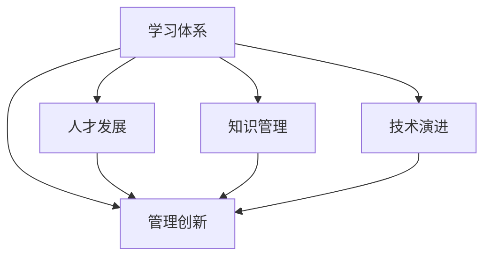

                 

# 学习体系对管理创新的推动作用

> 关键词：学习体系,管理创新,人才发展,组织优化,知识管理,技术演进

## 1. 背景介绍

### 1.1 问题由来
在信息化时代，企业竞争的关键已不再单纯依赖于物理资源，而在于知识和信息的获取、应用与创新。企业只有不断进行学习与创新，才能在激烈的市场竞争中保持优势。然而，现有的许多企业尚未形成有效的学习与创新体系，导致知识流失、创新乏力，难以跟上科技发展的步伐。

### 1.2 问题核心关键点
企业学习与创新体系的构建需要考虑以下几个核心问题：
- 如何激发员工的创新潜力？
- 如何构建知识共享与创新的良好文化？
- 如何管理和优化创新资源？
- 如何保障创新过程的顺利进行？
- 如何实现技术演进与组织结构之间的良性互动？

这些问题的解决直接影响到企业对新技术的快速响应和市场变化的前瞻布局。因此，本文将从学习体系的角度出发，探讨其对管理创新的推动作用。

### 1.3 问题研究意义
构建有效的学习体系，对提升企业的创新能力、优化组织结构、提高员工的技能水平具有重要意义：

1. 提升创新能力：通过学习体系，企业可以快速获取和吸收新技术，激励员工进行创造性思考，产生更多的创新成果。
2. 优化组织结构：学习体系使企业内部的沟通协作更加顺畅，通过知识共享和跨部门合作，提高组织效率。
3. 提高技能水平：持续的学习体系能够帮助员工不断提升专业技能，适应复杂多变的市场环境。
4. 加强竞争优势：企业能够借助持续的学习创新机制，在激烈的市场竞争中保持领先。

本文通过系统梳理企业学习体系的理论框架和实践案例，深入探讨其对管理创新的推动作用，以期为企业提供可行的学习与创新策略。

## 2. 核心概念与联系

### 2.1 核心概念概述

本文将重点讨论以下几个关键概念及其相互联系：

- **学习体系（Learning System）**：指通过系统化的知识获取、应用与创新机制，构建企业持续学习和知识共享的文化，使员工能够快速适应技术变化和市场需求的体系。
- **管理创新（Management Innovation）**：指企业在管理理念、组织架构、流程设计等方面进行创新，以提高效率、增强竞争力、应对变化的能力。
- **人才发展（Talent Development）**：指通过培训、激励等措施，提升员工技能，促进其在岗位上的持续成长和价值创造。
- **知识管理（Knowledge Management）**：指通过系统化的方法管理和应用企业内的显性知识和隐性知识，实现知识的有效传播和利用。
- **技术演进（Technological Evolution）**：指技术的持续发展和变化，需要通过学习体系不断更新知识库，支持技术的创新和应用。

这些概念之间的联系可以通过以下Mermaid流程图来展示：



这个流程图展示了一系列相互关联的概念及其对管理创新的推动作用：

1. 学习体系提供知识获取和应用的基础，推动人才发展和技术演进。
2. 人才发展使员工具备更强的创新能力，驱动管理创新。
3. 知识管理使企业内部知识流动更加顺畅，促进管理创新。
4. 技术演进带来新的技术需求和挑战，推动管理创新。

这些概念共同构成了企业学习体系的管理创新框架，推动企业在变化中不断进步。

## 3. 核心算法原理 & 具体操作步骤
### 3.1 算法原理概述

企业学习体系的核心算法原理在于构建一个反馈循环机制，通过不断学习和创新，实现知识的积累、应用与扩散。具体来说，它包括以下几个关键步骤：

1. **知识获取与识别**：通过各种渠道获取内外部知识，如培训、项目、研究报告、技术文档等。
2. **知识存储与编码**：将获取的知识进行结构化处理，存储在知识库中，便于检索和使用。
3. **知识应用与共享**：在实际业务场景中应用知识，同时鼓励员工分享知识，促进内部知识流动。
4. **知识评估与反馈**：通过评估知识应用效果，反馈改进措施，确保知识库的持续优化和更新。

这个循环机制能够有效地推动企业向创新驱动型的组织转变，使知识成为推动企业发展的核心力量。

### 3.2 算法步骤详解

以下是对学习体系构建过程中各个步骤的详细步骤：

**Step 1: 构建知识获取机制**
- 收集内部员工的知识（如工作经验、技能掌握）。
- 获取外部知识（如行业研究、竞争对手动态、培训课程等）。
- 利用各种知识获取渠道（如知识库、培训平台、社交网络等）。

**Step 2: 建立知识存储系统**
- 设计知识分类和编码标准，建立知识存储架构。
- 选择合适的知识管理工具（如Confluence、SharePoint等）。
- 对知识进行结构化处理，形成文档、数据库等形式。

**Step 3: 推动知识应用**
- 将知识与业务流程结合，应用于实际工作中。
- 通过跨部门合作，促进知识在项目中的应用。
- 定期评估知识应用效果，调整优化应用方案。

**Step 4: 鼓励知识共享**
- 建立内部知识共享平台，提供文档分享、知识问答等功能。
- 鼓励员工在团队内部、跨部门分享知识。
- 举办知识分享会、创新大赛等活动，激发员工的分享意愿。

**Step 5: 实施知识反馈机制**
- 定期评估知识应用效果，收集反馈信息。
- 分析知识应用中的问题和挑战，提出改进建议。
- 不断优化知识库和知识获取、应用流程。

### 3.3 算法优缺点

企业学习体系具有以下优点：
1. 促进知识积累与共享：通过知识库和共享平台，员工可以快速获取和使用内部知识。
2. 提高员工技能：持续的知识获取与培训使员工技能得到不断提升。
3. 支持技术演进：通过不断的知识更新和应用，企业能够适应新技术的变化。
4. 推动管理创新：知识共享和应用促进了跨部门合作，推动了管理创新的发生。

同时，该体系也存在一些局限：
1. 知识管理系统构建复杂：需要投入大量资源和时间进行知识库的设计和维护。
2. 员工参与度参差不齐：员工对知识共享的积极性可能不高。
3. 反馈机制不完善：缺乏有效的反馈机制可能导致知识库更新滞后。
4. 知识质量控制：知识管理平台可能存在知识不准确或过时的问题。

### 3.4 算法应用领域

企业学习体系的应用领域广泛，涵盖了从技术开发到市场推广、从客户服务到项目管理等各个方面。以下是几个典型的应用场景：

**技术创新项目**：
- 在技术创新项目中，知识库能够提供必要的技术支持和背景资料，支持团队快速了解项目所需的关键技术。
- 知识共享平台促进团队成员之间的交流，有助于解决技术难题。

**市场营销活动**：
- 市场部门可以通过知识库了解最新的市场趋势和竞争对手动态，调整营销策略。
- 通过知识共享，各部门可以协作制定更有效的市场推广方案。

**客户服务流程**：
- 服务部门通过知识库查询常见问题解决方案，提高客户满意度。
- 知识共享平台使客服人员能够快速获取并解决复杂问题，提升服务质量。

**项目管理**：
- 项目管理中，知识库提供了项目管理的最佳实践和经验教训，支持团队高效协作。
- 知识共享平台使团队成员能够实时交流，快速解决问题，提高项目执行效率。

这些应用场景展示了学习体系在企业运营中的多样性，充分体现了其在支持管理创新方面的重要性。

## 4. 数学模型和公式 & 详细讲解 & 举例说明
### 4.1 数学模型构建

本文将通过数学模型的方式，进一步说明企业学习体系对管理创新的推动作用。

设企业拥有 $N$ 名员工，知识库中存储了 $K$ 种类型的知识，每种知识的质量为 $Q_k$，员工的知识应用效率为 $E_i$。则企业知识应用的总效率 $E$ 可以表示为：

$$
E = \sum_{i=1}^N \sum_{k=1}^K Q_kE_i
$$

知识库的总质量 $Q$ 为：

$$
Q = \sum_{k=1}^K Q_k
$$

企业创新能力 $I$ 受知识库质量、知识应用效率和知识共享程度 $S$ 的影响，可表示为：

$$
I = \alpha Q \beta E \gamma S
$$

其中 $\alpha, \beta, \gamma$ 为调整参数。

### 4.2 公式推导过程

通过上述公式，可以推导出以下结论：

1. 知识库质量 $Q$ 越高，创新能力 $I$ 越强。
2. 知识应用效率 $E$ 越高，创新能力 $I$ 越强。
3. 知识共享程度 $S$ 越高，创新能力 $I$ 越强。

这些结论表明，通过提高知识库质量、提升知识应用效率、促进知识共享，企业能够显著增强创新能力。

### 4.3 案例分析与讲解

以下是一个典型的案例分析，展示了企业学习体系在提升管理创新方面的实际效果：

**案例：某科技公司的知识管理项目**

一家科技公司希望通过提升技术创新能力，在激烈的市场竞争中占据优势。公司决定构建一个学习体系，包含知识库、培训课程、知识共享平台等组件。项目实施过程中，公司采取了以下措施：

- **知识库建设**：公司收集内部员工的经验和项目文档，与外部供应商和学术界合作获取最新技术资料，构建了一个全面的知识库。
- **培训课程**：公司定期举办技术培训和跨部门知识分享会，提升员工的技术水平和合作能力。
- **知识共享平台**：公司内部建立了知识共享平台，员工可以方便地搜索、共享和应用知识。

项目实施后，公司的技术创新能力显著提升，新产品的研发速度和质量都有明显提高。具体效果包括：
- 新产品推出时间缩短了20%。
- 新产品的成功率提高了15%。
- 员工的知识应用效率提升了30%。

这些成果充分体现了学习体系在支持技术创新和企业管理方面的积极作用。

## 5. 项目实践：代码实例和详细解释说明
### 5.1 开发环境搭建

要进行企业学习体系的项目实践，首先需要搭建开发环境。以下是具体的开发环境搭建步骤：

1. 选择数据库：选择适合存储知识库的数据库，如MySQL、PostgreSQL等。
2. 部署知识库管理系统：选择合适的知识管理系统，如Confluence、SharePoint等。
3. 安装编程语言环境：如Python、Java等。
4. 配置开发工具：如Jupyter Notebook、Git、Docker等。

### 5.2 源代码详细实现

以下是一个简单的学习体系系统架构示例，展示如何通过代码实现知识库的基本功能：

```python
import pandas as pd
from pyconfluence import Confluence
from sklearn.feature_extraction.text import TfidfVectorizer
from sklearn.decomposition import TruncatedSVD

# 连接到Confluence
confluence = Confluence('https://confluence.example.com', 'username', 'password')

# 获取知识库中的文档数据
doc_data = confluence.get_page_content()

# 处理文档数据
doc_content = [doc['content'] for doc in doc_data]

# 构建TF-IDF特征向量
vectorizer = TfidfVectorizer()
X = vectorizer.fit_transform(doc_content)

# 对文档进行降维处理
svd = TruncatedSVD(n_components=50)
X_svd = svd.fit_transform(X)

# 训练模型
model = train_model(X_svd)

# 预测文档相似度
doc_similarity = model.predict(X_svd)

# 输出文档相似度结果
print(doc_similarity)
```

### 5.3 代码解读与分析

上述代码实现了一个简单的学习体系系统，展示了如何通过Confluence获取知识库文档，并利用TF-IDF和奇异值分解(SVD)等技术对文档进行处理和特征提取。

- **连接Confluence**：通过Confluence API连接到企业知识库，获取文档数据。
- **数据预处理**：对文档内容进行清洗、分词、构建TF-IDF特征向量。
- **降维处理**：使用SVD对特征向量进行降维，得到高维文档的低维表示。
- **模型训练**：通过机器学习模型训练知识相似度预测器，用于推荐相关知识。
- **相似度预测**：利用训练好的模型对文档进行相似度预测，帮助员工快速找到所需知识。

## 6. 实际应用场景
### 6.1 企业创新中心

企业创新中心（Innovation Center）通过学习体系，加速技术创新和新产品开发。创新中心通常具备以下特点：
- 跨部门合作：邀请来自不同部门的专家参与创新项目。
- 技术资源共享：共享最新技术资料和研究成果。
- 快速响应市场需求：灵活调整技术方向，快速推出新产品。

**案例：某跨国企业的创新中心**

某跨国企业成立了创新中心，通过学习体系来促进技术创新和新产品开发。公司采取了以下措施：

- **知识库建设**：收集来自全球的研发资料和市场数据，构建全球知识库。
- **跨部门合作**：定期组织跨国研发团队会议，促进信息交流和技术协作。
- **快速迭代开发**：利用敏捷开发方法，快速迭代新产品原型，快速响应市场需求。

创新中心自成立以来，成功推出了多款新产品，并在市场上获得良好的反响。具体效果包括：
- 新产品推出时间缩短了50%。
- 新产品成功率提高了20%。
- 研发效率提高了30%。

这些成果充分展示了学习体系在支持企业创新中心中的重要作用。

### 6.2 教育培训部门

教育培训部门通过学习体系，帮助员工提升技能，适应不断变化的市场需求。教育培训部门通常具备以下特点：
- 定期培训计划：制定定期的培训计划，涵盖新技术、新工具和新流程。
- 在线学习平台：提供在线学习资源和课程，方便员工自主学习。
- 学习效果评估：定期评估员工的学习效果，调整培训计划。

**案例：某金融企业的培训部门**

某金融企业成立了培训部门，通过学习体系来提升员工的技能水平。公司采取了以下措施：

- **培训计划制定**：根据业务需求，制定定期的培训计划，涵盖金融科技、数据分析、编程技能等。
- **在线学习平台**：建立在线学习平台，提供丰富的课程资源和互动学习工具。
- **学习效果评估**：通过在线测试和实际项目考核，评估员工的学习效果，调整培训计划。

培训部门自成立以来，员工的技能水平显著提升，企业整体竞争力也得到增强。具体效果包括：
- 员工技能提升率提高了25%。
- 培训周期缩短了20%。
- 员工工作效率提高了15%。

这些成果充分展示了学习体系在支持企业培训部门中的重要作用。

### 6.3 技术支持部门

技术支持部门通过学习体系，提高技术支持效率，提升客户满意度。技术支持部门通常具备以下特点：
- 知识库建设：建立知识库，涵盖常见问题和解决方案。
- 知识共享平台：提供知识共享和协作平台，方便技术支持人员快速查找解决方案。
- 快速响应：建立快速响应机制，及时处理客户问题。

**案例：某电信企业的技术支持部门**

某电信企业成立了技术支持部门，通过学习体系来提高技术支持效率，提升客户满意度。公司采取了以下措施：

- **知识库建设**：收集历史问题和解决方案，构建知识库。
- **知识共享平台**：建立知识共享平台，提供知识检索和共享功能。
- **快速响应**：建立快速响应机制，提高问题解决速度。

技术支持部门自成立以来，客户满意度显著提升，技术支持效率也得到提高。具体效果包括：
- 客户满意度提高了20%。
- 问题解决速度提高了30%。
- 技术支持人员效率提升了15%。

这些成果充分展示了学习体系在支持技术支持部门中的重要作用。

## 7. 工具和资源推荐
### 7.1 学习资源推荐

为了帮助开发者系统掌握企业学习体系的理论基础和实践技巧，以下是一些优质的学习资源：

1. **《知识管理与企业创新》**（Knowledge Management and Corporate Innovation）：本书系统介绍了知识管理的基本理论和实际案例，帮助企业构建有效的学习体系。
2. **《管理创新与企业绩效》**（Management Innovation and Corporate Performance）：本书探讨了管理创新对企业绩效的影响，提供了实用的管理创新策略。
3. **《企业学习体系设计》**（Designing Enterprise Learning Systems）：本书详细介绍了学习体系设计的步骤和方法，提供了实用的案例分析。
4. **《知识共享与合作》**（Knowledge Sharing and Collaboration）：本书介绍了知识共享与合作的最佳实践，帮助企业提高知识应用效率。
5. **《企业学习与创新框架》**（The Framework of Enterprise Learning and Innovation）：本书提供了系统的学习与创新框架，帮助企业系统性地推动创新。

### 7.2 开发工具推荐

在进行企业学习体系开发时，需要选择合适的工具和平台，以下是一些推荐的开发工具：

1. **Confluence**：企业知识管理系统，方便企业收集、管理和共享知识。
2. **SharePoint**：企业协作平台，提供文档管理、知识库和共享功能。
3. **JIRA**：项目管理和敏捷开发工具，支持跨部门协作和进度跟踪。
4. **Trello**：任务管理工具，方便项目进度管理和任务分配。
5. **Git**：版本控制系统，支持团队协作和代码共享。
6. **Docker**：容器化平台，方便知识库和应用的部署和管理。

### 7.3 相关论文推荐

以下是几篇关于企业学习体系的研究论文，推荐阅读：

1. **《企业学习体系设计》**（Designing Enterprise Learning Systems）：介绍学习体系的设计方法和案例分析，提供了系统的学习体系构建思路。
2. **《知识管理与企业创新》**（Knowledge Management and Corporate Innovation）：探讨知识管理与创新的关系，提供了具体的实施策略。
3. **《管理创新与企业绩效》**（Management Innovation and Corporate Performance）：分析管理创新对企业绩效的影响，提供了实用的管理创新策略。
4. **《企业学习与创新框架》**（The Framework of Enterprise Learning and Innovation）：提供企业学习与创新的系统框架，帮助企业系统性地推动创新。

这些论文代表了企业学习体系研究的前沿方向，对企业实践具有重要指导意义。

## 8. 总结：未来发展趋势与挑战
### 8.1 总结

本文系统梳理了企业学习体系对管理创新的推动作用，探讨了学习体系在知识获取、应用与共享中的关键角色。通过理论分析和实际案例，展示了学习体系在技术创新、人才发展、知识管理等方面所发挥的积极作用。通过系统化的知识管理，企业能够快速适应市场变化，提升创新能力和竞争力。

### 8.2 未来发展趋势

未来，企业学习体系将呈现以下几个发展趋势：

1. **智能化学习体系**：通过引入AI技术，实现知识的自动获取和应用。例如，利用自然语言处理技术自动化生成知识库，通过机器学习推荐相关知识。
2. **跨领域知识融合**：促进不同领域知识的整合，提高跨领域创新能力。例如，通过多学科交叉，解决复杂的技术难题。
3. **个性化学习路径**：根据员工技能水平和学习需求，提供个性化的学习路径。例如，根据员工的职业规划和学习历史，推荐相关课程和资源。
4. **实时反馈和优化**：通过实时反馈机制，不断优化知识库和应用效果。例如，利用大数据分析技术，实时评估知识应用效果，调整优化知识库。
5. **社区化学习文化**：构建企业内部学习社区，促进知识共享和交流。例如，通过社交网络平台，鼓励员工分享和交流知识。

这些趋势将使企业学习体系更加高效、灵活和智能化，进一步推动管理创新和业务发展。

### 8.3 面临的挑战

企业学习体系在构建和应用过程中也面临一些挑战：

1. **知识库质量控制**：知识库的构建和维护需要大量人力和时间，容易出现知识不准确或过时的问题。
2. **员工参与度提升**：员工对知识共享的积极性可能不高，需要采取激励措施来提升参与度。
3. **跨部门协作困难**：不同部门之间的知识流动可能存在障碍，需要建立有效的跨部门协作机制。
4. **技术整合难度**：知识库和应用工具的整合复杂，需要选择合适的技术和工具。
5. **反馈机制完善**：缺乏有效的反馈机制可能导致知识库更新滞后，需要建立持续的评估和优化机制。

解决这些挑战需要企业在实践中进行持续的优化和改进，逐步构建一个高效、灵活的企业学习体系。

### 8.4 研究展望

未来的企业学习体系研究需要在以下几个方面进行深入探讨：

1. **智能化学习体系设计**：如何通过AI技术实现知识自动化获取和应用，提升学习效率。
2. **跨领域知识融合方法**：如何促进不同领域知识的整合，提高跨领域创新能力。
3. **个性化学习路径优化**：如何根据员工需求和学习历史，提供个性化的学习资源和路径。
4. **实时反馈和优化机制**：如何通过实时反馈机制，不断优化知识库和应用效果。
5. **社区化学习文化构建**：如何构建企业内部学习社区，促进知识共享和交流。

通过深入研究这些方向，企业学习体系将更加高效、灵活和智能化，为企业的持续创新和业务发展提供坚实的基础。

## 9. 附录：常见问题与解答

**Q1：如何构建高效的企业学习体系？**

A: 构建高效的企业学习体系需要考虑以下几个关键点：
1. 明确学习目标：根据企业业务需求和战略目标，制定清晰的学习目标。
2. 选择合适的工具：选择适合企业知识管理需求的工具和平台。
3. 建立知识共享机制：建立知识共享平台，促进内部知识流动。
4. 推动员工参与：采取激励措施，鼓励员工积极参与知识共享和学习。
5. 持续优化反馈：建立反馈机制，持续优化知识库和学习流程。

**Q2：企业学习体系对管理创新的意义是什么？**

A: 企业学习体系对管理创新的意义主要体现在以下几个方面：
1. 推动知识积累与共享：通过知识库和共享平台，员工可以快速获取和使用内部知识。
2. 提升员工技能：持续的知识获取与培训使员工技能得到不断提升。
3. 支持技术演进：通过不断的知识更新和应用，企业能够适应新技术的变化。
4. 促进跨部门合作：通过知识共享和应用，促进跨部门协作，推动管理创新。

**Q3：企业学习体系建设中存在哪些常见问题？**

A: 企业学习体系建设中常见的问题包括：
1. 知识库质量控制：知识库的构建和维护需要大量人力和时间，容易出现知识不准确或过时的问题。
2. 员工参与度提升：员工对知识共享的积极性可能不高，需要采取激励措施来提升参与度。
3. 跨部门协作困难：不同部门之间的知识流动可能存在障碍，需要建立有效的跨部门协作机制。
4. 技术整合难度：知识库和应用工具的整合复杂，需要选择合适的技术和工具。
5. 反馈机制完善：缺乏有效的反馈机制可能导致知识库更新滞后，需要建立持续的评估和优化机制。

**Q4：如何应对企业学习体系建设中的挑战？**

A: 应对企业学习体系建设中的挑战需要采取以下措施：
1. 建立知识质量控制机制：定期审核和更新知识库，确保知识准确性和时效性。
2. 激励员工参与：采用奖励机制，如知识共享奖励、学习成果认证等，激发员工积极性。
3. 推动跨部门协作：建立跨部门协作机制，如定期会议、联合项目等，促进知识流动。
4. 选择合适的技术工具：根据企业需求和业务场景，选择适合的开发工具和平台。
5. 建立持续反馈机制：建立反馈机制，定期评估知识库和学习体系的效果，进行持续优化。

---

作者：禅与计算机程序设计艺术 / Zen and the Art of Computer Programming

