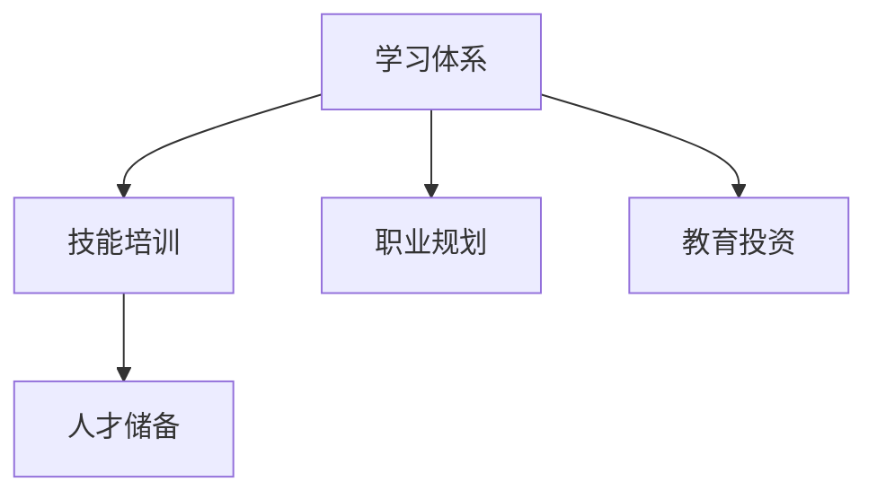

                 

# 学习体系对职业发展的作用

> 关键词：学习体系,职业发展,技能培训,职业规划,人才储备,教育投资

## 1. 背景介绍

### 1.1 问题由来
在科技日新月异、竞争日趋激烈的时代，个人职业发展的持续性已成为一个重要的课题。随着技术的快速迭代，传统的工作技能可能逐渐被淘汰，终身学习成为必需。而学习体系则是一套系统的、科学的方法论，旨在帮助个人不断提升自我，适应变化，实现职业生涯的长远发展。

### 1.2 问题核心关键点
构建有效的学习体系，需明确以下几点：
1. **终身学习的理念**：学习不应仅限于学校教育，而应贯穿整个人生，不断适应技术的变化。
2. **技能培训的结构化**：结合职业需求，制定系统的技能培训路径。
3. **职业规划的动态调整**：根据个人成长与市场需求，动态调整职业发展计划。
4. **人才储备的战略性**：建立多元化的学习资源库，为未来的技术创新做准备。
5. **教育投资的回报**：评估教育投资对个人职业发展的长远效益。

### 1.3 问题研究意义
研究学习体系对职业发展的作用，对于提升个人职业竞争力，推动技术人才的培养，具有重要意义：

1. **提升职业竞争力**：通过系统的学习体系，不断提升个人技能水平，适应新岗位的要求。
2. **优化人力资源配置**：通过定制化的技能培训，帮助企业更高效地配置人力资源。
3. **推动技术创新**：学习体系鼓励学习新知识，为技术进步和创新提供人才支持。
4. **促进经济发展**：技能培训能够提升劳动力素质，驱动经济增长。
5. **增强社会竞争力**：个人和组织的终身学习能力，是提升社会整体竞争力的关键。

## 2. 核心概念与联系

### 2.1 核心概念概述

为更好地理解学习体系的作用，本节将介绍几个核心概念：

- **学习体系(Learning System)**：旨在通过系统的课程、方法和工具，帮助个体持续学习、提高技能，实现职业发展的完整体系。
- **技能培训(Skill Training)**：有目的、有组织地提升个体特定工作技能的过程，是学习体系的重要组成部分。
- **职业规划(Career Planning)**：结合个人兴趣、能力和市场需求，制定长期的职业发展目标和路径。
- **人才储备(Talent Reserve)**：通过系统的教育和培训，为未来的技术发展和市场变化做准备，形成企业或行业的人才池。
- **教育投资(Education Investment)**：为获得知识和技能而投入的资源和金钱，是个人职业发展的基石。

这些核心概念之间的逻辑关系可以通过以下Mermaid流程图来展示：



这个流程图展示了学习体系的核心概念及其之间的关系：

1. 学习体系通过技能培训，提升个体的专业技能。
2. 职业规划结合技能培训，制定个性化的职业发展路径。
3. 人才储备依托教育投资，为未来的技术创新做准备。
4. 教育投资为学习体系和技能培训提供资源支持。

## 3. 核心算法原理 & 具体操作步骤
### 3.1 算法原理概述

构建学习体系的核心在于如何制定一套系统的、能够持续提升个人职业技能的课程体系，并结合职业规划，动态调整培训内容。其核心算法原理包括以下几点：

1. **个性化评估**：通过问卷、测试等方式，评估个体当前的技能水平和兴趣方向，确定其职业发展的基础和目标。
2. **系统化课程设计**：结合评估结果和市场需求，设计系统化的课程结构，涵盖必备的基础知识、专业技能和软技能。
3. **动态调整与优化**：根据个体反馈和市场变化，动态调整课程内容和培训方法，确保学习体系的有效性。
4. **效果评估与反馈**：定期评估学习效果，通过反馈机制调整培训策略，提升学习效率。

### 3.2 算法步骤详解

构建学习体系的步骤大致如下：

1. **需求分析**：评估当前职业岗位的技能需求，确定关键技能和知识。
2. **设计课程框架**：根据需求分析结果，设计多层次的课程框架，包含基础课程、进阶课程和专项课程。
3. **选择合适的培训方法**：结合线上线下、自学与辅导、实践与理论等方法，制定系统的培训计划。
4. **实施与监督**：按照培训计划开展培训，定期评估学习效果，进行反馈和调整。
5. **持续优化**：根据市场变化和个人成长，动态优化课程内容和培训方法，确保学习体系的有效性。

### 3.3 算法优缺点

构建学习体系具有以下优点：
1. **系统化**：通过科学的方法论，帮助个体全面提升技能，系统化地规划职业发展。
2. **个性化**：结合个体特点和市场需求，提供定制化的课程和培训计划。
3. **效率高**：通过系统化、结构化的培训，提升学习效率，节省时间成本。
4. **灵活性**：根据市场变化和个人成长，动态调整课程内容，保持学习体系的有效性。

同时，该方法也存在一些局限：
1. **成本高**：系统化的学习体系构建和维护需要大量资源投入。
2. **实施难度大**：需要协调各方资源，统筹规划，确保实施效果。
3. **效果难以量化**：个体职业发展的过程复杂，难以通过单一指标量化学习效果。
4. **适应性不足**：过分依赖于预定的课程框架，可能无法适应快速变化的技术环境。

尽管存在这些局限，但学习体系的构建仍是提升职业竞争力的有效方法，对于推动技术和市场的发展具有重要意义。

### 3.4 算法应用领域

构建学习体系的方法在多个领域均有应用，例如：

- **企业人力资源管理**：制定系统化的员工培训计划，提升团队的整体素质。
- **职业院校教育**：结合市场需求，设计课程框架，培养符合行业需求的技术人才。
- **政府公共教育**：推广终身学习理念，提供多样化的教育资源，促进社会整体素质的提升。
- **在线教育平台**：基于学习体系，设计个性化的课程和辅导服务，满足不同用户的需求。
- **个人职业规划**：结合自身兴趣和市场需求，制定长期职业发展计划，实现个人成长。

除了这些主要领域，学习体系还可应用于教育技术、企业培训等多个方面，推动各行业的人才培养和技能提升。

## 4. 数学模型和公式 & 详细讲解 & 举例说明

### 4.1 数学模型构建

在本节中，我们将使用数学语言对构建学习体系的理论基础进行更加严格的刻画。

设个体当前技能水平为 $S_0$，目标技能水平为 $S_T$，则学习体系的数学模型可以表示为：

$$
S_T = f(S_0, C, E)
$$

其中：
- $S_0$：个体当前技能水平。
- $C$：学习体系中的课程和培训内容。
- $E$：教育投资，包括时间、金钱和精力等资源投入。

### 4.2 公式推导过程

以二元组 $(S_0, C, E)$ 为例，推导学习体系的基本公式：

设 $C$ 包含 $n$ 门课程，每门课程的时间、难度和效果分别为 $t_i, d_i, e_i$，则有：

$$
C = \sum_{i=1}^n t_i d_i e_i
$$

根据学习体系的目标，目标技能水平 $S_T$ 可以表示为：

$$
S_T = S_0 + \sum_{i=1}^n e_i f_i(t_i, d_i)
$$

其中 $f_i(t_i, d_i)$ 表示课程 $i$ 的效果函数，受时间 $t_i$ 和难度 $d_i$ 的影响。假设课程 $i$ 的效果函数为线性关系，则有：

$$
S_T = S_0 + \sum_{i=1}^n e_i \alpha_i t_i
$$

其中 $\alpha_i$ 为课程 $i$ 的效果系数。

### 4.3 案例分析与讲解

假设某技术公司希望通过构建学习体系，提升员工的编程能力。公司对现有的编程课程进行了评估，选取了六门课程进行培训。课程内容、时间、难度和效果系数如下：

| 课程编号 | 课程名称 | 时间（周） | 难度 | 效果系数 | 课程效果（技能点） |
|----|----|----|----|----|----|
| 1 | 基础编程 | 4 | 1 | 0.6 | 20 |
| 2 | 数据结构 | 4 | 1.2 | 0.5 | 30 |
| 3 | 算法设计与分析 | 4 | 2 | 0.4 | 25 |
| 4 | 数据库技术 | 4 | 1.5 | 0.7 | 35 |
| 5 | 前端技术 | 2 | 1.8 | 0.3 | 18 |
| 6 | 人工智能 | 4 | 2.5 | 0.6 | 30 |

假设员工当前编程技能为 80 技能点，公司预计培训总时间为 20 周，培训效果系数为 0.8，则有：

$$
S_T = 80 + 0.8 \times (20 \times 1 \times 0.6 + 20 \times 1.2 \times 0.5 + 20 \times 2 \times 0.4 + 20 \times 1.5 \times 0.7 + 10 \times 1.8 \times 0.3 + 20 \times 2.5 \times 0.6)
$$

计算得 $S_T \approx 214$ 技能点。

通过这个案例，我们可以看到，学习体系的有效性取决于课程设计、时间安排和效果评估等多方面因素。合理的课程设计能显著提升个体的技能水平。

## 5. 项目实践：代码实例和详细解释说明

### 5.1 开发环境搭建

在进行学习体系构建的项目实践前，我们需要准备好开发环境。以下是使用Python进行开发的环境配置流程：

1. 安装Anaconda：从官网下载并安装Anaconda，用于创建独立的Python环境。

2. 创建并激活虚拟环境：
```bash
conda create -n learning-system-env python=3.8 
conda activate learning-system-env
```

3. 安装必要的工具包：
```bash
pip install pandas numpy scikit-learn jupyter notebook matplotlib seaborn
```

完成上述步骤后，即可在`learning-system-env`环境中开始开发学习体系。

### 5.2 源代码详细实现

在本节中，我们将以构建一个简单的学习体系为例，给出Python代码实现。

首先，定义一个类表示课程：

```python
class Course:
    def __init__(self, name, weeks, difficulty, effect_coefficient, skill_points):
        self.name = name
        self.weeks = weeks
        self.difficulty = difficulty
        self.effect_coefficient = effect_coefficient
        self.skill_points = skill_points
```

然后，定义一个函数用于计算目标技能水平：

```python
def calculate_skill_level(current_skill, courses, hours_per_week, total_hours, effect_coefficient):
    total_effect = 0
    for course in courses:
        effect = hours_per_week * course.weeks * course.difficulty * course.effect_coefficient
        total_effect += effect * course.skill_points
    return current_skill + total_effect * effect_coefficient
```

最后，通过这些类和函数，我们可以计算一个员工通过系统培训后的技能水平。例如，在员工当前技能为 80 技能点，公司希望通过系统培训提升至 100 技能点，员工每周投入 10 小时进行学习，培训时间总计为 20 周，培训效果系数为 0.8 的情况下，可以通过以下代码进行计算：

```python
courses = [
    Course('基础编程', 4, 1, 0.6, 20),
    Course('数据结构', 4, 1.2, 0.5, 30),
    Course('算法设计与分析', 4, 2, 0.4, 25),
    Course('数据库技术', 4, 1.5, 0.7, 35),
    Course('前端技术', 2, 1.8, 0.3, 18),
    Course('人工智能', 4, 2.5, 0.6, 30)
]

current_skill = 80
hours_per_week = 10
total_hours = 20 * hours_per_week
effect_coefficient = 0.8

target_skill = calculate_skill_level(current_skill, courses, hours_per_week, total_hours, effect_coefficient)
print(f'目标技能水平为：{target_skill} 技能点')
```

这段代码演示了如何通过Python实现学习体系的计算。虽然只是简单的示例，但通过不断扩展和优化，可以构建出复杂的学习体系模型。

### 5.3 代码解读与分析

让我们再详细解读一下关键代码的实现细节：

**Course类**：
- `__init__`方法：初始化课程的基本信息，包括课程名称、周数、难度、效果系数和技能点。

**calculate_skill_level函数**：
- 通过遍历所有课程，计算每门课程对技能水平的影响。
- 将总的影响效果累加，并乘以效果系数，最终得到目标技能水平。

**计算示例**：
- 定义了六个课程，分别对应不同的技能点和培训时间。
- 计算员工在给定的时间安排和学习效果系数下，通过系统培训后的目标技能水平。

可以看出，通过编程实现学习体系模型，可以方便地进行技能水平的计算和优化。这不仅适用于个体的技能提升，也适用于企业的人力资源管理和培训规划。

## 6. 实际应用场景

### 6.1 教育机构的人才培养

教育机构可以通过构建学习体系，提升学生的综合素质和就业竞争力。通过系统化的课程设计，结合学生的兴趣和市场需求，可以培养出具备多种技能的人才，满足不同职业的需求。

在技术教育领域，学习体系可以结合线上线下教学、项目实践、实习实训等多种方式，提升学生的实践能力和团队协作能力。通过评估学生的学习效果，动态调整课程内容和教学方法，确保学生能够高效地掌握所学知识。

### 6.2 企业的员工培训

企业在构建学习体系时，可以结合员工职业发展路径，设计系统的培训课程。通过定期评估员工的培训效果，进行反馈和调整，帮助员工不断提升专业技能，适应新岗位的要求。

在技术公司，学习体系可以包含基础编程、算法设计与分析、数据库技术等多个模块。通过灵活调整课程安排和培训方式，提升员工的多样化技能，推动公司技术创新和市场竞争力。

### 6.3 政府公共教育

政府可以推动终身学习理念，构建覆盖全社会的学习体系，提升国民素质和社会竞争力。通过公共教育资源的优化配置，结合职业需求，设计系统化的学习课程，满足不同人群的学习需求。

例如，在职业技能培训方面，政府可以推出技能提升项目，结合市场需求，设计多层次的培训课程，帮助失业人员和青年群体提升就业技能。通过评估学习效果，动态调整培训内容，确保培训的实效性和针对性。

### 6.4 在线教育平台

在线教育平台可以依托学习体系，提供个性化的课程和辅导服务，满足不同用户的需求。通过系统化的课程设计和大数据分析，平台可以精准推荐课程，提升学习效率。

例如，针对大学生，平台可以推出多门选修课，结合学生的专业背景和学习偏好，推荐适合的课程内容。通过评估学生的学习效果，进行动态调整，确保课程的针对性和实效性。

## 7. 工具和资源推荐

### 7.1 学习资源推荐

为了帮助开发者系统掌握学习体系的理论基础和实践技巧，这里推荐一些优质的学习资源：

1. **《学习体系的构建与实践》系列博文**：由教育技术专家撰写，深入浅出地介绍了学习体系的概念、方法和工具。

2. **CS231n《深度学习与计算机视觉》课程**：斯坦福大学开设的计算机视觉明星课程，涵盖了深度学习在计算机视觉领域的应用，提供了丰富的学习资源。

3. **《教育技术设计与应用》书籍**：教育技术领域的经典著作，详细介绍了学习系统的设计方法和实践案例。

4. **Coursera在线课程**：提供来自全球顶尖大学和机构的在线课程，涵盖多种学习体系设计和教育技术相关主题。

5. **edX在线课程**：提供来自世界名校的在线课程，覆盖教育技术、学习体系设计等多个领域，适合自学和系统化学习。

通过对这些资源的学习实践，相信你一定能够快速掌握学习体系的设计方法和实践技巧，并在实际应用中取得良好的效果。

### 7.2 开发工具推荐

高效的开发离不开优秀的工具支持。以下是几款用于学习体系开发常用的工具：

1. Jupyter Notebook：一个开源的交互式计算环境，支持Python、R等多种编程语言，非常适合数据科学和教育技术的实践。

2. Weights & Biases：一个模型训练的实验跟踪工具，可以记录和可视化模型训练过程中的各项指标，方便对比和调优。与主流深度学习框架无缝集成。

3. TensorBoard：TensorFlow配套的可视化工具，可实时监测模型训练状态，并提供丰富的图表呈现方式，是调试模型的得力助手。

4. Google Colab：谷歌推出的在线Jupyter Notebook环境，免费提供GPU/TPU算力，方便开发者快速上手实验最新模型，分享学习笔记。

5. Tableau：一款数据可视化工具，可以方便地展示学习体系的效果评估结果，提供直观的可视化分析。

合理利用这些工具，可以显著提升学习体系开发和评估的效率，加快创新迭代的步伐。

### 7.3 相关论文推荐

学习体系的设计和应用是教育技术领域的重要研究方向，以下是几篇奠基性的相关论文，推荐阅读：

1. **《个性化学习体系设计》**：深入探讨了如何结合个体差异和市场需求，设计个性化的学习体系。

2. **《企业学习体系的构建与评估》**：通过案例分析，展示了企业如何系统化地构建员工培训体系，提升团队的整体素质。

3. **《学习体系的设计与优化》**：介绍了学习体系设计的基本方法，结合大数据分析技术，优化学习体系的实施效果。

4. **《终身学习体系的构建》**：探讨了终身学习体系在社会教育中的应用，提出了系统化的学习资源配置策略。

5. **《在线教育平台的学习体系设计》**：研究了在线教育平台如何基于学习体系，提供个性化和系统化的学习服务，满足用户的多样化需求。

这些论文代表了大规模学习体系设计和应用的研究脉络。通过学习这些前沿成果，可以帮助研究者把握学科前进方向，激发更多的创新灵感。

## 8. 总结：未来发展趋势与挑战

### 8.1 总结

本文对学习体系对职业发展的作用进行了全面系统的介绍。首先阐述了学习体系的概念和构建过程，明确了学习体系在提升个人职业竞争力、优化人力资源配置等方面的重要意义。其次，从理论到实践，详细讲解了学习体系的设计方法，给出了学习体系开发的完整代码实例。同时，本文还广泛探讨了学习体系在教育、企业、政府等多个领域的应用前景，展示了学习体系范式的广泛应用价值。此外，本文精选了学习体系的设计和应用资源，力求为读者提供全方位的技术指引。

通过本文的系统梳理，可以看到，学习体系不仅对个体的职业发展具有重要意义，对于推动技术人才的培养和技能提升也具有深远的影响。未来，伴随技术的不断进步和市场需求的变化，学习体系将进一步优化和发展，更好地服务于社会的整体发展。

### 8.2 未来发展趋势

展望未来，学习体系的发展趋势将呈现出以下几个特点：

1. **技术化**：学习体系将越来越多地采用先进的技术手段，如人工智能、大数据、区块链等，提升学习效果和智能化水平。
2. **个性化**：结合个体学习偏好和职业需求，提供更加个性化和定制化的学习服务，提升学习效率和满意度。
3. **社会化**：学习体系将突破传统教育机构的边界，覆盖全社会的学习需求，推动全民终身学习的普及。
4. **跨界融合**：学习体系将与其他技术领域进行更深入的融合，如教育技术、在线教育、企业培训等，形成多元化、系统化的学习生态。
5. **国际化**：学习体系将打破语言和文化的壁垒，支持多语言学习，提升全球教育资源的共享和交流。

这些趋势凸显了学习体系的发展潜力和应用前景，必将为个人职业发展和社会进步带来深远的影响。

### 8.3 面临的挑战

尽管学习体系已经取得了显著的成果，但在迈向更加智能化、个性化、社会化的过程中，仍面临诸多挑战：

1. **技术实现难度**：学习体系的设计和实施需要结合多种技术和方法，如人工智能、大数据分析等，技术实现难度较大。
2. **数据隐私和安全**：学习体系涉及大量个人信息和学习数据，如何保障数据隐私和安全，是一个重要问题。
3. **资源投入高**：构建学习体系需要大量的教育资源和资金投入，对企业和教育机构的资源配置能力提出了较高要求。
4. **效果评估困难**：学习体系的效果评估涉及多维度的指标，难以通过单一指标全面衡量其价值。
5. **市场适应性不足**：学习体系的设计需要结合市场需求，如何灵活调整课程内容，以适应快速变化的市场环境，是一个重要课题。

尽管存在这些挑战，但学习体系的未来发展潜力仍然巨大。通过积极应对和不断优化，相信学习体系能够更好地服务于个体职业发展和社会的整体进步。

### 8.4 研究展望

面对学习体系所面临的挑战，未来的研究需要在以下几个方面寻求新的突破：

1. **多技术融合**：探索将人工智能、大数据、区块链等技术手段与学习体系相结合，提升学习效率和效果。
2. **个性化学习算法**：研发更加精准的学习推荐算法，结合个体学习偏好和职业需求，提供个性化学习路径。
3. **数据隐私保护**：研究如何保护学习数据隐私和安全，保障个人和企业的权益。
4. **成本效益分析**：评估学习体系的投资回报，优化资源配置，确保其可持续性。
5. **市场适应性优化**：设计动态调整机制，灵活适应市场需求和技术变化，提升学习体系的灵活性和实效性。

这些研究方向的探索，必将引领学习体系技术的发展，为个体职业发展和社会进步带来新的机遇和挑战。

## 9. 附录：常见问题与解答

**Q1：构建学习体系需要哪些关键步骤？**

A: 构建学习体系的关键步骤包括：
1. 需求分析：评估当前职业岗位的技能需求，确定关键技能和知识。
2. 课程设计：结合市场需求和个人兴趣，设计系统化的课程框架。
3. 培训实施：结合线上线下、自学与辅导、实践与理论等方法，制定系统的培训计划。
4. 效果评估：定期评估学习效果，进行反馈和调整。
5. 持续优化：根据市场变化和个人成长，动态优化课程内容和培训方法。

这些步骤确保了学习体系的科学性和有效性，能够持续提升个体的职业竞争力。

**Q2：如何评估学习体系的效果？**

A: 学习体系的效果评估可以从以下几个方面进行：
1. 技能水平提升：通过对比培训前后的技能测试结果，评估学习体系对个体技能提升的效果。
2. 学习效率提升：通过统计学习时间和培训效果的关系，评估学习体系的效率。
3. 职业发展提升：通过跟踪个体职业发展的轨迹，评估学习体系对职业发展的贡献。
4. 反馈与满意度：通过调查问卷和访谈，收集用户反馈，评估学习体系的用户满意度。
5. 长期影响：通过长期跟踪，评估学习体系对个体职业发展的长期影响。

这些评估方法能够全面衡量学习体系的效果，确保其科学性和实效性。

**Q3：构建学习体系需要哪些资源支持？**

A: 构建学习体系需要以下资源支持：
1. 教育资源：包括课程内容、教材、教学设备等，确保学习体系的完整性和实用性。
2. 人力资源：包括讲师、技术支持、学习辅导员等，确保学习体系的实施效果。
3. 资金支持：包括培训费用、技术开发费用等，确保学习体系的持续性和稳定性。
4. 时间支持：包括学习时间和课程安排，确保学习体系的灵活性和实效性。
5. 技术支持：包括学习平台、数据管理系统、学习分析工具等，确保学习体系的智能化和高效性。

这些资源的支持是学习体系构建和实施的基础，能够确保学习体系的科学性和可持续性。

**Q4：学习体系对职业发展有哪些具体作用？**

A: 学习体系对职业发展有以下几个具体作用：
1. 提升技能水平：通过系统化的课程设计和培训，提升个体的专业技能，适应新岗位的要求。
2. 优化职业路径：结合市场需求和个人兴趣，设计个性化的职业发展路径，提升职业发展的灵活性和适应性。
3. 增强学习效率：通过科学的课程安排和学习方法，提升学习效率，节省时间成本。
4. 提供职业支持：通过提供职业咨询、职业规划等支持，帮助个体更好地适应职业变化，提升职业竞争力。
5. 促进创新能力：通过多元化的课程内容和培训方式，提升个体的创新能力和团队协作能力。

这些作用确保了学习体系能够全面提升个体的职业素质和竞争力，实现职业发展的长远目标。

**Q5：如何构建适合企业的学习体系？**

A: 构建适合企业的学习体系需要以下步骤：
1. 需求分析：评估企业内不同岗位的技能需求，确定关键技能和知识。
2. 课程设计：结合企业需求和员工兴趣，设计系统化的课程框架，涵盖必备的基础知识、专业技能和软技能。
3. 培训实施：结合线上线下、自学与辅导、实践与理论等方法，制定系统的培训计划。
4. 效果评估：定期评估员工的培训效果，进行反馈和调整。
5. 持续优化：根据市场变化和员工成长，动态调整课程内容和培训方法，确保学习体系的有效性。

这些步骤确保了学习体系的科学性和实用性，能够提升企业的整体素质和竞争力。

---

作者：禅与计算机程序设计艺术 / Zen and the Art of Computer Programming

