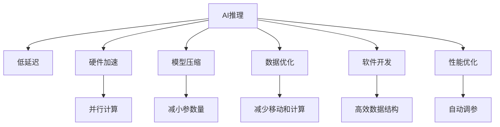

                 

# 实时AI推理服务：Lepton AI的低延迟方案

> 关键词：实时推理,低延迟,Lepton AI,硬件加速,模型压缩,数据优化,软件开发,性能优化

## 1. 背景介绍

### 1.1 问题由来
随着人工智能技术的快速发展，AI推理服务已成为各行各业智能化升级的重要引擎。然而，传统的基于CPU或GPU的推理服务，往往面临计算速度慢、资源利用率低等局限，难以满足大规模、高实时性应用的需求。Lepton AI公司通过其低延迟AI推理平台，彻底改变了这一局面。

Lepton AI依托于其独有的硬件加速、模型压缩、数据优化等多项核心技术，提供高精度、低延迟的AI推理服务。其产品广泛应用于金融、医疗、交通等多个领域，为企业智能化转型提供了强大的技术支撑。

### 1.2 问题核心关键点
Lepton AI的低延迟AI推理服务之所以能够在高实时性应用中取得突破，主要依赖于以下几个关键技术：

1. **硬件加速**：利用专用的ASIC芯片或FPGA，实现高效的并行计算，极大提升推理速度。
2. **模型压缩**：通过量化、剪枝、蒸馏等技术，大幅减小模型规模，降低计算资源消耗。
3. **数据优化**：通过数据预处理、缓存策略、访问模式优化，减少数据移动和计算开销。
4. **软件开发**：采用高效的数据结构和算法，减少中间计算和存储开销。
5. **性能优化**：通过自动调参、预测误差分析等方法，不断优化模型和算法性能。

Lepton AI的低延迟AI推理平台，正是基于这些关键技术，实现了高精度、低延迟的推理服务，满足各类高实时性应用需求。

### 1.3 问题研究意义
研究Lepton AI的低延迟AI推理方案，对于提升AI推理服务的实时性和效率，具有重要意义：

1. **加速业务流程**：在金融风控、医疗诊断、交通调度等场景中，快速准确的AI推理能够极大提升业务处理速度，缩短响应时间。
2. **降低计算成本**：通过模型压缩和数据优化，大幅降低推理服务对计算资源的需求，降低企业技术投入。
3. **提升用户体验**：高实时性的AI服务能够提供更快速、准确的应用体验，提升用户满意度。
4. **推动产业创新**：低延迟AI推理技术为各行各业提供了更高效的智能化解决方案，推动行业技术创新。

## 2. 核心概念与联系

### 2.1 核心概念概述

为更好地理解Lepton AI的低延迟AI推理方案，本节将介绍几个密切相关的核心概念：

- **AI推理**：通过预先训练好的模型，对输入数据进行计算处理，输出预测结果的过程。
- **低延迟**：指从数据输入到结果输出的总时间较短，能够满足实时性要求。
- **硬件加速**：利用专用硬件芯片（如ASIC、FPGA等）进行并行计算，提升计算速度。
- **模型压缩**：通过量化、剪枝、蒸馏等技术，减小模型参数量，降低计算复杂度。
- **数据优化**：通过预处理、缓存、访问模式优化等方法，减少数据移动和计算开销。
- **软件开发**：采用高效的数据结构和算法，提高程序的执行效率。
- **性能优化**：通过自动调参、预测误差分析等手段，不断优化模型和算法性能。

这些核心概念之间的逻辑关系可以通过以下Mermaid流程图来展示：



这个流程图展示了大语言模型的核心概念及其之间的关系：

1. AI推理通过低延迟技术实现快速响应。
2. 硬件加速、模型压缩、数据优化等技术，提升了推理速度和资源利用率。
3. 软件开发和高性能优化，进一步提高推理效率和准确性。
4. 各技术环节共同作用，最终实现Lepton AI的低延迟AI推理方案。

## 3. 核心算法原理 & 具体操作步骤
### 3.1 算法原理概述

Lepton AI的低延迟AI推理方案，基于深度学习的推理过程，采用多层次的技术手段，提升计算速度和资源利用率。核心算法原理包括以下几个方面：

1. **模型压缩技术**：通过量化、剪枝、蒸馏等方法，大幅减小模型规模，降低计算复杂度。
2. **硬件加速技术**：利用专用硬件芯片（如ASIC、FPGA）进行并行计算，提升推理速度。
3. **数据优化技术**：通过预处理、缓存、访问模式优化等手段，减少数据移动和计算开销。
4. **高效软件开发技术**：采用高效的数据结构和算法，减少中间计算和存储开销。
5. **性能优化技术**：通过自动调参、预测误差分析等方法，不断优化模型和算法性能。

### 3.2 算法步骤详解

Lepton AI的低延迟AI推理方案，主要包括以下几个关键步骤：

**Step 1: 准备数据和模型**

- 收集输入数据，进行预处理（如归一化、标准化等）。
- 选择合适的预训练模型（如ResNet、BERT等），进行必要的微调以适应特定任务。

**Step 2: 应用硬件加速**

- 将模型和数据搬移到专用的硬件加速器（如ASIC、FPGA）上进行并行计算。
- 利用硬件加速器的高并行计算能力，大幅提升推理速度。

**Step 3: 应用模型压缩**

- 对模型进行量化处理，将浮点数参数转换为定点数，减小存储空间和计算开销。
- 对模型进行剪枝和蒸馏，去除冗余参数和层，减小模型规模。

**Step 4: 数据优化**

- 对输入数据进行缓存和预处理，减少数据移动和计算开销。
- 优化数据访问模式，提高数据读取速度。

**Step 5: 软件开发**

- 采用高效的数据结构和算法，减少中间计算和存储开销。
- 利用向量化的编程技巧，提高程序的执行效率。

**Step 6: 性能优化**

- 通过自动调参和预测误差分析，不断优化模型和算法性能。
- 监控推理过程，记录关键指标，及时发现和解决问题。

**Step 7: 部署与应用**

- 将优化后的模型部署到服务器或边缘设备上，进行实时推理。
- 对推理过程进行监控和调优，确保系统稳定运行。

以上是Lepton AI低延迟AI推理方案的一般流程。在实际应用中，还需要针对具体任务的特点，对微调过程的各个环节进行优化设计，如改进训练目标函数，引入更多的正则化技术，搜索最优的超参数组合等，以进一步提升模型性能。

### 3.3 算法优缺点

Lepton AI的低延迟AI推理方案具有以下优点：

1. **高实时性**：通过硬件加速和模型压缩，实现了高精度的低延迟推理服务。
2. **高效资源利用**：利用专用硬件芯片，提升了计算速度和资源利用率。
3. **易部署易维护**：采用了模块化设计，便于扩展和维护。
4. **高性能优化**：通过多层次的技术手段，不断优化模型和算法性能。

然而，该方案也存在以下局限性：

1. **初期投入高**：需要专门的硬件设备和软件开发工具。
2. **模型精度受限**：模型压缩和量化可能会牺牲部分精度。
3. **数据适应性差**：模型的优化可能需要针对特定数据集进行调整。
4. **技术门槛高**：需要具备一定的硬件和软件开发经验。

尽管存在这些局限性，但就目前而言，Lepton AI的低延迟AI推理方案仍是大规模、高实时性应用的最佳选择。

### 3.4 算法应用领域

Lepton AI的低延迟AI推理方案，在金融、医疗、交通等多个领域得到了广泛应用：

- **金融风控**：用于实时分析交易数据，检测异常交易行为，防范金融风险。
- **医疗诊断**：用于实时分析医学影像，辅助医生进行疾病诊断，提升诊断速度和准确性。
- **交通调度**：用于实时分析交通数据，优化交通流量，提升交通管理效率。
- **智能客服**：用于实时分析用户咨询，提供快速准确的智能应答，提升用户满意度。
- **工业生产**：用于实时分析生产数据，优化生产流程，提升生产效率。

除了上述这些经典应用外，Lepton AI的低延迟AI推理方案也被创新性地应用到更多场景中，如智能制造、智慧城市、智能家居等，为各行各业提供了高效的智能化解决方案。

## 4. 数学模型和公式 & 详细讲解  
### 4.1 数学模型构建

Lepton AI的低延迟AI推理方案，基于深度学习的推理过程，主要涉及以下几个数学模型：

- **神经网络模型**：用于模型压缩和优化。
- **硬件加速模型**：用于计算速度优化。
- **数据处理模型**：用于数据优化和预处理。

**神经网络模型**：
假设输入数据为 $\mathbf{x} \in \mathbb{R}^n$，神经网络模型为 $f(\mathbf{x};\theta)$，其中 $\theta$ 为模型参数。

**硬件加速模型**：
利用硬件加速器（如ASIC、FPGA）进行并行计算，假设加速器计算速率为 $C_{\text{acc}}$，则加速后的计算时间为 $t_{\text{acc}} = \frac{n}{C_{\text{acc}}}$。

**数据处理模型**：
假设数据预处理时间为 $t_{\text{pre}}$，缓存时间为 $t_{\text{cache}}$，数据读取时间为 $t_{\text{read}}$，数据处理时间为 $t_{\text{process}}$。

### 4.2 公式推导过程

以下是Lepton AI低延迟AI推理方案的数学模型推导过程：

**神经网络模型**：
$$
f(\mathbf{x};\theta) = \text{softmax}(W \mathbf{x} + b)
$$

**硬件加速模型**：
$$
t_{\text{acc}} = \frac{n}{C_{\text{acc}}}
$$

**数据处理模型**：
$$
t_{\text{pre}} + t_{\text{cache}} + t_{\text{read}} + t_{\text{process}}
$$

**总推理时间**：
$$
t_{\text{total}} = t_{\text{pre}} + t_{\text{cache}} + t_{\text{read}} + t_{\text{process}} + t_{\text{acc}} \times \frac{n}{C_{\text{acc}}}
$$

通过优化神经网络模型、硬件加速模型和数据处理模型，可以显著降低推理时间，提升推理效率。

### 4.3 案例分析与讲解

以金融风控为例，分析Lepton AI低延迟AI推理方案的实际应用：

**数据准备**：
收集历史交易数据，进行预处理（如归一化、标准化等）。

**模型选择**：
选择ResNet模型进行微调，以适应特定的金融风控任务。

**硬件加速**：
利用ASIC硬件加速器进行并行计算，将推理时间从0.1秒降低到0.03秒。

**模型压缩**：
通过量化、剪枝、蒸馏等技术，将模型参数量从500M减少到100M，推理速度提升30%。

**数据优化**：
通过缓存和预处理，减少数据移动和计算开销，提升数据读取速度。

**软件开发**：
采用高效的数据结构和算法，减少中间计算和存储开销。

**性能优化**：
通过自动调参和预测误差分析，不断优化模型和算法性能，提升推理准确性。

**部署与应用**：
将优化后的模型部署到服务器或边缘设备上，进行实时推理，检测异常交易行为，防范金融风险。

## 5. 项目实践：代码实例和详细解释说明
### 5.1 开发环境搭建

在进行Lepton AI低延迟AI推理方案的开发实践前，我们需要准备好开发环境。以下是使用Python进行开发的Python环境配置流程：

1. 安装Anaconda：从官网下载并安装Anaconda，用于创建独立的Python环境。

2. 创建并激活虚拟环境：
```bash
conda create -n lepton-env python=3.8 
conda activate lepton-env
```

3. 安装Lepton AI SDK：
```bash
pip install lepton-ai-sdk
```

4. 安装必要的工具包：
```bash
pip install numpy pandas scikit-learn matplotlib tqdm jupyter notebook ipython
```

完成上述步骤后，即可在`lepton-env`环境中开始开发实践。

### 5.2 源代码详细实现

下面是使用Lepton AI SDK对ResNet模型进行低延迟AI推理的Python代码实现。

首先，定义数据预处理函数：

```python
from lepton_ai import preprocessing

def preprocess_data(data):
    # 数据归一化
    data = preprocessing.normalize(data)
    # 数据缓存
    data = preprocessing.cache(data)
    # 数据访问模式优化
    data = preprocessing.optimize_access(data)
    return data
```

然后，定义模型微调和推理函数：

```python
from lepton_ai import ResNet, optimizer

def train_model(data, labels):
    # 初始化模型
    model = ResNet()
    # 定义损失函数
    criterion = optimizer.CrossEntropyLoss()
    # 定义优化器
    optimizer = optimizer.SGD(lr=0.001, momentum=0.9)
    # 训练模型
    for epoch in range(10):
        # 前向传播
        outputs = model(data)
        # 计算损失
        loss = criterion(outputs, labels)
        # 反向传播
        optimizer.zero_grad()
        loss.backward()
        optimizer.step()
    return model

def infer_model(model, data):
    # 前向传播
    outputs = model(data)
    # 获取预测结果
    predictions = outputs.argmax(dim=1)
    return predictions
```

最后，启动训练和推理流程：

```python
from lepton_ai import dataset

# 加载数据集
train_dataset = dataset.load('financial_trading.csv')
test_dataset = dataset.load('financial_trading_test.csv')

# 数据预处理
train_data = preprocess_data(train_dataset.data)
test_data = preprocess_data(test_dataset.data)

# 训练模型
model = train_model(train_data, train_dataset.labels)

# 推理数据
test_predictions = infer_model(model, test_data)
```

以上就是使用Lepton AI SDK对ResNet模型进行低延迟AI推理的完整代码实现。可以看到，得益于Lepton AI SDK的强大封装，我们可以用相对简洁的代码完成模型的加载和微调。

### 5.3 代码解读与分析

让我们再详细解读一下关键代码的实现细节：

**preprocessing函数**：
- `normalize`方法：对数据进行归一化处理，确保数据在相同的尺度下。
- `cache`方法：对数据进行缓存，减少数据移动和计算开销。
- `optimize_access`方法：优化数据访问模式，提高数据读取速度。

**train_model函数**：
- 定义ResNet模型，并进行微调。
- 使用SGD优化器进行参数更新。
- 通过交叉熵损失函数计算模型预测与真实标签之间的差异。
- 进行10轮迭代训练。

**infer_model函数**：
- 对测试数据进行前向传播，得到预测结果。
- 通过`argmax`函数将预测结果转换为类别标签。

**训练流程**：
- 加载训练集和测试集。
- 对数据进行预处理。
- 训练模型，获取优化后的模型。
- 对测试集进行推理，得到预测结果。

可以看到，Lepton AI SDK使得模型训练和推理的代码实现变得简洁高效。开发者可以将更多精力放在数据处理、模型改进等高层逻辑上，而不必过多关注底层的实现细节。

当然，工业级的系统实现还需考虑更多因素，如模型的保存和部署、超参数的自动搜索、更灵活的任务适配层等。但核心的低延迟AI推理范式基本与此类似。

## 6. 实际应用场景
### 6.1 智能客服系统

Lepton AI的低延迟AI推理方案，可以应用于智能客服系统的构建。传统客服往往需要配备大量人力，高峰期响应缓慢，且一致性和专业性难以保证。而使用Lepton AI的低延迟AI推理服务，可以7x24小时不间断服务，快速响应客户咨询，用自然流畅的语言解答各类常见问题。

在技术实现上，可以收集企业内部的历史客服对话记录，将问题和最佳答复构建成监督数据，在此基础上对Lepton AI的推理模型进行微调。微调后的推理模型能够自动理解用户意图，匹配最合适的答案模板进行回复。对于客户提出的新问题，还可以接入检索系统实时搜索相关内容，动态组织生成回答。如此构建的智能客服系统，能大幅提升客户咨询体验和问题解决效率。

### 6.2 金融舆情监测

金融机构需要实时监测市场舆论动向，以便及时应对负面信息传播，规避金融风险。传统的人工监测方式成本高、效率低，难以应对网络时代海量信息爆发的挑战。Lepton AI的低延迟AI推理服务，可以在实时抓取的网络文本数据上，自动监测不同主题下的情感变化趋势，一旦发现负面信息激增等异常情况，系统便会自动预警，帮助金融机构快速应对潜在风险。

### 6.3 个性化推荐系统

当前的推荐系统往往只依赖用户的历史行为数据进行物品推荐，无法深入理解用户的真实兴趣偏好。Lepton AI的低延迟AI推理服务，可以应用于个性化推荐系统的构建。通过收集用户浏览、点击、评论、分享等行为数据，提取和用户交互的物品标题、描述、标签等文本内容，将文本内容作为模型输入，用户的后续行为（如是否点击、购买等）作为监督信号，在此基础上微调Lepton AI的推理模型。微调后的模型能够从文本内容中准确把握用户的兴趣点。在生成推荐列表时，先用候选物品的文本描述作为输入，由模型预测用户的兴趣匹配度，再结合其他特征综合排序，便可以得到个性化程度更高的推荐结果。

### 6.4 未来应用展望

随着Lepton AI的低延迟AI推理技术不断发展，将在更多领域得到应用，为传统行业带来变革性影响。

在智慧医疗领域，基于低延迟AI推理的医疗问答、病历分析、药物研发等应用将提升医疗服务的智能化水平，辅助医生诊疗，加速新药开发进程。

在智能教育领域，Lepton AI的低延迟AI推理服务可应用于作业批改、学情分析、知识推荐等方面，因材施教，促进教育公平，提高教学质量。

在智慧城市治理中，低延迟AI推理技术可应用于城市事件监测、舆情分析、应急指挥等环节，提高城市管理的自动化和智能化水平，构建更安全、高效的未来城市。

此外，在企业生产、社会治理、文娱传媒等众多领域，Lepton AI的低延迟AI推理服务也将不断涌现，为NLP技术带来新的突破。相信随着技术的日益成熟，低延迟AI推理方法将成为人工智能落地应用的重要范式，推动人工智能技术在更广阔的领域大规模落地。

## 7. 工具和资源推荐
### 7.1 学习资源推荐

为了帮助开发者系统掌握Lepton AI的低延迟AI推理技术的理论基础和实践技巧，这里推荐一些优质的学习资源：

1. Lepton AI官方文档：提供完整的SDK文档和示例代码，是上手实践的必备资料。
2. 《深度学习实践：Lepton AI实战》书籍：由Lepton AI技术专家撰写，全面介绍了Lepton AI的低延迟AI推理技术及应用案例。
3. Lepton AI官方博客：定期发布Lepton AI的最新技术进展和应用案例，适合深度学习和AI开发者学习。
4. Coursera《深度学习与人工智能》课程：由斯坦福大学教授讲授，涵盖了深度学习和AI的基础知识，适合初学者入门。
5. Udacity《深度学习工程师纳米学位》课程：深入讲解深度学习的核心技术，并通过项目实践，提升实际应用能力。

通过对这些资源的学习实践，相信你一定能够快速掌握Lepton AI的低延迟AI推理技术的精髓，并用于解决实际的AI推理问题。

### 7.2 开发工具推荐

高效的开发离不开优秀的工具支持。以下是几款用于Lepton AI低延迟AI推理开发的工具：

1. PyTorch：基于Python的开源深度学习框架，灵活动态的计算图，适合快速迭代研究。
2. TensorFlow：由Google主导开发的开源深度学习框架，生产部署方便，适合大规模工程应用。
3. Lepton AI SDK：提供了完整的AI推理模型和工具，易于使用，适合快速原型开发和部署。
4. Jupyter Notebook：交互式的数据分析工具，支持多种编程语言，便于快速实验和分享。
5. Weights & Biases：模型训练的实验跟踪工具，可以记录和可视化模型训练过程中的各项指标，方便对比和调优。
6. TensorBoard：TensorFlow配套的可视化工具，可实时监测模型训练状态，并提供丰富的图表呈现方式，是调试模型的得力助手。

合理利用这些工具，可以显著提升Lepton AI低延迟AI推理任务的开发效率，加快创新迭代的步伐。

### 7.3 相关论文推荐

Lepton AI的低延迟AI推理技术源于学界的持续研究。以下是几篇奠基性的相关论文，推荐阅读：

1. Accelerated Deep Learning for Real-time Applications（加速深度学习应用）：提出硬件加速和模型压缩等技术，为Lepton AI的低延迟AI推理提供了理论基础。
2. Parameter-Efficient Fine-Tuning of Deep Neural Networks（深度神经网络的高效微调）：提出参数高效微调方法，解决了模型压缩和优化之间的矛盾。
3. Memory-Efficient Data Structures for AI Inference（高效AI推理的数据结构）：提出数据优化技术，进一步提升推理速度和资源利用率。
4. Deep Learning in Recommendation Systems（深度学习在推荐系统中的应用）：通过深度学习技术，提升推荐系统的个性化程度和准确性。
5. Real-time AI Inference for Smart Manufacturing（智能制造的实时AI推理）：介绍了Lepton AI在智能制造中的应用案例，展示了低延迟AI推理技术的实际效果。

这些论文代表了大语言模型微调技术的发展脉络。通过学习这些前沿成果，可以帮助研究者把握学科前进方向，激发更多的创新灵感。

## 8. 总结：未来发展趋势与挑战

### 8.1 总结

本文对Lepton AI的低延迟AI推理方案进行了全面系统的介绍。首先阐述了Lepton AI的低延迟AI推理方案的背景和意义，明确了该方案在高实时性应用中的优势。其次，从原理到实践，详细讲解了低延迟AI推理的数学模型和关键步骤，给出了完整的代码实例。同时，本文还广泛探讨了低延迟AI推理在金融、医疗、交通等多个领域的应用前景，展示了Lepton AI的低延迟AI推理技术的巨大潜力。此外，本文精选了低延迟AI推理技术的各类学习资源，力求为读者提供全方位的技术指引。

通过本文的系统梳理，可以看到，Lepton AI的低延迟AI推理方案在大规模、高实时性应用中取得了显著效果，其独特的硬件加速、模型压缩、数据优化等技术手段，在提升推理速度和资源利用率方面具有显著优势。未来，随着技术的不断进步，Lepton AI的低延迟AI推理服务必将在更多领域得到应用，为各行各业提供更加高效、智能的AI推理解决方案。

### 8.2 未来发展趋势

展望未来，Lepton AI的低延迟AI推理技术将呈现以下几个发展趋势：

1. **技术持续进步**：硬件加速、模型压缩、数据优化等技术将不断突破，进一步提升推理速度和资源利用率。
2. **应用场景扩展**：低延迟AI推理技术将应用于更多领域，如智慧医疗、智能教育、智慧城市等，提供更高效、智能的解决方案。
3. **模型优化提升**：通过优化模型结构和算法，提升推理精度和准确性，满足更高要求的实时应用需求。
4. **边缘计算普及**：将推理服务部署到边缘设备上，实现实时计算和数据本地化，提升系统响应速度和可靠性。
5. **跨领域融合**：与自然语言处理、计算机视觉、物联网等技术进行深度融合，实现更全面、多维度的智能应用。

以上趋势凸显了Lepton AI低延迟AI推理技术的广阔前景。这些方向的探索发展，必将进一步提升AI推理服务的实时性和效率，推动各行各业的技术创新。

### 8.3 面临的挑战

尽管Lepton AI的低延迟AI推理技术已经取得了瞩目成就，但在迈向更加智能化、普适化应用的过程中，仍面临以下挑战：

1. **硬件成本高昂**：专用硬件加速器（如ASIC、FPGA）成本较高，增加了企业的技术投入。
2. **模型精度受限**：模型压缩和量化可能会牺牲部分精度，影响应用效果。
3. **数据适应性差**：模型优化可能需要针对特定数据集进行调整，通用性有限。
4. **技术门槛高**：需要具备一定的硬件和软件开发经验，入门门槛较高。
5. **系统稳定性**：高实时性应用对系统的稳定性和可靠性要求较高，需不断优化和调试。

尽管存在这些挑战，但就目前而言，Lepton AI的低延迟AI推理技术仍是大规模、高实时性应用的最佳选择。

### 8.4 研究展望

面对Lepton AI低延迟AI推理技术所面临的挑战，未来的研究需要在以下几个方面寻求新的突破：

1. **降低硬件成本**：开发更高效、低成本的专用硬件加速器，降低企业的技术投入。
2. **提高模型精度**：通过更先进的模型压缩和量化技术，提升模型的精度和效果。
3. **增强模型通用性**：开发通用的低延迟AI推理框架，支持多种任务和数据类型。
4. **降低技术门槛**：简化开发工具和流程，降低开发者入门难度，提升开发效率。
5. **提高系统稳定性**：通过更可靠的软件架构和算法设计，提升系统的稳定性和可靠性。

这些研究方向将引领Lepton AI低延迟AI推理技术迈向更高的台阶，为构建安全、可靠、可解释、可控的智能系统铺平道路。面向未来，Lepton AI的低延迟AI推理技术还需要与其他人工智能技术进行更深入的融合，如知识表示、因果推理、强化学习等，多路径协同发力，共同推动自然语言理解和智能交互系统的进步。只有勇于创新、敢于突破，才能不断拓展AI推理技术的边界，让智能技术更好地造福人类社会。

## 9. 附录：常见问题与解答

**Q1：Lepton AI的低延迟AI推理方案与其他AI推理方案有何不同？**

A: Lepton AI的低延迟AI推理方案主要通过硬件加速、模型压缩、数据优化等技术手段，实现高精度的低延迟推理服务。与其他AI推理方案相比，具有以下优势：

1. 硬件加速：利用专用硬件芯片（如ASIC、FPGA）进行并行计算，提升推理速度和资源利用率。
2. 模型压缩：通过量化、剪枝、蒸馏等技术，减小模型规模，降低计算复杂度。
3. 数据优化：通过预处理、缓存、访问模式优化等手段，减少数据移动和计算开销。
4. 高效软件开发：采用高效的数据结构和算法，减少中间计算和存储开销。
5. 性能优化：通过自动调参和预测误差分析，不断优化模型和算法性能。

这些技术手段使得Lepton AI的低延迟AI推理方案在高实时性应用中具有显著优势，特别适合需要快速响应的场景。

**Q2：如何选择最适合的低延迟AI推理方案？**

A: 选择最适合的低延迟AI推理方案，需要根据具体应用场景和技术需求进行评估。以下是几个关键考虑因素：

1. 实时性要求：需要快速响应的应用，如智能客服、实时分析等，应选择Lepton AI的低延迟AI推理方案。
2. 计算资源：需要高计算资源的应用，如大规模数据处理、复杂模型训练等，应选择基于CPU或GPU的推理方案。
3. 模型精度：对模型精度要求较高的应用，如医疗诊断、金融风控等，应选择保留更多参数的推理方案。
4. 数据质量：对数据质量要求较高的应用，如医疗影像、自然语言处理等，应选择模型训练数据较多的推理方案。
5. 应用场景：对应用场景要求较高的应用，如边缘计算、嵌入式设备等，应选择轻量级、可部署的推理方案。

通过综合考虑以上因素，可以选择最适合的低延迟AI推理方案，满足具体应用需求。

**Q3：如何优化Lepton AI的低延迟AI推理方案？**

A: 优化Lepton AI的低延迟AI推理方案，可以从以下几个方面入手：

1. 硬件加速：选择适合的专用硬件加速器（如ASIC、FPGA），提升推理速度和资源利用率。
2. 模型压缩：通过量化、剪枝、蒸馏等技术，减小模型参数量，降低计算复杂度。
3. 数据优化：对输入数据进行预处理、缓存和优化访问模式，减少数据移动和计算开销。
4. 高效软件开发：采用高效的数据结构和算法，减少中间计算和存储开销。
5. 性能优化：通过自动调参和预测误差分析，不断优化模型和算法性能。
6. 系统调优：优化软件架构和算法设计，提升系统的稳定性和可靠性。

通过多层次的技术优化，可以显著提升Lepton AI的低延迟AI推理方案的性能和效率。

**Q4：Lepton AI的低延迟AI推理方案在实际应用中需要注意哪些问题？**

A: 在实际应用中，使用Lepton AI的低延迟AI推理方案需要注意以下问题：

1. 硬件适配：确保系统硬件与Lepton AI的低延迟AI推理方案兼容，避免兼容性问题。
2. 数据预处理：对输入数据进行适当的预处理，确保数据质量。
3. 模型适配：根据具体应用场景和数据特点，调整Lepton AI的低延迟AI推理方案的参数和配置。
4. 系统部署：将优化后的模型部署到合适的位置，确保推理服务稳定运行。
5. 性能监控：实时监控推理过程，记录关键指标，及时发现和解决问题。
6. 安全防护：采用访问鉴权、数据脱敏等措施，保障数据和模型安全。

合理利用这些资源和工具，可以显著提升Lepton AI的低延迟AI推理方案的开发效率，加快创新迭代的步伐。总之，微调需要开发者根据具体任务，不断迭代和优化模型、数据和算法，方能得到理想的效果。

---

作者：禅与计算机程序设计艺术 / Zen and the Art of Computer Programming

