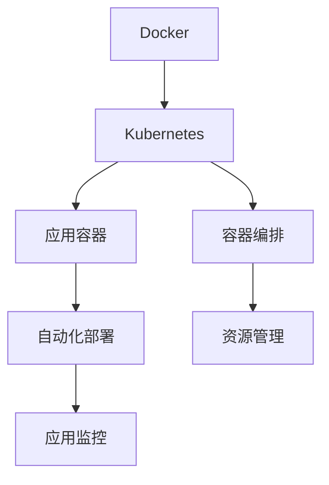

                 

# 容器化技术在云原生架构中的应用：Docker 和 Kubernetes

> 关键词：容器化, 云原生架构, Docker, Kubernetes, 微服务, DevOps, 持续集成(CI), 持续交付(CD)

## 1. 背景介绍

### 1.1 问题由来
随着互联网应用的不断发展和云计算技术的普及，软件架构日益复杂化，企业面临着诸多挑战：

- **微服务化**：复杂的应用系统逐渐拆分成多个小型服务，服务间耦合度提高，维护难度增大。
- **部署难度**：分布式系统的部署变得异常复杂，开发、测试和部署的成本显著上升。
- **资源管理**：随着系统规模的扩大，服务器的资源管理难度显著增加，需要更高效的资源利用方式。
- **持续交付**：快速迭代的软件开发流程需要高效的自动化手段，以便更快地将代码变更转化为实际应用。

针对这些问题，云原生架构(云原生应用架构)应运而生。云原生架构倡导通过容器化、自动化、微服务化等技术手段，实现应用的高效部署、高可用性、高伸缩性和持续交付。其中，Docker和Kubernetes是云原生架构中的两个核心技术，分别负责容器化和编排管理，共同构建了现代化、自动化的应用运行平台。

### 1.2 问题核心关键点
为了更好地理解Docker和Kubernetes如何应用在云原生架构中，本节将详细介绍它们的核心概念、原理及其联系。

- **Docker**：一个开源的容器平台，支持将应用程序及其依赖打包到可移植的容器中。容器内包含了应用程序运行所需的全部依赖和配置，确保应用在任意环境中的稳定性和一致性。
- **Kubernetes**：一个开源的容器编排工具，用于自动化部署、扩展和管理容器的过程。通过Kubernetes，可以将大规模的分布式应用系统自动化管理，提升运维效率和系统可靠性。

**Docker和Kubernetes之间的联系**：
- 容器化是Docker和Kubernetes共同的目标，Docker负责创建和运行容器，而Kubernetes负责管理这些容器，确保其高效、可靠地运行。
- 云原生架构通过容器化技术，将应用抽象到容器层面，并通过Kubernetes进行统一管理，实现了应用的自动化部署、扩展和监控。
- Kubernetes的容器编排功能依赖于Docker等容器运行平台提供的容器运行时。

## 2. 核心概念与联系

### 2.1 核心概念概述

为更好地理解Docker和Kubernetes的核心概念及其在云原生架构中的应用，本节将详细介绍Docker和Kubernetes的基本原理和架构设计。

- **Docker**：Docker容器是基于Linux内核的命名空间和控制组技术，结合软件镜像机制，将应用程序及其依赖打包到一个独立的容器实例中，从而确保应用程序在任意环境中的一致性。
- **Kubernetes**：Kubernetes基于谷歌的Borg系统设计，通过资源描述、编排控制和自动化管理，实现了分布式应用的自动化部署、扩展和监控。

**Docker和Kubernetes的联系**：
- Docker提供了一个可移植的容器化运行环境，Kubernetes负责管理这些容器的生命周期。
- 通过Kubernetes，可以自动化地部署、扩展和管理Docker容器，实现应用的持续交付和高效运维。

### 2.2 核心概念原理和架构的 Mermaid 流程图



此流程图展示了Docker和Kubernetes的基本功能和架构设计。

- **Docker**：将应用程序打包到容器内，提供一致的运行环境。
- **Kubernetes**：自动化管理容器的部署、扩展和监控，确保应用的高可用性和可扩展性。
- **应用容器**：通过Docker容器运行的应用程序及其依赖。
- **容器编排**：Kubernetes通过定义资源描述和编排策略，自动化管理容器的部署和扩展。
- **自动化部署**：Kubernetes自动化地将容器部署到目标主机。
- **资源管理**：Kubernetes通过调度策略和资源分配，合理利用系统资源。
- **应用监控**：Kubernetes实时监控容器的运行状态，提供详细的监控信息。

### 2.3 容器化与云原生架构

容器化是云原生架构的核心技术之一，通过将应用程序打包到容器内，可以在不同环境中确保一致性和可移植性。云原生架构通过容器化技术，将应用抽象到容器层面，并通过Kubernetes进行统一管理，实现了应用的自动化部署、扩展和监控。

#### 容器化的优势：
- **一致性**：应用程序及其依赖打包在容器内，确保在任意环境中都能稳定运行。
- **可移植性**：容器可以在任意支持Linux操作系统的机器上运行，不受环境限制。
- **自动化**：通过Kubernetes自动化管理容器，简化了运维流程。
- **高可用性**：Kubernetes自动管理容器的故障恢复和负载均衡，确保高可用性。
- **快速部署**：Kubernetes可以自动化地部署容器，加速应用交付。

## 3. 核心算法原理 & 具体操作步骤

### 3.1 算法原理概述

Docker和Kubernetes的核心算法原理主要涉及容器化技术、编排管理和资源调度等方面。

- **容器化**：通过Docker等工具将应用程序及其依赖打包到容器中，确保应用在任意环境中的稳定性和一致性。
- **编排管理**：Kubernetes通过容器编排技术，自动化管理容器的生命周期，确保应用的可靠性和可扩展性。
- **资源调度**：Kubernetes通过调度算法和资源管理，合理利用系统资源，确保应用的高效运行。

### 3.2 算法步骤详解

Docker和Kubernetes的核心操作步骤主要包括：
1. **应用容器化**：将应用程序及其依赖打包到Docker容器中。
2. **容器部署**：将容器部署到目标主机，并配置网络、存储等资源。
3. **容器管理**：通过Kubernetes自动化管理容器的生命周期，监控应用状态，进行故障恢复。
4. **资源调度**：Kubernetes通过调度算法和资源管理，合理利用系统资源。
5. **应用监控**：实时监控容器运行状态，提供详细的监控信息。

### 3.3 算法优缺点

**Docker的优势**：
- **一致性**：应用程序及其依赖打包在容器内，确保在任意环境中都能稳定运行。
- **可移植性**：容器可以在任意支持Linux操作系统的机器上运行，不受环境限制。
- **自动化**：通过Kubernetes自动化管理容器，简化了运维流程。

**Docker的缺点**：
- **资源消耗**：容器在运行时可能需要占用较多的系统资源。
- **网络复杂性**：容器间通信需要复杂的配置和管理。

**Kubernetes的优势**：
- **自动化**：通过容器编排技术，自动化管理容器的部署和扩展。
- **高可用性**：Kubernetes自动管理容器的故障恢复和负载均衡，确保高可用性。
- **资源管理**：通过调度算法和资源管理，合理利用系统资源。

**Kubernetes的缺点**：
- **复杂性**：配置和管理需要一定的技术门槛。
- **性能开销**：Kubernetes自身也需要消耗一定的系统资源。

### 3.4 算法应用领域

Docker和Kubernetes在多个领域得到了广泛应用，包括但不限于：
- **云计算**：通过容器化和云原生架构，实现云应用的自动化部署、扩展和监控。
- **大数据**：通过容器化和大数据平台集成，实现大数据应用的自动化管理和扩展。
- **微服务**：通过容器化和微服务架构，实现微服务的自动化部署和扩展。
- **DevOps**：通过容器化工具和持续集成/持续交付(CI/CD)流程，加速应用开发和交付。

## 4. 数学模型和公式 & 详细讲解 & 举例说明

### 4.1 数学模型构建

在云原生架构中，容器化技术、编排管理和资源调度都涉及复杂的数学模型。本节将详细介绍这些数学模型的构建和应用。

#### 容器化数学模型
- **容器镜像**：将应用程序及其依赖打包到容器镜像中，确保在任意环境中都能稳定运行。容器镜像是一个只读的Linux文件系统，包含了应用程序的依赖和配置。
- **容器运行时**：负责在容器中运行应用程序，提供运行环境和资源管理。Docker等容器运行时提供了容器运行时的实现。

#### Kubernetes数学模型
- **资源描述**：通过定义Pod、Service、Deployment等资源描述，Kubernetes描述了应用的运行环境和资源需求。
- **调度算法**：Kubernetes通过调度算法，将容器部署到目标主机，并确保资源的高效利用。
- **负载均衡**：Kubernetes通过负载均衡算法，将请求均衡分配到多个容器中，确保应用的高可用性和可扩展性。

### 4.2 公式推导过程

以下是Docker和Kubernetes的一些核心公式推导过程：

#### 容器镜像的构建
假设应用程序需要依赖包`dep1`和`dep2`，则Docker构建容器的过程如下：
- 创建容器镜像：
  ```Dockerfile
  FROM ubuntu:20.04
  COPY dep1 /app/dep1
  COPY dep2 /app/dep2
  COPY app.py /app/
  ```
- 构建镜像：
  ```bash
  docker build -t myapp .
  ```

#### Kubernetes的资源描述
假设应用需要2个CPU和4GB内存，则Pod资源描述如下：
- 定义Pod：
  ```yaml
  apiVersion: v1
  kind: Pod
  metadata:
    name: myapp
    labels:
      name: myapp
  spec:
    containers:
    - name: myapp
      image: myapp:latest
      resources:
        requests:
          cpu: "2"
          memory: "4Gi"
  ```

#### Kubernetes的调度算法
Kubernetes的调度算法通过计算容器所需的资源和可用节点的资源，找到最优的节点部署容器。假设系统有3个节点，每个节点有2个CPU和8GB内存，应用需要1个CPU和4GB内存，则调度算法如下：
- 节点资源：
  - Node1：2CPU, 8GB
  - Node2：2CPU, 8GB
  - Node3：2CPU, 8GB
- 应用资源：
  - Pod1：1CPU, 4GB
  - Pod2：1CPU, 4GB

通过资源计算和调度算法，可以部署Pod1到Node1，Pod2到Node2，实现资源的高效利用。

### 4.3 案例分析与讲解

**案例分析**：
假设某电商应用需要部署到云平台，包含订单管理、库存管理和用户管理等多个服务。通过Docker容器化和Kubernetes编排管理，可以高效部署和扩展该应用。

- **应用容器化**：将订单管理、库存管理和用户管理等服务打包到Docker容器中，确保在不同环境中的稳定性。
- **容器部署**：通过Kubernetes定义Pod、Service和Deployment资源描述，将容器部署到目标主机，并配置网络、存储等资源。
- **容器管理**：通过Kubernetes自动化管理容器的生命周期，监控应用状态，进行故障恢复和负载均衡。
- **资源调度**：Kubernetes通过调度算法和资源管理，合理利用系统资源，确保应用的高效运行。
- **应用监控**：实时监控容器运行状态，提供详细的监控信息，及时发现和解决故障。

## 5. 项目实践：代码实例和详细解释说明

### 5.1 开发环境搭建

在进行容器化项目实践前，我们需要准备好开发环境。以下是使用Docker和Kubernetes进行开发的环境配置流程：

1. **安装Docker**：
   - 在Ubuntu系统中，安装Docker：
     ```bash
     apt-get update
     apt-get install -y \
         ca-certificates \
         curl \
         gnupg \
         lsb-release

     curl -fsSL https://download.docker.com/linux/ubuntu/gpg | sudo gpg --dearmor -o /usr/share/keyrings/docker-archive-keyring.gpg

     echo \
       "deb [arch=$(dpkg --print-architecture) signed-by=/usr/share/keyrings/docker-archive-keyring.gpg] http://download.docker.com/linux/ubuntu \
       $(lsb_release -cs) stable" | sudo tee /etc/apt/sources.list.d/docker.list > /dev/null

     apt-get update
     apt-get install -y docker-ce docker-ce-cli containerd.io
     ```
   - 在Windows系统中，安装Docker Desktop：
     https://docs.docker.com/get-docker/

2. **安装Kubernetes**：
   - 在Ubuntu系统中，安装Minikube：
     ```bash
     minikube start
     ```
   - 在Windows系统中，安装Minikube Desktop：
     https://docs.docker.com/minikube/getting-started/windows/

3. **配置环境变量**：
   ```bash
   export KUBECONFIG=/path/to/kubeconfig
   ```

完成上述步骤后，即可在Docker和Kubernetes环境下进行开发实践。

### 5.2 源代码详细实现

这里我们以一个简单的Web应用为例，展示如何使用Docker和Kubernetes进行容器化和部署。

- **Dockerfile**：
  ```Dockerfile
  FROM python:3.9
  COPY requirements.txt .
  RUN pip install -r requirements.txt
  COPY app.py .
  COPY .flaskenv .
  CMD ["flask", "run"]
  ```

- **requirements.txt**：
  ```
  flask
  ```

- **app.py**：
  ```python
  from flask import Flask

  app = Flask(__name__)

  @app.route('/')
  def hello():
      return 'Hello, World!'

  if __name__ == '__main__':
      app.run(debug=True)
  ```

- **Docker build**：
  ```bash
  docker build -t myapp .
  ```

- **Kubernetes Deployment**：
  ```yaml
  apiVersion: v1
  kind: Deployment
  metadata:
    name: myapp-deployment
  spec:
    replicas: 3
    selector:
      matchLabels:
        name: myapp
    template:
      metadata:
        labels:
          name: myapp
      spec:
        containers:
        - name: myapp
          image: myapp:latest
          ports:
          - containerPort: 8080
  ```

- **Kubernetes Service**：
  ```yaml
  apiVersion: v1
  kind: Service
  metadata:
    name: myapp-service
  spec:
    selector:
      name: myapp
    ports:
    - port: 80
      targetPort: 8080
  ```

### 5.3 代码解读与分析

**Dockerfile**：
- **FROM**：指定基础镜像。
- **COPY**：将应用程序及其依赖复制到容器中。
- **RUN**：安装依赖，配置环境。
- **CMD**：指定应用程序的启动命令。

**Kubernetes Deployment**：
- **replicas**：指定Pod的副本数。
- **selector**：指定Pod的选择器标签。
- **template**：指定Pod的模板配置。
- **containers**：指定容器配置。
- **ports**：指定容器暴露的端口。

**Kubernetes Service**：
- **selector**：指定服务选择器标签。
- **ports**：指定服务暴露的端口。

### 5.4 运行结果展示

运行结果如下：
- **Docker build**：
  ```bash
  docker build -t myapp .
  ```

- **Kubernetes apply**：
  ```bash
  kubectl apply -f deployment.yaml
  kubectl apply -f service.yaml
  ```

- **服务访问**：
  ```bash
  kubectl get service myapp-service
  ```

## 6. 实际应用场景

### 6.1 智能运维平台

通过Docker和Kubernetes，可以实现智能运维平台的高效管理和自动化部署。智能运维平台可以自动化地收集、分析和处理应用数据，提供实时监控、故障告警、性能分析等能力，显著提升运维效率。

- **应用容器化**：将监控、日志、告警等服务打包到Docker容器中。
- **容器部署**：通过Kubernetes定义Pod和Service资源描述，自动化部署监控容器。
- **容器管理**：通过Kubernetes自动化管理容器的生命周期，监控应用状态，进行故障恢复和负载均衡。
- **资源调度**：Kubernetes通过调度算法和资源管理，合理利用系统资源，确保应用的高效运行。
- **应用监控**：实时监控容器运行状态，提供详细的监控信息，及时发现和解决故障。

### 6.2 微服务架构

通过Docker和Kubernetes，可以实现微服务架构的高效管理和自动化部署。微服务架构将应用拆分成多个小型服务，通过容器化技术，确保服务在任意环境中的稳定性。

- **应用容器化**：将订单管理、库存管理和用户管理等服务打包到Docker容器中。
- **容器部署**：通过Kubernetes定义Pod、Service和Deployment资源描述，自动化部署微服务容器。
- **容器管理**：通过Kubernetes自动化管理容器的生命周期，监控应用状态，进行故障恢复和负载均衡。
- **资源调度**：Kubernetes通过调度算法和资源管理，合理利用系统资源，确保微服务的高效运行。
- **应用监控**：实时监控容器运行状态，提供详细的监控信息，及时发现和解决故障。

## 7. 工具和资源推荐

### 7.1 学习资源推荐

为了帮助开发者系统掌握Docker和Kubernetes的理论基础和实践技巧，这里推荐一些优质的学习资源：

1. **《Docker官方文档》**：Docker官网提供的官方文档，包含详细的Docker使用指南和API参考。
   - [Docker官网](https://docs.docker.com/)

2. **《Kubernetes官方文档》**：Kubernetes官网提供的官方文档，包含详细的Kubernetes使用指南和API参考。
   - [Kubernetes官网](https://kubernetes.io/docs/home/)

3. **《Docker实战》**：阮一峰著，介绍Docker的实战应用案例和最佳实践。
   - [Docker实战](https://github.com/ruanyf/Docker)

4. **《Kubernetes实战》**：Kubernetes官方博客提供的实战指南，包含Kubernetes的部署、运维和管理经验。
   - [Kubernetes实战](https://kubernetes.io/blog)

5. **《Cloud Native in Action》**：Vishnu Subramaniam著，介绍云原生架构的实践案例和最佳实践。
   - [Cloud Native in Action](https://www.oreilly.com/library/view/cloud-native-in/9781492047745/)

### 7.2 开发工具推荐

高效的开发离不开优秀的工具支持。以下是几款用于Docker和Kubernetes开发常用的工具：

1. **Docker Desktop**：Docker官方提供的图形化界面，方便开发者进行Docker的本地开发和测试。
   - [Docker Desktop](https://www.docker.com/products/docker-desktop)

2. **Kubectl**：Kubernetes命令行工具，用于管理Kubernetes集群。
   - [Kubectl](https://kubernetes.io/docs/reference/command-line/tools/kubectl/)

3. **Jenkins**：持续集成工具，支持自动化构建、测试和部署。
   - [Jenkins](https://www.jenkins.io/)

4. **Prometheus**：监控工具，提供实时监控、告警和可视化功能。
   - [Prometheus](https://prometheus.io/)

5. **Fluentd**：日志收集和传输工具，支持多种日志格式和数据源。
   - [Fluentd](https://www.fluentd.org/)

### 7.3 相关论文推荐

Docker和Kubernetes的发展离不开学界的持续研究。以下是几篇奠基性的相关论文，推荐阅读：

1. **《Docker: The Docker Open Platform for Distributed Systems》**：Docker官网发布的白皮书，介绍Docker的架构和技术原理。
   - [Docker白皮书](https://docs.docker.com/whitepaper/)

2. **《Kubernetes: Managing Containers at Scale》**：Google Borg系统的研究论文，介绍Kubernetes的架构和技术原理。
   - [Kubernetes论文](https://kubernetes.io/blog/kubernetes-design/)

3. **《Microservices: A Service-Oriented Architecture for Building Scalable Systems》**：Adrian McKesson等著，介绍微服务架构的原理和应用。
   - [微服务论文](https://www.manning.com/books/microservices)

## 8. 总结：未来发展趋势与挑战

### 8.1 研究成果总结

本文对Docker和Kubernetes在云原生架构中的应用进行了全面系统的介绍。首先阐述了Docker和Kubernetes的核心概念、原理及其联系，详细讲解了它们在容器化和编排管理中的应用。其次，通过代码实例和实践案例，展示了Docker和Kubernetes的实际应用场景。最后，总结了未来Docker和Kubernetes的发展趋势和面临的挑战，为开发者提供了系统的指导。

通过本文的系统梳理，可以看到，Docker和Kubernetes在云原生架构中扮演了核心角色，显著提升了应用的高可用性、可扩展性和自动化水平。随着容器化和云原生技术的不断发展，Docker和Kubernetes必将在更多场景中得到应用，为企业的数字化转型和智能化升级带来新的突破。

### 8.2 未来发展趋势

展望未来，Docker和Kubernetes将呈现以下几个发展趋势：

1. **容器化技术的普及**：随着Docker等容器技术的普及，越来越多的企业将采用容器化技术进行应用部署和管理，实现应用的自动化和高效化。
2. **云原生生态的扩展**：云原生技术将不断扩展，涵盖更多领域，如容器镜像、持续交付、服务网格等，形成完整的云原生生态系统。
3. **微服务架构的推广**：微服务架构将得到广泛应用，通过容器化和Kubernetes，实现微服务的自动化部署和扩展。
4. **自动化运维的提升**：自动化运维技术将不断进步，通过Kubernetes等工具，实现应用的自动化管理和监控。
5. **跨云集成与协同**：随着云平台的普及，跨云集成和协同将成为新的需求，通过Kubernetes等工具，实现云平台间的资源共享和协同管理。

以上趋势凸显了Docker和Kubernetes的广阔前景，它们必将在推动云计算和数字化转型中发挥越来越重要的作用。

### 8.3 面临的挑战

尽管Docker和Kubernetes已经取得了瞩目成就，但在迈向更加智能化、普适化应用的过程中，它们仍面临诸多挑战：

1. **复杂性**：容器化技术虽然带来了很多好处，但也增加了配置和管理复杂性，需要一定的技术门槛。
2. **性能开销**：容器在运行时可能需要占用较多的系统资源，导致性能开销。
3. **网络管理**：容器间通信需要复杂的配置和管理，增加了运维难度。
4. **安全问题**：容器化技术在带来高效运维的同时，也可能带来安全风险，需要加强安全防护措施。
5. **社区分化**：不同的容器平台和编排工具可能存在差异，增加了社区管理和协同的难度。

这些挑战需要社区和产业界的共同努力，才能逐步克服。通过技术创新和社区协作，Docker和Kubernetes必将在未来的发展中不断优化和完善，实现更广泛的应用。

### 8.4 研究展望

面对Docker和Kubernetes面临的种种挑战，未来的研究需要在以下几个方面寻求新的突破：

1. **容器化技术的简化**：通过更简洁的配置和管理工具，简化容器化技术的复杂性，降低运维难度。
2. **性能优化**：通过优化容器运行时和调度算法，减少性能开销，提高系统效率。
3. **网络优化**：通过改进容器间通信协议，减少网络管理复杂性，提高运维效率。
4. **安全加固**：通过加强安全防护措施，确保容器的安全性和可靠性，防范潜在风险。
5. **跨平台协同**：通过构建统一的容器标准和编排协议，实现跨平台协同管理。

这些研究方向将为Docker和Kubernetes的发展提供新的方向，推动它们在更广泛的应用场景中落地。

## 9. 附录：常见问题与解答

**Q1：Docker容器与传统虚拟机(Virtual Machine, VM)有何区别？**

A: Docker容器与传统VM的主要区别在于资源利用率和启动速度。VM需要完整的虚拟硬件环境，启动速度较慢，资源利用率较低。而Docker容器共享主机内核，可以更快地启动和停止，资源利用率更高。

**Q2：Kubernetes的调度算法如何工作？**

A: Kubernetes的调度算法通过计算容器所需的资源和可用节点的资源，找到最优的节点部署容器。具体流程如下：
1. 创建节点资源列表，包括CPU、内存等资源。
2. 创建容器资源需求，包括CPU、内存等资源。
3. 计算每个节点可用资源，减去当前运行的容器资源。
4. 根据调度策略，选择最优节点部署容器。

**Q3：如何提高Docker容器的性能？**

A: 提高Docker容器性能的方法包括：
1. 合理配置资源，确保容器在启动时拥有足够的内存和CPU。
2. 使用缓存技术，减少容器启动时的文件读写。
3. 使用CGroup和资源配额，限制容器的资源使用。
4. 使用PIDS命名空间，减少容器间相互影响。

**Q4：如何保证Docker容器的安全性？**

A: 保证Docker容器安全性的方法包括：
1. 使用安全镜像，确保容器内应用程序的安全性。
2. 定期更新容器镜像和依赖，防范已知漏洞。
3. 使用访问控制和权限管理，限制容器访问权限。
4. 监控容器运行状态，及时发现和解决异常。

**Q5：如何优化Kubernetes的集群性能？**

A: 优化Kubernetes集群性能的方法包括：
1. 合理配置节点资源，确保集群拥有足够的计算和存储资源。
2. 使用水平扩展和负载均衡，合理利用系统资源。
3. 优化容器镜像和依赖，减少容器启动时间和资源消耗。
4. 使用自动扩缩容和自我修复机制，确保集群的稳定性和可靠性。

以上是本文的完整内容。通过系统介绍Docker和Kubernetes在云原生架构中的应用，我们能够更好地理解和应用这些前沿技术，提升应用的高可用性、可扩展性和自动化水平。

