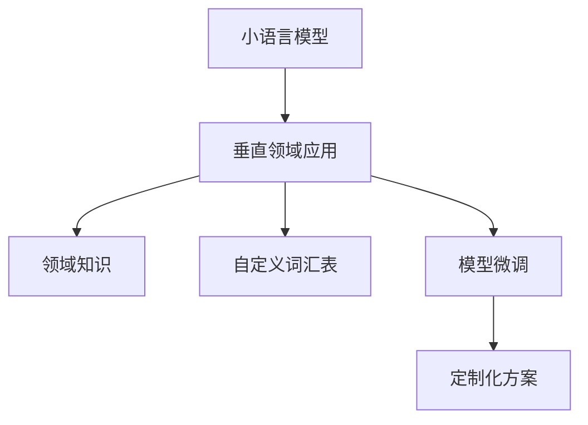

                 

# 小语言模型的应用前景:垂直领域的机遇

> 关键词：小语言模型,垂直领域,专用模型,领域知识,自定义词汇表,模型微调,定制化方案,应用场景

## 1. 背景介绍

### 1.1 问题由来

随着深度学习技术和大规模预训练语言模型(Pre-trained Language Models, PLMs)的兴起，自然语言处理(Natural Language Processing, NLP)领域取得了巨大的突破。通用语言模型(GPLMs)如BERT、GPT等通过在大规模无标签文本语料上进行预训练，学习了丰富的语言知识和常识，但在特定垂直领域的任务上，通用语言模型的性能往往存在局限性。主要原因包括：

1. **领域词汇的缺乏**：通用语言模型虽然具备丰富的语言知识，但缺少特定领域的术语和表达，对领域相关内容的理解深度有限。

2. **领域数据不足**：某些垂直领域的数据稀缺，难以获取足够的标注数据进行微调。

3. **模型泛化能力不足**：通用语言模型通常在特定领域的泛化能力较弱，无法适应领域特定的语言规律和应用场景。

针对这些问题，小语言模型(Small Language Models, SLMs)应运而生。SLMs通常为特定领域的任务定制，具有更强的领域相关性和数据适应性，能够显著提升在特定垂直领域的应用效果。

### 1.2 问题核心关键点

小语言模型的核心关键点包括：

- **领域定制化**：小语言模型针对特定垂直领域进行训练，具备该领域特有的词汇表和表达方式。
- **参数量适中**：参数规模一般在几百万至几千万之间，易于在有限数据和计算资源下进行训练和部署。
- **模型泛化能力强**：在特定领域内，小语言模型能够更好地适应领域特定的语言规律和应用场景。
- **易用性和灵活性**：与通用语言模型相比，小语言模型的使用门槛较低，适用于中小型企业和专业领域的应用。

这些关键点使得小语言模型在特定垂直领域的应用前景广阔，具有显著的优势和潜在的价值。

## 2. 核心概念与联系

### 2.1 核心概念概述

为更好地理解小语言模型的应用前景，本节将介绍几个关键概念及其联系：

- **小语言模型(SLMs)**：为特定垂直领域定制的，具备领域相关性的小规模语言模型。与通用语言模型(GPLMs)相比，SLMs具有更高的领域相关性和数据适应性。

- **垂直领域(Domain-Specific)应用**：指针对特定行业或领域（如医疗、金融、法律等）进行优化的应用场景。SLMs在垂直领域的应用，有助于提升模型的任务针对性。

- **领域知识(In-domain Knowledge)**：指特定领域的专业知识和术语，包括行业术语、领域特有的表达方式等。SLMs在训练过程中，通常包含领域知识，以提高对领域相关内容的理解。

- **自定义词汇表(Customized Vocabulary)**：为特定领域定制的词汇表，包含该领域特有的术语和表达。与通用语言模型不同，SLMs使用自定义词汇表，以增强领域相关性。

- **模型微调(Fine-Tuning)**：指在预训练模型的基础上，通过少量标注数据进行有监督学习，优化模型在特定任务上的性能。SLMs常用于微调，以提高在特定领域的应用效果。

- **定制化方案(Customization)**：指根据特定垂直领域的需求，进行模型架构、训练数据、优化算法等方面的定制化设计。

这些概念之间的逻辑关系可以通过以下Mermaid流程图来展示：



这个流程图展示了几者之间的关系：

1. 小语言模型通过垂直领域应用进行训练，学习特定领域的知识。
2. 领域知识包含行业术语和特有的表达方式，被模型吸收。
3. 自定义词汇表被模型使用，以增强领域相关性。
4. 模型微调通过少量标注数据，进一步优化模型性能。
5. 定制化方案针对特定领域，进行模型架构和训练数据的优化设计。

## 3. 核心算法原理 & 具体操作步骤
### 3.1 算法原理概述

小语言模型的核心算法原理基于监督学习的微调方法。其主要思想是：将小语言模型视作一个强大的"特征提取器"，通过在垂直领域的少量标注数据上进行有监督的微调，使得模型输出能够匹配特定任务，从而获得在特定任务上的优化的模型。

形式化地，假设小语言模型为 $M_{\theta}$，其中 $\theta$ 为模型参数。给定垂直领域的标注数据集 $D=\{(x_i, y_i)\}_{i=1}^N$，微调的目标是找到新的模型参数 $\hat{\theta}$，使得：

$$
\hat{\theta}=\mathop{\arg\min}_{\theta} \mathcal{L}(M_{\theta},D)
$$

其中 $\mathcal{L}$ 为针对特定任务设计的损失函数，用于衡量模型预测输出与真实标签之间的差异。常见的损失函数包括交叉熵损失、均方误差损失等。

通过梯度下降等优化算法，微调过程不断更新模型参数 $\theta$，最小化损失函数 $\mathcal{L}$，使得模型输出逼近真实标签。由于 $\theta$ 已经通过领域相关性训练获得了较好的初始化，因此即便在垂直领域数据量较少的情况下，也能较快收敛到理想的模型参数 $\hat{\theta}$。

### 3.2 算法步骤详解

小语言模型的微调步骤一般包括以下几个关键环节：

**Step 1: 准备小语言模型和数据集**
- 选择合适的预训练语言模型 $M_{\theta}$ 作为初始化参数，如预训练后的Transformer模型。
- 准备垂直领域的标注数据集 $D$，划分为训练集、验证集和测试集。一般要求标注数据与模型训练数据的分布不要差异过大。

**Step 2: 添加任务适配层**
- 根据垂直领域任务类型，在预训练模型顶层设计合适的输出层和损失函数。
- 对于分类任务，通常在顶层添加线性分类器和交叉熵损失函数。
- 对于生成任务，通常使用语言模型的解码器输出概率分布，并以负对数似然为损失函数。

**Step 3: 设置微调超参数**
- 选择合适的优化算法及其参数，如 AdamW、SGD 等，设置学习率、批大小、迭代轮数等。
- 设置正则化技术及强度，包括权重衰减、Dropout、Early Stopping等。
- 确定冻结预训练参数的策略，如仅微调顶层，或全部参数都参与微调。

**Step 4: 执行梯度训练**
- 将训练集数据分批次输入模型，前向传播计算损失函数。
- 反向传播计算参数梯度，根据设定的优化算法和学习率更新模型参数。
- 周期性在验证集上评估模型性能，根据性能指标决定是否触发 Early Stopping。
- 重复上述步骤直至满足预设的迭代轮数或 Early Stopping 条件。

**Step 5: 测试和部署**
- 在测试集上评估微调后模型 $M_{\hat{\theta}}$ 的性能，对比微调前后的精度提升。
- 使用微调后的模型对新样本进行推理预测，集成到实际的应用系统中。
- 持续收集新的数据，定期重新微调模型，以适应数据分布的变化。

以上是小语言模型微调的一般流程。在实际应用中，还需要针对具体领域的需求，对微调过程的各个环节进行优化设计，如改进训练目标函数，引入更多的正则化技术，搜索最优的超参数组合等，以进一步提升模型性能。

### 3.3 算法优缺点

小语言模型微调具有以下优点：
1. 针对性强：为特定垂直领域定制，具备领域相关性，提升模型在特定领域的应用效果。
2. 灵活性高：模型参数规模适中，易于在有限数据和计算资源下进行训练和部署。
3. 泛化能力强：模型在特定领域内具备更好的泛化能力，适应领域特定的语言规律和应用场景。
4. 易用性强：使用门槛较低，适用于中小型企业和专业领域的应用。

同时，该方法也存在一定的局限性：
1. 数据依赖：微调效果很大程度上依赖于标注数据的质量和数量，获取高质量标注数据的成本较高。
2. 模型迁移能力有限：当目标领域与预训练数据的分布差异较大时，微调的性能提升有限。
3. 模型可解释性不足：微调模型的决策过程通常缺乏可解释性，难以对其推理逻辑进行分析和调试。

尽管存在这些局限性，但小语言模型微调在特定垂直领域的应用前景广阔，具备显著的优势和潜在的价值。

### 3.4 算法应用领域

小语言模型微调技术在多个垂直领域得到了广泛的应用，以下是几个典型的应用场景：

- **医疗健康**：利用小语言模型进行病历分析、诊断、药物研发等。通过医疗领域数据集的微调，小语言模型能够学习到医学知识和术语，提升在医疗健康领域的应用效果。

- **金融行业**：在金融领域，小语言模型可用于舆情监测、风险评估、智能投顾等。通过金融领域数据集的微调，小语言模型能够理解金融市场的语言规律，提升金融应用的效果。

- **法律咨询**：法律咨询领域需要理解法律条文和案例，小语言模型通过法律领域数据集的微调，能够提升对法律条文的理解和应用能力。

- **物流管理**：在物流管理领域，小语言模型可用于路线规划、配送调度、客户服务等。通过物流领域数据集的微调，小语言模型能够理解物流管理的语言规律，提升物流应用的效果。

- **制造业**：在制造业领域，小语言模型可用于生产调度、设备维护、质量检测等。通过制造业领域数据集的微调，小语言模型能够理解制造业的语言规律，提升制造业应用的效果。

除了这些领域外，小语言模型微调还广泛应用于教育、保险、农业等众多垂直领域，为不同行业带来变革性影响。

## 4. 数学模型和公式 & 详细讲解 & 举例说明

### 4.1 数学模型构建

本节将使用数学语言对小语言模型微调过程进行更加严格的刻画。

记小语言模型为 $M_{\theta}$，其中 $\theta$ 为模型参数。假设微调任务的训练集为 $D=\{(x_i,y_i)\}_{i=1}^N, x_i \in \mathcal{X}, y_i \in \mathcal{Y}$。

定义模型 $M_{\theta}$ 在数据样本 $(x,y)$ 上的损失函数为 $\ell(M_{\theta}(x),y)$，则在数据集 $D$ 上的经验风险为：

$$
\mathcal{L}(\theta) = \frac{1}{N} \sum_{i=1}^N \ell(M_{\theta}(x_i),y_i)
$$

微调的优化目标是最小化经验风险，即找到最优参数：

$$
\theta^* = \mathop{\arg\min}_{\theta} \mathcal{L}(\theta)
$$

在实践中，我们通常使用基于梯度的优化算法（如SGD、Adam等）来近似求解上述最优化问题。设 $\eta$ 为学习率，$\lambda$ 为正则化系数，则参数的更新公式为：

$$
\theta \leftarrow \theta - \eta \nabla_{\theta}\mathcal{L}(\theta) - \eta\lambda\theta
$$

其中 $\nabla_{\theta}\mathcal{L}(\theta)$ 为损失函数对参数 $\theta$ 的梯度，可通过反向传播算法高效计算。

### 4.2 公式推导过程

以下我们以分类任务为例，推导交叉熵损失函数及其梯度的计算公式。

假设模型 $M_{\theta}$ 在输入 $x$ 上的输出为 $\hat{y}=M_{\theta}(x) \in [0,1]$，表示样本属于正类的概率。真实标签 $y \in \{0,1\}$。则二分类交叉熵损失函数定义为：

$$
\ell(M_{\theta}(x),y) = -[y\log \hat{y} + (1-y)\log (1-\hat{y})]
$$

将其代入经验风险公式，得：

$$
\mathcal{L}(\theta) = -\frac{1}{N}\sum_{i=1}^N [y_i\log M_{\theta}(x_i)+(1-y_i)\log(1-M_{\theta}(x_i))]
$$

根据链式法则，损失函数对参数 $\theta_k$ 的梯度为：

$$
\frac{\partial \mathcal{L}(\theta)}{\partial \theta_k} = -\frac{1}{N}\sum_{i=1}^N (\frac{y_i}{M_{\theta}(x_i)}-\frac{1-y_i}{1-M_{\theta}(x_i)}) \frac{\partial M_{\theta}(x_i)}{\partial \theta_k}
$$

其中 $\frac{\partial M_{\theta}(x_i)}{\partial \theta_k}$ 可进一步递归展开，利用自动微分技术完成计算。

在得到损失函数的梯度后，即可带入参数更新公式，完成模型的迭代优化。重复上述过程直至收敛，最终得到适应垂直领域任务的最优模型参数 $\theta^*$。

## 5. 项目实践：代码实例和详细解释说明

### 5.1 开发环境搭建

在进行小语言模型微调实践前，我们需要准备好开发环境。以下是使用Python进行PyTorch开发的环境配置流程：

1. 安装Anaconda：从官网下载并安装Anaconda，用于创建独立的Python环境。

2. 创建并激活虚拟环境：
```bash
conda create -n pytorch-env python=3.8 
conda activate pytorch-env
```

3. 安装PyTorch：根据CUDA版本，从官网获取对应的安装命令。例如：
```bash
conda install pytorch torchvision torchaudio cudatoolkit=11.1 -c pytorch -c conda-forge
```

4. 安装Transformers库：
```bash
pip install transformers
```

5. 安装各类工具包：
```bash
pip install numpy pandas scikit-learn matplotlib tqdm jupyter notebook ipython
```

完成上述步骤后，即可在`pytorch-env`环境中开始微调实践。

### 5.2 源代码详细实现

下面我们以医疗领域的病历分析任务为例，给出使用Transformers库对小语言模型进行微调的PyTorch代码实现。

首先，定义医疗领域的病历分析任务的数据处理函数：

```python
from transformers import BertTokenizer
from torch.utils.data import Dataset
import torch

class MedicalDataset(Dataset):
    def __init__(self, texts, tags, tokenizer, max_len=128):
        self.texts = texts
        self.tags = tags
        self.tokenizer = tokenizer
        self.max_len = max_len
        
    def __len__(self):
        return len(self.texts)
    
    def __getitem__(self, item):
        text = self.texts[item]
        tags = self.tags[item]
        
        encoding = self.tokenizer(text, return_tensors='pt', max_length=self.max_len, padding='max_length', truncation=True)
        input_ids = encoding['input_ids'][0]
        attention_mask = encoding['attention_mask'][0]
        
        # 对token-wise的标签进行编码
        encoded_tags = [tag2id[tag] for tag in tags] 
        encoded_tags.extend([tag2id['O']] * (self.max_len - len(encoded_tags)))
        labels = torch.tensor(encoded_tags, dtype=torch.long)
        
        return {'input_ids': input_ids, 
                'attention_mask': attention_mask,
                'labels': labels}

# 标签与id的映射
tag2id = {'O': 0, 'B-PER': 1, 'I-PER': 2, 'B-LOC': 3, 'I-LOC': 4, 'B-DISEASE': 5, 'I-DISEASE': 6}
id2tag = {v: k for k, v in tag2id.items()}

# 创建dataset
tokenizer = BertTokenizer.from_pretrained('bert-base-cased')

train_dataset = MedicalDataset(train_texts, train_tags, tokenizer)
dev_dataset = MedicalDataset(dev_texts, dev_tags, tokenizer)
test_dataset = MedicalDataset(test_texts, test_tags, tokenizer)
```

然后，定义模型和优化器：

```python
from transformers import BertForTokenClassification, AdamW

model = BertForTokenClassification.from_pretrained('bert-base-cased', num_labels=len(tag2id))

optimizer = AdamW(model.parameters(), lr=2e-5)
```

接着，定义训练和评估函数：

```python
from torch.utils.data import DataLoader
from tqdm import tqdm
from sklearn.metrics import classification_report

device = torch.device('cuda') if torch.cuda.is_available() else torch.device('cpu')
model.to(device)

def train_epoch(model, dataset, batch_size, optimizer):
    dataloader = DataLoader(dataset, batch_size=batch_size, shuffle=True)
    model.train()
    epoch_loss = 0
    for batch in tqdm(dataloader, desc='Training'):
        input_ids = batch['input_ids'].to(device)
        attention_mask = batch['attention_mask'].to(device)
        labels = batch['labels'].to(device)
        model.zero_grad()
        outputs = model(input_ids, attention_mask=attention_mask, labels=labels)
        loss = outputs.loss
        epoch_loss += loss.item()
        loss.backward()
        optimizer.step()
    return epoch_loss / len(dataloader)

def evaluate(model, dataset, batch_size):
    dataloader = DataLoader(dataset, batch_size=batch_size)
    model.eval()
    preds, labels = [], []
    with torch.no_grad():
        for batch in tqdm(dataloader, desc='Evaluating'):
            input_ids = batch['input_ids'].to(device)
            attention_mask = batch['attention_mask'].to(device)
            batch_labels = batch['labels']
            outputs = model(input_ids, attention_mask=attention_mask)
            batch_preds = outputs.logits.argmax(dim=2).to('cpu').tolist()
            batch_labels = batch_labels.to('cpu').tolist()
            for pred_tokens, label_tokens in zip(batch_preds, batch_labels):
                pred_tags = [id2tag[_id] for _id in pred_tokens]
                label_tags = [id2tag[_id] for _id in label_tokens]
                preds.append(pred_tags[:len(label_tokens)])
                labels.append(label_tags)
                
    print(classification_report(labels, preds))
```

最后，启动训练流程并在测试集上评估：

```python
epochs = 5
batch_size = 16

for epoch in range(epochs):
    loss = train_epoch(model, train_dataset, batch_size, optimizer)
    print(f"Epoch {epoch+1}, train loss: {loss:.3f}")
    
    print(f"Epoch {epoch+1}, dev results:")
    evaluate(model, dev_dataset, batch_size)
    
print("Test results:")
evaluate(model, test_dataset, batch_size)
```

以上就是使用PyTorch对小语言模型进行病历分析任务微调的完整代码实现。可以看到，得益于Transformers库的强大封装，我们可以用相对简洁的代码完成小语言模型的加载和微调。

### 5.3 代码解读与分析

让我们再详细解读一下关键代码的实现细节：

**MedicalDataset类**：
- `__init__`方法：初始化文本、标签、分词器等关键组件。
- `__len__`方法：返回数据集的样本数量。
- `__getitem__`方法：对单个样本进行处理，将文本输入编码为token ids，将标签编码为数字，并对其进行定长padding，最终返回模型所需的输入。

**tag2id和id2tag字典**：
- 定义了标签与数字id之间的映射关系，用于将token-wise的预测结果解码回真实的标签。

**训练和评估函数**：
- 使用PyTorch的DataLoader对数据集进行批次化加载，供模型训练和推理使用。
- 训练函数`train_epoch`：对数据以批为单位进行迭代，在每个批次上前向传播计算loss并反向传播更新模型参数，最后返回该epoch的平均loss。
- 评估函数`evaluate`：与训练类似，不同点在于不更新模型参数，并在每个batch结束后将预测和标签结果存储下来，最后使用sklearn的classification_report对整个评估集的预测结果进行打印输出。

**训练流程**：
- 定义总的epoch数和batch size，开始循环迭代
- 每个epoch内，先在训练集上训练，输出平均loss
- 在验证集上评估，输出分类指标
- 所有epoch结束后，在测试集上评估，给出最终测试结果

可以看到，PyTorch配合Transformers库使得小语言模型微调的代码实现变得简洁高效。开发者可以将更多精力放在数据处理、模型改进等高层逻辑上，而不必过多关注底层的实现细节。

当然，工业级的系统实现还需考虑更多因素，如模型的保存和部署、超参数的自动搜索、更灵活的任务适配层等。但核心的微调范式基本与此类似。

## 6. 实际应用场景

### 6.1 医疗健康

小语言模型在医疗健康领域的应用前景广阔，可以用于病历分析、诊断、药物研发等多个方面。例如：

- **病历分析**：利用小语言模型分析患者病历，提取关键症状、诊断信息等，提升医疗决策的准确性。
- **诊断支持**：通过病历中的文字描述，小语言模型能够理解症状和病理，提供诊断建议，辅助医生决策。
- **药物研发**：小语言模型能够分析临床试验报告，提取关键信息，辅助药物研发过程，提高研发效率。

在技术实现上，可以收集医疗领域的历史病历、诊断记录、药物文献等文本数据，对其进行预训练，然后在特定病历数据上进行微调，以提高在病历分析、诊断等方面的性能。

### 6.2 金融行业

在金融领域，小语言模型可用于舆情监测、风险评估、智能投顾等。例如：

- **舆情监测**：通过金融领域的新闻、报道、评论等文本数据，小语言模型能够分析舆情变化趋势，帮助金融机构识别潜在风险。
- **风险评估**：利用金融领域的财报、新闻、公告等文本数据，小语言模型能够预测企业财务状况，评估投资风险。
- **智能投顾**：通过分析客户咨询、交易记录等文本数据，小语言模型能够提供个性化的投资建议，提升客户满意度。

在技术实现上，可以收集金融领域的相关数据，进行预训练，然后在特定金融数据上进行微调，以提高在舆情监测、风险评估等方面的性能。

### 6.3 法律咨询

法律咨询领域需要理解法律条文和案例，小语言模型通过法律领域数据集的微调，能够提升对法律条文的理解和应用能力。例如：

- **法律查询**：通过输入法律问题，小语言模型能够理解问题意图，提供准确的法律解答。
- **案例分析**：利用法律领域的案例数据，小语言模型能够分析案例背景、判决理由等，辅助律师分析案例。
- **法律文档生成**：小语言模型能够根据法律条款和案例，自动生成法律文件，提高工作效率。

在技术实现上，可以收集法律领域的案例、法律条文、法律文书等文本数据，进行预训练，然后在特定法律数据上进行微调，以提高在法律查询、案例分析等方面的性能。

### 6.4 物流管理

在物流管理领域，小语言模型可用于路线规划、配送调度、客户服务等方面。例如：

- **路线规划**：利用物流领域的路线数据，小语言模型能够优化配送路线，提高物流效率。
- **配送调度**：通过物流领域的任务描述，小语言模型能够自动生成调度方案，提升配送管理水平。
- **客户服务**：通过分析客户咨询、投诉记录等文本数据，小语言模型能够提供个性化的客户服务，提升客户满意度。

在技术实现上，可以收集物流领域的路线数据、任务描述、客户咨询等文本数据，进行预训练，然后在特定物流数据上进行微调，以提高在路线规划、配送调度等方面的性能。

### 6.5 制造业

在制造业领域，小语言模型可用于生产调度、设备维护、质量检测等方面。例如：

- **生产调度**：利用制造业领域的生产数据，小语言模型能够优化生产调度方案，提高生产效率。
- **设备维护**：通过制造业领域的设备维护记录，小语言模型能够分析设备故障原因，提出维护建议。
- **质量检测**：利用制造业领域的质量检测数据，小语言模型能够自动识别产品质量问题，提高检测效率。

在技术实现上，可以收集制造业领域的生产数据、设备维护记录、质量检测数据等文本数据，进行预训练，然后在特定制造业数据上进行微调，以提高在生产调度、设备维护等方面的性能。

## 7. 工具和资源推荐

### 7.1 学习资源推荐

为了帮助开发者系统掌握小语言模型的理论基础和实践技巧，这里推荐一些优质的学习资源：

1. 《Transformer from Principle to Practice》系列博文：由大模型技术专家撰写，深入浅出地介绍了Transformer原理、小语言模型、微调技术等前沿话题。

2. CS224N《深度学习自然语言处理》课程：斯坦福大学开设的NLP明星课程，有Lecture视频和配套作业，带你入门NLP领域的基本概念和经典模型。

3. 《Natural Language Processing with Transformers》书籍：Transformers库的作者所著，全面介绍了如何使用Transformers库进行NLP任务开发，包括小语言模型在内的诸多范式。

4. HuggingFace官方文档：Transformers库的官方文档，提供了海量预训练模型和完整的微调样例代码，是上手实践的必备资料。

5. CLUE开源项目：中文语言理解测评基准，涵盖大量不同类型的中文NLP数据集，并提供了基于小语言模型的baseline模型，助力中文NLP技术发展。

通过对这些资源的学习实践，相信你一定能够快速掌握小语言模型的精髓，并用于解决实际的NLP问题。

### 7.2 开发工具推荐

高效的开发离不开优秀的工具支持。以下是几款用于小语言模型微调开发的常用工具：

1. PyTorch：基于Python的开源深度学习框架，灵活动态的计算图，适合快速迭代研究。大部分预训练语言模型都有PyTorch版本的实现。

2. TensorFlow：由Google主导开发的开源深度学习框架，生产部署方便，适合大规模工程应用。同样有丰富的预训练语言模型资源。

3. Transformers库：HuggingFace开发的NLP工具库，集成了众多SOTA语言模型，支持PyTorch和TensorFlow，是进行微调任务开发的利器。

4. Weights & Biases：模型训练的实验跟踪工具，可以记录和可视化模型训练过程中的各项指标，方便对比和调优。与主流深度学习框架无缝集成。

5. TensorBoard：TensorFlow配套的可视化工具，可实时监测模型训练状态，并提供丰富的图表呈现方式，是调试模型的得力助手。

6. Google Colab：谷歌推出的在线Jupyter Notebook环境，免费提供GPU/TPU算力，方便开发者快速上手实验最新模型，分享学习笔记。

合理利用这些工具，可以显著提升小语言模型微调任务的开发效率，加快创新迭代的步伐。

### 7.3 相关论文推荐

小语言模型和微调技术的发展源于学界的持续研究。以下是几篇奠基性的相关论文，推荐阅读：

1. Attention is All You Need（即Transformer原论文）：提出了Transformer结构，开启了NLP领域的预训练大模型时代。

2. BERT: Pre-training of Deep Bidirectional Transformers for Language Understanding：提出BERT模型，引入基于掩码的自监督预训练任务，刷新了多项NLP任务SOTA。

3. Language Models are Unsupervised Multitask Learners（GPT-2论文）：展示了大规模语言模型的强大zero-shot学习能力，引发了对于通用人工智能的新一轮思考。

4. Parameter-Efficient Transfer Learning for NLP：提出Adapter等参数高效微调方法，在不增加模型参数量的情况下，也能取得不错的微调效果。

5. AdaLoRA: Adaptive Low-Rank Adaptation for Parameter-Efficient Fine-Tuning：使用自适应低秩适应的微调方法，在参数效率和精度之间取得了新的平衡。

这些论文代表了大语言模型微调技术的发展脉络。通过学习这些前沿成果，可以帮助研究者把握学科前进方向，激发更多的创新灵感。

## 8. 总结：未来发展趋势与挑战

### 8.1 总结

本文对小语言模型微调方法进行了全面系统的介绍。首先阐述了小语言模型和微调技术的研究背景和意义，明确了微调在拓展预训练模型应用、提升特定领域任务性能方面的独特价值。其次，从原理到实践，详细讲解了小语言模型的数学原理和关键步骤，给出了微调任务开发的完整代码实例。同时，本文还广泛探讨了小语言模型在医疗、金融、法律等多个垂直领域的应用前景，展示了小语言模型微调的广阔应用潜力。

通过本文的系统梳理，可以看到，小语言模型微调方法在大规模预训练语言模型的基础上，通过针对特定领域的微调，实现了更精准、高效的应用效果。小语言模型以其领域相关性强、参数量适中、易用性强等优点，在各个垂直领域展现了巨大的应用潜力。未来，伴随小语言模型的不断优化和应用领域的不断扩展，必将为各行业带来更多变革性影响。

### 8.2 未来发展趋势

展望未来，小语言模型微调技术将呈现以下几个发展趋势：

1. **领域定制化提升**：随着预训练模型在各垂直领域的应用积累，未来小语言模型的领域定制化将进一步提升，模型性能将更加契合特定领域的需求。

2. **多模态融合**：小语言模型将更多地融合视觉、语音等多模态数据，实现多模态信息与文本信息的协同建模，提升模型的应用效果。

3. **低资源优化**：小语言模型将在低资源环境下（如移动端、边缘计算设备等）进行优化，提升模型的实时性和可部署性。

4. **自动化定制**：小语言模型将通过自动化定制技术（如自动化生成任务适配层、自动化调参等），进一步降低微调的技术门槛，促进其在中小型企业中的应用。

5. **分布式训练**：小语言模型将借助分布式训练技术，在更大规模的数据集上进行微调，提升模型的泛化能力和应用效果。

6. **模型压缩与加速**：小语言模型将在模型压缩、加速推理等方面进行持续优化，提升模型在实际部署中的效率和效果。

以上趋势凸显了小语言模型微调技术的广阔前景。这些方向的探索发展，必将进一步提升小语言模型在特定领域的性能和应用效果，为各行业带来更多变革性影响。

### 8.3 面临的挑战

尽管小语言模型微调技术已经取得了瞩目成就，但在迈向更加智能化、普适化应用的过程中，它仍面临诸多挑战：

1. **数据获取困难**：特定垂直领域的数据稀缺，获取高质量标注数据的成本较高，导致小语言模型在特定领域的应用效果受限。

2. **模型泛化能力不足**：小语言模型在特定领域内的泛化能力较弱，面对领域外数据时，泛化性能大打折扣。

3. **模型可解释性不足**：小语言模型的决策过程通常缺乏可解释性，难以对其推理逻辑进行分析和调试，尤其是在高风险领域，可解释性尤为重要。

4. **模型安全性有待保障**：预训练小语言模型可能学习到有偏见、有害的信息，通过微调传递到下游任务，产生误导性、歧视性的输出，给实际应用带来安全隐患。

尽管存在这些挑战，但小语言模型微调在特定垂直领域的应用前景广阔，具备显著的优势和潜在的价值。

### 8.4 研究展望

面对小语言模型微调所面临的挑战，未来的研究需要在以下几个方面寻求新的突破：

1. **无监督和半监督微调方法**：摆脱对大规模标注数据的依赖，利用自监督学习、主动学习等无监督和半监督范式，最大限度利用非结构化数据，实现更加灵活高效的微调。

2. **参数高效和计算高效的微调范式**：开发更加参数高效的微调方法，在固定大部分预训练参数的同时，只更新极少量的任务相关参数。同时优化微调模型的计算图，减少前向传播和反向传播的资源消耗，实现更加轻量级、实时性的部署。

3. **融合因果和对比学习范式**：通过引入因果推断和对比学习思想，增强小语言模型建立稳定因果关系的能力，学习更加普适、鲁棒的语言表征，从而提升模型泛化性和抗干扰能力。

4. **结合领域知识**：将符号化的先验知识，如知识图谱、逻辑规则等，与神经网络模型进行巧妙融合，引导微调过程学习更准确、合理的语言模型。

5. **纳入伦理道德约束**：在模型训练目标中引入伦理导向的评估指标，过滤和惩罚有偏见、有害的输出倾向。同时加强人工干预和审核，建立模型行为的监管机制，确保输出符合人类价值观和伦理道德。

这些研究方向的探索，必将引领小语言模型微调技术迈向更高的台阶，为构建安全、可靠、可解释、可控的智能系统铺平道路。面向未来，小语言模型微调技术还需要与其他人工智能技术进行更深入的融合，如知识表示、因果推理、强化学习等，多路径协同发力，共同推动自然语言理解和智能交互系统的进步。只有勇于创新、敢于突破，才能不断拓展小语言模型的边界，让智能技术更好地造福人类社会。

## 9. 附录：常见问题与解答

**Q1：小语言模型与通用语言模型的区别是什么？**

A: 小语言模型与通用语言模型的主要区别在于其领域相关性和数据适应性。通用语言模型通过大规模无标签数据进行预训练，学习通用的语言表示，适用于各种NLP任务。而小语言模型则是为特定垂直领域定制，具备领域相关性，能够在特定领域内取得更好的应用效果。

**Q2：小语言模型微调时，如何处理领域外数据？**

A: 小语言模型在特定领域内的泛化能力较弱，面对领域外数据时，泛化性能可能下降。应对方法包括：
1. 数据增强：通过回译、近义替换等方式扩充训练集，提高模型泛化能力。
2. 迁移学习：利用预训练模型在通用领域的知识，提升模型在特定领域的应用效果。
3. 多模态融合：结合视觉、语音等多模态信息，提升模型对领域外数据的理解能力。

**Q3：小语言模型在特定领域的应用效果如何？**

A: 小语言模型在特定领域的应用效果通常优于通用语言模型。通过领域定制化的微调，小语言模型能够更好地适应领域特定的语言规律和应用场景，提升任务相关性。例如，在医疗领域，小语言模型能够提升病历分析、诊断等任务的效果。

**Q4：小语言模型微调时，如何避免过拟合？**

A: 小语言模型微调时，避免过拟合的方法包括：
1. 数据增强：通过回译、近义替换等方式扩充训练集。
2. 正则化技术：使用L2正则、Dropout、Early Stopping等技术。
3. 参数高效微调：只更新少量的任务相关参数，保留预训练模型的权重。
4. 对抗训练：加入对抗样本，提高模型鲁棒性。

这些方法可以帮助小语言模型在特定领域内避免过拟合，提升泛化能力。

**Q5：小语言模型微调时，如何选择模型参数量？**

A: 小语言模型参数量应在几百万至几千万之间，太小的参数量可能导致模型缺乏足够的表达能力，太大的参数量可能增加计算资源消耗。选择模型参数量时，应综合考虑任务复杂度和数据规模，避免过拟合和欠拟合。

---

作者：禅与计算机程序设计艺术 / Zen and the Art of Computer Programming

