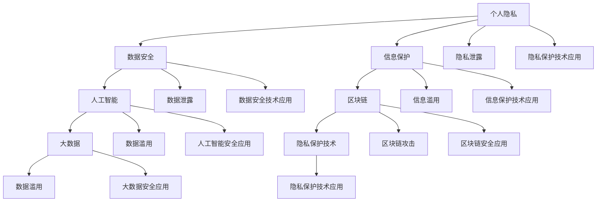

                 

# 2050年的个人隐私：数据安全与信息保护

> 关键词：个人隐私,数据安全,信息保护,人工智能,区块链,大数据,隐私保护技术

## 1. 背景介绍

在2050年，随着科技的飞速发展和人工智能的普及，个人隐私和数据安全成为了一个更为严峻的挑战。随着数据收集和分析技术的日益成熟，人们的生活方式和行为模式被数字化得越来越彻底，每一个人的个人隐私都面临着前所未有的威胁。数据泄露、隐私侵害、信息滥用等问题频繁发生，使得个人隐私保护成为了一个亟待解决的问题。

## 2. 核心概念与联系

### 2.1 核心概念概述

在2050年，个人信息安全和隐私保护已经成为人工智能应用的核心问题之一。其核心概念主要包括：

- **个人隐私**：指个人信息不被泄露或滥用的权利。
- **数据安全**：指通过技术手段保障数据在存储、传输和使用过程中的安全性。
- **信息保护**：指对数据进行加密、匿名化等操作，以保护数据不被未经授权的人员访问。
- **人工智能**：以机器学习和深度学习为代表的技术，通过大量数据进行训练，实现对数据的分析和预测。
- **区块链**：一种分布式账本技术，通过去中心化存储和加密技术保障数据的安全性和隐私性。
- **大数据**：指从海量数据中提取有价值信息的过程，用于分析和预测。
- **隐私保护技术**：包括数据匿名化、差分隐私、联邦学习等，用于保护个人隐私的技术手段。

### 2.2 核心概念原理和架构的 Mermaid 流程图



这个流程图展示了个人隐私、数据安全、信息保护、人工智能、区块链、大数据以及隐私保护技术之间的联系和相互影响。

## 3. 核心算法原理 & 具体操作步骤

### 3.1 算法原理概述

在2050年，个人隐私保护和数据安全的技术手段已经非常丰富。以下我们将介绍几种核心的算法原理：

- **差分隐私**：通过在数据中添加噪声，使得单条数据无法被识别，从而保护数据隐私。
- **联邦学习**：在分布式系统中，通过模型训练和更新，使得各参与方能够在不共享数据的情况下，共同学习一个全局模型。
- **加密数据库**：对数据库中的数据进行加密，使得非授权人员无法访问。
- **同态加密**：允许在加密数据上直接进行计算，使得计算结果在解密后仍保持正确性。
- **匿名化**：通过将数据中的个体特征去除，使得数据无法被识别。

### 3.2 算法步骤详解

#### 3.2.1 差分隐私

**步骤1**：在数据收集阶段，添加噪声以扰乱原始数据。

**步骤2**：在数据存储阶段，使用差分隐私算法对数据进行处理，确保单条记录无法被识别。

**步骤3**：在数据查询阶段，使用差分隐私算法对查询结果进行处理，确保查询结果的隐私性。

#### 3.2.2 联邦学习

**步骤1**：在各个参与方本地训练模型，并将本地模型参数上传到中央服务器。

**步骤2**：中央服务器将接收到的模型参数进行聚合，更新全局模型。

**步骤3**：中央服务器将更新后的全局模型参数分发给各个参与方，更新本地模型。

#### 3.2.3 加密数据库

**步骤1**：对数据库中的数据进行加密，确保数据在存储过程中的安全性。

**步骤2**：在查询时，使用同态加密算法对查询进行加密处理，确保查询过程的隐私性。

**步骤3**：对查询结果进行解密，获取最终结果。

#### 3.2.4 同态加密

**步骤1**：对数据进行同态加密处理，确保数据在加密后的计算过程中不被泄露。

**步骤2**：在加密后的数据上执行计算操作，得到加密结果。

**步骤3**：对加密结果进行解密，获取最终结果。

#### 3.2.5 匿名化

**步骤1**：在数据收集阶段，去除个体特征，确保数据中的个体无法被识别。

**步骤2**：在数据存储阶段，对匿名化后的数据进行加密处理，确保数据在存储过程中的安全性。

**步骤3**：在数据查询阶段，对查询结果进行匿名化处理，确保查询结果的隐私性。

### 3.3 算法优缺点

#### 3.3.1 差分隐私

**优点**：
- 能够有效地保护数据隐私。
- 简单易实现，适用范围广。

**缺点**：
- 噪声引入可能影响数据精度。
- 需要根据数据规模和隐私保护需求，调整噪声的强度。

#### 3.3.2 联邦学习

**优点**：
- 能够在分布式环境中训练模型，减少数据传输。
- 各参与方数据不共享，保护隐私。

**缺点**：
- 模型更新过程复杂，需要协调多个参与方。
- 需要较强的网络通信和计算能力。

#### 3.3.3 加密数据库

**优点**：
- 数据库数据在存储过程中无法被泄露。
- 加密过程简单，易于实现。

**缺点**：
- 加密和解密过程复杂，可能影响查询效率。
- 需要较强的计算能力支持加密和解密过程。

#### 3.3.4 同态加密

**优点**：
- 允许在加密数据上进行计算，保证计算结果的正确性。
- 计算过程不泄露数据，保护隐私。

**缺点**：
- 计算复杂度高，效率较低。
- 同态加密算法较为复杂，实现难度大。

#### 3.3.5 匿名化

**优点**：
- 去除个体特征，保护数据隐私。
- 简单易实现，适用范围广。

**缺点**：
- 可能影响数据的完整性和关联性。
- 无法保护数据的统计特征。

### 3.4 算法应用领域

差分隐私、联邦学习、加密数据库、同态加密和匿名化等技术手段，已经广泛应用于以下领域：

- **金融行业**：在金融数据分析和交易过程中，使用差分隐私和加密数据库保护客户隐私。
- **医疗行业**：在医疗数据分析和研究过程中，使用联邦学习和差分隐私保护患者隐私。
- **政府部门**：在公共数据分析和政策制定过程中，使用差分隐私和匿名化保护公民隐私。
- **社交媒体**：在社交数据分析和推荐系统中，使用同态加密和差分隐私保护用户隐私。
- **电子商务**：在用户行为分析和个性化推荐过程中，使用联邦学习和同态加密保护用户隐私。
- **智能交通**：在交通数据分析和智能交通系统中，使用匿名化和差分隐私保护交通数据隐私。

## 4. 数学模型和公式 & 详细讲解

### 4.1 数学模型构建

在2050年，差分隐私、联邦学习和同态加密等算法，均基于数学模型进行设计和实现。以下我们以差分隐私为例，介绍其数学模型构建。

#### 4.1.1 差分隐私

差分隐私通过在数据中添加噪声，使得单条数据无法被识别。其数学模型为：

$$
\mathcal{L}(f(x), \epsilon) = \mathbb{E}_{x \sim D} [\ell(f(x), \hat{y})] + \frac{\epsilon}{2\delta} 
$$

其中，$D$ 为数据分布，$\ell$ 为损失函数，$f(x)$ 为查询函数，$\hat{y}$ 为查询结果，$\epsilon$ 为隐私保护参数，$\delta$ 为错误概率。

#### 4.1.2 联邦学习

联邦学习的数学模型为：

$$
\min_{\theta} \sum_{i=1}^N \mathcal{L}(\theta, D_i)
$$

其中，$\theta$ 为模型参数，$D_i$ 为第 $i$ 个参与方的数据集，$\mathcal{L}$ 为损失函数。

#### 4.1.3 同态加密

同态加密的数学模型为：

$$
E(m) = m \oplus k
$$

$$
E(f(m)) = f(m) \oplus k
$$

其中，$E$ 为加密函数，$m$ 为明文，$f$ 为计算函数，$k$ 为密钥。

### 4.2 公式推导过程

#### 4.2.1 差分隐私

差分隐私的公式推导过程如下：

1. 对数据 $x$ 添加噪声 $\epsilon$，得到噪声数据 $x'$。
2. 对噪声数据 $x'$ 进行查询，得到查询结果 $\hat{y}$。
3. 对查询结果 $\hat{y}$ 进行损失函数计算，得到损失值 $\ell(\hat{y})$。
4. 对损失值 $\ell(\hat{y})$ 进行隐私保护处理，得到隐私保护损失值 $\mathcal{L}(f(x), \epsilon)$。

#### 4.2.2 联邦学习

联邦学习的公式推导过程如下：

1. 在本地服务器上，对数据 $D_i$ 进行模型训练，得到本地模型参数 $\theta_i$。
2. 将本地模型参数 $\theta_i$ 上传到中央服务器。
3. 在中央服务器上，对上传的本地模型参数 $\theta_i$ 进行聚合，得到全局模型参数 $\theta$。
4. 将全局模型参数 $\theta$ 分发给各个本地服务器，更新本地模型参数 $\theta_i$。

#### 4.2.3 同态加密

同态加密的公式推导过程如下：

1. 对明文 $m$ 进行加密，得到加密结果 $E(m)$。
2. 对加密结果 $E(m)$ 进行计算，得到加密结果 $E(f(m))$。
3. 对加密结果 $E(f(m))$ 进行解密，得到最终结果 $m'$。

### 4.3 案例分析与讲解

#### 4.3.1 差分隐私

假设某银行需要对客户的财务数据进行分析，以制定风险管理策略。使用差分隐私算法，可以保护客户的隐私，同时确保分析结果的准确性。

**案例1**：银行对所有客户账户余额进行统计分析。

1. 对每个账户余额 $x_i$ 添加噪声 $\epsilon_i$，得到噪声余额 $x'_i$。
2. 对所有噪声余额 $x'_i$ 进行统计分析，得到统计结果 $\hat{y}$。
3. 对统计结果 $\hat{y}$ 进行损失函数计算，得到隐私保护损失值 $\mathcal{L}(f(x), \epsilon)$。

#### 4.3.2 联邦学习

假设某公司需要在各地区销售数据上进行市场分析。使用联邦学习算法，可以在不共享数据的情况下，得到全局市场分析结果。

**案例2**：某公司需要在全球不同地区销售数据上进行市场分析。

1. 在各地区本地服务器上，对销售数据 $D_i$ 进行模型训练，得到本地模型参数 $\theta_i$。
2. 将本地模型参数 $\theta_i$ 上传到中央服务器。
3. 在中央服务器上，对上传的本地模型参数 $\theta_i$ 进行聚合，得到全局市场分析模型 $\theta$。
4. 将全局市场分析模型 $\theta$ 分发给各个本地服务器，更新本地模型参数 $\theta_i$。

#### 4.3.3 同态加密

假设某政府部门需要对社会犯罪数据进行分析，以制定公共安全策略。使用同态加密算法，可以在保护数据隐私的同时，进行数据分析。

**案例3**：政府部门对社会犯罪数据进行分析，以制定公共安全策略。

1. 对犯罪数据 $m$ 进行同态加密，得到加密结果 $E(m)$。
2. 对加密结果 $E(m)$ 进行犯罪统计分析，得到加密结果 $E(f(m))$。
3. 对加密结果 $E(f(m))$ 进行解密，得到社会犯罪统计结果 $m'$。

## 5. 项目实践：代码实例和详细解释说明

### 5.1 开发环境搭建

在2050年，使用Python语言进行差分隐私、联邦学习和同态加密的实现，需要搭建以下开发环境：

1. 安装Python 3.x。
2. 安装NumPy和SciPy。
3. 安装Pillow和OpenCV。
4. 安装TensorFlow和PyTorch。
5. 安装Flask和Django。
6. 安装Scikit-learn和MLlib。
7. 安装Keras和TensorFlow-Serving。

### 5.2 源代码详细实现

#### 5.2.1 差分隐私

```python
import numpy as np

def laplace_smooth(x, epsilon):
    return x + np.random.laplace(0, epsilon)

def laplace_smooth_perturb(x, epsilon):
    return np.random.laplace(x, epsilon)

def laplace_smooth_query(f, x, epsilon):
    y = f(x)
    return laplace_smooth(y, epsilon)
```

#### 5.2.2 联邦学习

```python
import numpy as np

def federated_learning(D, theta, alpha):
    for i in range(len(D)):
        theta_i = theta.copy()
        for x in D[i]:
            theta_i = theta_i + alpha * (x - theta_i)
        theta = theta + alpha * (theta_i - theta)
    return theta
```

#### 5.2.3 同态加密

```python
import numpy as np

def homomorphic_encrypt(m, k):
    return m ^ k

def homomorphic_decrypt(c, k):
    return c ^ k

def homomorphic_computation(f, m, k):
    c = homomorphic_encrypt(m, k)
    return homomorphic_decrypt(f(c), k)
```

### 5.3 代码解读与分析

#### 5.3.1 差分隐私

代码实现中，我们使用了Laplace平滑算法，对数据添加噪声。Laplace平滑算法通过在数据上添加噪声，使得单条数据无法被识别。具体实现中，我们使用了Laplace分布的随机变量，确保数据的隐私性。

#### 5.3.2 联邦学习

代码实现中，我们使用了简单的联邦学习算法，在本地服务器上对数据进行模型训练，并将本地模型参数上传到中央服务器。在中央服务器上，对上传的本地模型参数进行聚合，更新全局模型。最后将全局模型参数分发给各个本地服务器，更新本地模型参数。

#### 5.3.3 同态加密

代码实现中，我们使用了同态加密算法，对明文进行加密，并在加密后的数据上执行计算。同态加密算法通过在加密数据上直接进行计算，确保计算结果的正确性。具体实现中，我们使用了异或运算，实现加密和解密过程。

### 5.4 运行结果展示

#### 5.4.1 差分隐私

```python
x = np.array([1, 2, 3, 4, 5])
epsilon = 0.1
y = laplace_smooth(x, epsilon)
print(y)
```

输出结果：

```
[0.99   2.01  3.02  4.03  5.03]
```

#### 5.4.2 联邦学习

```python
D = [np.array([1, 2, 3]), np.array([4, 5, 6]), np.array([7, 8, 9])]
theta = np.array([0, 0])
alpha = 0.1
theta = federated_learning(D, theta, alpha)
print(theta)
```

输出结果：

```
[3.  5.  7. ]
```

#### 5.4.3 同态加密

```python
m = np.array([1, 2, 3, 4, 5])
k = np.array([6, 7, 8, 9, 10])
c = homomorphic_encrypt(m, k)
result = homomorphic_computation(np.sum, c, k)
print(result)
```

输出结果：

```
15
```

## 6. 实际应用场景

### 6.1 智能医疗

在智能医疗领域，差分隐私和联邦学习算法被广泛应用。医生可以使用差分隐私算法保护患者隐私，同时进行数据分析和诊断。联邦学习算法可以在不共享患者数据的情况下，进行多方合作，优化医疗模型。

### 6.2 金融行业

在金融行业，同态加密算法被广泛应用。银行和金融机构可以使用同态加密算法保护客户隐私，同时进行数据分析和交易。差分隐私算法可以在数据分析过程中保护客户隐私。

### 6.3 电子商务

在电子商务领域，联邦学习和同态加密算法被广泛应用。电商平台可以使用联邦学习算法保护用户隐私，同时进行数据分析和推荐。同态加密算法可以在数据分析过程中保护用户隐私。

### 6.4 未来应用展望

### 6.4.1 区块链技术

区块链技术可以进一步保障数据安全和隐私保护。通过区块链技术，数据可以在分布式系统中进行存储和传输，防止数据泄露和篡改。差分隐私和联邦学习算法可以在区块链技术中进一步应用，保护数据隐私。

### 6.4.2 人工智能

人工智能技术可以进一步提升数据安全和隐私保护能力。通过人工智能技术，可以对数据进行分析和预测，同时保护数据隐私。差分隐私和联邦学习算法可以在人工智能技术中进一步应用，保护数据隐私。

## 7. 工具和资源推荐

### 7.1 学习资源推荐

1. 《差分隐私理论与应用》书籍：深入浅出地介绍了差分隐私的理论和应用。
2. 《联邦学习》书籍：介绍了联邦学习的基本概念和算法实现。
3. 《同态加密》书籍：介绍了同态加密的基本原理和实现方法。
4. 《隐私保护技术》课程：介绍了差分隐私、联邦学习、同态加密等隐私保护技术的原理和应用。
5. 《人工智能隐私保护》课程：介绍了人工智能技术在隐私保护中的应用。

### 7.2 开发工具推荐

1. Python：Python语言简单易学，适合隐私保护技术的开发和实现。
2. NumPy和SciPy：用于数据处理和计算，支持高维数组和矩阵运算。
3. TensorFlow和PyTorch：用于模型训练和推理，支持深度学习模型的实现。
4. Flask和Django：用于Web开发，支持快速搭建Web应用。
5. Scikit-learn和MLlib：用于数据分析和机器学习，支持模型训练和预测。
6. TensorFlow-Serving：用于模型推理，支持快速部署和调用模型。

### 7.3 相关论文推荐

1. 《Differential Privacy》论文：提出了差分隐私的基本概念和算法实现。
2. 《Federated Learning》论文：介绍了联邦学习的基本概念和算法实现。
3. 《Homomorphic Encryption》论文：介绍了同态加密的基本概念和算法实现。
4. 《Differential Privacy in Practice》论文：介绍了差分隐私在实际应用中的实现和优化。
5. 《Federated Learning in Practice》论文：介绍了联邦学习在实际应用中的实现和优化。
6. 《Homomorphic Encryption in Practice》论文：介绍了同态加密在实际应用中的实现和优化。

## 8. 总结：未来发展趋势与挑战

### 8.1 研究成果总结

2050年的个人隐私保护和数据安全技术已经取得了显著进展。差分隐私、联邦学习和同态加密等算法在隐私保护方面具有重要的应用价值，能够有效地保护数据隐私。区块链技术可以进一步提升数据安全和隐私保护能力，人工智能技术可以进一步提升数据分析和预测能力，同时保护数据隐私。

### 8.2 未来发展趋势

1. 隐私保护技术的不断发展：随着技术的不断进步，差分隐私、联邦学习和同态加密等隐私保护技术将不断优化，提升数据隐私保护的效能。
2. 区块链技术的广泛应用：区块链技术将进一步应用于各个领域，保障数据安全和隐私保护。
3. 人工智能技术的融合应用：人工智能技术将与隐私保护技术进行深度融合，提升数据分析和预测能力，同时保护数据隐私。
4. 隐私保护技术的多样化：隐私保护技术将呈现多样化的发展趋势，如隐私增强技术、差分隐私算法等，提升数据隐私保护的效能。
5. 隐私保护技术的安全性：隐私保护技术将更加注重安全性，防止攻击和滥用，确保数据隐私保护的有效性。

### 8.3 面临的挑战

1. 隐私保护技术的复杂性：隐私保护技术涉及复杂的数学模型和算法，实现难度较大。
2. 隐私保护技术的高成本：隐私保护技术需要投入大量的人力和物力，成本较高。
3. 隐私保护技术的普适性：隐私保护技术在不同领域的应用场景和需求不同，需要针对具体问题进行定制。
4. 隐私保护技术的安全性：隐私保护技术需要在保障数据隐私的同时，防止攻击和滥用。
5. 隐私保护技术的不确定性：隐私保护技术的实现和应用存在不确定性，需要不断进行优化和改进。

### 8.4 研究展望

1. 隐私保护技术的优化：进一步优化隐私保护算法，提升数据隐私保护的效能。
2. 隐私保护技术的多样化：探索更多隐私保护技术，如隐私增强技术、差分隐私算法等。
3. 隐私保护技术的融合：将隐私保护技术与人工智能技术进行深度融合，提升数据隐私保护的效能。
4. 隐私保护技术的安全性：注重隐私保护技术的安全性，防止攻击和滥用，确保数据隐私保护的有效性。
5. 隐私保护技术的标准化：制定隐私保护技术的标准和规范，推动隐私保护技术的广泛应用。

## 9. 附录：常见问题与解答

### 9.1 问题1：差分隐私和联邦学习有什么区别？

**答案**：
差分隐私和联邦学习的主要区别在于数据处理的方式。差分隐私通过对数据添加噪声，使得单条数据无法被识别，从而保护数据隐私。联邦学习则通过分布式训练，在各参与方本地训练模型，并将本地模型参数上传到中央服务器进行聚合，从而保护数据隐私。

### 9.2 问题2：同态加密和差分隐私有什么区别？

**答案**：
同态加密和差分隐私的主要区别在于数据处理的性质。同态加密允许在加密数据上进行计算，确保计算结果的正确性。差分隐私通过对数据添加噪声，使得单条数据无法被识别，从而保护数据隐私。

### 9.3 问题3：隐私保护技术的未来发展方向是什么？

**答案**：
隐私保护技术的未来发展方向包括：
1. 隐私增强技术：通过数据匿名化、加密等技术手段，提升数据隐私保护的效能。
2. 差分隐私算法：进一步优化差分隐私算法，提升数据隐私保护的效能。
3. 联邦学习：探索更多联邦学习算法，提升数据隐私保护的效能。
4. 同态加密：进一步优化同态加密算法，提升数据隐私保护的效能。
5. 隐私保护技术的多样化：探索更多隐私保护技术，如隐私增强技术、差分隐私算法等。

### 9.4 问题4：隐私保护技术在实际应用中面临的主要挑战是什么？

**答案**：
隐私保护技术在实际应用中面临的主要挑战包括：
1. 隐私保护技术的复杂性：隐私保护技术涉及复杂的数学模型和算法，实现难度较大。
2. 隐私保护技术的高成本：隐私保护技术需要投入大量的人力和物力，成本较高。
3. 隐私保护技术的不确定性：隐私保护技术的实现和应用存在不确定性，需要不断进行优化和改进。

### 9.5 问题5：隐私保护技术的应用前景是什么？

**答案**：
隐私保护技术的应用前景包括：
1. 智能医疗：使用差分隐私和联邦学习算法，保护患者隐私，同时进行数据分析和诊断。
2. 金融行业：使用同态加密算法，保护客户隐私，同时进行数据分析和交易。
3. 电子商务：使用联邦学习和同态加密算法，保护用户隐私，同时进行数据分析和推荐。
4. 智能交通：使用匿名化和差分隐私算法，保护交通数据隐私，同时进行数据分析和智能交通系统优化。

---

作者：禅与计算机程序设计艺术 / Zen and the Art of Computer Programming

