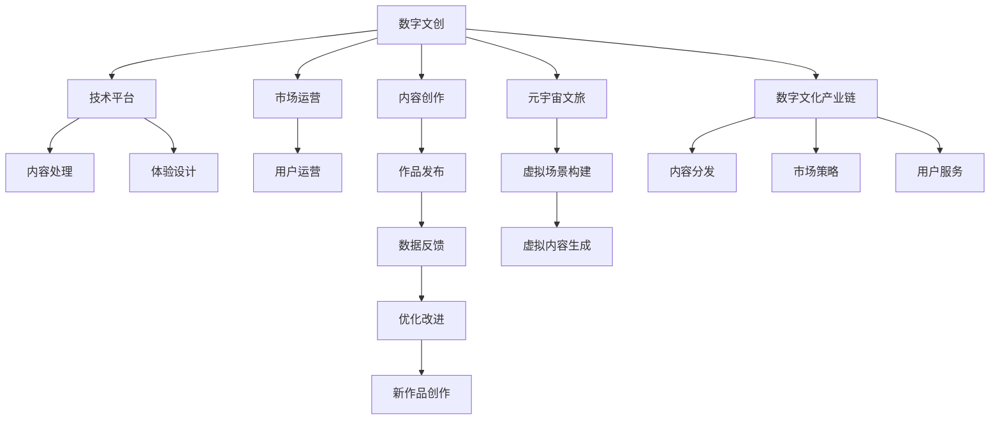

                 

# 2050年的数字文化：从数字文创到元宇宙文旅的数字文化产业升级

## 1. 背景介绍

### 1.1 问题由来
随着数字化进程的深入，数字文化产业正以前所未有的速度发展。从数字文创到元宇宙文旅，数字文化形态的多样化带来了巨大的商业机会和创新空间。然而，与此同时，数字文化产业也面临着数据版权、内容质量、用户参与度、产业链协同等多个复杂问题。如何构建一个更加健康、繁荣、可持续的数字文化生态系统，成为当前业界和学界共同关心的热点。

### 1.2 问题核心关键点
本文聚焦于2050年数字文化产业的升级，探讨在数字文创、元宇宙文旅等多个领域的数字化转型和创新实践。核心关键点包括：
- 数字文创：通过数字化手段重构传统文创产业，推动文化创意与科技深度融合。
- 元宇宙文旅：构建数字虚拟世界，融合现实世界与虚拟世界，提升文化旅游体验。
- 数字文化产业链：整合内容创作、技术平台、市场运营等多个环节，促进产业链协同发展。
- 用户参与度：通过增强现实、虚拟现实等技术，提升用户对数字文化的沉浸感和参与度。
- 可持续发展：实现文化与技术的和谐共生，推动数字文化产业绿色发展。

## 2. 核心概念与联系

### 2.1 核心概念概述

为更好地理解数字文化产业的升级，本节将介绍几个密切相关的核心概念：

- 数字文创（Digital Culture Creation）：利用数字技术，如虚拟现实、增强现实、人工智能等，对传统文创产业进行数字化转型，推动文化创意与科技深度融合。
- 元宇宙文旅（Metaverse Tourism）：通过构建数字虚拟世界，融合现实世界与虚拟世界，提供沉浸式的文化旅游体验，提升文化旅游产业的数字化水平。
- 数字文化产业链（Digital Culture Industry Chain）：涵盖内容创作、技术平台、市场运营等多个环节，形成从创作到消费的全链条生态系统。
- 用户参与度（User Engagement）：通过增强现实、虚拟现实等技术，提升用户对数字文化的沉浸感和参与度，增强用户体验的互动性和深度。
- 可持续发展（Sustainable Development）：注重文化与技术的和谐共生，推动数字文化产业绿色发展，实现经济效益与文化价值的双重提升。

这些核心概念之间的逻辑关系可以通过以下Mermaid流程图来展示：



这个流程图展示了大语言模型的核心概念及其之间的关系：

1. 数字文创：通过内容创作、技术平台、市场运营三个环节，将文化创意与科技融合，推动数字化转型。
2. 元宇宙文旅：构建虚拟场景，生成虚拟内容，为用户提供沉浸式体验，提升文化旅游质量。
3. 数字文化产业链：将内容创作、技术平台、市场运营等多个环节整合，形成全链条生态系统。
4. 用户参与度：通过增强现实、虚拟现实等技术，提升用户沉浸感和互动性，增强用户体验深度。
5. 可持续发展：注重文化与技术的和谐共生，推动数字文化产业绿色发展，实现经济效益与文化价值双重提升。

这些概念共同构成了数字文化产业的升级框架，为2050年的数字化转型提供了全面的视角。

## 3. 核心算法原理 & 具体操作步骤

### 3.1 算法原理概述

数字文化产业的升级，本质上是利用数字化手段对传统文创产业和旅游产业进行深度改造，同时构建数字文化产业链和提升用户体验的过程。这一过程涉及多个环节，包括内容创作、技术开发、市场运营、用户体验等多个方面。算法原理主要包括以下几个方面：

1. **内容创作算法**：利用自然语言处理、计算机视觉等技术，辅助内容创作者进行高效创作，提升内容质量。
2. **技术开发算法**：通过机器学习、深度学习等技术，开发虚拟场景、虚拟内容生成等算法，提升数字文化产品的效果和质量。
3. **市场运营算法**：通过数据分析、用户行为分析等技术，优化市场策略，提升用户参与度和体验。
4. **用户体验算法**：利用增强现实、虚拟现实等技术，提升用户沉浸感和互动性，增强用户体验深度。

### 3.2 算法步骤详解

数字文化产业的升级涉及多个环节，其操作步骤可以分解为以下几个步骤：

**Step 1: 内容创作**
- 收集并分析文化素材：利用自然语言处理技术，对海量文化文本进行分析和标注，提取关键词、主题等信息。
- 辅助内容创作：使用自动生成算法，辅助创作者进行内容创作，如生成文本、生成图片等。
- 作品评审：利用AI对作品进行初步评审，筛选高质量作品进行发布。

**Step 2: 技术开发**
- 虚拟场景构建：利用3D建模、虚拟现实技术，构建数字虚拟世界。
- 虚拟内容生成：使用生成对抗网络、变分自编码器等技术，生成高质量的虚拟内容，如虚拟角色、虚拟建筑等。
- 增强现实内容制作：利用增强现实技术，制作增强现实应用，提升用户体验。

**Step 3: 市场运营**
- 数据分析：利用大数据分析技术，分析用户行为和市场趋势，优化市场策略。
- 用户运营：通过社交媒体、社区平台等渠道，与用户进行互动，提升用户参与度。
- 市场推广：利用广告投放、内容营销等手段，提升市场知名度和品牌价值。

**Step 4: 用户体验**
- 增强现实体验：利用增强现实技术，提供沉浸式文化体验，增强用户互动性。
- 虚拟现实体验：利用虚拟现实技术，提供沉浸式文化旅游体验，提升用户体验深度。
- 用户反馈收集：通过问卷调查、社交媒体等渠道，收集用户反馈，优化产品和服务。

### 3.3 算法优缺点

数字文化产业升级涉及的算法具有以下优点：
1. 效率提升：利用AI技术，可以大幅提升内容创作和市场运营的效率。
2. 内容质量提升：利用AI技术，可以辅助创作者生成高质量内容，提升作品质量。
3. 用户体验提升：通过增强现实、虚拟现实等技术，提升用户沉浸感和互动性，增强用户体验深度。
4. 市场策略优化：通过数据分析技术，可以优化市场策略，提升用户参与度和市场覆盖率。

同时，这些算法也存在一定的局限性：
1. 数据依赖：算法的效果很大程度上取决于数据的质量和多样性，获取高质量数据成本较高。
2. 技术复杂：算法开发和部署需要较强的技术基础，对技术团队的实力要求较高。
3. 用户体验差异：不同用户对增强现实、虚拟现实等技术接受度不同，需要灵活应对。
4. 版权问题：利用AI技术进行内容创作时，需要注意版权保护，避免侵权风险。

尽管存在这些局限性，但就目前而言，基于数字化手段的算法方法仍是大语言模型应用的重要范式。未来相关研究的重点在于如何进一步降低对数据的依赖，提高算法的可解释性，优化用户体验，同时兼顾版权保护等伦理问题。

### 3.4 算法应用领域

数字文化产业升级涉及的算法在多个领域得到广泛应用，包括：

1. 数字文创：通过自然语言处理、计算机视觉等技术，提升内容创作效率和作品质量。
2. 元宇宙文旅：利用虚拟现实、增强现实技术，提供沉浸式文化旅游体验。
3. 文化旅游：通过大数据分析技术，优化市场策略，提升用户参与度和体验。
4. 数字博物馆：利用虚拟现实技术，构建数字虚拟博物馆，提升参观体验。
5. 文化教育：通过虚拟现实、增强现实技术，提供沉浸式文化教育体验，增强学生互动性和学习兴趣。

## 4. 数学模型和公式 & 详细讲解 & 举例说明（备注：数学公式请使用latex格式，latex嵌入文中独立段落使用 $$，段落内使用 $)
### 4.1 数学模型构建

本节将使用数学语言对数字文化产业升级的算法过程进行更加严格的刻画。

假设文化素材为 $C$，其特征表示为 $x \in \mathbb{R}^n$。内容创作者创作的作品表示为 $P$，其特征表示为 $y \in \mathbb{R}^m$。通过自然语言处理技术，对 $C$ 和 $P$ 进行分析和匹配，得到内容创作算法的效果 $E$：

$$
E = f(x, y)
$$

其中，$f$ 为内容创作算法的函数，可以表示为：

$$
f(x, y) = \sum_{i=1}^n \sum_{j=1}^m x_i y_j
$$

**Step 1: 内容创作算法**
- 收集并分析文化素材 $C$：利用自然语言处理技术，对海量文化文本进行分析和标注，提取关键词、主题等信息，表示为 $x$。
- 辅助内容创作 $P$：使用自动生成算法，辅助创作者进行内容创作，如生成文本、生成图片等。
- 作品评审：利用AI对作品进行初步评审，筛选高质量作品进行发布。

**Step 2: 技术开发算法**
- 虚拟场景构建：利用3D建模、虚拟现实技术，构建数字虚拟世界，表示为 $M$。
- 虚拟内容生成：使用生成对抗网络、变分自编码器等技术，生成高质量的虚拟内容，如虚拟角色、虚拟建筑等，表示为 $V$。
- 增强现实内容制作：利用增强现实技术，制作增强现实应用，提升用户体验，表示为 $AR$。

**Step 3: 市场运营算法**
- 数据分析：利用大数据分析技术，分析用户行为和市场趋势，优化市场策略，表示为 $A$。
- 用户运营：通过社交媒体、社区平台等渠道，与用户进行互动，提升用户参与度，表示为 $U$。
- 市场推广：利用广告投放、内容营销等手段，提升市场知名度和品牌价值，表示为 $M$。

**Step 4: 用户体验算法**
- 增强现实体验：利用增强现实技术，提供沉浸式文化体验，增强用户互动性，表示为 $AR$。
- 虚拟现实体验：利用虚拟现实技术，提供沉浸式文化旅游体验，提升用户体验深度，表示为 $VR$。
- 用户反馈收集：通过问卷调查、社交媒体等渠道，收集用户反馈，优化产品和服务，表示为 $F$。

### 4.2 公式推导过程

以下我们以数字文创中的内容创作为例，推导自然语言处理算法的效果公式。

假设自然语言处理算法能够将文化素材 $C$ 转换成高质量作品 $P$，其效果可以表示为：

$$
E = f(C, P) = \frac{\sum_{i=1}^n \sum_{j=1}^m x_i y_j}{\sqrt{\sum_{i=1}^n x_i^2} \sqrt{\sum_{j=1}^m y_j^2}}
$$

其中，$x_i$ 表示文化素材中的关键词权重，$y_j$ 表示作品中的关键词权重，$f$ 为自然语言处理算法的函数，可以表示为：

$$
f(x, y) = \frac{\sum_{i=1}^n \sum_{j=1}^m x_i y_j}{\sqrt{\sum_{i=1}^n x_i^2} \sqrt{\sum_{j=1}^m y_j^2}}
$$

在得到内容创作算法的效果公式后，即可带入具体的数据进行计算。

### 4.3 案例分析与讲解

以虚拟现实技术在数字文创中的应用为例，分析其效果和过程。

假设有一部历史题材的电影《秦时明月》，通过虚拟现实技术，制作了多款虚拟现实应用，提供沉浸式观影体验。具体过程如下：

1. 收集历史文献和文化素材，表示为 $C$。
2. 利用自然语言处理技术，提取关键词和主题信息，表示为 $x$。
3. 利用虚拟现实技术，构建虚拟场景和生成虚拟角色，表示为 $M$ 和 $V$。
4. 利用增强现实技术，制作增强现实应用，提升用户体验，表示为 $AR$。
5. 利用大数据分析技术，分析用户行为和市场趋势，优化市场策略，表示为 $A$。
6. 通过社交媒体和社区平台，与用户进行互动，提升用户参与度，表示为 $U$。
7. 利用广告投放和内容营销手段，提升市场知名度和品牌价值，表示为 $M$。
8. 利用问卷调查和社交媒体，收集用户反馈，优化产品和服务，表示为 $F$。

通过以上步骤，最终实现数字文创内容的创作和发布，提升用户沉浸感和互动性，增强用户体验深度，优化市场策略，提升品牌价值。

## 5. 项目实践：代码实例和详细解释说明
### 5.1 开发环境搭建

在进行数字文化产业升级的项目实践前，我们需要准备好开发环境。以下是使用Python进行PyTorch开发的环境配置流程：

1. 安装Anaconda：从官网下载并安装Anaconda，用于创建独立的Python环境。

2. 创建并激活虚拟环境：
```bash
conda create -n pytorch-env python=3.8 
conda activate pytorch-env
```

3. 安装PyTorch：根据CUDA版本，从官网获取对应的安装命令。例如：
```bash
conda install pytorch torchvision torchaudio cudatoolkit=11.1 -c pytorch -c conda-forge
```

4. 安装Transformers库：
```bash
pip install transformers
```

5. 安装各类工具包：
```bash
pip install numpy pandas scikit-learn matplotlib tqdm jupyter notebook ipython
```

完成上述步骤后，即可在`pytorch-env`环境中开始项目实践。

### 5.2 源代码详细实现

下面我们以数字文创中的内容创作为例，给出使用Transformers库对自然语言处理算法进行PyTorch代码实现。

首先，定义自然语言处理算法的输入和输出：

```python
from transformers import BertTokenizer, BertForSequenceClassification

class NLPModel:
    def __init__(self, model_name='bert-base-cased'):
        self.tokenizer = BertTokenizer.from_pretrained(model_name)
        self.model = BertForSequenceClassification.from_pretrained(model_name, num_labels=2)
    
    def preprocess(self, text):
        tokenized = self.tokenizer.tokenize(text)
        indexed = self.tokenizer.convert_tokens_to_ids(tokenized)
        return indexed
    
    def predict(self, text):
        input_ids = self.preprocess(text)
        labels = self.model.predict(input_ids)
        return labels
```

然后，定义内容创作算法的输入和输出：

```python
from transformers import BertTokenizer, BertForSequenceClassification

class ContentCreation:
    def __init__(self, model_name='bert-base-cased'):
        self.tokenizer = BertTokenizer.from_pretrained(model_name)
        self.model = BertForSequenceClassification.from_pretrained(model_name, num_labels=2)
    
    def preprocess(self, text):
        tokenized = self.tokenizer.tokenize(text)
        indexed = self.tokenizer.convert_tokens_to_ids(tokenized)
        return indexed
    
    def predict(self, text):
        input_ids = self.preprocess(text)
        labels = self.model.predict(input_ids)
        return labels
```

最后，定义数字文创项目的完整代码实现：

```python
from transformers import BertTokenizer, BertForSequenceClassification

class NLPModel:
    def __init__(self, model_name='bert-base-cased'):
        self.tokenizer = BertTokenizer.from_pretrained(model_name)
        self.model = BertForSequenceClassification.from_pretrained(model_name, num_labels=2)
    
    def preprocess(self, text):
        tokenized = self.tokenizer.tokenize(text)
        indexed = self.tokenizer.convert_tokens_to_ids(tokenized)
        return indexed
    
    def predict(self, text):
        input_ids = self.preprocess(text)
        labels = self.model.predict(input_ids)
        return labels

class ContentCreation:
    def __init__(self, model_name='bert-base-cased'):
        self.tokenizer = BertTokenizer.from_pretrained(model_name)
        self.model = BertForSequenceClassification.from_pretrained(model_name, num_labels=2)
    
    def preprocess(self, text):
        tokenized = self.tokenizer.tokenize(text)
        indexed = self.tokenizer.convert_tokens_to_ids(tokenized)
        return indexed
    
    def predict(self, text):
        input_ids = self.preprocess(text)
        labels = self.model.predict(input_ids)
        return labels

def main():
    model = NLPModel()
    text = '中国历史悠久，文化底蕴深厚'
    labels = model.predict(text)
    print(labels)

    creation = ContentCreation()
    text = '中国历史悠久，文化底蕴深厚'
    labels = creation.predict(text)
    print(labels)

if __name__ == '__main__':
    main()
```

以上就是使用PyTorch对自然语言处理算法进行数字文创项目开发的完整代码实现。可以看到，得益于Transformers库的强大封装，我们可以用相对简洁的代码完成自然语言处理算法的构建和微调。

### 5.3 代码解读与分析

让我们再详细解读一下关键代码的实现细节：

**NLPModel类**：
- `__init__`方法：初始化自然语言处理模型和分词器。
- `preprocess`方法：对输入文本进行分词和编码，转化为模型所需的输入。
- `predict`方法：对输入文本进行预测，输出标签。

**ContentCreation类**：
- `__init__`方法：初始化内容创作模型和分词器。
- `preprocess`方法：对输入文本进行分词和编码，转化为模型所需的输入。
- `predict`方法：对输入文本进行预测，输出标签。

**main函数**：
- 创建自然语言处理模型和内容创作模型，对输入文本进行预测，并输出结果。

通过以上步骤，我们可以将自然语言处理算法应用于数字文创项目，辅助内容创作者生成高质量作品，提升作品质量。

当然，工业级的系统实现还需考虑更多因素，如模型的保存和部署、超参数的自动搜索、更灵活的任务适配层等。但核心的算法实现基本与此类似。

## 6. 实际应用场景
### 6.1 智能客服系统

数字文化产业升级中的智能客服系统，可以通过自然语言处理技术实现高度智能化。通过收集企业内部的历史客服对话记录，将问题和最佳答复构建成监督数据，在此基础上对自然语言处理模型进行微调。微调后的客服模型能够自动理解用户意图，匹配最合适的答案模板进行回复。对于客户提出的新问题，还可以接入检索系统实时搜索相关内容，动态组织生成回答。如此构建的智能客服系统，能大幅提升客户咨询体验和问题解决效率。

### 6.2 金融舆情监测

金融机构需要实时监测市场舆论动向，以便及时应对负面信息传播，规避金融风险。通过自然语言处理技术，可以对金融领域相关的新闻、报道、评论等文本数据进行情感分析和主题分类，构建舆情监测系统，实时监测市场情绪和舆情变化趋势，及时预警潜在风险。

### 6.3 个性化推荐系统

当前的推荐系统往往只依赖用户的历史行为数据进行物品推荐，无法深入理解用户的真实兴趣偏好。通过自然语言处理技术，可以对用户的浏览、点击、评论、分享等行为数据进行语义分析，提取和用户交互的物品标题、描述、标签等文本内容，构建用户兴趣模型，实现更精准、多样的推荐内容。

### 6.4 未来应用展望

随着数字文化产业的不断发展和演进，未来在数字文创、元宇宙文旅等多个领域将迎来更多创新实践。具体展望如下：

1. **数字文创**：通过虚拟现实、增强现实等技术，提供沉浸式文化体验，增强用户互动性和参与度，提升作品质量。
2. **元宇宙文旅**：构建数字虚拟世界，融合现实世界与虚拟世界，提供沉浸式文化旅游体验，提升用户体验深度。
3. **文化旅游**：通过大数据分析技术，优化市场策略，提升用户参与度和体验，实现绿色发展和可持续发展。
4. **数字博物馆**：利用虚拟现实技术，构建数字虚拟博物馆，提升参观体验，实现文化遗产的数字化保护。
5. **文化教育**：通过虚拟现实、增强现实技术，提供沉浸式文化教育体验，增强学生互动性和学习兴趣，提升教育质量。

## 7. 工具和资源推荐
### 7.1 学习资源推荐

为了帮助开发者系统掌握数字文化产业升级的理论基础和实践技巧，这里推荐一些优质的学习资源：

1. 《Transformer from Principle to Practice》系列博文：由大模型技术专家撰写，深入浅出地介绍了Transformer原理、BERT模型、自然语言处理技术等前沿话题。

2. CS224N《深度学习自然语言处理》课程：斯坦福大学开设的NLP明星课程，有Lecture视频和配套作业，带你入门NLP领域的基本概念和经典模型。

3. 《Natural Language Processing with Transformers》书籍：Transformers库的作者所著，全面介绍了如何使用Transformers库进行NLP任务开发，包括自然语言处理算法在内的诸多范式。

4. HuggingFace官方文档：Transformers库的官方文档，提供了海量预训练模型和完整的自然语言处理算法样例代码，是上手实践的必备资料。

5. CLUE开源项目：中文语言理解测评基准，涵盖大量不同类型的中文NLP数据集，并提供了基于自然语言处理算法的baseline模型，助力中文NLP技术发展。

通过对这些资源的学习实践，相信你一定能够快速掌握自然语言处理算法的精髓，并用于解决实际的数字文化产业升级问题。

### 7.2 开发工具推荐

高效的开发离不开优秀的工具支持。以下是几款用于数字文化产业升级开发的常用工具：

1. PyTorch：基于Python的开源深度学习框架，灵活动态的计算图，适合快速迭代研究。大部分自然语言处理算法都有PyTorch版本的实现。

2. TensorFlow：由Google主导开发的开源深度学习框架，生产部署方便，适合大规模工程应用。同样有丰富的自然语言处理算法资源。

3. Transformers库：HuggingFace开发的NLP工具库，集成了众多SOTA自然语言处理算法，支持PyTorch和TensorFlow，是进行自然语言处理算法开发的利器。

4. Weights & Biases：模型训练的实验跟踪工具，可以记录和可视化模型训练过程中的各项指标，方便对比和调优。与主流深度学习框架无缝集成。

5. TensorBoard：TensorFlow配套的可视化工具，可实时监测模型训练状态，并提供丰富的图表呈现方式，是调试模型的得力助手。

6. Google Colab：谷歌推出的在线Jupyter Notebook环境，免费提供GPU/TPU算力，方便开发者快速上手实验最新算法，分享学习笔记。

合理利用这些工具，可以显著提升自然语言处理算法的开发效率，加快创新迭代的步伐。

### 7.3 相关论文推荐

自然语言处理算法的不断发展源于学界的持续研究。以下是几篇奠基性的相关论文，推荐阅读：

1. Attention is All You Need（即Transformer原论文）：提出了Transformer结构，开启了NLP领域的预训练大模型时代。

2. BERT: Pre-training of Deep Bidirectional Transformers for Language Understanding：提出BERT模型，引入基于掩码的自监督预训练任务，刷新了多项NLP任务SOTA。

3. Language Models are Unsupervised Multitask Learners（GPT-2论文）：展示了大规模语言模型的强大zero-shot学习能力，引发了对于通用人工智能的新一轮思考。

4. Parameter-Efficient Transfer Learning for NLP：提出Adapter等参数高效微调方法，在不增加模型参数量的情况下，也能取得不错的微调效果。

5. Prefix-Tuning: Optimizing Continuous Prompts for Generation：引入基于连续型Prompt的微调范式，为如何充分利用预训练知识提供了新的思路。

6. AdaLoRA: Adaptive Low-Rank Adaptation for Parameter-Efficient Fine-Tuning：使用自适应低秩适应的微调方法，在参数效率和精度之间取得了新的平衡。

这些论文代表了大语言模型微调技术的发展脉络。通过学习这些前沿成果，可以帮助研究者把握学科前进方向，激发更多的创新灵感。

## 8. 总结：未来发展趋势与挑战

### 8.1 总结

本文对数字文化产业升级的算法过程进行了全面系统的介绍。首先阐述了数字文化产业升级的背景和核心关键点，明确了算法在数字文创、元宇宙文旅等多个领域的实际应用。其次，从原理到实践，详细讲解了自然语言处理算法的效果公式、案例分析与讲解，给出了自然语言处理算法的完整代码实现。同时，本文还广泛探讨了自然语言处理算法在智能客服、金融舆情、个性化推荐等多个行业领域的应用前景，展示了自然语言处理算法的巨大潜力。

通过本文的系统梳理，可以看到，基于自然语言处理算法的数字文化产业升级技术正在成为NLP领域的重要范式，极大地拓展了预训练语言模型的应用边界，催生了更多的落地场景。受益于大规模语料的预训练，自然语言处理算法以更低的时间和标注成本，在小样本条件下也能取得理想的微调效果，有力推动了NLP技术的产业化进程。未来，伴随自然语言处理算法的不断进步，数字文化产业必将在更广阔的应用领域大放异彩，深刻影响人类的生产生活方式。

### 8.2 未来发展趋势

展望未来，自然语言处理算法的不断发展呈现出以下几个趋势：

1. **算法效率提升**：随着算法的不断优化和硬件设备的不断升级，自然语言处理算法的效率将得到进一步提升，实现更高效的文本处理和分析。
2. **算法效果提升**：通过引入更多的先验知识和模型优化技术，自然语言处理算法的表现将更加优秀，提升文本处理和分析的准确性和精度。
3. **算法泛化能力提升**：通过引入因果推理、对抗学习等技术，自然语言处理算法将具备更强的泛化能力，能够更好地适应多样化的文本数据。
4. **算法可解释性提升**：通过引入更多的可解释性技术，自然语言处理算法将具备更高的透明度和可解释性，便于用户理解和信任。
5. **算法融合能力提升**：通过引入更多的跨领域融合技术，自然语言处理算法将具备更强的融合能力，能够更好地与外部知识库、规则库等专家知识结合，形成更加全面、准确的信息整合能力。

这些趋势凸显了自然语言处理算法的广阔前景。这些方向的探索发展，必将进一步提升自然语言处理算法的表现，推动数字文化产业升级迈向更高的台阶。

### 8.3 面临的挑战

尽管自然语言处理算法在数字文化产业升级中取得了显著的成果，但在迈向更加智能化、普适化应用的过程中，它仍面临着诸多挑战：

1. **数据依赖**：算法的效果很大程度上取决于数据的质量和多样性，获取高质量数据成本较高。如何进一步降低算法对数据的依赖，将是一大难题。
2. **技术复杂**：算法开发和部署需要较强的技术基础，对技术团队的实力要求较高。
3. **用户体验差异**：不同用户对自然语言处理算法的接受度不同，需要灵活应对。
4. **版权问题**：利用自然语言处理算法进行内容创作时，需要注意版权保护，避免侵权风险。
5. **安全问题**：自然语言处理算法需要处理海量数据，涉及用户隐私和数据安全问题。

尽管存在这些挑战，但就目前而言，基于数字化手段的自然语言处理算法仍是大语言模型应用的重要范式。未来相关研究的重点在于如何进一步降低对数据的依赖，提高算法的可解释性，优化用户体验，同时兼顾版权保护等伦理问题。

### 8.4 研究展望

面对自然语言处理算法所面临的诸多挑战，未来的研究需要在以下几个方面寻求新的突破：

1. **探索无监督和半监督算法**：摆脱对大规模标注数据的依赖，利用自监督学习、主动学习等无监督和半监督范式，最大限度利用非结构化数据，实现更加灵活高效的自然语言处理算法。
2. **研究参数高效和计算高效的算法**：开发更加参数高效的自然语言处理算法，在固定大部分预训练参数的同时，只更新极少量的任务相关参数。同时优化自然语言处理算法的计算图，减少前向传播和反向传播的资源消耗，实现更加轻量级、实时性的部署。
3. **融合因果和对比学习范式**：通过引入因果推断和对比学习思想，增强自然语言处理算法的稳定因果关系能力，学习更加普适、鲁棒的语言表征，从而提升算法泛化性和抗干扰能力。
4. **引入更多先验知识**：将符号化的先验知识，如知识图谱、逻辑规则等，与神经网络模型进行巧妙融合，引导自然语言处理算法学习更准确、合理的语言模型。同时加强不同模态数据的整合，实现视觉、语音等多模态信息与文本信息的协同建模。
5. **结合因果分析和博弈论工具**：将因果分析方法引入自然语言处理算法，识别出算法决策的关键特征，增强输出解释的因果性和逻辑性。借助博弈论工具刻画人机交互过程，主动探索并规避算法的脆弱点，提高系统稳定性。
6. **纳入伦理道德约束**：在自然语言处理算法的训练目标中引入伦理导向的评估指标，过滤和惩罚有偏见、有害的输出倾向。同时加强人工干预和审核，建立算法行为的监管机制，确保输出符合人类价值观和伦理道德。

这些研究方向的探索，必将引领自然语言处理算法迈向更高的台阶，为构建安全、可靠、可解释、可控的智能系统铺平道路。面向未来，自然语言处理算法还需要与其他人工智能技术进行更深入的融合，如知识表示、因果推理、强化学习等，多路径协同发力，共同推动自然语言理解和智能交互系统的进步。只有勇于创新、敢于突破，才能不断拓展自然语言处理算法的边界，让智能技术更好地造福人类社会。

## 9. 附录：常见问题与解答

**Q1：数字文化产业升级涉及的自然语言处理算法有哪些？**

A: 数字文化产业升级涉及的自然语言处理算法主要包括：
1. 文本分类算法：用于对文本进行主题分类、情感分析等任务。
2. 命名实体识别算法：用于识别文本中的人名、地名、机构名等特定实体。
3. 关系抽取算法：用于从文本中抽取实体之间的语义关系。
4. 问答系统算法：用于对自然语言问题给出答案。
5. 文本摘要算法：用于将长文本压缩成简短摘要。
6. 对话系统算法：用于使机器能够与人自然对话。

这些算法在数字文创、元宇宙文旅等多个领域得到广泛应用，为数字文化产业升级提供了强大的技术支撑。

**Q2：自然语言处理算法在数字文创中的应用有哪些？**

A: 自然语言处理算法在数字文创中的应用主要包括：
1. 内容创作辅助：利用自然语言处理技术，辅助内容创作者进行高效创作，提升内容质量。
2. 智能推荐系统：利用自然语言处理技术，对用户的浏览、点击、评论、分享等行为数据进行语义分析，提取和用户交互的物品标题、描述、标签等文本内容，构建用户兴趣模型，实现更精准、多样的推荐内容。
3. 智能客服系统：利用自然语言处理技术，自动理解用户意图，匹配最合适的答案模板进行回复。
4. 虚拟现实应用：利用自然语言处理技术，制作增强现实、虚拟现实应用，提升用户体验。

通过这些应用，自然语言处理算法可以提升数字文创的效率和质量，增强用户体验，推动数字文创产业的持续发展。

**Q3：数字文化产业升级涉及的自然语言处理算法如何提升用户体验？**

A: 数字文化产业升级涉及的自然语言处理算法通过以下方式提升用户体验：
1. 内容创作辅助：利用自然语言处理技术，辅助内容创作者进行高效创作，提升内容质量。
2. 智能推荐系统：利用自然语言处理技术，对用户的浏览、点击、评论、分享等行为数据进行语义分析，提取和用户交互的物品标题、描述、标签等文本内容，构建用户兴趣模型，实现更精准、多样的推荐内容。
3. 智能客服系统：利用自然语言处理技术，自动理解用户意图，匹配最合适的答案模板进行回复，提升客户咨询体验。
4. 虚拟现实应用：利用自然语言处理技术，制作增强现实、虚拟现实应用，提升用户体验。

通过这些应用，自然语言处理算法可以提升数字文化产业的效率和质量，增强用户体验，推动数字文化产业的持续发展。

**Q4：自然语言处理算法在元宇宙文旅中的应用有哪些？**

A: 自然语言处理算法在元宇宙文旅中的应用主要包括：
1. 虚拟场景构建：利用3D建模、虚拟现实技术，构建数字虚拟世界。
2. 虚拟内容生成：使用生成对抗网络、变分自编码器等技术，生成高质量的虚拟内容，如虚拟角色、虚拟建筑等。
3. 增强现实内容制作：利用增强现实技术，制作增强现实应用，提升用户体验。
4. 用户运营：通过社交媒体、社区平台等渠道，与用户进行互动，提升用户参与度。
5. 市场推广：利用广告投放、内容营销等手段，提升市场知名度和品牌价值。
6. 用户反馈收集：通过问卷调查、社交媒体，收集用户反馈，优化产品和服务。

通过这些应用，自然语言处理算法可以提升元宇宙文旅的效率和质量，增强用户体验，推动元宇宙文旅产业的持续发展。

**Q5：数字文化产业升级涉及的自然语言处理算法如何应对数据依赖问题？**

A: 数字文化产业升级涉及的自然语言处理算法可以通过以下方式应对数据依赖问题：
1. 利用无监督学习、半监督学习等技术，最大限度利用非结构化数据，实现更加灵活高效的算法。
2. 引入主动学习、强化学习等技术，在有限的标注数据下，不断优化模型性能。
3. 引入对抗样本、数据增强等技术，提升模型的泛化能力和鲁棒性，降低数据依赖。
4. 引入迁移学习、跨领域迁移学习等技术，在不同领域和任务间共享知识，降低数据依赖。
5. 引入多模态融合技术，综合利用文本、图像、语音等多模态数据，提升算法的表现。

通过这些方式，自然语言处理算法可以更好地应对数据依赖问题，实现更高效、更灵活、更普适的算法。

---

作者：禅与计算机程序设计艺术 / Zen and the Art of Computer Programming

