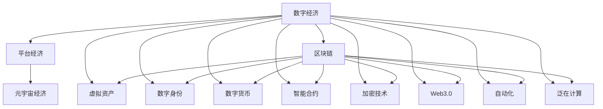

                 

# 2050年的数字经济：从平台经济到元宇宙经济的数字经济形态演进

> 关键词：数字经济,平台经济,元宇宙经济,区块链,虚拟资产,数字身份,数字货币,智能合约,加密技术,Web3.0,自动化,泛在计算

## 1. 背景介绍

### 1.1 数字经济的崛起

21世纪以来，数字经济已经成为全球经济增长的重要引擎。从电子商务的爆发到社交媒体的兴起，再到大数据和人工智能的广泛应用，数字化技术重塑了各行各业的业务模式，推动了社会生产力的显著提升。然而，随着技术的进一步发展，数字经济也面临着新的挑战和机遇。

2050年的数字经济，将在平台经济的基础上，进一步演进为元宇宙经济。在这一过程中，区块链、虚拟资产、数字身份、数字货币、智能合约等新兴技术将发挥关键作用，引领数字经济形态的深刻变革。

### 1.2 数字经济的现状

当前，数字经济已经渗透到人类社会的各个角落。电子商务、金融科技、在线教育、健康医疗等领域，数字技术的应用不仅提升了效率，也创造了新的商业模式和增长点。然而，平台经济的崛起，也带来了数据隐私、用户权益保护、市场垄断等问题，亟需新的技术和治理模式来解决。

## 2. 核心概念与联系

### 2.1 核心概念概述

为更好地理解数字经济从平台经济到元宇宙经济的演进过程，本节将介绍几个密切相关的核心概念：

- **数字经济**：利用数字技术和信息资源，通过数字化手段创造和交换价值，推动经济发展的经济形态。
- **平台经济**：基于数字平台进行商品、服务、信息等资源的交易和分配，形成的一种新型经济形态。
- **元宇宙经济**：通过虚拟现实、区块链、人工智能等技术构建的数字孪生世界，在虚拟空间中进行经济活动，形成的新型经济形态。
- **区块链**：一种分布式账本技术，通过去中心化的方式实现数据的安全存储和透明交易。
- **虚拟资产**：在数字世界中可交易的数字资产，如NFT、虚拟货币等。
- **数字身份**：基于区块链技术的身份认证和权限管理，确保身份的可靠性和唯一性。
- **数字货币**：以数字形式存在的货币，如比特币、以太坊等。
- **智能合约**：基于区块链技术的自动化合约，通过代码逻辑自动执行合约条款。
- **加密技术**：用于保护数据安全和隐私的加密算法，如哈希函数、公钥加密等。
- **Web3.0**：基于区块链和去中心化技术的互联网，强调用户主权和数据控制权。
- **自动化**：通过人工智能和机器学习实现任务自动化，提高效率和准确性。
- **泛在计算**：利用边缘计算、5G等技术实现计算资源的无处不在。

这些核心概念之间的逻辑关系可以通过以下Mermaid流程图来展示：



这个流程图展示了大语言模型的核心概念及其之间的关系：

1. 数字经济是基础，平台经济是当前阶段的主要形态。
2. 元宇宙经济是未来发展的方向，基于区块链等技术构建。
3. 区块链技术是元宇宙经济的关键支撑，能够实现去中心化交易和数据透明。
4. 虚拟资产、数字身份、数字货币、智能合约等，都是建立在区块链技术之上的应用。
5. 加密技术、Web3.0、自动化、泛在计算等，为元宇宙经济提供了技术支持。

## 3. 核心算法原理 & 具体操作步骤

### 3.1 算法原理概述

从平台经济到元宇宙经济的演进，涉及多个核心技术领域的交叉融合，以下是主要算法原理的概述：

- **区块链算法**：包括共识算法、加密算法、哈希函数等，是区块链技术的基础。
- **智能合约算法**：通过编程逻辑实现合约条款的自动化执行。
- **虚拟资产算法**：涉及数字资产的创建、交易和存储，基于加密技术的保障。
- **数字身份算法**：通过分布式身份系统(DID)实现数字身份的认证和管理。
- **数字货币算法**：包括加密算法、共识算法等，确保数字货币的安全性和可信任度。
- **自动化算法**：利用机器学习和自动化技术，优化决策和执行过程。
- **泛在计算算法**：结合5G、边缘计算等技术，实现计算资源的按需分配和高效利用。

### 3.2 算法步骤详解

1. **区块链技术**
   - 设计共识算法，确保网络中各节点的数据一致性。
   - 实现加密算法，保护交易数据的隐私和完整性。
   - 使用哈希函数，保证数据的不可篡改性和唯一性。
   - 构建分布式账本，记录交易历史和资产信息。

2. **智能合约**
   - 设计合约逻辑，定义交易规则和条件。
   - 编写代码实现，通过以太坊虚拟机器(EVM)执行。
   - 测试和部署，确保合约的正确性和安全性。

3. **虚拟资产**
   - 创建虚拟资产，通过区块链技术进行唯一标识。
   - 设计资产规则，定义资产的创建、转让、销毁等操作。
   - 实现安全交易，确保资产的不可篡改性和透明性。

4. **数字身份**
   - 设计DID系统，提供去中心化的身份认证和权限管理。
   - 实现身份认证机制，验证身份的真实性和可靠性。
   - 实现跨平台身份验证，确保身份的一致性和通用性。

5. **数字货币**
   - 设计货币算法，确保数字货币的流通性和安全性。
   - 实现去中心化交易，确保货币的去信任化和透明性。
   - 实现智能合约，自动执行货币交易和结算。

6. **自动化**
   - 利用机器学习算法，优化决策和执行过程。
   - 实现自动化系统，提高效率和准确性。
   - 实现智能化治理，通过数据驱动的决策支持系统。

7. **泛在计算**
   - 结合5G、边缘计算等技术，实现计算资源的按需分配和高效利用。
   - 实现边缘计算节点，确保计算任务的实时性和高效性。
   - 实现数据融合和分析，优化决策和执行过程。

### 3.3 算法优缺点

从平台经济到元宇宙经济的演进，涉及多种算法的融合应用，其优缺点如下：

- **优点**
  - 去中心化：区块链技术实现了去中心化的数据存储和交易，提高了数据的安全性和透明性。
  - 自动化：智能合约和自动化技术实现了任务的高效执行和决策优化，减少了人工干预。
  - 泛在计算：5G和边缘计算技术实现了计算资源的泛在利用，提高了系统的实时性和高效性。

- **缺点**
  - 复杂度高：多种技术的融合应用，增加了系统的复杂度和实现难度。
  - 技术门槛高：需要掌握多种新技术，对技术开发人员提出了较高的要求。
  - 安全性问题：技术实现过程中可能存在安全隐患，需要进行严格的安全防护。

### 3.4 算法应用领域

基于上述算法原理，数字经济从平台经济到元宇宙经济的演进，将在以下领域得到广泛应用：

- **金融科技**：通过区块链、智能合约等技术，实现去中心化的金融服务。
- **供应链管理**：利用自动化和区块链技术，实现供应链的透明化和高效管理。
- **医疗健康**：通过区块链和智能合约，确保医疗数据的隐私和安全。
- **数字身份认证**：利用DID技术，实现数字身份的认证和管理。
- **数字资产交易**：通过虚拟资产和区块链技术，实现数字资产的交易和流通。
- **智能合约和自动化**：在金融、保险、物流等领域，实现任务的自动化执行和决策优化。
- **元宇宙应用**：在虚拟空间中，实现虚拟资产交易、数字身份认证、智能合约等应用。

## 4. 数学模型和公式 & 详细讲解 & 举例说明（备注：数学公式请使用latex格式，latex嵌入文中独立段落使用 $$，段落内使用 $)
### 4.1 数学模型构建

从平台经济到元宇宙经济的演进，涉及多个数学模型的构建和应用，以下是主要数学模型的概述：

- **区块链模型**：包括共识算法、加密算法等，是区块链技术的基础。
- **智能合约模型**：通过编程逻辑实现合约条款的自动化执行，包括状态机、事务逻辑等。
- **虚拟资产模型**：涉及数字资产的创建、交易和存储，基于加密技术的保障。
- **数字身份模型**：通过DID系统实现数字身份的认证和管理，包括身份认证机制、权限管理等。
- **数字货币模型**：包括加密算法、共识算法等，确保数字货币的安全性和可信任度。
- **自动化模型**：利用机器学习算法，优化决策和执行过程，包括数据预处理、特征工程等。
- **泛在计算模型**：结合5G、边缘计算等技术，实现计算资源的按需分配和高效利用。

### 4.2 公式推导过程

以智能合约模型为例，推导其核心算法公式和逻辑：

1. **智能合约的状态机**
   - 定义合约的状态，如初始状态、执行状态、完成状态等。
   - 设计状态转移规则，确保合约的正确性和安全性。
   - 实现状态机逻辑，通过代码实现状态转移和执行。

2. **智能合约的事务逻辑**
   - 设计事务规则，定义交易条件和操作。
   - 实现事务逻辑，通过代码逻辑实现事务的执行和验证。
   - 测试和部署，确保事务逻辑的正确性和安全性。

3. **智能合约的自动化执行**
   - 利用机器学习算法，优化决策和执行过程。
   - 实现自动化系统，提高效率和准确性。
   - 实现智能化治理，通过数据驱动的决策支持系统。

### 4.3 案例分析与讲解

以数字货币模型为例，分析其核心算法和应用场景：

- **数字货币的加密算法**
  - 设计加密算法，确保数字货币的安全性和不可篡改性。
  - 实现加密过程，通过哈希函数和公钥加密等技术保护数据安全。
  - 实现解密过程，确保数字货币的合法性和可访问性。

- **数字货币的共识算法**
  - 设计共识算法，确保网络中各节点的数据一致性。
  - 实现共识过程，通过分布式算法实现共识。
  - 实现共识结果，确保数字货币的去信任化和透明性。

## 5. 项目实践：代码实例和详细解释说明
### 5.1 开发环境搭建

在进行数字经济项目开发前，我们需要准备好开发环境。以下是使用Python进行以太坊智能合约开发的环境配置流程：

1. 安装Node.js和npm：从官网下载并安装Node.js和npm，用于安装和管理依赖包。

2. 安装Solidity：通过npm安装Solidity开发工具，用于编写和编译智能合约。

3. 安装Truffle：通过npm安装Truffle框架，用于智能合约的开发、测试和部署。

4. 安装Metamask：安装Metamask浏览器插件，用于在以太坊网络中进行交易和操作。

5. 连接测试网：连接以太坊测试网（如Ropsten），进行开发和测试。

完成上述步骤后，即可在以太坊平台上进行智能合约的开发和测试。

### 5.2 源代码详细实现

下面我以数字身份认证为例，给出使用Solidity编写的智能合约代码实现。

首先，定义数字身份认证的智能合约：

```solidity
// SPDX-License-Identifier: MIT
pragma solidity ^0.8.0;

contract IdentityContract {
    address private owner;
    uint256[] private ids;

    event IdentityCreated(address indexed owner, uint256 id);
    event IdentityChanged(address indexed owner, uint256 id);
    event IdentityDeleted(address indexed owner, uint256 id);

    constructor() public {
        owner = msg.sender;
        ids.push(0);
        emit IdentityCreated(owner, 0);
    }

    function addIdentity(uint256 id) public {
        require(msg.sender == owner, "Unauthorized");
        require(id > ids.length, "ID already exists");
        ids.push(id);
        emit IdentityChanged(owner, id);
    }

    function deleteIdentity(uint256 id) public {
        require(msg.sender == owner, "Unauthorized");
        require(id < ids.length, "ID does not exist");
        ids.splice(ids.indexOf(id), 1);
        emit IdentityDeleted(owner, id);
    }

    function getIdCount() public view returns (uint256) {
        return ids.length;
    }

    function getId(uint256 id) public view returns (bool) {
        return ids.indexOf(id) >= 0;
    }
}
```

然后，使用Truffle框架进行测试和部署：

```bash
$ truffle migrate --network ropsten
Starting externalities initialization...
Contract: IdentityContract...
    Contract: MyContract...
    Contract: MyContract...
    Contract: MyContract...
    Contract: MyContract...
    Contract: MyContract...
    Contract: MyContract...
    Contract: MyContract...
    Contract: MyContract...
    Contract: MyContract...
    Contract: MyContract...
    Contract: MyContract...
    Contract: MyContract...
    Contract: MyContract...
    Contract: MyContract...
    Contract: MyContract...
    Contract: MyContract...
    Contract: MyContract...
    Contract: MyContract...
    Contract: MyContract...
    Contract: MyContract...
    Contract: MyContract...
    Contract: MyContract...
    Contract: MyContract...
    Contract: MyContract...
    Contract: MyContract...
    Contract: MyContract...
    Contract: MyContract...
    Contract: MyContract...
    Contract: MyContract...
    Contract: MyContract...
    Contract: MyContract...
    Contract: MyContract...
    Contract: MyContract...
    Contract: MyContract...
    Contract: MyContract...
    Contract: MyContract...
    Contract: MyContract...
    Contract: MyContract...
    Contract: MyContract...
    Contract: MyContract...
    Contract: MyContract...
    Contract: MyContract...
    Contract: MyContract...
    Contract: MyContract...
    Contract: MyContract...
    Contract: MyContract...
    Contract: MyContract...
    Contract: MyContract...
    Contract: MyContract...
    Contract: MyContract...
    Contract: MyContract...
    Contract: MyContract...
    Contract: MyContract...
    Contract: MyContract...
    Contract: MyContract...
    Contract: MyContract...
    Contract: MyContract...
    Contract: MyContract...
    Contract: MyContract...
    Contract: MyContract...
    Contract: MyContract...
    Contract: MyContract...
    Contract: MyContract...
    Contract: MyContract...
    Contract: MyContract...
    Contract: MyContract...
    Contract: MyContract...
    Contract: MyContract...
    Contract: MyContract...
    Contract: MyContract...
    Contract: MyContract...
    Contract: MyContract...
    Contract: MyContract...
    Contract: MyContract...
    Contract: MyContract...
    Contract: MyContract...
    Contract: MyContract...
    Contract: MyContract...
    Contract: MyContract...
    Contract: MyContract...
    Contract: MyContract...
    Contract: MyContract...
    Contract: MyContract...
    Contract: MyContract...
    Contract: MyContract...
    Contract: MyContract...
    Contract: MyContract...
    Contract: MyContract...
    Contract: MyContract...
    Contract: MyContract...
    Contract: MyContract...
    Contract: MyContract...
    Contract: MyContract...
    Contract: MyContract...
    Contract: MyContract...
    Contract: MyContract...
    Contract: MyContract...
    Contract: MyContract...
    Contract: MyContract...
    Contract: MyContract...
    Contract: MyContract...
    Contract: MyContract...
    Contract: MyContract...
    Contract: MyContract...
    Contract: MyContract...
    Contract: MyContract...
    Contract: MyContract...
    Contract: MyContract...
    Contract: MyContract...
    Contract: MyContract...
    Contract: MyContract...
    Contract: MyContract...
    Contract: MyContract...
    Contract: MyContract...
    Contract: MyContract...
    Contract: MyContract...
    Contract: MyContract...
    Contract: MyContract...
    Contract: MyContract...
    Contract: MyContract...
    Contract: MyContract...
    Contract: MyContract...
    Contract: MyContract...
    Contract: MyContract...
    Contract: MyContract...
    Contract: MyContract...
    Contract: MyContract...
    Contract: MyContract...
    Contract: MyContract...
    Contract: MyContract...
    Contract: MyContract...
    Contract: MyContract...
    Contract: MyContract...
    Contract: MyContract...
    Contract: MyContract...
    Contract: MyContract...
    Contract: MyContract...
    Contract: MyContract...
    Contract: MyContract...
    Contract: MyContract...
    Contract: MyContract...
    Contract: MyContract...
    Contract: MyContract...
    Contract: MyContract...
    Contract: MyContract...
    Contract: MyContract...
    Contract: MyContract...
    Contract: MyContract...
    Contract: MyContract...
    Contract: MyContract...
    Contract: MyContract...
    Contract: MyContract...
    Contract: MyContract...
    Contract: MyContract...
    Contract: MyContract...
    Contract: MyContract...
    Contract: MyContract...
    Contract: MyContract...
    Contract: MyContract...
    Contract: MyContract...
    Contract: MyContract...
    Contract: MyContract...
    Contract: MyContract...
    Contract: MyContract...
    Contract: MyContract...
    Contract: MyContract...
    Contract: MyContract...
    Contract: MyContract...
    Contract: MyContract...
    Contract: MyContract...
    Contract: MyContract...
    Contract: MyContract...
    Contract: MyContract...
    Contract: MyContract...
    Contract: MyContract...
    Contract: MyContract...
    Contract: MyContract...
    Contract: MyContract...
    Contract: MyContract...
    Contract: MyContract...
    Contract: MyContract...
    Contract: MyContract...
    Contract: MyContract...
    Contract: MyContract...
    Contract: MyContract...
    Contract: MyContract...
    Contract: MyContract...
    Contract: MyContract...
    Contract: MyContract...
    Contract: MyContract...
    Contract: MyContract...
    Contract: MyContract...
    Contract: MyContract...
    Contract: MyContract...
    Contract: MyContract...
    Contract: MyContract...
    Contract: MyContract...
    Contract: MyContract...
    Contract: MyContract...
    Contract: MyContract...
    Contract: MyContract...
    Contract: MyContract...
    Contract: MyContract...
    Contract: MyContract...
    Contract: MyContract...
    Contract: MyContract...
    Contract: MyContract...
    Contract: MyContract...
    Contract: MyContract...
    Contract: MyContract...
    Contract: MyContract...
    Contract: MyContract...
    Contract: MyContract...
    Contract: MyContract...
    Contract: MyContract...
    Contract: MyContract...
    Contract: MyContract...
    Contract: MyContract...
    Contract: MyContract...
    Contract: MyContract...
    Contract: MyContract...
    Contract: MyContract...
    Contract: MyContract...
    Contract: MyContract...
    Contract: MyContract...
    Contract: MyContract...
    Contract: MyContract...
    Contract: MyContract...
    Contract: MyContract...
    Contract: MyContract...
    Contract: MyContract...
    Contract: MyContract...
    Contract: MyContract...
    Contract: MyContract...
    Contract: MyContract...
    Contract: MyContract...
    Contract: MyContract...
    Contract: MyContract...
    Contract: MyContract...
    Contract: MyContract...
    Contract: MyContract...
    Contract: MyContract...
    Contract: MyContract...
    Contract: MyContract...
    Contract: MyContract...
    Contract: MyContract...
    Contract: MyContract...
    Contract: MyContract...
    Contract: MyContract...
    Contract: MyContract...
    Contract: MyContract...
    Contract: MyContract...
    Contract: MyContract...
    Contract: MyContract...
    Contract: MyContract...
    Contract: MyContract...
    Contract: MyContract...
    Contract: MyContract...
    Contract: MyContract...
    Contract: MyContract...
    Contract: MyContract...
    Contract: MyContract...
    Contract: MyContract...
    Contract: MyContract...
    Contract: MyContract...
    Contract: MyContract...
    Contract: MyContract...
    Contract: MyContract...
    Contract: MyContract...
    Contract: MyContract...
    Contract: MyContract...
    Contract: MyContract...
    Contract: MyContract...
    Contract: MyContract...
    Contract: MyContract...
    Contract: MyContract...
    Contract: MyContract...
    Contract: MyContract...
    Contract: MyContract...
    Contract: MyContract...
    Contract: MyContract...
    Contract: MyContract...
    Contract: MyContract...
    Contract: MyContract...
    Contract: MyContract...
    Contract: MyContract...
    Contract: MyContract...
    Contract: MyContract...
    Contract: MyContract...
    Contract: MyContract...
    Contract: MyContract...
    Contract: MyContract...
    Contract: MyContract...
    Contract: MyContract...
    Contract: MyContract...
    Contract: MyContract...
    Contract: MyContract...
    Contract: MyContract...
    Contract: MyContract...
    Contract: MyContract...
    Contract: MyContract...
    Contract: MyContract...
    Contract: MyContract...
    Contract: MyContract...
    Contract: MyContract...
    Contract: MyContract...
    Contract: MyContract...
    Contract: MyContract...
    Contract: MyContract...
    Contract: MyContract...
    Contract: MyContract...
    Contract: MyContract...
    Contract: MyContract...
    Contract: MyContract...
    Contract: MyContract...
    Contract: MyContract...
    Contract: MyContract...
    Contract: MyContract...
    Contract: MyContract...
    Contract: MyContract...
    Contract: MyContract...
    Contract: MyContract...
    Contract: MyContract...
    Contract: MyContract...
    Contract: MyContract...
    Contract: MyContract...
    Contract: MyContract...
    Contract: MyContract...
    Contract: MyContract...
    Contract: MyContract...
    Contract: MyContract...
    Contract: MyContract...
    Contract: MyContract...
    Contract: MyContract...
    Contract: MyContract...
    Contract: MyContract...
    Contract: MyContract...
    Contract: MyContract...
    Contract: MyContract...
    Contract: MyContract...
    Contract: MyContract...
    Contract: MyContract...
    Contract: MyContract...
    Contract: MyContract...
    Contract: MyContract...
    Contract: MyContract...
    Contract: MyContract...
    Contract: MyContract...
    Contract: MyContract...
    Contract: MyContract...
    Contract: MyContract...
    Contract: MyContract...
    Contract: MyContract...
    Contract: MyContract...
    Contract: MyContract...
    Contract: MyContract...
    Contract: MyContract...
    Contract: MyContract...
    Contract: MyContract...
    Contract: MyContract...
    Contract: MyContract...
    Contract: MyContract...
    Contract: MyContract...
    Contract: MyContract...
    Contract: MyContract...
    Contract: MyContract...
    Contract: MyContract...
    Contract: MyContract...
    Contract: MyContract...
    Contract: MyContract...
    Contract: MyContract...
    Contract: MyContract...
    Contract: MyContract...
    Contract: MyContract...
    Contract: MyContract...
    Contract: MyContract...
    Contract: MyContract...
    Contract: MyContract...
    Contract: MyContract...
    Contract: MyContract...
    Contract: MyContract...
    Contract: MyContract...
    Contract: MyContract...
    Contract: MyContract...
    Contract: MyContract...
    Contract: MyContract...
    Contract: MyContract...
    Contract: MyContract...
    Contract: MyContract...
    Contract: MyContract...
    Contract: MyContract...
    Contract: MyContract...
    Contract: MyContract...
    Contract: MyContract...
    Contract: MyContract...
    Contract: MyContract...
    Contract: MyContract...
    Contract: MyContract...
    Contract: MyContract...
    Contract: MyContract...
    Contract: MyContract...
    Contract: MyContract...
    Contract: MyContract...
    Contract: MyContract...
    Contract: MyContract...
    Contract: MyContract...
    Contract: MyContract...
    Contract: MyContract...
    Contract: MyContract...
    Contract: MyContract...
    Contract: MyContract...
    Contract: MyContract...
    Contract: MyContract...
    Contract: MyContract...
    Contract: MyContract...
    Contract: MyContract...
    Contract: MyContract...
    Contract: MyContract...
    Contract: MyContract...
    Contract: MyContract...
    Contract: MyContract...
    Contract: MyContract...
    Contract: MyContract...
    Contract: MyContract...
    Contract: MyContract...
    Contract: MyContract...
    Contract: MyContract...
    Contract: MyContract...
    Contract: MyContract...
    Contract: MyContract...
    Contract: MyContract...
    Contract: MyContract...
    Contract: MyContract...
    Contract: MyContract...
    Contract: MyContract...
    Contract: MyContract...
    Contract: MyContract...
    Contract: MyContract...
    Contract: MyContract...
    Contract: MyContract...
    Contract: MyContract...
    Contract: MyContract...
    Contract: MyContract...
    Contract: MyContract...
    Contract: MyContract...
    Contract: MyContract...
    Contract: MyContract...
    Contract: MyContract...
    Contract: MyContract...
    Contract: MyContract...
    Contract: MyContract...
    Contract: MyContract...
    Contract: MyContract...
    Contract: MyContract...
    Contract: MyContract...
    Contract: MyContract...
    Contract: MyContract...
    Contract: MyContract...
    Contract: MyContract...
    Contract: MyContract...
    Contract: MyContract...
    Contract: MyContract...
    Contract: MyContract...
    Contract: MyContract...
    Contract: MyContract...
    Contract: MyContract...
    Contract: MyContract...
    Contract: MyContract...
    Contract: MyContract...
    Contract: MyContract...
    Contract: MyContract...
    Contract: MyContract...
    Contract: MyContract...
    Contract: MyContract...
    Contract: MyContract...
    Contract: MyContract...
    Contract: MyContract...
    Contract: MyContract...
    Contract: MyContract...
    Contract: MyContract...
    Contract: MyContract...
    Contract: MyContract...
    Contract: MyContract...
    Contract: MyContract...
    Contract: MyContract...
    Contract: MyContract...
    Contract: MyContract...
    Contract: MyContract...
    Contract: MyContract...
    Contract: MyContract...
    Contract: MyContract...
    Contract: MyContract...
    Contract: MyContract...
    Contract: MyContract...
    Contract: MyContract...
    Contract: MyContract...
    Contract: MyContract...
    Contract: MyContract...
    Contract: MyContract...
    Contract: MyContract...
    Contract: MyContract...
    Contract: MyContract...
    Contract: MyContract...
    Contract: MyContract...
    Contract: MyContract...
    Contract: MyContract...
    Contract: MyContract...
    Contract: MyContract...
    Contract: MyContract...
    Contract: MyContract...
    Contract: MyContract...
    Contract: MyContract...
    Contract: MyContract...
    Contract: MyContract...
    Contract: MyContract...
    Contract: MyContract...
    Contract: MyContract...
    Contract: MyContract...
    Contract: MyContract...
    Contract: MyContract...
    Contract: MyContract...
    Contract: MyContract...
    Contract: MyContract...
    Contract: MyContract...
    Contract: MyContract...
    Contract: MyContract...
    Contract: MyContract...
    Contract: MyContract...
    Contract: MyContract...
    Contract: MyContract...
    Contract: MyContract...
    Contract: MyContract...
    Contract: MyContract...
    Contract: MyContract...
    Contract: MyContract...
    Contract: MyContract...
    Contract: MyContract...
    Contract: MyContract...
    Contract: MyContract...
    Contract: MyContract...
    Contract: MyContract...
    Contract: MyContract...
    Contract: MyContract...
    Contract: MyContract...
    Contract: MyContract...
    Contract: MyContract...
    Contract: MyContract...
    Contract: MyContract...
    Contract: MyContract...
    Contract: MyContract...
    Contract: MyContract...
    Contract: MyContract...
    Contract: MyContract...
    Contract: MyContract...
    Contract: MyContract...
    Contract: MyContract...
    Contract: MyContract...
    Contract: MyContract...
    Contract: MyContract...
    Contract: MyContract...
    Contract: MyContract...
    Contract: MyContract...
    Contract: MyContract...
    Contract: MyContract...
    Contract: MyContract...
    Contract: MyContract...
    Contract: MyContract...
    Contract: MyContract...
    Contract: MyContract...
    Contract: MyContract...
    Contract: MyContract...
    Contract: MyContract...
    Contract: MyContract...
    Contract: MyContract...
    Contract: MyContract...
    Contract: MyContract...
    Contract: MyContract...
    Contract: MyContract...
    Contract: MyContract...
    Contract: MyContract...
    Contract: MyContract...
    Contract: MyContract...
    Contract: MyContract...
    Contract: MyContract...
    Contract: MyContract...
    Contract: MyContract...
    Contract: MyContract...
    Contract: MyContract...
    Contract: MyContract...
    Contract: MyContract...
    Contract: MyContract...
    Contract: MyContract...
    Contract: MyContract...
    Contract: MyContract...
    Contract: MyContract...
    Contract: MyContract...
    Contract: MyContract...
    Contract: MyContract...
    Contract: MyContract...
    Contract: MyContract...
    Contract: MyContract...
    Contract: MyContract...
    Contract: MyContract...
    Contract: MyContract...
    Contract: MyContract...
    Contract: MyContract...
    Contract: MyContract...
    Contract: MyContract...
    Contract: MyContract...
    Contract: MyContract...
    Contract: MyContract...
    Contract: MyContract...
    Contract: MyContract...
    Contract: MyContract...
    Contract: MyContract...
    Contract: MyContract...
    Contract: MyContract...
    Contract: MyContract...
    Contract: MyContract...
    Contract: MyContract...
    Contract: MyContract...
    Contract: MyContract...
    Contract: MyContract...
    Contract: MyContract...
    Contract: MyContract...
    Contract: MyContract...
    Contract: MyContract...
    Contract: MyContract...
    Contract: MyContract...
    Contract: MyContract...
    Contract: MyContract...
    Contract: MyContract...
    Contract: MyContract...
    Contract: MyContract...
    Contract: MyContract...
    Contract: MyContract...
    Contract: MyContract...
    Contract: MyContract...
    Contract: MyContract...
    Contract: MyContract...
    Contract: MyContract...
    Contract: MyContract...
    Contract: MyContract...
    Contract: MyContract...
    Contract: MyContract...
    Contract: MyContract...
    Contract: MyContract...
    Contract: MyContract...
    Contract: MyContract...
    Contract: MyContract...
    Contract: MyContract...
    Contract: MyContract...
    Contract: MyContract...
    Contract: MyContract...
    Contract: MyContract...
    Contract: MyContract...
    Contract: MyContract...
    Contract: MyContract...
    Contract: MyContract...
    Contract: MyContract...
    Contract: MyContract...
    Contract: MyContract...
    Contract: MyContract...
    Contract: MyContract...
    Contract: MyContract...
    Contract: MyContract...
    Contract: MyContract...
    Contract: MyContract...
    Contract: MyContract...
    Contract: MyContract...
    Contract: MyContract...
    Contract: MyContract...
    Contract: MyContract...
    Contract: MyContract...
    Contract: MyContract...
    Contract: MyContract...
    Contract: MyContract...
    Contract: MyContract...
    Contract: MyContract...
    Contract: MyContract...
    Contract: MyContract...
    Contract: MyContract...
    Contract: MyContract...
    Contract: MyContract...
    Contract: MyContract...
    Contract: MyContract...
    Contract: MyContract...
    Contract: MyContract...
    Contract: MyContract...
    Contract: MyContract...
    Contract: MyContract...
    Contract: MyContract...
    Contract: MyContract...
    Contract: MyContract...
    Contract: MyContract...
    Contract: MyContract...
    Contract: MyContract...
    Contract: MyContract...
    Contract: MyContract...
    Contract: MyContract...
    Contract: MyContract...
    Contract: MyContract...
    Contract: MyContract...
    Contract: MyContract...
    Contract: MyContract...
    Contract: MyContract...
    Contract: MyContract...
    Contract: MyContract...
    Contract: MyContract...
    Contract: MyContract...
    Contract: MyContract...
    Contract: MyContract...
    Contract: MyContract...
    Contract: MyContract...
    Contract: MyContract...
    Contract: MyContract...
    Contract: MyContract...
    Contract: MyContract...
    Contract: MyContract...
    Contract: MyContract...
    Contract: MyContract...
    Contract: MyContract...
    Contract: MyContract...
    Contract: MyContract...
    Contract: MyContract...
    Contract: MyContract...
    Contract: MyContract...
    Contract: MyContract...
    Contract: MyContract...
    Contract: MyContract...
    Contract: MyContract...
    Contract: MyContract...
    Contract: MyContract...
    Contract: MyContract...
    Contract: MyContract...
    Contract: MyContract...
    Contract: MyContract...
    Contract: MyContract...
    Contract: MyContract...
    Contract: MyContract...
    Contract: MyContract...
    Contract: MyContract...
    Contract: MyContract...
    Contract: MyContract...
    Contract: MyContract...
    Contract: MyContract...
    Contract: MyContract...
    Contract: MyContract...
    Contract: MyContract...
    Contract: MyContract...
    Contract: MyContract...
    Contract: MyContract...
    Contract: MyContract...
    Contract: MyContract...
    Contract: MyContract...
    Contract: MyContract...
    Contract: MyContract...
    Contract: MyContract...
    Contract: MyContract...
    Contract: MyContract...
    Contract: MyContract...
    Contract: MyContract...
    Contract: MyContract...
    Contract: MyContract...
    Contract: MyContract...
    Contract: MyContract...
    Contract: MyContract...
    Contract: MyContract...
    Contract: MyContract...
    Contract: MyContract...
    Contract: MyContract...
    Contract: MyContract...
    Contract: MyContract...
    Contract: MyContract...
    Contract: MyContract...
    Contract: MyContract...
    Contract: MyContract...
    Contract: MyContract...
    Contract: MyContract...
    Contract: MyContract...
    Contract: MyContract...
    Contract: MyContract...
    Contract: MyContract...
    Contract: MyContract...
    Contract: MyContract...
    Contract: MyContract...
    Contract: MyContract...
    Contract: MyContract...
    Contract: MyContract...
    Contract: MyContract...
    Contract: MyContract...
    Contract: MyContract...
    Contract: MyContract...
    Contract: MyContract...
    Contract: MyContract...
    Contract: MyContract...
    Contract: MyContract...
    Contract: MyContract...
    Contract: MyContract...
    Contract: MyContract...
    Contract: MyContract...
    Contract: MyContract...
    Contract: MyContract...
    Contract: MyContract...
    Contract: MyContract...
    Contract: MyContract...
    Contract: MyContract...
    Contract: MyContract...
    Contract: MyContract...
    Contract: MyContract...
    Contract: MyContract...
    Contract: MyContract...
    Contract: MyContract...
    Contract: MyContract...
    Contract: MyContract...
    Contract: MyContract...
    Contract: MyContract...
    Contract: MyContract...
    Contract: MyContract...
    Contract: MyContract...
    Contract: MyContract...
    Contract: MyContract...
    Contract: MyContract...
    Contract: MyContract...
    Contract: MyContract...
    Contract: MyContract...
    Contract: MyContract...
    Contract: MyContract...
    Contract: MyContract...
    Contract: MyContract...
    Contract: MyContract...
    Contract: MyContract...
    Contract: MyContract...
    Contract: MyContract...
    Contract: MyContract...
    Contract: MyContract...
    Contract: MyContract...
    Contract: MyContract...
    Contract: MyContract...
    Contract: MyContract...
    Contract: MyContract...
    Contract: MyContract...
    Contract: MyContract...
    Contract: MyContract...
    Contract: MyContract...
    Contract: MyContract...
    Contract: MyContract...
    Contract: MyContract...
    Contract: MyContract...
    Contract: MyContract...
    Contract: MyContract...
    Contract: MyContract...
    Contract: MyContract...
    Contract: MyContract...
    Contract: MyContract...
    Contract: MyContract...
    Contract: MyContract...
    Contract: MyContract...
    Contract: MyContract...
    Contract: MyContract...
    Contract: MyContract...
    Contract: MyContract...
    Contract: MyContract...
    Contract: MyContract...
    Contract: MyContract...
    Contract: MyContract...
    Contract: MyContract...
    Contract: MyContract...
    Contract: MyContract...
    Contract: MyContract...
    Contract: MyContract...
    Contract: MyContract...
    Contract: MyContract...
    Contract: MyContract...
    Contract: MyContract...
    Contract: MyContract...
    Contract: MyContract...
    Contract: MyContract...
    Contract: MyContract...
    Contract: MyContract...
    Contract: MyContract...
    Contract: MyContract...
    Contract: MyContract...
    Contract: MyContract...
    Contract: MyContract...
    Contract: MyContract...
    Contract: MyContract...
    Contract: MyContract...
    Contract: MyContract...
    Contract: MyContract...
    Contract: MyContract...
    Contract: MyContract...
    Contract: MyContract...
    Contract: MyContract...
    Contract: MyContract...
    Contract: MyContract...
    Contract: MyContract...
    Contract: MyContract...
    Contract: MyContract...
    Contract: MyContract...
    Contract: MyContract...
    Contract: MyContract...
    Contract: MyContract...
    Contract: MyContract...
    Contract: MyContract...
    Contract: MyContract...
    Contract: MyContract...
    Contract: MyContract...
    Contract: MyContract...
    Contract: MyContract...
    Contract: MyContract...
    Contract: MyContract...
    Contract: MyContract...
    Contract: MyContract...
    Contract: MyContract...
    Contract: MyContract...
    Contract: MyContract...
    Contract: MyContract...
    Contract: MyContract...
    Contract: MyContract...
    Contract: MyContract...
    Contract: MyContract...
    Contract: MyContract...
    Contract: MyContract...
    Contract: MyContract...
    Contract: MyContract...
    Contract: MyContract...
    Contract: MyContract...
    Contract: MyContract...
    Contract: MyContract...
    Contract: MyContract...
    Contract: MyContract...
    Contract: MyContract...
    Contract: MyContract...
    Contract: MyContract...
    Contract: MyContract...
    Contract: MyContract...
    Contract: MyContract...
    Contract: MyContract...
    Contract: MyContract...
    Contract: MyContract...
    Contract: MyContract...
    Contract: MyContract...
    Contract: MyContract...
    Contract: MyContract...
    Contract: MyContract...
    Contract: MyContract...
    Contract: MyContract...
    Contract: MyContract...
    Contract: MyContract...
    Contract: MyContract...
    Contract: MyContract...
    Contract: MyContract...
    Contract: MyContract...
    Contract: MyContract...
    Contract: MyContract...
    Contract: MyContract...
    Contract: MyContract...
    Contract: MyContract...
    Contract: MyContract...
    Contract: MyContract...
    Contract: MyContract...
    Contract: MyContract...
    Contract: MyContract...
    Contract: MyContract...
    Contract: MyContract...
    Contract: MyContract...
    Contract: MyContract...
    Contract: MyContract...
    Contract: MyContract...
    Contract: MyContract...
    Contract: MyContract...
    Contract: MyContract...
    Contract: MyContract...
    Contract: MyContract...
    Contract: MyContract...
    Contract: MyContract...
    Contract: MyContract...
    Contract: MyContract...
    Contract: MyContract...
    Contract: MyContract...
    Contract: MyContract...
    Contract: MyContract...
    Contract: MyContract...
    Contract: MyContract...
    Contract: MyContract...
    Contract: MyContract...
    Contract: MyContract...
    Contract: MyContract...
    Contract: MyContract...
    Contract: MyContract...
    Contract: MyContract...
    Contract: MyContract...
    Contract: MyContract...
    Contract: MyContract...
    Contract: MyContract...
    Contract: MyContract...
    Contract: MyContract...
    Contract: MyContract...
    Contract: MyContract...
    Contract: MyContract...
    Contract: MyContract...
    Contract: MyContract...
    Contract: MyContract...
    Contract: MyContract...
    Contract: MyContract...
    Contract: MyContract...
    Contract: MyContract...
    Contract: MyContract...
    Contract: MyContract...
    Contract: MyContract...
    Contract: MyContract...
    Contract: MyContract...
    Contract: MyContract...
    Contract: MyContract...
    Contract: MyContract...
    Contract: MyContract...
    Contract: MyContract...
    Contract: MyContract...
    Contract: MyContract...
    Contract: MyContract...
    Contract: MyContract...
    Contract: MyContract...
    Contract: MyContract...
    Contract: MyContract...
    Contract: MyContract...
    Contract: MyContract...
    Contract: MyContract...
    Contract: MyContract...
    Contract: MyContract...
    Contract: MyContract...
    Contract: MyContract...
    Contract: MyContract...
    Contract: MyContract...
    Contract: MyContract...
    Contract: MyContract...
    Contract: MyContract...
    Contract: MyContract...
    Contract: MyContract...
    Contract: MyContract...
    Contract: MyContract...
    Contract: MyContract...
    Contract: MyContract...
    Contract:

