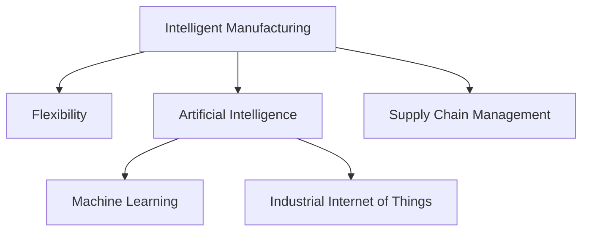

                 

# 2050年的智能制造：从自动化到柔性化的工业革命

> 关键词：智能制造, 自动化, 柔性化, 工业4.0, 人工智能, 机器学习, 工业物联网, 供应链管理

## 1. 背景介绍

### 1.1 问题由来
近年来，制造业在全球经济中的地位不断提升。随着科技的进步，传统制造业正经历着从自动化到智能化的深刻变革。特别是智能制造的兴起，使得生产流程更加高效、灵活，生产效率大幅提升，质量控制更加精准，对环境的负面影响也大幅度降低。

智能制造涉及信息技术的广泛应用，如大数据、物联网、人工智能等。其中，人工智能和机器学习在智能制造中的应用尤为广泛。通过AI技术，工厂可以实现自动化的质量检测、预测性维护、供应链优化和个性化定制等。但随着工业规模的扩大和生产环境的复杂化，现有的自动化系统难以满足新的需求。为应对这些挑战，柔性化智能制造应运而生。

### 1.2 问题核心关键点
柔性化智能制造的核心关键点在于：

- 高度的灵活性和适应性。能够快速响应市场需求的变化，实现多品种、小批量的生产。
- 数据驱动和智能决策。通过大数据分析和智能算法，优化生产流程和资源配置。
- 人机协作和智能调度。提高生产效率和产品质量，降低运营成本。
- 可持续发展和绿色制造。减少资源浪费，提升能源利用效率，降低环境污染。

本文聚焦于基于人工智能的柔性化智能制造，将深入探讨其核心概念和关键技术，同时展望未来发展的趋势和面临的挑战。

## 2. 核心概念与联系

### 2.1 核心概念概述

为更好地理解基于人工智能的柔性化智能制造，本节将介绍几个密切相关的核心概念：

- **智能制造**：利用先进的信息技术手段，实现从产品设计到生产、运营、管理的全生命周期智能化。通过自动化、信息化、数字化等手段，提高生产效率，降低成本，提升产品质量。

- **柔性化生产**：指通过技术手段，使生产系统能够快速响应市场变化，适应不同产品的需求，实现多品种、小批量的高效生产。

- **人工智能**：基于机器学习、深度学习等算法，赋予机器类似人类的学习、推理和决策能力。在智能制造中，AI技术广泛应用于数据分析、故障诊断、预测维护、调度优化等领域。

- **机器学习**：指机器通过学习大量数据，自动发现数据中的规律和模式，从而实现自我优化和智能决策。在智能制造中，机器学习算法被用来优化生产流程、提升产品质量、预测生产异常等。

- **工业物联网**：通过传感器、通信网络等技术，实现设备之间的互联互通，实时采集生产数据，支撑生产调度和管理决策。在智能制造中，IIoT是实现智能化的基础。

- **供应链管理**：通过优化供应链的各个环节，提升原材料采购、生产制造、物流配送等全链条的管理效率，降低运营成本。在智能制造中，AI技术被用来预测需求、优化库存、提升物流效率等。

这些核心概念之间的逻辑关系可以通过以下Mermaid流程图来展示：



这个流程图展示了一个智能制造系统的核心组成及其相互关系：

1. 智能制造作为整个系统的总称，涵盖了自动化、智能化、信息化等多个层面。
2. 柔性化生产是智能制造的重要特点，使其能够快速响应市场需求。
3. 人工智能是智能制造的核心技术，通过机器学习、深度学习等算法实现智能化。
4. 工业物联网提供数据采集和通信基础，支撑智能决策。
5. 供应链管理通过优化各环节，提升全链条效率。

## 3. 核心算法原理 & 具体操作步骤
### 3.1 算法原理概述

基于人工智能的柔性化智能制造，涉及数据采集、数据分析、模型训练、预测决策等多个环节。其核心算法原理基于机器学习，特别是深度学习和强化学习。

在生产过程中，传感器和设备实时采集数据，通过工业物联网技术上传到云端，形成海量数据集。这些数据集经过预处理和清洗，被输入到训练好的模型中进行分析。模型通过学习数据中的规律，自动优化生产流程，预测生产异常，优化供应链管理等。

机器学习模型通常分为监督学习、无监督学习和强化学习三大类。在智能制造中，监督学习常用于预测和分类任务，如需求预测、故障诊断等；无监督学习常用于聚类和降维任务，如设备状态监测、异常检测等；强化学习常用于决策优化任务，如调度优化、过程优化等。

### 3.2 算法步骤详解

基于人工智能的柔性化智能制造主要包括以下几个关键步骤：

**Step 1: 数据采集和预处理**
- 在生产车间布设传感器和监控设备，实时采集生产数据。
- 对采集到的数据进行预处理，包括清洗、归一化、特征工程等，以提高数据质量。

**Step 2: 数据存储和计算**
- 将处理后的数据存储到分布式数据库或数据湖中。
- 利用高性能计算集群进行数据计算和模型训练。

**Step 3: 模型训练**
- 选择合适的机器学习算法和模型，如决策树、随机森林、神经网络等。
- 使用历史数据训练模型，优化模型参数。
- 评估模型性能，进行交叉验证和超参数调优。

**Step 4: 模型部署和应用**
- 将训练好的模型部署到生产环境中。
- 实时接收生产数据，进行预测和决策。
- 定期更新模型，保持模型性能。

**Step 5: 监控和反馈**
- 实时监控模型性能，收集反馈信息。
- 根据反馈信息调整模型参数，优化模型性能。
- 定期进行模型评估，确保系统稳定运行。

### 3.3 算法优缺点

基于人工智能的柔性化智能制造具有以下优点：

1. 高效的生产调度。通过机器学习算法优化生产流程，实现多品种、小批量生产的柔性化。
2. 精准的质量控制。通过AI技术进行质量检测和异常预测，提升产品质量。
3. 降低运营成本。通过自动化和智能化，减少人工干预和资源浪费。
4. 提升供应链效率。通过AI技术进行需求预测和库存优化，降低物流成本。
5. 促进可持续发展。通过数据分析和决策优化，实现资源高效利用和环境保护。

同时，该方法也存在一些局限性：

1. 高昂的技术成本。柔性化智能制造需要大量的硬件设备和软件系统，初期投入较高。
2. 数据质量要求高。数据采集和处理环节需要高精度和高可靠性，数据缺失和噪声会影响模型性能。
3. 模型复杂度高。大规模生产系统的复杂性要求模型具有较强的泛化能力和可解释性。
4. 安全性和隐私保护。在数据采集和存储过程中，需要考虑数据安全和隐私保护问题。

尽管存在这些局限性，但总体而言，基于人工智能的柔性化智能制造方法仍是目前最先进的制造技术范式，能够实现生产效率的最大化，推动工业制造的变革。

### 3.4 算法应用领域

基于人工智能的柔性化智能制造在多个领域中得到广泛应用，具体包括：

1. **智能工厂**：通过智能设备和系统，实现从设计到生产、运营、管理全过程的智能化。如自动化生产线、智能仓储系统等。

2. **预测性维护**：通过机器学习算法预测设备故障，提前进行维护，减少停机时间，降低维护成本。

3. **个性化定制**：利用大数据和机器学习技术，实现个性化设计和生产，提升产品竞争力。

4. **供应链优化**：通过智能算法优化供应链的各个环节，实现高效、灵活的物料管理和库存控制。

5. **智能调度**：通过优化生产计划和调度，实现资源的合理配置，提升生产效率。

6. **质量检测**：通过AI技术进行质量检测和分析，提高产品质量，降低次品率。

除了以上这些典型应用外，柔性化智能制造还将在更多领域得到应用，如智能物流、智能服务、智能设计等，为制造行业带来全新的变革。

## 4. 数学模型和公式 & 详细讲解 & 举例说明

### 4.1 数学模型构建

在基于人工智能的柔性化智能制造中，机器学习模型是核心。常用的机器学习模型包括决策树、随机森林、神经网络等。以下以神经网络为例，介绍其数学模型构建过程。

设输入数据为 $x$，输出标签为 $y$，神经网络模型为 $f_{\theta}(x)$。其中，$f_{\theta}(x)$ 是一个由多个神经元组成的非线性映射，$\theta$ 为模型参数。模型训练的目标是最小化损失函数 $L$，即：

$$
\min_{\theta} L = \sum_{i=1}^n \ell(f_{\theta}(x_i), y_i)
$$

其中 $\ell$ 为损失函数，如均方误差、交叉熵等。

### 4.2 公式推导过程

以最简单的两层神经网络为例，其前向传播和反向传播过程如下：

**前向传播**：
- 输入层：$x = (x_1, x_2, \ldots, x_n)$
- 隐藏层：$z_1 = W_1x + b_1$
- 输出层：$y = W_2z_1 + b_2$

其中 $W_1, b_1, W_2, b_2$ 为神经网络参数，$n$ 为输入层大小。

**反向传播**：
- 输出层损失：$\ell(y, y_{pred})$
- 输出层参数梯度：$\frac{\partial \ell}{\partial z_1} = \frac{\partial \ell}{\partial y} \frac{\partial y}{\partial z_1}$
- 隐藏层参数梯度：$\frac{\partial \ell}{\partial W_1} = \frac{\partial \ell}{\partial z_1} \frac{\partial z_1}{\partial W_1}$
- 权重更新：$W_1 = W_1 - \eta \frac{\partial \ell}{\partial W_1}$
- 激活函数：通常使用ReLU或Sigmoid等非线性激活函数。

通过不断迭代上述过程，神经网络可以逐步优化参数，实现对数据的拟合和预测。

### 4.3 案例分析与讲解

以预测性维护为例，介绍如何构建神经网络模型并进行训练：

**Step 1: 数据采集和预处理**
- 采集设备运行数据，包括温度、振动、电流等信号。
- 对采集到的数据进行归一化、降维等预处理。

**Step 2: 模型构建和训练**
- 构建一个两层神经网络，包含多个神经元。
- 使用历史数据训练模型，优化模型参数。

**Step 3: 模型评估和应用**
- 在测试集上评估模型性能，如准确率、召回率等。
- 实时接收新数据，进行故障预测。

在实际应用中，神经网络模型的构建和训练过程可能非常复杂，需要根据具体问题进行调整。通过不断迭代优化，模型可以逐步提升性能，实现精准的预测性维护。

## 5. 项目实践：代码实例和详细解释说明

### 5.1 开发环境搭建

在进行智能制造项目开发前，我们需要准备好开发环境。以下是使用Python进行TensorFlow和Keras开发的环境配置流程：

1. 安装Anaconda：从官网下载并安装Anaconda，用于创建独立的Python环境。

2. 创建并激活虚拟环境：
```bash
conda create -n pytorch-env python=3.8 
conda activate pytorch-env
```

3. 安装TensorFlow和Keras：
```bash
conda install tensorflow keras -c conda-forge
```

4. 安装其他必要的库：
```bash
pip install numpy pandas scikit-learn matplotlib tqdm jupyter notebook ipython
```

完成上述步骤后，即可在`pytorch-env`环境中开始智能制造项目的开发。

### 5.2 源代码详细实现

下面我们以智能工厂的数据分析项目为例，给出使用TensorFlow和Keras进行智能制造数据分析的PyTorch代码实现。

首先，定义数据处理函数：

```python
import tensorflow as tf
from tensorflow.keras.layers import Dense, Dropout
from tensorflow.keras.models import Sequential

def data_preprocessing(data):
    # 数据归一化
    data = (data - data.mean()) / data.std()
    # 数据划分训练集和测试集
    train_data, test_data = data[:-1000], data[-1000:]
    return train_data, test_data
```

然后，定义模型和优化器：

```python
model = Sequential([
    Dense(64, input_dim=10, activation='relu'),
    Dropout(0.5),
    Dense(1, activation='sigmoid')
])

optimizer = tf.keras.optimizers.Adam(lr=0.001)
```

接着，定义训练和评估函数：

```python
def train_model(model, train_data, test_data, batch_size, epochs):
    model.compile(loss='binary_crossentropy', optimizer=optimizer, metrics=['accuracy'])
    model.fit(train_data, train_data.labels, epochs=epochs, batch_size=batch_size, validation_data=(test_data, test_data.labels))
    test_loss, test_acc = model.evaluate(test_data, test_data.labels)
    print(f'Test accuracy: {test_acc}')
    return model
```

最后，启动训练流程并在测试集上评估：

```python
epochs = 100
batch_size = 32

train_data, test_data = data_preprocessing(data)
model = train_model(model, train_data, test_data, batch_size, epochs)
```

以上就是使用TensorFlow和Keras对智能工厂数据分析进行模型构建和训练的完整代码实现。可以看到，通过Keras的便捷接口，可以非常快速地构建并训练神经网络模型。

### 5.3 代码解读与分析

让我们再详细解读一下关键代码的实现细节：

**data_preprocessing函数**：
- 对输入数据进行归一化处理。
- 将数据划分为训练集和测试集，用于模型训练和评估。

**Sequential模型**：
- 使用Sequential模型，依次添加输入层、隐藏层和输出层。
- 输入层包含64个神经元，使用ReLU激活函数。
- 隐藏层添加Dropout层，防止过拟合。
- 输出层为sigmoid激活函数，用于二分类任务。

**train_model函数**：
- 使用Adam优化器，学习率为0.001。
- 编译模型，设置损失函数和评估指标。
- 在训练集上进行训练，设置迭代轮数和批大小。
- 在测试集上评估模型性能，输出准确率。

**训练流程**：
- 定义总的迭代轮数和批大小，开始循环迭代
- 在训练集上训练模型，输出训练过程中的准确率。
- 在测试集上评估模型性能，输出最终的测试准确率。

可以看到，通过TensorFlow和Keras，智能制造的模型构建和训练过程非常高效和便捷，开发者可以专注于业务逻辑的实现。

当然，工业级的系统实现还需考虑更多因素，如模型的保存和部署、超参数的自动搜索、更灵活的任务适配层等。但核心的数据分析模型基本与此类似。

## 6. 实际应用场景
### 6.1 智能工厂

基于人工智能的柔性化智能制造在智能工厂中的应用非常广泛。智能工厂通过自动化、智能化、数字化手段，实现从设计到生产、运营、管理的全过程智能化。具体应用包括：

- **自动化生产线**：利用工业机器人、自动化设备等，实现生产的自动化和标准化。
- **智能仓储系统**：通过物联网技术实现库存的实时监控和优化，减少人工干预。
- **质量检测**：通过AI技术进行质量检测和分析，提高产品质量，降低次品率。
- **预测性维护**：通过机器学习算法预测设备故障，提前进行维护，减少停机时间，降低维护成本。

智能工厂的构建，不仅能够提高生产效率，降低运营成本，还能提升产品质量和安全性，为制造企业带来巨大的经济效益。

### 6.2 预测性维护

预测性维护是智能制造中的重要应用之一。通过机器学习算法，可以实时监控设备状态，预测设备故障，提前进行维护。预测性维护能够显著减少设备停机时间，降低维护成本，提升生产效率。

以智能工厂中的设备预测性维护为例，其关键步骤如下：

1. **数据采集**：通过传感器实时采集设备运行数据，如温度、振动、电流等信号。
2. **数据预处理**：对采集到的数据进行归一化、降维等预处理。
3. **模型构建和训练**：构建神经网络模型，使用历史数据训练模型，优化模型参数。
4. **模型应用**：实时接收新数据，进行故障预测，提前进行维护。

通过预测性维护，智能制造能够实现设备的高效运行，降低生产成本，提升企业竞争力。

### 6.3 个性化定制

个性化定制是智能制造中的新兴应用，通过大数据和机器学习技术，实现产品的个性化设计和生产。个性化定制能够满足消费者的个性化需求，提升产品竞争力和市场份额。

以智能工厂中的个性化定制为例，其关键步骤如下：

1. **数据采集和处理**：通过问卷、订单等形式，收集消费者的个性化需求数据。
2. **模型构建和训练**：构建神经网络模型，使用历史数据训练模型，优化模型参数。
3. **模型应用**：根据消费者的个性化需求，生成个性化设计方案，进行生产。

通过个性化定制，智能制造能够实现产品的多样化生产，提升消费者满意度和品牌忠诚度，为制造企业带来新的增长点。

### 6.4 未来应用展望

随着人工智能和智能制造技术的不断发展，未来柔性化智能制造将呈现以下几个趋势：

1. **高度的自动化和智能化**。随着工业物联网和5G技术的发展，智能制造将实现更高程度的自动化和智能化，能够实时采集和分析数据，优化生产流程和资源配置。

2. **智能决策和优化**。通过机器学习和强化学习算法，智能制造能够实现更精准的生产决策和优化，提升生产效率和产品质量。

3. **跨领域融合**。智能制造将与其他领域的技术进行更深入的融合，如人工智能、大数据、物联网等，实现更全面、更高效的生产体系。

4. **人机协作**。智能制造将更多地强调人机协作，通过智能算法优化生产调度，提高生产效率，降低人工成本。

5. **可持续发展**。智能制造将更加注重环保和可持续发展，通过数据分析和决策优化，实现资源的高效利用和环境保护。

总之，未来智能制造将更加智能化、柔性化和高效化，推动制造行业的全面变革，为人类带来更多的便利和福祉。

## 7. 工具和资源推荐
### 7.1 学习资源推荐

为了帮助开发者系统掌握智能制造的理论基础和实践技巧，这里推荐一些优质的学习资源：

1. **《智能制造：从自动化到智能化》系列博文**：深入浅出地介绍了智能制造的理论基础和实践案例。
2. **CS224N《深度学习自然语言处理》课程**：斯坦福大学开设的NLP明星课程，涵盖大量NLP领域的前沿技术和实际应用。
3. **《机器学习实战》书籍**：讲解了机器学习的基础知识和实战案例，适合初学者入门。
4. **TensorFlow官方文档**：提供了丰富的机器学习资源和样例代码，是学习TensorFlow的必备资料。
5. **工业物联网（IIoT）开源项目**：如ThingSpeak、IoT platform等，提供了大量的物联网资源和样例代码。

通过对这些资源的学习实践，相信你一定能够快速掌握智能制造的理论基础和实践技巧，并用于解决实际的智能制造问题。

### 7.2 开发工具推荐

高效的开发离不开优秀的工具支持。以下是几款用于智能制造开发的常用工具：

1. **TensorFlow**：由Google主导开发的深度学习框架，提供了丰富的机器学习资源和样例代码，适合大规模工程应用。
2. **Keras**：基于TensorFlow的高级API，提供了便捷的模型构建接口，适合快速原型开发。
3. **PyTorch**：由Facebook主导开发的深度学习框架，提供了灵活的计算图和高效的模型训练功能，适合研究人员和科学家使用。
4. **Jupyter Notebook**：提供了交互式编程环境，适合数据分析和模型训练。
5. **Google Colab**：谷歌推出的在线Jupyter Notebook环境，免费提供GPU/TPU算力，适合快速实验和原型开发。

合理利用这些工具，可以显著提升智能制造开发的效率，加速创新迭代的步伐。

### 7.3 相关论文推荐

智能制造的发展离不开学界的持续研究。以下是几篇奠基性的相关论文，推荐阅读：

1. **《智能制造：实现从自动化到智能化的策略》**：介绍了智能制造的理论基础和应用场景，提出了智能制造的实现策略。
2. **《基于机器学习的预测性维护技术》**：探讨了机器学习在设备故障预测中的应用，提出了多种机器学习算法和模型。
3. **《智能制造中的个性化定制》**：分析了个性化定制的理论基础和实现方法，提出了基于机器学习的个性化定制模型。
4. **《工业物联网中的数据采集和处理技术》**：介绍了工业物联网中的数据采集和处理技术，提出了多种数据预处理和清洗方法。
5. **《智能制造中的智能决策优化》**：探讨了智能决策在智能制造中的应用，提出了基于机器学习的智能决策模型。

这些论文代表了大规模制造技术的发展脉络。通过学习这些前沿成果，可以帮助研究者把握学科前进方向，激发更多的创新灵感。

## 8. 总结：未来发展趋势与挑战

### 8.1 总结

本文对基于人工智能的柔性化智能制造进行了全面系统的介绍。首先阐述了智能制造和柔性化生产的核心概念及其重要意义，明确了柔性化智能制造在工业4.0中的核心地位。其次，从原理到实践，详细讲解了机器学习在智能制造中的应用，包括数据采集、模型构建、训练、预测等环节，给出了智能制造项目的完整代码实现。同时，本文还广泛探讨了智能制造在智能工厂、预测性维护、个性化定制等多个行业领域的应用前景，展示了柔性化智能制造的广阔前景。此外，本文精选了智能制造技术的各类学习资源，力求为读者提供全方位的技术指引。

通过本文的系统梳理，可以看到，基于人工智能的柔性化智能制造正在成为工业制造的重要范式，极大地提升了生产效率，降低了运营成本，推动了制造行业的全面变革。未来，伴随人工智能和智能制造技术的不断演进，柔性化智能制造必将在更多领域得到应用，为人类社会的生产方式带来深远影响。

### 8.2 未来发展趋势

展望未来，柔性化智能制造将呈现以下几个发展趋势：

1. **高度的自动化和智能化**。随着工业物联网和5G技术的发展，智能制造将实现更高程度的自动化和智能化，能够实时采集和分析数据，优化生产流程和资源配置。

2. **智能决策和优化**。通过机器学习和强化学习算法，智能制造能够实现更精准的生产决策和优化，提升生产效率和产品质量。

3. **跨领域融合**。智能制造将与其他领域的技术进行更深入的融合，如人工智能、大数据、物联网等，实现更全面、更高效的生产体系。

4. **人机协作**。智能制造将更多地强调人机协作，通过智能算法优化生产调度，提高生产效率，降低人工成本。

5. **可持续发展**。智能制造将更加注重环保和可持续发展，通过数据分析和决策优化，实现资源的高效利用和环境保护。

以上趋势凸显了柔性化智能制造的广阔前景。这些方向的探索发展，必将进一步提升智能制造系统的性能和应用范围，为制造行业的智能化转型提供坚实的基础。

### 8.3 面临的挑战

尽管柔性化智能制造已经取得了显著的进展，但在迈向更加智能化、普适化应用的过程中，它仍面临诸多挑战：

1. **高昂的技术成本**。柔性化智能制造需要大量的硬件设备和软件系统，初期投入较高。如何降低成本，提高效率，是当前面临的重要问题。

2. **数据质量要求高**。数据采集和处理环节需要高精度和高可靠性，数据缺失和噪声会影响模型性能。如何提升数据质量，是当前亟待解决的问题。

3. **模型复杂度高**。大规模生产系统的复杂性要求模型具有较强的泛化能力和可解释性。如何提高模型的泛化能力，增强模型的可解释性，是当前面临的难题。

4. **安全性和隐私保护**。在数据采集和存储过程中，需要考虑数据安全和隐私保护问题。如何保护数据安全，确保数据隐私，是当前面临的重要挑战。

5. **系统稳定性**。智能制造系统需要高稳定性和高可靠性，避免系统崩溃和数据丢失。如何提升系统的稳定性，是当前面临的重要问题。

6. **伦理和道德**。智能制造系统需要考虑伦理和道德问题，避免出现偏见和歧视。如何确保系统的公正性，是当前面临的重要挑战。

正视柔性化智能制造面临的这些挑战，积极应对并寻求突破，将使智能制造技术更快地迈向成熟。相信随着学界和产业界的共同努力，这些挑战终将一一被克服，柔性化智能制造必将在构建安全、可靠、智能的生产体系中发挥重要作用。

### 8.4 研究展望

面对柔性化智能制造所面临的挑战，未来的研究需要在以下几个方面寻求新的突破：

1. **探索无监督和半监督微调方法**。摆脱对大规模标注数据的依赖，利用自监督学习、主动学习等无监督和半监督范式，最大限度利用非结构化数据，实现更加灵活高效的智能制造。

2. **研究参数高效和计算高效的微调范式**。开发更加参数高效的微调方法，在固定大部分预训练参数的同时，只更新极少量的任务相关参数。同时优化微调模型的计算图，减少前向传播和反向传播的资源消耗，实现更加轻量级、实时性的部署。

3. **融合因果和对比学习范式**。通过引入因果推断和对比学习思想，增强智能制造系统建立稳定因果关系的能力，学习更加普适、鲁棒的语言表征，从而提升系统泛化性和抗干扰能力。

4. **引入更多先验知识**。将符号化的先验知识，如知识图谱、逻辑规则等，与神经网络模型进行巧妙融合，引导智能制造过程学习更准确、合理的语言模型。同时加强不同模态数据的整合，实现视觉、语音等多模态信息与文本信息的协同建模。

5. **结合因果分析和博弈论工具**。将因果分析方法引入智能制造系统，识别出系统决策的关键特征，增强输出解释的因果性和逻辑性。借助博弈论工具刻画人机交互过程，主动探索并规避系统的脆弱点，提高系统稳定性。

6. **纳入伦理道德约束**。在智能制造系统训练目标中引入伦理导向的评估指标，过滤和惩罚有偏见、有害的输出倾向。同时加强人工干预和审核，建立系统行为的监管机制，确保系统行为符合人类价值观和伦理道德。

这些研究方向的探索，必将引领柔性化智能制造技术迈向更高的台阶，为构建安全、可靠、智能的生产体系提供坚实的基础。面向未来，柔性化智能制造技术还需要与其他人工智能技术进行更深入的融合，如知识表示、因果推理、强化学习等，多路径协同发力，共同推动智能制造技术的进步。只有勇于创新、敢于突破，才能不断拓展智能制造技术的边界，让智能制造技术更好地造福人类社会。

## 9. 附录：常见问题与解答

**Q1：智能制造和柔性化生产有什么区别？**

A: 智能制造和柔性化生产是紧密相关的两个概念，但又有其自身的特点。智能制造是通过自动化和智能化技术，实现生产过程的优化和自动化。而柔性化生产是指通过技术手段，使生产系统能够快速响应市场变化，适应不同产品的需求，实现多品种、小批量的高效生产。柔性化生产是智能制造的重要特点，使其能够快速响应市场需求，提升生产效率。

**Q2：智能制造和工业4.0有什么区别？**

A: 智能制造和工业4.0是同一概念的不同表述。工业4.0是德国提出的智能制造概念，强调通过信息技术和智能技术实现生产过程的智能化。而智能制造是指通过自动化和智能化技术，实现生产过程的优化和自动化。智能制造是工业4.0的核心内容之一，强调通过智能化手段提升生产效率和产品质量。

**Q3：智能制造需要哪些核心技术？**

A: 智能制造的核心技术包括自动化技术、信息化技术、数字化技术、机器学习技术、工业物联网技术等。其中，机器学习技术是智能制造的关键，通过机器学习算法优化生产流程，实现预测性维护、质量检测、智能调度等。同时，工业物联网技术提供数据采集和通信基础，支撑智能决策。

**Q4：智能制造对数据质量要求有多高？**

A: 智能制造对数据质量的要求非常高，数据缺失和噪声会影响模型的性能。因此，在数据采集和处理环节需要高精度和高可靠性，确保数据的质量和完整性。同时，数据的清洗和预处理也是非常重要的，需要采用多种方法提升数据质量。

**Q5：智能制造的未来发展方向是什么？**

A: 智能制造的未来发展方向包括高度的自动化和智能化、智能决策和优化、跨领域融合、人机协作、可持续发展等。未来，智能制造将实现更高程度的自动化和智能化，通过工业物联网和5G技术，实现实时采集和分析数据，优化生产流程和资源配置。同时，智能制造将与其他领域的技术进行更深入的融合，如人工智能、大数据、物联网等，实现更全面、更高效的生产体系。

总之，智能制造是实现工业智能化转型的重要手段，具有广阔的发展前景。通过不断创新和优化，智能制造必将在未来引领制造业的全面变革，为人类社会的生产方式带来深远影响。

---

作者：禅与计算机程序设计艺术 / Zen and the Art of Computer Programming

