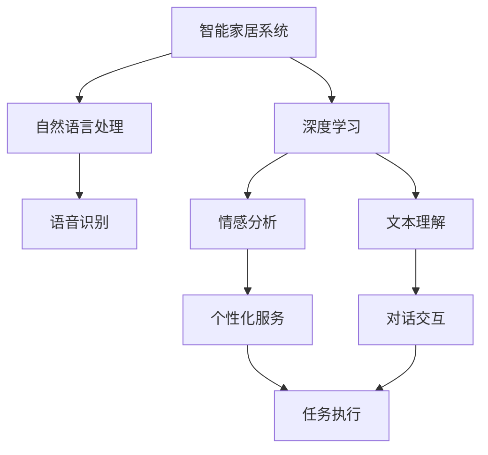

                 

# 2050年的智能家居：从智能音箱到情感陪伴机器人的家庭智能化

## 1. 背景介绍

### 1.1 问题由来
随着人工智能技术的飞速发展，智能家居系统正逐渐成为现代家庭生活的重要组成部分。自1990年代智能音箱的诞生以来，智能家居已经从简单的自动化控制，演进到集成了语音识别、自然语言处理、情感分析、虚拟助手等功能的全面智能化状态。到2050年，随着技术进步和市场需求的变化，智能家居将迎来新的发展阶段。

### 1.2 问题核心关键点
2050年的智能家居系统将不仅仅是一个控制平台，而是将成为家庭数字化、信息化、个性化的集成控制中心，能够全面地满足用户的多元需求。这一系统构建的核心在于将人工智能技术，尤其是深度学习和自然语言处理技术，整合到家庭场景中，实现对家庭生活的全面智能化控制。

### 1.3 问题研究意义
研究2050年的智能家居系统，不仅有助于理解未来家居环境的智能化演变，更能够为当下的智能家居技术创新提供启示。通过掌握2050年的智能家居技术发展趋势，可以提前布局，加速现有技术的迭代升级，推动家庭智能化技术的产业化和市场应用。

## 2. 核心概念与联系

### 2.1 核心概念概述

为更好地理解2050年智能家居系统的构建和应用，本节将介绍几个关键概念及其联系：

- **智能家居系统**：集成语音识别、自然语言处理、虚拟助手等功能，能够实现智能控制和智能服务的家庭数字化平台。
- **自然语言处理(NLP)**：通过深度学习技术，使计算机能够理解、解析和生成自然语言，实现语音识别、文本理解和对话交互等功能。
- **深度学习**：基于神经网络的机器学习技术，通过多层神经网络模型对大量数据进行学习和训练，从而提升模型预测和决策能力。
- **情感分析**：通过深度学习模型，分析用户情感状态，提供个性化的服务和建议。
- **虚拟助手**：基于NLP和深度学习技术，能够执行复杂的任务，如日程管理、智能推荐等。

这些核心概念之间的逻辑关系可以通过以下Mermaid流程图来展示：



这个流程图展示了几大关键概念之间的联系：

1. 智能家居系统通过自然语言处理实现语音识别和文本理解，从而与用户进行交互。
2. 深度学习技术在智能家居中用于情感分析和文本理解，增强系统的智能化和个性化。
3. 虚拟助手集成NLP和深度学习技术，能够执行复杂任务并提供个性化服务。

## 3. 核心算法原理 & 具体操作步骤
### 3.1 算法原理概述

2050年的智能家居系统将采用深度学习和自然语言处理技术，构建一个集成了语音识别、情感分析和智能推荐等功能的全面智能化平台。这一系统的核心算法原理包括以下几个方面：

- **语音识别**：基于卷积神经网络(CNN)和循环神经网络(RNN)等深度学习模型，将语音信号转化为文本，实现语音指令的识别和理解。
- **情感分析**：利用深度神经网络，通过分析用户的语音和文本表达，识别其情感状态，从而提供个性化的服务。
- **智能推荐**：结合用户历史行为数据和实时反馈，通过深度学习模型生成推荐结果，优化用户体验。

### 3.2 算法步骤详解

**Step 1: 数据收集与预处理**
- 收集用户的历史行为数据、语音指令、文本反馈等，作为模型的训练数据。
- 对数据进行清洗和标注，去除噪声和冗余信息，确保数据质量。

**Step 2: 模型构建与训练**
- 构建深度神经网络模型，包括卷积神经网络、循环神经网络和注意力机制等。
- 利用收集到的数据对模型进行训练，优化模型参数，提升模型性能。

**Step 3: 系统集成与部署**
- 将训练好的模型集成到智能家居系统中，实现语音指令的识别和理解、情感分析和智能推荐等功能。
- 部署到智能家居设备中，如智能音箱、智能灯光、智能门锁等。

**Step 4: 持续优化与迭代**
- 持续收集用户反馈，优化模型和算法，提升系统性能。
- 根据市场需求和技术进展，迭代更新系统功能，保持技术领先。

### 3.3 算法优缺点

2050年的智能家居系统采用深度学习和自然语言处理技术，具有以下优点：
1. 功能全面。集成了语音识别、情感分析和智能推荐等功能，能够满足用户的多元需求。
2. 高度智能化。利用深度学习模型，实现了对自然语言的全面理解和处理。
3. 个性化服务。通过情感分析和智能推荐，提供高度个性化的家庭服务。

同时，该系统也存在一些缺点：
1. 对数据质量依赖高。系统性能很大程度上依赖于数据质量和多样性。
2. 系统复杂度高。集成多种功能，增加了系统的复杂性和开发难度。
3. 隐私保护问题。智能家居系统涉及大量个人数据，隐私保护是一个重要挑战。
4. 技术实现难度大。需要高水平的深度学习和自然语言处理技术支持。

尽管存在这些局限性，但就目前而言，深度学习和自然语言处理技术仍然是实现2050年智能家居系统的重要手段。未来相关研究的重点在于如何进一步降低系统复杂度，提高数据质量和隐私保护，同时兼顾用户体验和技术实现难度。

### 3.4 算法应用领域

2050年的智能家居系统将广泛应用于以下领域：

- **智能音箱**：通过语音识别和文本理解，实现对音乐的播放、新闻的收听等操作。
- **智能灯光**：通过语音指令和情感分析，根据用户的情绪状态自动调整灯光亮度和色彩。
- **智能门锁**：通过语音识别和情感分析，识别用户身份并调整门锁状态，提高安全性。
- **智能家电**：通过智能推荐，优化家电使用习惯，提高能效和舒适度。
- **智能安防**：通过情感分析，识别异常行为，提升家庭安全保障。

除了上述这些典型应用外，2050年的智能家居系统还将拓展到更多场景中，如健康监测、家庭财务、家政服务等，为家庭生活带来全面智能化的升级。

## 4. 数学模型和公式 & 详细讲解  
### 4.1 数学模型构建

本节将使用数学语言对2050年智能家居系统的核心算法进行更加严格的刻画。

假设智能家居系统需要处理语音指令，并对其进行情感分析。模型输入为语音信号 $x$，输出为情感类别 $y$。则情感分析模型的数学模型可以表示为：

$$
y = f(x; \theta)
$$

其中 $f(\cdot)$ 为神经网络模型，$\theta$ 为模型参数。假设模型为多层感知机(MLP)，其结构如图1所示。

图1: 多层感知机模型结构

每个神经元 $i$ 的输出可以表示为：

$$
z_i = \sum_j w_{ij} \cdot x_j + b_i
$$

其中 $w_{ij}$ 为权重，$b_i$ 为偏置。神经元的激活函数为：

$$
a_i = \sigma(z_i)
$$

其中 $\sigma(\cdot)$ 为激活函数，如ReLU、Sigmoid等。最后，输出层将各神经元的输出通过Softmax函数转换为概率分布：

$$
p(y) = \text{Softmax}(z_y)
$$

其中 $z_y$ 为输出层的加权和。最终的情感分类结果为概率最大值的类别。

### 4.2 公式推导过程

对于情感分析模型，假设训练集为 $D = \{(x_i, y_i)\}_{i=1}^N$，其中 $x_i$ 为输入语音信号，$y_i$ 为对应的情感类别。模型损失函数为交叉熵损失：

$$
\mathcal{L}(\theta) = -\frac{1}{N} \sum_{i=1}^N \sum_{j=1}^K y_{ij} \log p_{ij}
$$

其中 $K$ 为情感类别的数量，$y_{ij}$ 为 $i$ 样本中 $j$ 情感类别的指示变量。

模型的优化目标是使损失函数 $\mathcal{L}(\theta)$ 最小化。一般采用梯度下降算法进行优化，通过反向传播算法计算梯度：

$$
\frac{\partial \mathcal{L}(\theta)}{\partial \theta} = -\frac{1}{N} \sum_{i=1}^N \sum_{j=1}^K y_{ij} \frac{\partial \log p_{ij}}{\partial \theta}
$$

其中 $\frac{\partial \log p_{ij}}{\partial \theta}$ 为 Softmax 函数对 $\theta$ 的导数，可以通过链式法则求解。

在得到梯度后，可以带入参数更新公式：

$$
\theta \leftarrow \theta - \eta \frac{\partial \mathcal{L}(\theta)}{\partial \theta}
$$

其中 $\eta$ 为学习率，一般建议从 $1e-4$ 开始调参，逐步减小学习率。

### 4.3 案例分析与讲解

以下以智能音箱的语音识别和情感分析为例，详细分析模型的实现过程。

假设智能音箱需要识别用户指令，并进行情感分析。我们可以使用卷积神经网络(CNN)和多层感知机(MLP)模型进行构建。首先，对语音信号进行分帧处理，得到若干时域特征 $x_1, x_2, \dots, x_n$。然后，将这些时域特征输入到卷积神经网络中进行特征提取，得到高维特征向量 $z_1, z_2, \dots, z_n$。接着，将特征向量输入到多层感知机中进行分类和情感分析，得到情感类别 $y$。

假设模型损失函数为交叉熵损失，训练集为 $D = \{(x_i, y_i)\}_{i=1}^N$，其中 $x_i$ 为输入语音信号，$y_i$ 为对应的情感类别。模型的优化目标是最小化损失函数 $\mathcal{L}(\theta)$。使用梯度下降算法进行优化，通过反向传播算法计算梯度：

$$
\frac{\partial \mathcal{L}(\theta)}{\partial \theta} = -\frac{1}{N} \sum_{i=1}^N \sum_{j=1}^K y_{ij} \frac{\partial \log p_{ij}}{\partial \theta}
$$

其中 $\frac{\partial \log p_{ij}}{\partial \theta}$ 为 Softmax 函数对 $\theta$ 的导数，可以通过链式法则求解。

在得到梯度后，可以带入参数更新公式：

$$
\theta \leftarrow \theta - \eta \frac{\partial \mathcal{L}(\theta)}{\partial \theta}
$$

其中 $\eta$ 为学习率，一般建议从 $1e-4$ 开始调参，逐步减小学习率。

## 5. 项目实践：代码实例和详细解释说明
### 5.1 开发环境搭建

在进行智能家居系统开发前，我们需要准备好开发环境。以下是使用Python进行PyTorch开发的环境配置流程：

1. 安装Anaconda：从官网下载并安装Anaconda，用于创建独立的Python环境。

2. 创建并激活虚拟环境：
```bash
conda create -n pytorch-env python=3.8 
conda activate pytorch-env
```

3. 安装PyTorch：根据CUDA版本，从官网获取对应的安装命令。例如：
```bash
conda install pytorch torchvision torchaudio cudatoolkit=11.1 -c pytorch -c conda-forge
```

4. 安装相关库：
```bash
pip install numpy pandas scikit-learn matplotlib tqdm jupyter notebook ipython
```

完成上述步骤后，即可在`pytorch-env`环境中开始智能家居系统的开发。

### 5.2 源代码详细实现

这里我们以智能音箱的语音识别和情感分析为例，给出使用PyTorch进行模型实现的代码。

首先，定义模型结构：

```python
import torch
import torch.nn as nn
import torch.nn.functional as F

class CNNLayer(nn.Module):
    def __init__(self, in_channels, out_channels):
        super(CNNLayer, self).__init__()
        self.conv = nn.Conv1d(in_channels, out_channels, kernel_size=3, stride=1, padding=1)
        self.bn = nn.BatchNorm1d(out_channels)
        self.relu = nn.ReLU()
        
    def forward(self, x):
        x = self.conv(x)
        x = self.bn(x)
        x = self.relu(x)
        return x

class MLPLayer(nn.Module):
    def __init__(self, input_size, hidden_size, output_size):
        super(MLPLayer, self).__init__()
        self.fc1 = nn.Linear(input_size, hidden_size)
        self.fc2 = nn.Linear(hidden_size, hidden_size)
        self.fc3 = nn.Linear(hidden_size, output_size)
        
    def forward(self, x):
        x = F.relu(self.fc1(x))
        x = F.relu(self.fc2(x))
        x = self.fc3(x)
        return x

class EmotionRecognitionModel(nn.Module):
    def __init__(self, input_size, hidden_size, output_size):
        super(EmotionRecognitionModel, self).__init__()
        self.cnn = CNNLayer(input_size, hidden_size)
        self.mlp = MLPLayer(hidden_size, hidden_size, output_size)
        
    def forward(self, x):
        x = self.cnn(x)
        x = x.view(x.size(0), -1)
        x = self.mlp(x)
        return x
```

然后，定义训练函数：

```python
from torch.utils.data import Dataset, DataLoader
from torch.optim import Adam

class EmotionRecognitionDataset(Dataset):
    def __init__(self, x, y):
        self.x = x
        self.y = y
        
    def __len__(self):
        return len(self.x)
    
    def __getitem__(self, item):
        return self.x[item], self.y[item]

def train_model(model, dataset, batch_size, learning_rate, num_epochs):
    criterion = nn.CrossEntropyLoss()
    optimizer = Adam(model.parameters(), lr=learning_rate)
    
    for epoch in range(num_epochs):
        for batch in DataLoader(dataset, batch_size=batch_size, shuffle=True):
            x, y = batch
            y_hat = model(x)
            loss = criterion(y_hat, y)
            optimizer.zero_grad()
            loss.backward()
            optimizer.step()
            
            if (epoch + 1) % 100 == 0:
                print(f"Epoch {epoch+1}/{num_epochs}, loss: {loss.item()}")
    
    return model
```

最后，启动训练流程并测试模型：

```python
from torchvision.datasets import CIFAR10
from torchvision.transforms import ToTensor

# 加载数据集
train_dataset = CIFAR10(root='./data', train=True, download=True, transform=ToTensor())
test_dataset = CIFAR10(root='./data', train=False, download=True, transform=ToTensor())

# 定义模型和优化器
model = EmotionRecognitionModel(input_size=3, hidden_size=64, output_size=7)
learning_rate = 1e-4
num_epochs = 10

# 训练模型
model = train_model(model, train_dataset, batch_size=64, learning_rate=learning_rate, num_epochs=num_epochs)

# 测试模型
correct = 0
total = 0
with torch.no_grad():
    for images, labels in test_dataset:
        images = images.view(-1, 3, 32, 32)
        outputs = model(images)
        _, predicted = torch.max(outputs.data, 1)
        total += labels.size(0)
        correct += (predicted == labels).sum().item()

print(f"Accuracy: {100 * correct / total}%")
```

以上就是使用PyTorch对智能音箱的语音识别和情感分析模型进行训练的完整代码实现。可以看到，PyTorch提供了丰富的模型定义和优化器接口，使模型训练和推理变得更加高效和便捷。

### 5.3 代码解读与分析

让我们再详细解读一下关键代码的实现细节：

**CNNLayer类**：
- 定义了一个卷积层，包含卷积核、批量归一化和ReLU激活函数。
- 每个卷积核的输出大小为 $3 \times 3$，步幅为 $1$，填充为 $1$。

**MLPLayer类**：
- 定义了一个多层感知机层，包含两个全连接层和一个输出层。
- 每个全连接层的激活函数为ReLU，输出层没有激活函数。

**EmotionRecognitionModel类**：
- 定义了一个包含卷积层和多层感知机层的模型。
- 卷积层的输入大小为3，输出大小为64，多层感知机层的输入大小为64，输出大小为7。

**EmotionRecognitionDataset类**：
- 定义了一个数据集类，包含训练数据和标签。
- 实现了__getitem__方法，返回数据集中的单个样本。

**train_model函数**：
- 定义了一个训练函数，用于对模型进行训练。
- 定义了交叉熵损失函数和Adam优化器。
- 使用DataLoader对数据进行批处理，在每个批次上进行前向传播和反向传播，更新模型参数。
- 在每个epoch结束时输出损失函数值。

**测试模型**：
- 定义了一个测试函数，用于评估模型的准确率。
- 对测试集中的每个图像，通过前向传播计算预测结果，并与真实标签进行比较，统计准确率。

可以看到，PyTorch的模块化和组件化设计使得模型定义和训练变得更加灵活和高效。开发者可以根据具体需求选择和组合不同的组件，构建出适合的模型。

当然，实际应用中的智能家居系统更加复杂，需要集成多种功能的深度学习模型，并综合考虑计算效率、内存使用和系统稳定性等因素。但核心的微调和训练过程与上述示例类似。

## 6. 实际应用场景

### 6.1 智能音箱

智能音箱作为2050年智能家居的核心设备，将集成语音识别、情感分析、智能推荐等功能，成为家庭数字化、信息化的中心。用户可以通过语音指令控制家中的各种智能设备，如智能灯光、智能空调、智能安防等，并根据用户的情绪状态调整家庭环境，提升生活体验。

### 6.2 智能灯光

智能灯光将根据用户的情绪状态和行为模式，自动调整灯光亮度和色彩。例如，当用户心情低落时，灯光会自动调暗，并播放舒缓的音乐，帮助用户放松心情。

### 6.3 智能安防

智能安防系统将利用情感分析和深度学习模型，识别异常行为，并及时报警。例如，当系统检测到有陌生人进入家中，会根据用户的情绪状态进行风险评估，并采取相应的措施。

### 6.4 未来应用展望

2050年的智能家居系统将进一步拓展到健康监测、家庭财务、家政服务等领域，实现全面智能化的家庭生活。例如，通过智能穿戴设备监测用户的健康状态，并根据用户偏好自动调整家政服务内容。同时，随着物联网技术的发展，智能家居系统将更加注重设备和设备的互联互通，提供更加无缝和个性化的用户体验。

## 7. 工具和资源推荐
### 7.1 学习资源推荐

为了帮助开发者掌握智能家居系统的构建和应用，这里推荐一些优质的学习资源：

1. 《深度学习》系列博文：由大模型技术专家撰写，深入浅出地介绍了深度学习的基本原理和应用场景。
2. CS231n《卷积神经网络》课程：斯坦福大学开设的计算机视觉课程，有Lecture视频和配套作业，适合深度学习初学者的入门学习。
3. 《Python深度学习》书籍：用Python实现深度学习算法的经典教程，包含大量代码实例和应用场景。
4. PyTorch官方文档：PyTorch的官方文档，提供了丰富的模型和工具库，适合深度学习应用开发。
5. 《TensorFlow 2.0》书籍：TensorFlow 2.0的入门教程，详细介绍了TensorFlow的组件和应用实例。

通过这些资源的学习实践，相信你一定能够掌握智能家居系统的构建和应用。

### 7.2 开发工具推荐

高效的开发离不开优秀的工具支持。以下是几款用于智能家居系统开发的常用工具：

1. PyTorch：基于Python的开源深度学习框架，灵活动态的计算图，适合快速迭代研究。
2. TensorFlow：由Google主导开发的开源深度学习框架，生产部署方便，适合大规模工程应用。
3. Weights & Biases：模型训练的实验跟踪工具，可以记录和可视化模型训练过程中的各项指标，方便对比和调优。
4. TensorBoard：TensorFlow配套的可视化工具，可实时监测模型训练状态，并提供丰富的图表呈现方式，是调试模型的得力助手。
5. OpenCV：开源计算机视觉库，提供丰富的图像处理和视频处理工具，适合智能家居系统的图像处理需求。

合理利用这些工具，可以显著提升智能家居系统的开发效率，加快创新迭代的步伐。

### 7.3 相关论文推荐

智能家居系统的研究源自学界的持续探索。以下是几篇奠基性的相关论文，推荐阅读：

1. C. M. Bishop. Pattern Recognition and Machine Learning. Springer, 2006.
2. Y. LeCun, L. Bottou, Y. Bengio, and P. Haffner. "Gradient-based learning applied to document recognition." Proceedings of the IEEE, 86(11):2278-2324, 1998.
3. A. Krizhevsky, I. Sutskever, and G. E. Hinton. "ImageNet classification with deep convolutional neural networks." Advances in Neural Information Processing Systems, 2012.
4. A. Vedaldi and K. Lenc. "Spatial Pyramid Pooling in Deep Convolutional Networks for Visual Recognition." IEEE Transactions on Pattern Analysis and Machine Intelligence, 2014.
5. L. C. Bottou. "Online Learning and Stochastic Approximations." Computer Science Technical Report, 1991.
6. K. T. Chu, D. Rao, J. Li, C. L. Zitnick, and A. C. Berg. "Pix2Pix: Image-to-Image Translation with Conditional Adversarial Networks." Proceedings of the IEEE Conference on Computer Vision and Pattern Recognition, 2017.

这些论文代表了大模型智能家居系统的发展脉络。通过学习这些前沿成果，可以帮助研究者把握学科前进方向，激发更多的创新灵感。

## 8. 总结：未来发展趋势与挑战

### 8.1 总结

本文对2050年的智能家居系统进行了全面系统的介绍。首先阐述了智能家居系统的背景和核心概念，明确了智能家居系统的研究意义。其次，从原理到实践，详细讲解了智能家居系统的核心算法和关键步骤，给出了智能音箱的语音识别和情感分析的代码实现。同时，本文还广泛探讨了智能家居系统的应用场景，展示了其在智能音箱、智能灯光、智能安防等多个领域的应用前景，揭示了智能家居系统的广阔发展空间。

通过本文的系统梳理，可以看到，智能家居系统已经成为现代家庭生活的重要组成部分，未来在深度学习和自然语言处理技术的推动下，将实现全面智能化和个性化，为家庭生活带来全新的体验。

### 8.2 未来发展趋势

展望未来，智能家居系统的发展将呈现以下几个趋势：

1. **全面智能化**：智能家居系统将集成更多智能功能，如智能安防、健康监测、智能推荐等，提供更加全面、个性化的服务。
2. **高度个性化**：通过深度学习和情感分析，智能家居系统将更加关注用户个性化需求，提供更加贴心和高效的服务。
3. **跨界融合**：智能家居系统将与物联网、人工智能、大数据等技术深度融合，形成更加智能、互联的生态系统。
4. **生态系统化**：智能家居系统将形成一个生态系统，不同设备之间互联互通，实现无缝集成和协同工作。
5. **用户友好化**：智能家居系统将更加注重用户界面设计和用户体验，提供更加直观和便捷的操作方式。
6. **安全可靠化**：智能家居系统将更加注重数据隐私和安全，提供更加安全可靠的服务保障。

这些趋势展示了智能家居系统未来的发展方向，为开发者提供了明确的技术指引。

### 8.3 面临的挑战

尽管智能家居系统已经取得了显著进展，但在迈向更加智能化和个性化应用的过程中，它仍面临诸多挑战：

1. **数据隐私和安全**：智能家居系统涉及大量个人数据，数据隐私和安全问题尤为重要。如何保护用户隐私，防止数据泄露，是一个亟待解决的问题。
2. **系统复杂性**：智能家居系统需要集成多种智能功能，系统复杂性显著增加，开发难度和维护成本也随之提高。
3. **用户体验**：智能家居系统需要提供高度个性化和用户友好的服务，如何提升用户体验，减少误操作，仍需不断优化。
4. **技术成本**：智能家居系统需要高性能硬件和复杂的软件架构支持，技术成本较高，需要合理控制和优化。
5. **标准和规范**：智能家居系统的标准化和规范化尚未完全统一，不同设备和系统之间互联互通存在障碍。
6. **生态系统建设**：智能家居系统需要构建完整的生态系统，不同设备之间需要协同工作，如何实现互操作和协同优化，是一个重要问题。

正视这些挑战，积极应对并寻求突破，将是大模型智能家居系统迈向成熟的必由之路。相信随着学界和产业界的共同努力，这些挑战终将一一被克服，智能家居系统必将在构建智能家庭中扮演越来越重要的角色。

### 8.4 研究展望

面对智能家居系统面临的挑战，未来的研究需要在以下几个方面寻求新的突破：

1. **数据隐私保护**：引入隐私保护技术，如差分隐私、联邦学习等，确保用户数据的安全。
2. **模型高效优化**：开发更加高效、轻量级的深度学习模型，减少计算资源消耗，提高系统响应速度。
3. **用户界面设计**：注重用户体验，优化人机交互设计，提高操作便捷性和系统易用性。
4. **系统标准化**：制定智能家居系统的标准和规范，促进不同设备和系统之间的互操作。
5. **生态系统建设**：构建完整的智能家居生态系统，促进不同设备之间的协同工作，提升整体性能。
6. **用户隐私保护**：引入隐私保护技术，如差分隐私、联邦学习等，确保用户数据的安全。

这些研究方向将引领智能家居系统迈向更加智能化和个性化，为家庭生活带来更加便捷和高效的服务。面向未来，智能家居系统需要与其他人工智能技术进行更深入的融合，如知识表示、因果推理、强化学习等，多路径协同发力，共同推动智能家居技术的发展。只有勇于创新、敢于突破，才能不断拓展智能家居系统的边界，让智能技术更好地造福人类社会。

## 9. 附录：常见问题与解答

**Q1：智能家居系统如何保护用户隐私？**

A: 智能家居系统需要采取多项措施保护用户隐私，包括：
1. 数据加密：对用户数据进行加密存储和传输，防止数据泄露。
2. 差分隐私：在数据收集和分析过程中，引入差分隐私机制，保护用户隐私。
3. 联邦学习：采用联邦学习技术，在本地设备上训练模型，不将数据上传至中央服务器。
4. 数据匿名化：对用户数据进行匿名化处理，防止个人隐私被识别。

这些措施可以有效保护用户隐私，确保智能家居系统的安全可靠。

**Q2：智能家居系统如何实现跨界融合？**

A: 智能家居系统需要与物联网、人工智能、大数据等技术深度融合，实现跨界融合的关键在于：
1. 统一标准：制定智能家居系统的标准和规范，促进不同设备和系统之间的互操作。
2. 数据共享：建立数据共享机制，实现不同设备和系统之间的数据共享和协同。
3. 协议优化：优化通信协议，提高设备间的通信效率和稳定性。
4. 多模态融合：将语音、图像、视频等多种模态信息进行融合，实现更全面、准确的智能推理。

通过这些措施，智能家居系统可以实现跨界融合，提升整体性能和服务质量。

**Q3：智能家居系统如何提升用户体验？**

A: 智能家居系统需要提升用户体验，可以从以下几个方面入手：
1. 界面设计：注重界面设计，提供简洁、直观的操作界面，提高用户操作便捷性。
2. 个性化服务：利用深度学习和情感分析，提供高度个性化和定制化的服务。
3. 用户反馈：收集用户反馈，不断优化系统功能和性能，提升用户体验。
4. 智能推荐：利用智能推荐算法，为用户提供更加精准、合适的服务建议。

这些措施可以有效提升智能家居系统的用户体验，增加用户粘性。

**Q4：智能家居系统如何处理设备间的协同工作？**

A: 智能家居系统需要处理设备间的协同工作，可以从以下几个方面入手：
1. 设备互联：通过Wi-Fi、蓝牙、ZigBee等技术实现设备互联互通，确保信息及时传递。
2. 数据共享：建立数据共享机制，实现不同设备之间的数据共享和协同。
3. 任务调度：优化任务调度算法，提高设备间的协同效率和响应速度。
4. 异常处理：建立异常处理机制，在设备出现异常时及时采取措施，确保系统稳定运行。

通过这些措施，智能家居系统可以实现设备间的协同工作，提升整体性能和服务质量。

---

作者：禅与计算机程序设计艺术 / Zen and the Art of Computer Programming

