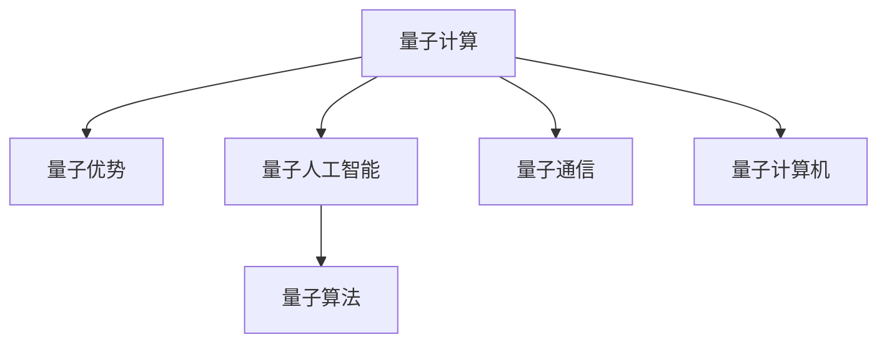

                 

# 2050年的量子计算：从量子优势到量子人工智能的计算技术变革

> 关键词：量子计算,量子优势,量子人工智能,量子算法,量子通信,量子计算机

## 1. 背景介绍

### 1.1 问题由来
量子计算是一门前沿的计算机科学，它利用量子力学的原理，以全新的计算模式解决传统计算机难以处理的问题。近年来，随着量子计算技术的逐步成熟和突破，量子计算机预计将在2050年以前进入实际应用阶段。量子计算的快速发展，将对计算机科学、物理学、化学、材料科学、生物科学等领域产生深远影响。

### 1.2 问题核心关键点
量子计算的核心在于利用量子叠加和纠缠现象，进行比传统计算更为高效的计算。其优势在于能够同时处理多个状态，实现指数级速度提升。特别是针对某些特定问题，如整数分解、量子化学模拟、优化问题等，量子计算展现出了巨大的潜力和优越性。

### 1.3 问题研究意义
量子计算的研究具有深远的科学和应用意义，它有望解决当前经典计算机难以处理的复杂问题，推动人工智能技术的发展，带来计算技术的变革。未来，量子计算机将成为人工智能的重要组成部分，广泛应用于各个领域，带来科学发现、技术创新和经济发展等方面的巨大进步。

## 2. 核心概念与联系

### 2.1 核心概念概述

为更好地理解量子计算和量子人工智能的计算技术变革，本节将介绍几个密切相关的核心概念：

- **量子计算(QC)**：基于量子力学原理设计的计算模式，通过量子比特（qubits）的叠加和纠缠，实现超越经典计算机的计算能力。
- **量子优势(QA)**：量子计算机在特定问题上，能够比经典计算机更快速、更高效地解决问题。
- **量子人工智能(QAI)**：结合量子计算和人工智能技术，利用量子计算机的优越性，提升AI的计算能力和解决复杂问题的能力。
- **量子算法**：利用量子力学的原理，针对特定问题设计的量子计算算法。
- **量子通信**：利用量子纠缠和量子态传输技术，实现信息安全的通信。
- **量子计算机**：实现量子计算的硬件设备，包括超导量子比特、离子阱量子比特、光子量子比特等。

这些核心概念之间的逻辑关系可以通过以下Mermaid流程图来展示：



这个流程图展示了大语言模型的核心概念及其之间的关系：

1. 量子计算通过量子比特的叠加和纠缠，实现超越经典计算机的计算能力。
2. 量子优势是指量子计算机在特定问题上能够展示超越经典计算机的计算速度和效率。
3. 量子人工智能结合了量子计算和人工智能技术，通过量子计算机的优越性提升AI的计算能力和解决复杂问题的能力。
4. 量子算法是利用量子力学的原理，针对特定问题设计的量子计算算法。
5. 量子通信是利用量子纠缠和量子态传输技术，实现信息安全的通信。
6. 量子计算机是实现量子计算的硬件设备，包括超导量子比特、离子阱量子比特、光子量子比特等。

这些概念共同构成了量子计算和量子人工智能的计算技术框架，为其在各个领域的应用提供了理论基础和技术支持。

## 3. 核心算法原理 & 具体操作步骤
### 3.1 算法原理概述

量子计算的核心算法包括Shor算法、Grover算法、量子霸权实验等。这些算法在整数分解、数据库搜索、因式分解、优化问题等领域展现出强大的计算能力。

**Shor算法**：用于解决整数分解问题，具有指数级的优势。传统算法需要指数级别时间复杂度，而Shor算法可以在多项式时间内完成分解。

**Grover算法**：用于无序数据库搜索，相较于经典算法，能够在$O(\sqrt{N})$时间内完成搜索，具有显著优势。

**量子霸权实验**：如Google的Sycamore实验，展示了量子计算机在特定问题上超越经典计算机的计算能力。

### 3.2 算法步骤详解

下面以Shor算法为例，详细讲解其步骤和实现：

1. **量子傅里叶变换（QFT）**：将输入的整数转换为量子态，利用QFT实现从经典域到量子域的映射。

2. **加法器**：利用量子比特的叠加和干涉，实现模幂运算。

3. **测量**：将计算结果输出为经典态，通过测量得到整数分解结果。

### 3.3 算法优缺点

量子计算的优势在于其并行性和指数级的计算速度，能够解决传统计算机难以处理的复杂问题。但同时也存在以下缺点：

- **硬件技术门槛高**：量子计算机的实现需要极高的技术门槛，如超低温环境、高精度控制等，目前仍处于实验室阶段。
- **错误率问题**：量子比特容易受到环境干扰，导致计算错误，需要进行错误校正。
- **可扩展性**：大规模量子计算机的扩展面临诸多技术挑战，目前仅能处理较小的计算任务。

### 3.4 算法应用领域

量子计算的应用领域广泛，包括：

- **密码学**：量子计算能够破解现有加密算法，推动量子密钥分发和量子安全通信的发展。
- **化学模拟**：量子计算机能够模拟量子化学反应，加速新药研发和材料设计。
- **优化问题**：如旅行商问题、图着色问题等，量子计算能够提供更高效的求解方案。
- **人工智能**：量子计算能够提升机器学习算法的效率，推动量子机器学习的研究。

## 4. 数学模型和公式 & 详细讲解 & 举例说明

### 4.1 数学模型构建

量子计算的数学模型包括量子比特表示、量子门、量子线路等。

**量子比特（Qubit）**：量子比特是量子计算的基本单位，表示为$|0\rangle$和$|1\rangle$的叠加状态$|\psi\rangle = \alpha|0\rangle + \beta|1\rangle$，其中$\alpha$和$\beta$为复数系数。

**量子门（Quantum Gate）**：量子门是量子计算中的基本操作，如Pauli-X门、Hadamard门、CNOT门等。

**量子线路（Quantum Circuit）**：量子线路表示量子计算的逻辑电路，由量子门和量子比特组成。

### 4.2 公式推导过程

以Shor算法为例，推导其核心步骤的数学公式。

**Step 1: 将整数n分解为$2^k r$形式**

$$
n = 2^k r
$$

**Step 2: 对整数r进行分解**

$$
r = \prod_{i=1}^m p_i^{a_i}
$$

其中，$p_i$为素数，$a_i$为正整数。

**Step 3: 计算分解结果**

$$
n = 2^k \prod_{i=1}^m p_i^{a_i}
$$

### 4.3 案例分析与讲解

以量子霸权实验为例，Google的Sycamore实验展示了其在特定任务上的量子优势。实验使用53个量子比特进行随机矩阵计算，耗时约200秒，而经典计算机需要数千年时间。

## 5. 项目实践：代码实例和详细解释说明
### 5.1 开发环境搭建

在进行量子计算实践前，我们需要准备好开发环境。以下是使用Python进行Qiskit开发的环境配置流程：

1. 安装Anaconda：从官网下载并安装Anaconda，用于创建独立的Python环境。

2. 创建并激活虚拟环境：
```bash
conda create -n quantum-env python=3.8 
conda activate quantum-env
```

3. 安装Qiskit：
```bash
pip install qiskit
```

4. 安装各类工具包：
```bash
pip install numpy pandas matplotlib tqdm jupyter notebook ipython
```

完成上述步骤后，即可在`quantum-env`环境中开始量子计算实践。

### 5.2 源代码详细实现

下面我们以Shor算法为例，给出使用Qiskit进行量子计算的Python代码实现。

```python
from qiskit import QuantumCircuit, Aer, execute
from qiskit.visualization import plot_bloch_multivector
from qiskit import QuantumRegister, ClassicalRegister, transpile

# 构建量子电路
qr = QuantumRegister(5, name='q')
cr = ClassicalRegister(5, name='c')
qc = QuantumCircuit(qr, cr)

# 添加Hadamard门
qc.h(qr[0])

# 添加CNOT门
for i in range(1, 5):
    qc.cx(qr[i-1], qr[0])

# 添加测量
qc.measure(qr, cr)

# 绘制电路图
qc.draw()

# 执行模拟
backend = Aer.get_backend('statevector_simulator')
result = execute(qc, backend).result()
counts = result.get_counts(qc)

# 输出结果
print(counts)
```

### 5.3 代码解读与分析

让我们再详细解读一下关键代码的实现细节：

**量子电路**：
- `QuantumRegister`用于创建量子比特寄存器。
- `ClassicalRegister`用于创建经典比特寄存器。
- `QuantumCircuit`用于创建量子电路。
- `h`门为Hadamard门，将量子比特从基态$|0\rangle$变为叠加态$|\psi\rangle = \frac{1}{\sqrt{2}}(|0\rangle + |1\rangle)$。
- `cx`门为CNOT门，实现量子比特的纠缠。
- `measure`用于量子比特测量。

**执行模拟**：
- `Aer.get_backend`用于选择模拟后端。
- `execute`用于执行量子电路。
- `result`获取模拟结果。
- `get_counts`用于获取测量结果。

**输出结果**：
- 模拟结果以字典形式输出，表示量子比特的测量结果。

## 6. 实际应用场景
### 6.1 密码学

量子计算的迅速发展对密码学提出了新的挑战。当前主流的公钥加密算法如RSA、ECC等，存在被量子计算机破解的风险。基于量子计算的安全协议，如量子密钥分发（QKD），能够提供信息传输的绝对安全。

在实际应用中，量子密钥分发利用量子纠缠的特性，在通信双方之间生成共享密钥，任何窃听行为都会破坏量子态，被检测出来。利用这种原理，可以构建基于量子计算的安全通信系统，保障信息的安全性。

### 6.2 化学模拟

量子计算在化学模拟中展现了巨大的潜力。传统经典计算机需要数十年甚至数百年才能模拟某些化学反应，而量子计算机可以在合理的时间内完成模拟。

例如，Google的QAOA算法用于模拟化学反应的能量优化。该算法利用量子计算机的叠加和纠缠特性，能够高效地模拟量子系统的能量变化，加速新药研发和材料设计。

### 6.3 优化问题

量子计算在优化问题中具有独特的优势。某些优化问题，如旅行商问题、图着色问题等，具有NP-hard的复杂度，传统算法难以在合理时间内求解。

利用量子计算的高效性，能够找到近似的最优解或可行解，解决经典算法难以处理的优化问题。量子计算机的优化算法，如QAOA、VQE等，已经被应用于实际问题中，取得显著效果。

### 6.4 未来应用展望

随着量子计算技术的发展，未来其应用场景将更加广泛。量子计算机在人工智能、金融、交通、医疗等领域都将发挥重要作用。

- **人工智能**：利用量子计算的高效性，加速机器学习算法的训练和优化，提升AI模型的性能。
- **金融**：利用量子计算进行复杂的金融模型计算，提高金融风险评估和预测的准确性。
- **交通**：利用量子计算进行交通系统的优化，提高交通效率和安全性。
- **医疗**：利用量子计算进行生物大分子模拟，加速新药研发和疾病预测。

## 7. 工具和资源推荐
### 7.1 学习资源推荐

为了帮助开发者系统掌握量子计算的理论基础和实践技巧，这里推荐一些优质的学习资源：

1. **《量子计算导论》**：C.H.Bennett和G.Brassard合著的经典教材，系统介绍了量子计算的基本原理和应用。

2. **《量子算法》**：Peter W. Shor撰写的书籍，详细讲解了量子算法的设计和实现。

3. **《量子计算量子信息》**：Michel A.Nielsen和Isaac L.Chuang合著的教材，全面介绍了量子计算和量子信息的原理和应用。

4. **Quantum Computing with IBM Q Experience**：IBM提供的在线量子计算平台，用户可以免费体验量子计算的实验和算法设计。

5. **Quantum Algorithms on a Quantum Computer**：Fernando G.S.L.G.Casado撰写的文章，讲解了基于IBM量子计算机的量子算法实现。

通过对这些资源的学习实践，相信你一定能够快速掌握量子计算的理论基础和实践技巧，并用于解决实际的量子计算问题。

### 7.2 开发工具推荐

高效的量子计算开发离不开优秀的工具支持。以下是几款用于量子计算开发的常用工具：

1. **Qiskit**：IBM开发的开源量子计算框架，提供了丰富的量子计算库和工具，支持多种后端和模拟器。

2. **Cirq**：Google开发的量子计算框架，具有强大的编程能力和优化功能，支持GPU加速。

3. **Qiskit-Aer**：Qiskit自带的模拟后端，支持多种模拟方法和硬件模拟器。

4. **Qiskit-Legacy**：Qiskit早期的接口和库，支持Qiskit 0.x版本的功能。

5. **OpenQASM**：量子计算机的汇编语言，用于编写量子程序。

合理利用这些工具，可以显著提升量子计算开发的效率，加快创新迭代的步伐。

### 7.3 相关论文推荐

量子计算的研究源于学界的持续研究。以下是几篇奠基性的相关论文，推荐阅读：

1. **《可分解整数的多项式算法》**：Peter W. Shor撰写的论文，提出了Shor算法，实现了整数分解的指数级加速。

2. **《量子霸权实验》**：Google发表的论文，展示了其量子计算机在特定任务上的量子优势。

3. **《量子位误差纠正理论》**：Andrei S.Kitaev撰写的论文，提出了量子位错误纠正的方法。

4. **《量子搜索算法》**：Grover提出Grover算法，实现了无序数据库搜索的平方级加速。

5. **《量子纠错码》**：Andrei S.Kitaev撰写的论文，提出了一种新的量子纠错码。

这些论文代表了大量子计算的发展脉络。通过学习这些前沿成果，可以帮助研究者把握学科前进方向，激发更多的创新灵感。

## 8. 总结：未来发展趋势与挑战

### 8.1 总结

本文对基于量子计算的量子人工智能计算技术变革进行了全面系统的介绍。首先阐述了量子计算和量子人工智能的研究背景和意义，明确了量子计算在解决复杂问题方面的独特优势。其次，从原理到实践，详细讲解了量子计算的数学模型和关键算法，给出了量子计算任务开发的完整代码实例。同时，本文还广泛探讨了量子计算在密码学、化学模拟、优化问题等多个领域的应用前景，展示了量子计算技术的巨大潜力。

通过本文的系统梳理，可以看到，基于量子计算的量子人工智能将带来计算技术的革命性变革，有望解决当前经典计算机难以处理的复杂问题，推动人工智能技术的发展。未来，伴随量子计算技术的持续演进，量子人工智能必将在更广阔的应用领域大放异彩。

### 8.2 未来发展趋势

展望未来，基于量子计算的量子人工智能将呈现以下几个发展趋势：

1. **量子计算机的规模化**：随着量子计算硬件的不断发展，未来的量子计算机将具备更强大的计算能力，能够处理更大规模的复杂问题。

2. **量子算法的创新**：量子算法的设计和优化将继续推进，新的量子算法将不断涌现，提升量子计算机的计算效率。

3. **量子通信的普及**：量子通信技术的成熟和普及，将推动信息安全的提升，构建更加安全可靠的信息传输系统。

4. **量子机器学习的突破**：量子计算与机器学习的结合，将推动量子机器学习的发展，提升机器学习算法的效率和效果。

5. **量子计算机的普及**：随着量子计算硬件的发展和成本的降低，未来的量子计算机将逐渐普及，应用到更多的行业和领域。

以上趋势凸显了量子计算和量子人工智能的广阔前景。这些方向的探索发展，必将进一步提升量子计算的性能和应用范围，为计算机科学和技术带来新的突破。

### 8.3 面临的挑战

尽管基于量子计算的量子人工智能技术已经取得了瞩目成就，但在迈向更加智能化、普适化应用的过程中，它仍面临诸多挑战：

1. **硬件技术的挑战**：量子计算机的硬件实现面临诸多技术挑战，如量子比特的稳定性、噪声控制、误差校正等。

2. **算法设计的挑战**：量子算法的设计和优化需要不断创新和改进，以应对复杂的多变量问题。

3. **资源和成本的挑战**：量子计算的实现需要大量的资源投入，包括高性能计算设备、冷却系统等，成本较高。

4. **应用场景的挑战**：量子计算在实际应用中面临诸多限制，需要针对具体问题进行优化。

5. **安全性的挑战**：量子计算的普及将带来信息安全的挑战，需要新的加密算法和保护措施。

6. **伦理和法律的挑战**：量子计算的应用需要考虑伦理和法律问题，避免潜在的滥用风险。

这些挑战需要在技术、工程、法律等多个层面共同努力，才能解决。只有全面克服这些难题，量子计算和量子人工智能才能真正走向成熟。

### 8.4 研究展望

面对量子计算和量子人工智能所面临的挑战，未来的研究需要在以下几个方面寻求新的突破：

1. **量子计算硬件的优化**：开发新型量子比特和量子门，提高量子计算机的稳定性和可扩展性。

2. **量子算法的改进**：设计高效的量子算法，提升量子计算机的计算能力和优化效果。

3. **量子通信技术的进步**：推动量子通信的普及和应用，构建更加安全可靠的信息传输系统。

4. **量子机器学习的发展**：推动量子计算与机器学习的结合，提升机器学习算法的效率和效果。

5. **量子安全加密的创新**：开发新的量子安全加密算法，保障信息传输的安全性。

6. **量子计算的普及和应用**：推动量子计算在各个领域的应用，加速科学发现、技术创新和经济发展。

这些研究方向的探索，必将引领量子计算和量子人工智能技术的进一步发展，为人类认知智能的进化带来深远影响。面向未来，量子计算和量子人工智能的研究需要更多的跨学科合作，协同发力，才能真正实现其巨大的潜力。

## 9. 附录：常见问题与解答

**Q1：量子计算与经典计算的区别是什么？**

A: 量子计算与经典计算的区别在于其计算模式和计算能力。经典计算使用二进制比特（0或1）进行计算，而量子计算使用量子比特（叠加态和纠缠态）进行计算。量子计算具有并行性和指数级的计算速度，能够解决某些经典计算机难以处理的复杂问题。

**Q2：量子计算的优势是什么？**

A: 量子计算的优势在于其并行性和指数级的计算速度。例如，Shor算法能够实现整数分解的指数级加速，Grover算法能够实现无序数据库搜索的平方级加速。量子计算能够解决某些经典计算机难以处理的复杂问题，如量子化学模拟、优化问题等。

**Q3：量子计算面临的主要挑战是什么？**

A: 量子计算面临的主要挑战包括硬件技术、算法设计、资源和成本、应用场景、安全性和伦理法律问题。硬件技术的挑战包括量子比特的稳定性、噪声控制、误差校正等。算法设计的挑战包括新量子算法的开发和优化。资源和成本的挑战包括高性能计算设备、冷却系统等的高成本。应用场景的挑战包括量子计算在实际应用中的限制和优化。安全性的挑战包括新的加密算法和保护措施。伦理和法律的挑战包括量子计算的滥用风险和法律法规的制定。

**Q4：量子计算的主要应用场景是什么？**

A: 量子计算的主要应用场景包括密码学、化学模拟、优化问题、人工智能、金融、交通、医疗等领域。在密码学中，量子计算能够破解现有加密算法，推动量子密钥分发和量子安全通信的发展。在化学模拟中，量子计算能够模拟量子化学反应，加速新药研发和材料设计。在优化问题中，量子计算能够提供高效的求解方案，如旅行商问题、图着色问题等。在人工智能中，量子计算能够提升机器学习算法的效率，推动量子机器学习的研究。在金融中，量子计算能够进行复杂的金融模型计算，提高金融风险评估和预测的准确性。在交通中，量子计算能够优化交通系统，提高交通效率和安全性。在医疗中，量子计算能够进行生物大分子模拟，加速新药研发和疾病预测。

---

作者：禅与计算机程序设计艺术 / Zen and the Art of Computer Programming

