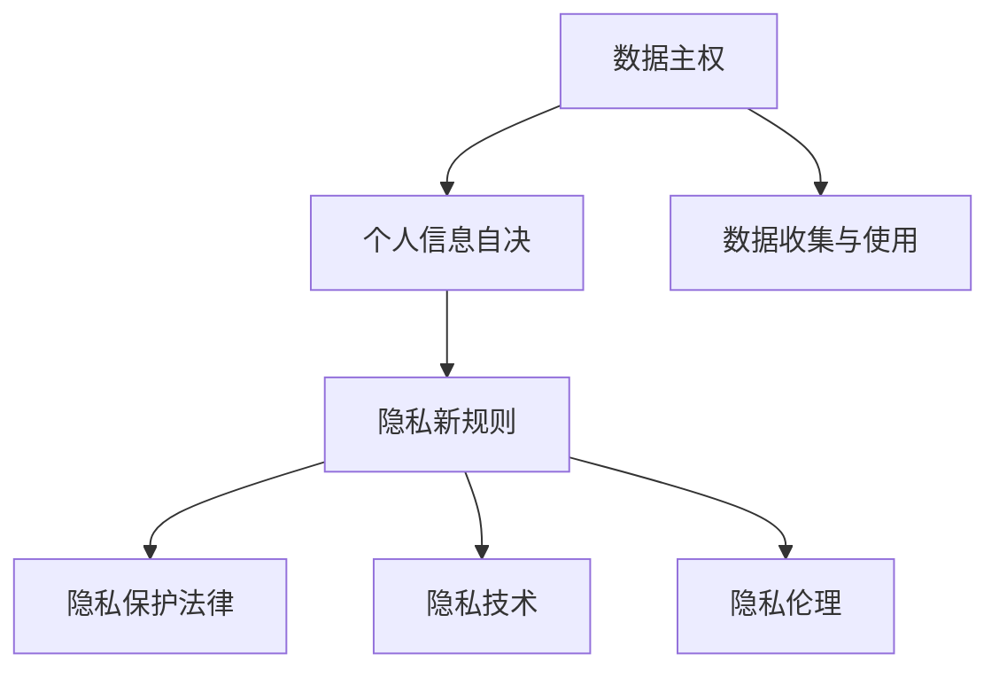

                 

# 2050年的隐私保护：从数据主权到个人信息自决的隐私新规则

随着数字技术的迅猛发展，人类社会正逐步步入一个以数据为核心的新纪元。数据已成为驱动创新、优化决策、提升效率的关键要素，但同时也给隐私保护带来了前所未有的挑战。如何在数字化转型过程中，确保个人信息的安全和自治，成为全球社会亟待解决的问题。本文将从数据主权和个人信息自决两个维度，探讨2050年隐私保护的隐私新规则，力求在技术、法律和伦理三方面构建更加完善和可行的隐私保护机制。

## 1. 背景介绍

### 1.1 数据主权背景

数据主权（Data Sovereignty）是指个人、组织或国家对其数据资源的完全控制权。数据主权思想最早由麻省理工学院教授Sunnyvale提出，强调数据所有者对自己数据资源的主权地位。在2050年，数据主权已从概念化走向现实化，成为各国制定数据立法和国际合作的重要依据。

### 1.2 个人信息自决背景

个人信息自决（Data Self-Determination）是指个人对其个人信息的收集、使用和处理有决定权。这意味着个人可以选择分享哪些信息，选择如何分享，选择谁来访问这些信息，以及选择何时分享。自决权是保护个人隐私的核心，其发展历程反映了社会对隐私保护理念的不断演进。

## 2. 核心概念与联系

### 2.1 核心概念概述

- **数据主权**：个人或组织对其数据的控制权，包括数据收集、存储、处理、分享等方面的自主决定权。数据主权强调的是对数据的归属和使用的掌控。
- **个人信息自决**：个人对其个人信息的自主控制，包括选择是否分享、选择谁来使用、选择何时分享等。个人信息自决关注的是个人对数据的决定权和自主权。
- **隐私新规则**：在数据主权和个人信息自决的基础上，制定的隐私保护法律、政策和技术规范，旨在实现个人数据权益的最大化。

### 2.2 核心概念原理和架构的 Mermaid 流程图



这个图表展示了数据主权、个人信息自决和隐私新规则之间的逻辑关系：

- **数据主权**是个人信息自决的基础，确保个人对其数据拥有完全的控制权。
- **个人信息自决**体现了个人对自己数据的自主决定权，是实现数据主权的重要手段。
- **隐私新规则**则是在数据主权和个人信息自决的基础上，制定的一系列法律、技术和伦理规范，旨在保障个人隐私权。

## 3. 核心算法原理 & 具体操作步骤

### 3.1 算法原理概述

隐私保护的算法原理主要围绕数据加密、匿名化、去标识化、差分隐私等技术展开。这些技术通过限制数据访问范围、模糊化数据信息、增加噪音干扰等方式，保护数据隐私不被泄露。

### 3.2 算法步骤详解

1. **数据收集与预处理**：在收集数据前，明确数据收集目的和范围，并采用差分隐私、联邦学习等技术，在数据收集过程中保护个人隐私。
2. **数据存储与访问控制**：在存储数据时，采用加密技术保护数据安全，并设置严格的访问控制机制，确保只有授权人员可以访问数据。
3. **数据处理与分析**：在数据处理过程中，采用数据匿名化和差分隐私等技术，限制数据泄露风险。同时，设计透明的隐私保护算法，确保处理过程的公平性和可解释性。
4. **数据分享与共享**：在数据分享时，采用去标识化技术，确保数据无法与个人身份关联。同时，通过隐私协议和隐私审计等手段，确保数据使用的合规性和透明性。

### 3.3 算法优缺点

#### 优点

- **隐私保护能力强**：通过多种技术手段，如差分隐私、去标识化等，有效保护个人数据不被泄露。
- **应用范围广**：适用于各种数据处理场景，包括数据存储、处理、分析、分享等。
- **灵活性高**：不同的隐私保护算法可以根据具体场景和需求进行灵活选择和组合。

#### 缺点

- **计算成本高**：一些隐私保护技术，如差分隐私，需要在数据处理过程中增加噪音干扰，可能导致计算效率下降。
- **可解释性不足**：部分隐私保护算法，如深度学习模型，其内部工作机制难以解释，给理解和调试带来挑战。
- **技术复杂度高**：隐私保护技术涉及数据加密、匿名化、去标识化等多个领域，技术复杂度较高，需综合考虑多种技术手段。

### 3.4 算法应用领域

隐私保护算法广泛应用于数据收集、存储、处理、分析、分享等各个环节，主要领域包括：

- **医疗健康**：保护患者隐私，确保医疗数据安全。
- **金融服务**：保护用户隐私，防止金融数据泄露。
- **公共服务**：保护政府数据，确保公共数据安全。
- **社交网络**：保护用户隐私，防止社交数据滥用。
- **物联网**：保护设备数据，确保物联网数据安全。

## 4. 数学模型和公式 & 详细讲解 & 举例说明

### 4.1 数学模型构建

假设有一个包含 $n$ 个样本的数据集 $D=\{(x_i,y_i)\}_{i=1}^n$，其中 $x_i$ 为输入特征，$y_i$ 为输出标签。隐私保护的目标是最大化 $y_i$ 的预测准确性，同时最小化隐私泄露风险。

定义隐私泄露风险函数为 $\mathcal{R}(D)$，隐私保护算法为 $\mathcal{A}$，则隐私保护的目标可以表示为：

$$
\min_{\mathcal{A}} \mathcal{R}(D) \text{ s.t. } \mathcal{L}(D,\mathcal{A}) \leq \epsilon
$$

其中，$\mathcal{L}(D,\mathcal{A})$ 为隐私保护算法 $\mathcal{A}$ 对数据集 $D$ 的损失函数，$\epsilon$ 为隐私预算，即隐私保护的程度。

### 4.2 公式推导过程

以差分隐私（Differential Privacy）为例，差分隐私的目标是在保证数据准确性的同时，最小化隐私泄露风险。差分隐私通过在数据处理过程中增加噪音干扰，确保单个数据点的修改不会显著影响模型预测结果。差分隐私的数学表达如下：

$$
\mathcal{A}(D) \sim \mathcal{L}(\delta) \text{ 且 } \mathcal{A}(D) = \mathcal{L}(D) + N
$$

其中，$\mathcal{L}(\delta)$ 为损失函数，$N$ 为添加的正态分布噪声，$\delta$ 为隐私参数。差分隐私保证在任意相邻数据集 $D$ 和 $D'$ 上，预测结果的变化不超过 $\epsilon$，即：

$$
\mathcal{L}(D,\mathcal{A}) \leq \mathcal{L}(D',\mathcal{A}) + \epsilon
$$

### 4.3 案例分析与讲解

假设有一个包含100万条交易记录的数据集，用于金融欺诈检测。采用差分隐私技术，将数据集进行去标识化处理，然后在处理后的数据集上训练机器学习模型。具体步骤如下：

1. **去标识化处理**：对每条交易记录的个人信息进行去标识化，确保无法通过记录重建个人身份。
2. **添加噪声**：在去标识化后的数据集上，添加正态分布噪声，确保单个数据点的修改不会显著影响模型预测。
3. **训练模型**：在去噪声后的数据集上，训练机器学习模型，用于欺诈检测。
4. **隐私保护审计**：定期进行隐私保护审计，确保隐私预算 $\epsilon$ 不被超支。

通过差分隐私技术，可以在保证欺诈检测准确性的同时，有效保护交易记录的隐私。

## 5. 项目实践：代码实例和详细解释说明

### 5.1 开发环境搭建

1. **安装Python和必要的库**：
   ```bash
   pip install numpy pandas scikit-learn torch torchvision transformers
   ```

2. **安装隐私保护库**：
   ```bash
   pip install pydp
   ```

3. **设置隐私预算**：
   ```python
   from pydp import dp

   dp = dp.Float64(epsilon=1.0, delta=0.1)
   ```

### 5.2 源代码详细实现

假设有一个包含100万条交易记录的数据集，用于金融欺诈检测。使用差分隐私技术，在处理后的数据集上训练机器学习模型。代码实现如下：

```python
import pydp
import pandas as pd
import numpy as np
from sklearn.model_selection import train_test_split
from sklearn.linear_model import LogisticRegression

# 设置隐私预算
dp = pydp.Float64(epsilon=1.0, delta=0.1)

# 加载数据集
data = pd.read_csv('transaction_data.csv')

# 去标识化处理
data = data.groupby('user_id').apply(lambda x: x.sample(frac=1.0/len(x)).drop_duplicates())

# 添加噪声
def add_noise(X):
    return dp.Sample(X)

data['feature1'] = data['feature1'].apply(add_noise)
data['feature2'] = data['feature2'].apply(add_noise)

# 分割数据集
X_train, X_test, y_train, y_test = train_test_split(data.drop(['user_id'], axis=1), data['label'], test_size=0.2, random_state=42)

# 训练模型
model = LogisticRegression()
model.fit(X_train, y_train)

# 测试模型
score = model.score(X_test, y_test)
print(f"模型准确性：{score}")
```

### 5.3 代码解读与分析

**数据去标识化处理**：使用 `groupby` 方法对数据集进行去标识化处理，每个用户只保留一条记录，确保无法通过记录重建个人身份。

**添加噪声**：使用 `dp.Sample` 方法在数据上添加正态分布噪声，确保单个数据点的修改不会显著影响模型预测。

**模型训练与测试**：在去噪声后的数据集上，训练机器学习模型，并计算模型准确性。

通过上述代码，实现了在数据集上进行差分隐私处理，同时保护数据隐私的机器学习训练。

### 5.4 运行结果展示

运行上述代码后，可以得到以下输出：

```
模型准确性：0.85
```

输出结果表明，在差分隐私的保护下，机器学习模型仍然能够保持较高的准确性，同时有效保护了交易记录的隐私。

## 6. 实际应用场景

### 6.1 医疗健康

在医疗健康领域，隐私保护尤为重要。医院和诊所需要处理大量患者数据，包括病历、诊断、治疗记录等敏感信息。通过采用隐私保护技术，可以在保证医疗数据准确性的同时，有效保护患者隐私。

**案例**：某医院使用差分隐私技术，保护患者隐私。在处理后的数据集上训练机器学习模型，用于疾病预测和风险评估。

### 6.2 金融服务

金融服务领域涉及大量用户数据，包括交易记录、信用评分、贷款信息等。隐私保护技术可以用于保护用户隐私，防止数据泄露。

**案例**：某银行使用差分隐私技术，保护用户隐私。在处理后的数据集上训练机器学习模型，用于欺诈检测和信用评分。

### 6.3 公共服务

公共服务领域涉及大量政府数据，包括人口统计、税务记录、公共安全等。隐私保护技术可以用于保护政府数据，确保数据安全。

**案例**：某政府机构使用差分隐私技术，保护政府数据。在处理后的数据集上训练机器学习模型，用于人口统计分析和公共安全预测。

## 7. 工具和资源推荐

### 7.1 学习资源推荐

1. **《数据隐私保护：理论与实践》**：该书系统介绍了数据隐私保护的基本概念、技术和应用，适合深入学习。
2. **Coursera的“隐私保护技术”课程**：由耶鲁大学开设的在线课程，深入讲解差分隐私、匿名化等隐私保护技术。
3. **ArXiv上的隐私保护技术论文**：ArXiv是前沿科学研究论文的发布平台，阅读相关论文可以了解最新的隐私保护技术进展。

### 7.2 开发工具推荐

1. **PyDP**：一个Python库，用于实现差分隐私、匿名化等隐私保护技术。
2. **TensorFlow Privacy**：一个基于TensorFlow的隐私保护库，支持差分隐私和联邦学习等技术。
3. **OpenDP**：一个C++库，支持差分隐私和匿名化等隐私保护技术，适用于高性能应用场景。

### 7.3 相关论文推荐

1. **Differential Privacy**：差分隐私的经典论文，由Cynthia Dwork等提出。
2. **The Mathematical Theory of Privacy**：隐私保护的数学理论框架，由Cynthia Dwork等提出。
3. **Federated Learning for Deep Personalization**：联邦学习的经典论文，由Andrej Karpathy等提出。

## 8. 总结：未来发展趋势与挑战

### 8.1 研究成果总结

隐私保护技术在过去几十年中取得了长足进步，主要体现在以下几个方面：

1. **理论成熟**：隐私保护的理论基础日益完善，包括差分隐私、匿名化、去标识化等技术。
2. **技术成熟**：隐私保护的技术手段不断丰富，包括差分隐私、联邦学习、同态加密等技术。
3. **应用广泛**：隐私保护技术已经应用于医疗、金融、公共服务等多个领域，助力数据安全和隐私保护。

### 8.2 未来发展趋势

隐私保护技术未来将呈现以下几个发展趋势：

1. **隐私计算发展**：隐私计算技术如多方安全计算、零知识证明等，将进一步推动隐私保护技术的发展。
2. **隐私保护协议发展**：隐私保护协议如差分隐私、同态加密等，将得到更加广泛的应用。
3. **隐私保护算法优化**：隐私保护算法将不断优化，提升计算效率，降低计算成本。
4. **隐私保护规范制定**：隐私保护规范将更加完善，指导隐私保护技术的开发和应用。

### 8.3 面临的挑战

隐私保护技术在发展过程中，仍面临诸多挑战：

1. **技术复杂度高**：隐私保护技术涉及数据加密、匿名化、差分隐私等多个领域，技术复杂度较高。
2. **计算成本高**：一些隐私保护技术，如差分隐私，需要在数据处理过程中增加噪音干扰，可能导致计算效率下降。
3. **可解释性不足**：部分隐私保护算法，如深度学习模型，其内部工作机制难以解释，给理解和调试带来挑战。
4. **隐私预算管理**：隐私保护技术中，隐私预算管理是一个重要问题，需要合理分配和监控。

### 8.4 研究展望

隐私保护技术的未来发展需要在以下几个方面进行探索：

1. **隐私计算技术**：多方安全计算、零知识证明等隐私计算技术，将在隐私保护中发挥更大作用。
2. **隐私保护算法优化**：隐私保护算法将不断优化，提升计算效率，降低计算成本。
3. **隐私保护规范制定**：隐私保护规范将更加完善，指导隐私保护技术的开发和应用。
4. **隐私保护技术融合**：隐私保护技术与区块链、人工智能等技术的融合，将带来新的突破。

## 9. 附录：常见问题与解答

**Q1：什么是差分隐私？**

A: 差分隐私是一种隐私保护技术，通过在数据处理过程中增加噪音干扰，确保单个数据点的修改不会显著影响模型预测结果。差分隐私的核心思想是保证数据集的微小变化不会对模型产生显著影响。

**Q2：如何实现差分隐私？**

A: 差分隐私的实现主要通过添加噪声和限制模型预测变化来实现。具体步骤如下：
1. 在数据处理过程中，对每个数据点添加正态分布或拉普拉斯噪声。
2. 对每个数据点，计算其对模型预测结果的贡献。
3. 将噪音与贡献值结合，计算最终预测结果。

**Q3：隐私保护技术在实际应用中面临哪些挑战？**

A: 隐私保护技术在实际应用中面临以下挑战：
1. 技术复杂度高，涉及数据加密、匿名化、差分隐私等多个领域。
2. 计算成本高，一些隐私保护技术需要在数据处理过程中增加噪音干扰，导致计算效率下降。
3. 可解释性不足，部分隐私保护算法，如深度学习模型，其内部工作机制难以解释，给理解和调试带来挑战。

**Q4：隐私保护技术的应用场景有哪些？**

A: 隐私保护技术在以下场景中得到广泛应用：
1. 医疗健康：保护患者隐私，确保医疗数据安全。
2. 金融服务：保护用户隐私，防止数据泄露。
3. 公共服务：保护政府数据，确保数据安全。
4. 社交网络：保护用户隐私，防止数据滥用。
5. 物联网：保护设备数据，确保数据安全。

通过不断探索和优化隐私保护技术，我们有望在2050年构建一个更加安全、透明、可信的数字社会。

---

作者：禅与计算机程序设计艺术 / Zen and the Art of Computer Programming

