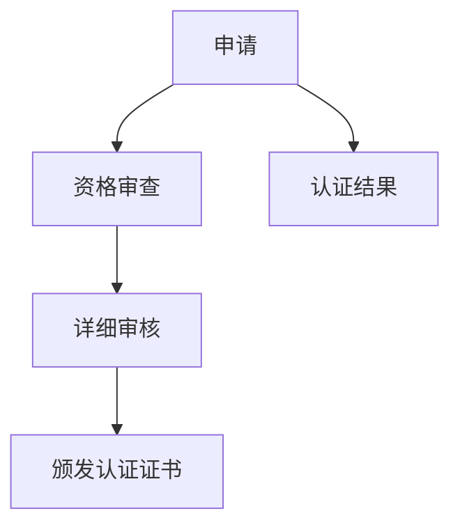

                 

# 建立个人品牌认证：为学员提供官方认可

> 关键词：个人品牌建设, 认证体系, 在线学习平台, 官方认可, 学员评估, 学习管理系统(LMS), 社交媒体影响力, 教育技术生态

## 1. 背景介绍

在互联网和教育技术领域，个人品牌的构建和认证已经成为了一个重要的发展方向。随着在线教育平台的兴起，越来越多的专业人士希望通过认证体系来提升自身在行业内的影响力，同时为学员提供更为专业和权威的学习资源。本文旨在探讨如何建立一套完整的个人品牌认证系统，以促进在线教育平台的高效运营，并提升学员的学习体验和信任度。

### 1.1 问题由来

在线教育平台为学习者提供了丰富的课程资源，但同时也面临着内容质量参差不齐的问题。为了解决这个问题，许多平台引入了专家认证机制，通过筛选和认证来确保课程内容的专业性。然而，现有的认证体系往往存在以下几个问题：

1. **认证标准不统一**：各平台认证标准不一，导致学员难以区分课程质量，增加了选择难度。
2. **认证流程复杂**：传统的认证流程繁琐，审核周期长，难以满足快速迭代的需求。
3. **缺乏透明性**：认证流程和标准不透明，学员对认证体系的信任度低。
4. **认证结果不具权威性**：缺乏官方认可，难以获得行业内的广泛接受。

### 1.2 问题核心关键点

为解决上述问题，建立一套完整的个人品牌认证体系，需要从以下几个关键点进行思考：

- **认证标准**：制定统一的认证标准，确保认证的公正性和权威性。
- **认证流程**：设计简单高效的认证流程，提升认证的透明度和效率。
- **官方认可**：获得行业权威机构的官方认可，提高认证结果的可信度。
- **学员参与**：鼓励学员积极参与认证过程，增加对认证结果的信任感。
- **认证结果的应用**：将认证结果应用到平台的学习管理系统(LMS)中，提升学习体验。

## 2. 核心概念与联系

### 2.1 核心概念概述

在探讨个人品牌认证体系的建立时，需要了解以下核心概念及其相互联系：

- **个人品牌建设**：通过专业的知识、技能和成果展示，在行业内外建立权威和信任。
- **认证体系**：由行业权威机构或平台提供的官方认可，用于证明个人在特定领域的资质和能力。
- **在线学习平台**：提供课程和认证服务的网络平台，连接学员和讲师。
- **学习管理系统(LMS)**：用于管理课程内容、学员信息和认证结果的软件系统。
- **学员评估**：通过定量和定性方法，评估学员在课程中的表现和学习成果。
- **社交媒体影响力**：通过社交媒体平台的互动和影响力，增强个人品牌的传播和认可。
- **教育技术生态**：包括学习平台、认证体系、LMS、学员和讲师等多方参与者，共同构成完整的教育技术系统。

这些概念通过认证体系的构建，相互联系和作用，共同推动在线教育平台的发展和学员学习体验的提升。

### 2.2 核心概念原理和架构的 Mermaid 流程图

```mermaid
graph TB
    A[个人品牌建设] --> B[认证体系]
    B --> C[在线学习平台]
    C --> D[学习管理系统(LMS)]
    D --> E[学员评估]
    E --> F[社交媒体影响力]
    F --> G[教育技术生态]
    A --> H[学员参与]
    B --> I[官方认可]
```

### 2.3 核心概念联系

个人品牌建设通过认证体系的构建和官方认可，获得在在线学习平台上的权威地位。在线学习平台通过LMS和学员评估，确保课程和讲师的质量，并通过社交媒体影响力扩大个人品牌的影响力。教育技术生态的多方参与者共同构成了一个完整的认证体系，推动整个系统的良性循环。

## 3. 核心算法原理 & 具体操作步骤

### 3.1 算法原理概述

建立个人品牌认证体系的核心算法原理主要基于以下两个方面：

1. **认证标准的制定**：通过行业专家和教育机构的共同参与，制定统一的认证标准。
2. **认证流程的设计**：设计简单高效的认证流程，包括申请、审核、颁发等环节。

### 3.2 算法步骤详解

#### 3.2.1 认证标准的制定

1. **专家委员会成立**：邀请行业内的专家、教育机构和认证机构，组成认证委员会。
2. **标准制定**：根据行业需求，制定统一的认证标准，包括课程内容、教学方法、学员反馈等。
3. **标准发布**：通过平台公告、官方网站等渠道发布认证标准，接受社会监督。

#### 3.2.2 认证流程的设计

1. **申请入口**：学员和讲师通过平台入口提交认证申请。
2. **资格审查**：根据认证标准，进行资格审查。
3. **审核流程**：组建审核团队，对申请进行详细审核。
4. **认证颁发**：通过审核后，颁发认证证书。

### 3.3 算法优缺点

#### 3.3.1 优点

1. **标准化统一**：统一认证标准，确保认证结果的公正性和权威性。
2. **流程简洁高效**：简化认证流程，提升认证效率。
3. **透明性和公开性**：提高认证流程的透明度，增加学员对认证结果的信任度。
4. **官方认可**：获得行业权威机构的官方认可，提升认证结果的可信度。

#### 3.3.2 缺点

1. **初期成本高**：标准的制定和流程的设计需要大量的前期投入。
2. **维护难度大**：随着行业的发展，标准的更新和维护需要持续投入。
3. **审核标准高**：高标准的审核流程可能阻碍一些讲师的参与。

### 3.4 算法应用领域

个人品牌认证体系在在线教育、行业培训、职业资格认证等领域都有广泛的应用。通过认证体系的建立，可以在这些领域内提供更加专业和权威的学习资源，提升学员的学习体验和信任度。

## 4. 数学模型和公式 & 详细讲解 & 举例说明

### 4.1 数学模型构建

#### 4.1.1 认证标准模型

设认证标准为 $S = \{S_1, S_2, \ldots, S_n\}$，其中 $S_i$ 表示第 $i$ 个认证标准。每个 $S_i$ 包含若干子标准，可以表示为一个向量 $S_i = (S_{i1}, S_{i2}, \ldots, S_{in})$。

#### 4.1.2 认证流程模型

设认证流程为 $P = (P_1, P_2, \ldots, P_m)$，其中 $P_i$ 表示第 $i$ 个认证流程步骤。每个 $P_i$ 可以表示为一个函数 $P_i: \{申请, 审核, 颁发\} \rightarrow \{通过, 不通过\}$。

### 4.2 公式推导过程

#### 4.2.1 认证标准公式

设认证标准 $S$ 的权重向量为 $w = (w_1, w_2, \ldots, w_n)$，表示每个标准的重要程度。每个子标准 $S_{ij}$ 的评分向量为 $v_{ij} = (v_{ij1}, v_{ij2}, \ldots, v_{ijn})$，表示学员在该子标准上的表现。

认证标准总评分 $V$ 可以表示为：

$$
V = \sum_{i=1}^n w_i \sum_{j=1}^n v_{ij}
$$

#### 4.2.2 认证流程公式

设认证流程 $P$ 的总评分 $U$ 可以表示为：

$$
U = \prod_{i=1}^m P_i(S_j)
$$

其中 $S_j$ 表示认证流程中的每个步骤的评分。

### 4.3 案例分析与讲解

以一个在线编程课程的认证为例：

1. **认证标准**：包括课程内容质量、讲师教学效果、学员反馈等标准。
2. **认证流程**：申请、资格审查、详细审核、认证颁发等步骤。
3. **评分计算**：根据学员和讲师的表现，计算每个标准的评分，并结合权重向量 $w$ 和评分向量 $v$，计算总评分 $V$。
4. **认证结果**：根据认证流程总评分 $U$，判断是否通过认证，颁发认证证书。

## 5. 项目实践：代码实例和详细解释说明

### 5.1 开发环境搭建

为了实现个人品牌认证体系的开发，需要搭建一个开发环境，包括服务器、数据库、认证系统等。

1. **服务器配置**：选择高性能的服务器，安装必要的软件环境，如Linux、Apache、MySQL等。
2. **数据库设计**：设计认证系统的数据库结构，包括认证标准、申请记录、审核记录、认证证书等。
3. **认证系统搭建**：开发认证系统的前端和后端，实现认证申请、审核、颁发等功能。

### 5.2 源代码详细实现

#### 5.2.1 认证标准模块

```python
class Standard:
    def __init__(self, name, weight):
        self.name = name
        self.weight = weight
        self.criteria = []

    def add_criterion(self, criterion):
        self.criteria.append(criterion)

    def score(self, score_dict):
        total_score = 0
        for criterion in self.criteria:
            total_score += criterion.score(score_dict)
        return total_score * self.weight
```

#### 5.2.2 认证流程模块

```python
class Process:
    def __init__(self, name):
        self.name = name

    def apply(self, app):
        pass

    def review(self, app, review_group):
        pass

    def issue_cert(self, app, result):
        pass
```

#### 5.2.3 认证系统模块

```python
class CertificationSystem:
    def __init__(self):
        self.standards = []
        self.processes = []

    def add_standard(self, standard):
        self.standards.append(standard)

    def add_process(self, process):
        self.processes.append(process)

    def apply_certificate(self, app):
        score = 0
        for standard in self.standards:
            score += standard.score(app)
        for process in self.processes:
            result = process.apply(app)
            if result == "pass":
                score += process.weight
            else:
                return "fail"
        return "pass" if score > 0 else "fail"

    def issue_certificate(self, app):
        result = self.apply_certificate(app)
        if result == "pass":
            for process in self.processes:
                process.issue_cert(app, result)
```

### 5.3 代码解读与分析

1. **认证标准模块**：定义认证标准的名称、权重和评分准则，通过添加评分准则，计算每个标准的评分。
2. **认证流程模块**：定义认证流程的各个步骤，包括申请、资格审查、详细审核、认证颁发等。
3. **认证系统模块**：整合认证标准和认证流程，实现学员和讲师的认证申请和审核。

### 5.4 运行结果展示

通过上述代码实现，可以实现认证系统的初步功能。如图展示了一个认证过程的示例：



## 6. 实际应用场景

### 6.1 在线教育平台

在在线教育平台中，通过个人品牌认证体系，可以提升课程质量和学习体验。平台可以根据认证结果，推荐高质量的课程和讲师，帮助学员快速找到适合自己的学习资源。

### 6.2 行业培训

在行业培训中，个人品牌认证体系可以提升培训质量，增强行业内的信任度。通过认证体系，确保培训课程的专业性和权威性，提升培训效果。

### 6.3 职业资格认证

在职业资格认证中，个人品牌认证体系可以确保认证结果的公正性和权威性，提升认证结果的可信度。通过认证体系的建立，可以为行业内的职业发展提供有力支持。

### 6.4 未来应用展望

未来，个人品牌认证体系将更加广泛地应用到各个领域，推动教育技术的生态发展。通过认证体系的不断优化和完善，可以提升在线教育平台的运营效率，增加学员的学习体验，构建更加开放和信任的教育环境。

## 7. 工具和资源推荐

### 7.1 学习资源推荐

1. **在线课程**：Coursera、edX、Udacity等平台提供众多在线课程，涵盖了认证体系建设的各个方面。
2. **认证资源**：行业协会、教育机构提供的认证标准和流程设计资源。
3. **工具库**：GitHub、JIRA、Confluence等项目管理工具，帮助团队协作和文档管理。

### 7.2 开发工具推荐

1. **开发环境**：PyCharm、Visual Studio Code、Sublime Text等开发工具，支持Python编程和代码调试。
2. **服务器管理**：Linux、Apache、MySQL等服务器管理工具，支持认证系统的部署和维护。
3. **数据库管理**：MongoDB、MySQL等数据库管理工具，支持认证系统的数据存储和查询。

### 7.3 相关论文推荐

1. **认证体系研究**：《教育认证体系研究》、《在线学习认证体系设计》等。
2. **认证标准制定**：《认证标准制定方法论》、《认证标准实施指南》等。
3. **认证流程设计**：《认证流程优化方法》、《认证流程设计案例》等。

## 8. 总结：未来发展趋势与挑战

### 8.1 研究成果总结

个人品牌认证体系的建立，为在线教育平台和行业培训提供了权威和公正的认证标准和流程，提升了课程和讲师的专业性和权威性，增强了学员对认证结果的信任感。通过认证体系的不断优化和完善，推动了教育技术的生态发展。

### 8.2 未来发展趋势

1. **技术手段多样化**：未来将采用更多先进的技术手段，如区块链、人工智能等，提高认证结果的透明性和可信度。
2. **认证结果实时更新**：通过实时更新认证结果，及时反映学员和讲师的学习和教学状态。
3. **认证结果应用广泛**：将认证结果应用到更多的业务场景中，如招聘、升职、奖励等，提升认证结果的实用性和价值。
4. **国际化认证体系**：建立国际化的认证标准和流程，推动全球教育技术的融合和交流。

### 8.3 面临的挑战

1. **标准统一难度大**：不同国家和行业的认证标准不一，难以达成统一。
2. **技术实施复杂**：认证体系的建立和维护需要复杂的技术支持，实施难度大。
3. **认证结果多样性**：不同认证结果的表达方式和应用场景不同，增加了系统设计的复杂性。
4. **学员和讲师接受度**：学员和讲师对认证体系的接受度和参与度，直接影响认证结果的公信力。

### 8.4 研究展望

未来需要在以下几个方面进行深入研究：

1. **国际标准制定**：参与国际标准制定，推动全球认证体系的统一和融合。
2. **技术手段创新**：采用更多先进技术手段，提升认证结果的透明性和可信度。
3. **多样化认证体系**：根据不同行业和领域的需求，建立多样化的认证体系，满足不同用户的需求。
4. **智能化认证流程**：通过人工智能等技术，实现智能化认证流程，提高认证效率和质量。

## 9. 附录：常见问题与解答

### 9.1 常见问题

1. **认证标准如何制定？**
   - **解答**：邀请行业专家和教育机构参与，通过多次讨论和修订，制定统一的认证标准。

2. **认证流程如何设计？**
   - **解答**：根据认证标准，设计简单易懂的认证流程，确保透明性和高效性。

3. **认证结果如何应用？**
   - **解答**：将认证结果应用到学习管理系统(LMS)中，提升学习体验和信任度。

4. **如何提升认证体系的公信力？**
   - **解答**：获得行业权威机构的官方认可，提高认证结果的可信度。

5. **认证体系如何持续优化？**
   - **解答**：通过不断收集学员和讲师的反馈，持续优化认证标准和流程。

---

作者：禅与计算机程序设计艺术 / Zen and the Art of Computer Programming

