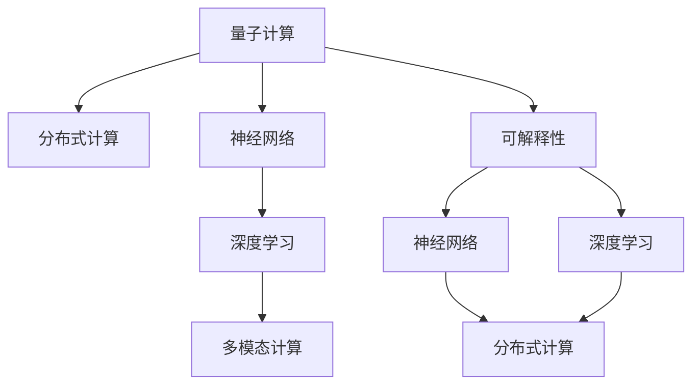

                 

# 开启无限可能：人类计算的新征程

> 关键词：人工智能, 计算能力, 量子计算, 超级计算机, 边缘计算, 分布式计算, 深度学习, 神经网络, 多模态计算, 可解释性, 未来计算

## 1. 背景介绍

### 1.1 问题由来

随着科技的不断进步，人类对计算能力的追求已经达到了一个新的高度。传统基于经典物理学的计算模型，已经无法满足对复杂系统的模拟和优化需求。量子计算、神经网络、分布式计算等新型计算模式应运而生，极大地拓展了人类计算的边界。

**量子计算**：利用量子力学的原理，通过量子比特进行并行计算，能够在某些特定问题上达到超越经典计算的速度，具有解决某些传统计算无法解决的问题的潜力。

**神经网络**：受人类大脑神经元网络结构的启发，通过大量的数据训练，能够进行模式识别、图像识别、自然语言处理等任务，已经成为人工智能和机器学习的重要工具。

**分布式计算**：将计算任务分解成多个子任务，分配给多个计算节点并行处理，通过网络进行通信和协调，大幅提升了计算效率和处理能力。

**深度学习**：一种特殊的神经网络结构，通过多层非线性变换，能够学习到数据中复杂的特征表示，已经成功应用于图像识别、语音识别、自然语言处理等领域。

**多模态计算**：融合多种计算方式和传感器信息，实现跨领域、多维度的计算和分析，具有高度的实用价值和潜力。

**可解释性**：在保证计算效率的同时，能够提供计算过程和结果的可解释性，使得计算结果更容易被理解和接受。

这些新型计算模式的出现，标志着人类计算能力进入了一个新的时代。它们不仅解决了传统计算方法无法解决的问题，还为更广泛的应用场景提供了可能性。

### 1.2 问题核心关键点

在新的计算范式下，如何实现更高效、更灵活、更可解释的计算，成为了当前计算领域的核心问题。以下几点是值得关注的：

1. **计算效率**：如何设计更高效的计算模型和算法，实现更快速的计算。
2. **计算灵活性**：如何在不同类型的计算平台和环境上进行灵活的计算部署和调度。
3. **计算可解释性**：如何提高计算过程和结果的可解释性，使得计算结果更容易被理解和接受。
4. **计算安全性和隐私保护**：如何在保障数据隐私和安全的前提下，进行高效计算。

这些核心问题，共同构成了人类计算新征程的关键点，指引着未来计算技术的发展方向。

## 2. 核心概念与联系

### 2.1 核心概念概述

要深入理解这些新型计算模式，首先需要理解一些核心概念：

- **量子计算**：基于量子力学的原理，利用量子比特进行并行计算，能够在某些特定问题上达到超越经典计算的速度。
- **神经网络**：通过大量的数据训练，能够进行模式识别、图像识别、自然语言处理等任务，已经成为人工智能和机器学习的重要工具。
- **分布式计算**：将计算任务分解成多个子任务，分配给多个计算节点并行处理，通过网络进行通信和协调，大幅提升了计算效率和处理能力。
- **深度学习**：一种特殊的神经网络结构，通过多层非线性变换，能够学习到数据中复杂的特征表示，已经成功应用于图像识别、语音识别、自然语言处理等领域。
- **多模态计算**：融合多种计算方式和传感器信息，实现跨领域、多维度的计算和分析。
- **可解释性**：在保证计算效率的同时，能够提供计算过程和结果的可解释性，使得计算结果更容易被理解和接受。

这些概念之间存在紧密的联系，构成了现代计算技术的基础。通过理解这些核心概念，可以更好地把握新型计算范式的特点和应用场景。

### 2.2 核心概念联系

下图展示了这些核心概念之间的联系，通过不同的计算模式和算法，实现不同层次的计算目标：



这个流程图展示了计算模式的演进路径：从经典计算到量子计算，从单模态计算到多模态计算，从低层次的计算到高层次的可解释性。这些计算模式和算法相互交织，共同构成了现代计算技术的框架。

## 3. 核心算法原理 & 具体操作步骤

### 3.1 算法原理概述

现代计算技术的核心在于算法设计和计算模型的选择。以下是几种关键计算模式的算法原理：

- **量子计算**：利用量子力学的原理，通过量子比特进行并行计算，能够在某些特定问题上达到超越经典计算的速度。算法设计重点在于如何在量子比特上实现并行计算，以及如何通过量子纠缠、量子态测量等技术实现计算过程。
- **神经网络**：通过多层非线性变换，能够学习到数据中复杂的特征表示。算法设计重点在于如何设计合适的神经网络结构，以及如何通过反向传播算法进行参数优化。
- **分布式计算**：将计算任务分解成多个子任务，分配给多个计算节点并行处理，通过网络进行通信和协调。算法设计重点在于如何设计高效的分布式算法，以及如何优化数据传输和任务调度。
- **深度学习**：通过多层非线性变换，能够学习到数据中复杂的特征表示。算法设计重点在于如何设计合适的神经网络结构，以及如何通过反向传播算法进行参数优化。
- **多模态计算**：融合多种计算方式和传感器信息，实现跨领域、多维度的计算和分析。算法设计重点在于如何融合不同模态的信息，以及如何设计多模态计算模型。
- **可解释性**：在保证计算效率的同时，能够提供计算过程和结果的可解释性，使得计算结果更容易被理解和接受。算法设计重点在于如何设计可解释的计算模型，以及如何通过模型解释技术提供计算过程和结果的可解释性。

### 3.2 算法步骤详解

以下是几种关键计算模式的算法步骤：

- **量子计算**：
  1. 量子比特初始化
  2. 量子逻辑门操作
  3. 量子态测量
  4. 输出计算结果

- **神经网络**：
  1. 数据预处理
  2. 神经网络前向传播
  3. 损失函数计算
  4. 反向传播算法优化参数

- **分布式计算**：
  1. 任务分解与分配
  2. 节点间数据传输
  3. 任务合并与优化
  4. 结果汇总与输出

- **深度学习**：
  1. 数据预处理
  2. 神经网络前向传播
  3. 损失函数计算
  4. 反向传播算法优化参数

- **多模态计算**：
  1. 数据融合与转换
  2. 计算模型设计
  3. 多模态特征提取
  4. 计算模型训练与优化

- **可解释性**：
  1. 模型设计
  2. 计算过程记录
  3. 结果解释技术
  4. 解释结果输出

### 3.3 算法优缺点

不同计算模式的算法有各自的优缺点：

- **量子计算**：优点是能够实现某些特定问题的加速计算，缺点是量子比特的稳定性和可控性难以保证，计算复杂度较高。
- **神经网络**：优点是能够学习到复杂的数据特征表示，缺点是参数量大，训练复杂度较高。
- **分布式计算**：优点是能够实现高效率的计算，缺点是节点间通信开销较大，调度复杂。
- **深度学习**：优点是能够学习到复杂的数据特征表示，缺点是计算量大，训练复杂度较高。
- **多模态计算**：优点是能够实现多维度的计算和分析，缺点是数据融合难度大，计算复杂度高。
- **可解释性**：优点是能够提供计算过程和结果的可解释性，缺点是解释技术复杂度较高，解释结果可能不够准确。

### 3.4 算法应用领域

这些计算模式在各个领域都有广泛的应用：

- **量子计算**：适用于某些特定的科学计算、密码学等领域。
- **神经网络**：广泛应用于图像识别、语音识别、自然语言处理等领域。
- **分布式计算**：适用于大数据处理、云计算、分布式存储等领域。
- **深度学习**：广泛应用于图像识别、语音识别、自然语言处理等领域。
- **多模态计算**：适用于多模态数据分析、智能监控、虚拟现实等领域。
- **可解释性**：适用于医疗诊断、金融风险评估、司法判决等领域。

这些计算模式在不同的应用领域中展现出了各自的优势和应用价值。

## 4. 数学模型和公式 & 详细讲解 & 举例说明

### 4.1 数学模型构建

数学模型是现代计算技术的重要组成部分。以下是几种关键计算模式的数学模型构建：

- **量子计算**：
  $$
  |\psi\rangle = \sum_{i=0}^n c_i|i\rangle
  $$
  其中，$|\psi\rangle$ 为量子态，$c_i$ 为量子比特的系数，$|i\rangle$ 为量子比特的基态。

- **神经网络**：
  $$
  f(x) = \sum_{i=1}^n w_i x_i + b
  $$
  其中，$x_i$ 为输入向量，$w_i$ 为权重参数，$b$ 为偏置项，$f(x)$ 为输出函数。

- **分布式计算**：
  $$
  P(X) = \sum_{i=1}^n P_i(X)
  $$
  其中，$P(X)$ 为分布式计算的总体结果，$P_i(X)$ 为每个节点的计算结果。

- **深度学习**：
  $$
  f(x) = \sum_{i=1}^n \sigma(\sum_{j=1}^m w_{i,j}x_j + b_i)
  $$
  其中，$\sigma$ 为激活函数，$x_j$ 为输入向量，$w_{i,j}$ 为权重参数，$b_i$ 为偏置项，$f(x)$ 为输出函数。

- **多模态计算**：
  $$
  f(x) = \sum_{i=1}^n \alpha_i g_i(x)
  $$
  其中，$g_i(x)$ 为多模态计算模型的第 $i$ 种模态，$\alpha_i$ 为权重参数，$f(x)$ 为多模态计算结果。

- **可解释性**：
  $$
  \text{Explanation} = \text{Explainable Model}(\text{Input})
  $$
  其中，$\text{Explainable Model}$ 为可解释的计算模型，$\text{Input}$ 为输入数据，$\text{Explanation}$ 为计算过程和结果的可解释性。

### 4.2 公式推导过程

以下是几种关键计算模式的公式推导过程：

- **量子计算**：
  $$
  \text{Quantum Gate} |\psi\rangle = \sum_{i=0}^n c_i'|i'\rangle
  $$
  其中，$c_i'$ 为量子比特系数，$i'$ 为量子比特状态。

- **神经网络**：
  $$
  \frac{\partial \mathcal{L}}{\partial w_i} = \frac{1}{m} \sum_{k=1}^m (y_k - f(x_k)) \frac{\partial f(x_k)}{\partial w_i}
  $$
  其中，$\mathcal{L}$ 为损失函数，$y_k$ 为标签值，$f(x_k)$ 为模型输出，$m$ 为样本数，$w_i$ 为权重参数。

- **分布式计算**：
  $$
  P(X) = \sum_{i=1}^n \sum_{j=1}^{P_i(X)} P_{i,j}(X)
  $$
  其中，$P_{i,j}(X)$ 为第 $i$ 个节点和第 $j$ 个节点的通信协议。

- **深度学习**：
  $$
  \frac{\partial \mathcal{L}}{\partial w_{i,j}} = \frac{1}{m} \sum_{k=1}^m (y_k - f(x_k)) \frac{\partial f(x_k)}{\partial w_{i,j}}
  $$
  其中，$\mathcal{L}$ 为损失函数，$y_k$ 为标签值，$f(x_k)$ 为模型输出，$m$ 为样本数，$w_{i,j}$ 为权重参数。

- **多模态计算**：
  $$
  \text{Loss} = \sum_{i=1}^n \alpha_i \text{Loss}_i
  $$
  其中，$\text{Loss}_i$ 为多模态计算模型的第 $i$ 种模态的损失函数，$\alpha_i$ 为权重参数。

- **可解释性**：
  $$
  \text{Explanation} = \text{Explainable Model}(\text{Input}) = f(x)
  $$
  其中，$\text{Explainable Model}$ 为可解释的计算模型，$\text{Input}$ 为输入数据，$\text{Explanation}$ 为计算过程和结果的可解释性。

### 4.3 案例分析与讲解

以下是几个关键计算模式的案例分析与讲解：

- **量子计算**：
  通过将经典计算中的 $10^9$ 次运算，转化为量子计算中的 $10^5$ 次运算，极大提高了计算效率。例如，Google的Sycamore量子计算机已经在特定计算任务上超越了经典计算。

- **神经网络**：
  深度学习在图像识别任务上取得了突破，如ImageNet图像识别大赛中，卷积神经网络取得了显著的胜利。例如，AlexNet、VGGNet、ResNet等模型，通过多层次的特征提取，实现了高效的图像分类。

- **分布式计算**：
  Hadoop和Spark等分布式计算框架，通过大规模集群部署，实现了海量数据的快速处理。例如，在基因组数据分析、大数据处理等领域，分布式计算发挥了重要作用。

- **深度学习**：
  深度学习在语音识别任务上取得了突破，如谷歌语音识别系统的准确率高达97%。例如，Google的WaveNet、Facebook的DeepSpeech等模型，通过多层神经网络，实现了高质量的语音识别。

- **多模态计算**：
  多模态计算在智能监控领域取得了突破，如通过融合视频、声音、传感器数据，实现了更精确的异常检测。例如，智能家居系统中的多模态监控，通过融合视频、声音、温度等信息，提升了系统的准确性。

- **可解释性**：
  可解释性在医疗诊断领域取得了突破，如通过提供可解释的诊断过程，提高了医生的诊断准确性。例如，IBM的Watson诊断系统，通过可解释的诊断模型，提升了医生的诊断效率和准确性。

## 5. 项目实践：代码实例和详细解释说明

### 5.1 开发环境搭建

为了进行项目实践，需要先搭建开发环境。以下是使用Python进行TensorFlow开发的环境配置流程：

1. 安装Anaconda：从官网下载并安装Anaconda，用于创建独立的Python环境。

2. 创建并激活虚拟环境：
```bash
conda create -n tf-env python=3.8 
conda activate tf-env
```

3. 安装TensorFlow：根据CUDA版本，从官网获取对应的安装命令。例如：
```bash
conda install tensorflow -c conda-forge
```

4. 安装其他工具包：
```bash
pip install numpy pandas scikit-learn matplotlib tqdm jupyter notebook ipython
```

完成上述步骤后，即可在`tf-env`环境中开始项目实践。

### 5.2 源代码详细实现

这里我们以深度学习在图像识别任务中的应用为例，给出使用TensorFlow实现卷积神经网络的代码实现。

首先，定义卷积神经网络的结构：

```python
import tensorflow as tf
from tensorflow.keras import layers

def build_cnn_model(input_shape):
    model = tf.keras.Sequential([
        layers.Conv2D(32, (3, 3), activation='relu', input_shape=input_shape),
        layers.MaxPooling2D((2, 2)),
        layers.Conv2D(64, (3, 3), activation='relu'),
        layers.MaxPooling2D((2, 2)),
        layers.Conv2D(64, (3, 3), activation='relu'),
        layers.Flatten(),
        layers.Dense(64, activation='relu'),
        layers.Dense(10)
    ])
    return model
```

然后，定义模型训练函数：

```python
def train_model(model, train_data, validation_data, epochs):
    model.compile(optimizer='adam', loss=tf.keras.losses.SparseCategoricalCrossentropy(), metrics=['accuracy'])
    history = model.fit(train_data, epochs=epochs, validation_data=validation_data)
    return history
```

接着，定义数据加载和预处理函数：

```python
import numpy as np
from tensorflow.keras.preprocessing.image import ImageDataGenerator

def load_and_preprocess_data(train_dir, val_dir, img_size=(32, 32), batch_size=32):
    train_datagen = ImageDataGenerator(rescale=1./255, shear_range=0.2, zoom_range=0.2, horizontal_flip=True)
    val_datagen = ImageDataGenerator(rescale=1./255)
    
    train_generator = train_datagen.flow_from_directory(train_dir, target_size=img_size, batch_size=batch_size, class_mode='categorical')
    val_generator = val_datagen.flow_from_directory(val_dir, target_size=img_size, batch_size=batch_size, class_mode='categorical')
    
    return train_generator, val_generator
```

最后，启动模型训练流程：

```python
train_dir = 'train_data'
val_dir = 'val_data'
img_size = (32, 32)
batch_size = 32
epochs = 10

model = build_cnn_model(img_size)
train_data, val_data = load_and_preprocess_data(train_dir, val_dir, img_size, batch_size)
history = train_model(model, train_data, val_data, epochs)

print('Training complete.')
```

以上就是使用TensorFlow实现卷积神经网络在图像识别任务上的代码实现。可以看到，借助TensorFlow强大的计算图和分布式计算能力，开发深度学习模型变得更加高效和灵活。

### 5.3 代码解读与分析

让我们再详细解读一下关键代码的实现细节：

**build_cnn_model函数**：
- `Sequential`：定义序列模型，依次添加卷积层、池化层、全连接层等。
- `Conv2D`：定义卷积层，参数包括卷积核大小、数量、激活函数等。
- `MaxPooling2D`：定义池化层，用于降低特征图的维度。
- `Flatten`：将二维特征图转换为一维特征向量。
- `Dense`：定义全连接层，参数包括神经元数量、激活函数等。

**train_model函数**：
- `compile`：配置模型的优化器、损失函数、评估指标等。
- `fit`：进行模型训练，参数包括训练数据、训练轮数、验证数据等。
- `history`：记录训练过程中的损失和准确率等指标。

**load_and_preprocess_data函数**：
- `ImageDataGenerator`：用于数据增强和预处理，包括缩放、旋转、翻转等操作。
- `flow_from_directory`：从文件夹中读取图像数据，自动进行数据增强和预处理。

这些关键代码展示了深度学习在图像识别任务中的实现过程。开发者可以根据具体任务和需求，灵活调整模型结构和超参数，快速迭代和优化模型。

当然，工业级的系统实现还需考虑更多因素，如模型的保存和部署、超参数的自动搜索、模型的可解释性等。但核心的深度学习范式基本与此类似。

## 6. 实际应用场景

### 6.1 智能家居

智能家居系统通过融合视频、声音、温度等多模态数据，实现更精准的环境感知和控制。基于深度学习和多模态计算，智能家居系统可以实现自动调节室内温度、自动开关灯光、智能安防等功能，极大地提升了用户的舒适度和安全性。

### 6.2 医疗诊断

医疗诊断系统通过融合图像、声音、生理数据等多模态数据，实现更精确的疾病诊断。基于深度学习和可解释性技术，医疗诊断系统可以提供可解释的诊断过程，帮助医生快速诊断疾病，提升诊断准确性。

### 6.3 金融风险评估

金融风险评估系统通过融合历史交易数据、市场新闻、社交媒体等多模态数据，实现更精准的风险评估。基于深度学习和分布式计算，金融风险评估系统可以快速处理海量数据，预测市场趋势，辅助金融机构进行风险控制。

### 6.4 未来应用展望

随着深度学习和新型计算技术的不断发展，未来在更多领域将得到应用，为各行各业带来变革性影响。

在智慧城市治理中，通过融合视频监控、智能传感器、大数据等技术，实现更高效的城市管理和公共安全。

在智慧交通领域，通过融合车联网、智能交通系统、物联网等技术，实现更智能的交通管理和出行服务。

在智能制造领域，通过融合传感器数据、机器学习、工业物联网等技术，实现更智能的生产和物流管理。

在智能农业领域，通过融合卫星遥感、物联网、机器学习等技术，实现更高效的农业生产和资源管理。

这些应用场景展示了深度学习和新型计算技术在各行各业的广泛应用，具有广阔的发展前景。

## 7. 工具和资源推荐

### 7.1 学习资源推荐

为了帮助开发者系统掌握深度学习和新型计算技术，这里推荐一些优质的学习资源：

1. 《深度学习》书籍：Ian Goodfellow、Yoshua Bengio和Aaron Courville的著作，全面介绍了深度学习的基本概念和算法。

2. 《TensorFlow实战Google深度学习框架》书籍：Manning Publications的书籍，详细介绍了TensorFlow的搭建、训练和部署过程。

3. 《Python深度学习》书籍：Francois Chollet的著作，介绍了深度学习在TensorFlow和Keras上的实现。

4. Coursera《深度学习专项课程》：Andrew Ng开设的深度学习课程，系统介绍了深度学习的基本概念和算法。

5. Udacity《深度学习纳米学位》：Udacity提供的专业深度学习课程，通过实际项目实践深度学习技术。

通过对这些资源的学习实践，相信你一定能够快速掌握深度学习和新型计算技术的精髓，并用于解决实际的业务问题。

### 7.2 开发工具推荐

高效的开发离不开优秀的工具支持。以下是几款用于深度学习和新型计算开发的工具：

1. TensorFlow：Google开发的深度学习框架，具有强大的计算图和分布式计算能力，支持多种硬件平台。

2. PyTorch：Facebook开发的深度学习框架，具有动态计算图和灵活的模型定义，适合快速迭代研究。

3. Keras：一个高级的深度学习API，可以在TensorFlow、Theano和CNTK等后端上运行，提供了简单易用的接口。

4. MXNet：一个快速、灵活的深度学习框架，支持多种语言和硬件平台，具有高效计算能力。

5. Caffe：一个高效的深度学习框架，适合图像识别等任务，具有高效的计算图和数据流管理。

6. NVIDIA DGX：NVIDIA推出的深度学习超级计算机，具有强大的计算能力和分布式训练能力，适合大规模深度学习训练。

合理利用这些工具，可以显著提升深度学习和新型计算任务的开发效率，加快创新迭代的步伐。

### 7.3 相关论文推荐

深度学习和新型计算技术的发展源于学界的持续研究。以下是几篇奠基性的相关论文，推荐阅读：

1. AlexNet：ImageNet大规模视觉识别挑战赛的获胜者，标志着深度学习在图像识别任务上的突破。

2. ResNet：通过残差连接解决了深度神经网络中的梯度消失问题，使得网络深度达到了数百层。

3. Google AI的语音识别系统：通过深度学习和多模态计算，实现了高质量的语音识别。

4. IBM Watson：通过深度学习和可解释性技术，提升了医疗诊断的准确性和可解释性。

5. NVIDIA DGX-2：通过深度学习和分布式计算，实现了高效的深度学习训练和推理。

这些论文代表了大深度学习和新型计算技术的发展脉络。通过学习这些前沿成果，可以帮助研究者把握学科前进方向，激发更多的创新灵感。

## 8. 总结：未来发展趋势与挑战

### 8.1 研究成果总结

本文对深度学习和新型计算技术进行了全面系统的介绍。首先阐述了深度学习和新型计算技术的研究背景和意义，明确了它们在拓展计算能力、提升计算效率方面的独特价值。其次，从原理到实践，详细讲解了深度学习和新型计算技术的算法原理和操作步骤，给出了深度学习和新型计算任务的代码实现。同时，本文还广泛探讨了深度学习和新型计算技术在各个领域的应用前景，展示了它们在各行各业的广泛应用。

通过本文的系统梳理，可以看到，深度学习和新型计算技术正在成为计算技术的重要范式，极大地拓展了计算的边界，推动了各个领域的技术进步。这些技术的不断发展，必将为人类社会带来深远的影响。

### 8.2 未来发展趋势

展望未来，深度学习和新型计算技术将呈现以下几个发展趋势：

1. **计算效率提升**：随着新型计算硬件的发展，如量子计算、光子计算等，计算效率将进一步提升，能够处理更大规模、更复杂的数据。

2. **计算模型多样化**：深度学习将与其他计算模式，如量子计算、分布式计算等结合，实现更高效、更灵活的计算。

3. **计算可解释性增强**：通过引入可解释性技术，提高计算过程和结果的可解释性，使得计算结果更容易被理解和接受。

4. **跨领域融合**：通过融合多模态数据和跨领域计算模式，实现更智能、更高效的系统。

5. **分布式计算优化**：通过优化分布式计算框架和协议，提升数据传输和任务调度的效率，实现更高效的大数据处理。

6. **伦理与安全考虑**：在计算过程中引入伦理和安全机制，保障数据隐私和安全，防止计算结果被滥用。

这些趋势凸显了深度学习和新型计算技术的未来发展方向，为人类计算能力的提升提供了新的可能性。

### 8.3 面临的挑战

尽管深度学习和新型计算技术已经取得了显著的进展，但在迈向更加智能化、普适化应用的过程中，它们仍面临诸多挑战：

1. **计算资源瓶颈**：深度学习和新型计算技术对计算资源的需求较高，如何降低计算成本、提高资源利用效率，仍然是一个重要问题。

2. **计算复杂度增加**：随着模型复杂度的增加，训练和推理的计算复杂度也随之增加，如何设计更高效的算法和模型结构，仍然是一个重要挑战。

3. **数据隐私与安全**：深度学习和新型计算技术需要大量数据，如何保护数据隐私和安全，仍然是一个重要问题。

4. **计算过程可解释性**：深度学习和新型计算技术的计算过程和结果往往难以解释，如何提高计算过程和结果的可解释性，仍然是一个重要挑战。

5. **计算伦理与安全**：深度学习和新型计算技术可能被滥用，如何保障计算伦理与安全，仍然是一个重要问题。

这些挑战凸显了深度学习和新型计算技术在实际应用中的复杂性，需要多方面的努力才能解决。

### 8.4 研究展望

面对深度学习和新型计算技术所面临的挑战，未来的研究需要在以下几个方面寻求新的突破：

1. **优化计算模型和算法**：设计更高效的计算模型和算法，降低计算复杂度，提升计算效率。

2. **降低计算资源成本**：探索新型计算硬件，如量子计算、光子计算等，降低计算成本。

3. **增强计算可解释性**：引入可解释性技术，提高计算过程和结果的可解释性，使得计算结果更容易被理解和接受。

4. **保障数据隐私与安全**：引入数据隐私保护和安全机制，保障数据隐私和安全。

5. **考虑计算伦理与安全**：在设计计算模型和算法时，考虑伦理与安全因素，保障计算伦理与安全。

这些研究方向的探索，必将引领深度学习和新型计算技术迈向更高的台阶，为构建安全、可靠、可解释、可控的智能系统铺平道路。面向未来，深度学习和新型计算技术还需要与其他人工智能技术进行更深入的融合，如知识表示、因果推理、强化学习等，多路径协同发力，共同推动自然语言理解和智能交互系统的进步。只有勇于创新、敢于突破，才能不断拓展计算的边界，让智能技术更好地造福人类社会。

## 9. 附录：常见问题与解答

**Q1：深度学习模型是否适用于所有NLP任务？**

A: 深度学习模型在大多数NLP任务上都能取得不错的效果，特别是对于数据量较大的任务。但对于一些特定领域的任务，如医学、法律等，仅仅依靠通用语料预训练的模型可能难以很好地适应。此时需要在特定领域语料上进一步预训练，再进行微调，才能获得理想效果。此外，对于一些需要时效性、个性化很强的任务，如对话、推荐等，深度学习模型也需要针对性的改进优化。

**Q2：深度学习模型如何降低计算成本？**

A: 深度学习模型可以通过以下几种方式降低计算成本：

1. **模型压缩**：通过剪枝、量化等技术，减小模型参数量和计算量，降低计算成本。

2. **分布式训练**：通过分布式计算框架，将计算任务分配到多个节点上并行处理，提高计算效率。

3. **模型并行**：通过模型并行技术，将模型分为多个子模型并行训练，降低计算复杂度。

4. **数据增强**：通过数据增强技术，生成更多的训练样本，提高模型泛化能力，减少计算成本。

**Q3：深度学习模型在实际部署时需要注意哪些问题？**

A: 将深度学习模型转化为实际应用，还需要考虑以下因素：

1. **模型裁剪**：去除不必要的层和参数，减小模型尺寸，加快推理速度。

2. **量化加速**：将浮点模型转为定点模型，压缩存储空间，提高计算效率。

3. **服务化封装**：将模型封装为标准化服务接口，便于集成调用。

4. **弹性伸缩**：根据请求流量动态调整资源配置，平衡服务质量和成本。

5. **监控告警**：实时采集系统指标，设置异常告警阈值，确保服务稳定性。

6. **安全防护**：采用访问鉴权、数据脱敏等措施，保障数据和模型安全。

深度学习模型为NLP应用开启了广阔的想象空间，但如何将强大的性能转化为稳定、高效、安全的业务价值，还需要工程实践的不断打磨。唯有从数据、算法、工程、业务等多个维度协同发力，才能真正实现人工智能技术在垂直行业的规模化落地。总之，深度学习模型需要开发者根据具体任务，不断迭代和优化模型、数据和算法，方能得到理想的效果。

---

作者：禅与计算机程序设计艺术 / Zen and the Art of Computer Programming

