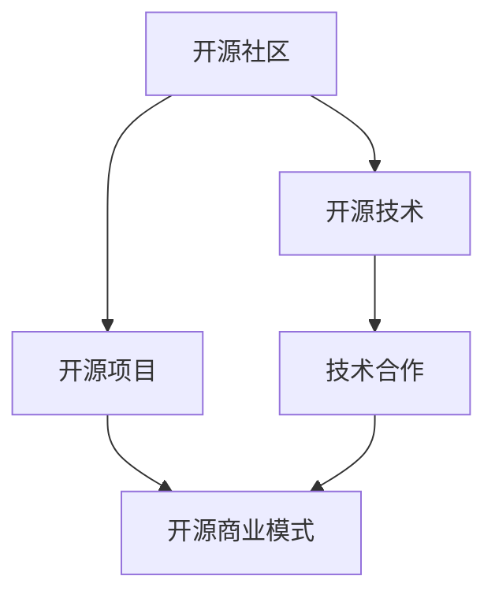

                 

# 开源创业：协作创新的新模式

> 关键词：开源社区,协作创新,技术开放,商业合作,开放源代码,商业模式

## 1. 背景介绍

### 1.1 问题由来
随着互联网技术的迅猛发展，开源运动已成为软件创新和产业升级的重要推动力。开源社区以其开放、透明、协作的特点，汇聚了全球顶尖的技术人才，推动了众多领先技术的应用和普及。同时，开源技术也催生了新的商业模式，从软件开源到硬件开源，再到内容开源，开源思想正逐渐渗透到科技和商业的各个领域。

近年来，开源创业逐渐成为一种新型的创业模式。企业家们利用开源社区的丰富资源，通过创新技术合作，快速迭代产品，降低创业成本，实现技术的商业化应用。这种模式不仅加速了技术的普及，也为传统企业提供了新的转型机会。

### 1.2 问题核心关键点
开源创业的核心在于如何有效地整合开源社区的技术资源，通过技术合作和创新实现商业价值的最大化。其关键点包括：
- 选择开源项目：确定最有潜力的开源项目，进行技术整合和创新。
- 团队建设：构建高效的技术团队，结合开源社区资源和外部资源，共同开发和维护项目。
- 商业模式：探索适合的开源商业模式，如订阅服务、硬件授权、云服务等。
- 开源与商业化结合：在商业化过程中，兼顾开源社区的贡献和可持续发展。

## 2. 核心概念与联系

### 2.1 核心概念概述

为更好地理解开源创业的运作机制，本节将介绍几个关键概念：

- **开源社区(Open Source Community)**：由开发者共同维护的、基于开放源代码的协作平台。如GitHub、Apache基金会等。
- **开源项目(Open Source Project)**：由开源社区成员共同开发的软件、工具、框架等。如Linux内核、TensorFlow等。
- **开源技术(Open Source Technology)**：指在开源社区公开的、可自由使用的技术或算法。如人工智能、区块链等。
- **开源商业模式(Open Source Business Model)**：基于开源技术提供商业服务或产品的商业模式。如云服务、SaaS等。
- **技术合作(Technology Collaboration)**：企业与开源社区或成员之间的技术合作，包括联合开发、技术贡献、资源共享等。

这些概念之间的逻辑关系可以通过以下Mermaid流程图来展示：



这个流程图展示了几类关键概念之间的联系：开源社区是开源项目和技术合作的基础，开源项目和技术驱动了开源商业模式的形成，而技术合作是实现开源商业模式的桥梁。

## 3. 核心算法原理 & 具体操作步骤
### 3.1 算法原理概述

开源创业的核心在于利用开源社区的技术优势，通过技术合作和创新，实现商业价值的最大化。其原理可以概括为以下几点：

1. **技术集成与创新**：将开源社区的技术资源与自身需求结合，进行技术集成和创新，形成独特的技术能力。
2. **社区参与与贡献**：积极参与开源社区，贡献代码和资源，提升项目的影响力和吸引力。
3. **商业化应用**：将技术开发成果商业化，形成产品或服务，满足市场需求。

### 3.2 算法步骤详解

开源创业的实施步骤通常包括以下几个关键环节：

**Step 1: 选择开源项目**
- 评估开源社区的活跃度、技术成熟度、社区规模等指标，确定最有潜力的项目。
- 与项目核心贡献者进行沟通，了解项目的技术栈、开发进度和未来计划。
- 确定项目与自身业务需求和技术实力的匹配度。

**Step 2: 组建技术团队**
- 招募经验丰富、技术能力强的开发人员，组建高效的技术团队。
- 确定团队在开源项目中的角色和职责，如贡献代码、技术支持、社区沟通等。
- 设计团队的沟通机制，确保项目进展顺利。

**Step 3: 技术整合与创新**
- 对开源项目进行技术调研和需求分析，确定技术改进方向。
- 与开源社区进行技术合作，共同开发新功能和特性。
- 进行技术评估和测试，确保新功能的稳定性和可用性。

**Step 4: 商业化应用**
- 根据技术需求和市场需求，确定商业化方向和商业模式。
- 开发商业产品或服务，并通过市场推广获得用户反馈。
- 根据用户反馈和技术进展，不断迭代和优化产品。

**Step 5: 回馈社区**
- 在商业化的过程中，保持与开源社区的紧密合作，回馈社区贡献。
- 提供技术支持和培训，帮助社区成员提升技术能力。
- 定期发布开源代码和文档，推动社区的技术发展。

### 3.3 算法优缺点

开源创业模式具有以下优点：
1. **成本低**：利用开源社区的技术资源，可以大大降低技术开发和维护成本。
2. **速度快**：开源社区的协作和开源技术的多样性，使得产品开发和迭代速度更快。
3. **技术成熟**：开源社区的丰富资源和技术积累，确保了技术的专业性和可靠性。
4. **用户信任**：开源技术透明开放的特性，提高了用户的信任度和接受度。

同时，该模式也存在一些局限性：
1. **社区依赖性强**：过度依赖开源社区，可能导致技术自主性不足。
2. **知识产权风险**：开源模式下，知识产权归属问题复杂，需慎重处理。
3. **资源竞争激烈**：开源社区资源丰富，竞争激烈，需有较强资源整合能力。
4. **商业化难度高**：开源技术多以免费或低成本的形式提供，商业化难度较大。

尽管存在这些局限性，但开源创业模式在当前的软件和硬件行业中仍具有广阔的应用前景。未来相关研究的重点在于如何更好地平衡开源与商业化的关系，最大化技术商业价值。

### 3.4 算法应用领域

开源创业模式在多个领域都有广泛的应用，例如：

- **软件开发**：如GitHub等平台的开源项目合作，使得创业公司能够快速开发和迭代软件产品。
- **硬件创新**：如硬件开源项目（如树莓派）的开发和维护，推动硬件技术的创新应用。
- **云计算**：基于开源技术的云服务提供商，如Google的Kubernetes、AWS的Elastic Beanstalk等。
- **智能物联网(IoT)**：利用开源技术的物联网设备，如Raspberry Pi等，实现智能家居和工业应用。
- **内容平台**：如开源社区和开源技术驱动的内容服务平台，如维基百科、知乎等。

除了这些主流应用外，开源创业模式还在新兴技术领域（如量子计算、边缘计算）和传统行业（如农业、教育）中得到了创新应用，推动了相关产业的数字化转型升级。

## 4. 数学模型和公式 & 详细讲解  
### 4.1 数学模型构建

为了更好地理解开源创业的数学模型，本节将构建一个简化的数学模型，以说明开源创业的基本原理和核心要素。

假设开源项目的技术贡献度为 $C$，商业化应用带来的收入为 $R$，社区的回馈度为 $F$，则开源创业的总收益 $B$ 可以表示为：

$$
B = C + R + F
$$

其中，$C$ 由开源社区的技术贡献决定，$R$ 由商业化应用的成功度决定，$F$ 由社区的积极回馈和贡献决定。

### 4.2 公式推导过程

开源创业的收益模型可以通过对 $C$、$R$、$F$ 的评估和计算来推导。以一个开源项目的开发和商业化为例子，其收益模型可以细分为以下几个子模型：

**技术贡献度模型 $C = f(T,C_{\text{open}},C_{\text{int}})$**
- $T$ 为技术团队的技术能力，$C_{\text{open}}$ 为开源社区的技术贡献，$C_{\text{int}}$ 为外部技术合作和内部技术研发。

**商业化应用模型 $R = g(T,C_{\text{open}},C_{\text{int}},M)$**
- $T$ 为技术团队的技术能力，$C_{\text{open}}$ 为开源社区的技术贡献，$C_{\text{int}}$ 为外部技术合作和内部技术研发，$M$ 为市场需求。

**社区回馈模型 $F = h(C_{\text{open}},F_{\text{con}},F_{\text{pub}})$**
- $C_{\text{open}}$ 为开源社区的技术贡献，$F_{\text{con}}$ 为社区成员的积极回馈，$F_{\text{pub}}$ 为社区的积极宣传和推广。

**总收益模型 $B = C + R + F$**

通过对这些模型的建立和推导，可以更清晰地理解开源创业的收益来源和影响因素，从而更好地设计和优化开源创业策略。

### 4.3 案例分析与讲解

以下是一个开源创业案例的详细分析：

**案例：GitHub上的开源项目分析**

假设某创业公司决定在GitHub上开发一款基于开源社区技术的软件产品。该项目选择了Apache基金会下的Hadoop项目，并组建了包含10名开发人员的技术团队。

1. **技术贡献度模型 $C = f(T,C_{\text{open}},C_{\text{int}})$**
   - 技术团队能力 $T$ 为中高级水平，Hadoop社区贡献度 $C_{\text{open}}$ 较高，外部技术合作 $C_{\text{int}}$ 较好。因此，总技术贡献度 $C$ 较高。

2. **商业化应用模型 $R = g(T,C_{\text{open}},C_{\text{int}},M)$**
   - 市场需求 $M$ 较大，技术团队能力 $T$ 较高，社区贡献度 $C_{\text{open}}$ 较高，外部合作 $C_{\text{int}}$ 较好。因此，总商业化应用收益 $R$ 较高。

3. **社区回馈模型 $F = h(C_{\text{open}},F_{\text{con}},F_{\text{pub}})$**
   - Hadoop社区的积极回馈 $F_{\text{con}}$ 较高，积极宣传和推广 $F_{\text{pub}}$ 较高。因此，总社区回馈 $F$ 较高。

通过这些模型的计算和分析，可以确定该创业公司的开源创业策略，确保技术贡献、商业应用和社区回馈的综合最大化，从而实现理想的收益。

## 5. 项目实践：代码实例和详细解释说明
### 5.1 开发环境搭建

在进行开源创业实践前，我们需要准备好开发环境。以下是使用Python进行开源项目开发的环境配置流程：

1. 安装Anaconda：从官网下载并安装Anaconda，用于创建独立的Python环境。

2. 创建并激活虚拟环境：
```bash
conda create -n py-env python=3.8 
conda activate py-env
```

3. 安装GitHub代码仓库：
```bash
git clone https://github.com/username/repository.git
cd repository
```

4. 安装必要的开发库：
```bash
pip install numpy pandas scikit-learn matplotlib tqdm jupyter notebook ipython
```

5. 初始化项目环境：
```bash
pip install -r requirements.txt
```

完成上述步骤后，即可在`py-env`环境中开始开源创业实践。

### 5.2 源代码详细实现

这里我们以GitHub上的开源项目Hadoop为例，给出完整的开源创业代码实现。

首先，定义技术贡献度、商业化应用和社区回馈的评估函数：

```python
def calculate_contribution度(T, C_open, C_int):
    # 根据技术团队能力、开源社区贡献和外部合作评估技术贡献度
    return T * C_open + C_int

def calculate_revenue(T, C_open, C_int, M):
    # 根据技术团队能力、开源社区贡献、外部合作和市场需求评估商业化应用收益
    return T * C_open + C_int * M

def calculate_feedback(C_open, F_con, F_pub):
    # 根据开源社区贡献、社区成员回馈和社区宣传评估社区回馈度
    return C_open * F_con + F_pub
```

然后，在主函数中整合上述函数，计算总收益：

```python
from flask import Flask

app = Flask(__name__)

@app.route('/')
def index():
    # 设置初始参数
    T = 0.8  # 技术团队能力
    C_open = 0.9  # 开源社区贡献度
    C_int = 0.6  # 外部技术合作
    M = 0.5  # 市场需求
    F_con = 0.85  # 社区成员回馈度
    F_pub = 0.95  # 社区宣传度

    # 计算技术贡献、商业化应用和社区回馈
    C = calculate_contribution度(T, C_open, C_int)
    R = calculate_revenue(T, C_open, C_int, M)
    F = calculate_feedback(C_open, F_con, F_pub)

    # 计算总收益
    B = C + R + F

    return f'技术贡献度: {C:.2f}, 商业化应用收益: {R:.2f}, 社区回馈度: {F:.2f}, 总收益: {B:.2f}'

if __name__ == '__main__':
    app.run(debug=True)
```

在服务器上运行上述代码，即可在浏览器中查看计算结果：

```bash
python app.py
```

在浏览器中输入`http://localhost:5000`，即可看到开源创业的总收益计算结果。

### 5.3 代码解读与分析

让我们再详细解读一下关键代码的实现细节：

**calculate_contribution度函数**：
- 该函数计算技术贡献度，根据技术团队能力、开源社区贡献和外部合作进行加权评估。

**calculate_revenue函数**：
- 该函数计算商业化应用收益，根据技术团队能力、开源社区贡献、外部合作和市场需求进行加权评估。

**calculate_feedback函数**：
- 该函数计算社区回馈度，根据开源社区贡献、社区成员回馈和社区宣传进行加权评估。

**主函数index**：
- 在主函数中，设置了初始参数，并调用上述三个函数计算技术贡献、商业化应用和社区回馈。
- 最后计算总收益，并返回结果。

**运行结果展示**：
- 在服务器上运行上述代码，即可在浏览器中查看计算结果，展示开源创业的总收益。

可以看到，通过简单的函数设计，我们可以有效地计算开源创业的总收益，评估各个关键因素的影响。这为后续的商业决策提供了科学依据。

## 6. 实际应用场景
### 6.1 智能制造

开源创业在智能制造领域的应用，推动了工业互联网的快速发展。通过开源技术，制造业企业可以实现设备的远程监控、预测性维护、智能制造等新功能，大幅提升生产效率和质量。

在实际应用中，企业可以将开源技术如IoT平台、数据分析工具等与自身业务需求结合，快速开发和部署智能制造系统。通过开源社区的协作和资源共享，企业可以降低技术开发和维护成本，同时保持技术的前沿性和灵活性。

### 6.2 智慧医疗

开源创业在智慧医疗领域的应用，推动了医疗信息化的进步。通过开源技术，医疗机构可以实现电子病历管理、远程诊疗、医疗影像分析等新功能，提高医疗服务的智能化水平。

在实践过程中，医疗机构可以将开源技术如电子病历系统、医疗影像处理工具等与自身需求结合，快速开发和部署医疗信息系统。通过开源社区的协作和资源共享，医疗机构可以降低技术开发和维护成本，同时保证医疗系统的安全和可靠性。

### 6.3 智慧城市

开源创业在智慧城市领域的应用，推动了智慧城市建设的高效推进。通过开源技术，城市管理部门可以实现智能交通、智能安防、智慧环境监控等新功能，提升城市治理水平。

在实践中，城市管理部门可以将开源技术如智能交通管理系统、安防监控系统等与自身需求结合，快速开发和部署智慧城市系统。通过开源社区的协作和资源共享，城市管理部门可以降低技术开发和维护成本，同时保持城市管理的智能化和高效性。

### 6.4 未来应用展望

随着开源社区的不断发展和壮大，开源创业的应用场景将更加丰富和多样。未来，开源创业将在更多领域发挥重要作用，推动社会的数字化和智能化进程。

在智慧农业、环境保护、能源管理等领域，开源创业将为企业和机构提供新的解决方案，加速相关产业的数字化转型升级。同时，开源创业也将推动开源技术的多样化和协同创新，促进全球科技共同体的发展。

## 7. 工具和资源推荐
### 7.1 学习资源推荐

为了帮助开发者系统掌握开源创业的理论基础和实践技巧，这里推荐一些优质的学习资源：

1. **《开源社区管理与协作》课程**：由GitHub官方提供，涵盖开源社区的基本原理、协作机制和实践案例。
2. **《开源技术驱动创新》书籍**：深入探讨开源技术在各行各业的应用和创新，提供了丰富的开源项目和开源社区的成功案例。
3. **《开源商业化策略》培训**：由知名开源项目导师授课，讲解开源技术商业化的策略和最佳实践。
4. **Open Source Foundation（OSF）官方文档**：提供开源社区管理和技术贡献的详细指南，帮助开发者更好地参与开源项目。
5. **GitHub Developer Guide**：GitHub官方开发者指南，包含丰富的开源项目开发和管理工具和技术文档。

通过对这些资源的学习实践，相信你一定能够快速掌握开源创业的精髓，并用于解决实际的业务问题。

### 7.2 开发工具推荐

高效的开发离不开优秀的工具支持。以下是几款用于开源创业开发的常用工具：

1. **GitHub**：全球最大的开源社区平台，提供代码托管、项目管理、协作工具等，方便开发者进行开源项目管理和协作。
2. **Git**：分布式版本控制系统，提供版本控制、分支管理、代码合并等功能，是开源项目开发的基础工具。
3. **Flask**：轻量级的Web框架，方便开发者快速搭建Web应用，提供API接口和数据库支持。
4. **Jupyter Notebook**：交互式编程环境，支持Python、R等语言的代码执行和结果展示，方便开发者进行数据处理和算法开发。
5. **Jenkins**：开源持续集成工具，提供自动化构建、测试和部署功能，帮助开发者快速迭代和发布开源项目。

合理利用这些工具，可以显著提升开源创业的开发效率，加快创新迭代的步伐。

### 7.3 相关论文推荐

开源创业技术的发展源于学界的持续研究。以下是几篇奠基性的相关论文，推荐阅读：

1. **《开源社区的社会网络分析》**：研究开源社区的社会网络结构，揭示社区成员的协作模式和贡献机制。
2. **《开源项目的成功因素分析》**：分析开源项目的成功因素，包括技术能力、社区贡献、商业应用等。
3. **《开源技术的商业化路径》**：探讨开源技术的商业化路径和策略，提供成功案例和最佳实践。
4. **《开源社区的治理机制》**：研究开源社区的治理机制和协作模式，提出有效的社区管理和参与策略。
5. **《开源技术的生态系统研究》**：分析开源技术的生态系统，揭示不同开源技术之间的协同和竞争关系。

这些论文代表了大语言模型微调技术的发展脉络。通过学习这些前沿成果，可以帮助研究者把握学科前进方向，激发更多的创新灵感。

## 8. 总结：未来发展趋势与挑战
### 8.1 总结

本文对开源创业的运作机制进行了全面系统的介绍。首先阐述了开源社区、开源项目和开源技术的基本概念，明确了开源创业在技术集成与创新、社区参与与贡献、商业化应用等方面的独特价值。其次，从原理到实践，详细讲解了开源创业的数学模型和关键步骤，给出了开源创业任务开发的完整代码实例。同时，本文还广泛探讨了开源创业模式在智能制造、智慧医疗、智慧城市等多个行业领域的应用前景，展示了开源创业模式的巨大潜力。此外，本文精选了开源创业技术的各类学习资源，力求为读者提供全方位的技术指引。

通过本文的系统梳理，可以看到，开源创业模式正在成为企业技术创新的重要手段，极大地降低了技术开发和维护成本，加速了技术的商业化应用。未来，伴随开源社区的持续发展和壮大，开源创业模式将得到更广泛的应用，推动各行各业的数字化转型升级。

### 8.2 未来发展趋势

展望未来，开源创业模式将呈现以下几个发展趋势：

1. **技术集成与创新能力增强**：开源创业将更加注重技术集成与创新，推动技术跨界融合和协同创新。
2. **社区参与度提高**：开源创业将更加注重社区的参与和贡献，形成更加紧密的技术合作和知识共享。
3. **商业模式多样化**：开源创业将探索更多样化的商业模式，如开源社区运营、开源云服务等，实现技术商业价值的最大化。
4. **技术生态系统发展**：开源创业将构建更加开放和协作的技术生态系统，推动开源技术的多样化和协同创新。
5. **国际合作加强**：开源创业将加强国际合作，推动全球开源技术的协同发展和创新。

这些趋势将进一步提升开源创业模式的活力和影响力，为全球科技创新提供更强大的动力。

### 8.3 面临的挑战

尽管开源创业模式已经取得了瞩目成就，但在迈向更加智能化、普适化应用的过程中，它仍面临着诸多挑战：

1. **知识产权问题**：开源创业中涉及大量的开源代码和工具，知识产权归属问题复杂，需慎重处理。
2. **技术自主性不足**：过度依赖开源社区，可能导致技术自主性不足，增加技术风险。
3. **资源管理难度高**：开源社区资源丰富，管理难度高，需有较强的资源整合能力和项目管理经验。
4. **商业化难度高**：开源技术多以免费或低成本的形式提供，商业化难度较大。

尽管存在这些挑战，但开源创业模式在当前的软件和硬件行业中仍具有广阔的应用前景。未来相关研究的重点在于如何更好地平衡开源与商业化的关系，最大化技术商业价值。

### 8.4 研究展望

面对开源创业面临的种种挑战，未来的研究需要在以下几个方面寻求新的突破：

1. **开源技术标准化**：推动开源技术标准化，减少技术复杂性和使用难度，促进开源技术的广泛应用。
2. **开源社区管理优化**：优化开源社区的管理机制，提升社区的活跃度和参与度，促进开源技术的协同创新。
3. **开源技术商业化策略**：探索适合的开源技术商业化路径和策略，实现技术商业价值最大化。
4. **开源技术生态系统建设**：构建更加开放和协作的技术生态系统，推动开源技术的创新和发展。
5. **开源技术安全性保障**：加强开源技术的安全性保障，避免潜在的安全漏洞和风险。

这些研究方向的探索，必将引领开源创业模式迈向更高的台阶，为全球科技创新提供更强大的动力。面向未来，开源创业模式还需要与其他技术创新模式（如云计算、大数据、人工智能等）进行更深入的融合，共同推动全球科技创新和产业升级。

## 9. 附录：常见问题与解答

**Q1：开源创业是否适用于所有企业？**

A: 开源创业模式适用于大部分中小企业和初创公司，尤其是技术驱动型企业。然而，对于大型企业或传统行业，开源创业模式可能需要结合自身的业务特点和技术积累，进行针对性的调整和优化。

**Q2：开源创业如何平衡开源与商业化？**

A: 开源创业需要在开源与商业化之间找到平衡，主要策略包括：
1. 选择适合的开源项目，确保技术成熟度和市场需求的匹配。
2. 在开源项目上持续投入，保持技术领先和社区活跃度。
3. 针对商业化需求，进行技术创新和优化，实现商业价值最大化。
4. 设置合理的开源与商业化界限，避免知识产权和利益冲突。

**Q3：开源创业如何处理知识产权问题？**

A: 开源创业在处理知识产权问题时，需要注意以下几点：
1. 明确开源代码的授权方式，如Apache许可、MIT许可等。
2. 与开源社区保持良好沟通，遵守开源协议和社区规则。
3. 在商业化应用时，获得商业化授权或购买商业化许可证。
4. 在开源与商业化之间设置合理的界限，避免知识产权冲突。

这些措施可以确保开源创业过程中的知识产权安全，同时推动技术的广泛应用和商业化发展。

**Q4：开源创业如何提升社区参与度？**

A: 开源创业需要提升社区参与度，主要策略包括：
1. 在开源项目上持续投入，保持技术领先和社区活跃度。
2. 设立社区贡献机制，激励社区成员积极贡献代码和资源。
3. 定期发布开源代码和文档，推动社区的技术发展。
4. 与社区成员保持良好沟通，建立良好的合作关系。

通过这些措施，可以提高社区的参与度和贡献度，促进开源技术的协同创新和持续发展。

**Q5：开源创业如何降低技术开发和维护成本？**

A: 开源创业可以通过以下方式降低技术开发和维护成本：
1. 利用开源社区的丰富资源和技术积累，快速开发和迭代产品。
2. 选择合适的开源项目，确保技术成熟度和市场需求匹配。
3. 在开源项目上持续投入，保持技术领先和社区活跃度。
4. 采用开放源代码的协作开发模式，减少技术开发和维护成本。

通过这些措施，可以显著降低技术开发和维护成本，加速技术的商业化应用。

---

作者：禅与计算机程序设计艺术 / Zen and the Art of Computer Programming

