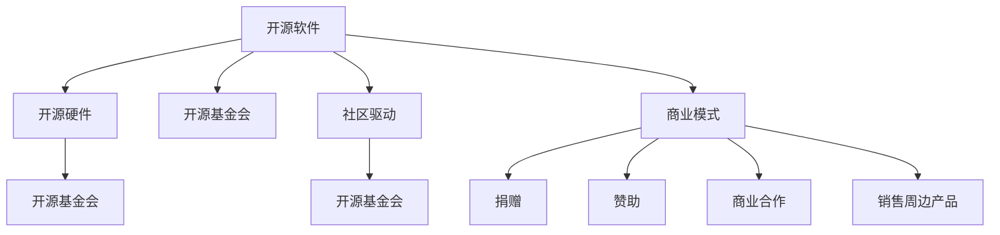

                 

# 开源运动的商业模式创新:开源软件和开源硬件

开源运动（Open Source Movement）自1998年Linux内核首次发布以来，已经从软件领域扩展到硬件、数据库、操作系统、平台等多个领域，不仅改变了软件产业，还影响了整个科技行业的创新模式。开源不仅仅是一个技术实践，更是一种创新的商业模式，本文将深入探讨开源软件和开源硬件的商业模式创新。

## 1. 背景介绍

### 1.1 问题由来
在20世纪末，由于互联网技术的飞速发展，全球计算机和软件行业发生了重大变革。原本由单一厂商控制的软件代码被开放出来，用户能够自由使用、修改和分享代码。这种开放、共享的理念催生了开源软件和硬件的诞生。开源项目不仅提供了低成本的软件解决方案，还促进了社区合作，推动了技术创新。

### 1.2 问题核心关键点
开源软件和硬件之所以成功，源于其创新性的商业模式，包括但不限于以下关键点：
- **共享与协作**：通过开放源代码，用户可以自由使用和修改代码，实现共享与协作。
- **社区驱动**：社区的积极参与和贡献，是开源项目持续发展的动力。
- **商业模式创新**：传统的商业软件往往存在价格高昂、更新慢等问题，开源模式提供了更为灵活、自由的软件解决方案。
- **生态系统构建**：开源项目常常形成了一个完整的生态系统，包括用户、开发者、企业和政府。

### 1.3 问题研究意义
探讨开源软件和硬件的商业模式创新，对理解现代科技产业的创新模式具有重要意义。开源不仅改变了软件和硬件的开发和分发方式，还推动了互联网文化、创新生态和社会治理方式的变革。

## 2. 核心概念与联系

### 2.1 核心概念概述

为了更清晰地理解开源软件和硬件的商业模式创新，我们将介绍几个关键概念：

- **开源软件（Open Source Software, OSS）**：指其源代码公开，用户可以自由访问、使用、修改和分享的软件。
- **开源硬件（Open Source Hardware, OSH）**：指其设计文档和源代码公开，用户可以自由访问、使用、修改和分享硬件产品。
- **开源基金会（Open Source Foundation）**：作为推动开源项目发展的组织，负责管理项目资金、资源和合作。
- **社区驱动（Community-Driven）**：开源项目通常由志愿者和社区成员共同驱动，以社区为中心发展。
- **商业模式（Business Model）**：开源项目的盈利方式，如捐赠、赞助、商业合作、销售周边产品等。

这些概念之间的逻辑关系可以通过以下Mermaid流程图来展示：



这个流程图展示出开源软件和硬件的基本概念及其之间的关系：

1. 开源软件和硬件通过开源基金会管理。
2. 开源项目通常以社区驱动为主。
3. 开源项目有多个盈利方式，包括捐赠、赞助、商业合作和销售周边产品。

## 3. 核心算法原理 & 具体操作步骤

### 3.1 算法原理概述

开源软件和硬件的商业模式创新主要围绕其独特的开放性展开，下面将详细介绍其核心算法原理：

- **分布式协作**：开源软件和硬件项目通常由全球各地的开发者共同参与。开发者可以在自己的时间和设备上编写代码，形成大规模的协作网络。
- **版本控制**：使用如Git、SVN等版本控制系统，记录每一次代码的修改，方便追踪和协作。
- **许可证协议**：开源项目通常使用如Apache、MIT等宽松的许可证协议，允许用户自由使用和修改代码。
- **持续集成和部署**：采用如Jenkins、Travis CI等工具实现持续集成，确保代码的质量和稳定性。

### 3.2 算法步骤详解

开源软件和硬件的商业模式创新包括多个关键步骤：

**Step 1: 创建开源项目**
- 选择一个开源许可证，并明确项目的目标和范围。
- 组建团队，明确项目开发计划和时间表。
- 使用Git等版本控制系统建立代码仓库，并进行初始化。

**Step 2: 社区参与与贡献**
- 在项目网站上发布项目进展和代码更新。
- 鼓励用户提交代码、文档和问题反馈，并通过社区讨论解决问题。
- 定期发布版本，并通过官方渠道公开代码。

**Step 3: 资金获取与合作**
- 通过社区贡献、捐赠、赞助和商业合作等方式获得资金支持。
- 与企业、政府和教育机构合作，推动项目发展和应用。
- 开发周边产品，如硬件的配套工具、软件的界面定制等，增加收入。

**Step 4: 应用推广与生态建设**
- 通过开源社区、技术论坛和博客等渠道推广项目。
- 与开源社区和其他开源项目建立合作关系，共享资源和知识。
- 建立完整的开源生态系统，包括用户、开发者、企业和政府。

**Step 5: 商业化和盈利**
- 通过商业合作、销售周边产品等方式实现盈利。
- 保留核心代码的开放性，同时提供商业化服务和技术支持。

### 3.3 算法优缺点

开源软件和硬件的商业模式创新具有以下优点：
1. **低成本**：用户无需购买软件或硬件，使用成本低。
2. **高效协作**：全球各地的开发者可以共同参与，提高开发效率。
3. **持续创新**：开放性使得社区成员可以自由修改和改进代码，推动技术持续创新。
4. **广泛应用**：开源项目通常被广泛应用，有良好的市场和生态支持。

同时，该模式也存在一些缺点：
1. **质量参差不齐**：由于参与者众多，代码质量和规范性可能参差不齐。
2. **维护成本高**：开源项目需要大量人力和资源维护，成本较高。
3. **商业化困难**：虽然有盈利方式，但开源项目往往难以实现大规模商业化。

尽管存在这些缺点，开源软件和硬件的商业模式创新依然在不断推动技术发展和应用普及。

### 3.4 算法应用领域

开源软件和硬件的商业模式创新已经在多个领域得到广泛应用，包括但不限于：

- **操作系统**：如Linux、Windows Server等操作系统，均基于开源技术。
- **数据库**：如MySQL、PostgreSQL等开源数据库系统，被广泛应用于企业级应用。
- **软件开发工具**：如Git、Jenkins等开源工具，极大地推动了软件开发的自动化和协作。
- **硬件开发**：如Arduino、Raspberry Pi等开源硬件平台，被广泛用于教育和工业自动化。
- **网络协议**：如HTTP、TCP等网络协议，均基于开源技术，被全球互联网广泛使用。

## 4. 数学模型和公式 & 详细讲解  
### 4.1 数学模型构建

本节将使用数学语言对开源软件和硬件的商业模式创新进行更加严格的刻画。

假设开源项目A的需求为$D_A$，开发成本为$C_A$，社区的投入为$I_A$，合作伙伴的支持为$S_A$，销售周边产品的收入为$R_A$。开源项目的商业模型可以用以下公式表示：

$$
R_A = D_A - C_A + I_A + S_A + R_A
$$

其中：
- $D_A$：用户对项目的需求
- $C_A$：项目的开发成本
- $I_A$：社区的投入
- $S_A$：合作伙伴的支持
- $R_A$：销售周边产品的收入

### 4.2 公式推导过程

我们将上述公式进行进一步推导：

1. **用户需求**：$D_A = d_A \times k$，其中$d_A$为基本用户需求，$k$为社区和合作伙伴的贡献率。
2. **开发成本**：$C_A = c_A \times k$，其中$c_A$为固定开发成本，$k$为社区和合作伙伴的贡献率。
3. **社区投入**：$I_A = i_A \times k$，其中$i_A$为社区投入的资源。
4. **合作伙伴支持**：$S_A = s_A \times k$，其中$s_A$为合作伙伴的支持。
5. **销售周边产品收入**：$R_A = r_A \times k$，其中$r_A$为销售周边产品的收入。

将以上公式代入总模型：

$$
R_A = (d_A + i_A + s_A + r_A) \times k - (c_A + c_A) \times k + i_A \times k + s_A \times k + r_A \times k
$$

简化得：

$$
R_A = (d_A + i_A + s_A + r_A) \times k - (c_A + c_A) \times k + (i_A + s_A + r_A) \times k
$$

最终得：

$$
R_A = (d_A + i_A + s_A + r_A) \times k - 2 \times c_A \times k + (i_A + s_A + r_A) \times k
$$

进一步简化：

$$
R_A = d_A \times k + (2 \times i_A + s_A + r_A) \times k - 2 \times c_A \times k
$$

因此，开源项目的商业模型主要由用户需求、社区投入、合作伙伴支持、销售周边产品收入和开发成本共同决定。

### 4.3 案例分析与讲解

以Linux操作系统为例，进行开源商业模式创新的详细讲解：

**需求**：全球数亿用户对操作系统的高需求。
**开发成本**：初期开发成本高，但随着社区和合作伙伴的加入，开发成本逐步降低。
**社区投入**：全球开发者和志愿者积极参与，贡献代码和文档。
**合作伙伴支持**：众多企业、政府和教育机构使用和推广Linux，提供支持和资金。
**销售周边产品收入**：发行Linux内核周边产品，如硬件设备、发行版定制等，增加收入。

最终，Linux操作系统通过低成本、高效协作和持续创新，成为全球广泛使用的操作系统。

## 5. 项目实践：代码实例和详细解释说明
### 5.1 开发环境搭建

要进行开源软件和硬件的商业模式创新项目实践，需要搭建相应的开发环境。以下是使用Python进行开源项目的开发环境配置流程：

1. 安装Anaconda：从官网下载并安装Anaconda，用于创建独立的Python环境。

2. 创建并激活虚拟环境：
```bash
conda create -n open-source-env python=3.8 
conda activate open-source-env
```

3. 安装必要的Python库：
```bash
pip install numpy pandas matplotlib scipy
```

4. 安装Git、SVN等版本控制系统：
```bash
sudo apt-get install git
sudo apt-get install subversion
```

5. 安装Jenkins等持续集成工具：
```bash
sudo apt-get install jenkins
```

6. 安装CI/CD所需的服务器和客户端：
```bash
sudo apt-get install jenkins-core jenkins-parallel-cascadable
```

完成上述步骤后，即可在`open-source-env`环境中开始开源项目的开发实践。

### 5.2 源代码详细实现

这里我们以Linux内核项目为例，给出使用Python和Git进行开源软件开发的代码实现。

首先，创建Git仓库并上传代码：

```bash
mkdir linux-kernel
cd linux-kernel
git init
git remote add origin https://github.com/torvalds/linux.git
git fetch
git checkout main
git merge origin/main
```

然后，在本地开发环境中编写和测试代码：

```bash
# 编写代码
nano kernel/security/audit/audit.c

# 提交代码
git add kernel/security/audit/audit.c
git commit -m "Add audit subsystem"
git push origin main
```

接着，使用Jenkins进行持续集成和部署：

```bash
# 安装Jenkins
sudo apt-get install jenkins

# 启动Jenkins
sudo service jenkins start

# 访问Jenkins管理页面
open http://localhost:8080
```

最后，配置Jenkins的持续集成流程：

```bash
# 创建Jenkins作业
Create New Item -> Freestyle project -> Linux Kernel -> Next -> Source Code Management -> Git -> Repository URL: https://github.com/torvalds/linux.git -> Save

# 配置构建步骤
Add build -> Execute shell -> Command: git pull origin main -> Save
Add build -> Execute shell -> Command: make -j4 -> Save

# 配置测试步骤
Add build -> Execute shell -> Command: bash test.sh -> Save
```

以上就是使用Python和Git进行Linux内核项目开发的完整代码实现。可以看到，通过开源工具和平台，可以高效地进行软件开发和项目管理。

### 5.3 代码解读与分析

让我们再详细解读一下关键代码的实现细节：

**Git命令**：
- `mkdir`：创建新目录。
- `cd`：切换当前工作目录。
- `git init`：初始化Git仓库。
- `git remote add`：添加远程仓库地址。
- `git fetch`：从远程仓库拉取最新的代码。
- `git checkout`：切换分支。
- `git merge`：合并分支。
- `git add`：添加文件到暂存区。
- `git commit`：提交代码到本地仓库。
- `git push`：将代码推送到远程仓库。

**Jenkins配置**：
- 安装Jenkins：通过包管理器安装Jenkins服务器。
- 启动Jenkins：启动Jenkins服务。
- 访问Jenkins管理页面：通过浏览器访问Jenkins管理界面。
- 创建Jenkins作业：选择Freestyle项目类型，输入项目名称和Git仓库地址。
- 配置构建步骤：执行Git拉取最新代码和编译内核。
- 配置测试步骤：执行自定的测试脚本，如运行内核测试程序。

通过Jenkins，可以自动构建、测试和部署开源项目，提高开发效率和代码质量。

## 6. 实际应用场景
### 6.1 开源操作系统
开源操作系统如Linux，在商业和政府领域得到了广泛应用。通过社区和合作伙伴的支持，Linux内核不断更新和优化，成为服务器、桌面和移动设备的首选操作系统。

### 6.2 开源数据库
开源数据库如MySQL、PostgreSQL等，广泛应用于企业级应用，提供高效的数据存储和管理。这些数据库的开放源代码，使得用户可以自由定制和扩展，满足了不同行业的个性化需求。

### 6.3 开源软件开发工具
开源软件开发工具如Git、Jenkins等，极大地推动了软件开发自动化和协作。Git提供了强大的版本控制功能，Jenkins实现了持续集成和自动化测试，提高了开发效率和代码质量。

### 6.4 开源硬件
开源硬件如Arduino、Raspberry Pi等，被广泛应用于工业自动化、教育和科研等领域。这些硬件平台的开源代码和设计文档，使得用户可以自由使用和改进硬件，推动了硬件创新的快速发展。

## 7. 工具和资源推荐
### 7.1 学习资源推荐

为了帮助开发者系统掌握开源软件和硬件的商业模式创新理论基础和实践技巧，这里推荐一些优质的学习资源：

1. **《开源运动的艺术》**（The Art of Open Source）：详细介绍了开源运动的发展历程和成功案例，对理解开源商业模式的演变有重要作用。
2. **《开源软件的商业化》**（The Business of Open Source）：探讨了开源软件如何通过社区和商业化实现盈利，提供了丰富的实践经验。
3. **《开源硬件的创新》**（The Innovation of Open Hardware）：分析了开源硬件的商业模式创新，提出了未来发展的方向和策略。
4. **《开源基金会的管理》**（The Management of Open Source Foundations）：介绍了开源基金会如何管理项目、资金和资源，推动项目发展。
5. **《开源项目的协作与贡献》**（Collaboration and Contribution in Open Source）：提供了开源项目协作和贡献的详细指南，帮助开发者更好地参与项目。

通过对这些资源的学习实践，相信你一定能够快速掌握开源软件和硬件的商业模式创新的精髓，并用于解决实际的开发问题。

### 7.2 开发工具推荐

高效的开发离不开优秀的工具支持。以下是几款用于开源项目开发的常用工具：

1. **Git**：分布式版本控制系统，支持多人协作和代码管理。
2. **Jenkins**：持续集成和持续部署工具，支持自动化构建和测试。
3. **Subversion**：集中式版本控制系统，提供了稳定的代码管理和协作功能。
4. **CI/CD工具链**：如Jenkins、GitLab CI/CD、Travis CI等，支持持续集成和部署。
5. **开源协作平台**：如GitHub、GitLab等，提供了代码托管、版本控制和社区协作功能。

合理利用这些工具，可以显著提升开源项目开发的效率和质量，加速创新迭代的步伐。

### 7.3 相关论文推荐

开源软件和硬件的商业模式创新源于学界的持续研究。以下是几篇奠基性的相关论文，推荐阅读：

1. **《开源软件的研究与实践》**（Research and Practice of Open Source Software）：深入分析了开源软件的发展历程和商业模式，提供了丰富的研究视角。
2. **《开源硬件的商业化和合作》**（Commercialization and Collaboration of Open Hardware）：探讨了开源硬件的商业化和合作模式，提出了创新的商业策略。
3. **《开源项目的社区治理》**（Community Governance in Open Source Projects）：分析了开源项目的社区治理模式，提出了有效的管理策略。
4. **《开源软件的社会和经济影响》**（Social and Economic Impact of Open Source Software）：研究了开源软件对社会和经济的影响，提供了数据支持。
5. **《开源硬件的生态系统构建》**（Building the Ecosystem of Open Hardware）：提出了开源硬件的生态系统构建策略，推动了硬件创新的发展。

这些论文代表了大规模软件和硬件项目的商业模式创新发展脉络。通过学习这些前沿成果，可以帮助研究者把握学科前进方向，激发更多的创新灵感。

## 8. 总结：未来发展趋势与挑战
### 8.1 研究成果总结

本文对开源软件和硬件的商业模式创新进行了全面系统的介绍。首先阐述了开源软件和硬件的起源和成功案例，明确了开源商业模式创新的核心价值。其次，从原理到实践，详细讲解了开源项目的开发、社区参与、资金获取、商业化和盈利等关键环节，给出了开源项目开发的完整代码实例。同时，本文还广泛探讨了开源项目在操作系统、数据库、软件开发工具、硬件开发等诸多领域的应用前景，展示了开源项目的巨大潜力。

通过本文的系统梳理，可以看到，开源软件和硬件的商业模式创新在推动技术发展和应用普及方面发挥了重要作用。开源不仅仅是一种技术实践，更是一种创新的商业模式，推动了全球科技行业的变革。未来，伴随开源技术的不断进步和应用普及，开源运动将进一步影响全球科技产业的发展，引领新的科技革命。

### 8.2 未来发展趋势

展望未来，开源软件和硬件的商业模式创新将呈现以下几个发展趋势：

1. **跨领域融合**：开源软件和硬件将更多地与物联网、人工智能、区块链等技术进行融合，形成跨领域创新的生态系统。
2. **国际化和本地化**：开源项目将面向全球，同时在本地化推广方面取得进展，形成全球和本地的创新合力。
3. **开源硬件生态系统建设**：开源硬件将形成完整的硬件生态系统，包括芯片、操作系统、应用程序等，满足用户多样化的需求。
4. **开源项目的商业化和盈利**：开源项目将探索更多的商业化路径，通过销售周边产品、服务订阅、生态系统构建等方式实现盈利。
5. **开源社区和组织的建设**：开源社区和组织的建设将更加完善，形成更高效的社区协作和资源共享机制。

以上趋势凸显了开源软件和硬件的商业模式创新的广阔前景。这些方向的探索发展，必将进一步推动技术发展和应用普及，为全球科技产业的发展注入新的动力。

### 8.3 面临的挑战

尽管开源软件和硬件的商业模式创新取得了显著成果，但在迈向更加智能化、普适化应用的过程中，它仍面临着诸多挑战：

1. **社区管理的复杂性**：开源项目需要处理来自全球各地社区成员的贡献和反馈，管理复杂且任务繁重。
2. **资金支持的可持续性**：开源项目需要持续的资金支持，以维持项目的发展和运营。
3. **商业化的困境**：开源项目在商业化过程中，面临着如何平衡开放性和盈利性的问题。
4. **技术迭代的挑战**：开源项目需要不断迭代和更新，以适应快速变化的技术环境。
5. **标准化和规范的缺失**：开源项目需要制定统一的技术标准和规范，以促进项目的协作和互操作性。

尽管存在这些挑战，开源软件和硬件的商业模式创新依然在不断推动技术发展和应用普及。未来，开源项目需要在管理、资金、商业化和技术标准化等方面进行深入研究，以克服当前面临的挑战，实现可持续发展。

### 8.4 研究展望

面对开源软件和硬件的商业模式创新所面临的挑战，未来的研究需要在以下几个方面寻求新的突破：

1. **社区管理和协作**：开发更高效的开源社区管理工具和协作机制，提升社区贡献和反馈的效率。
2. **开源项目的可持续发展**：制定更完善的开源项目资金支持和管理策略，确保项目的长期发展。
3. **开源项目的商业化**：探索更多的商业化路径和盈利模式，实现开源项目的商业化可持续发展。
4. **技术迭代和更新**：建立更灵活的技术迭代和更新机制，以适应快速变化的技术环境。
5. **标准化和规范**：制定统一的技术标准和规范，促进项目的协作和互操作性。

这些研究方向的探索，必将引领开源软件和硬件的商业模式创新进入新的高度，为全球科技产业的发展注入新的动力。只有勇于创新、敢于突破，才能不断拓展开源项目的边界，让开源技术更好地造福全球科技产业。

## 9. 附录：常见问题与解答

**Q1：开源软件和硬件是否需要开源许可证？**

A: 是的，开源软件和硬件需要开源许可证。许可证规定了代码的使用、修改和分发方式，保障了开源社区和用户的权利。

**Q2：开源软件和硬件是否有商业化的可能？**

A: 是的，开源软件和硬件可以通过商业合作、销售周边产品等方式实现盈利。但需要注意的是，商业化过程中需要平衡开放性和盈利性，避免过度商业化。

**Q3：开源软件和硬件的开发成本如何降低？**

A: 开源软件和硬件的开发成本可以通过社区贡献、捐赠、赞助等方式降低。同时，开源项目的代码和文档可以被广泛使用和修改，节省了开发成本。

**Q4：开源软件和硬件的商业模型有哪些？**

A: 开源软件和硬件的商业模型包括捐赠、赞助、商业合作、销售周边产品等。不同的开源项目可以根据自己的特点选择合适的商业模型。

**Q5：开源软件和硬件的社区管理如何高效进行？**

A: 开源软件和硬件的社区管理需要建立一套完善的制度和工具，包括代码审查、问题跟踪、社区讨论等机制。合理利用GitHub、GitLab等开源协作平台，可以提高社区管理的效率。

---

作者：禅与计算机程序设计艺术 / Zen and the Art of Computer Programming

