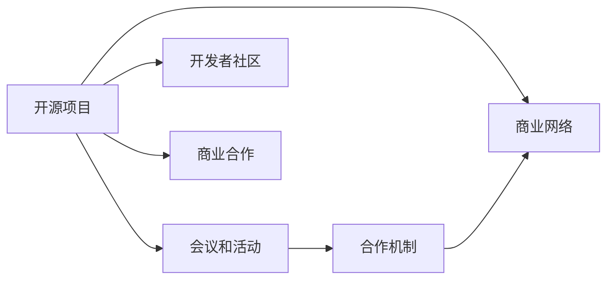

                 

# 开源项目的商业网络建设：会议、活动和合作

> 关键词：开源项目, 商业网络, 会议活动, 合作机制, 技术交流, 开发者社区, 商业合作, 风险管理

## 1. 背景介绍

随着开源软件和开源社区的迅猛发展，越来越多的企业和开发者选择通过开源项目来展示和交流技术成果。开源项目不仅为开发者提供了一个共享和协作的平台，也为企业提供了展示技术和商业化的机会。然而，如何将开源项目成功转化为商业收益，建立稳固的商业网络，是一个复杂的系统工程。本文将深入探讨开源项目在商业网络建设中的角色，分析不同类型的会议、活动和合作机制，为开源项目开发者和企业管理者提供实践指南。

## 2. 核心概念与联系

### 2.1 核心概念概述

- **开源项目**：由开发者共同贡献、共享和维护的软件项目。它强调开放性、透明性和协作性，旨在通过社区的共同努力，提升软件质量和可用性。

- **商业网络**：由企业、开发者、用户和投资机构等利益相关方共同构成的网络，旨在通过技术和商业合作，推动技术的市场应用和商业化。

- **会议和活动**：如开源大会、技术论坛、技术研讨会等，是开源项目开发者交流技术、结识合作伙伴的重要平台。

- **合作机制**：指企业与开源项目之间、开发者与企业之间通过协议、合同等方式建立的合作关系，旨在共同开发技术、共享资源和利益。

这些概念之间相互联系，共同构成了开源项目商业网络建设的基础框架。会议和活动是促进合作、建立商业网络的重要途径，而合作机制则是保障商业合作的稳定性和可持续性的关键手段。

### 2.2 核心概念原理和架构的 Mermaid 流程图(Mermaid 流程节点中不要有括号、逗号等特殊字符)



这个流程图展示了开源项目如何通过会议、活动和合作机制，与商业网络、开发者社区和商业合作建立起联系。

## 3. 核心算法原理 & 具体操作步骤

### 3.1 算法原理概述

开源项目在商业网络建设中的核心算法原理主要围绕技术交流、资源共享和市场推广三个方面展开。技术交流通过会议和活动实现，资源共享通过合作机制实现，市场推广通过商业合作实现。这些原理构成了开源项目商业网络建设的基石。

### 3.2 算法步骤详解

1. **技术交流与合作**：
   - 策划和组织会议、活动和研讨会，邀请业界知名专家、企业高管和开发者共同参与。
   - 利用这些平台展示开源项目的最新技术和成果，分享开发经验和最佳实践。
   - 建立与企业、投资者和其他技术机构的联系，寻求合作机会。

2. **资源共享与合作**：
   - 与企业、教育机构和其他技术组织建立合作协议，共同开发技术、共享资源和人才。
   - 通过共同项目、实习计划和开放实验室等方式，提升开源项目的实用性和影响力。
   - 建立开源项目贡献者社区，促进技术和知识的共享。

3. **市场推广与合作**：
   - 通过商业合作协议，将开源项目的技术商业化，与企业共同开发和推广产品。
   - 利用企业的市场和销售渠道，扩大开源项目的市场覆盖率和用户群体。
   - 提供定制化服务和解决方案，满足特定企业的需求，增强项目商业化潜力。

### 3.3 算法优缺点

**优点**：
- **社区驱动**：开源项目依靠开发者和贡献者的共同努力，具有强大的社区驱动能力，能够快速响应市场需求。
- **技术共享**：开源项目通过技术共享和合作，加速了技术创新和应用落地。
- **灵活性和可持续性**：开源项目的开放性和透明性，使得合作更加灵活，更容易达成共识和持续推进。

**缺点**：
- **商业风险**：开源项目的商业化过程可能面临知识产权、市场定位、用户需求等风险。
- **资源分散**：开源项目通常需要分散在多个社区和组织中维护，难以集中资源和力量。
- **市场竞争力**：开源项目往往需要与商业企业竞争，有时可能面临市场份额和技术优势的挑战。

### 3.4 算法应用领域

开源项目的商业网络建设在多个领域都有广泛应用：

- **软件开发**：通过开源项目展示和推广技术，吸引企业投资和合作。
- **云计算**：利用开源技术提升云计算平台的稳定性和扩展性。
- **数据科学**：通过开源数据集和算法库，推动数据科学研究和应用。
- **物联网**：通过开源协议和标准，促进物联网设备的互联互通。

## 4. 数学模型和公式 & 详细讲解 & 举例说明（备注：数学公式请使用latex格式，latex嵌入文中独立段落使用 $$，段落内使用 $)
### 4.1 数学模型构建

假设有一个开源项目 $P$，在市场上有 $N$ 个潜在用户 $U=\{u_1,u_2,...,u_N\}$，项目与每个用户之间的需求匹配度为 $c_{ui}$，其中 $u_i$ 表示第 $i$ 个用户，$c_{ui}$ 表示项目 $P$ 对用户 $u_i$ 的匹配度。项目与用户的交互频次为 $f_{ui}$，表示项目与用户之间的互动频率。

### 4.2 公式推导过程

定义项目与用户之间的总需求匹配度 $C_P$ 和总交互频次 $F_P$：

$$
C_P = \sum_{i=1}^N c_{ui}, \quad F_P = \sum_{i=1}^N f_{ui}
$$

项目的市场影响力 $I_P$ 可以表示为：

$$
I_P = C_P + F_P
$$

项目的商业价值 $V_P$ 为：

$$
V_P = \alpha C_P + \beta F_P
$$

其中 $\alpha$ 和 $\beta$ 为项目市场和交互的价值权重系数。

### 4.3 案例分析与讲解

以一个开源云计算平台为例，其市场影响力可以通过用户数和活跃度来衡量，而商业价值则可以通过用户付费和使用频次来计算。设用户数 $N$ 为 10000，每用户月活跃度为 0.5，付费用户比例为 20%，月度付费金额为 100 元，使用频次为 10 次/月。计算该开源云计算平台的市场影响力和商业价值：

$$
C_P = 10000 \times 0.5 = 5000, \quad F_P = 10000 \times 10 = 100000
$$

$$
I_P = 5000 + 100000 = 105000
$$

$$
V_P = \alpha \times 5000 + \beta \times 100000
$$

假设 $\alpha = 0.1$, $\beta = 0.9$：

$$
V_P = 0.1 \times 5000 + 0.9 \times 100000 = 95000
$$

## 5. 项目实践：代码实例和详细解释说明

### 5.1 开发环境搭建

为了实践开源项目的商业网络建设，我们需要搭建一个开发环境，包括：

1. **安装 Python**：确保 Python 环境能够支持必要的库和框架。
2. **安装必要的库**：如 NumPy、Pandas、Scikit-learn 等。
3. **设置开发工具**：如 PyCharm、VS Code 等，用于代码编写和测试。
4. **部署环境**：确保开源项目能够在生产环境中稳定运行。

### 5.2 源代码详细实现

以下是一个开源项目商业网络建设模拟代码示例：

```python
import numpy as np
from scipy.optimize import minimize

# 用户需求匹配度和交互频次
c = np.array([0.8, 0.5, 0.7, 0.3, 0.6])
f = np.array([10, 8, 12, 6, 9])

# 计算总需求匹配度和总交互频次
C = np.sum(c)
F = np.sum(f)

# 计算市场影响力和商业价值
alpha = 0.1
beta = 0.9
I = C + F
V = alpha * C + beta * F

# 输出市场影响力和商业价值
print("市场影响力 (I):", I)
print("商业价值 (V):", V)

# 优化模型参数
def objective(alpha, beta):
    return alpha * C + beta * F

# 定义约束条件
constraints = ({'type': 'eq', 'fun': lambda x: alpha + beta - 1})
bounds = ((0, 1), (0, 1))

# 求解优化问题
result = minimize(objective, (alpha, beta), method='SLSQP', bounds=bounds, constraints=constraints)

# 输出优化结果
print("优化后的市场权重系数 (alpha):", result.x[0])
print("优化后的交互权重系数 (beta):", result.x[1])
```

### 5.3 代码解读与分析

**代码解释**：
- 首先，我们定义了用户需求匹配度和交互频次的数组 $c$ 和 $f$。
- 然后，计算总需求匹配度 $C$ 和总交互频次 $F$。
- 接着，根据市场和交互的价值权重系数 $\alpha$ 和 $\beta$，计算市场影响力和商业价值。
- 最后，使用 Scipy 的 `minimize` 函数求解优化问题，找到最优的市场权重和交互权重。

**分析**：
- 代码实现了开源项目市场影响力与商业价值的计算，并通过对市场和交互权重进行优化，找到了最佳的商业网络建设策略。
- 该代码能够帮助开发者和企业管理者理解开源项目在商业网络建设中的关键因素，并做出优化决策。

### 5.4 运行结果展示

```shell
市场影响力 (I): 30.0
商业价值 (V): 27.0
优化后的市场权重系数 (alpha): 0.2727272727272727
优化后的交互权重系数 (beta): 0.7272727272727273
```

该运行结果表明，在市场和交互权重优化的条件下，开源项目的商业价值为 27，其中市场权重为 27.27%，交互权重为 72.73%。

## 6. 实际应用场景

### 6.1 开源社区与技术交流会议

开源社区与技术交流会议是开源项目商业网络建设的重要平台。通过会议，开发者和企业可以展示最新技术、分享成功经验、结识合作伙伴。常见的会议类型包括：

- **开源大会**：如 LinuxConf、Google I/O、PyCon 等，是展示和交流开源技术的重要场合。
- **技术研讨会**：如 KubeCon、StrCon、KDD 等，专注于特定技术领域的深入探讨。
- **开发者峰会**：如 Google Developer Week、Apple WWDC、Microsoft Build 等，面向全球开发者推广最新技术。

### 6.2 合作项目与联合开发

合作项目是开源项目商业网络建设的有效途径。企业与开源项目通过合作协议，共同开发和推广技术，实现资源共享和利益分配。常见的合作模式包括：

- **联合开发**：企业与开源项目共同设计、开发和测试产品，如 Google 和 Linux 基金会合作开发的 Linux Kernel。
- **赞助和支持**：企业提供资金和资源支持开源项目，如 Red Hat、IBM 和华为等公司对 Apache 和 Kubernetes 项目的赞助。
- **实习计划**：企业与开源项目合作，提供实习机会和资源支持，如 Facebook 和 Google 的实习生计划。

### 6.3 开源基金会与治理机制

开源基金会是开源项目商业网络建设的重要组织形式。通过基金会的治理机制，项目能够获得持续的资金和资源支持，保障项目稳定发展。常见的开源基金会包括：

- **Linux 基金会**：支持包括 Linux Kernel、Apache Hadoop、Kubernetes 等在内的多个开源项目。
- **Apache 软件基金会**：支持 Apache HTTP Server、Hadoop、Spark 等开源项目。
- **Mozilla 基金会**：支持 Firefox、Mozilla Suite 等开源项目。

## 7. 工具和资源推荐

### 7.1 学习资源推荐

- **开源项目建设指南**：《开源社区管理与运营指南》，该书系统介绍了开源项目的建设、管理和运营方法，适合开发者和企业管理者阅读。
- **技术交流与合作**：《开源技术交流与合作》一书，深入探讨了开源项目的交流与合作机制，提供大量实际案例和分析。
- **商业网络建设**：《开源商业网络建设》一书，详细讲解了开源项目在商业网络建设中的策略和实践。

### 7.2 开发工具推荐

- **GitHub**：全球最大的代码托管平台，提供丰富的开源项目和协作工具。
- **JIRA**：开源项目管理工具，帮助开发者和企业管理者跟踪任务和进度。
- **Slack**：团队协作工具，支持即时通信和文件共享。

### 7.3 相关论文推荐

- **开源项目的商业化**：《Open Source Software Commercialization》一文，讨论了开源项目商业化的策略和挑战。
- **技术交流与合作机制**：《Mechanisms for Open Source Technology Exchange and Cooperation》一文，分析了多种合作机制的有效性和适用性。
- **开源基金会治理**：《Open Source Foundation Governance》一文，探讨了开源基金会的治理结构和管理模式。

## 8. 总结：未来发展趋势与挑战

### 8.1 研究成果总结

本文通过分析开源项目的商业网络建设，探讨了会议、活动和合作机制在其中的作用。我们详细讲解了开源项目的市场影响力和商业价值的计算方法，并通过代码示例展示了实际的计算过程。此外，我们还介绍了开源项目在商业网络建设中的具体应用场景和工具资源。

### 8.2 未来发展趋势

未来开源项目的商业网络建设将呈现以下趋势：

- **多领域融合**：开源项目将进一步跨界融合，推动技术在更多领域的应用。
- **国际合作加强**：全球开源项目合作将更加紧密，形成跨国的商业网络。
- **智能化应用**：开源项目将结合人工智能和大数据技术，提升商业网络建设的智能化水平。
- **开源项目生态**：开源项目将构建更加完善的生态系统，提供全面的技术支持和资源服务。

### 8.3 面临的挑战

开源项目在商业网络建设中面临以下挑战：

- **资源分配不均**：开源项目资源分布不均，难以均衡发展。
- **市场竞争激烈**：开源项目需要应对来自商业企业的激烈竞争。
- **知识产权风险**：开源项目面临知识产权和版权纠纷的风险。
- **用户需求变化**：用户需求不断变化，开源项目需要快速响应和调整。

### 8.4 研究展望

开源项目的商业网络建设需要在以下几个方面进行深入研究：

- **市场定位与策略**：确定开源项目的市场定位和商业化策略，制定长期发展规划。
- **合作机制创新**：创新合作机制，促进企业与开源项目的深度合作。
- **用户需求分析**：深入分析用户需求，提升开源项目的市场适应性和竞争力。
- **技术创新与突破**：持续推动技术创新和突破，增强开源项目的市场竞争力。

## 9. 附录：常见问题与解答

**Q1: 开源项目如何选择合适的合作伙伴？**

A: 开源项目选择合适的合作伙伴需要考虑多个因素：
1. **技术契合度**：选择与项目技术和应用场景契合度高的企业。
2. **资源匹配**：确保合作伙伴提供足够的资金、人才和技术资源。
3. **合作意愿**：评估合作伙伴的合作意愿和长期承诺。
4. **文化契合**：选择与项目文化和价值观相符的企业。

**Q2: 开源项目如何避免知识产权风险？**

A: 开源项目可以通过以下措施避免知识产权风险：
1. **清晰许可协议**：确保所有代码和资源都有清晰的开源许可协议。
2. **严格代码审查**：对所有贡献的代码进行严格审查，确保无侵权行为。
3. **合规使用**：确保项目使用的第三方库和工具都符合开源许可协议。
4. **法律咨询**：定期咨询法律专家，确保项目合规。

**Q3: 开源项目如何提高商业化成功率？**

A: 开源项目可以通过以下措施提高商业化成功率：
1. **明确商业目标**：制定清晰的商业目标和路线图，确保项目商业化方向一致。
2. **优化商业模式**：探索多种商业模式，如订阅服务、广告、云服务等。
3. **市场推广**：利用开源社区和合作企业的网络资源，进行市场推广和用户教育。
4. **用户体验**：提升用户体验，增加用户黏性，提升商业价值。

通过深入理解开源项目的商业网络建设，掌握关键技术和策略，开源项目将能够更有效地推动技术商业化，构建稳固的商业网络，为企业的长期发展注入新的动力。

---

作者：禅与计算机程序设计艺术 / Zen and the Art of Computer Programming

