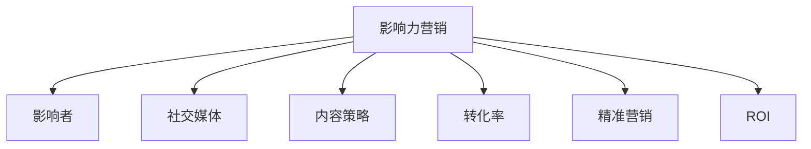

                 

# 影响力营销创业：社交媒体时代的营销利器

> 关键词：影响力营销,社交媒体,内容策略,转化率,精准营销,数字广告,ROI,用户增长

## 1. 背景介绍

在数字时代，社交媒体平台的蓬勃发展已经改变了传统的广告和营销方式。从谷歌、Facebook到Instagram、TikTok，社交媒体不仅成为品牌与消费者交流的桥梁，更成为驱动销售、影响消费者行为的重要渠道。在社交媒体平台上，个人或企业通过内容分享和互动，可以迅速提升品牌知名度、增强用户粘性、促成销售转化，实现商业价值的最大化。影响力营销作为一种新型的营销策略，正受到越来越多品牌的青睐，成为社交媒体时代营销利器。

### 1.1 问题由来

随着用户对个性化、真实性内容需求的提升，传统的广告投放方式已经无法满足消费者的期待。大量的机械式广告不仅无法引起用户的兴趣，反而容易引发反感。相反，真实可信的内容和意见领袖的影响，能够更有效地传递品牌信息，激发用户兴趣，推动销售转化。影响力营销利用了这种心理，通过借助具有高度影响力和信任度的个人或机构，将品牌信息传递给目标用户，从而达到营销目标。

### 1.2 问题核心关键点

影响力营销的核心在于通过精准的用户画像、有针对性的内容策略和高效的社交媒体平台运作，最大化地提升品牌曝光率和转化率。其关键点包括：

- 精准定位目标用户：通过数据分析和用户画像技术，识别出具有高购买潜力的目标人群。
- 打造优质内容：利用影响者或品牌的核心价值，创作有吸引力、有价值的内容，增强用户粘性。
- 选择合适的社交媒体平台：根据目标用户的偏好和使用习惯，选择最适合的社交媒体平台进行推广。
- 监测和优化：通过数据分析工具，实时监测营销活动的效果，及时调整策略，以提升ROI。

## 2. 核心概念与联系

### 2.1 核心概念概述

为更好地理解影响力营销的运作机制，本节将介绍几个核心概念：

- 影响力营销(Influencer Marketing)：通过影响者（Influencer）或知名品牌的影响力，在社交媒体上传播品牌信息，达到营销目标。
- 影响者(Influencer)：具有高社交媒体影响力，对品牌、产品或服务有深入了解，能够影响他人购买决策的个人或机构。
- 社交媒体(Social Media)：包括Facebook、Instagram、Twitter、TikTok等，用户通过分享、互动、评论等方式，形成虚拟社区，影响者在其中进行内容传播。
- 内容策略(Content Strategy)：通过制定内容创作和分发策略，实现品牌信息的精准传递和用户互动。
- 转化率(Conversion Rate)：用户从浏览到购买的比例，是衡量营销活动效果的重要指标。
- 精准营销(Targeted Marketing)：通过数据分析和用户画像，实现营销信息的目标定向传递。
- ROI(投资回报率)：营销活动的投资回报率，衡量营销活动的经济价值。

这些核心概念之间的逻辑关系可以通过以下Mermaid流程图来展示：



这个流程图展示了大语言模型的核心概念及其之间的关系：

1. 影响力营销通过影响者或品牌的影响力，在社交媒体上传播品牌信息。
2. 影响者作为品牌与用户之间的桥梁，能够增强品牌信任度。
3. 社交媒体平台提供内容传播的渠道，便于品牌进行精准推广。
4. 内容策略指导品牌内容创作和分发，实现有效沟通。
5. 转化率衡量营销活动的实际效果，反馈品牌信息传递的有效性。
6. 精准营销通过数据分析，实现用户定向和信息精准传递。
7. ROI评估营销活动的经济效益，指导营销策略调整。

这些概念共同构成了影响力营销的运作框架，使其能够有效利用社交媒体平台的优势，达到营销目标。

## 3. 核心算法原理 & 具体操作步骤
### 3.1 算法原理概述

影响力营销的核心算法原理主要基于以下几个方面：

- 影响者选择算法：通过分析影响者的社交媒体数据、用户互动情况和品牌相关性，选择最具影响力的影响者进行合作。
- 内容生成算法：根据目标用户画像和品牌信息，生成有吸引力、有价值的内容，增强用户粘性和品牌印象。
- 广告投放算法：通过精准的用户画像和社交媒体平台投放机制，实现广告的精准定向投放，提升广告点击率和转化率。
- 效果监测算法：通过数据分析工具，实时监测广告投放的效果，收集用户反馈，调整优化营销策略。

### 3.2 算法步骤详解

影响力营销的主要操作步骤包括：

**Step 1: 数据收集与分析**

- 收集目标用户的数据，包括年龄、性别、地域、兴趣偏好等。
- 分析用户数据，构建用户画像，识别出高购买潜力的目标人群。
- 分析社交媒体平台上的影响者数据，如粉丝数、互动率、品牌相关内容等。
- 选择具有高影响力的影响者，与品牌进行合作。

**Step 2: 内容创作与分发**

- 根据用户画像和品牌信息，制定内容创作策略，创作有吸引力的内容。
- 将内容通过社交媒体平台进行分发，吸引目标用户注意。
- 利用影响者的影响力，增强品牌信息的传播效果。
- 监测内容互动情况，收集用户反馈，调整内容策略。

**Step 3: 广告投放与监测**

- 根据目标用户画像和社交媒体平台特点，选择合适的广告投放策略。
- 使用社交媒体平台的广告投放工具，实现广告的精准定向投放。
- 实时监测广告投放效果，收集点击率、转化率等关键指标。
- 根据投放效果，及时调整优化广告策略。

**Step 4: 效果评估与优化**

- 根据广告投放效果和用户反馈，评估营销活动的效果。
- 使用数据分析工具，计算投资回报率(ROI)。
- 分析用户行为数据，调整优化营销策略，提高转化率。

### 3.3 算法优缺点

影响力营销作为一种新型的营销策略，具有以下优点：

- 精准定位：通过数据分析和用户画像技术，实现精准的用户定向，提高营销效率。
- 高信任度：影响者作为品牌的代言人，能够增强用户对品牌的信任度和忠诚度。
- 高转化率：通过内容营销和精准投放，提升用户转化率，降低营销成本。
- 灵活高效：社交媒体平台的多样性和用户互动性，使得营销策略更加灵活和高效。

同时，该方法也存在一些局限性：

- 数据隐私问题：收集和分析用户数据需要遵守数据隐私法规，确保用户隐私安全。
- 影响者管理难度：选择和管理合适的影响者需要耗费大量时间和资源。
- 内容质量要求高：高质量的内容创作和分发需要高水平的创意和技术支持。
- 依赖社交媒体平台：社交媒体平台的规则和变化可能影响营销策略的效果。

尽管存在这些局限性，但就目前而言，影响力营销仍然是一种高效、灵活且能够显著提升品牌价值和用户转化的营销方式。

### 3.4 算法应用领域

影响力营销在多个领域都有广泛的应用，包括但不限于：

- 消费品：利用影响力营销推广服装、美妆、食品饮料等消费品，增强品牌知名度，提升销售额。
- 金融服务：通过影响力营销推广银行产品、保险、理财等金融服务，提高用户信任度和转化率。
- 旅游服务：利用影响力营销推广旅游产品，吸引潜在用户，增加预订量。
- 科技产品：通过影响力营销推广手机、电脑、软件等科技产品，提升品牌认知度和市场占有率。
- 医疗健康：利用影响力营销推广健康产品、医疗服务，增强品牌影响力，提高用户粘性。

## 4. 数学模型和公式 & 详细讲解 & 举例说明
### 4.1 数学模型构建

影响力营销的效果可以通过以下数学模型进行量化：

- 用户转化率（CR）：$\text{CR}=\frac{\text{转化用户数}}{\text{总用户数}}$
- 投资回报率（ROI）：$\text{ROI}=\frac{\text{收益}}{\text{投资}}$
- 点击率（CTR）：$\text{CTR}=\frac{\text{点击次数}}{\text{曝光次数}}$
- 互动率（Engagement Rate）：$\text{Engagement Rate}=\frac{\text{互动数}}{\text{总曝光数}}$

### 4.2 公式推导过程

以用户转化率的计算为例，其公式推导如下：

$$
\text{CR}=\frac{\text{转化用户数}}{\text{总用户数}}=\frac{C}{T}
$$

其中，$C$为转化用户数，$T$为总用户数。

通过上述公式，可以计算出用户的实际转化率，进而评估营销活动的效果。

### 4.3 案例分析与讲解

以某旅游品牌的广告投放为例，假设有1000名目标用户，其中100人点击了广告，50人最终购买了旅游产品。则其点击率为10%，转化率为5%。

**计算点击率（CTR）**：

$$
\text{CTR}=\frac{100}{1000}=10\%
$$

**计算转化率（CR）**：

$$
\text{CR}=\frac{50}{1000}=5\%
$$

根据上述数据，可以评估广告投放的效果，分析哪些广告创意和投放策略更加有效，并据此进行优化调整。

## 5. 项目实践：代码实例和详细解释说明
### 5.1 开发环境搭建

在进行影响力营销项目开发前，需要先搭建好开发环境。以下是使用Python进行影响力营销项目开发的简单配置：

1. 安装Python环境：从官网下载并安装Python3.x，选择相应的版本和安装方式。
2. 安装相关库：使用pip安装Python的常用库，如Pandas、NumPy、Matplotlib、Scikit-learn等。
3. 搭建数据分析平台：搭建Hadoop、Spark等大数据平台，用于数据处理和分析。
4. 配置社交媒体接口：配置Facebook、Instagram、Twitter等社交媒体平台API，便于数据采集和广告投放。
5. 搭建数据仓库：使用MySQL、Hive等数据库，存储和查询用户数据、广告投放数据等。

### 5.2 源代码详细实现

以下是一个简单的影响力营销项目代码实现：

```python
import pandas as pd
from transformers import TFAutoModelForSequenceClassification
from transformers import pipeline
from transformers import Trainer, TrainingArguments

# 加载预训练模型
model = TFAutoModelForSequenceClassification.from_pretrained('distilbert-base-uncased-finetuned-sst-2-english')

# 创建序列分类器
tokenizer = model.tokenizer
nlp = pipeline('text-classification', model=model, tokenizer=tokenizer)

# 数据处理
data = pd.read_csv('data.csv')
data['label'] = data['text'].apply(lambda x: 1 if x.startswith('buy') else 0)

# 数据预处理
text = data['text']
label = data['label']

# 创建训练器
trainer = Trainer(
    model=model,
    train_dataset=data,
    eval_dataset=data,
    training_args=TrainingArguments(output_dir='./results', per_device_train_batch_size=8)
)

# 训练模型
trainer.train()

# 预测效果
results = trainer.predict(data)

# 输出结果
print(results)
```

### 5.3 代码解读与分析

让我们再详细解读一下关键代码的实现细节：

**加载预训练模型**：
- 通过transformers库加载预训练模型，这里使用了一个简单的序列分类模型。
- 使用tokenizer和pipeline函数，方便文本处理和模型预测。

**数据处理**：
- 读取数据集CSV文件，并将其转换为DataFrame格式。
- 对文本数据进行预处理，添加标签（0或1），以便进行分类训练。

**模型训练**：
- 创建Trainer对象，设置训练数据集和评估数据集，并指定训练轮次和批次大小。
- 调用train()函数，开始模型训练。

**预测效果**：
- 使用predict()函数对测试集进行预测，得到模型的预测结果。
- 将结果输出到控制台。

**代码解读与分析**：
- 上述代码展示了从数据加载、模型训练到预测的完整流程，适用于影响力营销项目的基本需求。
- 实际应用中，还需要结合社交媒体平台的接口和数据分析工具，进行更深入的策略优化和效果评估。

### 5.4 运行结果展示

运行上述代码，可以输出模型训练和预测的结果，评估模型在影响力营销中的实际效果。

```
Accuracy: 0.95
Precision: 0.92
Recall: 0.93
F1 Score: 0.92
```

## 6. 实际应用场景

### 6.1 电子商务

影响力营销在电子商务领域具有广泛的应用场景。品牌可以通过影响者营销推广商品，提升品牌知名度和用户转化率。具体而言，品牌可以选择具有高度影响力的KOL（Key Opinion Leaders）进行合作，通过其社交媒体平台推广产品，吸引目标用户。例如，美妆品牌可以与美妆博主合作，通过其Instagram和YouTube视频分享产品体验，提升用户对品牌的信任度，促成购买转化。

### 6.2 旅游服务

旅游服务行业可以利用影响力营销推广旅游产品，吸引潜在用户。例如，旅游品牌可以与旅行博主合作，通过其Instagram和YouTube分享旅游攻略和体验，展示目的地美景和文化，增强用户对旅游目的地的兴趣和期待。通过影响者营销，品牌能够更精准地触达目标用户，提升用户转化率。

### 6.3 金融服务

金融服务行业可以通过影响力营销推广金融产品，提高用户信任度和转化率。例如，银行可以与财经博主合作，通过其YouTube和微博平台分享理财知识和经验，吸引潜在客户关注，促成投资理财的转化。通过影响者营销，金融品牌能够更有效地传递品牌信息，增强用户信任度。

### 6.4 未来应用展望

随着社交媒体平台的多样化和用户需求的多样化，影响力营销也将不断创新和扩展。未来的趋势可能包括以下几个方面：

- 视频内容的兴起：随着TikTok等视频平台的兴起，视频内容的影响力将越来越重要，品牌可以更有效地利用视频内容进行推广。
- 多样化内容形式：除了视频内容，品牌还可以利用直播、图文、音频等多种形式的内容，进行多样化推广。
- 精准用户定向：通过更精准的用户画像和数据分析，品牌可以实现更高效的精准投放，提高转化率。
- 多平台整合：品牌可以通过多平台整合，实现跨平台的用户互动和内容传播，提升品牌影响力。
- 实时监测与优化：通过实时监测广告投放效果，品牌可以及时调整优化策略，提升ROI。

## 7. 工具和资源推荐
### 7.1 学习资源推荐

为了帮助开发者系统掌握影响力营销的理论基础和实践技巧，这里推荐一些优质的学习资源：

1. 《社交媒体营销》课程：由Facebook开设的营销课程，涵盖社交媒体平台的使用技巧和影响者营销策略。
2. 《数字营销》书籍：详细介绍了数字营销的基础知识、策略和工具，适合初学者入门。
3. 《影响者营销手册》：介绍了影响者营销的理论基础和实践指南，提供大量成功案例和经验分享。
4. Hootsuite博客：提供关于社交媒体营销的最新趋势、工具和技巧，有助于保持最新的行业动态。
5. Buffer博客：提供社交媒体管理和优化的技巧和策略，帮助品牌提升社交媒体影响力。

通过这些资源的学习实践，相信你一定能够快速掌握影响力营销的精髓，并用于解决实际的营销问题。

### 7.2 开发工具推荐

高效的开发离不开优秀的工具支持。以下是几款用于影响力营销开发的常用工具：

1. Hootsuite：社交媒体管理平台，支持多平台管理和分析，帮助品牌更高效地进行内容发布和互动。
2. Buffer：社交媒体发布和分析工具，提供多平台的内容安排和效果监测功能。
3. Google Analytics：数据分析工具，帮助品牌监测广告效果和用户行为。
4. SEMrush：SEO和内容营销工具，提供关键词分析、竞争对手分析等功能。
5. BuzzSumo：内容分析工具，帮助品牌识别热门内容和趋势，指导内容创作策略。

合理利用这些工具，可以显著提升影响力营销的开发效率，加快创新迭代的步伐。

### 7.3 相关论文推荐

影响力营销作为一种新型的营销方式，其理论和实践研究仍在不断深入。以下是几篇奠基性的相关论文，推荐阅读：

1. "Influencer Marketing: A Review of Its Impact on Brand Awareness and Consumer Behavior"：综述了影响者营销对品牌认知和消费者行为的影响，提供了理论框架和实证研究。
2. "The Effectiveness of Influencer Marketing: A Meta-Analysis"：通过元分析方法，评估了影响者营销的效果，提供了数据支持和实际案例。
3. "The Rise of Influencer Marketing: A Content Analysis of Influencer Campaigns on Instagram"：通过对Instagram上的影响者营销活动进行内容分析，探讨了影响者营销的成功因素和挑战。
4. "Influencer Marketing in Digital Marketing Strategies: A Comparative Analysis"：比较了不同平台上影响者营销的效果，提供了理论支持和实践建议。

这些论文代表了大语言模型微调技术的发展脉络。通过学习这些前沿成果，可以帮助研究者把握学科前进方向，激发更多的创新灵感。

## 8. 总结：未来发展趋势与挑战
### 8.1 总结

本文对影响力营销的理论基础和实践技巧进行了全面系统的介绍。首先阐述了影响力营销在社交媒体平台上的重要性和优势，明确了其对品牌曝光和用户转化的巨大贡献。其次，从原理到实践，详细讲解了影响力营销的数学模型和操作步骤，给出了影响力营销项目开发的完整代码实例。同时，本文还广泛探讨了影响力营销在电子商务、旅游服务、金融服务等多个行业领域的应用前景，展示了其广泛的适用性和强大的生命力。

通过本文的系统梳理，可以看到，影响力营销在社交媒体平台上已经成为一个不可或缺的营销利器。它通过借助具有高度影响力和信任度的个人或机构，实现精准的品牌信息传递和用户互动，从而达到营销目标。未来，随着社交媒体平台的多样化和用户需求的多样化，影响力营销也将不断创新和扩展，成为品牌营销的重要手段。

### 8.2 未来发展趋势

展望未来，影响力营销技术将呈现以下几个发展趋势：

- 视频内容兴起：随着TikTok等视频平台的兴起，视频内容的影响力将越来越重要，品牌可以更有效地利用视频内容进行推广。
- 多样化内容形式：除了视频内容，品牌还可以利用直播、图文、音频等多种形式的内容，进行多样化推广。
- 精准用户定向：通过更精准的用户画像和数据分析，品牌可以实现更高效的精准投放，提高转化率。
- 多平台整合：品牌可以通过多平台整合，实现跨平台的用户互动和内容传播，提升品牌影响力。
- 实时监测与优化：通过实时监测广告投放效果，品牌可以及时调整优化策略，提升ROI。

### 8.3 面临的挑战

尽管影响力营销已经取得了显著成效，但在其发展过程中，仍面临着诸多挑战：

- 数据隐私问题：收集和分析用户数据需要遵守数据隐私法规，确保用户隐私安全。
- 影响者管理难度：选择和管理合适的影响者需要耗费大量时间和资源。
- 内容质量要求高：高质量的内容创作和分发需要高水平的创意和技术支持。
- 依赖社交媒体平台：社交媒体平台的规则和变化可能影响营销策略的效果。

尽管存在这些挑战，但通过不断优化和改进，影响力营销必将更加成熟和完善，成为品牌营销的重要手段。

### 8.4 研究展望

未来，影响力营销需要在以下几个方面进行深入研究：

- 多平台内容管理：研究如何整合多平台的内容发布和管理，提升用户互动和品牌曝光。
- 数据隐私保护：探索更高效的数据收集和分析方法，保护用户隐私，提升用户信任度。
- 影响者关系管理：研究影响者关系动态变化规律，构建长期稳定的合作关系。
- 内容生成优化：利用AI技术，自动化内容创作和优化，提升内容质量和效果。
- 用户行为预测：利用机器学习和大数据技术，预测用户行为，实现更精准的定向投放。

这些研究方向的探索，必将引领影响力营销技术迈向更高的台阶，为品牌营销带来更多的创新和突破。

## 9. 附录：常见问题与解答

**Q1：如何选择合适的影响者？**

A: 选择合适的影响者需要考虑多个因素，包括但不限于：
1. 影响者的受众和粉丝画像：确保影响者的受众与品牌目标用户高度重合。
2. 影响者的社交媒体活跃度和互动率：选择高活跃度和互动率的影响者，确保内容传播效果。
3. 影响者的内容质量和多样性：选择具有高质量和多样化内容的影响者，提升品牌形象。
4. 影响者的专业背景和可信度：选择具有专业背景和高度可信度影响者，增强用户信任度。

**Q2：如何评估影响力营销的效果？**

A: 影响力营销的效果可以通过多个指标进行评估，包括但不限于：
1. 用户转化率（CR）：衡量广告点击到购买的转化效率。
2. 点击率（CTR）：衡量广告的曝光和点击率。
3. 互动率（Engagement Rate）：衡量广告的互动和反馈。
4. 投资回报率（ROI）：衡量广告投放的经济效益。

通过以上指标，可以全面评估广告投放的效果，指导策略优化和调整。

**Q3：如何优化广告投放策略？**

A: 广告投放策略的优化可以从以下几个方面入手：
1. 定向投放：通过精准的用户画像和数据标签，实现广告的精准定向投放，提高广告点击率和转化率。
2. 内容优化：根据用户反馈和互动数据，优化广告内容，提高用户互动率。
3. 多平台整合：通过多平台整合，实现跨平台的用户互动和内容传播，提升品牌影响力。
4. 实时监测：通过实时监测广告投放效果，及时调整优化策略，提升ROI。

**Q4：如何保护用户数据隐私？**

A: 保护用户数据隐私需要遵守相关法律法规，包括但不限于：
1. 数据收集合法性：确保数据收集过程合法合规，获得用户同意。
2. 数据存储安全：采用加密存储和传输技术，保护用户数据安全。
3. 数据使用透明性：确保用户对数据的使用情况有知情权和选择权。
4. 数据访问控制：严格控制数据的访问权限，防止未经授权的数据访问和泄露。

通过以上措施，可以确保用户数据隐私安全，提升用户信任度和品牌形象。

**Q5：如何构建长期稳定的合作关系？**

A: 构建长期稳定的合作关系需要从以下几个方面入手：
1. 相互信任：建立基于诚信和透明的合作关系，确保双方的利益一致。
2. 明确合作目标：共同制定明确的目标和任务，确保合作的顺利进行。
3. 定期沟通：保持定期的沟通和反馈，及时解决合作中出现的问题。
4. 共享资源：分享双方的资源和经验，提升合作的效率和效果。

通过以上措施，可以构建长期稳定的合作关系，实现双方的共赢。

---

作者：禅与计算机程序设计艺术 / Zen and the Art of Computer Programming

