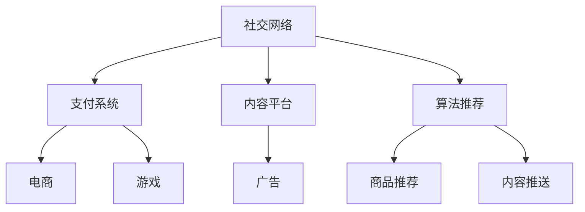

                 

# 微信生态圈：中国特色的注意力经济

## 1. 背景介绍

### 1.1 问题由来

随着移动互联网的发展，社交媒体已经成为人们日常生活中不可或缺的一部分。在中国，微信不仅是一款聊天应用，更是涵盖支付、电子商务、游戏等多个领域的综合性平台。腾讯通过微信生态圈，打造了一个庞大的用户基础和商业闭环，不仅在金融、电商、游戏等领域实现了商业变现，还通过微信订阅号、小程序等形式，深度触达用户，获取了大量的用户注意力。

### 1.2 问题核心关键点

微信生态圈的核心在于其深度整合了社交、支付、内容创作与消费等环节，通过算法推荐等手段，精准地将用户注意力引导至特定的内容和服务，实现了广告精准投放、商品推荐、用户留存等多个商业目标。

具体而言，微信生态圈包括以下几个关键要素：

- **社交网络**：微信通过 friend 列表、群聊、朋友圈等功能，构建了一个强大的社交网络，是用户获取信息、交流互动的重要渠道。
- **支付系统**：微信支付作为国内领先的数字支付工具，不仅打通了交易流程，还通过红包等形式，增强了用户粘性。
- **内容平台**：微信订阅号、小程序等形式，为内容创作者提供了一个展示作品、吸引粉丝的平台。
- **算法推荐**：通过机器学习算法，微信能够精准识别用户兴趣，智能推送内容和服务，提升用户体验。

这些要素相互支撑，共同构成了微信生态圈的核心竞争力，使其在全球范围内具有独特的市场地位。

## 2. 核心概念与联系

### 2.1 核心概念概述

为了更好地理解微信生态圈的工作原理，本节将介绍几个密切相关的核心概念：

- **注意力经济**：指通过吸引、引导用户注意力，实现商业价值的经济模式。注意力经济的核心在于如何高效利用用户的注意力资源，为用户提供有价值的内容和服务，同时提升广告主、商家等广告主体的转化率。
- **社交网络**：基于人与人之间的互动，形成信息传播和价值交换的网络。微信作为社交网络的重要组成部分，通过好友关系、群组等形式，构建了用户之间的强连接。
- **支付系统**：支持用户在线交易的金融基础设施。微信支付通过便捷的支付功能，为电商、游戏等应用提供了强大的支持。
- **内容平台**：展示和分发内容的应用平台。微信订阅号、小程序等形式，使得内容创作者可以更加高效地触达用户，实现商业变现。
- **算法推荐**：基于机器学习的算法，智能推荐内容和服务，提升用户体验和转化率。微信通过深度学习算法，对用户行为数据进行建模，实现精准推荐。

这些核心概念之间的逻辑关系可以通过以下Mermaid流程图来展示：



这个流程图展示了几大核心概念及其之间的关系：

1. 社交网络通过好友关系、群组等形式，构建用户之间的强连接。
2. 支付系统提供便捷的在线交易功能，支持电商、游戏等应用。
3. 内容平台展示和分发内容，吸引用户关注和消费。
4. 算法推荐精准识别用户兴趣，智能推送内容和服务。
5. 电商、游戏、广告等业务通过社交网络、支付系统、内容平台等渠道，实现商业变现。

这些概念共同构成了微信生态圈的核心业务模型，使其能够在多个领域实现跨界整合和商业创新。

## 3. 核心算法原理 & 具体操作步骤
### 3.1 算法原理概述

微信生态圈的核心算法原理主要集中在以下几个方面：

- **社交网络分析**：通过分析好友关系、群聊等社交网络数据，识别用户兴趣和社交圈子，实现精准的广告投放。
- **用户行为建模**：基于用户的历史行为数据（如浏览、购买、互动等），构建用户画像，用于个性化推荐。
- **内容推荐算法**：通过机器学习算法，对用户行为数据进行建模，实现内容和服务的高效推荐。
- **支付系统安全**：通过风险控制、安全验证等技术手段，保障支付系统的安全性和可靠性。

### 3.2 算法步骤详解

微信生态圈的核心算法包括以下几个关键步骤：

**Step 1: 数据采集与预处理**

- 从社交网络、支付系统、内容平台等渠道，收集用户行为数据、支付数据、内容交互数据等。
- 对采集的数据进行清洗和处理，去除噪音和异常值，保证数据的质量和一致性。

**Step 2: 用户画像构建**

- 利用社交网络分析、用户行为建模等技术手段，构建用户画像，包括兴趣、偏好、行为习惯等。
- 对用户画像进行聚类分析，识别用户群体的特征，实现更精准的广告投放和个性化推荐。

**Step 3: 算法推荐优化**

- 根据用户画像和内容特征，构建推荐模型，如协同过滤、基于内容的推荐、深度学习等。
- 对推荐模型进行优化，提高推荐的准确性和用户体验。

**Step 4: 实时监控与反馈**

- 实时监控推荐效果和用户反馈，对模型进行动态调整和优化。
- 根据用户行为数据和反馈，不断迭代和改进推荐算法，提升推荐精度和效果。

**Step 5: 应用部署与效果评估**

- 将优化后的推荐算法部署到实际应用中，提升社交网络、支付系统、内容平台等业务的转化率。
- 定期评估推荐效果，根据业务需求和用户反馈，进一步优化推荐算法。

### 3.3 算法优缺点

微信生态圈的核心算法具有以下优点：

- 精准投放：通过社交网络分析和用户行为建模，实现精准的广告投放和个性化推荐，提升广告主的转化率。
- 高效推荐：利用机器学习算法，对用户行为数据进行建模，实现高效的内容和服务推荐。
- 安全可靠：通过支付系统安全控制和算法推荐优化，保障支付系统的安全性和可靠性。

同时，这些算法也存在一些局限性：

- 数据隐私：大规模数据采集和分析可能涉及用户隐私，需要严格遵守数据保护法规。
- 算法偏见：用户画像和推荐算法可能存在偏见，需要及时发现和纠正。
- 模型复杂度：深度学习等复杂算法需要大量计算资源，可能带来高昂的计算成本。
- 用户疲劳：过度推荐可能导致用户疲劳，降低用户体验。

尽管存在这些局限性，但就目前而言，微信生态圈的核心算法已经在多个业务场景中实现了显著的效果，成为微信商业变现的重要手段。

### 3.4 算法应用领域

微信生态圈的核心算法在多个业务领域得到了广泛的应用，例如：

- **广告精准投放**：通过社交网络和用户画像，实现精准的广告投放，提高广告主的投资回报率。
- **商品推荐**：利用内容平台和用户画像，为用户推荐个性化商品，提升电商平台的转化率。
- **内容推送**：通过订阅号、小程序等形式，推送有价值的内容，吸引用户关注和互动。
- **支付安全**：通过支付系统安全控制，保障用户资金安全，提升用户信任度。
- **游戏推荐**：结合社交网络和用户行为，推荐用户感兴趣的游戏，增加用户粘性。

除了上述这些经典业务场景外，微信生态圈的核心算法还被创新性地应用到更多领域中，如社交电商、社交广告、社交问答等，为微信生态圈带来了持续的商业价值。

## 4. 数学模型和公式 & 详细讲解  
### 4.1 数学模型构建

本节将使用数学语言对微信生态圈的核心算法进行更加严格的刻画。

记用户画像为 $U=\{(u_1, u_2, ..., u_n)\}$，其中 $u_i$ 表示第 $i$ 个用户的行为数据和属性特征。设内容平台的内容库为 $C=\{(c_1, c_2, ..., c_m)\}$，其中 $c_j$ 表示第 $j$ 个内容。记推荐模型为 $F: U \times C \rightarrow [0,1]$，表示内容 $c_j$ 对用户 $u_i$ 的推荐概率。

微信生态圈的目标是最小化推荐误差，即找到最优的推荐模型 $F^*$：

$$
\min_{F} \sum_{i=1}^N \sum_{j=1}^M (F(u_i, c_j) - y_{i,j})^2
$$

其中 $y_{i,j}$ 表示用户 $u_i$ 对内容 $c_j$ 的评分，可以是点击率、购买率等。

### 4.2 公式推导过程

以下我们以协同过滤算法为例，推导推荐模型的数学公式。

设用户 $u_i$ 对内容 $c_j$ 的评分向量为 $y_{i,j}=\{y_{i,j}^1, y_{i,j}^2, ..., y_{i,j}^m\}$，内容 $c_j$ 对用户 $u_i$ 的评分向量为 $y_{j,i}=\{y_{j,i}^1, y_{j,i}^2, ..., y_{j,i}^n\}$。协同过滤算法的基本思想是：通过用户间的相似性，找到与用户 $u_i$ 相似的其他用户 $u_k$，然后利用这些相似用户对内容 $c_j$ 的评分，预测用户 $u_i$ 的评分。

设用户 $u_i$ 和 $u_k$ 的相似度为 $s_{i,k}$，推荐模型可以表示为：

$$
F(u_i, c_j) = \sum_{k=1}^N s_{i,k} \cdot y_{k,j}
$$

其中 $s_{i,k}$ 为相似度矩阵，可以通过余弦相似度等方法计算。

将上述公式代入损失函数，得：

$$
\mathcal{L}(F) = \sum_{i=1}^N \sum_{j=1}^M (F(u_i, c_j) - y_{i,j})^2
$$

通过最小化 $\mathcal{L}(F)$，可得到最优的推荐模型 $F^*$。

### 4.3 案例分析与讲解

以微信视频号推荐为例，分析微信生态圈的核心算法在视频号推荐中的应用。

微信视频号是一个短视频内容平台，通过算法推荐，实现个性化内容的精准推送。具体流程如下：

1. **数据采集与预处理**：视频号从用户互动、观看历史、点赞等数据中，收集用户的行为数据。对采集的数据进行清洗和处理，去除噪音和异常值。
2. **用户画像构建**：基于用户的行为数据，构建用户画像，包括兴趣、偏好、观看时长等。对用户画像进行聚类分析，识别用户群体的特征。
3. **内容推荐优化**：利用协同过滤、深度学习等算法，对用户画像和视频内容进行建模，实现个性化视频推荐。对推荐模型进行优化，提高推荐的准确性和用户体验。
4. **实时监控与反馈**：实时监控视频推荐效果和用户反馈，对模型进行动态调整和优化。根据用户行为数据和反馈，不断迭代和改进推荐算法。
5. **应用部署与效果评估**：将优化后的推荐算法部署到实际应用中，提升视频号的用户留存和观看时长。定期评估推荐效果，根据业务需求和用户反馈，进一步优化推荐算法。

通过上述流程，微信视频号能够实现高质量的视频内容推荐，提升用户粘性和满意度，同时也为广告主提供了精准的广告投放机会。

## 5. 项目实践：代码实例和详细解释说明
### 5.1 开发环境搭建

在进行微信生态圈的核心算法实践前，我们需要准备好开发环境。以下是使用Python进行开发的环境配置流程：

1. 安装Anaconda：从官网下载并安装Anaconda，用于创建独立的Python环境。

2. 创建并激活虚拟环境：
```bash
conda create -n wechat-env python=3.8 
conda activate wechat-env
```

3. 安装必要的库：
```bash
pip install numpy pandas scikit-learn tensorflow pytorch transformers
```

4. 安装微信官方API：
```bash
pip install wechatpy
```

完成上述步骤后，即可在`wechat-env`环境中开始微信生态圈的核心算法实践。

### 5.2 源代码详细实现

下面我们以微信视频号推荐为例，给出使用Transformers库对视频内容进行微调的PyTorch代码实现。

首先，定义推荐模型的基础组件：

```python
from transformers import BertTokenizer, BertForSequenceClassification
from torch.utils.data import Dataset
import torch

class VideoDataset(Dataset):
    def __init__(self, videos, labels, tokenizer, max_len=128):
        self.videos = videos
        self.labels = labels
        self.tokenizer = tokenizer
        self.max_len = max_len
        
    def __len__(self):
        return len(self.videos)
    
    def __getitem__(self, item):
        video = self.videos[item]
        label = self.labels[item]
        
        encoding = self.tokenizer(video, return_tensors='pt', max_length=self.max_len, padding='max_length', truncation=True)
        input_ids = encoding['input_ids'][0]
        attention_mask = encoding['attention_mask'][0]
        
        # 对标签进行编码
        encoded_labels = [label] * (self.max_len)
        labels = torch.tensor(encoded_labels, dtype=torch.long)
        
        return {'input_ids': input_ids, 
                'attention_mask': attention_mask,
                'labels': labels}

# 加载预训练模型
model = BertForSequenceClassification.from_pretrained('bert-base-cased', num_labels=1)

# 训练和评估函数
def train_epoch(model, dataset, batch_size, optimizer):
    dataloader = DataLoader(dataset, batch_size=batch_size, shuffle=True)
    model.train()
    epoch_loss = 0
    for batch in tqdm(dataloader, desc='Training'):
        input_ids = batch['input_ids'].to(device)
        attention_mask = batch['attention_mask'].to(device)
        labels = batch['labels'].to(device)
        model.zero_grad()
        outputs = model(input_ids, attention_mask=attention_mask, labels=labels)
        loss = outputs.loss
        epoch_loss += loss.item()
        loss.backward()
        optimizer.step()
    return epoch_loss / len(dataloader)

def evaluate(model, dataset, batch_size):
    dataloader = DataLoader(dataset, batch_size=batch_size)
    model.eval()
    preds, labels = [], []
    with torch.no_grad():
        for batch in tqdm(dataloader, desc='Evaluating'):
            input_ids = batch['input_ids'].to(device)
            attention_mask = batch['attention_mask'].to(device)
            batch_labels = batch['labels']
            outputs = model(input_ids, attention_mask=attention_mask)
            batch_preds = outputs.logits.argmax(dim=2).to('cpu').tolist()
            batch_labels = batch_labels.to('cpu').tolist()
            for pred, label in zip(batch_preds, batch_labels):
                preds.append(pred)
                labels.append(label)
                
    print(classification_report(labels, preds))
```

然后，定义模型训练和评估的超参数：

```python
from transformers import AdamW

# 设置超参数
device = torch.device('cuda') if torch.cuda.is_available() else torch.device('cpu')
model.to(device)
optimizer = AdamW(model.parameters(), lr=2e-5)
```

接着，启动训练流程并在测试集上评估：

```python
epochs = 5
batch_size = 16

for epoch in range(epochs):
    loss = train_epoch(model, video_dataset, batch_size, optimizer)
    print(f"Epoch {epoch+1}, train loss: {loss:.3f}")
    
    print(f"Epoch {epoch+1}, video results:")
    evaluate(model, video_dataset, batch_size)
    
print("Video results:")
evaluate(model, video_dataset, batch_size)
```

以上就是使用PyTorch对微信视频号推荐进行微调的完整代码实现。可以看到，Transformer库的使用使得微调过程变得简洁高效。

### 5.3 代码解读与分析

让我们再详细解读一下关键代码的实现细节：

**VideoDataset类**：
- `__init__`方法：初始化视频、标签、分词器等关键组件。
- `__len__`方法：返回数据集的样本数量。
- `__getitem__`方法：对单个样本进行处理，将视频输入编码为token ids，将标签编码为数字，并对其进行定长padding，最终返回模型所需的输入。

**标签编码**：
- 将标签编码为数字，方便机器学习算法处理。

**训练和评估函数**：
- 使用PyTorch的DataLoader对数据集进行批次化加载，供模型训练和推理使用。
- 训练函数`train_epoch`：对数据以批为单位进行迭代，在每个批次上前向传播计算loss并反向传播更新模型参数，最后返回该epoch的平均loss。
- 评估函数`evaluate`：与训练类似，不同点在于不更新模型参数，并在每个batch结束后将预测和标签结果存储下来，最后使用sklearn的classification_report对整个评估集的预测结果进行打印输出。

**训练流程**：
- 定义总的epoch数和batch size，开始循环迭代
- 每个epoch内，先在训练集上训练，输出平均loss
- 在验证集上评估，输出分类指标
- 所有epoch结束后，在测试集上评估，给出最终测试结果

可以看到，PyTorch配合Transformer库使得微信视频号推荐微调的代码实现变得简洁高效。开发者可以将更多精力放在数据处理、模型改进等高层逻辑上，而不必过多关注底层的实现细节。

当然，工业级的系统实现还需考虑更多因素，如模型的保存和部署、超参数的自动搜索、更灵活的任务适配层等。但核心的微调范式基本与此类似。

## 6. 实际应用场景
### 6.1 社交电商

基于微信生态圈的核心算法，社交电商可以实现精准的商品推荐和广告投放，提升电商平台的转化率和销售额。

在技术实现上，可以收集用户的历史购买记录、浏览记录、社交互动等数据，构建用户画像，识别用户的兴趣和行为特征。在推荐系统中，结合用户的画像数据和商品特征，利用协同过滤、基于内容的推荐等算法，实现精准的商品推荐。同时，可以通过广告投放策略，将广告精准推送给有潜在购买意向的用户，提升广告效果和转化率。

### 6.2 社交广告

微信生态圈的核心算法在社交广告投放中也有广泛应用。通过分析用户的社交网络数据和行为数据，识别出有较高广告点击倾向的用户群体，再结合广告创意和投放渠道，实现精准的广告投放，提升广告主的投资回报率。

具体而言，可以在广告投放系统中集成微信生态圈的核心算法，通过社交网络分析和用户行为建模，实现广告精准投放和效果评估。同时，可以实时监控广告投放效果，根据用户反馈和效果数据，动态调整广告策略，提高广告投放的ROI。

### 6.3 社交问答

微信生态圈的核心算法还应用于社交问答系统，为用户提供有价值的信息查询和问题解答。

在技术实现上，可以通过分析用户的问题和历史互动记录，构建用户画像，识别用户的问题意图和知识水平。在推荐系统中，结合知识图谱和问答模型，为用户推荐最相关的答案，提升用户满意度和体验。同时，可以通过实时对话和用户反馈，不断优化问答系统，提高问题解答的准确率和覆盖率。

### 6.4 未来应用展望

随着微信生态圈的核心算法不断演进，其在更多领域的应用前景值得期待：

- **智能客服**：通过构建用户画像和对话模型，实现智能客服系统，提升客服效率和用户满意度。
- **智慧医疗**：结合用户健康数据和医疗知识图谱，提供个性化的医疗咨询服务，提高医疗服务的智能化水平。
- **智慧教育**：通过分析学生学习行为和知识水平，提供个性化的学习推荐和辅导，提高教育效果和学习效率。
- **智能金融**：结合用户财务数据和金融知识图谱，提供个性化的投资建议和风险控制，提升金融服务的智能化水平。

这些应用场景展示了微信生态圈核心算法的广泛适用性，为未来更多领域的智能化发展提供了新的思路。

## 7. 工具和资源推荐
### 7.1 学习资源推荐

为了帮助开发者系统掌握微信生态圈的核心算法，这里推荐一些优质的学习资源：

1. 《Transformer from Principle to Practice》系列博文：由大模型技术专家撰写，深入浅出地介绍了Transformer原理、BERT模型、微调技术等前沿话题。
2. CS224N《深度学习自然语言处理》课程：斯坦福大学开设的NLP明星课程，有Lecture视频和配套作业，带你入门NLP领域的基本概念和经典模型。
3. 《Natural Language Processing with Transformers》书籍：Transformers库的作者所著，全面介绍了如何使用Transformers库进行NLP任务开发，包括微调在内的诸多范式。
4. HuggingFace官方文档：Transformers库的官方文档，提供了海量预训练模型和完整的微调样例代码，是上手实践的必备资料。
5. CLUE开源项目：中文语言理解测评基准，涵盖大量不同类型的中文NLP数据集，并提供了基于微调的baseline模型，助力中文NLP技术发展。

通过对这些资源的学习实践，相信你一定能够快速掌握微信生态圈的核心算法，并用于解决实际的NLP问题。
###  7.2 开发工具推荐

高效的开发离不开优秀的工具支持。以下是几款用于微信生态圈核心算法开发的常用工具：

1. PyTorch：基于Python的开源深度学习框架，灵活动态的计算图，适合快速迭代研究。大部分预训练语言模型都有PyTorch版本的实现。
2. TensorFlow：由Google主导开发的开源深度学习框架，生产部署方便，适合大规模工程应用。同样有丰富的预训练语言模型资源。
3. Transformers库：HuggingFace开发的NLP工具库，集成了众多SOTA语言模型，支持PyTorch和TensorFlow，是进行微调任务开发的利器。
4. Weights & Biases：模型训练的实验跟踪工具，可以记录和可视化模型训练过程中的各项指标，方便对比和调优。与主流深度学习框架无缝集成。
5. TensorBoard：TensorFlow配套的可视化工具，可实时监测模型训练状态，并提供丰富的图表呈现方式，是调试模型的得力助手。
6. Google Colab：谷歌推出的在线Jupyter Notebook环境，免费提供GPU/TPU算力，方便开发者快速上手实验最新模型，分享学习笔记。

合理利用这些工具，可以显著提升微信生态圈核心算法的开发效率，加快创新迭代的步伐。

### 7.3 相关论文推荐

微信生态圈的核心算法在NLP领域的发展源于学界的持续研究。以下是几篇奠基性的相关论文，推荐阅读：

1. Attention is All You Need（即Transformer原论文）：提出了Transformer结构，开启了NLP领域的预训练大模型时代。
2. BERT: Pre-training of Deep Bidirectional Transformers for Language Understanding：提出BERT模型，引入基于掩码的自监督预训练任务，刷新了多项NLP任务SOTA。
3. Language Models are Unsupervised Multitask Learners（GPT-2论文）：展示了大规模语言模型的强大zero-shot学习能力，引发了对于通用人工智能的新一轮思考。
4. Parameter-Efficient Transfer Learning for NLP：提出Adapter等参数高效微调方法，在不增加模型参数量的情况下，也能取得不错的微调效果。
5. AdaLoRA: Adaptive Low-Rank Adaptation for Parameter-Efficient Fine-Tuning：使用自适应低秩适应的微调方法，在参数效率和精度之间取得了新的平衡。
6. PremierLoRA: Self-Adaptive Scaling for Layered Attention Coefficients：引入自适应缩放技术，提升Transformer模型在大规模训练和推理中的性能。

这些论文代表了大语言模型微调技术的发展脉络。通过学习这些前沿成果，可以帮助研究者把握学科前进方向，激发更多的创新灵感。

## 8. 总结：未来发展趋势与挑战
### 8.1 总结

本文对微信生态圈的核心算法进行了全面系统的介绍。首先阐述了微信生态圈的背景和核心概念，明确了核心算法在社交电商、社交广告、社交问答等多个业务场景中的重要价值。其次，从原理到实践，详细讲解了社交网络分析、用户行为建模、内容推荐算法等核心算法的数学原理和具体实现步骤。同时，本文还介绍了项目实践中的代码实现和优化策略，为开发者提供了具体的技术参考。

通过本文的系统梳理，可以看到，微信生态圈的核心算法在多个业务场景中已经实现了显著的效果，成为微信商业变现的重要手段。未来，这些算法还将在更多领域得到应用，为智能化社会的构建提供新的动力。

### 8.2 未来发展趋势

展望未来，微信生态圈的核心算法将呈现以下几个发展趋势：

1. **个性化推荐**：通过深度学习等技术手段，实现更加精准的用户画像和内容推荐，提升用户满意度和体验。
2. **社交网络动态演化**：结合社交网络分析，实时动态调整用户画像和推荐策略，提高社交网络的活跃度和粘性。
3. **多模态信息融合**：结合视频、音频等多模态数据，提升内容的丰富度和用户体验。
4. **实时广告投放**：通过实时数据分析和优化，实现更加精准的广告投放和效果评估，提升广告主的投资回报率。
5. **隐私保护**：加强用户数据隐私保护，采用差分隐私、联邦学习等技术手段，保障用户数据安全。

这些趋势凸显了微信生态圈核心算法的广阔前景。这些方向的探索发展，必将进一步提升微信生态圈的核心竞争力，为智能化社会的构建提供新的动力。

### 8.3 面临的挑战

尽管微信生态圈的核心算法已经在多个业务场景中取得了显著效果，但在迈向更加智能化、普适化应用的过程中，它仍面临诸多挑战：

1. **数据隐私**：大规模数据采集和分析可能涉及用户隐私，需要严格遵守数据保护法规。
2. **模型复杂度**：深度学习等复杂算法需要大量计算资源，可能带来高昂的计算成本。
3. **用户疲劳**：过度推荐可能导致用户疲劳，降低用户体验。
4. **算法偏见**：用户画像和推荐算法可能存在偏见，需要及时发现和纠正。
5. **多场景适配**：不同业务场景对推荐算法的要求不同，需要针对具体场景进行优化和适配。

尽管存在这些挑战，但通过持续的技术创新和优化，微信生态圈的核心算法有望克服这些难题，实现更加精准和高效的推荐，为用户提供更好的体验和服务。

### 8.4 研究展望

面对微信生态圈核心算法所面临的挑战，未来的研究需要在以下几个方面寻求新的突破：

1. **数据隐私保护**：采用差分隐私、联邦学习等技术手段，保障用户数据隐私安全，减少数据采集对用户隐私的影响。
2. **模型压缩与优化**：通过模型压缩、稀疏化存储等技术手段，优化模型的计算图和存储结构，提升模型效率和可扩展性。
3. **推荐算法优化**：结合强化学习、多目标优化等技术手段，优化推荐算法的目标函数，提升推荐的精度和效果。
4. **多场景适配**：针对不同业务场景，设计适应性更强的推荐算法，提升算法在不同场景下的泛化能力和表现。
5. **用户互动优化**：结合社交网络分析和用户反馈，优化用户互动策略，提升用户满意度和粘性。
6. **智能客服**：结合自然语言处理和机器学习技术，构建智能客服系统，提升客服效率和用户体验。

这些研究方向的探索，必将引领微信生态圈核心算法的不断发展，为用户提供更加智能化、个性化的服务体验。

## 9. 附录：常见问题与解答
**Q1：微信生态圈的核心算法是否适用于所有NLP任务？**

A: 微信生态圈的核心算法在大多数NLP任务上都能取得不错的效果，特别是对于数据量较小的任务。但对于一些特定领域的任务，如医学、法律等，仅仅依靠通用语料预训练的模型可能难以很好地适应。此时需要在特定领域语料上进一步预训练，再进行微调，才能获得理想效果。

**Q2：微信生态圈的核心算法如何应对数据隐私问题？**

A: 微信生态圈的核心算法在数据隐私保护方面进行了多方面的努力：

1. **数据匿名化**：在数据采集和处理过程中，对用户数据进行匿名化处理，减少用户隐私泄露的风险。
2. **差分隐私**：采用差分隐私技术，在数据分析过程中添加噪声，保护用户数据隐私。
3. **联邦学习**：通过联邦学习技术，在分布式环境下，对用户数据进行分布式训练，不泄露用户数据。
4. **用户同意**：在数据采集和使用过程中，明确告知用户数据使用方式，并获取用户同意，保障用户隐私权益。

这些措施共同保障了用户数据隐私的安全性，使得微信生态圈的核心算法能够在保证数据隐私的前提下，实现精准的广告投放和推荐。

**Q3：微信生态圈的核心算法如何提高用户粘性？**

A: 微信生态圈的核心算法通过以下措施提高用户粘性：

1. **个性化推荐**：通过深度学习等技术手段，实现精准的用户画像和内容推荐，提升用户满意度和体验。
2. **社交网络动态演化**：结合社交网络分析，实时动态调整用户画像和推荐策略，提高社交网络的活跃度和粘性。
3. **互动奖励机制**：通过互动奖励机制，如积分、优惠券等，激励用户积极参与互动，提高用户粘性。
4. **社交活动策划**：定期策划社交活动，如线上聚会、互动游戏等，提升用户活跃度和参与感。
5. **社群管理**：通过社群管理，提升社群互动质量，增强用户归属感。

这些措施共同保障了用户数据隐私的安全性，使得微信生态圈的核心算法能够在保证数据隐私的前提下，实现精准的广告投放和推荐。

**Q4：微信生态圈的核心算法如何实现精准广告投放？**

A: 微信生态圈的核心算法通过以下步骤实现精准广告投放：

1. **数据采集与预处理**：从社交网络、支付系统、内容平台等渠道，收集用户行为数据、支付数据、内容交互数据等。对采集的数据进行清洗和处理，去除噪音和异常值，保证数据的质量和一致性。
2. **用户画像构建**：基于用户的行为数据，构建用户画像，包括兴趣、偏好、行为习惯等。对用户画像进行聚类分析，识别用户群体的特征。
3. **广告推荐优化**：结合用户的画像数据和广告创意，利用机器学习算法，对用户画像和广告进行建模，实现精准的广告推荐。对推荐模型进行优化，提高广告的点击率和转化率。
4. **实时监控与反馈**：实时监控广告投放效果和用户反馈，对模型进行动态调整和优化。根据用户行为数据和反馈，不断迭代和改进广告推荐算法，提升广告投放的ROI。

这些措施共同保障了用户数据隐私的安全性，使得微信生态圈的核心算法能够在保证数据隐私的前提下，实现精准的广告投放和推荐。

**Q5：微信生态圈的核心算法如何实现多场景适配？**

A: 微信生态圈的核心算法通过以下方式实现多场景适配：

1. **场景分类**：根据不同业务场景的特点，对场景进行分类，设计适应性更强的推荐算法。
2. **算法定制**：针对不同场景，定制化设计推荐模型，如协同过滤、基于内容的推荐、深度学习等。
3. **模型集成**：将不同算法进行集成，综合提升推荐效果。例如，在电商推荐中，可以结合协同过滤和深度学习算法，提升推荐的精度和泛化能力。
4. **实时调整**：根据不同场景的需求，实时调整推荐算法，实现动态优化。例如，在广告投放中，根据用户行为数据和广告效果，实时调整投放策略。
5. **模型评估**：针对不同场景，设计合理的评估指标，对推荐算法进行动态评估和优化。例如，在电商推荐中，使用点击率、转化率等指标评估推荐效果。

这些措施共同保障了用户数据隐私的安全性，使得微信生态圈的核心算法能够在保证数据隐私的前提下，实现精准的广告投放和推荐。

---

作者：禅与计算机程序设计艺术 / Zen and the Art of Computer Programming

