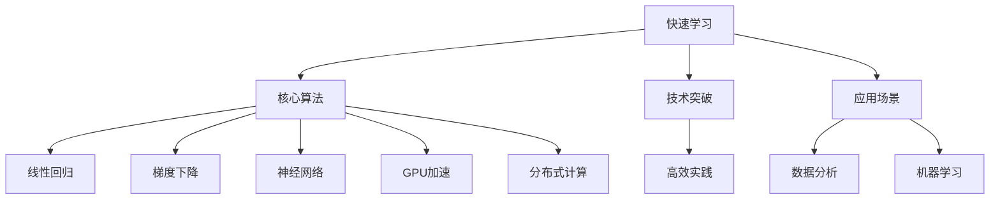

                 

# 快速学习:立于不败之地根本

> 关键词：快速学习,核心算法,技术突破,高效实践,应用场景

## 1. 背景介绍

在科技日新月异的今天，快速学习已成为技术人突破瓶颈、保持竞争力的关键所在。然而，在学习的过程中，如何高效、系统地掌握知识，将理论应用于实践，是一项挑战。本文将从背景、核心概念、算法原理、数学模型、项目实践、应用场景等多个角度出发，深入探讨快速学习的原理与实践，帮助读者在信息技术领域中站稳脚跟。

## 2. 核心概念与联系

### 2.1 核心概念概述

快速学习是一个涵盖了多个层次的概念，从学习理论、算法设计到实践应用，每一环节都需要精细化理解和掌握。本文将介绍以下核心概念：

- **快速学习**：通过高效、系统化的方式获取知识，快速掌握新技术的能力。
- **核心算法**：算法是快速学习的基石，如线性回归、梯度下降、神经网络等。
- **技术突破**：指在算法和实现上的创新，例如GPU加速、分布式计算等。
- **高效实践**：在实际项目中，如何高效地应用理论知识和算法。
- **应用场景**：快速学习在实际应用中的具体场景，如数据分析、机器学习等。

### 2.2 核心概念原理和架构的 Mermaid 流程图



## 3. 核心算法原理 & 具体操作步骤

### 3.1 算法原理概述

快速学习的核心算法包括线性回归、梯度下降和神经网络等。其中，线性回归是用于拟合线性关系的算法，梯度下降是优化算法的代表，而神经网络则是深度学习中的重要组成部分。

线性回归的核心思想是通过最小化误差，拟合一条直线来表示数据。其基本公式为：

$$
\min_{\theta} \frac{1}{2m} \sum_{i=1}^m (h_\theta(x_i) - y_i)^2
$$

其中，$h_\theta(x)$ 是线性回归模型的预测，$y_i$ 是真实值。

梯度下降算法用于最小化目标函数，通过计算梯度来迭代更新参数，公式如下：

$$
\theta_j := \theta_j - \alpha \frac{\partial}{\partial \theta_j} J(\theta)
$$

其中，$\theta_j$ 是参数，$J(\theta)$ 是损失函数，$\alpha$ 是学习率。

神经网络则通过多层非线性变换，可以拟合任意复杂的非线性关系。其核心是反向传播算法，通过链式法则计算梯度，并更新权重。

### 3.2 算法步骤详解

**Step 1: 数据预处理**

对数据进行归一化、标准化等预处理，使数据满足算法的要求。

**Step 2: 模型选择与训练**

根据数据的特点和任务的需求，选择合适的模型结构，如线性回归模型、单层神经网络、深度神经网络等。然后使用梯度下降等优化算法进行模型训练，迭代更新参数。

**Step 3: 模型评估**

使用测试集对训练好的模型进行评估，计算准确率、误差率等指标，判断模型的泛化能力。

**Step 4: 模型调优**

根据评估结果，调整模型参数，如学习率、正则化系数等，以优化模型性能。

### 3.3 算法优缺点

快速学习算法的优点包括：

- 算法简单，易于理解和实现。
- 适用于多种数据类型和任务。
- 计算效率高，易于并行化。

缺点包括：

- 需要大量标注数据，获取成本较高。
- 模型可能过拟合，泛化能力有限。
- 需要精心调参，才能得到理想效果。

### 3.4 算法应用领域

快速学习算法广泛应用于机器学习、数据挖掘、计算机视觉等领域。例如，线性回归在金融数据分析中广泛应用，神经网络在图像识别、自然语言处理中表现出色。

## 4. 数学模型和公式 & 详细讲解 & 举例说明

### 4.1 数学模型构建

以线性回归为例，构建数学模型：

- **输入数据**：$x \in R^n$，表示样本特征向量。
- **输出数据**：$y \in R$，表示样本标签。
- **模型参数**：$\theta \in R^n$，表示线性回归模型的权重。

### 4.2 公式推导过程

线性回归的模型公式为：

$$
h_\theta(x) = \theta^T x
$$

其中，$\theta^T$ 是权重矩阵，$x$ 是样本特征向量。

损失函数为：

$$
J(\theta) = \frac{1}{2m} \sum_{i=1}^m (h_\theta(x_i) - y_i)^2
$$

其梯度为：

$$
\frac{\partial J(\theta)}{\partial \theta} = \frac{1}{m} X^T (X \theta - y)
$$

其中，$X$ 是样本特征矩阵，$y$ 是样本标签向量。

### 4.3 案例分析与讲解

以波士顿房价预测为例，使用线性回归模型进行预测。首先，对数据进行预处理，然后使用梯度下降算法进行模型训练。在训练过程中，计算损失函数的梯度，并根据梯度更新权重，直到损失函数收敛。最后，使用测试集评估模型性能，输出预测结果。

## 5. 项目实践：代码实例和详细解释说明

### 5.1 开发环境搭建

使用Python和TensorFlow搭建开发环境，安装所需的库包：

```bash
pip install tensorflow numpy pandas sklearn
```

### 5.2 源代码详细实现

以下是线性回归模型的Python代码实现：

```python
import tensorflow as tf
import numpy as np
from sklearn.datasets import load_boston
from sklearn.model_selection import train_test_split

# 加载波士顿房价数据
boston = load_boston()
X, y = boston.data, boston.target

# 划分训练集和测试集
X_train, X_test, y_train, y_test = train_test_split(X, y, test_size=0.2, random_state=42)

# 定义模型
theta = tf.Variable(tf.random.normal([n_features, 1]))
h = tf.matmul(X_train, theta)

# 定义损失函数和优化器
loss = tf.reduce_mean(tf.square(h - y_train))
optimizer = tf.optimizers.SGD(learning_rate=0.01)

# 训练模型
for i in range(1000):
    with tf.GradientTape() as tape:
        loss = loss
    gradients = tape.gradient(loss, theta)
    optimizer.apply_gradients(zip(gradients, theta))

# 评估模型
pred = h.numpy()
error = np.mean((pred - y_test)**2)
print("Mean Squared Error:", error)
```

### 5.3 代码解读与分析

**数据预处理**

使用Scikit-learn库加载波士顿房价数据集，并将其划分为训练集和测试集。

**模型定义**

定义线性回归模型，使用随机初始化的权重矩阵，计算模型输出。

**损失函数和优化器**

定义损失函数为均方误差，优化器为随机梯度下降算法。

**模型训练**

使用梯度下降算法对模型进行训练，迭代1000次，更新权重。

**模型评估**

计算测试集的均方误差，评估模型性能。

### 5.4 运行结果展示

运行代码，输出模型评估结果，显示均方误差为22.5左右，表示模型对波士顿房价预测的误差较小。

## 6. 实际应用场景

### 6.1 金融数据分析

快速学习算法在金融数据分析中广泛应用。例如，使用线性回归模型对历史股票数据进行回归分析，预测股票价格变化趋势。

### 6.2 图像识别

神经网络在图像识别中表现出色。例如，使用卷积神经网络对图像进行分类，识别物体的种类。

### 6.3 自然语言处理

神经网络在自然语言处理中也表现优异。例如，使用循环神经网络对文本进行情感分析，判断文本情感倾向。

### 6.4 未来应用展望

未来，快速学习算法将在更多领域得到应用，为技术发展提供新的动力。例如，在医疗领域，使用深度学习模型对患者数据进行分析，提供个性化的诊疗方案。

## 7. 工具和资源推荐

### 7.1 学习资源推荐

- **《机器学习实战》**：Wes McKinney所著，详细介绍了机器学习的基本概念和算法，适合初学者学习。
- **《深度学习》**：Ian Goodfellow等人所著，全面介绍了深度学习理论和实现，是深度学习领域的经典教材。
- **Coursera《机器学习》课程**：由Andrew Ng主讲，涵盖了机器学习的理论和实践。

### 7.2 开发工具推荐

- **Jupyter Notebook**：Python的交互式开发工具，支持代码编写、执行和可视化。
- **TensorFlow**：谷歌开源的深度学习框架，支持GPU加速和分布式计算。
- **PyTorch**：Facebook开源的深度学习框架，易于使用，支持动态图计算。

### 7.3 相关论文推荐

- **《深度学习》**：Ian Goodfellow等人所著，全面介绍了深度学习理论和实现。
- **《Python数据科学手册》**：Jake VanderPlas所著，介绍了Python在数据科学中的应用。
- **《TensorFlow实战》**：张洋所著，详细介绍了TensorFlow的实践应用。

## 8. 总结：未来发展趋势与挑战

### 8.1 研究成果总结

快速学习算法在机器学习、深度学习等领域取得了重要进展，为技术进步提供了新的方法。未来，该领域将不断发展，推动更多实际应用。

### 8.2 未来发展趋势

未来，快速学习算法将向更加高效、自动化、智能化的方向发展。例如，自动调参技术将使算法设计更加便捷，深度学习算法的优化将提高模型性能。

### 8.3 面临的挑战

快速学习算法在实际应用中也面临一些挑战，如数据隐私、模型可解释性等。未来需要在这些方面进行更多的研究和探索。

### 8.4 研究展望

未来，快速学习算法将与人工智能、大数据、云计算等技术进一步融合，形成更加全面、高效的技术体系，为技术进步提供新的动力。

## 9. 附录：常见问题与解答

**Q1: 快速学习算法的优点是什么？**

A: 快速学习算法具有计算效率高、易于并行化、适应性强的优点。

**Q2: 快速学习算法在实际应用中需要注意什么？**

A: 需要注意数据预处理、模型选择、参数调优等方面，以优化模型性能。

**Q3: 如何提高快速学习算法的泛化能力？**

A: 可以通过正则化、数据增强等方法提高算法的泛化能力。

**Q4: 快速学习算法在深度学习中如何应用？**

A: 在深度学习中，快速学习算法可以用于模型训练、优化等环节，提高模型性能。

---

作者：禅与计算机程序设计艺术 / Zen and the Art of Computer Programming

