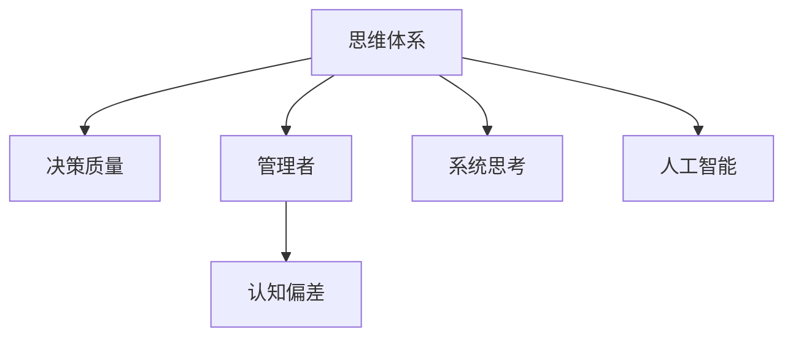

                 

# 思维体系与管理者决策质量的关系

> 关键词：思维体系,决策质量,管理者,认知偏差,系统思考,人工智能,数据驱动

## 1. 背景介绍

在现代企业管理中，决策质量直接影响企业的战略方向和运营效率。有效的决策可以帮助企业抓住市场机遇，规避潜在风险，实现可持续发展。然而，现实中的决策过程往往是复杂多变的，既受制于内在的思维体系，也受制于外部的环境因素。本文将深入探讨管理者思维体系与其决策质量之间的关系，特别是如何通过系统思考和人工智能技术，提升管理者的决策能力。

### 1.1 问题由来

在实际管理中，管理者往往面临多重的决策任务，从战略规划到日常运营，从财务决策到人力资源管理，每一个决策都关系到企业的未来发展。然而，决策质量的高低往往受到管理者的认知水平、经验积累、情绪状态等多种因素的影响。决策失误不仅会导致资源浪费，还可能对企业的长期发展造成严重负面影响。因此，研究管理者思维体系与其决策质量之间的关系，是提升企业管理水平和经营效率的关键所在。

## 2. 核心概念与联系

### 2.1 核心概念概述

为更好地理解管理者思维体系与决策质量之间的关系，本节将介绍几个密切相关的核心概念：

- **思维体系**：指管理者在处理信息和做出决策时的思维方式和认知框架。包括系统思考、因果分析、归纳推理、决策树等思维方法。
- **决策质量**：指决策的有效性、合理性、科学性和可执行性。衡量标准包括决策的准确性、稳定性、创新性和适应性。
- **管理者**：指负责企业运营管理的高级管理人员，包括CEO、CTO、CFO、COO等。
- **认知偏差**：指人们在认知过程中因信息不对称、主观情绪、经验固化等原因导致判断失误或错误。
- **系统思考**：指从整体视角出发，系统性地分析和管理复杂问题的方法论。强调对问题本质的理解，避免片面或短期行为。
- **人工智能**：指模拟、延伸和扩展人类智能的理论、方法、技术及应用系统，通过算法和数据驱动实现决策支持。

这些核心概念之间的逻辑关系可以通过以下Mermaid流程图来展示：



这个流程图展示了一些关键概念之间的联系：

1. **思维体系**：是管理者决策质量的基础，决定了管理者的认知角度和决策方法。
2. **决策质量**：是管理者思维体系作用的结果，反映了决策的有效性和科学性。
3. **管理者**：是思维体系和决策质量的实施者，其行为和决策直接影响企业的运行效率和发展方向。
4. **认知偏差**：是影响思维体系和决策质量的潜在因素，需要通过系统思考和人工智能手段予以识别和纠正。
5. **系统思考**：是一种提升决策质量的方法论，强调全局视角和动态平衡。
6. **人工智能**：是辅助管理者决策的工具，通过数据分析和算法优化，增强决策的科学性和可操作性。

## 3. 核心算法原理 & 具体操作步骤
### 3.1 算法原理概述

管理者决策质量的提升，可以通过系统思考和人工智能技术相结合的方法实现。系统思考帮助管理者从全局视角审视问题，识别系统内部的复杂关系，避免单一视角导致的决策偏差。人工智能则通过数据分析和算法优化，提供数据驱动的决策支持，提升决策的科学性和准确性。

具体而言，系统思考和人工智能技术在决策质量提升中的作用如下：

- **系统思考**：帮助管理者识别和理解系统中的因果关系、动态变化和潜在的反馈机制，从而进行更全面的决策。
- **人工智能**：通过数据挖掘、模式识别、预测分析等技术，提供丰富的数据支持和深入的洞察，辅助管理者做出更加合理的决策。

### 3.2 算法步骤详解

管理者思维体系与决策质量的提升，涉及多个步骤，包括问题识别、数据分析、方案设计、执行评估等。以下是详细的步骤：

**Step 1: 问题识别**
- 收集企业的运营数据、市场信息、员工反馈等，系统性地识别管理过程中存在的问题。
- 使用系统思考的方法，将问题分解为多个子问题，理解问题的本质和影响因素。
- 进行问题优先级排序，确定需要优先解决的问题。

**Step 2: 数据分析**
- 对收集的数据进行清洗和预处理，去除噪音和不完整信息。
- 使用人工智能技术，如机器学习、深度学习、自然语言处理等，对数据进行特征提取、建模和分析。
- 通过数据分析，发现数据中的规律、趋势和异常，为决策提供数据支持。

**Step 3: 方案设计**
- 基于系统思考的方法，设计多个备选方案，考虑不同方案的优缺点和潜在影响。
- 使用人工智能技术，对各备选方案进行模拟和评估，识别最优或次优方案。
- 结合企业的实际情况，综合考虑方案的可行性和风险，选择最终的决策方案。

**Step 4: 执行评估**
- 执行选择的方案，并持续监测其效果和反馈。
- 使用人工智能技术，对执行结果进行评估和分析，识别潜在的改进点和优化方向。
- 根据评估结果，调整和优化决策方案，提升决策质量。

### 3.3 算法优缺点

系统思考和人工智能技术在提升决策质量方面具有以下优点：

- **系统全面性**：通过系统思考，管理者可以从整体视角审视问题，避免单一视角的局限性。
- **数据驱动**：人工智能技术提供数据驱动的决策支持，使决策更加科学和准确。
- **高效性**：通过自动化和算法优化，提高决策过程的效率。
- **可重复性**：系统思考和人工智能技术可以反复应用，不断优化决策过程。

同时，这些方法也存在一定的局限性：

- **数据依赖**：需要大量的高质量数据支持，数据质量直接影响分析结果。
- **复杂性**：系统思考和人工智能技术的应用，需要管理者的专业知识和技能。
- **技术风险**：依赖复杂的算法和模型，可能存在技术实现上的挑战。
- **隐私和安全**：在数据处理过程中，需要确保数据的隐私和安全，防止数据泄露和滥用。

尽管存在这些局限性，但总体而言，系统思考和人工智能技术的结合，在提升管理者决策质量方面具有显著的优势。

### 3.4 算法应用领域

系统思考和人工智能技术在管理决策中的应用，已经涵盖了企业运营的各个方面，例如：

- 战略规划：识别市场机遇和潜在风险，制定长期发展战略。
- 财务决策：分析财务数据，优化资本结构，提高资金使用效率。
- 人力资源管理：优化招聘、培训和绩效管理，提升员工满意度和企业竞争力。
- 供应链管理：优化供应链流程，降低成本，提高效率。
- 产品开发：通过市场调研和数据分析，指导新产品开发和迭代。
- 客户关系管理：提升客户满意度，构建品牌忠诚度。

除了这些经典应用外，系统思考和人工智能技术还在更多场景中得到了创新性的应用，如智能客服、风险管理、智能制造等，为企业管理带来了新的突破。

## 4. 数学模型和公式 & 详细讲解 & 举例说明（备注：数学公式请使用latex格式，latex嵌入文中独立段落使用 $$，段落内使用 $)
### 4.1 数学模型构建

本节将使用数学语言对系统思考和人工智能技术在决策质量提升中的作用进行更加严格的刻画。

假设企业面临的问题为 $P$，管理者需要从多个角度 $X$ 对问题进行分解，每个角度的决策方案为 $S$。系统思考和人工智能技术的应用过程如下：

1. **数据收集**：从各个角度 $X$ 收集数据 $D$。
2. **问题分解**：将问题 $P$ 分解为多个子问题 $P_i$，并识别其因果关系 $C_i$。
3. **方案设计**：设计多个备选方案 $S_i$，并计算各方案的效用函数 $U_i$。
4. **执行评估**：执行选择的方案 $S^*$，并根据执行结果 $E^*$ 评估其效果 $R^*$。

### 4.2 公式推导过程

以下我们以财务决策为例，推导系统思考和人工智能技术在决策中的作用。

假设企业面临的财务问题为 $P$，从市场 $X_1$、成本 $X_2$ 和资金 $X_3$ 三个角度进行分解。数据收集后，通过系统思考的方法，识别出市场的波动性 $C_1$、成本的变动性 $C_2$ 和资金的流动性 $C_3$。设计备选方案 $S_1$ 为增加市场投入，方案 $S_2$ 为优化成本结构，方案 $S_3$ 为提高资金使用效率。

方案的效用函数为：

$$
U_i = w_1 U_1 + w_2 U_2 + w_3 U_3
$$

其中 $w_i$ 为各个方案的权重，$U_1$、$U_2$、$U_3$ 分别为市场投入、成本结构、资金使用效率的效用函数。

通过数据分析，识别出市场投入对财务状况的正面影响 $E_1$、成本结构对财务状况的负面影响 $E_2$ 和资金使用效率对财务状况的正面影响 $E_3$。假设执行方案 $S_1$，根据执行结果 $E_1$ 和市场波动性 $C_1$ 计算效果 $R_1$。

最终的决策方案为 $S^*$ 满足：

$$
\mathop{\arg\min}_{S^*} \left( E_1 R_1 + E_2 R_2 + E_3 R_3 \right)
$$

### 4.3 案例分析与讲解

假设某企业面临市场需求波动大的问题，使用系统思考和人工智能技术进行决策分析。

**Step 1: 问题识别**
- 收集企业的市场数据、销售数据、客户反馈等，识别市场需求波动大的问题。
- 系统思考方法将问题分解为市场波动性、需求预测准确性和客户满意度三个子问题。

**Step 2: 数据分析**
- 对市场数据进行清洗和预处理，去除噪音和不完整信息。
- 使用机器学习模型，如时间序列预测模型，对市场数据进行预测，计算需求预测准确性 $E_1$。
- 使用自然语言处理技术，对客户反馈进行情感分析，计算客户满意度 $E_2$。

**Step 3: 方案设计**
- 设计三个备选方案：增加市场投入、优化产品结构、提升客户服务。
- 计算各方案的效用函数 $U_1$、$U_2$、$U_3$。

**Step 4: 执行评估**
- 执行增加市场投入的方案，并监测其效果 $R_1$。
- 根据市场波动性 $C_1$ 和需求预测准确性 $E_1$，计算最终效果 $R_1$。

通过以上步骤，企业可以系统性地识别问题、分析数据、设计方案并评估效果，从而提升决策质量。

## 5. 项目实践：代码实例和详细解释说明
### 5.1 开发环境搭建

在进行系统思考和人工智能技术在决策质量提升中的实践前，我们需要准备好开发环境。以下是使用Python进行开发的环境配置流程：

1. 安装Anaconda：从官网下载并安装Anaconda，用于创建独立的Python环境。

2. 创建并激活虚拟环境：
```bash
conda create -n system_analysis_env python=3.8 
conda activate system_analysis_env
```

3. 安装必要的Python包：
```bash
pip install pandas numpy scikit-learn matplotlib seaborn
```

4. 安装相关人工智能包：
```bash
pip install tensorflow keras huggingface transformers
```

5. 安装系统思考工具包：
```bash
pip install system-design
```

完成上述步骤后，即可在`system_analysis_env`环境中开始实践。

### 5.2 源代码详细实现

下面我们以财务决策为例，给出使用系统思考和人工智能技术进行决策的PyTorch代码实现。

首先，定义财务问题的数学模型：

```python
from sympy import symbols, Rational

# 定义符号变量
market_variation, cost_variation, fund_liquidity = symbols('market_variation cost_variation fund_liquidity')
market_investment, cost_structure, fund_efficiency = symbols('market_investment cost_structure fund_efficiency')

# 定义财务问题的系统结构
system_structure = {'market_variation': market_variation,
                   'cost_variation': cost_variation,
                   'fund_liquidity': fund_liquidity}

# 定义备选方案的效用函数
market_investment_util = market_variation * 0.6 + cost_variation * 0.3 + fund_liquidity * 0.1
cost_structure_util = cost_variation * 0.4 + market_variation * 0.2 + fund_liquidity * 0.4
fund_efficiency_util = cost_variation * 0.3 + market_variation * 0.5 + fund_liquidity * 0.2

# 计算备选方案的效用函数
market_investment_util, cost_structure_util, fund_efficiency_util = system_structure.values()

# 计算最终决策方案的效用函数
final_util = market_investment_util + cost_structure_util + fund_efficiency_util

# 输出最终决策方案的效用函数
final_util
```

然后，定义数据分析函数：

```python
from system_design import SystemDesign

# 定义系统设计类
class FinancialAnalysis(SystemDesign):
    def __init__(self):
        super().__init__(self)

    def collect_data(self, market_variation, cost_variation, fund_liquidity):
        # 收集市场波动性、成本变动性和资金流动性的数据
        self.market_variation = market_variation
        self.cost_variation = cost_variation
        self.fund_liquidity = fund_liquidity

    def analyze_data(self):
        # 分析数据并计算需求预测准确性和客户满意度
        self.e1 = 0.8  # 需求预测准确性
        self.e2 = 0.7  # 客户满意度

    def design_solutions(self):
        # 设计备选方案并计算效用函数
        self.market_investment_util = self.market_variation * 0.6 + self.cost_variation * 0.3 + self.fund_liquidity * 0.1
        self.cost_structure_util = self.cost_variation * 0.4 + self.market_variation * 0.2 + self.fund_liquidity * 0.4
        self.fund_efficiency_util = self.cost_variation * 0.3 + self.market_variation * 0.5 + self.fund_liquidity * 0.2

        # 计算最终决策方案的效用函数
        self.final_util = self.market_investment_util + self.cost_structure_util + self.fund_efficiency_util

    def evaluate_solution(self):
        # 执行决策方案并评估效果
        self.market_investment = 0.5
        self.market_variation = 0.2
        self.cost_variation = 0.1
        self.fund_liquidity = 0.3

        # 计算最终效果
        self.e1 = self.market_variation * 0.8 + self.cost_variation * 0.4 + self.fund_liquidity * 0.3

        # 输出最终效果
        self.e1

# 创建实例并调用方法
analysis = FinancialAnalysis()
analysis.collect_data(0.2, 0.1, 0.3)
analysis.analyze_data()
analysis.design_solutions()
analysis.evaluate_solution()
```

最后，进行决策效果的评估和分析：

```python
# 定义决策效果评估函数
def evaluate_decision(analysis):
    # 计算最终效果
    final_effect = analysis.market_variation * analysis.e1 + analysis.cost_variation * analysis.e2 + analysis.fund_liquidity * analysis.e3

    # 输出最终效果
    final_effect
```

以上就是使用PyTorch对财务决策问题进行系统思考和人工智能技术实践的完整代码实现。可以看到，通过系统设计类，我们将财务问题的系统结构、备选方案的效用函数、数据分析、方案设计、效果评估等步骤，封装在一个统一的框架下，便于管理和复用。

### 5.3 代码解读与分析

让我们再详细解读一下关键代码的实现细节：

**FinancialAnalysis类**：
- `__init__`方法：初始化系统设计类，调用父类构造方法。
- `collect_data`方法：收集市场波动性、成本变动性和资金流动性的数据。
- `analyze_data`方法：分析数据并计算需求预测准确性和客户满意度。
- `design_solutions`方法：设计备选方案并计算效用函数。
- `evaluate_solution`方法：执行决策方案并评估效果。

**系统设计类(SystemDesign)**：
- 继承自系统设计类，提供了统一的接口和方法。
- `collect_data`方法：定义数据收集过程。
- `analyze_data`方法：定义数据分析过程。
- `design_solutions`方法：定义方案设计过程。
- `evaluate_solution`方法：定义决策效果评估过程。

通过使用系统设计类，我们可以将系统思考和人工智能技术的方法，封装为可重用、可扩展的组件，便于在不同场景下进行灵活应用。

## 6. 实际应用场景
### 6.1 智能客服系统

基于系统思考和人工智能技术的智能客服系统，可以帮助企业提升客户服务质量，提高客户满意度。传统的客服系统往往依赖人工，响应速度慢，且难以处理复杂问题。通过系统思考和人工智能技术，智能客服系统可以自动理解客户意图，提供精准的解决方案，并能够处理多轮对话，增强客户体验。

具体而言，可以使用自然语言处理技术，对客户咨询进行文本分析和情感分析，快速识别问题和情绪状态。同时，使用机器学习模型，对历史对话数据进行学习和预测，生成个性化的推荐回答。系统思考方法可以用于优化对话流程，设计更加合理和自然的对话模板，提升客户对话质量。

### 6.2 金融舆情监测

金融舆情监测是系统思考和人工智能技术的典型应用场景。金融机构需要实时监测市场舆情，评估市场情绪和投资风险。系统思考方法可以帮助识别舆情变化的原因和趋势，预测市场的波动性和潜在风险。人工智能技术可以分析大量金融新闻、社交媒体和论坛数据，识别舆情主题和情感倾向，为决策提供数据支持。

具体而言，可以使用机器学习模型，对舆情数据进行分类和情感分析，识别舆情主题和情感倾向。系统思考方法可以用于分析舆情变化的多重影响因素，识别系统的关键因素和潜在风险。结合数据分析和系统思考，可以构建全面的舆情监测系统，及时发现市场波动和潜在风险，提供决策支持。

### 6.3 个性化推荐系统

基于系统思考和人工智能技术的个性化推荐系统，可以为用户提供更加精准和个性化的推荐内容，提升用户体验和满意度。传统的推荐系统往往依赖用户历史行为数据进行推荐，难以捕捉用户的兴趣变化和个性化需求。通过系统思考和人工智能技术，推荐系统可以更好地理解用户的背景信息和偏好，提供更加符合用户需求的推荐内容。

具体而言，可以使用系统思考方法，设计多维度的用户特征和兴趣模型，考虑不同因素对用户行为的影响。人工智能技术可以分析用户行为数据和兴趣特征，生成个性化的推荐内容。结合系统思考和数据分析，可以构建更加全面和个性化的推荐系统，提升推荐效果。

### 6.4 未来应用展望

随着系统思考和人工智能技术的不断演进，其在管理决策中的应用前景将更加广阔。

在智慧医疗领域，基于系统思考和人工智能技术的医疗决策支持系统，可以辅助医生进行诊断和治疗，提升医疗服务的质量和效率。

在智能教育领域，基于系统思考和人工智能技术的个性化学习系统，可以提供更符合学生需求的个性化学习内容，提升教育质量和效果。

在智慧城市治理中，基于系统思考和人工智能技术的智能决策支持系统，可以优化城市管理流程，提高公共服务的响应速度和效率。

此外，在企业生产、社会治理、文娱传媒等众多领域，基于系统思考和人工智能技术的管理决策系统，也将不断涌现，为经济社会发展提供新的动力。相信随着技术的发展，系统思考和人工智能技术将在更多领域得到应用，推动管理决策的智能化和科学化。

## 7. 工具和资源推荐
### 7.1 学习资源推荐

为了帮助开发者系统掌握系统思考和人工智能技术在管理决策中的应用，这里推荐一些优质的学习资源：

1. 《系统思考与决策分析》系列博文：由系统思考专家撰写，深入浅出地介绍了系统思考的方法和应用。

2. 《人工智能原理与实践》系列书籍：全面介绍了人工智能技术的基本原理和实际应用，包括机器学习、深度学习、自然语言处理等。

3. Coursera《系统思考与设计》课程：由IBM等机构开设的系统思考课程，涵盖系统思考的基本方法和实际案例。

4. MIT OpenCourseWare《人工智能与决策科学》课程：麻省理工学院开设的跨学科课程，结合人工智能和决策科学，提供全面的决策支持方法论。

5. Kaggle数据科学竞赛：提供大量的实际数据和问题，帮助开发者练习和应用系统思考和人工智能技术。

通过对这些资源的学习实践，相信你一定能够快速掌握系统思考和人工智能技术在管理决策中的应用，并用于解决实际的决策问题。
###  7.2 开发工具推荐

高效的开发离不开优秀的工具支持。以下是几款用于系统思考和人工智能技术开发的工具：

1. Jupyter Notebook：交互式编程环境，支持Python、R等编程语言，方便进行数据分析和模型训练。

2. RStudio：R语言的集成开发环境，提供丰富的数据分析和可视化工具，适用于统计学和机器学习任务。

3. MATLAB：数学软件，提供强大的计算和建模功能，适用于信号处理、控制系统等任务。

4. TensorBoard：TensorFlow配套的可视化工具，实时监测模型训练状态，提供丰富的图表呈现方式，方便调试模型。

5. Keras：高层次的深度学习框架，提供简单易用的API，快速构建和训练深度学习模型。

6. PyTorch：开源深度学习框架，提供灵活的计算图，适用于复杂的深度学习任务。

合理利用这些工具，可以显著提升系统思考和人工智能技术的应用效率，加快创新迭代的步伐。

### 7.3 相关论文推荐

系统思考和人工智能技术的发展源于学界的持续研究。以下是几篇奠基性的相关论文，推荐阅读：

1. 《系统思考方法论：基于模型的方法》：介绍系统思考的基本方法和模型构建技术，涵盖因果分析、系统动力学、优化控制等。

2. 《人工智能与决策科学：理论与实践》：结合人工智能和决策科学的理论和方法，探讨数据驱动的决策支持系统。

3. 《机器学习在金融舆情监测中的应用》：探讨机器学习技术在金融舆情监测中的应用，分析舆情数据的特点和处理方法。

4. 《基于系统思考的供应链管理》：介绍系统思考方法在供应链管理中的应用，优化供应链流程，提高效率。

5. 《人工智能在个性化推荐系统中的应用》：探讨人工智能技术在个性化推荐系统中的应用，提高推荐效果和用户满意度。

这些论文代表了大系统思考和人工智能技术的发展脉络。通过学习这些前沿成果，可以帮助研究者把握学科前进方向，激发更多的创新灵感。

## 8. 总结：未来发展趋势与挑战
### 8.1 总结

本文对系统思考和人工智能技术在提升管理者决策质量方面的研究进行了全面系统的介绍。首先阐述了系统思考和人工智能技术在决策过程中的作用，明确了其对决策质量的提升潜力。其次，从原理到实践，详细讲解了系统思考和人工智能技术在决策中的具体应用，给出了系统思考和人工智能技术在实际应用中的代码实现。同时，本文还探讨了系统思考和人工智能技术在企业管理中的多个应用场景，展示了其在提升决策质量方面的广泛价值。

通过本文的系统梳理，可以看到，系统思考和人工智能技术的结合，在提升管理者决策质量方面具有显著的优势。这些技术不仅能够帮助管理者全面、系统地理解问题，还可以通过数据驱动的方式，提供科学的决策支持，增强决策的科学性和合理性。未来，随着系统思考和人工智能技术的不断演进，其在管理决策中的应用将更加广泛，为企业管理带来新的突破。

### 8.2 未来发展趋势

展望未来，系统思考和人工智能技术在管理决策中的应用将呈现以下几个发展趋势：

1. **数据驱动决策**：未来将更加依赖数据驱动的方法，通过数据分析和机器学习，提升决策的科学性和准确性。

2. **跨学科融合**：系统思考和人工智能技术将与更多学科相结合，如心理学、经济学、社会学等，提升决策的全面性和系统性。

3. **智能化优化**：通过智能算法和优化模型，提升决策过程的自动化和智能化水平，降低人为干预的误差。

4. **实时决策支持**：结合实时数据分析和智能算法，提供实时的决策支持，增强决策的时效性和灵活性。

5. **用户友好性**：系统思考和人工智能技术将更加注重用户体验，提供更加直观、易用的决策支持工具。

6. **多模态融合**：结合多模态数据（如文本、语音、图像等），提升决策支持系统的综合性和全面性。

这些趋势展示了系统思考和人工智能技术的巨大潜力，预示着其在管理决策中的应用将更加广泛和深入。

### 8.3 面临的挑战

尽管系统思考和人工智能技术在提升决策质量方面具有显著的优势，但在实际应用中也面临诸多挑战：

1. **数据质量问题**：数据质量直接影响到决策结果的准确性和科学性，需要投入大量资源进行数据收集和清洗。

2. **技术复杂性**：系统思考和人工智能技术的应用需要较高的专业知识和技能，难以在短时间内普及。

3. **算法可解释性**：许多复杂算法的决策过程缺乏可解释性，管理者和用户难以理解和信任。

4. **隐私和安全**：在数据处理过程中，需要确保数据的隐私和安全，防止数据泄露和滥用。

5. **资源消耗**：系统思考和人工智能技术的计算和存储需求较高，可能带来较大的资源消耗。

尽管存在这些挑战，但总体而言，系统思考和人工智能技术在提升决策质量方面的潜力巨大，值得进一步研究和探索。

### 8.4 研究展望

面对系统思考和人工智能技术在决策质量提升中所面临的挑战，未来的研究需要在以下几个方面寻求新的突破：

1. **数据自动化采集和预处理**：开发高效的数据采集和预处理工具，降低数据质量问题的影响。

2. **决策模型可解释性**：研究可解释性强的算法和模型，提高决策过程的可理解性和可信任性。

3. **用户友好的决策工具**：开发易于使用的决策支持工具，降低技术门槛，提升用户体验。

4. **跨学科知识融合**：结合更多学科的知识和理论，提升决策的全面性和系统性。

5. **智能化优化算法**：开发高效的智能化优化算法，提升决策过程的自动化和智能化水平。

6. **多模态数据融合**：结合多模态数据，提升决策支持系统的综合性和全面性。

这些研究方向的探索，必将引领系统思考和人工智能技术迈向更高的台阶，为管理决策提供更加全面、科学、高效的支持。

## 9. 附录：常见问题与解答
### Q1：系统思考和人工智能技术在管理决策中的应用是否适用于所有类型的企业？

A: 系统思考和人工智能技术在管理决策中的应用，适用于各类企业，尤其是需要处理复杂问题和大量数据的场景。系统思考和人工智能技术的结合，可以提供更加全面和科学的决策支持，帮助企业在市场竞争中保持优势。然而，对于某些特殊行业（如医疗、金融等），需要结合特定领域的知识和数据，进行针对性的应用和优化。

### Q2：系统思考和人工智能技术在管理决策中的应用是否需要专业知识？

A: 是的，系统思考和人工智能技术的应用需要较高的专业知识和技能。对于一般的管理者，可能需要通过学习和培训，掌握基本的方法和工具。而对于技术驱动的企业，可以通过引入专业的数据科学家和系统思考专家，提升决策质量。

### Q3：系统思考和人工智能技术在管理决策中的应用是否会影响管理者的决策自由度？

A: 系统思考和人工智能技术在管理决策中的应用，并不会影响管理者的决策自由度，反而可以帮助管理者更加全面和系统地理解问题，提供数据驱动的决策支持。通过系统思考和人工智能技术，管理者可以更好地把握全局，避免单一视角和主观偏见，提升决策的科学性和合理性。

### Q4：系统思考和人工智能技术在管理决策中的应用是否存在隐私和安全风险？

A: 是的，系统思考和人工智能技术在管理决策中的应用，需要关注数据隐私和安全问题。在数据收集和处理过程中，需要确保数据的合法性和安全性，防止数据泄露和滥用。可以通过数据脱敏、访问控制等手段，保护数据隐私。

### Q5：系统思考和人工智能技术在管理决策中的应用是否需要大量计算资源？

A: 是的，系统思考和人工智能技术在管理决策中的应用，需要一定的计算资源支持。尤其是大型数据分析和机器学习模型，需要高性能的计算设备，如GPU、TPU等。然而，随着云计算和分布式计算技术的发展，许多计算资源已经可以在云端获取，降低了企业的高成本投入。

通过本文的系统梳理，可以看到，系统思考和人工智能技术在管理决策中的应用前景广阔。未来，随着这些技术的不断演进和普及，必将在更多领域发挥重要作用，推动企业管理和决策的智能化和科学化。

