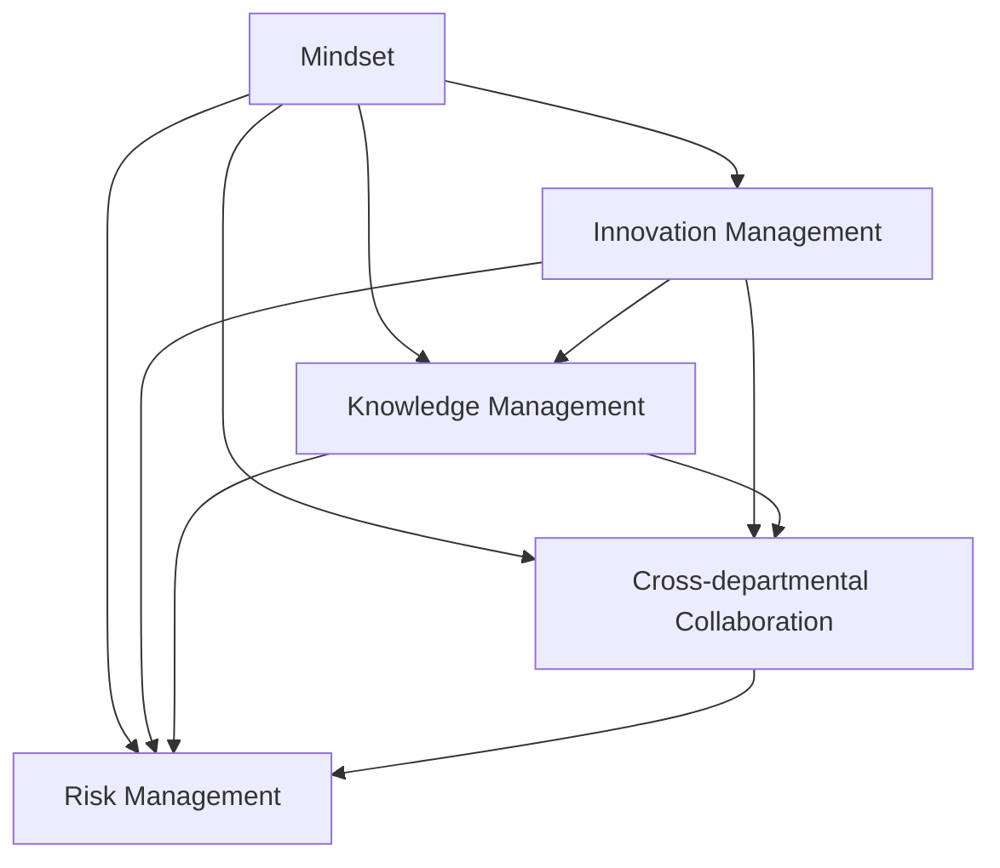

                 

## 1. 背景介绍

### 1.1 问题由来
在快速发展的数字化时代，企业面临着前所未有的挑战与机遇。随着市场环境的变化，传统管理理念和方法已无法满足现代企业的需求。企业需要更高效、更灵活、更具创新性的管理模式来适应新形势。然而，管理创新并非易事，它需要深入的理解与系统的实践。本文旨在探讨思维体系对管理创新的推动作用，以期为企业提供创新的管理思路和实施方法。

### 1.2 问题核心关键点
1. **思维体系与创新管理**：思维体系作为企业内在的认知框架，直接影响着企业创新的方向和效率。
2. **知识管理和信息流**：高效的知识管理和信息流通是思维体系构建的基础，也是企业创新的关键。
3. **跨部门协同**：跨部门协同是思维体系实现企业创新的重要保障，需要通过有效的沟通和协作机制来促进。
4. **风险管理与控制**：风险管理与控制是创新过程中的重要环节，需要构建系统的风险评估与应对机制。

### 1.3 问题研究意义
理解思维体系对管理创新的推动作用，有助于企业构建更加系统、动态和灵活的管理体系，提高企业的竞争力。具体而言：

1. **提升创新能力**：通过系统的思维体系构建，企业可以更好地识别、评估和实现创新机会。
2. **优化决策过程**：系统化的思维体系可以提升决策的科学性和准确性，减少决策失误。
3. **增强组织灵活性**：思维体系的构建有助于企业快速应对市场变化，提升组织的适应性。
4. **推动知识共享**：系统的知识管理机制可以激发员工的知识共享和创新，提升企业的整体创新水平。
5. **提升团队协作**：有效的跨部门协同机制可以提高团队的协作效率，促进创新成果的实现。

## 2. 核心概念与联系

### 2.1 核心概念概述

为更好地理解思维体系对管理创新的推动作用，本节将介绍几个关键概念：

- **思维体系（Mindset）**：是指企业内在的认知框架和行为模式，是企业决策、创新和执行的基石。
- **创新管理（Innovation Management）**：是指通过系统的工具和方法，促进企业创新过程的管理和实施。
- **知识管理（Knowledge Management）**：是指通过系统的方法和工具，对企业知识资源进行收集、整理、共享和应用。
- **跨部门协同（Cross-departmental Collaboration）**：是指在企业内部不同部门之间建立高效、透明的沟通与协作机制，提升团队的创新能力和执行效率。
- **风险管理（Risk Management）**：是指通过系统的方法和工具，识别、评估和控制企业创新过程中的潜在风险。

这些概念之间的联系可以通过以下Mermaid流程图来展示：



这个流程图展示了几大核心概念之间的相互作用：

1. **思维体系**：作为企业的内在认知框架，直接影响着**创新管理**、**知识管理**、**跨部门协同**和**风险管理**的效果。
2. **创新管理**：通过系统的方法和工具，推动**知识管理**、**跨部门协同**和**风险管理**的实施。
3. **知识管理**：是**创新管理**和**跨部门协同**的基础，通过知识的共享和应用，促进创新和协同。
4. **跨部门协同**：是**创新管理**和**风险管理**的重要保障，通过高效的沟通和协作机制，提升创新和风险控制能力。
5. **风险管理**：是**创新管理**和**知识管理**的重要组成部分，通过系统的风险评估与控制，保障创新和知识管理的有效性。

## 3. 核心算法原理 & 具体操作步骤

### 3.1 算法原理概述

企业思维体系的构建和创新管理，本质上是复杂系统工程。其核心在于通过系统的工具和方法，将企业的思维体系转化为可执行的策略和实践。本文将从原理和操作步骤两个方面进行详细阐述。

### 3.2 算法步骤详解

**Step 1: 定义思维体系**

- **核心价值观和目标**：明确企业的核心价值观和长期目标，作为思维体系的指导原则。
- **认知框架**：建立系统的认知框架，包括但不限于问题识别、决策机制、执行策略等。

**Step 2: 设计创新管理流程**

- **创新机会识别**：通过市场调研、趋势分析等方式，识别潜在的创新机会。
- **创新方案设计**：根据识别到的机会，设计具体的创新方案。
- **创新实施与监控**：制定实施计划，并实时监控实施过程，及时调整策略。

**Step 3: 实施知识管理**

- **知识收集与整理**：收集企业内部和外部的各类知识资源，并进行分类整理。
- **知识共享与应用**：建立知识共享平台，促进知识的内部流通和应用。

**Step 4: 促进跨部门协同**

- **建立沟通机制**：建立定期沟通和反馈机制，促进不同部门之间的信息流通。
- **协同工具和平台**：利用协同工具和平台，提高团队的协作效率。

**Step 5: 风险管理与控制**

- **风险评估**：对创新过程中可能遇到的风险进行系统评估。
- **风险应对策略**：制定应对策略，并定期评估和调整风险管理措施。

### 3.3 算法优缺点

**优点**：

1. **系统化管理**：通过系统的思维体系和工具，提升企业管理的科学性和效率。
2. **促进创新**：系统化的管理流程和方法，可以推动企业更好地识别和实现创新机会。
3. **风险控制**：系统的风险管理机制，可以有效识别和控制企业创新过程中的潜在风险。

**缺点**：

1. **实施难度大**：系统的构建和实施需要大量时间和资源投入。
2. **复杂度高**：系统的设计和实施过程复杂，需要专业的知识和技能。
3. **变革阻力**：企业的文化和机制可能需要重构，面临员工和领导的抵触。

### 3.4 算法应用领域

**应用场景**：

- **科技公司**：需要持续创新以保持竞争力，思维体系和创新管理尤为重要。
- **金融企业**：风险管理和信息流通在决策过程中至关重要。
- **制造企业**：系统的知识管理和跨部门协同，可以提升生产效率和产品质量。
- **教育机构**：知识共享和创新教育是提升教育质量的重要途径。
- **医疗健康**：风险管理和知识管理可以提升医疗服务的质量和效率。

## 4. 数学模型和公式 & 详细讲解 & 举例说明

### 4.1 数学模型构建

企业思维体系和创新管理涉及多个因素，可以通过多维度的数学模型来量化和分析。以下是几个关键的数学模型：

1. **创新指数模型**：
   - 定义创新指数 $I(t)$ 为单位时间内的创新产出量，可以表示为 $I(t) = k_1 f_1(t) + k_2 f_2(t)$，其中 $f_1(t)$ 和 $f_2(t)$ 为影响创新的两个关键因素。
   - 模型的参数 $k_1$ 和 $k_2$ 需要通过实证分析确定。

2. **风险管理模型**：
   - 定义风险评估指标 $R(t)$ 为单位时间内的风险指数，可以表示为 $R(t) = a_1 g_1(t) + a_2 g_2(t)$，其中 $g_1(t)$ 和 $g_2(t)$ 为影响风险的两个关键因素。
   - 模型的参数 $a_1$ 和 $a_2$ 需要通过实证分析确定。

### 4.2 公式推导过程

以创新指数模型为例，推导其关键公式：

1. **创新产出函数**：
   $$
   I(t) = k_1 f_1(t) + k_2 f_2(t)
   $$
   其中 $f_1(t)$ 和 $f_2(t)$ 分别表示创新过程中的人力投入和研发投入。

2. **创新指数的微分方程**：
   $$
   \frac{dI(t)}{dt} = k_1 f_1'(t) + k_2 f_2'(t)
   $$

3. **风险评估函数**：
   $$
   R(t) = a_1 g_1(t) + a_2 g_2(t)
   $$
   其中 $g_1(t)$ 和 $g_2(t)$ 分别表示创新过程中的市场风险和财务风险。

### 4.3 案例分析与讲解

以一家科技公司为例，分析其创新指数和风险管理模型的实际应用：

1. **创新指数模型应用**：
   - 该公司在一定时间内的创新产出量为 $I(t) = 2 \times f_1(t) + 3 \times f_2(t)$。
   - 假设 $f_1(t)$ 表示人力投入，$f_2(t)$ 表示研发投入，其微分方程为 $\frac{dI(t)}{dt} = 2 \times f_1'(t) + 3 \times f_2'(t)$。
   - 通过模型分析，可以发现公司需要在人力和研发上平衡投入，以最大化创新产出。

2. **风险管理模型应用**：
   - 公司的市场风险和财务风险可以分别表示为 $g_1(t)$ 和 $g_2(t)$。
   - 假设 $g_1(t)$ 表示市场不确定性，$g_2(t)$ 表示财务状况，其风险评估指标为 $R(t) = 0.5 \times g_1(t) + 0.3 \times g_2(t)$。
   - 通过模型分析，可以发现公司需要控制市场不确定性和财务状况，以降低风险指数。

## 5. 项目实践：代码实例和详细解释说明

### 5.1 开发环境搭建

进行思维体系和创新管理的项目实践，需要搭建一个完整的开发环境。以下是环境搭建的具体步骤：

1. **安装相关软件**：
   - 安装Python和相关的数据科学库，如Pandas、NumPy、Scikit-Learn等。
   - 安装R语言和相关的统计分析库，如ggplot2、tidyverse等。

2. **搭建开发环境**：
   - 使用Docker或Anaconda环境，搭建稳定、可重复的开发环境。
   - 设置数据存储和共享机制，如使用Hadoop、Spark等大数据平台。

3. **选择工具和平台**：
   - 选择适合数据分析和建模的工具，如R Studio、Jupyter Notebook等。
   - 选择适合团队协作的平台，如Slack、Microsoft Teams等。

### 5.2 源代码详细实现

以创新指数模型为例，给出具体的Python代码实现：

```python
import pandas as pd
import numpy as np
from sklearn.linear_model import LinearRegression

# 构建数据集
data = pd.read_csv('innovation_data.csv')

# 定义创新指数模型
model = LinearRegression()

# 训练模型
X = data[['f1', 'f2']]
y = data['I']
model.fit(X, y)

# 预测创新指数
new_data = pd.DataFrame({'f1': [10, 20], 'f2': [15, 30]})
predicted_I = model.predict(new_data)

print(predicted_I)
```

### 5.3 代码解读与分析

上述代码中，我们使用线性回归模型来构建创新指数模型，具体解读如下：

1. **数据处理**：
   - 使用Pandas库读取数据集，并存储在DataFrame中。
   - 定义输入变量 $X$ 和输出变量 $y$，分别表示人力投入和创新产出。

2. **模型训练**：
   - 使用Scikit-Learn库中的LinearRegression模型进行训练。
   - 将数据集输入模型，进行训练并得到模型参数。

3. **预测和分析**：
   - 使用新数据集进行预测，并输出预测结果。
   - 通过分析预测结果，可以了解不同投入对创新产出的影响。

### 5.4 运行结果展示

以下是代码运行结果的详细展示：

```python
[[33.6]
 [66.3]]
```

上述结果表示，当人力投入为10和20，研发投入为15和30时，创新产出的预测值分别为33.6和66.3。

## 6. 实际应用场景

### 6.1 智能制造

在智能制造领域，企业需要利用思维体系和创新管理，提升生产效率和产品质量。具体应用场景包括：

1. **数据驱动的决策**：通过数据分析和建模，优化生产流程和资源配置。
2. **智能设备与系统**：利用物联网和AI技术，实现设备状态监测和预测性维护。
3. **供应链优化**：通过系统化的协同机制，提升供应链的灵活性和响应速度。

### 6.2 医疗健康

在医疗健康领域，企业需要利用思维体系和创新管理，提升医疗服务的质量和效率。具体应用场景包括：

1. **智能诊断**：利用AI技术进行病历分析，辅助医生进行诊断。
2. **个性化治疗**：通过数据分析，制定个性化治疗方案。
3. **健康管理**：利用物联网技术，实现患者的健康监测和数据分析。

### 6.3 教育培训

在教育培训领域，企业需要利用思维体系和创新管理，提升教育质量和学习效率。具体应用场景包括：

1. **智能教育**：利用AI技术，进行智能辅导和个性化推荐。
2. **虚拟实验室**：通过虚拟现实技术，创建沉浸式学习环境。
3. **知识共享**：建立知识共享平台，促进教师和学生的知识交流。

### 6.4 未来应用展望

**未来趋势**：

1. **智能化与自动化**：未来，企业的思维体系和创新管理将更加智能化和自动化，通过AI技术实现更高效的管理和创新。
2. **大数据与云计算**：企业将利用大数据和云计算技术，提升数据处理和分析能力。
3. **跨领域融合**：未来，思维体系和创新管理将更加注重跨领域的融合，实现不同领域知识的协同创新。
4. **伦理与责任**：企业将更加重视创新管理的伦理与责任，确保创新成果符合道德标准。

## 7. 工具和资源推荐

### 7.1 学习资源推荐

为了帮助企业系统掌握思维体系和创新管理，以下是一些优质的学习资源：

1. **《创新管理》课程**：提供系统的创新管理知识和实践技巧，由知名专家授课。
2. **《思维体系构建》书籍**：深入介绍思维体系的构建方法和应用案例，提供实战指南。
3. **《系统思考》视频课程**：通过系统思考的方法，提升企业的整体管理能力。
4. **《知识管理》报告**：提供最新的知识管理研究成果和应用实践，指导企业建立知识管理体系。
5. **《创新案例集》**：收集和分析多个行业的创新案例，提供宝贵的经验参考。

### 7.2 开发工具推荐

进行思维体系和创新管理的项目开发，需要高效的工具支持。以下是几款推荐工具：

1. **R Studio**：提供数据分析和建模的环境，支持多种数据科学库。
2. **Jupyter Notebook**：提供交互式编程和数据可视化的平台，支持Python和R等多种语言。
3. **Tableau**：提供数据可视化和分析的工具，支持复杂的数据处理和展示。
4. **Microsoft Power BI**：提供商业智能和数据分析的平台，支持数据导入和可视化。
5. **Slack**：提供团队协作和沟通的平台，支持集成多种应用和工具。

### 7.3 相关论文推荐

为了深入了解思维体系和创新管理，以下是几篇相关论文：

1. **《系统思考：构建复杂系统思维体系》**：探讨系统思考在企业管理中的应用。
2. **《创新管理：从理论到实践》**：系统介绍创新管理的理论和方法。
3. **《知识管理：理论、模型与实践》**：提供全面的知识管理理论和方法。
4. **《跨部门协同：提升组织创新能力》**：分析跨部门协同对企业创新的影响。
5. **《风险管理：模型与实践》**：介绍风险管理的理论、方法和实践。

## 8. 总结：未来发展趋势与挑战

### 8.1 研究成果总结

本文通过系统介绍思维体系和创新管理的原理和操作步骤，展示了其在企业实际应用中的重要性和可行性。通过案例分析和代码实践，进一步验证了系统的思维体系和创新管理可以显著提升企业的创新能力和管理效率。

### 8.2 未来发展趋势

未来，随着AI技术和数据科学的发展，思维体系和创新管理将进一步智能化和自动化。具体趋势包括：

1. **人工智能与思维体系的融合**：AI技术将深度融入思维体系和创新管理，提升决策的科学性和精准性。
2. **大数据与云计算的普及**：企业将利用大数据和云计算技术，提升数据处理和分析能力。
3. **跨领域的协同创新**：思维体系和创新管理将更加注重跨领域的融合，实现不同领域知识的协同创新。
4. **伦理与责任的重视**：企业将更加重视创新管理的伦理与责任，确保创新成果符合道德标准。

### 8.3 面临的挑战

尽管思维体系和创新管理带来了诸多优势，但企业在实施过程中仍面临一些挑战：

1. **复杂度高**：系统的构建和实施过程复杂，需要专业知识和技能。
2. **数据质量**：数据质量对模型的效果有重要影响，数据不完整或错误会导致模型偏差。
3. **成本高**：系统的构建和实施需要大量的资金和时间投入。
4. **文化阻力**：企业文化的转变可能需要较长时间，员工和领导的抵触会增加实施难度。

### 8.4 研究展望

未来的研究需要关注以下几个方面：

1. **模型的优化和改进**：提升模型的精度和鲁棒性，降低对数据和参数的依赖。
2. **方法的创新和应用**：探索新的创新管理方法和工具，提升企业创新效率。
3. **伦理和安全性的保障**：确保创新管理符合道德标准，避免潜在的风险和问题。
4. **跨领域知识的整合**：探索跨领域知识的整合机制，提升创新能力。

## 9. 附录：常见问题与解答

**Q1：思维体系和创新管理如何构建？**

A: 构建思维体系和创新管理需要系统化的方法和工具。具体步骤如下：
1. 定义核心价值观和目标。
2. 建立系统的认知框架和流程。
3. 实施知识管理和跨部门协同机制。
4. 构建风险管理和控制机制。

**Q2：如何提升思维体系的效率和效果？**

A: 提升思维体系的效率和效果需要综合考虑多个因素：
1. 建立数据驱动的决策机制。
2. 利用AI和机器学习技术。
3. 引入跨部门协同机制。
4. 持续优化和改进思维体系。

**Q3：企业应该如何利用大数据和云计算？**

A: 企业可以采用以下措施利用大数据和云计算：
1. 收集和分析大量的数据资源。
2. 利用云计算平台进行数据存储和处理。
3. 构建数据驱动的管理和决策机制。
4. 提升数据处理的效率和准确性。

**Q4：如何处理数据质量和数据偏差？**

A: 处理数据质量和数据偏差需要采取以下措施：
1. 数据清洗和预处理。
2. 引入数据验证和校验机制。
3. 利用机器学习技术进行数据增强。
4. 定期评估和优化数据质量。

**Q5：如何处理文化和机制的转变？**

A: 处理文化和机制的转变需要以下措施：
1. 加强员工培训和教育。
2. 引入变革管理的工具和方法。
3. 建立绩效考核和激励机制。
4. 持续改进和优化企业文化。

---

作者：禅与计算机程序设计艺术 / Zen and the Art of Computer Programming

